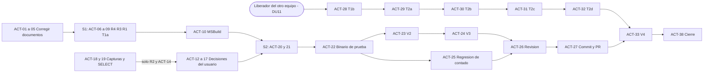

# Actividades pendientes — migración del crédito web a ServicioSAP
> 2026-10-01: cómo funciona ServicioSAP hoy está en [[Business Rules Ecommerce]] (fuente única). Este documento queda como plan; si contradice a esa fuente, gana la fuente.

> [!abstract] Para qué sirve este documento
> Reúne en una sola tabla (§5) todo lo que falta **decidir, desarrollar, probar, coordinar, desplegar y documentar** para dar por terminada la migración del crédito web de LAN a ServicioSAP, con responsable, dependencias y criterio de terminado. Se puede entregar tal cual a un gerente o al equipo. Sale de una re-verificación, regla por regla, del código actual contra LAN, sus SP y el DMZ. El detalle técnico de cada punto está en [[CREDITO_WEB_ANALISIS_COMPLETO_Y_PLAN_FINAL]] (en adelante, **el documento principal** o **DOC**).

---

## 1. Resumen ejecutivo

- **Ya migrado.** Una orden a crédito que llega a ServicioSAP ya guarda la **solicitud** con el mismo INSERT y los mismos valores que el SP de LAN, ya guarda sus **líneas** (artículos y envío SEGU00001) y ya calcula la **validación telefónica** con fuentes SAP. De los SP y sub-SP de LAN, el alta de solicitud y de líneas quedó **migrada**; datos del cliente, teléfono validado, costo y precio quedaron **reemplazados** por fuentes SAP o por decisión; cupón, DIMAS MX y `validateCredit` quedaron **deprecados**, y el staging queda fuera mientras se confirma P9 (§4).
- **Avance por reglas** (160 reglas de LAN; "cerrada" = igual a LAN, igual con la fuente SAP decidida, hecha o deprecada): Elegibilidad **36 %** · Cabecera **75 %** · Validación telefónica **52 %** · Líneas **65 %** · Después del alta **28 %** · **Total 54 % (86 de 160)**.
- **Lo que falta** (74 reglas): 46 esperan una **decisión del usuario** (la mayoría se cierra confirmando la recomendación, sin tocar código; las que sí llevan código son sobre todo las compuertas "sin fila", P1), 8 esperan **desarrollo** ya listo para Fable (R1, R3, R4, T1a), 6 esperan **pruebas o capturas** y 14 esperan **a otro equipo**.
- **Lo único que bloquea es el liberador** (DU11): el otro equipo lo está construyendo. Sin él no se puede encender el liberador ni el aviso a Magento (T1b), ni hacer `creditStatus`, `updateCreditOrderId`, el control de duplicados y el cambio del DMZ (T2a-T2d), ni la prueba de punta a punta (V4). **Todo lo demás se puede hacer ya.**
- **Tres riesgos inmediatos**: la tarea R4 del plan, aplicada tal como está escrita, desharía DU13 (nombre con segundo nombre); la línea base que Fable comprueba (+126/−44) ya no cuadra (hoy +161/−64) y Fable se detendría; y el `ServicioSap.dll` del share es anterior a los cambios del 2026-09-30, así que una prueba hoy no probaría el código actual.
- **Nada está en commit** todavía (4 archivos modificados en la rama `SpExportaEcommerce`).

### 1.1 Avance por grupo de reglas (detalle del cálculo)

| Grupo de reglas | Reglas | Cerradas | Avance | Esperan decisión | Esperan desarrollo | Esperan prueba | Esperan otro equipo |
|---|---|---|---|---|---|---|---|
| G1 Elegibilidad (quién recibe solicitud) | 25 | 9 | **36 %** | 13 | 0 | 0 | 3 |
| G2 Cabecera (`CRED_SOLICITUD_WEB_DATOS_TEMP`) | 40 | 30 | **75 %** | 7 | 2 | 1 | 0 |
| G3 Validación telefónica | 23 | 12 | **52 %** | 5 | 3 | 2 | 1 |
| G4 Líneas (`VTASdArtCreditoWeb`) | 40 | 26 | **65 %** | 11 | 0 | 3 | 0 |
| G5 Después del alta (liberador, aviso, estatus, duplicados) | 32 | 9 | **28 %** | 10 | 3 | 0 | 10 |
| **Total** | **160** | **86** | **54 %** | **46** | **8** | **6** | **14** |

Cómo se calculó: estado de cada regla en la re-verificación del 2026-10-01. **Cerrada** = IGUAL a LAN, IGUAL con fuente SAP, HECHO o DEPRECADO. Una regla igual a LAN que todavía espera una confirmación (por ejemplo P12 en G1-09, G1-10, G1-24, G2-38 y G2-39) cuenta como "espera decisión". Los hallazgos nuevos no son reglas y no entran en el conteo. Son 160 porque se suman las 149 filas de la MATRIZ y las 11 reglas nuevas del 2026-09-30 (DOC §3). G5 sale bajo porque casi todo lo que queda ahí depende del liberador.

---

## 2. Glosario corto

| Término | Qué quiere decir aquí |
|---|---|
| **LAN** | La API anterior (`LAN/WebApiMagento`) con sus SP en Intelisis y ServicioAndroid. Es la referencia: ServicioSAP tiene que hacer lo mismo. |
| **ServicioSAP** | La API nueva. El crédito web entra por `POST order/new`. |
| **SP / sub-SP** | Procedimiento almacenado de SQL Server / un SP que se llama desde otro SP o desde el código del crédito (por ejemplo `spVerCosto` dentro del SP de líneas). |
| **Solicitud / cabecera** | La fila de la solicitud de crédito en `CRED_SOLICITUD_WEB_DATOS_TEMP` (ServicioAndroid): 59 columnas con los datos del cliente y de la orden. Su `id` es el **folio**. |
| **Líneas** | Las filas de `VTASdArtCreditoWeb`, una por artículo (cantidad, precio, abono, costo), ligadas al folio. |
| **SEGU00001** | Artículo especial que representa el envío. Se agrega como una línea más (cantidad 1, precio = costo de envío, abono 12) cuando el envío es mayor que 0. |
| **Liberador** | Servicio del otro equipo (Valentín) que recibe la solicitud, la analiza y responde EN_ANALISIS o RECHAZADO. Después ServicioSAP **avisa a Magento** (el "aviso" o *callback*). Está en desarrollo (DU11). |
| **Prospecto** | Persona que aún no es cliente formal. En SAP, `ZtipoCliente = 'Prospecto'`. Un prospecto no pasa a validación telefónica ni al liberador. |
| **Compuerta "sin fila"** | Caso en que LAN **no escribía** la solicitud porque un dato venía vacío o mal (por ejemplo, un teléfono demasiado corto). Hoy ServicioSAP sí la escribe con `''` o `'0'`. Si se copian, es la decisión P1. |
| **SD29** | Servicio OData de SAP con la lista de precios (`PropreListSet`). De ahí salen el precio y el abono de cada línea. |
| **BP** | *Business Partner*: el número de cliente en SAP (10 dígitos). Magento manda el BP en `cuenta` (DU2). **BP05MA** es la consulta de sus datos maestros (nombres, fecha de nacimiento, RFC, sexo, estado civil). |
| **DMZ** | API puente entre Magento y los servicios internos. Solo reenvía; no decide reglas. |
| **Paridad (DU5)** | Cada columna guarda exactamente lo que guardaban LAN + SP, incluso NULL contra `''` y los valores por defecto. |
| **DU / P / R / T / V / S** | DU = decisión del usuario ya tomada · P = decisión pendiente · R = tarea de código lista · T = tarea que depende de otro equipo · V = verificación o prueba · S = sesión de trabajo de **Fable** (sesión de Claude que aplica el plan). |
| **Sin commit / MSBuild** | Los cambios están en los archivos del share, pero no en git. MSBuild es la compilación completa del proyecto: compilar no es lo mismo que probar. |

**Abreviaturas de las referencias** (rutas relativas a `\\172.16.214.58\sap`): **OM** = `ServicioSAP/ServicioSap/ServicioSap/Methods/Order/OrderMethods.cs` · **SCW** = `…/Methods/Credit/SolicitudCreditoWebMethods.cs` · **SCM** = `…/Models/SAP/Credit/SolicitudCreditoWebModels.cs` · **FLP** = `…/Methods/SalesDistribution/FinalListProperMethods.cs` · **ICR** = `…/Models/SAP/Order/InfoClienteRequest.cs` · **OC** = `…/Controllers/OrderController.cs` · **BPM** = `…/Methods/BusinessPartner/BusinessPartnerMethods.cs` · **LIB** = `…/Methods/Credit/LiberadorCreditoMethods.cs` · **PCC** = `…/Helpers/PaymentConditionCatalog.cs` · **LOM / LCM / LOC / LLIB** = `LAN/WebApiMagento/` `Metodos/OrderMethods.cs`, `Metodos/CreditMethods.cs`, `Controllers/OrdersController.cs`, `Metodos/LiberadorCreditoMethods.cs` · **SPD / SPC / SPL / SVC / SDP / SCU** = `.agents/skills/lan-sap-migration/SPsOrden/` `SP_CREDITO_WEB_DATOS.sql`, `SpCREDIDatosSolicitudCreditoArt.sql`, `SpVTASInsertArtSolCreditoLinea.sql`, `spVerCosto.sql`, `SpVTASeCommerceDetPedidos.sql`, `SpVTASVentaCupon.sql` · **DMZ** = `DMZ/WebApiMagento/` · **DOC** = [[CREDITO_WEB_ANALISIS_COMPLETO_Y_PLAN_FINAL]].

---

## 3. Lo que ya está hecho

**Estado del código al 2026-10-01:** rama `SpExportaEcommerce`, HEAD `2cf425f`, 4 archivos modificados **sin commit** (OM, SCW, FLP, ICR; +161/−64), finales de línea CRLF y BOM correctos. Compila con el chequeo rápido y con MSBuild (2026-10-01, salida en una carpeta temporal; `bin` y `obj` del share sin tocar). **No se ha probado contra SAP ni de punta a punta.**

| # | Cambio | Qué hace (en simple) | Dónde en el código | Decisión |
|---|---|---|---|---|
| 1 | Solo BP existente (E1) | Si la cuenta viene vacía o el BP no existe, responde `sin cuenta` y no escribe nada. Se quitaron las rutas de cliente nuevo e invitado | OM:643-651 (compuerta :647, error :650); devuelve el BP en OM:722 | DU6 |
| 2 | Cabecera con los valores del pedido (E2) | Correo, dirección, condición, `utmSource` y método de envío pasan tal cual (NULL si llegan NULL); origen = el de Magento o `PRODUCTOS MX`; UEN 2 solo con `storeId 'viu'` | OM:750-812 (uen :754, origen :797); ICR:69-74 | DU5, DU7 |
| 3 | INSERT idéntico al SP (E3) | Mismo texto SQL que `SP_CREDITO_WEB_DATOS`: fecha `GETDATE()` en SQL, `confirmado` 1, `ISNULL` del monedero, 59 columnas y los mismos anchos | SCW:38-160; parámetros SCW:171-228 | DU8 |
| 4 | Sexo y estado civil del BP (E4) | Traduce los códigos SAP a los textos de LAN (Masculino/Femenino; Soltero, Casado…) | SCW:250 y :570-592; SCW:265 y :597-609 | DU10 |
| 5 | Precio de las líneas desde SD29 (E5) | Busca precio y abono por artículo + organización de ventas + condición; corrige los SKU con `+` | FLP:82-135; OM:928, :1014-1036 | Fuente SD29 decidida el 2026-09-11; **falta ratificar** (P20) |
| 6 | Sin mayúsculas forzadas | Se guarda el valor del BP tal cual: LAN nunca convertía a mayúsculas en este flujo | SCW:240-265 (sin cambio de código) | DU12 |
| 7 | Nombre completo | `nombre` = primer + segundo nombre de pila del BP, cortado a 25 | SCW:244-246 (ancho en :173) | DU13 |
| 8 | Costo de las líneas en NULL | No hay fuente de costo en SAP; se guarda NULL | OM:987-989 | DU14 |
| 9 | Condición nula o sin equivalente como LAN | Sin condición: cabecera sin líneas. Condición desconocida: no se insertan artículos, sí SEGU00001, y la orden sigue | OM:848-854, :906-919; el error se atrapa en OM:676-682 | DU15 |
| 10 | Cupón del promotor fuera del crédito | Ya no se "quema" el cupón al crear la solicitud; el método queda para `order/validatecupon` | OM:673-674; OC:102-120 | DU16 |
| 11 | Bitácora como LAN | Se quitaron `[CREDITO SIN CUENTA]` y el log de `ObtenerTelefonoAValidar`; se agregó a archivo el error de SMS; se conserva `[CREDITO SD29 FILTRO]` | OM:611; OM:649 (solo comentario); SCW:370-374; OM:1032 | DU17 |
| 12 | Estado civil por defecto al crear un BP | `Marst` '1' (Soltero) en los dos lugares donde ServicioSAP crea BP | OM:2688; BPM:486 (ya era '1') | DU18 |
| 13 | SIGMavi por `Conexion.dll` | Sin cambio de código: se confirma la conexión actual | `Helpers/ConexionDB/ConexionSQL.cs:19`, :72-98 | DU19 |
| 14 | Validación telefónica con fuentes SAP | Mismo cálculo de tres valores del SP, con `A_GET_TelefonoValidado`, CteTelSet y el catálogo AWS de 23 orígenes | SCW:321-337, :389-409, :411-539 | DU3, DU4 |
| 15 | Líneas por INSERT directo (sin SP) | Una fila por artículo, salta el SKU repetido, deja huecos en `Orden` como LAN, aplica CEILING con descuento y agrega SEGU00001 | OM:826-1006 (SEGU00001 :906-911) | DU5 |
| 16 | Compilación | Chequeo rápido (221 fuentes, exit 0) y MSBuild (exit 0) del código actual | — | V1 (hay que repetirla después de S1) |

---

## 4. Mapa de SPs y sub-SPs de LAN → estado en ServicioSAP

**Estados:** **Migrado** (hace lo mismo) · **Reemplazado** (misma regla con fuente SAP o por decisión) · **Deprecado** (el usuario lo dio de baja) · **No se porta** (por decisión, o porque no tenía efecto) · **Falta** (todavía no existe).

| Pieza de LAN | Qué hacía en LAN | Qué hay en ServicioSAP | Estado | Qué falta |
|---|---|---|---|---|
| **A. Entrada y preparación** | | | | |
| `OrdersController.Set` → `SetPedido` (LOC:137-161) | Recibe la orden y responde la cuenta | OC `SetOrder` (OC:16-48) → OM `SetOrderAsync` | Migrado; el cuerpo de la respuesta es otro (aceptado por R4/09-26) | Confirmar P12 (ACT-13) |
| `AgruparCantidadPorSKU` + `ToArray` (LOM:486-526, :340-440) | Agrupa artículos por SKU y arma el arreglo de 39 datos | OM:87 y OM:198 (llamadas OM:1753, :1758) | Migrado | Compuertas P1 (ACT-12) |
| `obtenerIdVenta` sobre `IntelisisTmp.Venta` (LOM:1602-1643) | Detecta una orden repetida | SD36 por `PurchNoC` (OM:1764-1776) | Reemplazado, pero **nunca ve una orden de crédito** | T2c (ACT-31) |
| `SpVTASeCommerceDetPedidos` Limpiar/Insertar (SDP:12-162; TELEFONIA dentro) | Copia de partidas para otros procesos | No existe (OM:527; R7/09-26) | No se porta (por confirmar) | P9 (ACT-13) |
| `SaveGuide` en SQLite (LOM:735-754) | Guarda la guía de la orden | `SaveGuideAsync` (OM:533-553) | Migrado | — |
| Último SMS: `TcAAEA00030` + `VTASDCodigoVerificacioneCommerce` (LOM:819-852) | Número al que se mandó el último SMS | `ObtenerNumeroTablaSmsAsync` (OM:589-614) | Migrado | Etiqueta del log (ACT-15) |
| `IsValidated` sobre CteTel (LOM:786-817) | Teléfono móvil validado del cliente | `IsValidatedAsync` (OM:622-634) → `A_GET_TelefonoValidado` (SCW:485-528) | Reemplazado | R1 (ACT-08) |
| `IsInTableStd` sobre TablaStD (LCM:1967-1989) | Calculaba `ValidacionTelefono` en C# | — | No se porta: el SP lo recalculaba siempre | — |
| **B. `ProductosCreditoWeb_SaveData` (LCM:94-262)** | Orquesta la solicitud | `ProcessCreditPaymentAsync` (OM:639-729) | Migrado, sin liberador | T1b (ACT-28) |
| `SpCREDIDatosSolicitudCreditoArt` `CheckCliente` (SPC:37-51) | ¿Existe la cuenta? | `CheckClientCreditAsync` con ZB_DATOS_CLIENTE (OM:731-744) | Reemplazado | Log ante caída de SAP (ACT-15) |
| `SpCREDIDatosSolicitudCreditoArt` `GetSaldo` + `checkSaldo` (SPC:80-122; LCM:766-802) | Calculaba el saldo y **descartaba** el resultado | — | No se porta (no tenía efecto) | Confirmar P17 (ACT-13) |
| `SpCREDIDatosSolicitudCreditoArt` `GetInfo` (SPC:53-78) | Datos del cliente desde CTE | `ObtenerMaestroAsync` con BP05MA (SCW:377-387) + `ArmarFila` (SCW:236-314) | Reemplazado | R4 (ACT-06) |
| **C. `SP_CREDITO_WEB_DATOS` (SPD)** | | | | |
| Operación `Insert` (SPD:223-348) | INSERT de 59 columnas y folio | `InsertarSolicitudAsync` (SCW:162-234) | Migrado (mismo texto SQL) | Probar (ACT-23) |
| `@ValidacionOrigen`: TablaStD ⋈ CteTel (SPD:185-191) | Origen del teléfono validado | CteTelSet + catálogo AWS (SCW:401-405, :411-483, :530-539) | Reemplazado | R2-V y R2 (ACT-18, ACT-13) |
| `@TelefonoValidado` (SPD:193-202) | Móvil validado más reciente | `A_GET_TelefonoValidado` (SCW:394) | Reemplazado | R3 (ACT-07) |
| `@TelefonoAValidar` (SPD:204-208) | Último SMS por cliente | `ObtenerTelefonoAValidarAsync` (SCW:339-375) | Migrado | — |
| IF de `ValidacionTelefono` + prospecto por prefijo `'P'` (SPD:210-221) | ¿Hay que validar el teléfono? | SCW:321-337; prospecto por `ZtipoCliente` (SCW:541-551) | Reemplazado | Confirmar P16 (ACT-13) |
| DIMAS MX: `CREDICCondicionArt` (SPD:174-183) | Condición y artículo especiales | — | Deprecado | Registrar P4 (ACT-03) |
| Operaciones `Update` e `InsertReferencia` (SPD:351-622) | Credilana y referencias | — | Fuera de este flujo | Avisar a Dev 3 si porta M-13 (ACT-35) |
| **D. Líneas: `SpVTASInsertArtSolCreditoLinea` (SPL; LCM:869-919)** | | | | |
| INSERT por el linked server (SPL:208, :243) | Una fila por artículo | INSERT directo con la conexión Android (OM:826-1006, INSERT OM:861-877) | Migrado | Permiso INSERT de `usrintranet` (ACT-19) |
| SEGU00001 (SPL:179-217) | Línea de envío | OM:906-911 | Migrado | P8 (d) (ACT-14) |
| `spVerCosto` 96/MAVI/PESOS con `xpVerCosto`, `spMoneda`, `spArtUnidadFactor`, `spUnidadFactor` (SVC:10-193) | Costo del artículo | `costo` NULL (OM:987-989) | Reemplazado por decisión (DU14) | Pregunta Q-T1-4 al liberador (ACT-11) |
| Precio y abono: `PropreListaDFinal` ⋈ `VTASCCondicionesCredVtaLinea` (SPL:243-262) | Precio por condición y SKU | SD29 (FLP:82-135; OM:1014-1036) + `GetCondicionAsync` (OM:3343-3375: SIGMavi y luego catálogo PCC) | Reemplazado | P7, P20, Q6 (ACT-14, ACT-13, ACT-19) |
| TELEFONIA Region5/Region6 (`Art.Familia`, `VTASCRegionSku`, `VTASCCodigoPostalRegionCelular`, `eCommerceExist`, `VTASDEcommerceExportaArtExistencia`) (SPL:43-165) | Cambia el SKU según región y existencia | — | No se porta (diferido por el negocio, Q17) | P10 (ACT-13, ACT-36) |
| **E. Después del alta** | | | | |
| `SpVTASVentaCupon` `Elimina` + `NUEVO` (SCU:52-165) | Quema y regenera el cupón del promotor | Quitado del crédito (OM:673-674) | Deprecado (DU16) | Avisar a Magento/Javier (ACT-35) |
| Liberador: token + `POST /api/venta` (LLIB:40-101; LCM:208-241) | Manda la solicitud a análisis | LIB:41-107; `LiberateClientCredit` (OM:1188-1200); la llamada está comentada (OM:684-720) | **Falta** (bloqueado, DU11) | T1b (ACT-28) |
| `CallMagentoAuthorizationCallback` (LOM:1751-1833) | Avisa a Magento el resultado | `CallMagentoAuthorizationCallbackAsync` (OM:1205-1293) sin llamador y con llaves que el DMZ no entiende | **Falta** | T1a (ACT-09) |
| `creditStatus`: 3 SELECT a `Venta` (LOC:484-504; LOM:1867-1996) | Magento consulta el estado | Sin ruta; el DMZ va a LAN (DMZ `Controllers/OrdersController.cs:467`) | **Falta** (bloqueado) | T2a, T2d (ACT-29, ACT-32) |
| `updateCreditOrderId`: 3 UPDATE a `Venta` y `eCommerceDetPedidos` (LOC:506-533; LOM:1998-2061) | Renombra `CRED…` al número real | Sin ruta; el DMZ va a LAN (DMZ `Controllers/OrdersController.cs:411`) | **Falta** (bloqueado) | T2b, T2d (ACT-30, ACT-32) |
| `UpdateIdEcommerceEnVenta` (LOM:666-671, :1837-1863) | — | — | No se porta: **código muerto en LAN** (su condición nunca se cumple) | Quitarlo de las listas (ACT-03) |
| `getOrderInfoAndSet` / `ReSetPedido` (LOC:436-443; LOM:1645-1710) | Reproceso manual de soporte | — | Retirar (recomendado) | P11 (ACT-13) |
| `validateCredit` (LOC:455-482) | Variante que nadie llama | — (comentada en el DMZ) | Deprecado | Avisar a Dev 2 (ACT-35) |
| **F. Antes del checkout y conexiones** | | | | |
| `credit/getSms`, `credit/validateSms` | Crean las filas de SMS que lee la orden | Rutas ya hechas (SS `Controllers/CreditController.cs:30`, :53) | Migrado en ServicioSAP; **el DMZ aún va a LAN** (DMZ `Controllers/CreditController.cs:76`, :107) | ACT-34 |
| `SP_eCommerceCtenuevo` (alta de cliente web) | Crear clientes | — | No aplica: el crédito no crea clientes (DU6); solo aportó el default `1900-01-02` (Q11) | — |
| `CodigoRecomendador` (columna) | LAN no lo mandaba en este flujo | Queda NULL | Deprecado | — |
| Conexión a SIGMavi (LAN `Conn/Connection.cs:30`) | Cadena propia | `obtenerConexionSigMaviAsync` con `Conexion.dll` (ConexionSQL.cs:72-98) | Reemplazado (DU19) | Alias para QA/Prod (ACT-37) |

---

## 5. Plantilla de actividades pendientes

**Cómo leer la tabla.**
- **Estado:** **Listo para empezar** = no espera nada; **Pendiente** = espera otra actividad de esta lista o una respuesta del usuario; **Bloqueado** = espera a otro equipo (el liberador).
- **Prioridad:** **Alta** = está en la ruta crítica o desbloquea a otros; **Media** = necesaria para cerrar, sin bloquear; **Baja** = limpieza o se necesita más adelante.
- **Responsable:** Usuario = quien dirige la migración; Fable = sesión de Claude que aplica el plan (S1-S4). Una flecha (→) indica quién entrega primero y quién sigue.
- Toda escritura en bases, BP01 o el liberador necesita el visto bueno explícito del usuario. Fable prepara comandos y SELECT; el usuario los ejecuta. Sin commit hasta que el usuario lo pida.

| ID | Actividad | Tipo | Detalle (qué y por qué) | Responsable | Depende de | Estado | Prioridad | Criterio de terminado | Referencia |
|---|---|---|---|---|---|---|---|---|---|
| ACT-01 | Corregir la tarea R4 del plan para que no deshaga DU13 | Documentar | R4 paso 2 dice `fila.Nombre = maestro.NameFirst ?? ""`. Aplicado al pie de la letra, borraría el segundo nombre que agregó DU13. Hay que reescribirlo para quitar solo la rama muerta y conservar la unión de `NameFirst` + `Namemiddle`, y volver a citar las líneas de R4 (se movieron +4) | Fable (con visto bueno del usuario) | — | Listo para empezar | Alta | DOC §6.2.1 trae la línea con `string.Join(" ", new[] { maestro.NameFirst, maestro.Namemiddle }…)` y cita SCW:244-246, :248, :249, :250, :256, :265, :285, :291 y OM:769-774, :789 | DOC §6.2.1 (DOC:563) y §8 (DOC:1275); SCW:244-246 |
| ACT-02 | Actualizar la línea base y las citas de línea del plan | Documentar | El plan y los prompts de Fable esperan "4 archivos, +126/−44" y le piden detenerse si no cuadra; hoy es +161/−64. También se movieron líneas: R1 (OM:627, :655), R3 (SCW:27; lecturas :394, :401, :406), T1a (OM:1205-1293), rama de crédito (OM:1802; guía :1804), compuerta (OM:647, :650), P1 A1-A5 (OM:654-658, :666, :784, :798) y el atajo de SCW:396-399 | Fable | — | Listo para empezar | Alta | DOC §5, §5.1, §6.2, §6.3.2, §6.4.1, §6.6 y §8 dicen +161/−64 y las líneas actuales; Fable puede arrancar S1 sin detenerse | DOC:410, :426, :1134, :1242, :1278 |
| ACT-03 | Llevar DU11-DU19 a todos los documentos y corregir textos desactualizados | Documentar | DU11-DU19 solo están en DOC §4.5. Faltan en CAMBIOS §2/§3 y MATRIZ §3, y DOC (§1, §2 paso 17, §3, §5.2, §6.0, §6.1, §6.3) aún muestra P2, P3, P5, P6, P8, P13, P14 y P15 como pendientes. Además: corregir DU14 (LAN guardaba NULL solo para artículos sin método de costeo, así que es una **diferencia aceptada**, no paridad), G3-22 (`ZidcteTel` se compara como número), G4-40 (ahora queda cabecera + SEGU00001), DOC §6.4.1 T1b (el punto "después del cupón" ya no existe: el cupón salió del crédito con DU16), G5-32 (el DMZ sí guarda el request completo: DMZ `Controllers/OrdersController.cs:114`, :194), quitar `UpdateIdEcommerceEnVenta` de la lista de bloqueados (código muerto en LAN) y registrar P4 = A (DIMAS MX deprecado, decisión vigente del usuario) | Fable | — | Listo para empezar | Media | `DU1[1-9]` aparece en CAMBIOS y MATRIZ; DOC §6.1 ya no tiene esas P como DECISION; filas G1-10, G1-14, G2-06…G2-22, G3-03, G3-12, G4-24, G4-29…G4-37 y G4-40 al día; `.md` sin BOM y con CRLF | DOC §1, §3, §4.5, §6.1; CAMBIOS §2-§4.2; MATRIZ §3; LOM:344, :580, :666-671 |
| ACT-04 | Ajustar los valores esperados de las pruebas V2 y V3 | Documentar | Con DU13-DU17 cambian los esperados: `nombre` con segundo nombre, `costo` NULL, ya no aparece `[CREDITO SIN CUENTA]`, condición desconocida (N4/N5) → solo SEGU00001, y falta el caso **N6** (artículo sin condición → cabecera con condición NULL y 0 líneas). Agregar a los avisos aceptados de MSBuild: MSB3245, MSB3247 y MSB3270 | Fable | — | Listo para empezar | Alta | DOC §6.5.2 (Q3) y §6.5.3 traen los esperados nuevos y el caso N6; §6.5.1 lista los tres avisos | DOC §6.5.1-§6.5.3; OM:848-854, :906-919, :987-989 |
| ACT-05 | Corregir los escenarios de crédito del plan de pruebas | Documentar | Describen el flujo viejo (cliente nuevo, solvencia por línea de crédito) y un ejemplo con cuenta `C…` y datos de contacto que parecen reales. Reemplazarlos por los payloads ficticios de V2/V3, sin datos personales | Fable | — | Listo para empezar | Media | Sin cuentas `C…` ni datos de contacto reales; los escenarios son los de V2/V3 con marcadores `<<…>>` | `.agents/skills/lan-sap-migration/Resources/master_test_plan.md:38-46`, :105-107 |
| ACT-06 | Aplicar R4: guarda "sin maestro" y limpieza de ramas muertas | Desarrollar | Agrega `if (maestro == null) throw new Exception("sin cuenta")` después de SCW:25 y quita las ramas `maestro != null ? … : req.X` que ya no pueden ocurrir, `fila.Confirmado` y dos propiedades sin uso. No cambia ningún valor guardado | Fable (S1) | ACT-01, ACT-02 | Pendiente | Alta | `maestro != null` en SCW = 0; `nombre` conserva `Namemiddle`; chequeo rápido en verde; CRLF y sin BOM | DOC §6.2.1; SCW:25, :240-291; SCM:220, :222; OM:769-774, :789 |
| ACT-07 | Aplicar R3: validación telefónica con el BP del maestro | Desarrollar | SCW:27 pasa `maestro.Partner` en lugar de la cuenta cruda, como LAN usaba `CTE.Cliente` del maestro. Hoy no cambia el resultado porque cuenta = BP | Fable (S1) | ACT-06 | Pendiente | Alta | Diff de 1 línea; las tres lecturas (SCW:394, :401, :406) reciben el mismo valor que se guarda en `cliente` (SCW:285); chequeo rápido | DOC §6.2.2; SCW:27 |
| ACT-08 | Aplicar R1: número a validar como LAN | Desarrollar | Quita el `Trim` (OM:627) y usa `IsNullOrEmpty` (OM:655): en LAN un valor de solo espacios sí contaba. Es requisito de la compuerta de teléfono de P1 | Fable (S1) | ACT-02 | Pendiente | Alta | Diff de exactamente 2 líneas; `IsNullOrWhiteSpace(numeroDelSms` = 0 en OM; se cumple la tabla de casos de DOC §6.2.3 | DOC §6.2.3; OM:627, :655 |
| ACT-09 | Aplicar T1a: aviso a Magento y logs del liberador como LAN | Desarrollar | El aviso manda hoy `entity_id`, `customer_account` y `credit_request_id`, que el DMZ no reconoce. Se cambia a `{entityId, status, cuenta, idSolicitud}` con Newtonsoft, sin el handler que acepta cualquier certificado, con logs a archivo y el log DEFINITIVO. No tiene llamador todavía: no cambia nada en ejecución | Fable (S1) | ACT-02 | Pendiente | Alta | En OM:1205-1295 no quedan esas llaves, ni `HttpClientHandler`, ni `Console.WriteLine`; LIB sin `Console.WriteLine`; chequeo rápido | DOC §6.2.4; OM:1188-1293 (payload :1262-1268, handler :1228-1229); LIB:54, :94, :98, :104; DMZ `Models/CreditRequest.cs:212-218` |
| ACT-10 | Cerrar S1 con la compilación completa (V1) | Probar | Chequeo rápido y MSBuild después de R4, R3, R1 y T1a, sin escribir en `bin` ni `obj` del share, y revisión de CRLF y BOM de cada archivo. El MSBuild del 2026-10-01 pasó para el código actual; hay que repetirlo con los cambios de S1 | Fable (S1) | ACT-06, ACT-07, ACT-08, ACT-09 | Pendiente | Alta | Chequeo rápido exit 0; MSBuild exit 0 con la línea `ServicioSap -> …ServicioSap.dll` y solo avisos aceptados; `git ls-files --eol` = `w/crlf`; la fecha de `bin\ServicioSap.dll` del share no cambió | DOC §6.5.1 |
| ACT-11 | Redactar y mandar las preguntas a los otros equipos | Coordinar | Mandarlas ya ahorra tiempo mientras se termina el liberador. Valentín: Q-T1-1…8 (¿acepta un BP de 10 dígitos?, qué es `idVenta`, qué columnas lee y si distingue `costo` NULL de 0 o la capitalización del sexo, si es idempotente, cuánto tarda; y P9: ¿lee `eCommerceDetPedidos`?). Área de crédito: Q-T2-1…3 y Q-T2-5. Alan: Q-T2-4 y el código `CDistr` de crédito en SD29. Dev 2: contrato de `creditStatus` | Fable (redacta) → Usuario (envía) | — | Listo para empezar | Alta | Cada dueño recibió sus preguntas; las respuestas quedan en DOC §6.4 con quién y fecha | DOC §6.4 (tabla de dueños) |
| ACT-12 | Decidir P1: compuertas "sin fila" | Definir | Con datos que faltan o vienen mal (sin artículos, código postal null, nombres null, teléfono demasiado corto, lada no numérica, `incrementId` null), LAN no escribía la solicitud y ServicioSAP la escribe con `''` o `'0'`. Recomendado: **A1 + A3 + A4 + A5** (copiar las compuertas), sin compuerta para la guía (G-b), mantener la fecha por defecto `1900-01-02` (A-d1) y cerrar G-e como inalcanzable (A-e1). Decidir también si se acepta el `Trim` final del nombre de la guía (OM:415), que LAN no hacía | Usuario | — (contestar junto con P12, ACT-13) | Listo para empezar | Alta | Respuesta del usuario registrada como DU20 o siguiente en DOC §4.5 y CAMBIOS §2 | DOC §6.3.2; OM:654-658, :666, :784, :798, :1802-1804, :415 |
| ACT-13 | Confirmar el bloque de decisiones sin código | Definir | Una sola respuesta con la recomendación o la opción que se prefiera: **P4** A (DIMAS MX deprecado; ya es decisión vigente, solo se registra) · **P9** A (sin staging; sujeto a la respuesta de Valentín) · **P10** A (TELEFONIA diferida) · **P11** A (retirar el reproceso) · **P12** A (mantener la respuesta actual; incluye aceptar que una falla de líneas, por ejemplo sin permiso INSERT, siga respondiendo `Concluido`) · **P16** A (prospecto = `ZtipoCliente 'Prospecto'`) · **P17** A (el saldo no frena, como LAN; la decisión del 2026-09-11 queda diferida) · **P18** A (sin cambio hasta que el negocio confirme `05 … P DIF`) · **P19** A (liberador síncrono dentro de una tarea de fondo) · **P20** A (ratificar E5) · **R2** A + (i) (después de R2-V) · **U1** sí (interruptor `CREDITO_LIBERADOR_ACTIVO` en false) · **U2** sí (con `codigo_promotor` null sí se dispara el liberador) · y si se acepta el `Trim` de cada parte del nombre en DU13 | Usuario | ACT-18 (solo para R2) | Listo para empezar | Alta | Cada punto registrado como DU20 o siguiente con las palabras del usuario; DOC §6.1 actualizado | DOC §6.0, §6.3.1, §6.3.5, §6.3.10-§6.3.13, §6.3.17-§6.3.21; OM:669-682; SCW:245 |
| ACT-14 | Decidir P7 y aclarar P8 (b) y (d) con datos | Definir | **P7** (no está en la lista de pendientes, pero sigue abierta): qué fila de SD29 es la de crédito web cuando hay varias (sucursal, vigencia, canal `CDistr`). **P8**: DU14 dice "(b) y (d) quedan como están" y no queda claro si las cierra. (b) = varias filas de precio por SKU (hoy se toma una); (d) = precisión del precio de SEGU00001 (LAN usaba float). Se deciden con la captura SD29, el tipo de la columna `precio` y el historial de duplicados | Usuario (con Alan-SAP SD para `CDistr`) | ACT-18, ACT-19 | Pendiente | Media | P7 (A, C o D) y P8 (b1/b2, d1/d2) registradas en DOC §4.5 | DOC §6.3.8, §6.3.9; OM:938-953, :906-911, :985 |
| ACT-15 | Decidir los ajustes de bitácora que quedaron | Definir | (a) La etiqueta del error de SMS es `[ORDER ObtenerNumeroSms ERROR]` y LAN usaba `Error ObtenerNumeroSms() => `: alinearla o cambiar el criterio de aceptación de P13. (b) `[ORDER GetCondicion ERROR]` no existía en LAN para crédito (método compartido con contado). (c) `CheckClientCreditAsync` convierte cualquier falla de SAP en `sin cuenta` y solo escribe a consola: una caída se ve igual que un BP inexistente. (d) Los registros de request/response que LAN escribía (G5-32), junto con P11. Nota: lo que va a `Console.WriteLine` no queda en el servidor IIS | Usuario → Fable | — | Listo para empezar | Media | Opción registrada por inciso; si hay cambio, se aplica en S2 con V1 | OM:611 contra LOM:849; DOC §6.3.14; OM:3371; OM:739-743; OC:45 |
| ACT-16 | Decidir el camino de error de la condición cuando SIGMavi falla | Definir | Si SIGMavi falla al traducir la condición y el catálogo de respaldo no la conoce, hoy (con DU15) se guarda solo SEGU00001 y la orden sigue; antes no se guardaban líneas y LAN tampoco. Solo pasa en error. Opciones: aceptarlo como diferencia (solo documentar) o que el crédito falle en ese caso (requiere visto bueno) | Usuario | — | Listo para empezar | Media | Decisión registrada; si es "fallar", implementada en S2 y probada en V3 | OM:851-854, :914-919, :3343-3375; SPL:258-262 |
| ACT-17 | Decidir qué hacer con los restos en el código | Definir | (a) Comentarios con reglas agregados el 2026-09-30: la regla del usuario del 2026-09-22 pide código sin comentarios de reglas. (b) Bloque comentado del liberador con la nota "PENDIENTE (T18)", que no compila si se descomenta: dejarlo como referencia hasta T1b o borrarlo. (c) `try/catch` vacío en SCW:370-374. (d) Rama `Elimina` de `HandlePromoCodeAsync` sin llamador (OM:1103-1174). (e) Comentario XML desactualizado sobre el origen del precio (OM:818-825) y el de OM:987-988, que dice que LAN guardaba NULL cuando `spVerCosto` "no devolvía renglón" (en realidad siempre devuelve uno, SVC:192). Lo demás (parámetro `codigoPostal` sin uso, un `if` siempre verdadero) solo se reporta | Usuario → Fable | — | Listo para empezar | Baja | Decisión por inciso; cambios en una sola pasada con CRLF/BOM y V1 | OM:610, :645-649, :667, :673-674, :684-720, :818-825, :844-847, :914, :987-988, :1103-1174; SCW:242-243, :370-374 |
| ACT-18 | Correr las capturas de APIs SAP que faltan | Probar | Solo lectura. (1) R2-V pasos 1-5: CteTelSet con un BP con teléfonos y otro sin ellos, `A_GET_TelefonoValidado` sin teléfonos y el catálogo de 23 orígenes; confirmar que `ZvalTel` llega como booleano o número. (2) BP05MA de un BP con dos nombres de pila (DU13), de uno sin fecha de nacimiento (para ver cómo llega, G2-40) y de uno con teléfono con `+52` o espacios (G3-23). (3) SD29 de 2 o 3 SKU de crédito con organización de ventas y condición (P7) | Usuario | — | Listo para empezar | Alta | JSON de cada captura anotado en CAPTURAS_REALES_APIS con marcadores, sin credenciales ni datos personales; G3-19 se puede cerrar | DOC §6.3.1 (R2-V), §6.3.7, §6.3.8, §6.5.2 b) y d); SCW:560-568, :616-641 |
| ACT-19 | Correr los SELECT y revisar los permisos | Probar | Solo lectura. (1) Permisos de `usrintranet` (SELECT/INSERT en `CRED_SOLICITUD_WEB_DATOS_TEMP` y `VTASdArtCreditoWeb`): sin INSERT en líneas, la cabecera se guarda y las líneas fallan en silencio. (2) Tipo de la columna `precio` de `VTASdArtCreditoWeb` (P8 d). (3) Historial de líneas duplicadas por `Orden` (P8 b). (4) Q6: que `CondicionesCredVtaLinea` de SIGMavi traduce a los códigos de SD29 | Usuario + DBA | — | Listo para empezar | Alta | Resultados anotados sin datos personales; permiso INSERT confirmado o pedido al DBA | DOC §6.5.2 paso 0, §6.3.9; OM:861-877 |
| ACT-20 | Ajustar `FechaSap` si la fecha vacía llega como `/Date(-62135596800000)/` | Desarrollar | Si la captura confirma ese formato, hoy se guardaría `0001-01-01` en lugar del default `1900-01-02`. Es un cambio pequeño en `FechaSap`, con visto bueno del usuario. Si no llega así, se cierra sin código | Usuario (visto bueno) → Fable (S2) | ACT-18 | Pendiente | Media | G2-40 cerrada: sin código, o `FechaSap` trata ese valor como vacío, con V1 y un caso en V2 | SCW:616-641 (regex :623, rama `/Date` :625-631), :248 |
| ACT-21 | Implementar en S2 las opciones con código que elija el usuario | Desarrollar | En el orden de DOC §6.6 S2: P1 (A1, A3, A4, A5) y lo que salga de ACT-14 a ACT-17, ACT-20 y R2-b (ii) si se elige. Solo lo elegido, tal como está escrito en el plan | Fable (S2) | ACT-08, ACT-10, ACT-12 a ACT-17, ACT-20 | Pendiente | Alta | Cada opción con un diff acotado; chequeo rápido y MSBuild en verde; CRLF; DOC §6.1 y §4.5 al día | DOC §6.3.2, §6.6 (S2) |
| ACT-22 | Compilar y desplegar el binario de prueba, y confirmar cuál corre | Desplegar | `bin\ServicioSap.dll` del share es del 2026-09-29 16:14, anterior a los cambios del 2026-09-30: una prueba hoy no probaría DU13-DU18. Compilar con MSBuild el código final (después de S1, mejor después de S2) y desplegarlo en la instancia de prueba | Usuario (con infraestructura) | ACT-10 (y ACT-21) | Pendiente | Alta | El usuario confirma fecha y origen del binario que corre en la instancia de prueba | DOC §6.5.1 criterio 5; `bin\ServicioSap.dll` (2026-09-29 16:14:46) |
| ACT-23 | Probar V2: prueba positiva del componente | Probar | `POST order/new` de crédito con un BP de prueba (MA; VIU con envío 150 y un SKU con `+` como opcionales) y SELECT de cabecera y líneas para comparar las 59 columnas con los esperados. Requiere visto bueno para escribir en ServicioAndroid | Usuario (ejecuta) + Fable (prepara y compara) + DBA (limpieza) | ACT-04, ACT-18, ACT-19, ACT-22 | Pendiente | Alta | 1 fila con los 59 valores esperados; líneas con precio y abono de SD29 y `costo` NULL; respuesta `Concluido`; request/response en `master_test_plan.md`; filas de prueba borradas | DOC §6.5.2; CAMBIOS §4.2 |
| ACT-24 | Probar V3: pruebas negativas | Probar | N1-N3: cuenta vacía, inexistente o `C…` → `sin cuenta` y 0 filas. N4/N5: condición desconocida o vacía → cabecera + solo SEGU00001. N6: sin condición → cabecera con NULL y 0 líneas. Más los casos de P1 si se implementan | Usuario + Fable | ACT-04, ACT-21, ACT-23 (paso b) | Pendiente | Alta | Cada caso con su COUNT y sus filas esperadas; en sap.log solo los logs esperados | DOC §6.5.3; OM:647-651, :848-854, :906-919 |
| ACT-25 | Probar que el contado no se rompió (E5 y DU18) | Probar | Dos cambios también tocan órdenes de contado: E5 (la consulta de precio SD29, usada por la validación de precios de contado) y DU18 (estado civil '1' al crear un BP desde una orden). Probar una orden de contado con un SKU normal (opcional, uno con `+`) y una `banktransfer` que cree un BP | Usuario (aprueba crear un BP en DEV) + Fable (prepara) | ACT-22 | Pendiente | Alta | Orden de contado sin cambio de comportamiento; BP creado con `Marst` 1 visible en sap.log; capturas guardadas | OM:1982, :1993; FLP:82-110; OM:2629-2644, :2688 |
| ACT-26 | Revisar el diff completo en una sesión revisora | Probar | Antes del commit, una sesión aparte compara el diff contra LAN y los SP tarea por tarea: que no haya nada que no se pidió, que el EOL sea CRLF y que cada cambio coincida con la línea de LAN citada | Fable (sesión revisora) + Usuario | ACT-10 (y ACT-21) | Pendiente | Media | Reporte de revisión sin hallazgos abiertos | DOC §8 (e) |
| ACT-27 | Hacer commit, PR y merge de los cambios | Desplegar | Hoy todo está sin commit. Propuesta: `git fetch` primero; commit 1 = E5 (FLP + método de precio de OM); commit 2 = DU18 (`Marst`, porque viaja a SAP); commit 3 = paridad del crédito (E1-E4, DU13-DU17 y S1). PR al branch que indique el usuario (el último PR fusionado fue el 8551, `stage-sap` → `SpExportaEcommerce`, del 2026-09-15). Solo cuando el usuario lo pida | Usuario (pide y aprueba) + Fable (ejecuta) | ACT-10, ACT-13 (P20), ACT-25, ACT-26 | Pendiente | Alta | 3 commits separados; MSBuild en verde; `w/crlf`; PR abierto, revisado y mergeado | GUIA_MIGRACION_FABLE §1.8b (GUIA:258); DOC §6.1 (reglas duras) |
| ACT-28 | Encender el liberador y el aviso a Magento (T1b) | Desarrollar | Cuando el otro equipo entregue el liberador y Valentín conteste Q-T1-*: disparo en segundo plano dentro del `try` de líneas (después de OM:671), solo para un BP que no es prospecto, con el interruptor `CREDITO_LIBERADOR_ACTIVO` (false por defecto); se borra el bloque comentado OM:684-720. El aviso CS0649 del compilador sobre los campos de la respuesta del liberador (LIB:35-38) es esperado: los llena el deserializador, igual que en LAN (LLIB:32-37, :74); confirmarlo con la primera respuesta real | Equipo liberador (Valentín) → Fable (S3) | ACT-09, ACT-11, ACT-13 (U1, U2, P16, P19) | Bloqueado | Alta | Con el interruptor en false, V2 da lo mismo; en true (solo prueba, con aprobación): `Concluido` sin esperar, sap.log con `LiberadorCredito Info` y `CallMagentoCallback [1] Token OK`, Magento en EN_ANALISIS | DOC §6.4.1; OM:669-722; LIB:35-38; LCM:199-241 |
| ACT-29 | Crear la ruta `order/creditStatus` (T2a) | Desarrollar | Magento consulta cada 5 minutos el estado (AUTORIZADO / EN_ANALISIS / RECHAZADO) y la ruta no existe en ServicioSAP. Falta saber dónde vive la decisión de crédito y qué id se consulta (el mismo tipo que manda el aviso). Dev 2 la tiene planeada como SD36, que no sirve para crédito (C8) | Área de crédito + Equipo liberador (Valentín) + Javier-Dev2 → Fable (S3) | ACT-11 (Q-T2-1…3), ACT-28 | Bloqueado | Alta | `GET creditStatus/0` → 400; id inexistente → `{"status":"EN_ANALISIS"}`; solicitud marcada → AUTORIZADO o RECHAZADO | DOC §6.4.2; LOC:484-504; LOM:1867-1996 |
| ACT-30 | Crear la ruta `order/updateCreditOrderId` (T2b) | Desarrollar | Al autorizar, Magento renombra la orden `CRED…` al número real. En la era SAP se renombra el `ZIdEcommerce` del documento de ventas (`ZSDT_VBAK`): el OData para hacerlo se pidió al equipo SAP el 18/09/2026 y está en espera (DOC §4.5 DU20). Falta confirmar el dueño (Alan, Dev 2 o Marcos: C26). Magento no reintenta si falla | Equipo SAP (OData `ZIdEcommerce`) + Equipo liberador → Fable (S3) | ACT-11 (Q-T2-4, Q-T2-5), ACT-13 (P9), ACT-29 | Bloqueado | Alta | `{}` → 400; con una fila de prueba → `{"success":true,"rowsUpdated":n}`; destino caído → `rowsUpdated` −1 + log | DOC §6.4.3; LOC:506-533; LOM:1998-2061 |
| ACT-31 | Control de duplicados del reenvío (T2c) | Desarrollar | Hoy cada reenvío de la misma orden crea otra solicitud: la búsqueda de duplicados (SD36) nunca encuentra una orden de crédito. Recomendado **T2c-B**: buscar la solicitud por carrito (`'CRED'` + `idCarrito`) antes de guardar la guía. Espera con T2 (DU11) | Usuario (elige A o B) + Alan-SAP SD (Q-T2-4) → Fable (S3) | ACT-11, ACT-12, ACT-30 | Bloqueado | Alta | Reenvío con el número real → `PedidoExistente` y 0 filas nuevas; con `forzarOrder '1'` sí crea, como LAN | DOC §6.4.4; OM:1764-1776, :1802-1804 |
| ACT-32 | Cambiar el DMZ a ServicioSAP para `creditStatus` y `updateCreditOrderId` (T2d) | Desplegar | Dos líneas en el DMZ que hoy van a LAN (`URL_INTELISIS`) deben usar `GetSAP`/`PostSAP`, después de desplegar T2a y T2b | Dueño DMZ | ACT-29, ACT-30 | Bloqueado | Alta | MSBuild del DMZ exit 0; diff de 2 líneas; por el DMZ las dos rutas responden 200 con el cuerpo esperado | DOC §6.4.5; DMZ `Controllers/OrdersController.cs:411`, :467 |
| ACT-33 | Probar V4 de punta a punta | Probar | Magento → DMZ → ServicioSAP → liberador → aviso → consulta de estado → autorización → renombre → reenvío sin duplicado; más un caso rechazado | Usuario + Equipo liberador (Valentín) + Fable | ACT-23, ACT-24, ACT-28 a ACT-32 | Bloqueado | Alta | Evidencia (log y fila) en cada salto; sin solicitudes duplicadas; sin `ERROR CallMagentoCallback DEFINITIVO` en el camino feliz; request/response en `master_test_plan.md` sin datos personales | DOC §6.5.4 |
| ACT-34 | Cambiar en el DMZ `getSms` y `validateSms` a ServicioSAP | Coordinar | Estas rutas crean las filas de SMS que la orden de crédito lee. ServicioSAP ya las tiene, pero el DMZ todavía las manda a LAN. Afecta los datos de SMS de las pruebas | Dueño DMZ | — | Listo para empezar | Media | DMZ `Controllers/CreditController.cs:76` y :107 con `PostSAP`; una prueba de `getSms` por el DMZ | DMZ `Controllers/CreditController.cs:76`, :107, :308; SS `Controllers/CreditController.cs:30`, :53 |
| ACT-35 | Avisar a Javier-Dev2 y a Magento lo que cambió | Coordinar | (1) `validateCredit` es N/A (CSV fila 89). (2) Cupones deprecados: retirar la casilla de promotor y la ruta `credit/codigoPromocion` (CSV fila 7, CHECKLIST_DEV1:27). (3) `creditStatus` no es SD36 (C8). (4) Si P11 = A, quitar el reproceso del GANTT (:262). (5) No existe el reintento `GetPendingCreditOrders` que promete Magento (G5-31). (6) Definir el dueño de `updateCreditOrderId` (C26). (7) El cliente de prueba de V4 debe tener su BP como cuenta (DU2). (8) Avisar a Dev 3 que el port no incluye las ramas `Update`/`InsertReferencia` del SP, por si porta M-13 | Usuario → Javier-Dev2 | ACT-13 (para P11) | Listo para empezar | Media | Respuestas registradas; CSV y GANTT actualizados por sus dueños | DOC §6.4 (Dev 2/Javier y Magento); DMZ `Controllers/CreditController.cs:127-135` |
| ACT-36 | Definir con negocio y SAP los datos de crédito que faltan | Coordinar | (1) Qué `ZappOrig` escribirán los BP de e-commerce (afecta `ValidacionOrigen`, G3-10). (2) Si `05 M MA/VIU P DIF` se vende a crédito web y cuál es su código SD29 (P18). (3) Cuando se active TELEFONIA (Q17): clase SAP de la familia, tablas de SIGMavi, alcance de la existencia y SKU de prueba | Área de crédito + Alan-SAP SD | — | Listo para empezar | Baja | Respuestas registradas en DOC §4.5 | DOC §6.3.11, §6.3.19; PCC:40-43; SCW:452-483 |
| ACT-37 | Preparar la configuración de QA y Producción | Desplegar | No es bloqueo hoy (los valores de Dev son correctos, DU1). Para QA/Prod: SIGMavi sale de `Conexion.dll`, que solo conoce los alias DEVMAVI y QAIMAVI, así que Prod necesita un alias que el DLL conozca; si U1 = sí, agregar la llave `CREDITO_LIBERADOR_ACTIVO` en false; y las llaves del liberador por ambiente | Usuario (con infraestructura) | ACT-13 (U1) | Pendiente | Baja | Lista de llaves y alias por ambiente acordada con infraestructura (sin valores en el vault) | DOC §4.5 (DU19); ConexionSQL.cs:19, :72-98; `Web.config:40-42` (solo nombres de llaves) |
| ACT-38 | Cerrar la documentación del proceso | Documentar | Después de cada sesión: DOC §6.1, §3 y §4.5, MATRIZ §3 y CAMBIOS §2, §3 y §4.2. Al final, revisar el criterio de cierre de DOC §6.7 y actualizar este documento | Fable | ACT-33 | Pendiente | Media | Los documentos coinciden con el código; la lista de §7 de este documento está completa | DOC §6.7 |
| ACT-39 | Mantener las reglas del crédito en [[Business Rules Ecommerce]] | Documentar | Desde el 2026-10-01, cómo funciona hoy el crédito web en ServicioSAP (rama `omnipro_pago_credito` de `order/new`, `order/getCondicion` y el liberador apagado; reglas RCRE, RCND, RLIB y RCOM) vive en [[Business Rules Ecommerce]] §"Órdenes a crédito", la fuente única. DOC conserva las decisiones (§4) y las tareas (§6), y este documento las actividades. Cada actividad que cambie código (ACT-06 a ACT-09, ACT-20, ACT-21, ACT-28 a ACT-31) actualiza esa sección en el mismo cambio, como pide `SKILL.md` | Fable (cada sesión que cambie código) | — | Listo para empezar | Media | Después de cada cambio de código del crédito, el bloque de "Órdenes a crédito" (pasos, reglas, fuentes de datos, salida y errores, configuración, pendientes y citas `archivo:línea`) coincide con el código; una regla que cambia conserva su id y una que deja de existir se marca *retirada (fecha)* | [[Business Rules Ecommerce]] "Cómo mantener este documento"; `SKILL.md` "Sincronización con Obsidian"; complementa ACT-38 |

**Fuera de este alcance** (se reporta, no se hace aquí): lo listado en DOC §6.7 "Fuera de este plan", por ejemplo el certificado aceptado en `CallSetCAccountCallbackAsync`, el `string.Format` de `credit/SendSmsNewNumber` y el bug B8 de `Logger.cs:26-31`.

---
## 6. Ruta crítica y orden sugerido

**Se puede hacer ya, sin esperar a nadie:** ACT-01 a ACT-05 (documentación), ACT-11 (preguntas a los otros equipos), ACT-12, ACT-13 y ACT-15 a ACT-17 (decisiones del usuario), ACT-18 y ACT-19 (capturas y SELECT), ACT-34 a ACT-36 (coordinación).

**Orden sugerido**, en dos entregas:

1. **Entrega 1 — alta de la solicitud sin liberador** (no depende del otro equipo):
   1. ACT-01 y ACT-02 (corregir el plan) → **S1**: ACT-06 → ACT-07, con ACT-08 y ACT-09 → ACT-10 (MSBuild).
   2. En paralelo: decisiones (ACT-12, ACT-13, ACT-15 a ACT-17), capturas y SELECT (ACT-18, ACT-19) y luego ACT-14 y ACT-20.
   3. **S2**: ACT-21 → ACT-22 (desplegar binario de prueba) → ACT-23 (V2) → ACT-24 (V3), con ACT-25 (regresión de contado).
   4. ACT-26 (revisión) → ACT-27 (commit, PR y merge).
2. **Entrega 2 — después del liberador** (espera a DU11): ACT-28 (T1b) → ACT-29 (T2a) → ACT-30 (T2b) → ACT-31 (T2c) → ACT-32 (T2d) → ACT-33 (V4) → ACT-38 (cierre).

**Lo que más tiempo puede tomar** es la respuesta de los otros equipos: por eso ACT-11 conviene mandarla el primer día, aunque el liberador todavía no esté.

---

## 7. Lista de verificación de entrega

- [ ] El plan está corregido: R4 conserva DU13, la línea base es +161/−64 y las citas de línea están al día (ACT-01, ACT-02).
- [ ] DU11-DU19 (y las DU nuevas) están en el documento principal, CAMBIOS y MATRIZ (ACT-03).
- [ ] Los valores esperados de V2/V3 y el plan de pruebas están al día y sin datos personales (ACT-04, ACT-05).
- [ ] R4, R3, R1 y T1a aplicadas; MSBuild en verde; CRLF y BOM correctos (ACT-06 a ACT-10).
- [ ] P1 y el bloque de confirmaciones contestados y registrados (ACT-12, ACT-13).
- [ ] P7, P8 (b) y (d), bitácora, camino de error de la condición y restos del código decididos (ACT-14 a ACT-17).
- [ ] Capturas (R2-V, BP05MA, SD29) y SELECT (permisos, tipo de `precio`, historial, Q6) hechos y anotados (ACT-18, ACT-19).
- [ ] Opciones con código de S2 implementadas y compiladas (ACT-20, ACT-21).
- [ ] Binario de prueba desplegado y confirmado (ACT-22).
- [ ] V2 y V3 pasan con los valores esperados; el contado no cambió (ACT-23 a ACT-25).
- [ ] Diff revisado; 3 commits; PR aprobado y mergeado (ACT-26, ACT-27).
- [ ] Preguntas de los otros equipos contestadas y registradas (ACT-11).
- [ ] Liberador entregado por el otro equipo y T1b encendido en la instancia de prueba (ACT-28).
- [ ] `creditStatus`, `updateCreditOrderId`, control de duplicados y cambio del DMZ desplegados (ACT-29 a ACT-32).
- [ ] `getSms` y `validateSms` del DMZ apuntan a ServicioSAP (ACT-34).
- [ ] V4 de punta a punta sin duplicados ni `DEFINITIVO` (ACT-33).
- [ ] Coordinaciones cerradas con Javier/Dev 2, Magento y negocio (ACT-35, ACT-36).
- [ ] Configuración de QA/Prod acordada (alias del DLL, llaves del liberador) (ACT-37).
- [ ] Documentación final al día y criterio de cierre de DOC §6.7 cumplido (ACT-38).

---

## 8. Referencias

- [[CREDITO_WEB_ANALISIS_COMPLETO_Y_PLAN_FINAL]] — documento principal: reglas G1-G5 (§3), decisiones DU1-DU19 (§4), plan y tareas R/P/T/V (§6), sesiones S1-S4 y prompts de Fable (§6.6, §8).
- [[CAMBIOS_PARIDAD_CREDITO_2026-09-29]] — decisiones D1-D10, cambios E1-E5 y la tabla de las 59 columnas (§4.2).
- [[MATRIZ_REGLAS_CREDITO_WEB_LAN_VS_SAP]] — detalle y evidencia por regla (§3).
- [[GUIA_MIGRACION_FABLE]] — reglas obligatorias de construcción (replicar, no mejorar; CRLF/BOM; commits separados).
- Código revisado: `ServicioSAP/ServicioSap/ServicioSap` (rama `SpExportaEcommerce`, HEAD `2cf425f`, sin commit) · `LAN/WebApiMagento` · `DMZ/WebApiMagento` (rama `ConexionSAP`, HEAD `09cb341`) · `.agents/skills/lan-sap-migration/SPsOrden/`.

#migracion #SAP #credito #pendientes #entregable
