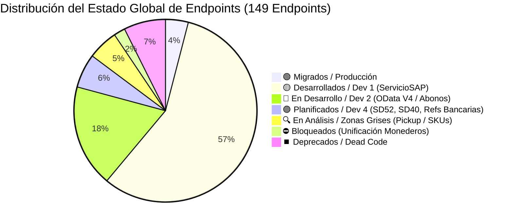
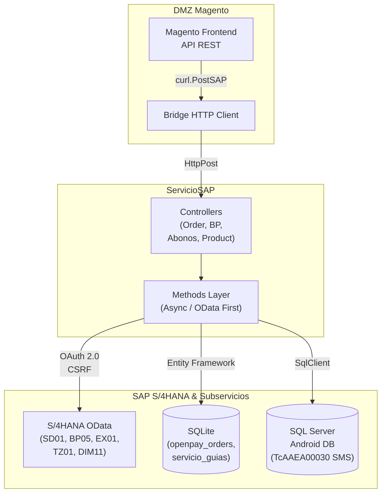
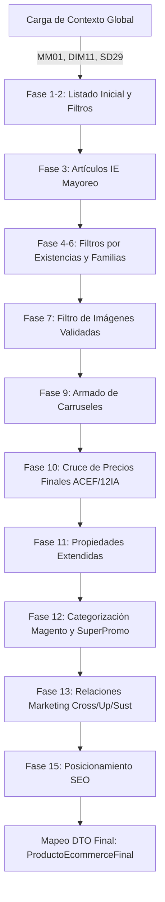
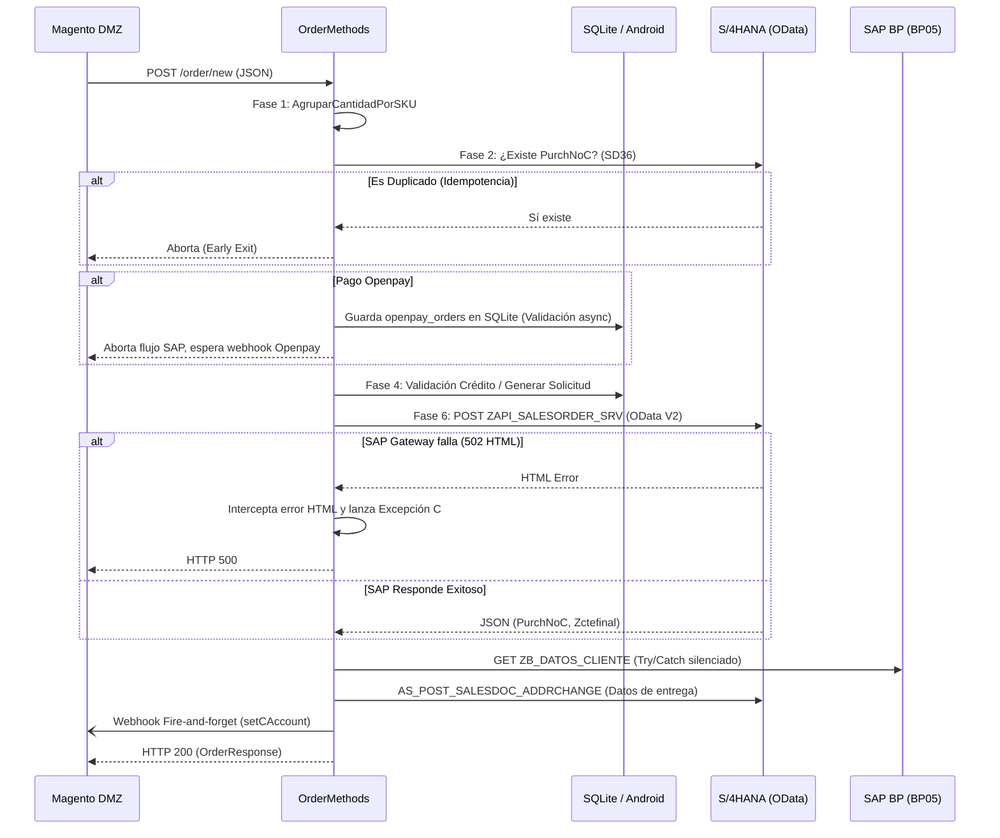

# Master Migration Summary Unified: LAN a SAP (Estado Global y Arquitectura)

> [!info] Documento Maestro Unificado (Single Source of Truth)
> **Proyecto:** Migración LAN (Intelisis) a SAP S/4HANA (Módulo Órdenes, E-Commerce, Crédito y Servicios)
> **Stack Tecnológico:** C# .NET 4.7.2 (Web API / ServicioSAP), SAP OData V2/V4, SQLite, SQL Server (SigMavi / Android DB)
> **Objetivo:** Desacoplar la dependencia del ERP heredado (Tablas locales y Stored Procedures de Intelisis) hacia la nueva arquitectura orientada a microservicios OData de S/4HANA, permitiendo a la DMZ Magento conectarse al nuevo **ServicioSAP**.
> **Última Sincronización:** 01 de Septiembre de 2026

---

## 🆕 Actualización: 01 de Septiembre 2026 (Refinamiento Async y Fixes de Integración SAP Gateway)

Durante esta fase de estabilización se realizaron correcciones críticas en la comunicación OData con SAP S/4HANA (SD40 y PropreList) para resolver ABAP Dumps y errores de mapeo:

1. **Resolución de Error 500 (Memoria/Parsing en $filter)**: 
   - Se corrigió el consumo del EntitySet PropreListSet en FinalListProperMethods.GetFinalListProperByUenAsync.
   - Se removió la codificación estricta Uri.EscapeDataString que generaba un doble encoding (enviando %20 literales a SAP) y provocaba volcados de memoria (ABAP Dumps) en el backend al fallar los índices de búsqueda.
   - El filtro fue restaurado a su estado nativo: $filter=CDistr eq '0{uen}'.
2. **Asincronía Estandarizada en Precios y Compatibilidad en E-Commerce**:
   - FinalListProperMethods ahora implementa correctamente sync Task empleando HttpClient.SendAsync.
   - En EcommerceMethods.cs se mitigaron los errores de compilación inyectando puentes sincrónicos (.GetAwaiter().GetResult()) para no desestabilizar el módulo de Ecommerce, manteniendo la asincronía puramente en el flujo de Órdenes (OrderMethods).
3. **Mapeo Inteligente de Condiciones de Pago (Zterm)**:
   - Se corrigió un error en OrderMethods.cs (SetOrder) donde la validación contra SD40 (ZAPI_CONDPAGO) fallaba al buscar descripciones largas (Zgrupopropre eq '12 M VIU P INM').
   - Se refactorizó la lógica para consumir el helper nativo PaymentConditionCatalog.GetSapPaymentCode(...), traduciendo descripciones de Magento en claves nativas de S/4HANA (Ej. 12IV).
   - La consulta a SAP ahora filtra directamente por el código unívoco: $filter=Zterm eq '12IV'.

---

## 🏗️ Diccionario de Infraestructura (URLs Base y Rutas Locales)

En la siguiente tabla se mapean las constantes y orígenes de datos utilizados en la capa de consumo hacia su destino real:

| Constante / Configuración        | Destino Real (URL / Ruta)                                     |
| :------------------------------- | :------------------------------------------------------------ |
| **S/4HANA (OData)**              | `https://vhmvods4ci.sap.svrwes4h.com:44300/sap/opu/odata/sap` |
| **`URL_ANDROID_API`**            | `https://android-api.mavi.fun`                                |
| **`URL_BP_API`**                 | `https://businesspartner-api.mavi.fun`                        |
| **`URL_SALES_DISTRIBUTION_API`** | `https://salesanddistribution-api.mavi.fun`                   |
| **`VETA_URL_LIBERADOR`**         | `http://172.16.215.51:3026/api/venta`                         |
| **`AwsBaseUrl`**                 | `https://54wblyc2h6.execute-api.us-east-1.amazonaws.com/`     |
| **`SQLITE_DB_PATH`**             | `C:\inetpub\wwwroot\sap\`                                     |
| **`IMAGES_CREDIT_PATH`**         | `C:\inetpub\wwwroot\sap\images\credit`                        |
| **Servidor (IIS)**               | `172.16.215.64` (Windows Server On-Premise)                   |
| **Ambiente (Mandante)**          | `110` (QA - `SAP_STAGE`)                                      |

> [!NOTE]
> **Arquitectura y Trusted Hosts (Seguridad DMZ)**
> La comunicación DMZ -> LAN valida estrictamente el origen de las peticiones mediante `DMZ\WebApiMagento\Helper\Curl.cs`. Los Trusted Hosts están configurados en el Web.config:
> - **DOMINIO_SAP:** `https://kdll3fhcyo-lan.grupomavi.com/SAP/`
>
> [!WARNING]
> **Gaps Operativos (Monitoreo y Secretos)**
> 1. **Logs y Observabilidad:** La aplicación escribe logs en texto plano localmente (`C:\inetpub\wwwroot\log\sap.log`). No hay integración con herramientas APM (Datadog, Splunk), requiriendo revisión manual vía RDP. Riesgo alto de ceguera operativa ante caídas de SAP.
> 2. **Gestión de Secretos:** Credenciales de SQL y OAuth SAP están en texto plano en el `Web.config`. Se requiere migrar a un administrador de secretos (ej. Key Vault o variables de entorno inyectadas en CI/CD) antes del paso a Producción.

---

## 📊 Resumen Visual del Estado Global de Endpoints (149 Total)

### 🏛️ Arquitectura de Comunicación DMZ ➔ ServicioSAP ➔ S/4HANA

---

## 1. Reglas Arquitectónicas Core (Reglas de Oro)

1. **Cero Consultas SAP DB Directas (OData First):** Supresión total de sentencias `INSERT/SELECT` contra tablas Z. Todo opera bajo protocolos OData (EntitySets) con inyección dinámica de credenciales OAuth 2.0 y base URL extraída desde DLL (`Conexion.dll`).
2. **Bases Locales Permanentes (Zonas Grises de SAP):**
   * **SQLite:** Mantiene rastros transaccionales de OpenPay y Servicio de Guías (`servicio_guias`, `openpay_orders`).
   * **MAVICBOSANDROID (SQL Server):** Mantiene la validación rigurosa de SMS (`TcAAEA00030_EnvioMensajes`) y la alta de Solicitudes de Crédito Web.
3. **Refactorización Asíncrona (Async/Await):** Para evitar *Socket Exhaustion* bajo carga alta (ej. Hot Sale), el monolito HTTP a SAP se migra progresivamente a `async Task`.
4. **Puentes DMZ a SAP (`PostSAP` Mandatorio):** La conexión entre la DMZ de Magento y el ServicioSAP se realiza usando el puente `curl.PostSAP(...)`. Todos los endpoints destino en ServicioSAP reciben peticiones en `[HttpPost]`.
5. **Exclusión Estricta de CrediLana:** Todo flujo exclusivo de la plataforma "CrediLana" queda fuera del alcance de la migración a SAP S/4HANA.

6. **Consistencia de Mandante (sap-client):** Todas las llamadas OData a S/4HANA deben utilizar el mandante estándar de QA (`sap-client=110`). Si bien en la documentación técnica RSG se realizaron pruebas usando el mandante `050`, la implementación en código debe forzar estrictamente `110` para garantizar la conexión al entorno homologado.

---

## 🔄 Matriz de Impacto y Reutilización de APIs SAP (Relación RSG vs Código C#)

En la siguiente matriz se relacionan los documentos oficiales de requerimiento presentes en la carpeta `RSG/` con las URLs/rutas OData extraídas directamente del código fuente de `ServicioSAP`, sus cabeceras de métodos C# y los flujos o endpoints beneficiados:

| Nomenclatura del Requerimiento (Documento `RSG/`)                      | Servicio OData / Ruta en Código C#                                                    | Cabecera del Método C# (`ServicioSAP/Methods/`)                                                                                   | Endpoints y Flujos Beneficiados que la Consumen                                                                         |
| :--------------------------------------------------------------------- | :------------------------------------------------------------------------------------ | :-------------------------------------------------------------------------------------------------------------------------------- | :---------------------------------------------------------------------------------------------------------------------- |
| `sd01_enviar_pedido.md`                                                | `/ZAPI_SALESORDER_SRV/A_SALES_ORDERSet`                                               | `OrderMethods.SetOrder(OrderRequest order, string option)`                                                                        | `POST /order/new`, `POST /order/testnew`, `SetOrder` E2E                                                                |
| `sd05_movbita.md`                                                      | `AI_GET_ZSDT_MOVBITA`                                                                 | `MovBitaMethods.GetMovBitaEventsAsync(string vbeln)`                                                                              | `GET /movbita/events/{vbeln}` (Consulta Estatus Bita)                                                                   |
| `sd09_devolucion.md`                                                   | `ZAPI_SALESORDER_SRV` (Motivo Devolución)                                             | `OrderMethods.BuilAdapterReturn(OrderRMA order)`                                                                                  | `POST /order/setreturn` (Devoluciones RMA)                                                                              |
| `sd36_consultar_documentos.md`                                         | `ZSRV_SALESDOCUMENT_SRV` / `ZAPI_DOCVTAS_CHECK_CDS`                                   | `SalesMethods.CheckDocumentExistsSD36Async(string purchNoC)`                                                                      | `GET /order/checkDocument/{purchNoC}`, Idempotencia de Pedidos, `GET /sale/{documentId}`, `GET /sale/filter/{filters}`  |
| `sd29_proprelist.md`                                                   | `/ZAPI_PROPRELIST_SRV/PropreListSet`                                                  | `FinalListProperMethods.GetFinalListProperByUen(string uen)`                                                                      | Precios E-Commerce (`product/exportaart`), Cotizador de Crédito                                                         |
| `sd33_consultar_bonificacion.md`                                       | `ZAPI_CAMPANA_BONIFICACION_SRV/REQUESTSet`                                            | `AccountMethods.GetBonusAsync(BonusRequest bonusRequest)`                                                                         | `POST /account/bonus`, `POST /account/bonus/async`                                                                      |
| `sd18_consultar_contrato.md`                                           | `/ZAPI_CONDITIONCONTRACT_SRV/ConditionContractSet`                                    | `WalletCustomerMethods.GetCustomerWalletAsync(string cliente)`                                                                    | `POST /customer/wallet/details`, `MonederoSaldoCredito`                                                                 |
| `bp01_bp02_maestro.md`                                                 | `ZAPI_BP01_PARTNER_SRV/BPartnerSet` & `API_BUSINESS_PARTNER/A_BusinessPartnerAddress` | `BusinessPartnerMethods.SubmitClientInfoAsync(Client newClient)`, `DeliveryAddressMethods.CreateBusinessPartnerAddressAsync(...)` | `POST /partner/client`, `PATCH /partner/client`, `POST /partneraddress/partner/{bpId}`, `PATCH /partneraddress/phone`   |
| `bp05_maestro.md`                                                      | `/ZB_DATOS_CLIENTE_CDS/ZB_DATOS_CLIENTE`                                              | `BusinessPartnerMethods.GetClientAsync(string clientId)`                                                                          | `GET /partner/client/{clientId}`, `GET /partner/client/filter/{sapFilter}`, `CreditMethods.IsValidated(string cliente)` |
| `bp05ma_maestro_expandido.md`                                          | `ZAPI_BP05MA_SRV/BusinessPartnerSet`                                                  | `BusinessPartnerMethods.GetClientMaAsync(string partnerId)`                                                                       | `GET /partner/client/ma/{clientId}` (Ficha expandida con 12 nodos)                                                      |
| *(Nuevo - Patch a Cte (variante BP02))*                                | `ZSDT_CTE_ODATA_SRV/ZSDT_CTE_ENTITYSet` (`AS_PATCH_ZSDT_CTE`)                         | `BusinessPartnerMethods.LinkMagentoAccountAsync(UnirCuentaRequest)`                                                               | `PATCH /partner/client/unircuenta` (Vinculación de Magento ID)                                                          |
| *(Nuevo - Habilita Combinación BP)*                                    | `AC_POST_HabilitaCombinacionBP`                                                       | `BusinessPartnerMethods.EnableBpCombinationAsync(...)`                                                                            | `POST /partner/enablechanelorg` (Vinculación de cuenta a Organización de ventas)                                        |
| *(Nuevo - Consulta de Personal)*                                       | Android API `/employees/get_personalById`                                             | `BusinessPartnerMethods.GetSuccessFactorEmployeeAsync(string userId)`                                                             | `GET /partner/successfactor/employee/{userId}` (SuccessFactors)                                                         |
| *(Nuevo - Consulta canales de venta)*                                  | Android API `AS_GET_ZQSD_EditarCliente_CanalVenta`                                    | `BusinessPartnerMethods.GetCustomerSalesChannelsAsync(string clientId)`                                                           | `GET /partner/ventadist/client/{clientId}` (Canales de Venta)                                                           |
| `reglas_validacion_anexos.md`                                          | `ZQBC_CODEMSTRD_SRV/WACODEMSTRDSet` (`ZTBC_Code_MSTR`)                                | `BusinessPartnerMethods.GetConsultaAnexosAsync(string valorAnexo)`                                                                | `GET /partner/ConsultaAnexos/{valorAnexo}` (RFC Dinámico)                                                               |
| *(Nuevo - Codigos Postales Sepomex)*                                   | `ZAPI_ZDMT_SEPOMEX` (vía `AI_zdmt_sepomex`)                                           | `SepomexMethods.GetCodigosPostalesAsync(...)`                                                                                     | `GET /sepomex/validarcp` (Validación de cobertura por CP)                                                               |
| `ex01_documentos_no_compensados.md`                                    | `ZAPI_EX01_NOCOMP_SRV/DocNoCompSet`                                                   | `AbonoMethods.GetDocumentosNoCompensadosAsync(string cliente)`                                                                    | `POST /credit/GetAccountDebts`, Saldos Pendientes FI-CA                                                                 |
| `tz01_zsplits_mercaderias.md` / `ntz01_zsplits_mercaderias.md`         | `ZAPI_TZ01_ZSPLIT_MERC` (`zsb_ntz01_zsplit_merc.../zsplits`)                          | `AbonoMethods.GetParcialidadesAsync(string vbeln)`                                                                                | `POST /credit/getClienteFactura/{cliente}/{factura}`, Abonos y Parcialidades                                            |
| `dm01_articulos.md`                                                    | `/ZAPI_ARTICULOS_SRV/Articulos`                                                       | `ProductMethods.GetProducts()`                                                                                                    | `GET /product/products`, `GET /product/filter/{filter}`, Generación de Catálogo E-Commerce                              |
| `dim11_existencias.md`                                                 | `ZCDS_DIM11_EXISTENCIA_CDS/zcds_dim11_existencia`                                     | `ProductMethods.GetProductsStock()`, `GetStock(...)`                                                                              | `GET /product/stock`, `GET /product/stock/filter/{filter}`, `GET /product/stock/serial`, ATP Real-time                  |
| `dm02_jerarquia_articulos.md`                                          | `/ZAPI_JERARQUIA_ARTICULOS_SRV/GET_ARTICULOSSet`                                      | `ProductMethods.GetJerarquiaArticulos()`                                                                                          | `GET /product/jerarquia/articulos`, Categorías E-Commerce                                                               |
| `dm03_productos_relacionados.md`                                       | `ZAPI_CROSSSELL_SRV`, `ZAPI_UPSELL_SRV`, `ZAPI_SUSTITUTOS_SRV`                        | `ProductMethods.GetCrossSell(...)`, `GetUpsell(...)`, `GetSustitutos(...)`                                                        | `GET /product/crosssell`, `GET /product/upsell`, `GET /product/sustitutos`                                              |
| `dm05_etiquetas.md`                                                    | `ZAPI_ZMMT_ETIQUETA_SRV` & `ZAPI_ARTICULOS_SEO_SRV`                                   | `ProductMethods.GetEtiquetasAsync(...)`, `GetArticulosSEO(...)`                                                                   | `GET /etiquetas`, `GET /product/seo`, `POST /product/seo`, `PATCH /product/seo`, `DELETE /product/seo`                  |
| `dm07_sucursales.md`                                                   | `/ZAPI_SUCURSALES_SRV/SucursalesSet`                                                  | `OrderMethods.GetSucursalInfo(...)`                                                                                               | Validación de Tienda / Promotor en Creación de Pedidos                                                                  |
| `ND-CRED-42_Catalogo_Bancos.md` & `ND-CRED-42_Cuentas_Bancarias_BP.md` | `zapi_referencias_bancarias` / `ZFICRUD_COBREF_SRV`                                   | `AbonoMethods.ApplyPaymentIntentNeko(...)`, `UpdatePaymentStatusNekoAsync(...)`                                                   | `POST /credit/ApplyPaymentNeko`, `POST /credit/UpdateStatusPaymentNeko`                                                 |
| `sd46_anulacion_salida_mercancias.md`                                  | `ZAPI_SALESORDER_SRV` (Goods Issue Reversal)                                          | `OrderMethods.ReverseGoodsIssueAsync(OrderRMA order)`                                                                             | Reversión de entregas y salidas de mercancía                                                                            |
| `sd48_anulacion_facturas.md`                                           | `ZAPI_SALESORDER_SRV` (Invoice Cancellation)                                          | `OrderMethods.CancelInvoiceAsync(OrderRMA order)`                                                                                 | Anulación de facturación en S/4HANA                                                                                     |
| `sd52_pendiente.md`                                                    | `AS_GET_ZQSD_EditarCliente_CanalVenta`                                                | *(Por implementar)*                                                                                                               | 🟣 **PLANIFICADO** - Pendiente de desarrollo                                                                            |
| `sd40_pendiente.md`                                                    | `zsd_sd40_condpago`                                                                   | *(Por implementar)*                                                                                                               | 🟣 **PLANIFICADO** - Pendiente de desarrollo                                                                            |

---

## 📋 Inventario Informativo de Endpoints por Controlador

A continuación se detalla el inventario completo de endpoints existentes en el ecosistema, indicando su método HTTP y su origen de datos o servicio SAP asociado:

### 1. CreditController (30 Endpoints)

| Ruta Original DMZ                              | Método   | Ruta ServicioSAP                               | Estado           | Notas / Origen de Datos                                       |
| :--------------------------------------------- | :------- | :--------------------------------------------- | :--------------- | :------------------------------------------------------------ |
| `credit/getClienteFactura/{cliente}/{factura}` | GET→POST | `credit/getClienteFactura/{cliente}/{factura}` | 🟢 **Si**        | TZ01 - Migrado                                                |
| `credit/getClienteSaldo/{cliente}`             | GET      | *To Do*                                        | 🔴 **No**        | SD33 - WALLET                                                 |
| `credit/MonederoSaldoCredito`                  | POST     | *To Do*                                        | 🔴 **No**        | SD33 - WALLET                                                 |
| `credit/getSms`                                | POST     | *To Do*                                        | 🔴 **No**        | ANDROID - No requiere SAP                                     |
| `credit/validateSms`                           | POST     | *To Do*                                        | 🔴 **No**        | ANDROID - No requiere SAP                                     |
| `credit/codigoPromocion`                       | POST     | *To Do*                                        | 🔴 **No**        | SuccessFactors + BP05 + SIGMAVI - Requiere desarrollo         |
| `credit/codigoRecomendado`                     | POST     | *N/A*                                          | ⏹️ **Deprecado** | DEPRECADO                                                     |
| `credit/ExistRFCAndPhoneCte`                   | POST     | *To Do*                                        | 🔴 **No**        | BP05 filtro genérico existe, falta SuccesFactor + SD36 + SD05 |
| `credit/getPlazos`                             | GET      | *To Do*                                        | 🔴 **No**        | TZ01 + SIGMAVI - Requiere desarrollo                          |
| `credit/getCreditAccount/{pAccount}`           | GET      | *To Do*                                        | 🔴 **No**        | Validar ZtipoCliente = PROSPECTO en filtro BP05               |
| `credit/GetUnificationWalletStatus`            | POST     | *To Do*                                        | 🔴 **No**        | BLOQUEADO - APIs/tablas no existen                            |
| `credit/CheckAccountsPreUnification`           | POST     | *To Do*                                        | 🔴 **No**        | cteEnciarA + BP05_MA - Requiere desarrollo                    |
| `credit/SetUnificationWalletData`              | POST     | *To Do*                                        | 🔴 **No**        | BLOQUEADO - APIs/tablas no existen                            |
| `credit/SolicitudMercancia`                    | POST     | *To Do*                                        | 🔴 **No**        | Migrar logica a SAP                                           |
| `credit/guardardocumento`                      | POST     | *To Do*                                        | 🟢 **Si**        | Migrar logica a SAP                                           |
| `credit/SaveHaztenTransaction`                 | POST     | *To Do*                                        | 🔴 **No**        | EXT/SIGMAVI - No requiere SAP                                 |
| `credit/CreditoWeb_FormDatos`                  | POST     | *To Do*                                        | 🔴 **No**        | CrediLana - No requiere SAP                                   |
| `credit/CreditoWeb_SaveFirstData`              | POST     | *To Do*                                        | 🔴 **No**        | CrediLana - No requiere SAP                                   |
| `credit/CreditoWeb_SaveData`                   | POST     | *To Do*                                        | 🔴 **No**        | CrediLana - No requiere SAP                                   |
| `credit/CreditoWeb_SaveData_Articulos`         | POST     | *To Do*                                        | 🔴 **No**        | ANDROID - No requiere SAP                                     |
| `credit/CreditoWeb_Informacion`                | POST     | *To Do*                                        | 🔴 **No**        | CrediLana - No requiere SAP                                   |
| `credit/CreditoWeb_Solicitud`                  | POST     | *To Do*                                        | 🔴 **No**        | CrediLana - No requiere SAP                                   |
| `credit/CreditoWeb_SolicitudPrimerGuardado`    | POST     | *To Do*                                        | 🔴 **No**        | CrediLana - No requiere SAP                                   |
| `credit/CreditoWeb_Seguro`                     | POST     | *To Do*                                        | 🔴 **No**        | CrediLana - No requiere SAP                                   |
| `credit/GetCreditAmounts`                      | POST     | `credit/GetCreditAmounts`                      | 🟢 **Si**        | CrediLana - Endpoint SAP existe                               |
| `credit/Validar_Lada`                          | POST     | *N/A*                                          | ⏹️ **Deprecado** | DEPRECADO                                                     |
| `credit/codigoRecomendadoWithUen`              | POST     | *To Do*                                        | ⏹️ **Deprecado** | UEN variant - No en scope                                     |
| `credit/SaveImagesProductosMx`                 | POST     | *To Do*                                        | 🟢 **Si**        | ProductosMX image upload - No requiere SAP                    |
| `credit/GetPhoneValidatedClientSecretName`     | POST     | *To Do*                                        | 🔴 **No**        | SMS/CrediLana - No requiere SAP                               |
| `credit/SendSmsNewNumber`                      | POST     | `credit/SendSmsNewNumber`                      | 🟢 **Si**        | SMS - Endpoint SAP existe                                     |

---

### 2. CustomersController (5 Endpoints)

| Ruta Original DMZ | Método | Ruta ServicioSAP | Estado | Notas / Origen de Datos |
| :--- | :--- | :--- | :--- | :--- |
| `customer/setCustomer` | POST | `partner/client` | 🟢 **Si** | BP01 - Migrado |
| `customer/setCustomerList` | POST | `customer/setCustomerList` | 🟢 **Si** | SIGMAVI + SAP - Endpoint SAP existe |
| `customer/getCustomerList` | GET | `customer/getCustomerList` | 🟢 **Si** | SIGMAVI + SAP - Endpoint SAP existe |
| `customer/deleteCustomerList` | POST | `customer/deleteCustomerList` | 🟢 **Si** | SIGMAVI + SAP - Endpoint SAP existe |
| `customer/cashCustomerReport` | POST | *To Do* | 🔴 **No** | OTRO - Archivo en red |

---

### 3. CustomerServiceController (26 Endpoints)

| Ruta Original DMZ | Método | Ruta ServicioSAP | Estado | Notas / Origen de Datos |
| :--- | :--- | :--- | :--- | :--- |
| `customerService/GetAccountDebts` | POST | `credit/GetAccountDebts` | 🟢 **Si** | EX01 - Migrado |
| `customerService/ApplyPaymentNeko` | POST | `credit/ApplyPaymentNeko` | 🔴 **No** | ZAPI_REFERENCIAS_BANCARIAS - Estructura SAP existe falta lógica ABAP |
| `customerService/UpdateStatusPaymentNeko` | POST | `credit/UpdateStatusPaymentNeko` | 🔴 **No** | ZAPI_REFERENCIAS_BANCARIAS - Estructura SAP existe falta lógica ABAP |
| `customerService/ApplyPaymentAdvanced` | POST | *To Do* | 🔴 **No** | ZAPI_REFERENCIAS_BANCARIAS - Requiere desarrollo |
| `customerService/UpdateStatusPaymentAdvanced` | POST | *To Do* | 🔴 **No** | ZFICRUD_COBREF_SRV - Requiere desarrollo |
| `customerService/obtenerTipoGarantia` | POST | *To Do* | 🔴 **No** | SIGMAVI - No requiere SAP |
| `customerService/unirCuenta` | POST | `partner/client/unircuenta` | 🔴 **No** (Conectado) / 🟢 **Si** (Generado) | BP05 ZID_MAGENTO - Recién desarrollado |
| `customerService/validarCliente` | POST | *To Do* | 🔴 **No** | BP05 - Filtro genérico ya existe |
| `customerService/nombreCliente` | POST | `partner/client/ma/{clientId}` | 🔴 **No** | BP05_MA - Endpoint SAP ya existe |
| `customerService/bitacoraAtencionClientes` | POST | *To Do* | 🔴 **No** | ANDROID - No requiere SAP |
| `customerService/validarCoberturaPorCP` | POST | *To Do* | 🔴 **No** | SEPOMEX - Endpoint SAP existe |
| `customerService/obtenerVentanaConfirmacion` | POST | *To Do* | 🔴 **No** | BP05 + SD36 + ADDRCHANGE - Requiere desarrollo (3 APIs) |
| `customerService/obtenerCreditos` | POST | *To Do* | 🔴 **No** | SD36 + DM01 + tarjetaSerie - Requiere desarrollo |
| `customerService/obtenerQuejas` | POST | *To Do* | 🔴 **No** | ANDROID - No requiere SAP |
| `customerService/ObtenerEstatusEmbarque` | POST | *To Do* | 🔴 **No** | BLOQUEADO - Pendiente desarrollo ABAP |
| `customerService/LoginClienteCredito` | POST | *To Do* | 🔴 **No** | BP05 - Login por datos BP |
| `customerService/LoginClienteCreditoFechaN` | POST | *To Do* | 🔴 **No** | BP05 - Login por fecha nacimiento |
| `customerService/GetSTPAccount` | POST | *To Do* | 🔴 **No** | ZAPI_REFERENCIAS_BANCARIAS - Requiere desarrollo ABAP |
| `customerService/GetSalesChannelsSTP` | POST | *To Do* | 🔴 **No** | CteEnviarA → salesanddistribution-api.mavi.fun/AS_GET_PartnerAddress?SdDoc=0000007844&PartnRole=WE |
| `customerService/ValidateSTPAccount` | GET | *To Do* | 🔴 **No** | Tabla Z nueva en SAP - Requiere desarrollo |
| `customerService/bbvaKeyNeko` | POST | *N/A* | ⏹️ **Deprecado** | DEPRECADO |
| `customerService/bbvaKeyAdvanced` | POST | *To Do* | 🔴 **No** | Herramienta EXT BBVA |
| `customerService/GetEmpleadoByNomina` | POST | `partner/successfactor/employee/{userId}` | 🔴 **No** | SuccessFactor - Endpoint SAP existe |
| `customerService/ActualizarCamposConfigurables` | POST | *N/A* | ⏹️ **Deprecado** | DEPRECADO |
| `customerService/InsertarDesdeTablerateNativo` | POST | *N/A* | ⏹️ **Deprecado** | DEPRECADO |
| `customerService/InsertarDesdeTablerateCustom` | POST | *N/A* | ⏹️ **Deprecado** | DEPRECADO |

---

### 4. OrdersController (20 Endpoints)

| Ruta Original DMZ | Método | Ruta ServicioSAP | Estado | Notas / Origen de Datos |
| :--- | :--- | :--- | :--- | :--- |
| `order/setOrder` | POST | `order/new` | 🟢 **Si** | SD01 - Migrado |
| `order/cancelOrder` | POST | `order/cancelOrder` | 🟢 **Si** | SD46 - Endpoint SAP existe faltan escenarios delivery |
| `order/returnOrder` | POST | `order/setreturn` | 🟢 **Si** | SD09 - Migrado |
| `order/getIntelisisStatuses` | POST | `sale/filter/{filters}` | 🔴 **No** (Conectado) / 🟢 **Si** (Generado) | SD36 - Reutilizar SaleController |
| `order/getPosCancellations` | POST | `order/cancelInvoice` | 🔴 **No** (Conectado) / 🟢 **Si** (Generado) | SD48 - DEPRECADO pero endpoint SAP existe |
| `order/creditStatus/{idSolicitud}` | GET | `sale/filter/{filters}` | 🔴 **No** (Conectado) / 🟢 **Si** (Generado) | SD36 - Reutilizar SaleController |
| `order/updateCreditOrderId` | POST | *To Do* | 🔴 **No** | Se tiene que revisar si es posible actualizar un documento de ventas, revisarlo con Alan |
| `order/estimated-delivery/{ecommerceId}` | GET | *To Do* | 🔴 **No** | SD36 + ADDRCHANGE + tracking - Requiere desarrollo |
| `order/GetPickUpCode` | POST | *To Do* | 🔴 **No** | TrWDM0285_CteRecoge → SIGMAVI |
| `order/ManagePaynetOrders` | POST | *To Do* | 🔴 **No** | Tabla Venta (SD36) + SQLITE + spAfectar VALIDAR FLUJO - Requiere desarrollo |
| `order/InsertPaymentData` | POST | *To Do* | 🔴 **No** | INSERT Tabla CXCCMensajeWebHookOpenPay INTELISIS a Migrar a SIGMAVI |
| `order/getGuide` | POST | `order/getGuide` | 🟢 **Si** | Migrado |
| `order/validateCredit` | POST | `order/new` | 🔴 **No** | Mismo flujo que setOrder - Apuntar a order/new pero manteniendo ValidateCredit |
| `order/authorizationResult` | POST | *N/A (MAGENTO directo)* | 🟢 **Si** | DMZ→Magento directo - No requiere SAP |
| `order/setOrderStatus` | POST | *N/A (MAGENTO directo)* | 🟢 **Si** | DMZ→Magento directo - No requiere SAP |
| `order/getOrderInfo/{incrementId}` | GET | *N/A (MAGENTO directo)* | 🟢 **Si** | DMZ→Magento directo - No requiere SAP |
| `order/jsonOrders/{incrementId}` | GET | *N/A (MAGENTO directo)* | 🟢 **Si** | DMZ→Magento directo - No requiere SAP |
| `order/setCAccount` | POST | *N/A (MAGENTO directo)* | 🟢 **Si** | DMZ→Magento directo - No requiere SAP |
| `order/sendStorePickupEmail` | POST | *N/A (MAGENTO directo)* | 🟢 **Si** | DMZ→Magento directo - No requiere SAP |
| `order/getprueba` | GET | *N/A* | 🔴 **No** | DEPRECADO |

---

### 5. 📦 Módulo E-Commerce, Catálogo y Materiales
**Controladores:** `ProductController.cs`, `EcommerceController.cs` | **Lógica:** `EcommerceMethods.cs`

> [!NOTE]
> **Reemplazo de SPexportaart:** Este módulo (1,800+ líneas) es la refactorización a microservicios del gigantesco Stored Procedure `SPexportaart`. Su función es orquestar la exportación del catálogo completo de artículos desde S/4HANA hacia Magento.

#### 5.2 ATP Real-time (DIM11)
- **Ruta ServicioSAP:** `GET /product/stock`
- **Consumo SAP:** OData `/ZCDS_DIM11_EXISTENCIA_CDS/zcds_dim11_existencia`
**Reglas de Negocio:**
- Cruza inventario físico contra existencias lógicas en SAP. Las peticiones emplean `try/catch`, si SAP falla, se devuelven estructuras vacías permitiendo que el orquestador maestro no se caiga abruptamente (Fail-Safe), protegiendo la resiliencia del frontend.

---
### 6. 💰 Monedero Electrónico y 7. Bonificaciones
**Controladores:** `WalletCustomerController.cs`, `AccountController.cs`

#### 6.1 Detalles de Monedero (SD18) y Bonos (SD33)
- **Rutas ServicioSAP:** `POST /customer/wallet/details`
**Reglas de Negocio:**
- Consume BAPIs adaptadas (`ZAPI_CONDITIONCONTRACT_SRV`) para consultar montos virtuales y tarjetas de monedero vinculadas al BP.

---
### 8. 🖼️ Módulo de Imágenes y Marketing
**Controlador:** `ImagenController.cs`

#### 8.1 Imágenes Optimizadas
- **Ruta ServicioSAP:** `GET /ma/imagenes/optimizadas`
**Reglas de Negocio:**
- Accede al file system local (`IMAGES_CREDIT_PATH`) para cachear u optimizar la entrega de imágenes.

---
### 9. 📱 Módulo de SMS, Crédito y Documentos
**Controladores:** `CreditController.cs` | **Lógica:** `DocumentMethods.cs`

#### 9.1 Envío SMS y Montos de Crédito
- **Ruta ServicioSAP:** `POST /credit/SendSmsNewNumber`, `POST /credit/GetCreditAmounts`
**Reglas de Negocio:**
- `GetCreditAmounts` resuelve montos dependiendo del tipo de crédito y UEN ("nuevo", "casa"). Se nutre de tablas locales.
- `guardardocumento` recibe el multipart Base64 y lo inserta en `MAVI_DOC_CTE` y `SaveImagesProductosMx` guarda expedientes en disco físico.
- El servicio Liberador (para primera compra) se autentica en `VETA_URL_LIBERADOR`.

---
### 10. 🗺️ Módulo de SEPOMEX
**Controlador:** `SepomexController.cs`

#### 10.1 Validación de Códigos Postales
- **Ruta ServicioSAP:** `GET /sepomex/validarcp`
- **Consumo:** `URL_SALES_DISTRIBUTION_API/AI_zdmt_sepomex`
**Reglas de Negocio:**
- Reemplaza el servicio legacy consumiendo una API centralizada que provee estado, municipio y colonias a partir del CP (para validación de alta de BP).

## ⚡ Auditoría de Patrón Asíncrono (Async/Await) y Plan de Refactorización en ServicioSAP

Para garantizar un alto rendimiento en producción (*evitando Thread Pool Starvation y Socket Exhaustion en eventos masivos como Hot Sale*), se auditó el patrón de ejecución asíncrona en **todos los controladores y clases de servicios de C# .NET 4.7.2**:

### 1. 🎮 Auditoría de Controladores (`ServicioSAP/Controllers/`)

| Controlador                        | Endpoint                                     | Firma HTTP C#                   | Estatus Async                                          | Método Interno Invocado (`Methods/`)                          |
| :--------------------------------- | :------------------------------------------- | :------------------------------ | :----------------------------------------------------- | :------------------------------------------------------------ |
| **`BusinessPartnerController.cs`** | `GET /partner/client/{clientId}`             | `async Task<IHttpActionResult>` | 🟢 **ASYNC**                                           | `bpMethods.GetClientAsync(...)`                               |
|                                    | `POST /partner/client`                       | `async Task<IHttpActionResult>` | 🟢 **ASYNC**                                           | `bpMethods.SubmitClientInfoAsync(...)`                        |
|                                    | `PATCH /partner/client`                      | `async Task<IHttpActionResult>` | 🟢 **ASYNC**                                           | `bpMethods.SubmitClientInfoAsync(...)`                        |
|                                    | `PATCH /partner/client/unircuenta`           | `async Task<IHttpActionResult>` | 🟢 **ASYNC**                                           | `bpMethods.LinkMagentoAccountAsync(...)`                      |
|                                    | `GET /partner/client/filter/{f}`             | `async Task<IHttpActionResult>` | 🟢 **ASYNC**                                           | `bpMethods.GetFilterClientsAsync(...)`                        |
|                                    | `GET /partner/client/ma/{clientId}`          | `async Task<IHttpActionResult>` | 🟢 **ASYNC**                                           | `bpMethods.GetClientMaAsync(...)`                             |
|                                    | `POST /partner/enablechanelorg`              | `async Task<IHttpActionResult>` | 🟢 **ASYNC**                                           | `bpMethods.EnableBpCombinationAsync(...)`                     |
|                                    | `GET /partner/successfactor/employee/{id}`   | `async Task<IHttpActionResult>` | 🟢 **ASYNC**                                           | `bpMethods.GetSuccessFactorEmployeeAsync(...)`                |
|                                    | `GET /partner/ventadist/client/{id}`         | `async Task<IHttpActionResult>` | 🟢 **ASYNC**                                           | `bpMethods.GetCustomerSalesChannelsAsync(...)`                |
|                                    | `GET /partner/ConsultaAnexos/{v}`            | `async Task<IHttpActionResult>` | 🟢 **ASYNC**                                           | `bpMethods.GetConsultaAnexosAsync(...)`                       |
|                                    | `POST /partner/testnew`                      | `async Task<IHttpActionResult>` | 🔴 **SÍNCRONO**                                        | `bpMethods.TestCreateClientRaw(...)` *(vía Task.Wait)*        |
| **`PartnerAddressController.cs`**  | `GET /partneraddress/partner/{bpId}`         | `async Task<IHttpActionResult>` | 🟢 **ASYNC**                                           | `deliveryMethods.GetBusinessPartnerAddressAsync(...)`         |
|                                    | `POST /partneraddress/partner/{bpId}`        | `async Task<IHttpActionResult>` | 🟢 **ASYNC**                                           | `deliveryMethods.CreateBusinessPartnerAddressAsync(...)`      |
|                                    | `PATCH /partneraddress/.../address/{id}`     | `async Task<IHttpActionResult>` | 🟢 **ASYNC**                                           | `deliveryMethods.UpdateBusinessPartnerAddressAsync(...)`      |
|                                    | `PATCH /partneraddress/partner/phone`        | `async Task<IHttpActionResult>` | 🟢 **ASYNC**                                           | `deliveryMethods.UpdateAddressPhoneNumberAsync(...)`          |
|                                    | `GET /partneraddress/salesdoc/{sd}/role/{r}` | `async Task<IHttpActionResult>` | 🟢 **ASYNC**                                           | `deliveryMethods.GetSalesDocumentAddressAsync(...)`           |
|                                    | `POST /partneraddress/salesdoc`              | `async Task<IHttpActionResult>` | 🟢 **ASYNC**                                           | `deliveryMethods.ChangeSalesDocumentAddressAsync(...)`        |
| **`AbonosController.cs`**          | `POST /credit/GetAccountDebts`               | `async Task<IHttpActionResult>` | 🟢 **ASYNC**                                           | `_abonoMethods.GetDocumentosNoCompensadosAsync(...)`          |
|                                    | `GET /credit/GetCobrosReferenciados/{bp}`    | `async Task<IHttpActionResult>` | 🟢 **ASYNC**                                           | `_abonoMethods.GetCobrosReferenciadosAsync(...)`              |
|                                    | `GET /credit/GetClabeSTP/{bp}`               | `async Task<IHttpActionResult>` | 🟢 **ASYNC**                                           | `_abonoMethods.GetClabeSTPAsync(...)`                         |
|                                    | `POST /credit/getClienteFactura/{c}/{f}`     | `async Task<IHttpActionResult>` | 🟢 **ASYNC**                                           | `_abonoMethods.GetParcialidadesAsync(...)`                    |
|                                    | `POST /credit/UpdateStatusPaymentNeko`       | `async Task<IHttpActionResult>` | 🟢 **ASYNC**                                           | `_abonoMethods.UpdatePaymentStatusNekoAsync(...)`             |
|                                    | `POST /credit/ApplyPaymentNeko`              | `IHttpActionResult`             | 🔴 **SÍNCRONO**                                        | `_abonoMethods.ApplyPaymentIntentNeko(...)`                   |
| **`CreditController.cs`**          | `POST /credit/SendSmsNewNumber`              | `async Task<IHttpActionResult>` | 🟢 **ASYNC**                                           | `CreditMethods.SendSmsNewNumberAsync(...)`                    |
|                                    | `POST /credit/GetCreditAmounts`              | `async Task<IHttpActionResult>` | 🟢 **ASYNC**                                           | `CredilanaMethods.GetCredilanaInfoAsync(...)`                 |
|                                    | `POST /credit/guardardocumento`              | `async Task<IHttpActionResult>` | 🟢 **ASYNC**                                           | `DocumentMethods.GuardarDocumentoAsync(...)`                  |
|                                    | `POST /credit/SaveImagesProductosMx`         | `async Task<IHttpActionResult>` | 🟢 **ASYNC**                                           | `DocumentMethods.SaveImagesProductosMxAsync(...)`             |
| **`SaleController.cs`**            | `POST /sale`                                 | `async Task<IHttpActionResult>` | 🟢 **ASYNC**                                           | `SalesMethods.InsertDocumentAsync(...)`                       |
|                                    | `GET /sale/{documentId}`                     | `async Task<IHttpActionResult>` | 🟢 **ASYNC**                                           | `SalesMethods.GetDocumentByIdAsync(...)`                      |
|                                    | `GET /sale/filter/{filters}`                 | `async Task<IHttpActionResult>` | 🟢 **ASYNC**                                           | `SalesMethods.GetFilterDocumentsAsync(...)`                   |
| **`WalletCustomerController.cs`**  | `POST /customer/wallet/details`              | `async Task<IHttpActionResult>` | 🟢 **ASYNC**                                           | `walletMethods.GetCustomerWalletAsync(...)`                   |
| **`ImagenController.cs`**          | `GET /ma/imagenes/optimizadas`               | `async Task<IHttpActionResult>` | 🟢 **ASYNC**                                           | `ImagenMethods.GetArticulosConImagenOptimizadaAsync(...)`     |
|                                    | `GET /ma/imagenes/refresh`                   | `async Task<IHttpActionResult>` | 🟢 **ASYNC**                                           | `ImagenMethods.GetArticulosConImagenOptimizadaAsync(...)`     |
| **`EtiquetasController.cs`**       | `GET /etiquetas`                             | `async Task<IHttpActionResult>` | 🟢 **ASYNC**                                           | `ProductMethods.GetEtiquetasAsync(...)`                       |
| **`AccountController.cs`**         | `POST /account/bonus/async`                  | `async Task<IHttpActionResult>` | 🟢 **ASYNC**                                           | `accountMethods.GetBonusAsync(...)`                           |
|                                    | `POST /account/bonus`                        | `IHttpActionResult`             | 🔴 **SÍNCRONO**                                        | `accountMethods.GetBonus(...)`                                |
| **`OrderController.cs`**           | `POST /order/new`                            | `IHttpActionResult`             | 🔴 **SÍNCRONO**                                        | `orderMethods.SetOrder(...)`                                  |
|                                    | `POST /order/setreturn`                      | `IHttpActionResult`             | 🔴 **SÍNCRONO**                                        | `orderMethods.BuilAdapterReturn(...)`                         |
|                                    | `GET /order/validatecupon/{codigo}`          | `IHttpActionResult`             | 🔴 **SÍNCRONO**                                        | `orderMethods.HandlePromoCode(...)`                           |
|                                    | `GET /order/checkDocument/{purchNoC}`        | `IHttpActionResult`             | 🔴 **SÍNCRONO**                                        | `SalesMethods.CheckDocumentExistsSD36Async` *(vía `.Result`)* |
|                                    | `POST /order/cancelOrder` & `cancelInvoice`  | `IHttpActionResult`             | 🔴 **SÍNCRONO** *(puente `.GetAwaiter().GetResult()`)* | `ReverseGoodsIssueAsync` & `CancelInvoiceAsync`               |
|                                    | `POST /order/getGuide`                       | `async Task<IHttpActionResult>` | 🟢 **ASYNC**                                           | `orderMethods.GetGuideWithNameAsync(...)`                     |
| **`MovBitaController.cs`**         | `GET /movbita/events/{vbeln}`                | `async Task<IHttpActionResult>` | 🟢 **ASYNC**                                           | `movBitaMethods.GetMovBitaEventsAsync(...)`                   |
| **`SepomexController.cs`**         | `GET /sepomex/validarcp`                     | `async Task<IHttpActionResult>` | 🟢 **ASYNC**                                           | `sepomexMethods.GetCodigosPostalesAsync(...)`                 |
| **`EcommerceController.cs`**       | `GET /ecommerce/listado`                     | `IHttpActionResult`             | 🔴 **SÍNCRONO**                                        | `EcommerceMethods.CargarContextoProceso(...)`                 |
| **`CustomersController.cs`**       | `POST /customer/setCustomerList`             | `async Task<IHttpActionResult>` | 🟢 **ASYNC**                                           | `CustomerMethods.blackwhitelistAsync(...)`                    |
|                                    | `POST /customer/getCustomerList`             | `async Task<IHttpActionResult>` | 🟢 **ASYNC**                                           | `CustomerMethods.blackwhitelistAsync(...)`                    |
|                                    | `POST /customer/deleteCustomerList`          | `async Task<IHttpActionResult>` | 🟢 **ASYNC**                                           | `CustomerMethods.blackwhitelistAsync(...)`                    |
| **`ProductController.cs`**         | `GET /product/exportaart/{store}`            | `IHttpActionResult`             | 🔴 **SÍNCRONO**                                        | `EcommerceMethods.EjecutarProcesoCompleto(...)`               |
|                                    | `GET /product/products` y 20 endpoints       | `IHttpActionResult`             | 🔴 **SÍNCRONO**                                        | `ProductMethods` (síncronos)                                  |
| **`LoginController.cs`**           | `POST /login/auth`                           | `IHttpActionResult`             | 🔴 **SÍNCRONO**                                        | Verificación local de Salt + Hash                             |

---

### 2. ⚙️ Auditoría de Clases de Servicio (`ServicioSAP/Methods/`)

| Archivo C#                       | Método Interno                                     | Estatus Async   | Servicio SAP / Recurso Consumido                     |
| :------------------------------- | :------------------------------------------------- | :-------------- | :--------------------------------------------------- |
| **`BusinessPartnerMethods.cs`**  | `GetClientAsync`                                   | 🟢 **ASYNC**    | OData V2 (`ZB_DATOS_CLIENTE_CDS`)                    |
|                                  | `SubmitClientInfoAsync`                            | 🟢 **ASYNC**    | OData V2 (`ZAPI_BP01_PARTNER_SRV`)                   |
|                                  | `GetFilterClientsAsync`                            | 🟢 **ASYNC**    | OData V2 (`ZB_DATOS_CLIENTE_CDS`)                    |
|                                  | `GetClientMaAsync`                                 | 🟢 **ASYNC**    | OData V2 (`ZAPI_BP05MA_SRV`)                         |
|                                  | `GetSuccessFactorEmployeeAsync`                    | 🟢 **ASYNC**    | Android API (`/employees/get_personalById`)          |
|                                  | `GetCustomerSalesChannelsAsync`                    | 🟢 **ASYNC**    | Android API (`AS_GET_ZQSD_EditarCliente_CanalVenta`) |
|                                  | `LinkMagentoAccountAsync`                          | 🟢 **ASYNC**    | OData V2 (`ZSDT_CTE_ODATA_SRV` PATCH + CSRF)         |
|                                  | `GetConsultaAnexosAsync`                           | 🟢 **ASYNC**    | OData V2 (`ZQBC_CODEMSTRD_SRV`)                      |
| **`DeliveryAddressMethods.cs`**  | `GetBusinessPartnerAddressAsync`                   | 🟢 **ASYNC**    | OData V2 (`API_BUSINESS_PARTNER` + `$expand`)        |
|                                  | `CreateBusinessPartnerAddressAsync`                | 🟢 **ASYNC**    | OData V2 (POST Dirección)                            |
|                                  | `UpdateBusinessPartnerAddressAsync`                | 🟢 **ASYNC**    | OData V2 (`PATCH` Dirección)                         |
|                                  | `UpdateAddressPhoneNumberAsync`                    | 🟢 **ASYNC**    | OData V2 (`PATCH` Teléfono)                          |
|                                  | `GetSalesDocumentAddressAsync`                     | 🟢 **ASYNC**    | OData V2 (`ZSRV_SALESDOC_ADDRCHANGE_SRV` GET)        |
|                                  | `ChangeSalesDocumentAddressAsync`                  | 🟢 **ASYNC**    | OData V2 (`ZSRV_SALESDOC_ADDRCHANGE_SRV` POST)       |
| **`AbonoMethods.cs`**            | `GetDocumentosNoCompensadosAsync`                  | 🟢 **ASYNC**    | OData V2 (`ZAPI_EX01_NOCOMP_SRV`)                    |
|                                  | `GetParcialidadesAsync`                            | 🟢 **ASYNC**    | OData V4 (`ZAPI_TZ01_ZSPLIT_MERC`)                   |
|                                  | `UpdatePaymentStatusNekoAsync`                     | 🟢 **ASYNC**    | Referencias bancarias                                |
|                                  | `ApplyPaymentIntentNeko`                           | 🔴 **SÍNCRONO** | Operación local SQL                                  |
| **`SalesMethods.cs`**            | `InsertDocumentAsync`                              | 🟢 **ASYNC**    | OData V2 (`ZAPI_VENTAS_SRV`)                         |
|                                  | `GetDocumentByIdAsync`                             | 🟢 **ASYNC**    | OData V2 (`ZAPI_DOCVTAS_CHECK_CDS`)                  |
|                                  | `GetFilterDocumentsAsync`                          | 🟢 **ASYNC**    | OData V2 (`ZAPI_DOCVTAS_CHECK_CDS`)                  |
|                                  | `CheckDocumentExistsSD36Async`                     | 🟢 **ASYNC**    | OData V2 (`SD36`)                                    |
| **`WalletCustomerMethods.cs`**   | `GetCustomerWalletAsync`                           | 🟢 **ASYNC**    | OData V2 (`ZAPI_CONDITIONCONTRACT_SRV`)              |
| **`AccountMethods.cs`**          | `GetBonusAsync`                                    | 🟢 **ASYNC**    | OData V2 (`ZAPI_CAMPANA_BONIFICACION_SRV`)           |
| **`ImagenMethods.cs`**           | `GetArticulosConImagenOptimizadaAsync`             | 🟢 **ASYNC**    | File I/O async                                       |
| **`ProductMethods.cs`**          | `GetEtiquetasAsync`                                | 🟢 **ASYNC**    | OData V2 (`ZAPI_ZMMT_ETIQUETA_SRV`)                  |
|                                  | `GetProducts`, `GetStock`, etc.                    | 🔴 **SÍNCRONO** | Llamadas HTTP síncronas a S/4HANA                    |
| **`OrderMethods.cs`**            | `ReverseGoodsIssueAsync`, `CancelInvoiceAsync`     | 🟢 **ASYNC**    | OData V2 SD46 / SD48 (Ya en master)                  |
|                                  | `GetGuideWithNameAsync`                            | 🟢 **ASYNC**    | SQLite (`servicio_guias`)                            |
|                                  | `SetOrder`, `BuilAdapterReturn`, `HandlePromoCode` | 🔴 **SÍNCRONO** | Monolito HTTP síncrono                               |
| **`MovBitaMethods.cs`**          | `GetMovBitaEventsAsync`                            | 🟢 **ASYNC**    | SAP Wrapper (`AI_GET_ZSDT_MOVBITA`)                  |
| **`SepomexMethods.cs`**          | `GetCodigosPostalesAsync`                          | 🟢 **ASYNC**    | SAP Wrapper (`AI_zdmt_sepomex`)                      |
| **`CreditMethods.cs`**           | `SendSmsNewNumberAsync`                            | 🟢 **ASYNC**    | SQL Server Android                                   |
|                                  | `IsValidated`                                      | 🔴 **SÍNCRONO** | SQL Server Android síncrono                          |
| **`CredilanaMethods.cs`**        | `GetCredilanaInfoAsync`                            | 🟢 **ASYNC**    | Android API (CrediLana montos)                       |
| **`DocumentMethods.cs`**         | `GuardarDocumentoAsync`                            | 🟢 **ASYNC**    | EXT (Hazten / MAVI_DOC_CTE)                          |
|                                  | `SaveImagesProductosMxAsync`                       | 🟢 **ASYNC**    | EXT (ProductosMX fire-and-forget)                    |
| **`CustomerMethods.cs`**         | `blackwhitelistAsync`                              | 🟢 **ASYNC**    | SIGMAVI (Listas Blanca/Negra)                        |
| **`EcommerceMethods.cs`**        | `EjecutarProcesoCompleto`                          | 🔴 **SÍNCRONO** | Pipeline síncrono (1,800+ líneas)                    |
| **`LiberadorCreditoMethods.cs`** | `LiberarCliente`                                   | 🔴 **SÍNCRONO** | Consumo síncrono del servicio externo JWT            |

---

### 3. 🎯 Diagnóstico y Matriz de Pendientes de Refactorización Async

* **Módulos Ya Convertidos al Patrón Async/Await (🟢 60% Completado):**
  * `BusinessPartnerController`, `PartnerAddressController`, `AbonosController`, `SaleController`, `WalletCustomerController`, `ImagenController`, `EtiquetasController`.
* **Módulos Pendientes de Refactorizar a Async (🔴 40% Reestructuración Pendiente):**
  1. **`OrderController.cs` & `OrderMethods.cs`:** Convertir `SetOrder` (SD01), `SetReturn` (SD09) y `HandlePromoCode` a `async Task` para evitar bloqueos HTTP durante la creación masiva de pedidos.
  2. **`ProductController.cs` & `ProductMethods.cs`:** Migrar las consultas OData de existencias ATP real-time (`GetStock`, `GetProductsStock`), maestro de productos (`GetProducts`) y precios (`GetFinalListProperByUen`) a `async Task`.
  3. **`EcommerceMethods.cs`:** Adaptar las llamadas HTTP internas del pipeline de catálogo a `async/await`.
  4. **`CreditMethods.cs` & `LiberadorCreditoMethods.cs`:** Convertir las llamadas a SQL Server Android y al servicio de Liberación de Crédito a `async Task`.

### 4. 🐞 Riesgos y Deuda Técnica Hardcodeada (Gaps de Código)

Durante la auditoría del código C#, se detectaron los siguientes *gaps* que requieren refactorización urgente antes del paso a producción:

1. **Business Partner Dummy:** En `OrderMethods.cs`, la variable constante `GuestCashPartnerNumber` tiene asignado el BP de prueba `1500003857`. **Acción:** Reemplazar por el número de BP genérico definitivo entregado por SAP.

---

## 2. Estado de Módulos Críticos y Gaps del Release Test

### 🟢 Módulos Ya Migrados y Soportados

1. **Creación de Órdenes (`order/new` - SD01):**
   * Payload consolidado hacia `ZAPI_SALESORDER_SRV` (`OrderHeaderIn`, `to_items`, `to_return: []`).
   * Asignación dinámica de Plant/Werks según canal y tipo de crédito: MA Contado (`0090`), MA Crédito (`0504`), VIU Contado (`0041`), VIU Crédito (`0505`).
   * Idempotencia garantizada mediante consulta `SD36` al inicio de `SetOrder` (`PurchNoC = ZSD_{docType}_{folio}`).
2. **Creación y Gestión de Business Partners (BP01, BP02, BP05):**
   * Creación automática de cliente inyectando parámetros mandatorios de S/4HANA (`Perrl: "AM"`, `Marst`, `Gender`) para saltar bloqueo de Calendario de Fábrica `TFACD`.
3. **Direcciones de Envío (`PartnerAddressController`):**
   * 6 APIs OData completadas y adaptadas de Python a C#.
   * Deep insert corregido con nodo `$select` expandido (`to_PhoneNumber`).
   * Validación de vinculación exitosa vía `ChangeSalesDocumentAddressSet`.
4. **Consulta de Saldos y Documentos No Compensados (EX01 y TZ01):**
   * Controladores `AbonosController` y `CustomerServiceController` conectados a `ZAPI_EX01_NOCOMP_SRV` y `ZAPI_TZ01_ZSPLIT_MERC` vía `PostSAP`.

---

### 🔴 Gaps Bloqueantes, Zonas Grises y Equivalencia de Tablas `SPexportaArt`

Se realizó el cruce exhaustivo entre las 58 tablas utilizadas en el proceso legacy `SPexportaArt` (`Equivalencia SPexportaArt.csv`) y la arquitectura objetivo en SAP S/4HANA / SigMavi:

#### 🟢 Tablas Mapeadas / Con Equivalencia Definida (32 Tablas)
* **Maestro de Materiales y Existencias:** `Art` ➔ DM01 (`ZAPI_ARTICULOS_SRV`), `ArtDisponible` ➔ DIM11 (`ZCDS_DIM11_EXISTENCIA_CDS`), `ArtLinea` ➔ AWS (`AS_GET_Familia_Linea`).
* **Kits / Juegos de Artículos:** `ARTJUEGO` / `ARTJUEGOD` ➔ Listas de Materiales / BOM en SAP (`MAST`, `STKO`, `STPO`, `MARA`, `MAKT`).
* **E-Commerce y Catálogos:** `catalogo_propiedad`, `catalogo_valores_posibles`, `COMSCSIPCategorias`, `COMSDSIPCarrusel`, `eCommerceCatMagento`, `eCommerceExist` (EcommerceExistencias), `eCommerceIntNivelVirtual`, `eCommerceRelCatMagentoIntelisis`, `eCommerceSetPropiedades`, `ecommerceactualizarimagenes`, `SCM_Art_imagen`.
* **Ventas Cruzadas y Relacionadas:** `eCommerceLineasRelacion` ➔ APIs OData (`ZAPI_CROSSSELL_SRV`, `ZAPI_UPSELL_SRV`, `ZAPI_SUSTITUTOS_SRV`).
* **Reglas y Exclusiones:** `excluir_familia_linea` (`ExcluirClassN2ClassN3`), `familia_propiedad`, `Familias_validas_tdavirtual`, `items_propiedad`, `sip_excluir_productos`, `sip_productos`, `TablaStd` (AWS Catalogs), `TcWDM0285_AtribMgtoValorLista`.
* **Ventas y Finanzas:** `Venta` / `VentaD` ➔ SD01 (`ZAPI_SALESORDER_SRV`), `PropreListaDFinal` ➔ SD29 (`ZAPI_PROPRELIST_SRV`), `VTASCCondicionesCredVtaLinea`, `VTASCReglasEcommerce`, `VTASCPlantillaHTMLSEO`.

#### 🔴 Tablas Pendientes de Definición Técnica (Revisión obligatoria con Luis Ricardo - 26 Tablas)
1. **`VTASCRegionSku` (Mutación de SKUs R5/R6):** No existe en SAP. Se requiere solicitar la creación de tabla Z y API CRUD tomando la propiedad de región del SIP.
2. **`VTASCCodigoPostalRegionCelular` (Matriz CP Celulares):** No existe en SAP. Se requiere solicitar creación de tabla Z y API CRUD completo.
3. **`VTASDEcommerceExportaArtExistencia` (Existencias en Exportación):** No existe en SAP. Solicitar acoplar al SP `SpVTASEcommerceExistencia` y crear API CRUD.
4. **`eCommerceDetPedidos` (Detalle Pedidos eCommerce):** No existe en SAP. Crear API CRUD y validar con Romero/POS quién llena esta tabla.
5. **`eCommercePorcSobrePrecio` (Vigencias de Sobreprecio Hot Sale):** Tabla de vigencias temporales. Requiere definir si SAP Pricing manejará la vigencia o se creará tabla Z.
6. **`PlaneadorMacroMAVIJOB` (Lógica BackOrder):** Determina si un artículo sin stock físico permanece visible en E-Commerce (`product_online = 1`) o se oculta (`product_online = 2`).
7. **`VTASCProductoControl` (Lista Blanca/Negra por SKU):** Control de bloqueos/validaciones por código de artículo.
8. **`VTASCCategoriasControl` (Precio Mínimo por Categoría):** Revisa límites mínimos de precio permitidos antes de publicar a la venta.
9. **`VTASRConfigurablesFamLineaProp`, `VTASRAgrupaFamLineaProp`, `VTASDAgrupaFamLineaPropConf`:** Manejo de configurables/variantes y características en SAP (`MARA`, `MAKT`, `AUSP`, `CABN`, `MEAN`).
10. **`eComerceExportaArt`:** Definir si la información compilada final se persistirá en una tabla destino unificada como en Intelisis.
11. **Tablas Auxiliares Pendientes:** `COMSCListaPrioridadEcommerce`, `COMSDListaPrioridad`, `Condicion`, `eComerceMarketing`, `Prop` (rama, cuenta, tipo, propiedad), `TcWDM0285_AtributosdeMagento`, `TcWDM0285_ECommerceTemporada`, `VentaEntrega`, `Formapago`, `VTASCMetodosPagoMagento`.

---

## 3. 🧪 Registro de Pruebas y Transformación de Datos Críticos

### A. Validaciones de Conectividad SAP OData (Pruebas Exitosas)

A continuación, se detalla la información concentrada y verídica de los endpoints que ya han sido probados y validados contra los ambientes de SAP:

#### 1. Módulo SD05: Consulta MovBita
* **Endpoint Implementado:** `GET /movbita/events/{vbeln}`
* **Parámetro de Prueba:** `9000016844`
* **Estado:** ✅ Exitosa.
* **Comentarios de Ejecución:** El servicio mapea correctamente los eventos de SAP. (Probado con éxito y validado).

#### 2. Módulo VTAS / Reglas de Validación (Anexos)
* **Endpoint Implementado:** `GET /partner/ConsultaAnexos/{valorAnexo}`
* **API Origen (S/4HANA):** `ZQBC_CODEMSTRD_SRV`
* **Casos de Prueba (Parámetros):** `RFCAnexoVI`
* **Estado:** ✅ Exitosa.
* **Comentarios de Ejecución:**
  * La inyección del parámetro de query string `sap-client=110` permitió la autenticación exitosa. Esta autenticación se genera mediante el método `TokenGenerator.CreateClientS4()`.
  * El payload de respuesta resultó ser un arreglo JSON con las palabras catalogadas u obscenas (`ZcodeData`), tales como `BUEI`, `CACA`, etc.
  * Estos datos son mapeados estrictamente a través del modelo C# `AnexosResponse.cs`.
  * El listado se generó íntegramente respetando todos sus metadatos (como la fecha de actualización, el estado `A`, y el ID incremental), lo que confirma de manera contundente que el parseo de los DTOs y el uso de los comandos `$filter` de OData funcionan a la perfección en el código.

---

### B. Mapeo de Datos Críticos y Transformación (Hardcoded Logic)

Se documenta la lógica de transformación de negocio estricta que ha sido programada en el código C# para asegurar que los payloads de Magento sean interpretados correctamente por S/4HANA.

#### 1. Transformación de Identificadores de Género
En el método de parseo `BusinessPartnerMethods.cs`, se implementó la siguiente regla estricta para la evaluación del género proveniente de Magento:
* **Mapeo a Hombre (`1`):** Cualquier valor entrante que coincida con `H`, `HOMBRE`, `MASCULINO` o `1` (ignorando mayúsculas/minúsculas o espacios en blanco).
* **Mapeo a Mujer (`2`):** Cualquier valor entrante que coincida con `M`, `MUJER`, `FEMENINO` o `2`.
* **Mapeo por Defecto (`3`):** Cualquier otro valor que no coincida con las reglas anteriores es enviado como `3` a SAP.

#### 2. Estado Civil
* Dentro de la construcción del payload de Business Partner (`Client.cs` / `BusinessPartnerMethods`), el campo de estado civil (`Marst`) se encuentra forzado o "hardcodeado" con el valor `"1"` en la carga de datos maestros, sustituyendo comportamientos previos.

#### 3. Condiciones de Pago (ZTERM)
Existe una matriz con **101 mapeos distintos** entre las condiciones de crédito/pago generadas por el e-commerce (Magento) y la nomenclatura oficial de SAP.
* Se manejan variaciones para MAVI (MA) y Muebles América (VIU).
* **Ejemplos MA:** `02 Q MA VAL P INM` mapea a `02QA`, `120 M MA P INM` mapea a `SVIA`, `CONTADO MA` mapea a `ACEF`.
* **Ejemplos VIU:** `12 M VIU P INM` mapea a `12IV`, `CONTADO VIU` mapea a `VCEF`.
* **Otras / Generales:** Plazos y condiciones como `COM 030 D` mapean a `001M`, `MAY 30 FORANEO` mapea a `F01M`.
* Esta lógica debe ser contemplada en cada solicitud comercial (SD01) o de clientes (BP) que involucre transacciones a crédito.

---

## 4. Roadmap Actualizado de Ejecución

1. **Fase 1: Estabilización de Esqueletos Híbridos DMZ:**
   * Ajustar los endpoints destino en ServicioSAP a `[HttpPost]` para recibir el tráfico de la DMZ vía `curl.PostSAP(...)`.
   * Integración del método `GetSAP()` como puente de obtención de datos desde la DMZ hacia ServicioSAP, homologando las consultas `GET`.
2. **Fase 2: Finalización de Refactorización Asíncrona (`async/await`):**
   * Refactorizar `OrderController.cs`, `OrderMethods.cs` y `ProductController.cs` a `async Task` para evitar bloqueos HTTP en IIS bajo alta concurrencia.
3. **Fase 3: Persistencia de Pasarelas en SQLite:**
   * Configurar Entity Framework / SQLite para `openpay_orders` y `servicio_guias` en ServicioSAP.

#migracion #SAP #dotnet #resumen_tecnico #obsidian #S4HANA #OData

---

## 🏛️ Auditoría de Brechas (Gap Analysis) - Profundidad Técnica

Este apartado contiene los resultados de la auditoría profunda módulo por módulo, detallando la orquestación, resiliencia y anti-patrones detectados en el código real (`ServicioSAP/Methods/`).

### Fase 1: Módulo E-Commerce, Catálogo y Materiales
**Controladores:** `ProductController.cs`, `EcommerceController.cs` | **Lógica:** `EcommerceMethods.cs`

> [!NOTE]
> **Reemplazo de SPexportaart:** Este módulo (1,800+ líneas) es la refactorización a microservicios del gigantesco Stored Procedure `SPexportaart`. Su función es orquestar la exportación del catálogo completo de artículos desde S/4HANA hacia Magento.

#### 1. Motor E-Commerce Core (`GET /product/exportaart/{store}`)
- **Ruta ServicioSAP:** `GET /product/exportaart/{store}` y `GET /ecommerce/listado`
- **Orquestador Principal:** `EcommerceMethods.EjecutarProcesoCompleto()`

**Diagrama de Ejecución del Pipeline (15 Fases):**

**Desglose Técnico y Reglas de Negocio:**
1. **Memoria y Caché:** Emplea diccionarios estáticos (`_crossSellCacheGlobal`, `_upsellCacheGlobal`) y bloqueos (`_relacionesSapCacheLock`) para evitar saturar a SAP recalculando relaciones por cada uno de los 5,000+ artículos.
2. **Carga de Contexto:** Antes de iterar, descarga en memoria todo `GetProductsStock()` (DIM11) y `GetFinalListProperByUen(UEN_MUEBLES_AMERICA)` (SD29).
3. **Reglas de Precio:** Cruza dos condiciones de precio base: `ACEF` (Contado) y `12IA`/`12DA` (Crédito Muebles América). Identifica artículos en "SuperPromo" validando los flags `Offer == "S"` y `SuperPromo == "S"` desde la lista SD29.
4. **Manejo de Exclusiones:** Aplica reglas duras para excluir productos basados en la "Familia", "Marca", o prefijos de código obtenidos dinámicamente.
5. **Marketing y Relaciones:** En la Fase 13, inyecta los carruseles dinámicos consultando `GetRelacionesMarketing` que une Cross-Selling (DM05), Up-Selling y Sustitutos, construyendo los enlaces para el front-end de Magento.

#### 2. ATP Real-time (DIM11)
- **Ruta ServicioSAP:** `GET /product/stock`
- **Consumo SAP:** OData `/ZCDS_DIM11_EXISTENCIA_CDS/zcds_dim11_existencia`
**Reglas de Negocio:**
- Cruza inventario físico contra existencias lógicas en SAP. Las peticiones emplean `try/catch`, si SAP falla, se devuelven estructuras vacías permitiendo que el orquestador maestro no se caiga abruptamente (Fail-Safe), protegiendo la resiliencia del frontend.

---

### Fase 2: Módulo de Órdenes y Devoluciones
**Controlador:** `OrderController.cs` | **Lógica de Negocio:** `OrderMethods.cs`

> [!WARNING]
> **Deuda Técnica Crítica (Sync-over-Async):** El orquestador principal `SetOrder` no es asíncrono (`public OrderResponse SetOrder`). Sin embargo, consume APIs OData (SAP) usando `.GetAwaiter().GetResult()`. Esto puede causar agotamiento de hilos (Thread Pool Starvation) bajo estrés intenso (Hot Sale) y **debe ser refactorizado** a `async Task<OrderResponse>`.

#### 1. Endpoint: Creación de Pedido (SD01)
- **Ruta ServicioSAP:** `POST /order/new`
- **Estado:** 🟢 **Activo y Funcionando**
- **Consumo SAP/Externo:** `https://vhmvods4ci.sap.svrwes4h.com:44300/sap/opu/odata/sap/ZAPI_SALESORDER_SRV/A_SALES_ORDERSet`

**Diagrama de Orquestación y Resiliencia (SetOrder):**

**Desglose Técnico y Reglas de Negocio:**
1. **Idempotencia (SD36):** Utiliza `ValidarPedidoExistenteSAP(purchNoC)`. Si Magento reintenta el pedido, se aborta silenciosamente evitando cobros/pedidos dobles en S/4HANA.
2. **Early Exit Openpay:** Si el pago es `openpay_cards`, el flujo **no viaja a SAP**. Se guarda transitoriamente en SQLite (`openpay_orders`) y el pedido termina ahí. La inyección real a SAP ocurrirá de forma asíncrona cuando Openpay envíe el Webhook.
3. **Validación de Crédito (FASE 4):**
   - Si el método de pago es crédito, bloquea compras de invitados.
   - Si es cliente de casa, verifica que el `Zcrmimporte` (saldo disponible) en SAP (BP05) alcance.
   - Consume el SP de Android `SP_CREDITO_WEB_DATOS` para la solicitud.
4. **Resiliencia ante Caídas SAP:** En la Fase 6, se lee la respuesta HTTP. Si SAP envía una pantalla de error (común en S/4HANA CPI Timeout devolviendo HTML en lugar de JSON), el método lo detecta proactivamente: `if (responseContent.StartsWith("<html")) throw Exception()`.
5. **Fail-Safe en Módulo BP:** Posterior a la compra, `SetOrder` intenta cruzar datos con el módulo Business Partner. Si esta consulta falla, **el error es atrapado e ignorado** (`try/catch` vacío), garantizando que el usuario sí reciba la confirmación de su compra aunque SAP BP temporalmente falle.

#### 2. Endpoint: Anulación de Facturas (SD48)
- **Rutas ServicioSAP:** `POST /order/cancelInvoice`
**Reglas de Negocio:**
- Orquesta 3 consultas secuenciales críticas asíncronas (`async Task` real):
  1. Busca el `DocumentNumber` mediante SD36 (Pedido).
  2. Obtiene la Entrega vinculada consumiendo `A_OutbDeliveryItem`.
  3. Ejecuta la anulación directa vía endpoint POST en `API_BILLING_DOCUMENT_SRV/Cancel`.

---

### Fase 3: Módulo Business Partner (BP01 - BP05)
**Controlador:** `BusinessPartnerController.cs` | **Lógica:** `BusinessPartnerMethods.cs`

#### 1. Alta de Cliente (BP01)
- **Endpoint:** `POST /partner/client`
- **Consumo SAP:** OData `/ZAPI_BP01_PARTNER_SRV/BPartnerSet`
**Reglas de Negocio:**
- **Inhabilitación de Crédito Automático:** El bloque que orquesta la solicitud `EnableBpCombinationAsync` (que habilita el canal 02 de crédito) se encuentra **comentado intencionalmente** en código. Esto responde a una regla de negocio estricta donde el crédito no se otorga de forma automática al registrarse, sino que requiere validación por el área interna correspondiente.
- **Formateo de Payload (OData):** Se inyectan parámetros inmutables (`Perrl="AM"`) para bypassear candados de SAP, pero la clase sufre de un serializador agresivo (`JsonIgnoreCondition.WhenWritingNull`) para omitir nulos.

#### 2. Resiliencia de APIs y Deuda Técnica
**Reglas de Resiliencia (Gateways OData):**
- Toda petición asíncrona hacia S/4HANA (GET/POST) cuenta con un validador explícito `StartsWith("<html")`. Esto intercepta inmediatamente un "Timeout" o "Bad Gateway" del Cloud Platform Integration (CPI) de SAP antes de que el JSON deserializer falle.

> [!WARNING]
> **Deuda Técnica (Sync-over-Async en TestCreateClientRaw):** Existe un endpoint auxiliar (`TestCreateClientRaw`) que bloquea intencionalmente el hilo de ejecución mediante `Task.Run().Wait()`. Esto se describe explícitamente en el código como deuda técnica transitoria y debe removerse o migrarse por completo a `await` puro en la Fase 2 del release para prevenir el colapso del ThreadPool.

---

### Fase 4: Módulos Secundarios (Crédito, Abonos, Sepomex)
**Controladores:** `CreditController.cs`, `AbonosController.cs`, `SepomexController.cs` | **Lógica:** `CreditMethods.cs`, `AbonoMethods.cs`

#### 1. Módulo de Abonos (DocNoComp y ZSplits)
- **Extracción Híbrida (OData V2 / V4):** El módulo `AbonosController` es un hub que se encarga de integrar la consulta de Estado de Cuenta y Parcialidades (Saldos a favor / en contra). 
- `GetDocumentosNoCompensadosAsync`: Consume **OData V2** (`ZAPI_EX01_NOCOMP_SRV`) extrayendo el data array usando el wrapper estándar `root?.d?.results`.
- `GetParcialidadesAsync`: Consume un endpoint moderno **OData V4** (`/sap/opu/odata4/sap/.../zsplits`). C# extrae el data array directamente desde el nodo `root?.value` cumpliendo con la convención OData V4.
- **Deuda Técnica (Stub de Pagos Neko):** Los métodos `ApplyPaymentIntentNeko` y `UpdatePaymentStatusNekoAsync` se encuentran marcados con `TODO: Integrate with S/4HANA or local DB`. Actualmente devuelven `true` quemado en código, simulando un pago exitoso sin impactar en SAP.

#### 2. Módulo de Crédito (Validación SMS)
- **Consumo Híbrido SAP / Android (SigMavi):** `SendSmsNewNumberAsync` orquesta el envío de SMS 2FA. Inserta en la base de datos SQL Server antigua (`TcAAEA00030_EnvioMensajes`) usando `conexionSQL`.
- **Anti-patrón Sync-over-Async:** En `CreditMethods.IsValidated(cliente)`, para verificar si el usuario validó su SMS, el código consulta SAP BP (BP05) mediante `GetClientAsync().GetAwaiter().GetResult()`. Esto bloquea el hilo sincrónicamente e introduce latencia en la comprobación de identidad de E-commerce.