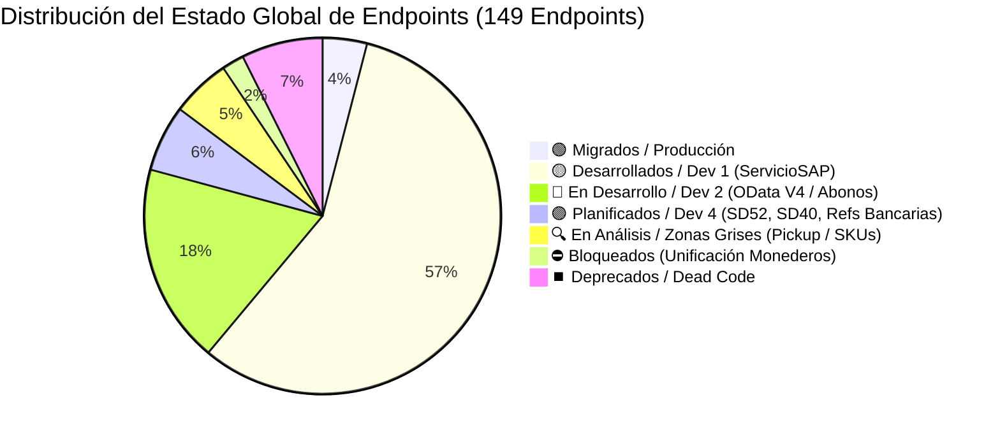
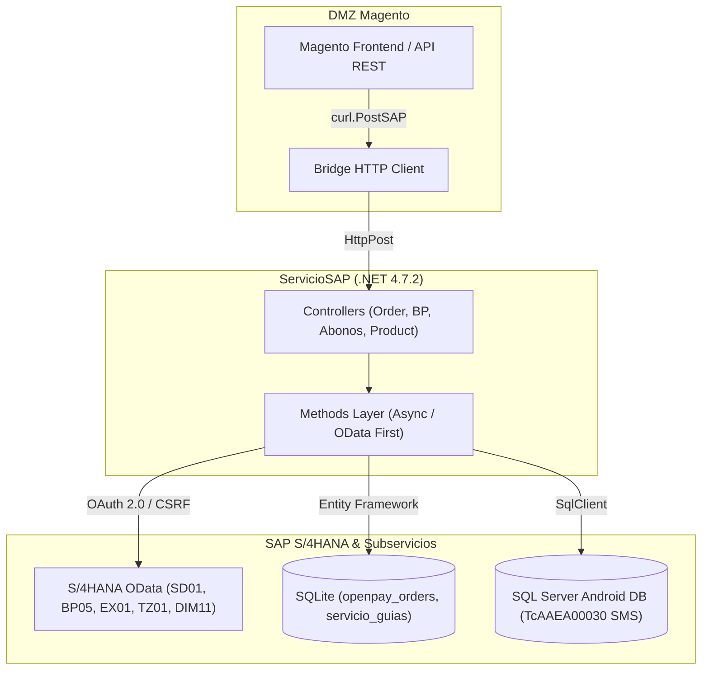

# Master Migration Summary Unified: LAN a SAP (Estado Global y Arquitectura)

> [!info] Documento Maestro Unificado (Single Source of Truth)
> **Proyecto:** Migración LAN (Intelisis) a SAP S/4HANA (Módulo Órdenes, E-Commerce, Crédito y Servicios)
> **Stack Tecnológico:** C# .NET 4.7.2 (Web API / ServicioSAP), SAP OData V2/V4, SQLite, SQL Server (SigMavi / Android DB)
> **Objetivo:** Desacoplar la dependencia del ERP heredado (Tablas locales y Stored Procedures de Intelisis) hacia la nueva arquitectura orientada a microservicios OData de S/4HANA, permitiendo a la DMZ Magento conectarse al nuevo **ServicioSAP**.
> **Última Sincronización:** 25 de Agosto de 2026

---

## 📊 Resumen Visual del Estado Global de Endpoints (149 Total)

### 🏛️ Arquitectura de Comunicación DMZ ➔ ServicioSAP ➔ S/4HANA

---

## 1. Reglas Arquitectónicas Core (Reglas de Oro)

1. **Cero Consultas SAP DB Directas (OData First):** Supresión total de sentencias `INSERT/SELECT` contra tablas Z. Todo opera bajo protocolos OData (EntitySets) con inyección dinámica de credenciales OAuth 2.0 y base URL extraída desde DLL (`Conexion.dll`).
2. **Bases Locales Permanentes (Zonas Grises de SAP):**
   * **SQLite:** Mantiene rastros transaccionales de OpenPay y Servicio de Guías (`servicio_guias`, `openpay_orders`).
   * **MAVICBOSANDROID (SQL Server):** Mantiene la validación rigurosa de SMS (`TcAAEA00030_EnvioMensajes`) y la alta de Solicitudes de Crédito Web.
3. **Refactorización Asíncrona (Async/Await):** Para evitar *Socket Exhaustion* bajo carga alta (ej. Hot Sale), el monolito HTTP a SAP se migra progresivamente a `async Task`.
4. **Puentes DMZ a SAP (`PostSAP` Mandatorio):** La conexión entre la DMZ de Magento y el ServicioSAP se realiza usando el puente `curl.PostSAP(...)`. Todos los endpoints destino en ServicioSAP reciben peticiones en `[HttpPost]`.
5. **Exclusión Estricta de CrediLana:** Todo flujo exclusivo de la plataforma "CrediLana" queda fuera del alcance de la migración a SAP S/4HANA.

---

## 🔄 Matriz de Impacto y Reutilización de APIs SAP (Relación RSG vs Código C#)

En la siguiente matriz se relacionan los documentos oficiales de requerimiento presentes en la carpeta `RSG/` con las URLs/rutas OData extraídas directamente del código fuente de `ServicioSAP`, sus cabeceras de métodos C# y los flujos o endpoints beneficiados:

| Nomenclatura del Requerimiento (Documento `RSG/`)                      | Servicio OData / Ruta en Código C#                                                    | Cabecera del Método C# (`ServicioSAP/Methods/`)                                                                                   | Endpoints y Flujos Beneficiados que la Consumen                                                                         |
| :--------------------------------------------------------------------- | :------------------------------------------------------------------------------------ | :-------------------------------------------------------------------------------------------------------------------------------- | :---------------------------------------------------------------------------------------------------------------------- |
| `sd01_enviar_pedido.md`                                                | `/ZAPI_SALESORDER_SRV/A_SALES_ORDERSet`                                               | `OrderMethods.SetOrder(OrderRequest order, string option)`                                                                        | `POST /order/new`, `POST /order/testnew`, `SetOrder` E2E                                                                |
| `sd05_movbita.md`                                                      | `AI_GET_ZSDT_MOVBITA`                                                                 | `MovBitaMethods.GetMovBitaEventsAsync(string vbeln)`                                                                              | `GET /movbita/events/{vbeln}` (Consulta Estatus Bita)                                                                   |
| `sd09_devolucion.md`                                                   | `ZAPI_SALESORDER_SRV` (Motivo Devolución)                                             | `OrderMethods.BuilAdapterReturn(OrderRMA order)`                                                                                  | `POST /order/setreturn` (Devoluciones RMA)                                                                              |
| `sd36_consultar_documentos.md`                                         | `ZSRV_SALESDOCUMENT_SRV` / `ZAPI_DOCVTAS_CHECK_CDS`                                   | `SalesMethods.CheckDocumentExistsSD36Async(string purchNoC)`                                                                      | `GET /order/checkDocument/{purchNoC}`, Idempotencia de Pedidos, `GET /sale/{documentId}`, `GET /sale/filter/{filters}`  |
| `sd29_proprelist.md`                                                   | `/ZAPI_PROPRELIST_SRV/PropreListSet`                                                  | `FinalListProperMethods.GetFinalListProperByUen(string uen)`                                                                      | Precios E-Commerce (`product/exportaart`), Cotizador de Crédito                                                         |
| `sd33_consultar_bonificacion.md`                                       | `ZAPI_CAMPANA_BONIFICACION_SRV/REQUESTSet`                                            | `AccountMethods.GetBonusAsync(BonusRequest bonusRequest)`                                                                         | `POST /account/bonus`, `POST /account/bonus/async`                                                                      |
| `sd18_consultar_contrato.md`                                           | `/ZAPI_CONDITIONCONTRACT_SRV/ConditionContractSet`                                    | `WalletCustomerMethods.GetCustomerWalletAsync(string cliente)`                                                                    | `POST /customer/wallet/details`, `MonederoSaldoCredito`                                                                 |
| `bp01_bp02_maestro.md`                                                 | `ZAPI_BP01_PARTNER_SRV/BPartnerSet` & `API_BUSINESS_PARTNER/A_BusinessPartnerAddress` | `BusinessPartnerMethods.SubmitClientInfoAsync(Client newClient)`, `DeliveryAddressMethods.CreateBusinessPartnerAddressAsync(...)` | `POST /partner/client`, `PATCH /partner/client`, `POST /partneraddress/partner/{bpId}`, `PATCH /partneraddress/phone`   |
| `bp05_maestro.md`                                                      | `/ZB_DATOS_CLIENTE_CDS/ZB_DATOS_CLIENTE`                                              | `BusinessPartnerMethods.GetClientAsync(string clientId)`                                                                          | `GET /partner/client/{clientId}`, `GET /partner/client/filter/{sapFilter}`, `CreditMethods.IsValidated(string cliente)` |
| `bp05ma_maestro_expandido.md`                                          | `ZAPI_BP05MA_SRV/BusinessPartnerSet`                                                  | `BusinessPartnerMethods.GetClientMaAsync(string partnerId)`                                                                       | `GET /partner/client/ma/{clientId}` (Ficha expandida con 12 nodos)                                                      |
| *(Nuevo - Patch a Cte (variante BP02))*                                | `ZSDT_CTE_ODATA_SRV/ZSDT_CTE_ENTITYSet` (`AS_PATCH_ZSDT_CTE`)                         | `BusinessPartnerMethods.LinkMagentoAccountAsync(UnirCuentaRequest)`                                                               | `PATCH /partner/client/unircuenta` (Vinculación de Magento ID)                                                          |
| *(Nuevo - Consulta de Personal)*                                       | Android API `/employees/get_personalById`                                             | `BusinessPartnerMethods.GetSuccessFactorEmployeeAsync(string userId)`                                                             | `GET /partner/successfactor/employee/{userId}` (SuccessFactors)                                                         |
| *(Nuevo - Consulta canales de venta)*                                  | Android API `AS_GET_ZQSD_EditarCliente_CanalVenta`                                    | `BusinessPartnerMethods.GetCustomerSalesChannelsAsync(string clientId)`                                                           | `GET /partner/ventadist/client/{clientId}` (Canales de Venta)                                                           |
| `reglas_validacion_anexos.md`                                          | `ZQBC_CODEMSTRD_SRV/WACODEMSTRDSet` (`ZTBC_Code_MSTR`)                                | `BusinessPartnerMethods.GetConsultaAnexosAsync(string valorAnexo)`                                                                | `GET /partner/ConsultaAnexos/{valorAnexo}` (RFC Dinámico)                                                               |
| *(Nuevo - Codigos Postales Sepomex)*                                   | `ZAPI_ZDMT_SEPOMEX` (vía `AI_zdmt_sepomex`)                                           | `SepomexMethods.GetCodigosPostalesAsync(...)`                                                                                     | `GET /sepomex/validarcp` (Validación de cobertura por CP)                                                               |
| `ex01_documentos_no_compensados.md`                                    | `ZAPI_EX01_NOCOMP_SRV/DocNoCompSet`                                                   | `AbonoMethods.GetDocumentosNoCompensadosAsync(string cliente)`                                                                    | `POST /credit/GetAccountDebts`, Saldos Pendientes FI-CA                                                                 |
| `tz01_zsplits_mercaderias.md` / `ntz01_zsplits_mercaderias.md`         | `ZAPI_TZ01_ZSPLIT_MERC` (`zsb_ntz01_zsplit_merc.../zsplits`)                          | `AbonoMethods.GetParcialidadesAsync(string vbeln)`                                                                                | `POST /credit/getClienteFactura/{cliente}/{factura}`, Abonos y Parcialidades                                            |
| `dm01_articulos.md`                                                    | `/ZAPI_ARTICULOS_SRV/Articulos`                                                       | `ProductMethods.GetProducts()`                                                                                                    | `GET /product/products`, `GET /product/filter/{filter}`, Generación de Catálogo E-Commerce                              |
| `dim11_existencias.md`                                                 | `ZCDS_DIM11_EXISTENCIA_CDS/zcds_dim11_existencia`                                     | `ProductMethods.GetProductsStock()`, `GetStock(...)`                                                                              | `GET /product/stock`, `GET /product/stock/filter/{filter}`, `GET /product/stock/serial`, ATP Real-time                  |
| `dm02_jerarquia_articulos.md`                                          | `/ZAPI_JERARQUIA_ARTICULOS_SRV/GET_ARTICULOSSet`                                      | `ProductMethods.GetJerarquiaArticulos()`                                                                                          | `GET /product/jerarquia/articulos`, Categorías E-Commerce                                                               |
| `dm03_productos_relacionados.md`                                       | `ZAPI_CROSSSELL_SRV`, `ZAPI_UPSELL_SRV`, `ZAPI_SUSTITUTOS_SRV`                        | `ProductMethods.GetCrossSell(...)`, `GetUpsell(...)`, `GetSustitutos(...)`                                                        | `GET /product/crosssell`, `GET /product/upsell`, `GET /product/sustitutos`                                              |
| `dm05_etiquetas.md`                                                    | `ZAPI_ZMMT_ETIQUETA_SRV` & `ZAPI_ARTICULOS_SEO_SRV`                                   | `ProductMethods.GetEtiquetasAsync(...)`, `GetArticulosSEO(...)`                                                                   | `GET /etiquetas`, `GET /product/seo`, `POST /product/seo`, `PATCH /product/seo`, `DELETE /product/seo`                  |
| `dm07_sucursales.md`                                                   | `/ZAPI_SUCURSALES_SRV/SucursalesSet`                                                  | `OrderMethods.GetSucursalInfo(...)`                                                                                               | Validación de Tienda / Promotor en Creación de Pedidos                                                                  |
| `ND-CRED-42_Catalogo_Bancos.md` & `ND-CRED-42_Cuentas_Bancarias_BP.md` | `zapi_referencias_bancarias` / `ZFICRUD_COBREF_SRV`                                   | `AbonoMethods.ApplyPaymentIntentNeko(...)`, `UpdatePaymentStatusNekoAsync(...)`                                                   | `POST /credit/ApplyPaymentNeko`, `POST /credit/UpdateStatusPaymentNeko`                                                 |
| `sd46_anulacion_salida_mercancias.md`                                  | `ZAPI_SALESORDER_SRV` (Goods Issue Reversal)                                          | `OrderMethods.ReverseGoodsIssueAsync(OrderRMA order)`                                                                             | Reversión de entregas y salidas de mercancía                                                                            |
| `sd48_anulacion_facturas.md`                                           | `ZAPI_SALESORDER_SRV` (Invoice Cancellation)                                          | `OrderMethods.CancelInvoiceAsync(OrderRMA order)`                                                                                 | Anulación de facturación en S/4HANA                                                                                     |
| `sd52_pendiente.md`                                                    | *(Por definir)*                                                                       | *(Por implementar)*                                                                                                               | 🟣 **PLANIFICADO** - Pendiente de desarrollo                                                                            |
| `sd40_pendiente.md`                                                    | *(Por definir)*                                                                       | *(Por implementar)*                                                                                                               | 🟣 **PLANIFICADO** - Pendiente de desarrollo                                                                            |

---

## 📋 Inventario Informativo de Endpoints por Controlador

A continuación se detalla el inventario completo de endpoints existentes en el ecosistema, indicando su método HTTP y su origen de datos o servicio SAP asociado:

### 1. CreditController (30 Endpoints)

| Ruta Original DMZ | Método | Ruta ServicioSAP | Estado | Notas / Origen de Datos |
| :--- | :--- | :--- | :--- | :--- |
| `credit/getClienteFactura/{cliente}/{factura}` | GET→POST | `credit/getClienteFactura/{cliente}/{factura}` | 🟢 **Si** | TZ01 - Migrado |
| `credit/getClienteSaldo/{cliente}` | GET | *To Do* | 🔴 **No** | SD33 - WALLET |
| `credit/MonederoSaldoCredito` | POST | *To Do* | 🔴 **No** | SD33 - WALLET |
| `credit/getSms` | POST | *To Do* | 🔴 **No** | ANDROID - No requiere SAP |
| `credit/validateSms` | POST | *To Do* | 🔴 **No** | ANDROID - No requiere SAP |
| `credit/codigoPromocion` | POST | *To Do* | 🔴 **No** | SuccessFactors + BP05 + SIGMAVI - Requiere desarrollo |
| `credit/codigoRecomendado` | POST | *N/A* | ⏹️ **Deprecado** | DEPRECADO |
| `credit/ExistRFCAndPhoneCte` | POST | *To Do* | 🔴 **No** | BP05 filtro genérico existe, falta SuccesFactor + SD36 + SD05 |
| `credit/getPlazos` | GET | *To Do* | 🔴 **No** | TZ01 + SIGMAVI - Requiere desarrollo |
| `credit/getCreditAccount/{pAccount}` | GET | *To Do* | 🔴 **No** | Validar ZtipoCliente = PROSPECTO en filtro BP05 |
| `credit/GetUnificationWalletStatus` | POST | *To Do* | 🔴 **No** | BLOQUEADO - APIs/tablas no existen |
| `credit/CheckAccountsPreUnification` | POST | *To Do* | 🔴 **No** | cteEnciarA + BP05_MA - Requiere desarrollo |
| `credit/SetUnificationWalletData` | POST | *To Do* | 🔴 **No** | BLOQUEADO - APIs/tablas no existen |
| `credit/SolicitudMercancia` | POST | *To Do* | 🔴 **No** | Migrar logica a SAP |
| `credit/guardardocumento` | POST | *To Do* | 🟢 **Si** | Migrar logica a SAP |
| `credit/SaveHaztenTransaction` | POST | *To Do* | 🔴 **No** | EXT/SIGMAVI - No requiere SAP |
| `credit/CreditoWeb_FormDatos` | POST | *To Do* | 🔴 **No** | CrediLana - No requiere SAP |
| `credit/CreditoWeb_SaveFirstData` | POST | *To Do* | 🔴 **No** | CrediLana - No requiere SAP |
| `credit/CreditoWeb_SaveData` | POST | *To Do* | 🔴 **No** | CrediLana - No requiere SAP |
| `credit/CreditoWeb_SaveData_Articulos` | POST | *To Do* | 🔴 **No** | ANDROID - No requiere SAP |
| `credit/CreditoWeb_Informacion` | POST | *To Do* | 🔴 **No** | CrediLana - No requiere SAP |
| `credit/CreditoWeb_Solicitud` | POST | *To Do* | 🔴 **No** | CrediLana - No requiere SAP |
| `credit/CreditoWeb_SolicitudPrimerGuardado` | POST | *To Do* | 🔴 **No** | CrediLana - No requiere SAP |
| `credit/CreditoWeb_Seguro` | POST | *To Do* | 🔴 **No** | CrediLana - No requiere SAP |
| `credit/GetCreditAmounts` | POST | `credit/GetCreditAmounts` | 🟢 **Si** | CrediLana - Endpoint SAP existe |
| `credit/Validar_Lada` | POST | *N/A* | ⏹️ **Deprecado** | DEPRECADO |
| `credit/codigoRecomendadoWithUen` | POST | *To Do* | ⏹️ **Deprecado** | UEN variant - No en scope |
| `credit/SaveImagesProductosMx` | POST | *To Do* | 🟢 **Si** | ProductosMX image upload - No requiere SAP |
| `credit/GetPhoneValidatedClientSecretName` | POST | *To Do* | 🔴 **No** | SMS/CrediLana - No requiere SAP |
| `credit/SendSmsNewNumber` | POST | `credit/SendSmsNewNumber` | 🟢 **Si** | SMS - Endpoint SAP existe |

---

### 2. CustomersController (5 Endpoints)

| Ruta Original DMZ | Método | Ruta ServicioSAP | Estado | Notas / Origen de Datos |
| :--- | :--- | :--- | :--- | :--- |
| `customer/setCustomer` | POST | `partner/client` | 🟢 **Si** | BP01 - Migrado |
| `customer/setCustomerList` | POST | `customer/setCustomerList` | 🟢 **Si** | SIGMAVI + SAP - Endpoint SAP existe |
| `customer/getCustomerList` | GET | `customer/getCustomerList` | 🟢 **Si** | SIGMAVI + SAP - Endpoint SAP existe |
| `customer/deleteCustomerList` | POST | `customer/deleteCustomerList` | 🟢 **Si** | SIGMAVI + SAP - Endpoint SAP existe |
| `customer/cashCustomerReport` | POST | *To Do* | 🔴 **No** | OTRO - Archivo en red |

---

### 3. CustomerServiceController (26 Endpoints)

| Ruta Original DMZ | Método | Ruta ServicioSAP | Estado | Notas / Origen de Datos |
| :--- | :--- | :--- | :--- | :--- |
| `customerService/GetAccountDebts` | POST | `credit/GetAccountDebts` | 🟢 **Si** | EX01 - Migrado |
| `customerService/ApplyPaymentNeko` | POST | `credit/ApplyPaymentNeko` | 🔴 **No** | ZAPI_REFERENCIAS_BANCARIAS - Estructura SAP existe falta lógica ABAP |
| `customerService/UpdateStatusPaymentNeko` | POST | `credit/UpdateStatusPaymentNeko` | 🔴 **No** | ZAPI_REFERENCIAS_BANCARIAS - Estructura SAP existe falta lógica ABAP |
| `customerService/ApplyPaymentAdvanced` | POST | *To Do* | 🔴 **No** | ZAPI_REFERENCIAS_BANCARIAS - Requiere desarrollo |
| `customerService/UpdateStatusPaymentAdvanced` | POST | *To Do* | 🔴 **No** | ZFICRUD_COBREF_SRV - Requiere desarrollo |
| `customerService/obtenerTipoGarantia` | POST | *To Do* | 🔴 **No** | SIGMAVI - No requiere SAP |
| `customerService/unirCuenta` | POST | `partner/client/unircuenta` | 🔴 **No** (Conectado) / 🟢 **Si** (Generado) | BP05 ZID_MAGENTO - Recién desarrollado |
| `customerService/validarCliente` | POST | *To Do* | 🔴 **No** | BP05 - Filtro genérico ya existe |
| `customerService/nombreCliente` | POST | `partner/client/ma/{clientId}` | 🔴 **No** | BP05_MA - Endpoint SAP ya existe |
| `customerService/bitacoraAtencionClientes` | POST | *To Do* | 🔴 **No** | ANDROID - No requiere SAP |
| `customerService/validarCoberturaPorCP` | POST | *To Do* | 🔴 **No** | SEPOMEX - Endpoint SAP existe |
| `customerService/obtenerVentanaConfirmacion` | POST | *To Do* | 🔴 **No** | BP05 + SD36 + ADDRCHANGE - Requiere desarrollo (3 APIs) |
| `customerService/obtenerCreditos` | POST | *To Do* | 🔴 **No** | SD36 + DM01 + tarjetaSerie - Requiere desarrollo |
| `customerService/obtenerQuejas` | POST | *To Do* | 🔴 **No** | ANDROID - No requiere SAP |
| `customerService/ObtenerEstatusEmbarque` | POST | *To Do* | 🔴 **No** | BLOQUEADO - Pendiente desarrollo ABAP |
| `customerService/LoginClienteCredito` | POST | *To Do* | 🔴 **No** | BP05 - Login por datos BP |
| `customerService/LoginClienteCreditoFechaN` | POST | *To Do* | 🔴 **No** | BP05 - Login por fecha nacimiento |
| `customerService/GetSTPAccount` | POST | *To Do* | 🔴 **No** | ZAPI_REFERENCIAS_BANCARIAS - Requiere desarrollo ABAP |
| `customerService/GetSalesChannelsSTP` | POST | *To Do* | 🔴 **No** | CteEnviarA → salesanddistribution-api.mavi.fun/AS_GET_PartnerAddress?SdDoc=0000007844&PartnRole=WE |
| `customerService/ValidateSTPAccount` | GET | *To Do* | 🔴 **No** | Tabla Z nueva en SAP - Requiere desarrollo |
| `customerService/bbvaKeyNeko` | POST | *N/A* | ⏹️ **Deprecado** | DEPRECADO |
| `customerService/bbvaKeyAdvanced` | POST | *To Do* | 🔴 **No** | Herramienta EXT BBVA |
| `customerService/GetEmpleadoByNomina` | POST | `partner/successfactor/employee/{userId}` | 🔴 **No** | SuccessFactor - Endpoint SAP existe |
| `customerService/ActualizarCamposConfigurables` | POST | *N/A* | ⏹️ **Deprecado** | DEPRECADO |
| `customerService/InsertarDesdeTablerateNativo` | POST | *N/A* | ⏹️ **Deprecado** | DEPRECADO |
| `customerService/InsertarDesdeTablerateCustom` | POST | *N/A* | ⏹️ **Deprecado** | DEPRECADO |

---

### 4. OrdersController (20 Endpoints)

| Ruta Original DMZ | Método | Ruta ServicioSAP | Estado | Notas / Origen de Datos |
| :--- | :--- | :--- | :--- | :--- |
| `order/setOrder` | POST | `order/new` | 🟢 **Si** | SD01 - Migrado |
| `order/cancelOrder` | POST | `order/cancelOrder` | 🟢 **Si** | SD46 - Endpoint SAP existe faltan escenarios delivery |
| `order/returnOrder` | POST | `order/setreturn` | 🟢 **Si** | SD09 - Migrado |
| `order/getIntelisisStatuses` | POST | `sale/filter/{filters}` | 🔴 **No** (Conectado) / 🟢 **Si** (Generado) | SD36 - Reutilizar SaleController |
| `order/getPosCancellations` | POST | `order/cancelInvoice` | 🔴 **No** (Conectado) / 🟢 **Si** (Generado) | SD48 - DEPRECADO pero endpoint SAP existe |
| `order/creditStatus/{idSolicitud}` | GET | `sale/filter/{filters}` | 🔴 **No** (Conectado) / 🟢 **Si** (Generado) | SD36 - Reutilizar SaleController |
| `order/updateCreditOrderId` | POST | *To Do* | 🔴 **No** | Se tiene que revisar si es posible actualizar un documento de ventas, revisarlo con Alan |
| `order/estimated-delivery/{ecommerceId}` | GET | *To Do* | 🔴 **No** | SD36 + ADDRCHANGE + tracking - Requiere desarrollo |
| `order/GetPickUpCode` | POST | *To Do* | 🔴 **No** | TrWDM0285_CteRecoge → SIGMAVI |
| `order/ManagePaynetOrders` | POST | *To Do* | 🔴 **No** | Tabla Venta (SD36) + SQLITE + spAfectar VALIDAR FLUJO - Requiere desarrollo |
| `order/InsertPaymentData` | POST | *To Do* | 🔴 **No** | INSERT Tabla CXCCMensajeWebHookOpenPay INTELISIS a Migrar a SIGMAVI |
| `order/getGuide` | POST | `order/getGuide` | 🟢 **Si** | Migrado |
| `order/validateCredit` | POST | `order/new` | 🔴 **No** | Mismo flujo que setOrder - Apuntar a order/new pero manteniendo ValidateCredit |
| `order/authorizationResult` | POST | *N/A (MAGENTO directo)* | 🟢 **Si** | DMZ→Magento directo - No requiere SAP |
| `order/setOrderStatus` | POST | *N/A (MAGENTO directo)* | 🟢 **Si** | DMZ→Magento directo - No requiere SAP |
| `order/getOrderInfo/{incrementId}` | GET | *N/A (MAGENTO directo)* | 🟢 **Si** | DMZ→Magento directo - No requiere SAP |
| `order/jsonOrders/{incrementId}` | GET | *N/A (MAGENTO directo)* | 🟢 **Si** | DMZ→Magento directo - No requiere SAP |
| `order/setCAccount` | POST | *N/A (MAGENTO directo)* | 🟢 **Si** | DMZ→Magento directo - No requiere SAP |
| `order/sendStorePickupEmail` | POST | *N/A (MAGENTO directo)* | 🟢 **Si** | DMZ→Magento directo - No requiere SAP |
| `order/getprueba` | GET | *N/A* | 🔴 **No** | DEPRECADO |

---

### 5. ProductsController (8 Endpoints)

| Ruta Original DMZ | Método | Ruta ServicioSAP | Estado | Notas / Origen de Datos |
| :--- | :--- | :--- | :--- | :--- |
| `product/updateProduct/{store}` | POST | *N/A (MAGENTO directo)* | 🟢 **Si** | DMZ→Magento directo - No requiere SAP |
| `product/updateConfigurableProduct/{store}` | POST | *N/A (MAGENTO directo)* | 🟢 **Si** | DMZ→Magento directo - No requiere SAP |
| `product/updateConfigurableProductLink/{sku}` | POST | *N/A (MAGENTO directo)* | 🟢 **Si** | DMZ→Magento directo - No requiere SAP |
| `product/updateStock` | POST | *N/A (MAGENTO directo)* | 🟢 **Si** | DMZ→Magento directo - No requiere SAP |
| `product/getStockByStore` | POST | *N/A (MAGENTO directo)* | ⏹️ **Deprecado** | DEPRECADO solo hace un return Ok("stores"); esta obsoleto |
| `product/updatePrice` | POST | *N/A (MAGENTO directo)* | 🟢 **Si** | DMZ→Magento directo - No requiere SAP |
| `product/uploadImage` | POST | *N/A (MAGENTO directo)* | 🟢 **Si** | DMZ→Magento directo - No requiere SAP |
| `product/uploadImagesToMagento` | POST | *N/A (MAGENTO directo)* | 🟢 **Si** | DMZ→Magento directo - No requiere SAP |

---

### 6. WalletCustomer, Wholesale, Prospecto, Recommender, Login, Status & Magento (24 Endpoints)

| Ruta Original DMZ | Método | Ruta ServicioSAP | Estado | Notas / Origen de Datos |
| :--- | :--- | :--- | :--- | :--- |
| `login/authenticate` | POST | `login/auth` | 🟢 **Si** | JWT local - Endpoint SAP existe |
| `magento/attributes` ... `setCuenta` (13 endpoints) | GET / POST | *N/A (MAGENTO directo)* | 🔴 **No** | DMZ→Magento directo |
| `prospecto/rfc` | POST | *To Do* | 🔴 **No** | RFC generación + ZTBC_Code_MSTR - Requiere desarrollo |
| `prospecto/recuperarcuenta` | POST | `partner/client/filter/{sapFilter}` | 🔴 **No** | BP05 - Filtro genérico existe |
| `recommender/setRecommenderList` | POST | *To Do* | 🔴 **No** | SpCREDICodigoRecomendador Requiere analisis |
| `recommender/getRecommender` | POST | *To Do* | 🔴 **No** | SpCREDICodigoRecomendador Requiere analisis |
| `recommender/setCodes` | POST | *To Do* | ⏹️ **Deprecado** | DEPRECADO |
| `status/getStatus` | POST | *To Do* | 🔴 **No** | Health probe - No requiere SAP |
| `customer/wallet/details` | POST | `customer/wallet/details` | 🟢 **Si** | SD18 - Migrado |
| `customer/wallet/getCuentaC/{ordenCompra}` | GET | *To Do* | 🔴 **No** (Conectado) / 🟢 **Si** (Generado) | SD36 - Consulta de venta por IdEcommerce |
| `customer/wallet/getMinimumCostToRedeem` | POST | *To Do* | 🔴 **No** | SD18 + TablaRangoSt ( AI_GET_CatalogoConfiguracion ) – Requiere desarrollo |
| `company/wholesale-customer/{wholesaleAccount}` | GET | *To Do* | 🔴 **No** (Conectado) / 🟢 **Si** (Generado) | BP05MA |
| `company/negotiable-quote/create` | POST | *To Do* | 🔴 **No** | Insert Venta (SD01) Insert VentaD (SD01 Seccion de detalles) los inserts tiene valores fijos (revisar codigo metodo InsertTableVenta, InsertTableVentaD) |

---

### 7. Endpoints LAN-Only (Sin Ruta Directa en DMZ - 17 Endpoints)

| Ruta Original LAN | Método | Ruta ServicioSAP | Estado | Notas / Origen de Datos |
| :--- | :--- | :--- | :--- | :--- |
| `customer/getCuenta` | POST | *N/A (MAGENTO)* | 🔴 **No** | LAN-only - No tiene ruta DMZ |
| `customer/setCuenta` | POST | *N/A (MAGENTO)* | 🔴 **No** | LAN-only - No tiene ruta DMZ |
| `credit/SaveCredilanaInfo` | POST | *N/A (SQLlite)* | 🔴 **No** | LAN-only - SQLite |
| `order/createStorepickupCode/{idE}/{idO}` | POST | *To Do* | 🔴 **No** | Migrar GenerarIdRecogerEnSucursal() a SAP, SD36 (venta), BP05MA (cte), VentaEntrega (api par domicilios de entrega ) EcommerceDetPedidos (Pendiente de creacion) |
| `order/generateNewStorepickupCode/{idE}` | POST | *N/A* | ⏹️ **Deprecado** | DEPRECADO por metodo crearPrimerCodigoRecogerSucbanktransfer |
| `order/getOrderId/{idEcommerce}` | POST | *N/A (MAGENTO)* | 🔴 **No** | LAN-only – Magento |
| `order/getOrderInfoAndSet/{incrementId}` | POST | *N/A (MAGENTO) Y SAP* | 🔴 **No** | LAN-only - Magento + SD36 + SD01 |
| `order/checkOpenpay` | POST | *N/A (SQLITE)* | 🔴 **No** | LAN-only Ejecuta obtenerEstatusVenta (SD36), SPAFectar, SQLITE |
| `product/updateProduct` | POST | *N/A* | 🔴 **No** | LAN-only - Job ImportApp |
| `product/updateProductJsonOnly` | POST | *N/A* | 🔴 **No** | LAN-only - Job ImportApp |
| `product/updatePrice` | POST | *N/A* | 🔴 **No** | LAN-only - Job ImportApp |
| `product/updateConfigurableProduct` | POST | `product/jerarquia/articulos` | 🔴 **No** | LAN-only - Job ImportApp |
| `product/updateStockMavi` | POST | `product/stock` | 🔴 **No** | LAN-only - Job ImportApp |
| `product/updateStock` | POST | `product/stock` | 🔴 **No** | LAN-only - Job ImportApp |
| `product/getStockByStore` | POST | `product/stock/filter/{filter}` | 🔴 **No** | LAN-only - Job ImportApp |
| `product/existenciasAlmacenArt` | POST | `product/stock/filter/{filter}` | 🔴 **No** | LAN-only - Job ImportApp |
| `product/obtenerImagen` | POST | `ma/imagenes/optimizadas` | 🔴 **No** (Conectado) / 🟢 **Si** (Generado) | LAN-only - product_images |

---

### 8. MercanciaController (5 Endpoints Restaurados)

| Ruta Original DMZ | Método | Ruta ServicioSAP | Estado | Notas / Origen de Datos |
| :--- | :--- | :--- | :--- | :--- |
| `mercancias/getAbonos` | POST | `credit/GetAccountDebts` | ⏹️ **Deprecado** | DEPRECADO - EX01/TZ01 |
| `mercancias/getProximosPagos` | POST | `credit/GetAccountDebts` | ⏹️ **Deprecado** | DEPRECADO - EX01 |
| `mercancias/getSaldoVencido` | POST | `credit/GetAccountDebts` | ⏹️ **Deprecado** | DEPRECADO - EX01 |
| `mercancias/getLimiteMercancia` | POST | `partner/client/{clientId}` | ⏹️ **Deprecado** | DEPRECADO - BP05 ZlimCred |
| `mercancias/ValidarTelefono` | POST | `partneraddress/partner/phone` | ⏹️ **Deprecado** | DEPRECADO - Phone handling existe en SAP |

---

## 🏛️ Auditoría Técnica Exhaustiva de ServicioSAP (Componentes, Controladores y Funcionalidades Activas)

Se consolidan todas las funcionalidades, controladores, servicios OData y componentes desarrollados y activos en **`ServicioSAP`** (`.NET 4.7.2`):

### 1. 🛒 Módulo de Órdenes y Devoluciones (`OrderController.cs` & `OrderMethods.cs`)
* **`POST /order/new` (SetOrder - SD01):** **[ACTIVO Y FUNCIONANDO]**
  * Creación de pedidos en S/4HANA consumiendo `ZAPI_SALESORDER_SRV` (`OrderHeaderIn`, `to_items`).
  * Determinación dinámica del centro (`Werks`): MA Contado (`0090`), MA Crédito (`0504`), VIU Contado (`0041`), VIU Crédito (`0505`).
  * Validación previa de idempotencia mediante `SD36` (`SalesMethods.CheckDocumentExistsSD36Async`).
  * Validación y quemado de cupones promocionales vía `HandlePromoCode()`.
  * Vinculación de direcciones de envío mediante `DeliveryAddressMethods` asignando el `AddressID` al pedido.
* **`POST /order/setreturn` (SetReturn - SD09):** **[ACTIVO Y FUNCIONANDO]**
  * Creación de devoluciones (RMA) en SAP S/4HANA adaptando la solicitud vía `BuilAdapterReturn()`.
* **`GET /order/validatecupon/{codigo}`:** **[DESARROLLADO EN CÓDIGO / BLOQUEADO POR CATÁLOGOS]**
  * Programado en C# en `OrderMethods.cs` (`HandlePromoCode`), el cual consulta la API de Android `/employees/get_personalById` y valida contra AWS Catalogs (`GetConfiguracionCatalogo("Código de promotor")`). **No está 100% funcional** debido al desfase de datos existente: el catálogo de AWS contiene claves legadas (ej. `D40`) mientras la API de Android devuelve identificadores de SAP SuccessFactors (ej. `ALMACEN (20000001)`), lo que provoca rechazo en códigos de promotores hasta que AWS sea actualizado.
* **`GET /order/checkDocument/{purchNoC}`:** **[ACTIVO Y FUNCIONANDO]**
  * Consulta de existencia de documentos en `SD36`.
* **Cancelaciones (`POST /order/cancelOrder` - SD46 & `POST /order/cancelInvoice` - SD48):** **[ACTIVO Y FUNCIONANDO]**
  * Originalmente desarrollados en la rama **`migracionSAP-SD46`** (Commits `66d4a1b`: SD46 y `0900ced`: SD48). **Ya integrados en `master`** dentro de `OrderController.cs`. Los métodos asíncronos `ReverseGoodsIssueAsync` y `CancelInvoiceAsync` están operativos, aunque el controlador los invoca actualmente vía `.GetAwaiter().GetResult()` como puente temporal.
* **`POST /order/getGuide` (Consulta de Guía de Envío):** **[ACTIVO Y FUNCIONANDO]**
  * Contrato portado de APIMagento. Consulta guías de envío por `IdEcommerce` en SQLite (`servicio_guias`). Implementado en `OrderMethods.GetGuideWithNameAsync()`.

### 1b. 📦 Módulo MovBita - Bitácora Logística (`MovBitaController.cs` & `MovBitaMethods.cs`)

> [!NOTE]
> Este módulo fue entregado **después** de la documentación RSG original (SD05). Consume una API wrapper diferente a la documentada originalmente: `AI_GET_ZSDT_MOVBITA` (expuesta vía `URL_SALES_DISTRIBUTION_API`), no la API OData directa de S/4HANA.

* **`GET /movbita/events/{vbeln}` (MovBita - SD05 GET):** **[ACTIVO Y FUNCIONANDO]**
  * Consulta el historial de eventos logísticos de un documento de venta consumiendo `AI_GET_ZSDT_MOVBITA`.
  * Retorna la lista completa de eventos (`Zeventos`), estados (`BstkdE`: SITUACION, EVENTO, CITA), y observaciones de reanalisis.
  * Mapeo vía DTO `MovBitaResponse.cs` → `MovBitaResult`.

### 2. 💳 Módulo de Finanzas y Abonos (`AbonosController.cs` & `AbonoMethods.cs`)
* **`POST /credit/GetAccountDebts` (EX01):** **[ACTIVO Y FUNCIONANDO]**
  * Partidas abiertas y deudas no compensadas de FI-CA consumiendo `ZAPI_EX01_NOCOMP_SRV/DocNoCompSet`.
* **`POST /credit/getClienteFactura/{cliente}/{factura}` (TZ01):** **[ACTIVO Y FUNCIONANDO]**
  * Proyección de parcialidades y abonos en OData V4 consumiendo `ZAPI_TZ01_ZSPLIT_MERC/zsplits`.
* **`POST /credit/ApplyPaymentNeko` & `UpdateStatusPaymentNeko`:** **[DESARROLLADO EN CÓDIGO]**
  * Registro de intención y confirmación de pago de parcialidades Neko/STP.

### 3. 👤 Módulo de Business Partner y Clientes (`BusinessPartnerController.cs` & `BusinessPartnerMethods.cs`)
* **`GET /partner/client/{clientId}` (BP05):** **[ACTIVO Y FUNCIONANDO]**
  * Ficha completa del Business Partner desde la vista CDS `ZB_DATOS_CLIENTE_CDS/ZB_DATOS_CLIENTE`.
* **`POST /partner/client` (BP01):** **[ACTIVO Y FUNCIONANDO]**
  * Alta de Business Partners en SAP S/4HANA vía `ZAPI_BP01_PARTNER_SRV/BPartnerSet` inyectando `Perrl: "AM"` (Solución a bloqueo `TFACD`).
  * Builder completo `BuildClientFromCustomerRequest()` con mapeo de género, formato de fecha OData, determinación dinámica de `Vkorg` (MA=`04` / VIU=`05`) y región por defecto.
* **`PATCH /partner/client` (BP02):** **[ACTIVO Y FUNCIONANDO]**
  * Actualización de datos del cliente existente vía `ZAPI_BP01_PARTNER_SRV`.
* **`GET /partner/client/filter/{sapFilter}`:** **[ACTIVO Y FUNCIONANDO]**
  * Búsqueda filtrada de clientes en SAP.
* **`GET /partner/client/ma/{clientId}` (BP05MA - Ficha Expandida):** **[ACTIVO Y FUNCIONANDO]**
  * Consulta el maestro completo del Business Partner expandiendo **12 nodos de navegación** (`to_CteTel`, `to_CteDomicilio`, `to_CteSociedad`, `to_CtePersonalAdr`, `to_CteContacto`, `to_CteCliente`, `to_CteDatosComerciales`, `to_Cte`, `to_CtePersonaContacto`, `to_CteDatosBancarios`, `to_CteFuncInterlocutor`, `to_CteImpuestos`).
  * API consumida: `ZAPI_BP05MA_SRV/BusinessPartnerSet(Partner='{partnerId}',Client='{client}')`.
  * Mapeo vía DTO `BusinessPartnerMaResponse.cs` → `BusinessPartnerMa`.
* **`PATCH /partner/client/unircuenta` (Vinculación de Cuenta Magento - AS_PATCH_ZSDT_CTE):** **[ACTIVO Y FUNCIONANDO]**
  * Actualiza atómicamente el `ZidMagento` del Business Partner en SAP mediante `PATCH` a `ZSDT_CTE_ODATA_SRV/ZSDT_CTE_ENTITYSet`.
  * Requiere negociación CSRF (`TokenGenerator.GetTokenSapAsync`).
  * Implementado en `BusinessPartnerMethods.LinkMagentoAccountAsync(UnirCuentaRequest)`.
* **`GET /partner/ConsultaAnexos/{valorAnexo}` (Reglas Anexos ZTBC_Code_MSTR):** **[ACTIVO Y FUNCIONANDO]**
  * Consulta dinámica de reglas de negocio y restricciones catalogadas (ej. para generación de RFCs) inyectando filtro dinámico `$filter=ZcodeProgram eq '{valorAnexo}'` en OData `ZQBC_CODEMSTRD_SRV/WACODEMSTRDSet`.
  * Acepta valores como `RFCAnexoVI`, `RFCAnexo1`, `RFCAnexo2`, etc.
  * Mapeo vía DTO `AnexosResponse.cs` → `AnexosResult`.

### 3b. 👥 Módulo de SuccessFactors y Canales de Venta (`BusinessPartnerController.cs` & `BusinessPartnerMethods.cs`)
* **`GET /partner/successfactor/employee/{userId}` (API SuccessFactors):** **[ACTIVO Y FUNCIONANDO]**
  * Consulta datos del empleado desde la API Android (`/employees/get_personalById?user_id={userId}&status=0`).
  * Implementado en `BusinessPartnerMethods.GetSuccessFactorEmployeeAsync(string userId)`.
  * Mapeo vía DTO `SuccessFactorEmployee`.
* **`GET /partner/ventadist/client/{clientId}` (Canales de Venta Distribución):** **[ACTIVO Y FUNCIONANDO]**
  * Consulta los canales de venta asignados a un cliente desde la API Android (`AS_GET_ZQSD_EditarCliente_CanalVenta?Cliente={clientId}`).
  * Implementado en `BusinessPartnerMethods.GetCustomerSalesChannelsAsync(string clientId)`.
  * Mapeo vía DTO `CanalVentaDist`.

### 4. 📍 Módulo de Direcciones de Envío (`PartnerAddressController.cs` & `DeliveryAddressMethods.cs`)
* **`GET /partneraddress/partner/{bpId}`:** **[ACTIVO Y FUNCIONANDO]**
  * Obtención de direcciones del cliente expandiendo `to_PhoneNumber` vía `API_BUSINESS_PARTNER/A_BusinessPartnerAddress`.
* **`POST /partneraddress/partner/{bpId}`:** **[ACTIVO Y FUNCIONANDO]**
  * Alta de dirección de entrega en SAP BP.
* **`PATCH /partneraddress/partner/{bpId}/address/{addressId}`:** **[ACTIVO Y FUNCIONANDO]**
  * Edición de dirección en SAP.
* **`PATCH /partneraddress/partner/phone`:** **[ACTIVO Y FUNCIONANDO]**
  * Actualización de teléfonos en `A_AddressPhoneNumber`.
* **`GET /partneraddress/salesdoc/{sdDoc}/role/{partnRole}` (Consulta de Dirección de Documento):** **[ACTIVO Y FUNCIONANDO]**
  * Consulta la dirección asociada a un documento de venta y rol de interlocutor mediante `ZSRV_SALESDOC_ADDRCHANGE_SRV`.
  * Implementado en `DeliveryAddressMethods.GetSalesDocumentAddressAsync(sdDoc, partnRole)`.
* **`POST /partneraddress/salesdoc`:** **[ACTIVO Y FUNCIONANDO]**
  * Vinculación de `AddressID` al pedido vía `ZSRV_SALESDOC_ADDRCHANGE_SRV/SalesDocAddressSet`.

### 5. 📦 Módulo E-Commerce, Catálogo y Materiales (`ProductController.cs`, `EcommerceController.cs` & `EcommerceMethods.cs`)
* **`GET /product/exportaart/{store}` (Motor E-Commerce Core):** **[DESARROLLADO EN CÓDIGO]**
  * Pipeline completo `EcommerceMethods.EjecutarProcesoCompleto()` (1,800+ líneas). Carga maestros MM01 (`ZAPI_ARTICULOS_SRV`), existencias ATP DIM11 (`ZCDS_DIM11_EXISTENCIA_CDS` con lotes/series), matriz de precios SD29 (`GetFinalListProperByUen`), exclusiones Muebles América, jerarquía de categorías DM02/DM04 y matching de imágenes optimizadas. *(Desarrollado en C#, pendiente de pruebas E2E e integración funcional final)*.
* **`GET /ecommerce/listado` (Variante de Catálogo):** **[DESARROLLADO EN CÓDIGO]**
  * Controlador alternativo `EcommerceController.cs` que invoca `EcommerceMethods.CargarContextoProceso()`. Expone el mismo pipeline bajo el prefijo `/ecommerce/`.
* **`GET /product/stock` & `/stock/filter/{filter}` (ATP Real-time DIM11):** **[ACTIVO Y FUNCIONANDO]**
  * Consulta existencias reales por Material, Planta y Almacén en S/4HANA.
* **`GET /product/crosssell`, `/upsell`, `/sustitutos` (DM05):** **[ACTIVO Y FUNCIONANDO]**
  * Consulta de ventas cruzadas, incrementales y productos sustitutos con caché global en memoria.
* **`GET /product/catalogo/{nombreCatalogo}` & `/almacenes/config`:** **[ACTIVO Y FUNCIONANDO]**
  * Integración con APIs de AWS Catalogs y configuración de almacenes.
* **`GET /product/seo`, `POST`, `PATCH`, `DELETE` (Metadatos SEO SAP):** **[ACTIVO Y FUNCIONANDO]**
  * CRUD completo sobre `ZAPI_ARTICULOS_SEO_SRV/ArticulosSeoSet`.

### 6. 💰 Módulo de Monedero Electrónico (`WalletCustomerController.cs` & `WalletCustomerMethods.cs`)
* **`POST /customer/wallet/details` (SD18):** **[ACTIVO Y FUNCIONANDO]**
  * Consulta contratos de condición en `ZAPI_CONDITIONCONTRACT_SRV` extrayendo serie, titular y saldo del monedero.

### 7. 🎁 Módulo de Bonificaciones (`AccountController.cs` & `AccountMethods.cs`)
* **`POST /account/bonus` & `/bonus/async` (SD33):** **[ACTIVO Y FUNCIONANDO]**
  * Cálculo de bonificaciones y promociones por pronto pago.

### 8. 🖼️ Módulo de Imágenes y Marketing (`ImagenController.cs` & `EtiquetasController.cs`)
* **`GET /ma/imagenes/optimizadas` & `/refresh`:** **[ACTIVO Y FUNCIONANDO]**
  * Obtención y refresco de caché de imágenes optimizadas para frontend Magento.
* **`GET /etiquetas`:** **[ACTIVO Y FUNCIONANDO]**
  * Exposición de etiquetas marketing y badges de producto.

### 9. 📱 Módulo de SMS, Crédito y Documentos (`CreditController.cs`, `CreditMethods.cs` & `DocumentMethods.cs`)
* **`POST /credit/SendSmsNewNumber` (Envío de SMS):** **[ACTIVO Y FUNCIONANDO]**
  * Inserción en `VTASDCodigoVerificacioneCommerce` y `TcAAEA00030_EnvioMensajes` (SQL Server Android).
  * Implementado en `CreditMethods.SendSmsNewNumberAsync(SendSmsNewNumberRequest)`.
* **`POST /credit/GetCreditAmounts` (Montos de Crédito CrediLana):** **[ACTIVO Y FUNCIONANDO]**
  * Devuelve montos de crédito cacheados para un artículo y UEN. Consulta tablas `montos_cte_nuevo`, `montos_cte_nuevo_apertura` o `montos_cte_casa` según el tipo de artículo.
  * Implementado en `CredilanaMethods.GetCredilanaInfoAsync<T>(string tabla, string uen)`.
* **`POST /credit/guardardocumento` (Guardar Documento Expediente):** **[ACTIVO Y FUNCIONANDO]**
  * Almacena documentos del expediente de crédito del cliente en `MAVI_DOC_CTE` vía servicio Hazten.
  * Implementado en `DocumentMethods.GuardarDocumentoAsync(BodyImagenBase64)`.
* **`POST /credit/SaveImagesProductosMx` (Guardado de Imágenes Expediente):** **[ACTIVO Y FUNCIONANDO]**
  * Guarda imágenes de expediente de crédito. Responde `true` inmediatamente y procesa en segundo plano (patrón fire-and-forget del legado).
  * Implementado en `DocumentMethods.SaveImagesProductosMxAsync(SaveImagesRequest)`.
* **Validación SMS (`IsValidated`):** **[ACTIVO Y FUNCIONANDO]**
  * Validación cruzada entre teléfono en SAP `BP05` y registro de envío en `TcAAEA00030_EnvioMensajes` (Android).
* **Liberador de Crédito (`LiberarCliente`):** **[PENDIENTE / EN DESARROLLO POR OTRA ÁREA]**
  * Autenticación JWT y comunicación con el servicio externo de liberación de crédito (`AUTENTICACION_URL_LIBERADOR`). *(Pendiente de liberación y entrega por parte del área responsable del Liberador)*.

### 10. 🗺️ Módulo de SEPOMEX (`SepomexController.cs` & `SepomexMethods.cs`)

> [!NOTE]
> Este módulo expone directamente la API `ZAPI_ZDMT_SEPOMEX` a través de un wrapper intermedio (`AI_zdmt_sepomex` en `URL_SALES_DISTRIBUTION_API`). Es distinto al endpoint legacy `customerService/validarCoberturaPorCP` de la DMZ.

* **`GET /sepomex/validarcp` (Validación de Códigos Postales):** **[ACTIVO Y FUNCIONANDO]**
  * Consulta la tabla SEPOMEX de SAP con soporte para filtros OData dinámicos (`$top`, `$skip`, `$filter`, `$select`, `$orderby`).
  * Implementado en `SepomexMethods.GetCodigosPostalesAsync(top, skip, filter, select, orderby)`.
  * Consume `{URL_SALES_DISTRIBUTION_API}/AI_zdmt_sepomex` con parámetros query string opcionales.

### 11. 🔐 Infraestructura, Seguridad y Conexión S/4HANA
* **Gestión de Autenticación JWT (`LoginController.cs`, `TokenGenerator.cs`, `HashService.cs`):** **[ACTIVO Y FUNCIONANDO]**
  * Endpoint `POST /login/auth` con verificación Salt + Hash (PBKDF2/SHA256) y emisión de Tokens JWT para la DMZ.
* **Motor de Conexión OData S/4HANA (`TokenGenerator.CreateClientS4`):** **[ACTIVO Y FUNCIONANDO]**
  * Gestión centralizada de tokens OAuth 2.0 y negociación CSRF.
  * Inyección dinámica de Base URL mediante `Conexion.dll` (`Conexion.Data.obtenerUrl`).
  * Parámetro mandatorio `sap-client=110` para autenticación en el mandante correcto.
* **Sistema de Logs (`Logger.cs` & `GeneradorLog.cs`):** **[ACTIVO Y FUNCIONANDO]**
  * Logs aislados dentro de `Logs/` en la raíz del proyecto para evitar fallos de permisos en IIS.

### 12. 🔮 Módulos Planificados (Sin Código Aún)
* **API SD52:** **[🟣 PLANIFICADO - PENDIENTE DE DESARROLLO]**
  * Pendiente de definición técnica y desarrollo.
* **API SD40:** **[🟣 PLANIFICADO - PENDIENTE DE DESARROLLO]**
  * Pendiente de definición técnica y desarrollo.

---

## ⚡ Auditoría de Patrón Asíncrono (Async/Await) y Plan de Refactorización en ServicioSAP

Para garantizar un alto rendimiento en producción (*evitando Thread Pool Starvation y Socket Exhaustion en eventos masivos como Hot Sale*), se auditó el patrón de ejecución asíncrona en **todos los controladores y clases de servicios de C# .NET 4.7.2**:

### 1. 🎮 Auditoría de Controladores (`ServicioSAP/Controllers/`)

| Controlador | Endpoint | Firma HTTP C# | Estatus Async | Método Interno Invocado (`Methods/`) |
| :--- | :--- | :--- | :--- | :--- |
| **`BusinessPartnerController.cs`** | `GET /partner/client/{clientId}` | `async Task<IHttpActionResult>` | 🟢 **ASYNC** | `bpMethods.GetClientAsync(...)` |
| | `POST /partner/client` | `async Task<IHttpActionResult>` | 🟢 **ASYNC** | `bpMethods.SubmitClientInfoAsync(...)` |
| | `PATCH /partner/client` | `async Task<IHttpActionResult>` | 🟢 **ASYNC** | `bpMethods.SubmitClientInfoAsync(...)` |
| | `PATCH /partner/client/unircuenta` | `async Task<IHttpActionResult>` | 🟢 **ASYNC** | `bpMethods.LinkMagentoAccountAsync(...)` |
| | `GET /partner/client/filter/{f}` | `async Task<IHttpActionResult>` | 🟢 **ASYNC** | `bpMethods.GetFilterClientsAsync(...)` |
| | `GET /partner/client/ma/{clientId}` | `async Task<IHttpActionResult>` | 🟢 **ASYNC** | `bpMethods.GetClientMaAsync(...)` |
| | `GET /partner/successfactor/employee/{id}` | `async Task<IHttpActionResult>` | 🟢 **ASYNC** | `bpMethods.GetSuccessFactorEmployeeAsync(...)` |
| | `GET /partner/ventadist/client/{id}` | `async Task<IHttpActionResult>` | 🟢 **ASYNC** | `bpMethods.GetCustomerSalesChannelsAsync(...)` |
| | `GET /partner/ConsultaAnexos/{v}` | `async Task<IHttpActionResult>` | 🟢 **ASYNC** | `bpMethods.GetConsultaAnexosAsync(...)` |
| | `POST /partner/testnew` | `async Task<IHttpActionResult>` | 🔴 **SÍNCRONO** | `bpMethods.TestCreateClientRaw(...)` *(vía Task.Wait)* |
| **`PartnerAddressController.cs`** | `GET /partneraddress/partner/{bpId}` | `async Task<IHttpActionResult>` | 🟢 **ASYNC** | `deliveryMethods.GetBusinessPartnerAddressAsync(...)` |
| | `POST /partneraddress/partner/{bpId}` | `async Task<IHttpActionResult>` | 🟢 **ASYNC** | `deliveryMethods.CreateBusinessPartnerAddressAsync(...)` |
| | `PATCH /partneraddress/.../address/{id}` | `async Task<IHttpActionResult>` | 🟢 **ASYNC** | `deliveryMethods.UpdateBusinessPartnerAddressAsync(...)` |
| | `PATCH /partneraddress/partner/phone` | `async Task<IHttpActionResult>` | 🟢 **ASYNC** | `deliveryMethods.UpdateAddressPhoneNumberAsync(...)` |
| | `GET /partneraddress/salesdoc/{sd}/role/{r}` | `async Task<IHttpActionResult>` | 🟢 **ASYNC** | `deliveryMethods.GetSalesDocumentAddressAsync(...)` |
| | `POST /partneraddress/salesdoc` | `async Task<IHttpActionResult>` | 🟢 **ASYNC** | `deliveryMethods.ChangeSalesDocumentAddressAsync(...)` |
| **`AbonosController.cs`** | `POST /credit/GetAccountDebts` | `async Task<IHttpActionResult>` | 🟢 **ASYNC** | `_abonoMethods.GetDocumentosNoCompensadosAsync(...)` |
| | `POST /credit/getClienteFactura/{c}/{f}` | `async Task<IHttpActionResult>` | 🟢 **ASYNC** | `_abonoMethods.GetParcialidadesAsync(...)` |
| | `POST /credit/UpdateStatusPaymentNeko` | `async Task<IHttpActionResult>` | 🟢 **ASYNC** | `_abonoMethods.UpdatePaymentStatusNekoAsync(...)` |
| | `POST /credit/ApplyPaymentNeko` | `IHttpActionResult` | 🔴 **SÍNCRONO** | `_abonoMethods.ApplyPaymentIntentNeko(...)` |
| **`CreditController.cs`** | `POST /credit/SendSmsNewNumber` | `async Task<IHttpActionResult>` | 🟢 **ASYNC** | `CreditMethods.SendSmsNewNumberAsync(...)` |
| | `POST /credit/GetCreditAmounts` | `async Task<IHttpActionResult>` | 🟢 **ASYNC** | `CredilanaMethods.GetCredilanaInfoAsync(...)` |
| | `POST /credit/guardardocumento` | `async Task<IHttpActionResult>` | 🟢 **ASYNC** | `DocumentMethods.GuardarDocumentoAsync(...)` |
| | `POST /credit/SaveImagesProductosMx` | `async Task<IHttpActionResult>` | 🟢 **ASYNC** | `DocumentMethods.SaveImagesProductosMxAsync(...)` |
| **`SaleController.cs`** | `POST /sale` | `async Task<IHttpActionResult>` | 🟢 **ASYNC** | `SalesMethods.InsertDocumentAsync(...)` |
| | `GET /sale/{documentId}` | `async Task<IHttpActionResult>` | 🟢 **ASYNC** | `SalesMethods.GetDocumentByIdAsync(...)` |
| | `GET /sale/filter/{filters}` | `async Task<IHttpActionResult>` | 🟢 **ASYNC** | `SalesMethods.GetFilterDocumentsAsync(...)` |
| **`WalletCustomerController.cs`** | `POST /customer/wallet/details` | `async Task<IHttpActionResult>` | 🟢 **ASYNC** | `walletMethods.GetCustomerWalletAsync(...)` |
| **`ImagenController.cs`** | `GET /ma/imagenes/optimizadas` | `async Task<IHttpActionResult>` | 🟢 **ASYNC** | `ImagenMethods.GetArticulosConImagenOptimizadaAsync(...)` |
| | `GET /ma/imagenes/refresh` | `async Task<IHttpActionResult>` | 🟢 **ASYNC** | `ImagenMethods.GetArticulosConImagenOptimizadaAsync(...)` |
| **`EtiquetasController.cs`** | `GET /etiquetas` | `async Task<IHttpActionResult>` | 🟢 **ASYNC** | `ProductMethods.GetEtiquetasAsync(...)` |
| **`AccountController.cs`** | `POST /account/bonus/async` | `async Task<IHttpActionResult>` | 🟢 **ASYNC** | `accountMethods.GetBonusAsync(...)` |
| | `POST /account/bonus` | `IHttpActionResult` | 🔴 **SÍNCRONO** | `accountMethods.GetBonus(...)` |
| **`OrderController.cs`** | `POST /order/new` | `IHttpActionResult` | 🔴 **SÍNCRONO** | `orderMethods.SetOrder(...)` |
| | `POST /order/setreturn` | `IHttpActionResult` | 🔴 **SÍNCRONO** | `orderMethods.BuilAdapterReturn(...)` |
| | `GET /order/validatecupon/{codigo}` | `IHttpActionResult` | 🔴 **SÍNCRONO** | `orderMethods.HandlePromoCode(...)` |
| | `GET /order/checkDocument/{purchNoC}` | `IHttpActionResult` | 🔴 **SÍNCRONO** | `SalesMethods.CheckDocumentExistsSD36Async` *(vía `.Result`)* |
| | `POST /order/cancelOrder` & `cancelInvoice` | `IHttpActionResult` | 🔴 **SÍNCRONO** *(puente `.GetAwaiter().GetResult()`)* | `ReverseGoodsIssueAsync` & `CancelInvoiceAsync` |
| | `POST /order/getGuide` | `async Task<IHttpActionResult>` | 🟢 **ASYNC** | `orderMethods.GetGuideWithNameAsync(...)` |
| **`MovBitaController.cs`** | `GET /movbita/events/{vbeln}` | `async Task<IHttpActionResult>` | 🟢 **ASYNC** | `movBitaMethods.GetMovBitaEventsAsync(...)` |
| **`SepomexController.cs`** | `GET /sepomex/validarcp` | `async Task<IHttpActionResult>` | 🟢 **ASYNC** | `sepomexMethods.GetCodigosPostalesAsync(...)` |
| **`EcommerceController.cs`** | `GET /ecommerce/listado` | `IHttpActionResult` | 🔴 **SÍNCRONO** | `EcommerceMethods.CargarContextoProceso(...)` |
| **`CustomersController.cs`** | `POST /customer/setCustomerList` | `async Task<IHttpActionResult>` | 🟢 **ASYNC** | `CustomerMethods.blackwhitelistAsync(...)` |
| | `POST /customer/getCustomerList` | `async Task<IHttpActionResult>` | 🟢 **ASYNC** | `CustomerMethods.blackwhitelistAsync(...)` |
| | `POST /customer/deleteCustomerList` | `async Task<IHttpActionResult>` | 🟢 **ASYNC** | `CustomerMethods.blackwhitelistAsync(...)` |
| **`ProductController.cs`** | `GET /product/exportaart/{store}` | `IHttpActionResult` | 🔴 **SÍNCRONO** | `EcommerceMethods.EjecutarProcesoCompleto(...)` |
| | `GET /product/products` y 20 endpoints | `IHttpActionResult` | 🔴 **SÍNCRONO** | `ProductMethods` (síncronos) |
| **`LoginController.cs`** | `POST /login/auth` | `IHttpActionResult` | 🔴 **SÍNCRONO** | Verificación local de Salt + Hash |

---

### 2. ⚙️ Auditoría de Clases de Servicio (`ServicioSAP/Methods/`)

| Archivo C#                       | Método Interno                                     | Estatus Async   | Servicio SAP / Recurso Consumido                     |
| :------------------------------- | :------------------------------------------------- | :-------------- | :--------------------------------------------------- |
| **`BusinessPartnerMethods.cs`**  | `GetClientAsync`                                   | 🟢 **ASYNC**    | OData V2 (`ZB_DATOS_CLIENTE_CDS`)                    |
|                                  | `SubmitClientInfoAsync`                            | 🟢 **ASYNC**    | OData V2 (`ZAPI_BP01_PARTNER_SRV`)                   |
|                                  | `GetFilterClientsAsync`                            | 🟢 **ASYNC**    | OData V2 (`ZB_DATOS_CLIENTE_CDS`)                    |
|                                  | `GetClientMaAsync`                                 | 🟢 **ASYNC**    | OData V2 (`ZAPI_BP05MA_SRV`)                         |
|                                  | `GetSuccessFactorEmployeeAsync`                    | 🟢 **ASYNC**    | Android API (`/employees/get_personalById`)          |
|                                  | `GetCustomerSalesChannelsAsync`                    | 🟢 **ASYNC**    | Android API (`AS_GET_ZQSD_EditarCliente_CanalVenta`) |
|                                  | `LinkMagentoAccountAsync`                          | 🟢 **ASYNC**    | OData V2 (`ZSDT_CTE_ODATA_SRV` PATCH + CSRF)         |
|                                  | `GetConsultaAnexosAsync`                           | 🟢 **ASYNC**    | OData V2 (`ZQBC_CODEMSTRD_SRV`)                      |
| **`DeliveryAddressMethods.cs`**  | `GetBusinessPartnerAddressAsync`                   | 🟢 **ASYNC**    | OData V2 (`API_BUSINESS_PARTNER` + `$expand`)        |
|                                  | `CreateBusinessPartnerAddressAsync`                | 🟢 **ASYNC**    | OData V2 (POST Dirección)                            |
|                                  | `UpdateBusinessPartnerAddressAsync`                | 🟢 **ASYNC**    | OData V2 (`PATCH` Dirección)                         |
|                                  | `UpdateAddressPhoneNumberAsync`                    | 🟢 **ASYNC**    | OData V2 (`PATCH` Teléfono)                          |
|                                  | `GetSalesDocumentAddressAsync`                     | 🟢 **ASYNC**    | OData V2 (`ZSRV_SALESDOC_ADDRCHANGE_SRV` GET)        |
|                                  | `ChangeSalesDocumentAddressAsync`                  | 🟢 **ASYNC**    | OData V2 (`ZSRV_SALESDOC_ADDRCHANGE_SRV` POST)       |
| **`AbonoMethods.cs`**            | `GetDocumentosNoCompensadosAsync`                  | 🟢 **ASYNC**    | OData V2 (`ZAPI_EX01_NOCOMP_SRV`)                    |
|                                  | `GetParcialidadesAsync`                            | 🟢 **ASYNC**    | OData V4 (`ZAPI_TZ01_ZSPLIT_MERC`)                   |
|                                  | `UpdatePaymentStatusNekoAsync`                     | 🟢 **ASYNC**    | Referencias bancarias                                |
|                                  | `ApplyPaymentIntentNeko`                           | 🔴 **SÍNCRONO** | Operación local SQL                                  |
| **`SalesMethods.cs`**            | `InsertDocumentAsync`                              | 🟢 **ASYNC**    | OData V2 (`ZAPI_VENTAS_SRV`)                         |
|                                  | `GetDocumentByIdAsync`                             | 🟢 **ASYNC**    | OData V2 (`ZAPI_DOCVTAS_CHECK_CDS`)                  |
|                                  | `GetFilterDocumentsAsync`                          | 🟢 **ASYNC**    | OData V2 (`ZAPI_DOCVTAS_CHECK_CDS`)                  |
|                                  | `CheckDocumentExistsSD36Async`                     | 🟢 **ASYNC**    | OData V2 (`SD36`)                                    |
| **`WalletCustomerMethods.cs`**   | `GetCustomerWalletAsync`                           | 🟢 **ASYNC**    | OData V2 (`ZAPI_CONDITIONCONTRACT_SRV`)              |
| **`AccountMethods.cs`**          | `GetBonusAsync`                                    | 🟢 **ASYNC**    | OData V2 (`ZAPI_CAMPANA_BONIFICACION_SRV`)           |
| **`ImagenMethods.cs`**           | `GetArticulosConImagenOptimizadaAsync`             | 🟢 **ASYNC**    | File I/O async                                       |
| **`ProductMethods.cs`**          | `GetEtiquetasAsync`                                | 🟢 **ASYNC**    | OData V2 (`ZAPI_ZMMT_ETIQUETA_SRV`)                  |
|                                  | `GetProducts`, `GetStock`, etc.                    | 🔴 **SÍNCRONO** | Llamadas HTTP síncronas a S/4HANA                    |
| **`OrderMethods.cs`**            | `ReverseGoodsIssueAsync`, `CancelInvoiceAsync`     | 🟢 **ASYNC**    | OData V2 SD46 / SD48 (Ya en master)                  |
|                                  | `GetGuideWithNameAsync`                            | 🟢 **ASYNC**    | SQLite (`servicio_guias`)                            |
|                                  | `SetOrder`, `BuilAdapterReturn`, `HandlePromoCode` | 🔴 **SÍNCRONO** | Monolito HTTP síncrono                               |
| **`MovBitaMethods.cs`**          | `GetMovBitaEventsAsync`                            | 🟢 **ASYNC**    | SAP Wrapper (`AI_GET_ZSDT_MOVBITA`)                  |
| **`SepomexMethods.cs`**          | `GetCodigosPostalesAsync`                          | 🟢 **ASYNC**    | SAP Wrapper (`AI_zdmt_sepomex`)                      |
| **`CreditMethods.cs`**           | `SendSmsNewNumberAsync`                            | 🟢 **ASYNC**    | SQL Server Android                                   |
|                                  | `IsValidated`                                      | 🔴 **SÍNCRONO** | SQL Server Android síncrono                          |
| **`CredilanaMethods.cs`**        | `GetCredilanaInfoAsync`                            | 🟢 **ASYNC**    | Android API (CrediLana montos)                       |
| **`DocumentMethods.cs`**         | `GuardarDocumentoAsync`                            | 🟢 **ASYNC**    | EXT (Hazten / MAVI_DOC_CTE)                          |
|                                  | `SaveImagesProductosMxAsync`                       | 🟢 **ASYNC**    | EXT (ProductosMX fire-and-forget)                    |
| **`CustomerMethods.cs`**         | `blackwhitelistAsync`                              | 🟢 **ASYNC**    | SIGMAVI (Listas Blanca/Negra)                        |
| **`EcommerceMethods.cs`**        | `EjecutarProcesoCompleto`                          | 🔴 **SÍNCRONO** | Pipeline síncrono (1,800+ líneas)                    |
| **`LiberadorCreditoMethods.cs`** | `LiberarCliente`                                   | 🔴 **SÍNCRONO** | Consumo síncrono del servicio externo JWT            |

---

### 3. 🎯 Diagnóstico y Matriz de Pendientes de Refactorización Async

* **Módulos Ya Convertidos al Patrón Async/Await (🟢 60% Completado):**
  * `BusinessPartnerController`, `PartnerAddressController`, `AbonosController`, `SaleController`, `WalletCustomerController`, `ImagenController`, `EtiquetasController`.
* **Módulos Pendientes de Refactorizar a Async (🔴 40% Reestructuración Pendiente):**
  1. **`OrderController.cs` & `OrderMethods.cs`:** Convertir `SetOrder` (SD01), `SetReturn` (SD09) y `HandlePromoCode` a `async Task` para evitar bloqueos HTTP durante la creación masiva de pedidos.
  2. **`ProductController.cs` & `ProductMethods.cs`:** Migrar las consultas OData de existencias ATP real-time (`GetStock`, `GetProductsStock`), maestro de productos (`GetProducts`) y precios (`GetFinalListProperByUen`) a `async Task`.
  3. **`EcommerceMethods.cs`:** Adaptar las llamadas HTTP internas del pipeline de catálogo a `async/await`.
  4. **`CreditMethods.cs` & `LiberadorCreditoMethods.cs`:** Convertir las llamadas a SQL Server Android y al servicio de Liberación de Crédito a `async Task`.

---

## 2. Estado de Módulos Críticos y Gaps del Release Test

### 🟢 Módulos Ya Migrados y Soportados

1. **Creación de Órdenes (`order/new` - SD01):**
   * Payload consolidado hacia `ZAPI_SALESORDER_SRV` (`OrderHeaderIn`, `to_items`, `to_return: []`).
   * Asignación dinámica de Plant/Werks según canal y tipo de crédito: MA Contado (`0090`), MA Crédito (`0504`), VIU Contado (`0041`), VIU Crédito (`0505`).
   * Idempotencia garantizada mediante consulta `SD36` al inicio de `SetOrder` (`PurchNoC = ZSD_{docType}_{folio}`).
2. **Creación y Gestión de Business Partners (BP01, BP02, BP05):**
   * Creación automática de cliente inyectando parámetros mandatorios de S/4HANA (`Perrl: "AM"`, `Marst`, `Gender`) para saltar bloqueo de Calendario de Fábrica `TFACD`.
3. **Direcciones de Envío (`PartnerAddressController`):**
   * 6 APIs OData completadas y adaptadas de Python a C#.
   * Deep insert corregido con nodo `$select` expandido (`to_PhoneNumber`).
   * Validación de vinculación exitosa vía `ChangeSalesDocumentAddressSet`.
4. **Consulta de Saldos y Documentos No Compensados (EX01 y TZ01):**
   * Controladores `AbonosController` y `CustomerServiceController` conectados a `ZAPI_EX01_NOCOMP_SRV` y `ZAPI_TZ01_ZSPLIT_MERC` vía `PostSAP`.

---

### 🔴 Gaps Bloqueantes, Zonas Grises y Equivalencia de Tablas `SPexportaArt`

Se realizó el cruce exhaustivo entre las 58 tablas utilizadas en el proceso legacy `SPexportaArt` (`Equivalencia SPexportaArt.csv`) y la arquitectura objetivo en SAP S/4HANA / SigMavi:

#### 🟢 Tablas Mapeadas / Con Equivalencia Definida (32 Tablas)
* **Maestro de Materiales y Existencias:** `Art` ➔ DM01 (`ZAPI_ARTICULOS_SRV`), `ArtDisponible` ➔ DIM11 (`ZCDS_DIM11_EXISTENCIA_CDS`), `ArtLinea` ➔ AWS (`AS_GET_Familia_Linea`).
* **Kits / Juegos de Artículos:** `ARTJUEGO` / `ARTJUEGOD` ➔ Listas de Materiales / BOM en SAP (`MAST`, `STKO`, `STPO`, `MARA`, `MAKT`).
* **E-Commerce y Catálogos:** `catalogo_propiedad`, `catalogo_valores_posibles`, `COMSCSIPCategorias`, `COMSDSIPCarrusel`, `eCommerceCatMagento`, `eCommerceExist` (EcommerceExistencias), `eCommerceIntNivelVirtual`, `eCommerceRelCatMagentoIntelisis`, `eCommerceSetPropiedades`, `ecommerceactualizarimagenes`, `SCM_Art_imagen`.
* **Ventas Cruzadas y Relacionadas:** `eCommerceLineasRelacion` ➔ APIs OData (`ZAPI_CROSSSELL_SRV`, `ZAPI_UPSELL_SRV`, `ZAPI_SUSTITUTOS_SRV`).
* **Reglas y Exclusiones:** `excluir_familia_linea` (`ExcluirClassN2ClassN3`), `familia_propiedad`, `Familias_validas_tdavirtual`, `items_propiedad`, `sip_excluir_productos`, `sip_productos`, `TablaStd` (AWS Catalogs), `TcWDM0285_AtribMgtoValorLista`.
* **Ventas y Finanzas:** `Venta` / `VentaD` ➔ SD01 (`ZAPI_SALESORDER_SRV`), `PropreListaDFinal` ➔ SD29 (`ZAPI_PROPRELIST_SRV`), `VTASCCondicionesCredVtaLinea`, `VTASCReglasEcommerce`, `VTASCPlantillaHTMLSEO`.

#### 🔴 Tablas Pendientes de Definición Técnica (Revisión obligatoria con Luis Ricardo - 26 Tablas)
1. **`VTASCRegionSku` (Mutación de SKUs R5/R6):** No existe en SAP. Se requiere solicitar la creación de tabla Z y API CRUD tomando la propiedad de región del SIP.
2. **`VTASCCodigoPostalRegionCelular` (Matriz CP Celulares):** No existe en SAP. Se requiere solicitar creación de tabla Z y API CRUD completo.
3. **`VTASDEcommerceExportaArtExistencia` (Existencias en Exportación):** No existe en SAP. Solicitar acoplar al SP `SpVTASEcommerceExistencia` y crear API CRUD.
4. **`eCommerceDetPedidos` (Detalle Pedidos eCommerce):** No existe en SAP. Crear API CRUD y validar con Romero/POS quién llena esta tabla.
5. **`eCommercePorcSobrePrecio` (Vigencias de Sobreprecio Hot Sale):** Tabla de vigencias temporales. Requiere definir si SAP Pricing manejará la vigencia o se creará tabla Z.
6. **`PlaneadorMacroMAVIJOB` (Lógica BackOrder):** Determina si un artículo sin stock físico permanece visible en E-Commerce (`product_online = 1`) o se oculta (`product_online = 2`).
7. **`VTASCProductoControl` (Lista Blanca/Negra por SKU):** Control de bloqueos/validaciones por código de artículo.
8. **`VTASCCategoriasControl` (Precio Mínimo por Categoría):** Revisa límites mínimos de precio permitidos antes de publicar a la venta.
9. **`VTASRConfigurablesFamLineaProp`, `VTASRAgrupaFamLineaProp`, `VTASDAgrupaFamLineaPropConf`:** Manejo de configurables/variantes y características en SAP (`MARA`, `MAKT`, `AUSP`, `CABN`, `MEAN`).
10. **`eComerceExportaArt`:** Definir si la información compilada final se persistirá en una tabla destino unificada como en Intelisis.
11. **Tablas Auxiliares Pendientes:** `COMSCListaPrioridadEcommerce`, `COMSDListaPrioridad`, `Condicion`, `eComerceMarketing`, `Prop` (rama, cuenta, tipo, propiedad), `TcWDM0285_AtributosdeMagento`, `TcWDM0285_ECommerceTemporada`, `VentaEntrega`, `Formapago`, `VTASCMetodosPagoMagento`.

---

## 3. 🧪 Registro de Pruebas y Transformación de Datos Críticos

### A. Validaciones de Conectividad SAP OData (Pruebas Exitosas)

A continuación, se detalla la información concentrada y verídica de los endpoints que ya han sido probados y validados contra los ambientes de SAP:

#### 1. Módulo SD05: Consulta MovBita
* **Endpoint Implementado:** `GET /movbita/events/{vbeln}`
* **Parámetro de Prueba:** `9000016844`
* **Estado:** ✅ Exitosa.
* **Comentarios de Ejecución:** El servicio mapea correctamente los eventos de SAP. (Probado con éxito y validado).

#### 2. Módulo VTAS / Reglas de Validación (Anexos)
* **Endpoint Implementado:** `GET /partner/ConsultaAnexos/{valorAnexo}`
* **API Origen (S/4HANA):** `ZQBC_CODEMSTRD_SRV`
* **Casos de Prueba (Parámetros):** `RFCAnexoVI`
* **Estado:** ✅ Exitosa.
* **Comentarios de Ejecución:**
  * La inyección del parámetro de query string `sap-client=110` permitió la autenticación exitosa. Esta autenticación se genera mediante el método `TokenGenerator.CreateClientS4()`.
  * El payload de respuesta resultó ser un arreglo JSON con las palabras catalogadas u obscenas (`ZcodeData`), tales como `BUEI`, `CACA`, etc.
  * Estos datos son mapeados estrictamente a través del modelo C# `AnexosResponse.cs`.
  * El listado se generó íntegramente respetando todos sus metadatos (como la fecha de actualización, el estado `A`, y el ID incremental), lo que confirma de manera contundente que el parseo de los DTOs y el uso de los comandos `$filter` de OData funcionan a la perfección en el código.

---

### B. Mapeo de Datos Críticos y Transformación (Hardcoded Logic)

Se documenta la lógica de transformación de negocio estricta que ha sido programada en el código C# para asegurar que los payloads de Magento sean interpretados correctamente por S/4HANA.

#### 1. Transformación de Identificadores de Género
En el método de parseo `BusinessPartnerMethods.cs`, se implementó la siguiente regla estricta para la evaluación del género proveniente de Magento:
* **Mapeo a Hombre (`1`):** Cualquier valor entrante que coincida con `H`, `HOMBRE`, `MASCULINO` o `1` (ignorando mayúsculas/minúsculas o espacios en blanco).
* **Mapeo a Mujer (`2`):** Cualquier valor entrante que coincida con `M`, `MUJER`, `FEMENINO` o `2`.
* **Mapeo por Defecto (`3`):** Cualquier otro valor que no coincida con las reglas anteriores es enviado como `3` a SAP.

#### 2. Estado Civil
* Dentro de la construcción del payload de Business Partner (`Client.cs` / `BusinessPartnerMethods`), el campo de estado civil (`Marst`) se encuentra forzado o "hardcodeado" con el valor `"1"` en la carga de datos maestros, sustituyendo comportamientos previos.

#### 3. Condiciones de Pago (ZTERM)
Existe una matriz con **101 mapeos distintos** entre las condiciones de crédito/pago generadas por el e-commerce (Magento) y la nomenclatura oficial de SAP.
* Se manejan variaciones para MAVI (MA) y Muebles América (VIU).
* **Ejemplos MA:** `02 Q MA VAL P INM` mapea a `02QA`, `120 M MA P INM` mapea a `SVIA`, `CONTADO MA` mapea a `ACEF`.
* **Ejemplos VIU:** `12 M VIU P INM` mapea a `12IV`, `CONTADO VIU` mapea a `VCEF`.
* **Otras / Generales:** Plazos y condiciones como `COM 030 D` mapean a `001M`, `MAY 30 FORANEO` mapea a `F01M`.
* Esta lógica debe ser contemplada en cada solicitud comercial (SD01) o de clientes (BP) que involucre transacciones a crédito.

---

## 4. Roadmap Actualizado de Ejecución

1. **Fase 1: Estabilización de Esqueletos Híbridos DMZ:**
   * Ajustar los endpoints destino en ServicioSAP a `[HttpPost]` para recibir el tráfico de la DMZ vía `curl.PostSAP(...)`.
   * Integración del método `GetSAP()` como puente de obtención de datos desde la DMZ hacia ServicioSAP, homologando las consultas `GET`.
2. **Fase 2: Finalización de Refactorización Asíncrona (`async/await`):**
   * Refactorizar `OrderController.cs`, `OrderMethods.cs` y `ProductController.cs` a `async Task` para evitar bloqueos HTTP en IIS bajo alta concurrencia.
3. **Fase 3: Persistencia de Pasarelas en SQLite:**
   * Configurar Entity Framework / SQLite para `openpay_orders` y `servicio_guias` en ServicioSAP.

#migracion #SAP #dotnet #resumen_tecnico #obsidian #S4HANA #OData

