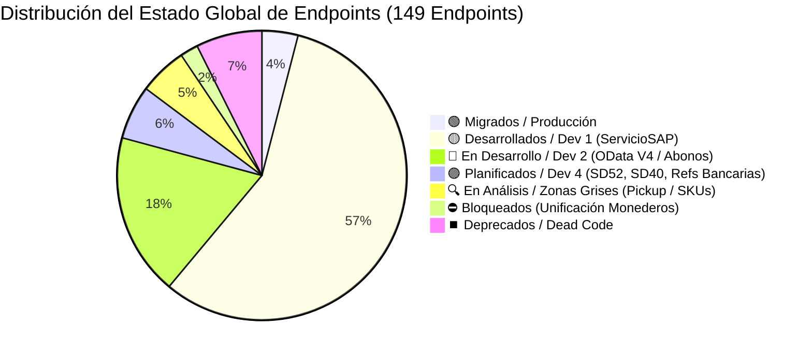
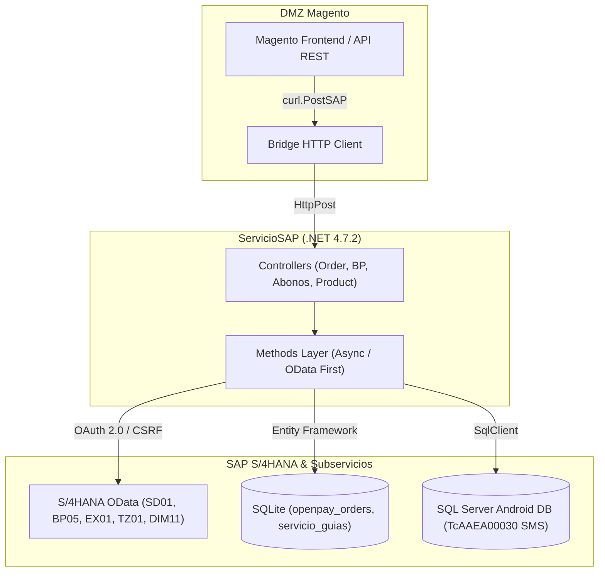
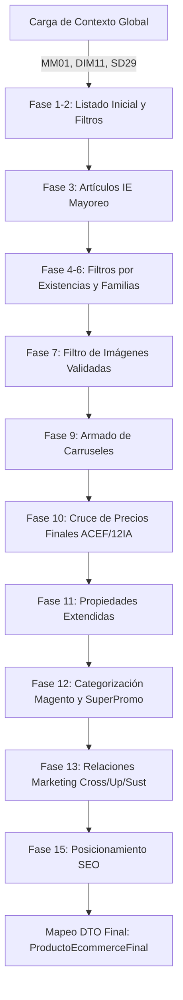
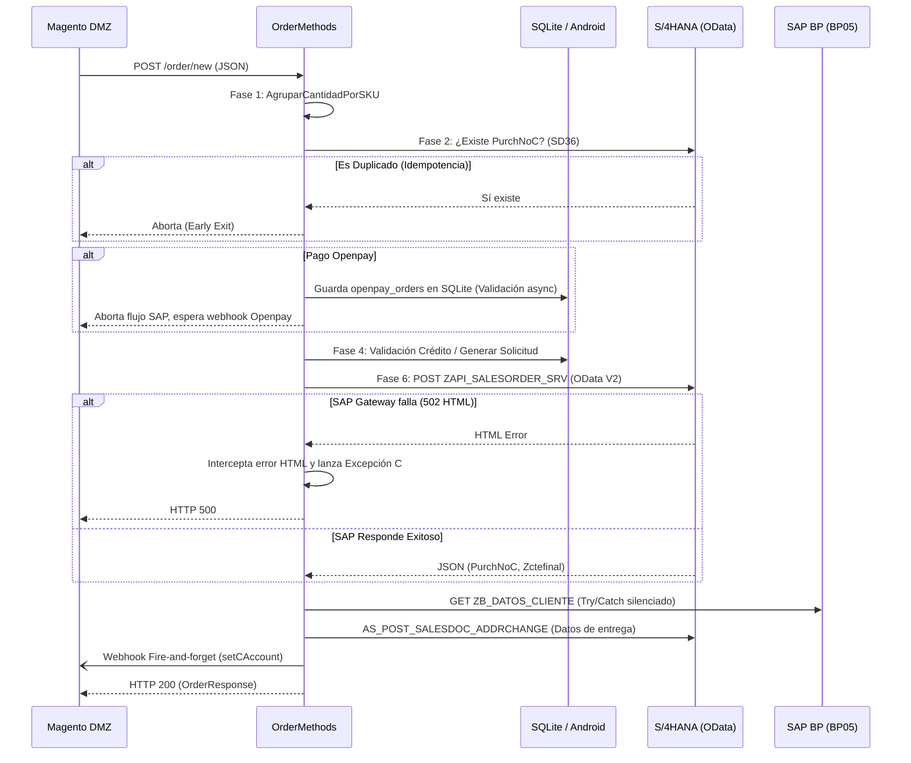

# Master Migration Summary Unified: LAN a SAP (Estado Global y Arquitectura)

> [!info] Documento Maestro Unificado (Single Source of Truth)
> **Proyecto:** Migración LAN (Intelisis) a SAP S/4HANA (Módulo Órdenes, E-Commerce, Crédito y Servicios)
> **Stack Tecnológico:** C# .NET 4.7.2 (Web API / ServicioSAP), SAP OData V2/V4, SQLite, SQL Server (SigMavi / Android DB)
> **Objetivo:** Desacoplar la dependencia del ERP heredado (Tablas locales y Stored Procedures de Intelisis) hacia la nueva arquitectura orientada a microservicios OData de S/4HANA, permitiendo a la DMZ Magento conectarse al nuevo **ServicioSAP**.
> **Última Sincronización:** 25 de Agosto de 2026

---

## 🏗️ Diccionario de Infraestructura (URLs Base y Rutas Locales)

En la siguiente tabla se mapean las constantes y orígenes de datos utilizados en la capa de consumo hacia su destino real:

| Constante / Configuración | Destino Real (URL / Ruta) |
| :--- | :--- |
| **S/4HANA (OData)** | `https://vhmvods4ci.sap.svrwes4h.com:44300/sap/opu/odata/sap` |
| **`URL_ANDROID_API`** | `https://android-api.mavi.fun` |
| **`URL_BP_API`** | `https://businesspartner-api.mavi.fun` |
| **`URL_SALES_DISTRIBUTION_API`**| `https://salesanddistribution-api.mavi.fun` |
| **`VETA_URL_LIBERADOR`** | `http://172.16.215.51:3026/api/venta` |
| **`AwsBaseUrl`** | `https://54wblyc2h6.execute-api.us-east-1.amazonaws.com/` |
| **`SQLITE_DB_PATH`** | `C:\inetpub\wwwroot\sap\` |
| **`IMAGES_CREDIT_PATH`** | `C:\inetpub\wwwroot\sap\images\credit` |
| **Servidor (IIS)** | `172.16.215.64` (Windows Server On-Premise) |
| **Ambiente (Mandante)** | `110` (QA - `SAP_STAGE`) |

> [!NOTE]
> **Arquitectura y Trusted Hosts (Seguridad DMZ)**
> La comunicación DMZ -> LAN valida estrictamente el origen de las peticiones mediante `DMZ\WebApiMagento\Helper\Curl.cs`. Los Trusted Hosts están configurados en el Web.config:
> - **DOMINIO_SAP:** `https://kdll3fhcyo-lan.grupomavi.com/SAP/`
>
> [!WARNING]
> **Gaps Operativos (Monitoreo y Secretos)**
> 1. **Logs y Observabilidad:** La aplicación escribe logs en texto plano localmente (`C:\inetpub\wwwroot\log\sap.log`). No hay integración con herramientas APM (Datadog, Splunk), requiriendo revisión manual vía RDP. Riesgo alto de ceguera operativa ante caídas de SAP.
> 2. **Gestión de Secretos:** Credenciales de SQL y OAuth SAP están en texto plano en el `Web.config`. Se requiere migrar a un administrador de secretos (ej. Key Vault o variables de entorno inyectadas en CI/CD) antes del paso a Producción.

---

## 📊 Resumen Visual del Estado Global de Endpoints (149 Total)



### 🏛️ Arquitectura de Comunicación DMZ ➔ ServicioSAP ➔ S/4HANA



---

## 1. Reglas Arquitectónicas Core (Reglas de Oro)

1. **Cero Consultas SAP DB Directas (OData First):** Supresión total de sentencias `INSERT/SELECT` contra tablas Z. Todo opera bajo protocolos OData (EntitySets) con inyección dinámica de credenciales OAuth 2.0 y base URL extraída desde DLL (`Conexion.dll`).
2. **Bases Locales Permanentes (Zonas Grises de SAP):**
   * **SQLite:** Mantiene rastros transaccionales de OpenPay y Servicio de Guías (`servicio_guias`, `openpay_orders`).
   * **MAVICBOSANDROID (SQL Server):** Mantiene la validación rigurosa de SMS (`TcAAEA00030_EnvioMensajes`) y la alta de Solicitudes de Crédito Web.
3. **Refactorización Asíncrona (Async/Await):** Para evitar *Socket Exhaustion* bajo carga alta (ej. Hot Sale), el monolito HTTP a SAP se migra progresivamente a `async Task`.
4. **Puentes DMZ a SAP (`PostSAP` Mandatorio):** La conexión entre la DMZ de Magento y el ServicioSAP se realiza usando el puente `curl.PostSAP(...)`. Todos los endpoints destino en ServicioSAP reciben peticiones en `[HttpPost]`.
5. **Exclusión Estricta de CrediLana:** Todo flujo exclusivo de la plataforma "CrediLana" queda fuera del alcance de la migración a SAP S/4HANA.

6. **Consistencia de Mandante (sap-client):** Todas las llamadas OData a S/4HANA deben utilizar el mandante estándar de QA (`sap-client=110`). Si bien en la documentación técnica RSG se realizaron pruebas usando el mandante `050`, la implementación en código debe forzar estrictamente `110` para garantizar la conexión al entorno homologado.

---

## 🔄 Matriz de Impacto y Reutilización de APIs SAP (Relación RSG vs Código C#)

En la siguiente matriz se relacionan los documentos oficiales de requerimiento presentes en la carpeta `RSG/` con las URLs/rutas OData extraídas directamente del código fuente de `ServicioSAP`, sus cabeceras de métodos C# y los flujos o endpoints beneficiados:

| Nomenclatura del Requerimiento (Documento `RSG/`)                      | Servicio OData / Ruta en Código C#                                                    | Cabecera del Método C# (`ServicioSAP/Methods/`)                                                                                   | Endpoints y Flujos Beneficiados que la Consumen                                                                         |
| :--------------------------------------------------------------------- | :------------------------------------------------------------------------------------ | :-------------------------------------------------------------------------------------------------------------------------------- | :---------------------------------------------------------------------------------------------------------------------- |
| `sd01_enviar_pedido.md`                                                | `/ZAPI_SALESORDER_SRV/A_SALES_ORDERSet`                                               | `OrderMethods.SetOrder(OrderRequest order, string option)`                                                                        | `POST /order/new`, `POST /order/testnew`, `SetOrder` E2E                                                                |
| `sd05_movbita.md`                                                      | `AI_GET_ZSDT_MOVBITA`                                                                 | `MovBitaMethods.GetMovBitaEventsAsync(string vbeln)`                                                                              | `GET /movbita/events/{vbeln}` (Consulta Estatus Bita)                                                                   |
| `sd09_devolucion.md`                                                   | `ZAPI_SALESORDER_SRV` (Motivo Devolución)                                             | `OrderMethods.BuilAdapterReturn(OrderRMA order)`                                                                                  | `POST /order/setreturn` (Devoluciones RMA)                                                                              |
| `sd36_consultar_documentos.md`                                         | `ZSRV_SALESDOCUMENT_SRV` / `ZAPI_DOCVTAS_CHECK_CDS`                                   | `SalesMethods.CheckDocumentExistsSD36Async(string purchNoC)`                                                                      | `GET /order/checkDocument/{purchNoC}`, Idempotencia de Pedidos, `GET /sale/{documentId}`, `GET /sale/filter/{filters}`  |
| `sd29_proprelist.md`                                                   | `/ZAPI_PROPRELIST_SRV/PropreListSet`                                                  | `FinalListProperMethods.GetFinalListProperByUen(string uen)`                                                                      | Precios E-Commerce (`product/exportaart`), Cotizador de Crédito                                                         |
| `sd33_consultar_bonificacion.md`                                       | `ZAPI_CAMPANA_BONIFICACION_SRV/REQUESTSet`                                            | `AccountMethods.GetBonusAsync(BonusRequest bonusRequest)`                                                                         | `POST /account/bonus`, `POST /account/bonus/async`                                                                      |
| `sd18_consultar_contrato.md`                                           | `/ZAPI_CONDITIONCONTRACT_SRV/ConditionContractSet`                                    | `WalletCustomerMethods.GetCustomerWalletAsync(string cliente)`                                                                    | `POST /customer/wallet/details`, `MonederoSaldoCredito`                                                                 |
| `bp01_bp02_maestro.md`                                                 | `ZAPI_BP01_PARTNER_SRV/BPartnerSet` & `API_BUSINESS_PARTNER/A_BusinessPartnerAddress` | `BusinessPartnerMethods.SubmitClientInfoAsync(Client newClient)`, `DeliveryAddressMethods.CreateBusinessPartnerAddressAsync(...)` | `POST /partner/client`, `PATCH /partner/client`, `POST /partneraddress/partner/{bpId}`, `PATCH /partneraddress/phone`   |
| `bp05_maestro.md`                                                      | `/ZB_DATOS_CLIENTE_CDS/ZB_DATOS_CLIENTE`                                              | `BusinessPartnerMethods.GetClientAsync(string clientId)`                                                                          | `GET /partner/client/{clientId}`, `GET /partner/client/filter/{sapFilter}`, `CreditMethods.IsValidated(string cliente)` |
| `bp05ma_maestro_expandido.md`                                          | `ZAPI_BP05MA_SRV/BusinessPartnerSet`                                                  | `BusinessPartnerMethods.GetClientMaAsync(string partnerId)`                                                                       | `GET /partner/client/ma/{clientId}` (Ficha expandida con 12 nodos)                                                      |
| *(Nuevo - Patch a Cte (variante BP02))*                                | `ZSDT_CTE_ODATA_SRV/ZSDT_CTE_ENTITYSet` (`AS_PATCH_ZSDT_CTE`)                         | `BusinessPartnerMethods.LinkMagentoAccountAsync(UnirCuentaRequest)`                                                               | `PATCH /partner/client/unircuenta` (Vinculación de Magento ID)                                                          |
| *(Nuevo - Consulta de Personal)*                                       | Android API `/employees/get_personalById`                                             | `BusinessPartnerMethods.GetSuccessFactorEmployeeAsync(string userId)`                                                             | `GET /partner/successfactor/employee/{userId}` (SuccessFactors)                                                         |
| *(Nuevo - Consulta canales de venta)*                                  | Android API `AS_GET_ZQSD_EditarCliente_CanalVenta`                                    | `BusinessPartnerMethods.GetCustomerSalesChannelsAsync(string clientId)`                                                           | `GET /partner/ventadist/client/{clientId}` (Canales de Venta)                                                           |
| `reglas_validacion_anexos.md`                                          | `ZQBC_CODEMSTRD_SRV/WACODEMSTRDSet` (`ZTBC_Code_MSTR`)                                | `BusinessPartnerMethods.GetConsultaAnexosAsync(string valorAnexo)`                                                                | `GET /partner/ConsultaAnexos/{valorAnexo}` (RFC Dinámico)                                                               |
| *(Nuevo - Codigos Postales Sepomex)*                                   | `ZAPI_ZDMT_SEPOMEX` (vía `AI_zdmt_sepomex`)                                           | `SepomexMethods.GetCodigosPostalesAsync(...)`                                                                                     | `GET /sepomex/validarcp` (Validación de cobertura por CP)                                                               |
| `ex01_documentos_no_compensados.md`                                    | `ZAPI_EX01_NOCOMP_SRV/DocNoCompSet`                                                   | `AbonoMethods.GetDocumentosNoCompensadosAsync(string cliente)`                                                                    | `POST /credit/GetAccountDebts`, Saldos Pendientes FI-CA                                                                 |
| `tz01_zsplits_mercaderias.md` / `ntz01_zsplits_mercaderias.md`         | `ZAPI_TZ01_ZSPLIT_MERC` (`zsb_ntz01_zsplit_merc.../zsplits`)                          | `AbonoMethods.GetParcialidadesAsync(string vbeln)`                                                                                | `POST /credit/getClienteFactura/{cliente}/{factura}`, Abonos y Parcialidades                                            |
| `dm01_articulos.md`                                                    | `/ZAPI_ARTICULOS_SRV/Articulos`                                                       | `ProductMethods.GetProducts()`                                                                                                    | `GET /product/products`, `GET /product/filter/{filter}`, Generación de Catálogo E-Commerce                              |
| `dim11_existencias.md`                                                 | `ZCDS_DIM11_EXISTENCIA_CDS/zcds_dim11_existencia`                                     | `ProductMethods.GetProductsStock()`, `GetStock(...)`                                                                              | `GET /product/stock`, `GET /product/stock/filter/{filter}`, `GET /product/stock/serial`, ATP Real-time                  |
| `dm02_jerarquia_articulos.md`                                          | `/ZAPI_JERARQUIA_ARTICULOS_SRV/GET_ARTICULOSSet`                                      | `ProductMethods.GetJerarquiaArticulos()`                                                                                          | `GET /product/jerarquia/articulos`, Categorías E-Commerce                                                               |
| `dm03_productos_relacionados.md`                                       | `ZAPI_CROSSSELL_SRV`, `ZAPI_UPSELL_SRV`, `ZAPI_SUSTITUTOS_SRV`                        | `ProductMethods.GetCrossSell(...)`, `GetUpsell(...)`, `GetSustitutos(...)`                                                        | `GET /product/crosssell`, `GET /product/upsell`, `GET /product/sustitutos`                                              |
| `dm05_etiquetas.md`                                                    | `ZAPI_ZMMT_ETIQUETA_SRV` & `ZAPI_ARTICULOS_SEO_SRV`                                   | `ProductMethods.GetEtiquetasAsync(...)`, `GetArticulosSEO(...)`                                                                   | `GET /etiquetas`, `GET /product/seo`, `POST /product/seo`, `PATCH /product/seo`, `DELETE /product/seo`                  |
| `dm07_sucursales.md`                                                   | `/ZAPI_SUCURSALES_SRV/SucursalesSet`                                                  | `OrderMethods.GetSucursalInfo(...)`                                                                                               | Validación de Tienda / Promotor en Creación de Pedidos                                                                  |
| `ND-CRED-42_Catalogo_Bancos.md` & `ND-CRED-42_Cuentas_Bancarias_BP.md` | `zapi_referencias_bancarias` / `ZFICRUD_COBREF_SRV`                                   | `AbonoMethods.ApplyPaymentIntentNeko(...)`, `UpdatePaymentStatusNekoAsync(...)`                                                   | `POST /credit/ApplyPaymentNeko`, `POST /credit/UpdateStatusPaymentNeko`                                                 |
| `sd46_anulacion_salida_mercancias.md`                                  | `ZAPI_SALESORDER_SRV` (Goods Issue Reversal)                                          | `OrderMethods.ReverseGoodsIssueAsync(OrderRMA order)`                                                                             | Reversión de entregas y salidas de mercancía                                                                            |
| `sd48_anulacion_facturas.md`                                           | `ZAPI_SALESORDER_SRV` (Invoice Cancellation)                                          | `OrderMethods.CancelInvoiceAsync(OrderRMA order)`                                                                                 | Anulación de facturación en S/4HANA                                                                                     |
| `sd52_pendiente.md`                                                    | *(Por definir)*                                                                       | *(Por implementar)*                                                                                                               | 🟣 **PLANIFICADO** - Pendiente de desarrollo                                                                            |
| `sd40_pendiente.md`                                                    | *(Por definir)*                                                                       | *(Por implementar)*                                                                                                               | 🟣 **PLANIFICADO** - Pendiente de desarrollo                                                                            |

---

## 📋 Inventario Informativo de Endpoints por Controlador

A continuación se detalla el inventario completo de endpoints existentes en el ecosistema, indicando su método HTTP y su origen de datos o servicio SAP asociado:

### 1. CreditController (30 Endpoints)

| Ruta Original DMZ                              | Método   | Ruta ServicioSAP                               | Estado           | Notas / Origen de Datos                                       |
| :--------------------------------------------- | :------- | :--------------------------------------------- | :--------------- | :------------------------------------------------------------ |
| `credit/getClienteFactura/{cliente}/{factura}` | GET→POST | `credit/getClienteFactura/{cliente}/{factura}` | 🟢 **Si**        | TZ01 - Migrado                                                |
| `credit/getClienteSaldo/{cliente}`             | GET      | *To Do*                                        | 🔴 **No**        | SD33 - WALLET                                                 |
| `credit/MonederoSaldoCredito`                  | POST     | *To Do*                                        | 🔴 **No**        | SD33 - WALLET                                                 |
| `credit/getSms`                                | POST     | *To Do*                                        | 🔴 **No**        | ANDROID - No requiere SAP                                     |
| `credit/validateSms`                           | POST     | *To Do*                                        | 🔴 **No**        | ANDROID - No requiere SAP                                     |
| `credit/codigoPromocion`                       | POST     | *To Do*                                        | 🔴 **No**        | SuccessFactors + BP05 + SIGMAVI - Requiere desarrollo         |
| `credit/codigoRecomendado`                     | POST     | *N/A*                                          | ⏹️ **Deprecado** | DEPRECADO                                                     |
| `credit/ExistRFCAndPhoneCte`                   | POST     | *To Do*                                        | 🔴 **No**        | BP05 filtro genérico existe, falta SuccesFactor + SD36 + SD05 |
| `credit/getPlazos`                             | GET      | *To Do*                                        | 🔴 **No**        | TZ01 + SIGMAVI - Requiere desarrollo                          |
| `credit/getCreditAccount/{pAccount}`           | GET      | *To Do*                                        | 🔴 **No**        | Validar ZtipoCliente = PROSPECTO en filtro BP05               |
| `credit/GetUnificationWalletStatus`            | POST     | *To Do*                                        | 🔴 **No**        | BLOQUEADO - APIs/tablas no existen                            |
| `credit/CheckAccountsPreUnification`           | POST     | *To Do*                                        | 🔴 **No**        | cteEnciarA + BP05_MA - Requiere desarrollo                    |
| `credit/SetUnificationWalletData`              | POST     | *To Do*                                        | 🔴 **No**        | BLOQUEADO - APIs/tablas no existen                            |
| `credit/SolicitudMercancia`                    | POST     | *To Do*                                        | 🔴 **No**        | Migrar logica a SAP                                           |
| `credit/guardardocumento`                      | POST     | *To Do*                                        | 🟢 **Si**        | Migrar logica a SAP                                           |
| `credit/SaveHaztenTransaction`                 | POST     | *To Do*                                        | 🔴 **No**        | EXT/SIGMAVI - No requiere SAP                                 |
| `credit/CreditoWeb_FormDatos`                  | POST     | *To Do*                                        | 🔴 **No**        | CrediLana - No requiere SAP                                   |
| `credit/CreditoWeb_SaveFirstData`              | POST     | *To Do*                                        | 🔴 **No**        | CrediLana - No requiere SAP                                   |
| `credit/CreditoWeb_SaveData`                   | POST     | *To Do*                                        | 🔴 **No**        | CrediLana - No requiere SAP                                   |
| `credit/CreditoWeb_SaveData_Articulos`         | POST     | *To Do*                                        | 🔴 **No**        | ANDROID - No requiere SAP                                     |
| `credit/CreditoWeb_Informacion`                | POST     | *To Do*                                        | 🔴 **No**        | CrediLana - No requiere SAP                                   |
| `credit/CreditoWeb_Solicitud`                  | POST     | *To Do*                                        | 🔴 **No**        | CrediLana - No requiere SAP                                   |
| `credit/CreditoWeb_SolicitudPrimerGuardado`    | POST     | *To Do*                                        | 🔴 **No**        | CrediLana - No requiere SAP                                   |
| `credit/CreditoWeb_Seguro`                     | POST     | *To Do*                                        | 🔴 **No**        | CrediLana - No requiere SAP                                   |
| `credit/GetCreditAmounts`                      | POST     | `credit/GetCreditAmounts`                      | 🟢 **Si**        | CrediLana - Endpoint SAP existe                               |
| `credit/Validar_Lada`                          | POST     | *N/A*                                          | ⏹️ **Deprecado** | DEPRECADO                                                     |
| `credit/codigoRecomendadoWithUen`              | POST     | *To Do*                                        | ⏹️ **Deprecado** | UEN variant - No en scope                                     |
| `credit/SaveImagesProductosMx`                 | POST     | *To Do*                                        | 🟢 **Si**        | ProductosMX image upload - No requiere SAP                    |
| `credit/GetPhoneValidatedClientSecretName`     | POST     | *To Do*                                        | 🔴 **No**        | SMS/CrediLana - No requiere SAP                               |
| `credit/SendSmsNewNumber`                      | POST     | `credit/SendSmsNewNumber`                      | 🟢 **Si**        | SMS - Endpoint SAP existe                                     |

---

### 2. CustomersController (5 Endpoints)

| Ruta Original DMZ | Método | Ruta ServicioSAP | Estado | Notas / Origen de Datos |
| :--- | :--- | :--- | :--- | :--- |
| `customer/setCustomer` | POST | `partner/client` | 🟢 **Si** | BP01 - Migrado |
| `customer/setCustomerList` | POST | `customer/setCustomerList` | 🟢 **Si** | SIGMAVI + SAP - Endpoint SAP existe |
| `customer/getCustomerList` | GET | `customer/getCustomerList` | 🟢 **Si** | SIGMAVI + SAP - Endpoint SAP existe |
| `customer/deleteCustomerList` | POST | `customer/deleteCustomerList` | 🟢 **Si** | SIGMAVI + SAP - Endpoint SAP existe |
| `customer/cashCustomerReport` | POST | *To Do* | 🔴 **No** | OTRO - Archivo en red |

---

### 3. CustomerServiceController (26 Endpoints)

| Ruta Original DMZ | Método | Ruta ServicioSAP | Estado | Notas / Origen de Datos |
| :--- | :--- | :--- | :--- | :--- |
| `customerService/GetAccountDebts` | POST | `credit/GetAccountDebts` | 🟢 **Si** | EX01 - Migrado |
| `customerService/ApplyPaymentNeko` | POST | `credit/ApplyPaymentNeko` | 🔴 **No** | ZAPI_REFERENCIAS_BANCARIAS - Estructura SAP existe falta lógica ABAP |
| `customerService/UpdateStatusPaymentNeko` | POST | `credit/UpdateStatusPaymentNeko` | 🔴 **No** | ZAPI_REFERENCIAS_BANCARIAS - Estructura SAP existe falta lógica ABAP |
| `customerService/ApplyPaymentAdvanced` | POST | *To Do* | 🔴 **No** | ZAPI_REFERENCIAS_BANCARIAS - Requiere desarrollo |
| `customerService/UpdateStatusPaymentAdvanced` | POST | *To Do* | 🔴 **No** | ZFICRUD_COBREF_SRV - Requiere desarrollo |
| `customerService/obtenerTipoGarantia` | POST | *To Do* | 🔴 **No** | SIGMAVI - No requiere SAP |
| `customerService/unirCuenta` | POST | `partner/client/unircuenta` | 🔴 **No** (Conectado) / 🟢 **Si** (Generado) | BP05 ZID_MAGENTO - Recién desarrollado |
| `customerService/validarCliente` | POST | *To Do* | 🔴 **No** | BP05 - Filtro genérico ya existe |
| `customerService/nombreCliente` | POST | `partner/client/ma/{clientId}` | 🔴 **No** | BP05_MA - Endpoint SAP ya existe |
| `customerService/bitacoraAtencionClientes` | POST | *To Do* | 🔴 **No** | ANDROID - No requiere SAP |
| `customerService/validarCoberturaPorCP` | POST | *To Do* | 🔴 **No** | SEPOMEX - Endpoint SAP existe |
| `customerService/obtenerVentanaConfirmacion` | POST | *To Do* | 🔴 **No** | BP05 + SD36 + ADDRCHANGE - Requiere desarrollo (3 APIs) |
| `customerService/obtenerCreditos` | POST | *To Do* | 🔴 **No** | SD36 + DM01 + tarjetaSerie - Requiere desarrollo |
| `customerService/obtenerQuejas` | POST | *To Do* | 🔴 **No** | ANDROID - No requiere SAP |
| `customerService/ObtenerEstatusEmbarque` | POST | *To Do* | 🔴 **No** | BLOQUEADO - Pendiente desarrollo ABAP |
| `customerService/LoginClienteCredito` | POST | *To Do* | 🔴 **No** | BP05 - Login por datos BP |
| `customerService/LoginClienteCreditoFechaN` | POST | *To Do* | 🔴 **No** | BP05 - Login por fecha nacimiento |
| `customerService/GetSTPAccount` | POST | *To Do* | 🔴 **No** | ZAPI_REFERENCIAS_BANCARIAS - Requiere desarrollo ABAP |
| `customerService/GetSalesChannelsSTP` | POST | *To Do* | 🔴 **No** | CteEnviarA → salesanddistribution-api.mavi.fun/AS_GET_PartnerAddress?SdDoc=0000007844&PartnRole=WE |
| `customerService/ValidateSTPAccount` | GET | *To Do* | 🔴 **No** | Tabla Z nueva en SAP - Requiere desarrollo |
| `customerService/bbvaKeyNeko` | POST | *N/A* | ⏹️ **Deprecado** | DEPRECADO |
| `customerService/bbvaKeyAdvanced` | POST | *To Do* | 🔴 **No** | Herramienta EXT BBVA |
| `customerService/GetEmpleadoByNomina` | POST | `partner/successfactor/employee/{userId}` | 🔴 **No** | SuccessFactor - Endpoint SAP existe |
| `customerService/ActualizarCamposConfigurables` | POST | *N/A* | ⏹️ **Deprecado** | DEPRECADO |
| `customerService/InsertarDesdeTablerateNativo` | POST | *N/A* | ⏹️ **Deprecado** | DEPRECADO |
| `customerService/InsertarDesdeTablerateCustom` | POST | *N/A* | ⏹️ **Deprecado** | DEPRECADO |

---

### 4. OrdersController (20 Endpoints)

| Ruta Original DMZ | Método | Ruta ServicioSAP | Estado | Notas / Origen de Datos |
| :--- | :--- | :--- | :--- | :--- |
| `order/setOrder` | POST | `order/new` | 🟢 **Si** | SD01 - Migrado |
| `order/cancelOrder` | POST | `order/cancelOrder` | 🟢 **Si** | SD46 - Endpoint SAP existe faltan escenarios delivery |
| `order/returnOrder` | POST | `order/setreturn` | 🟢 **Si** | SD09 - Migrado |
| `order/getIntelisisStatuses` | POST | `sale/filter/{filters}` | 🔴 **No** (Conectado) / 🟢 **Si** (Generado) | SD36 - Reutilizar SaleController |
| `order/getPosCancellations` | POST | `order/cancelInvoice` | 🔴 **No** (Conectado) / 🟢 **Si** (Generado) | SD48 - DEPRECADO pero endpoint SAP existe |
| `order/creditStatus/{idSolicitud}` | GET | `sale/filter/{filters}` | 🔴 **No** (Conectado) / 🟢 **Si** (Generado) | SD36 - Reutilizar SaleController |
| `order/updateCreditOrderId` | POST | *To Do* | 🔴 **No** | Se tiene que revisar si es posible actualizar un documento de ventas, revisarlo con Alan |
| `order/estimated-delivery/{ecommerceId}` | GET | *To Do* | 🔴 **No** | SD36 + ADDRCHANGE + tracking - Requiere desarrollo |
| `order/GetPickUpCode` | POST | *To Do* | 🔴 **No** | TrWDM0285_CteRecoge → SIGMAVI |
| `order/ManagePaynetOrders` | POST | *To Do* | 🔴 **No** | Tabla Venta (SD36) + SQLITE + spAfectar VALIDAR FLUJO - Requiere desarrollo |
| `order/InsertPaymentData` | POST | *To Do* | 🔴 **No** | INSERT Tabla CXCCMensajeWebHookOpenPay INTELISIS a Migrar a SIGMAVI |
| `order/getGuide` | POST | `order/getGuide` | 🟢 **Si** | Migrado |
| `order/validateCredit` | POST | `order/new` | 🔴 **No** | Mismo flujo que setOrder - Apuntar a order/new pero manteniendo ValidateCredit |
| `order/authorizationResult` | POST | *N/A (MAGENTO directo)* | 🟢 **Si** | DMZ→Magento directo - No requiere SAP |
| `order/setOrderStatus` | POST | *N/A (MAGENTO directo)* | 🟢 **Si** | DMZ→Magento directo - No requiere SAP |
| `order/getOrderInfo/{incrementId}` | GET | *N/A (MAGENTO directo)* | 🟢 **Si** | DMZ→Magento directo - No requiere SAP |
| `order/jsonOrders/{incrementId}` | GET | *N/A (MAGENTO directo)* | 🟢 **Si** | DMZ→Magento directo - No requiere SAP |
| `order/setCAccount` | POST | *N/A (MAGENTO directo)* | 🟢 **Si** | DMZ→Magento directo - No requiere SAP |
| `order/sendStorePickupEmail` | POST | *N/A (MAGENTO directo)* | 🟢 **Si** | DMZ→Magento directo - No requiere SAP |
| `order/getprueba` | GET | *N/A* | 🔴 **No** | DEPRECADO |

---

### 5. 📦 Módulo E-Commerce, Catálogo y Materiales
**Controladores:** `ProductController.cs`, `EcommerceController.cs` | **Lógica:** `EcommerceMethods.cs`

> [!NOTE]
> **Reemplazo de SPexportaart:** Este módulo (1,800+ líneas) es la refactorización a microservicios del gigantesco Stored Procedure `SPexportaart`. Su función es orquestar la exportación del catálogo completo de artículos desde S/4HANA hacia Magento.


#### 5.2 ATP Real-time (DIM11)
- **Ruta ServicioSAP:** `GET /product/stock`
- **Consumo SAP:** OData `/ZCDS_DIM11_EXISTENCIA_CDS/zcds_dim11_existencia`
**Reglas de Negocio:**
- Cruza inventario físico contra existencias lógicas en SAP. Las peticiones emplean `try/catch`, si SAP falla, se devuelven estructuras vacías permitiendo que el orquestador maestro no se caiga abruptamente (Fail-Safe), protegiendo la resiliencia del frontend.

---
### 6. 💰 Monedero Electrónico y 7. Bonificaciones
**Controladores:** `WalletCustomerController.cs`, `AccountController.cs`

#### 6.1 Detalles de Monedero (SD18) y Bonos (SD33)
- **Rutas ServicioSAP:** `POST /customer/wallet/details`
**Reglas de Negocio:**
- Consume BAPIs adaptadas (`ZAPI_CONDITIONCONTRACT_SRV`) para consultar montos virtuales y tarjetas de monedero vinculadas al BP.

---
### 8. 🖼️ Módulo de Imágenes y Marketing
**Controlador:** `ImagenController.cs`

#### 8.1 Imágenes Optimizadas
- **Ruta ServicioSAP:** `GET /ma/imagenes/optimizadas`
**Reglas de Negocio:**
- Accede al file system local (`IMAGES_CREDIT_PATH`) para cachear u optimizar la entrega de imágenes.

---
### 9. 📱 Módulo de SMS, Crédito y Documentos
**Controladores:** `CreditController.cs` | **Lógica:** `DocumentMethods.cs`

#### 9.1 Envío SMS y Montos de Crédito
- **Ruta ServicioSAP:** `POST /credit/SendSmsNewNumber`, `POST /credit/GetCreditAmounts`
**Reglas de Negocio:**
- `GetCreditAmounts` resuelve montos dependiendo del tipo de crédito y UEN ("nuevo", "casa"). Se nutre de tablas locales.
- `guardardocumento` recibe el multipart Base64 y lo inserta en `MAVI_DOC_CTE` y `SaveImagesProductosMx` guarda expedientes en disco físico.
- El servicio Liberador (para primera compra) se autentica en `VETA_URL_LIBERADOR`.

---
### 10. 🗺️ Módulo de SEPOMEX
**Controlador:** `SepomexController.cs`

#### 10.1 Validación de Códigos Postales
- **Ruta ServicioSAP:** `GET /sepomex/validarcp`
- **Consumo:** `URL_SALES_DISTRIBUTION_API/AI_zdmt_sepomex`
**Reglas de Negocio:**
- Reemplaza el servicio legacy consumiendo una API centralizada que provee estado, municipio y colonias a partir del CP (para validación de alta de BP).


## ⚡ Auditoría de Patrón Asíncrono (Async/Await) y Plan de Refactorización en ServicioSAP

Para garantizar un alto rendimiento en producción (*evitando Thread Pool Starvation y Socket Exhaustion en eventos masivos como Hot Sale*), se auditó el patrón de ejecución asíncrona en **todos los controladores y clases de servicios de C# .NET 4.7.2**:

### 1. 🎮 Auditoría de Controladores (`ServicioSAP/Controllers/`)

| Controlador | Endpoint | Firma HTTP C# | Estatus Async | Método Interno Invocado (`Methods/`) |
| :--- | :--- | :--- | :--- | :--- |
| **`BusinessPartnerController.cs`** | `GET /partner/client/{clientId}` | `async Task<IHttpActionResult>` | 🟢 **ASYNC** | `bpMethods.GetClientAsync(...)` |
| | `POST /partner/client` | `async Task<IHttpActionResult>` | 🟢 **ASYNC** | `bpMethods.SubmitClientInfoAsync(...)` |
| | `PATCH /partner/client` | `async Task<IHttpActionResult>` | 🟢 **ASYNC** | `bpMethods.SubmitClientInfoAsync(...)` |
| | `PATCH /partner/client/unircuenta` | `async Task<IHttpActionResult>` | 🟢 **ASYNC** | `bpMethods.LinkMagentoAccountAsync(...)` |
| | `GET /partner/client/filter/{f}` | `async Task<IHttpActionResult>` | 🟢 **ASYNC** | `bpMethods.GetFilterClientsAsync(...)` |
| | `GET /partner/client/ma/{clientId}` | `async Task<IHttpActionResult>` | 🟢 **ASYNC** | `bpMethods.GetClientMaAsync(...)` |
| | `GET /partner/successfactor/employee/{id}` | `async Task<IHttpActionResult>` | 🟢 **ASYNC** | `bpMethods.GetSuccessFactorEmployeeAsync(...)` |
| | `GET /partner/ventadist/client/{id}` | `async Task<IHttpActionResult>` | 🟢 **ASYNC** | `bpMethods.GetCustomerSalesChannelsAsync(...)` |
| | `GET /partner/ConsultaAnexos/{v}` | `async Task<IHttpActionResult>` | 🟢 **ASYNC** | `bpMethods.GetConsultaAnexosAsync(...)` |
| | `POST /partner/testnew` | `async Task<IHttpActionResult>` | 🔴 **SÍNCRONO** | `bpMethods.TestCreateClientRaw(...)` *(vía Task.Wait)* |
| **`PartnerAddressController.cs`** | `GET /partneraddress/partner/{bpId}` | `async Task<IHttpActionResult>` | 🟢 **ASYNC** | `deliveryMethods.GetBusinessPartnerAddressAsync(...)` |
| | `POST /partneraddress/partner/{bpId}` | `async Task<IHttpActionResult>` | 🟢 **ASYNC** | `deliveryMethods.CreateBusinessPartnerAddressAsync(...)` |
| | `PATCH /partneraddress/.../address/{id}` | `async Task<IHttpActionResult>` | 🟢 **ASYNC** | `deliveryMethods.UpdateBusinessPartnerAddressAsync(...)` |
| | `PATCH /partneraddress/partner/phone` | `async Task<IHttpActionResult>` | 🟢 **ASYNC** | `deliveryMethods.UpdateAddressPhoneNumberAsync(...)` |
| | `GET /partneraddress/salesdoc/{sd}/role/{r}` | `async Task<IHttpActionResult>` | 🟢 **ASYNC** | `deliveryMethods.GetSalesDocumentAddressAsync(...)` |
| | `POST /partneraddress/salesdoc` | `async Task<IHttpActionResult>` | 🟢 **ASYNC** | `deliveryMethods.ChangeSalesDocumentAddressAsync(...)` |
| **`AbonosController.cs`** | `POST /credit/GetAccountDebts` | `async Task<IHttpActionResult>` | 🟢 **ASYNC** | `_abonoMethods.GetDocumentosNoCompensadosAsync(...)` |
| | `POST /credit/getClienteFactura/{c}/{f}` | `async Task<IHttpActionResult>` | 🟢 **ASYNC** | `_abonoMethods.GetParcialidadesAsync(...)` |
| | `POST /credit/UpdateStatusPaymentNeko` | `async Task<IHttpActionResult>` | 🟢 **ASYNC** | `_abonoMethods.UpdatePaymentStatusNekoAsync(...)` |
| | `POST /credit/ApplyPaymentNeko` | `IHttpActionResult` | 🔴 **SÍNCRONO** | `_abonoMethods.ApplyPaymentIntentNeko(...)` |
| **`CreditController.cs`** | `POST /credit/SendSmsNewNumber` | `async Task<IHttpActionResult>` | 🟢 **ASYNC** | `CreditMethods.SendSmsNewNumberAsync(...)` |
| | `POST /credit/GetCreditAmounts` | `async Task<IHttpActionResult>` | 🟢 **ASYNC** | `CredilanaMethods.GetCredilanaInfoAsync(...)` |
| | `POST /credit/guardardocumento` | `async Task<IHttpActionResult>` | 🟢 **ASYNC** | `DocumentMethods.GuardarDocumentoAsync(...)` |
| | `POST /credit/SaveImagesProductosMx` | `async Task<IHttpActionResult>` | 🟢 **ASYNC** | `DocumentMethods.SaveImagesProductosMxAsync(...)` |
| **`SaleController.cs`** | `POST /sale` | `async Task<IHttpActionResult>` | 🟢 **ASYNC** | `SalesMethods.InsertDocumentAsync(...)` |
| | `GET /sale/{documentId}` | `async Task<IHttpActionResult>` | 🟢 **ASYNC** | `SalesMethods.GetDocumentByIdAsync(...)` |
| | `GET /sale/filter/{filters}` | `async Task<IHttpActionResult>` | 🟢 **ASYNC** | `SalesMethods.GetFilterDocumentsAsync(...)` |
| **`WalletCustomerController.cs`** | `POST /customer/wallet/details` | `async Task<IHttpActionResult>` | 🟢 **ASYNC** | `walletMethods.GetCustomerWalletAsync(...)` |
| **`ImagenController.cs`** | `GET /ma/imagenes/optimizadas` | `async Task<IHttpActionResult>` | 🟢 **ASYNC** | `ImagenMethods.GetArticulosConImagenOptimizadaAsync(...)` |
| | `GET /ma/imagenes/refresh` | `async Task<IHttpActionResult>` | 🟢 **ASYNC** | `ImagenMethods.GetArticulosConImagenOptimizadaAsync(...)` |
| **`EtiquetasController.cs`** | `GET /etiquetas` | `async Task<IHttpActionResult>` | 🟢 **ASYNC** | `ProductMethods.GetEtiquetasAsync(...)` |
| **`AccountController.cs`** | `POST /account/bonus/async` | `async Task<IHttpActionResult>` | 🟢 **ASYNC** | `accountMethods.GetBonusAsync(...)` |
| | `POST /account/bonus` | `IHttpActionResult` | 🔴 **SÍNCRONO** | `accountMethods.GetBonus(...)` |
| **`OrderController.cs`** | `POST /order/new` | `IHttpActionResult` | 🔴 **SÍNCRONO** | `orderMethods.SetOrder(...)` |
| | `POST /order/setreturn` | `IHttpActionResult` | 🔴 **SÍNCRONO** | `orderMethods.BuilAdapterReturn(...)` |
| | `GET /order/validatecupon/{codigo}` | `IHttpActionResult` | 🔴 **SÍNCRONO** | `orderMethods.HandlePromoCode(...)` |
| | `GET /order/checkDocument/{purchNoC}` | `IHttpActionResult` | 🔴 **SÍNCRONO** | `SalesMethods.CheckDocumentExistsSD36Async` *(vía `.Result`)* |
| | `POST /order/cancelOrder` & `cancelInvoice` | `IHttpActionResult` | 🔴 **SÍNCRONO** *(puente `.GetAwaiter().GetResult()`)* | `ReverseGoodsIssueAsync` & `CancelInvoiceAsync` |
| | `POST /order/getGuide` | `async Task<IHttpActionResult>` | 🟢 **ASYNC** | `orderMethods.GetGuideWithNameAsync(...)` |
| **`MovBitaController.cs`** | `GET /movbita/events/{vbeln}` | `async Task<IHttpActionResult>` | 🟢 **ASYNC** | `movBitaMethods.GetMovBitaEventsAsync(...)` |
| **`SepomexController.cs`** | `GET /sepomex/validarcp` | `async Task<IHttpActionResult>` | 🟢 **ASYNC** | `sepomexMethods.GetCodigosPostalesAsync(...)` |
| **`EcommerceController.cs`** | `GET /ecommerce/listado` | `IHttpActionResult` | 🔴 **SÍNCRONO** | `EcommerceMethods.CargarContextoProceso(...)` |
| **`CustomersController.cs`** | `POST /customer/setCustomerList` | `async Task<IHttpActionResult>` | 🟢 **ASYNC** | `CustomerMethods.blackwhitelistAsync(...)` |
| | `POST /customer/getCustomerList` | `async Task<IHttpActionResult>` | 🟢 **ASYNC** | `CustomerMethods.blackwhitelistAsync(...)` |
| | `POST /customer/deleteCustomerList` | `async Task<IHttpActionResult>` | 🟢 **ASYNC** | `CustomerMethods.blackwhitelistAsync(...)` |
| **`ProductController.cs`** | `GET /product/exportaart/{store}` | `IHttpActionResult` | 🔴 **SÍNCRONO** | `EcommerceMethods.EjecutarProcesoCompleto(...)` |
| | `GET /product/products` y 20 endpoints | `IHttpActionResult` | 🔴 **SÍNCRONO** | `ProductMethods` (síncronos) |
| **`LoginController.cs`** | `POST /login/auth` | `IHttpActionResult` | 🔴 **SÍNCRONO** | Verificación local de Salt + Hash |

---

### 2. ⚙️ Auditoría de Clases de Servicio (`ServicioSAP/Methods/`)

| Archivo C#                       | Método Interno                                     | Estatus Async   | Servicio SAP / Recurso Consumido                     |
| :------------------------------- | :------------------------------------------------- | :-------------- | :--------------------------------------------------- |
| **`BusinessPartnerMethods.cs`**  | `GetClientAsync`                                   | 🟢 **ASYNC**    | OData V2 (`ZB_DATOS_CLIENTE_CDS`)                    |
|                                  | `SubmitClientInfoAsync`                            | 🟢 **ASYNC**    | OData V2 (`ZAPI_BP01_PARTNER_SRV`)                   |
|                                  | `GetFilterClientsAsync`                            | 🟢 **ASYNC**    | OData V2 (`ZB_DATOS_CLIENTE_CDS`)                    |
|                                  | `GetClientMaAsync`                                 | 🟢 **ASYNC**    | OData V2 (`ZAPI_BP05MA_SRV`)                         |
|                                  | `GetSuccessFactorEmployeeAsync`                    | 🟢 **ASYNC**    | Android API (`/employees/get_personalById`)          |
|                                  | `GetCustomerSalesChannelsAsync`                    | 🟢 **ASYNC**    | Android API (`AS_GET_ZQSD_EditarCliente_CanalVenta`) |
|                                  | `LinkMagentoAccountAsync`                          | 🟢 **ASYNC**    | OData V2 (`ZSDT_CTE_ODATA_SRV` PATCH + CSRF)         |
|                                  | `GetConsultaAnexosAsync`                           | 🟢 **ASYNC**    | OData V2 (`ZQBC_CODEMSTRD_SRV`)                      |
| **`DeliveryAddressMethods.cs`**  | `GetBusinessPartnerAddressAsync`                   | 🟢 **ASYNC**    | OData V2 (`API_BUSINESS_PARTNER` + `$expand`)        |
|                                  | `CreateBusinessPartnerAddressAsync`                | 🟢 **ASYNC**    | OData V2 (POST Dirección)                            |
|                                  | `UpdateBusinessPartnerAddressAsync`                | 🟢 **ASYNC**    | OData V2 (`PATCH` Dirección)                         |
|                                  | `UpdateAddressPhoneNumberAsync`                    | 🟢 **ASYNC**    | OData V2 (`PATCH` Teléfono)                          |
|                                  | `GetSalesDocumentAddressAsync`                     | 🟢 **ASYNC**    | OData V2 (`ZSRV_SALESDOC_ADDRCHANGE_SRV` GET)        |
|                                  | `ChangeSalesDocumentAddressAsync`                  | 🟢 **ASYNC**    | OData V2 (`ZSRV_SALESDOC_ADDRCHANGE_SRV` POST)       |
| **`AbonoMethods.cs`**            | `GetDocumentosNoCompensadosAsync`                  | 🟢 **ASYNC**    | OData V2 (`ZAPI_EX01_NOCOMP_SRV`)                    |
|                                  | `GetParcialidadesAsync`                            | 🟢 **ASYNC**    | OData V4 (`ZAPI_TZ01_ZSPLIT_MERC`)                   |
|                                  | `UpdatePaymentStatusNekoAsync`                     | 🟢 **ASYNC**    | Referencias bancarias                                |
|                                  | `ApplyPaymentIntentNeko`                           | 🔴 **SÍNCRONO** | Operación local SQL                                  |
| **`SalesMethods.cs`**            | `InsertDocumentAsync`                              | 🟢 **ASYNC**    | OData V2 (`ZAPI_VENTAS_SRV`)                         |
|                                  | `GetDocumentByIdAsync`                             | 🟢 **ASYNC**    | OData V2 (`ZAPI_DOCVTAS_CHECK_CDS`)                  |
|                                  | `GetFilterDocumentsAsync`                          | 🟢 **ASYNC**    | OData V2 (`ZAPI_DOCVTAS_CHECK_CDS`)                  |
|                                  | `CheckDocumentExistsSD36Async`                     | 🟢 **ASYNC**    | OData V2 (`SD36`)                                    |
| **`WalletCustomerMethods.cs`**   | `GetCustomerWalletAsync`                           | 🟢 **ASYNC**    | OData V2 (`ZAPI_CONDITIONCONTRACT_SRV`)              |
| **`AccountMethods.cs`**          | `GetBonusAsync`                                    | 🟢 **ASYNC**    | OData V2 (`ZAPI_CAMPANA_BONIFICACION_SRV`)           |
| **`ImagenMethods.cs`**           | `GetArticulosConImagenOptimizadaAsync`             | 🟢 **ASYNC**    | File I/O async                                       |
| **`ProductMethods.cs`**          | `GetEtiquetasAsync`                                | 🟢 **ASYNC**    | OData V2 (`ZAPI_ZMMT_ETIQUETA_SRV`)                  |
|                                  | `GetProducts`, `GetStock`, etc.                    | 🔴 **SÍNCRONO** | Llamadas HTTP síncronas a S/4HANA                    |
| **`OrderMethods.cs`**            | `ReverseGoodsIssueAsync`, `CancelInvoiceAsync`     | 🟢 **ASYNC**    | OData V2 SD46 / SD48 (Ya en master)                  |
|                                  | `GetGuideWithNameAsync`                            | 🟢 **ASYNC**    | SQLite (`servicio_guias`)                            |
|                                  | `SetOrder`, `BuilAdapterReturn`, `HandlePromoCode` | 🔴 **SÍNCRONO** | Monolito HTTP síncrono                               |
| **`MovBitaMethods.cs`**          | `GetMovBitaEventsAsync`                            | 🟢 **ASYNC**    | SAP Wrapper (`AI_GET_ZSDT_MOVBITA`)                  |
| **`SepomexMethods.cs`**          | `GetCodigosPostalesAsync`                          | 🟢 **ASYNC**    | SAP Wrapper (`AI_zdmt_sepomex`)                      |
| **`CreditMethods.cs`**           | `SendSmsNewNumberAsync`                            | 🟢 **ASYNC**    | SQL Server Android                                   |
|                                  | `IsValidated`                                      | 🔴 **SÍNCRONO** | SQL Server Android síncrono                          |
| **`CredilanaMethods.cs`**        | `GetCredilanaInfoAsync`                            | 🟢 **ASYNC**    | Android API (CrediLana montos)                       |
| **`DocumentMethods.cs`**         | `GuardarDocumentoAsync`                            | 🟢 **ASYNC**    | EXT (Hazten / MAVI_DOC_CTE)                          |
|                                  | `SaveImagesProductosMxAsync`                       | 🟢 **ASYNC**    | EXT (ProductosMX fire-and-forget)                    |
| **`CustomerMethods.cs`**         | `blackwhitelistAsync`                              | 🟢 **ASYNC**    | SIGMAVI (Listas Blanca/Negra)                        |
| **`EcommerceMethods.cs`**        | `EjecutarProcesoCompleto`                          | 🔴 **SÍNCRONO** | Pipeline síncrono (1,800+ líneas)                    |
| **`LiberadorCreditoMethods.cs`** | `LiberarCliente`                                   | 🔴 **SÍNCRONO** | Consumo síncrono del servicio externo JWT            |

---

### 3. 🎯 Diagnóstico y Matriz de Pendientes de Refactorización Async

* **Módulos Ya Convertidos al Patrón Async/Await (🟢 60% Completado):**
  * `BusinessPartnerController`, `PartnerAddressController`, `AbonosController`, `SaleController`, `WalletCustomerController`, `ImagenController`, `EtiquetasController`.
* **Módulos Pendientes de Refactorizar a Async (🔴 40% Reestructuración Pendiente):**
  1. **`OrderController.cs` & `OrderMethods.cs`:** Convertir `SetOrder` (SD01), `SetReturn` (SD09) y `HandlePromoCode` a `async Task` para evitar bloqueos HTTP durante la creación masiva de pedidos.
  2. **`ProductController.cs` & `ProductMethods.cs`:** Migrar las consultas OData de existencias ATP real-time (`GetStock`, `GetProductsStock`), maestro de productos (`GetProducts`) y precios (`GetFinalListProperByUen`) a `async Task`.
  3. **`EcommerceMethods.cs`:** Adaptar las llamadas HTTP internas del pipeline de catálogo a `async/await`.
  4. **`CreditMethods.cs` & `LiberadorCreditoMethods.cs`:** Convertir las llamadas a SQL Server Android y al servicio de Liberación de Crédito a `async Task`.

### 4. 🐞 Riesgos y Deuda Técnica Hardcodeada (Gaps de Código)

Durante la auditoría del código C#, se detectaron los siguientes *gaps* que requieren refactorización urgente antes del paso a producción:

1. **Business Partner Dummy:** En `OrderMethods.cs`, la variable constante `GuestCashPartnerNumber` tiene asignado el BP de prueba `1500003857`. **Acción:** Reemplazar por el número de BP genérico definitivo entregado por SAP.

---

## 2. Estado de Módulos Críticos y Gaps del Release Test

### 🟢 Módulos Ya Migrados y Soportados

1. **Creación de Órdenes (`order/new` - SD01):**
   * Payload consolidado hacia `ZAPI_SALESORDER_SRV` (`OrderHeaderIn`, `to_items`, `to_return: []`).
   * Asignación dinámica de Plant/Werks según canal y tipo de crédito: MA Contado (`0090`), MA Crédito (`0504`), VIU Contado (`0041`), VIU Crédito (`0505`).
   * Idempotencia garantizada mediante consulta `SD36` al inicio de `SetOrder` (`PurchNoC = ZSD_{docType}_{folio}`).
2. **Creación y Gestión de Business Partners (BP01, BP02, BP05):**
   * Creación automática de cliente inyectando parámetros mandatorios de S/4HANA (`Perrl: "AM"`, `Marst`, `Gender`) para saltar bloqueo de Calendario de Fábrica `TFACD`.
3. **Direcciones de Envío (`PartnerAddressController`):**
   * 6 APIs OData completadas y adaptadas de Python a C#.
   * Deep insert corregido con nodo `$select` expandido (`to_PhoneNumber`).
   * Validación de vinculación exitosa vía `ChangeSalesDocumentAddressSet`.
4. **Consulta de Saldos y Documentos No Compensados (EX01 y TZ01):**
   * Controladores `AbonosController` y `CustomerServiceController` conectados a `ZAPI_EX01_NOCOMP_SRV` y `ZAPI_TZ01_ZSPLIT_MERC` vía `PostSAP`.

---

### 🔴 Gaps Bloqueantes, Zonas Grises y Equivalencia de Tablas `SPexportaArt`

Se realizó el cruce exhaustivo entre las 58 tablas utilizadas en el proceso legacy `SPexportaArt` (`Equivalencia SPexportaArt.csv`) y la arquitectura objetivo en SAP S/4HANA / SigMavi:

#### 🟢 Tablas Mapeadas / Con Equivalencia Definida (32 Tablas)
* **Maestro de Materiales y Existencias:** `Art` ➔ DM01 (`ZAPI_ARTICULOS_SRV`), `ArtDisponible` ➔ DIM11 (`ZCDS_DIM11_EXISTENCIA_CDS`), `ArtLinea` ➔ AWS (`AS_GET_Familia_Linea`).
* **Kits / Juegos de Artículos:** `ARTJUEGO` / `ARTJUEGOD` ➔ Listas de Materiales / BOM en SAP (`MAST`, `STKO`, `STPO`, `MARA`, `MAKT`).
* **E-Commerce y Catálogos:** `catalogo_propiedad`, `catalogo_valores_posibles`, `COMSCSIPCategorias`, `COMSDSIPCarrusel`, `eCommerceCatMagento`, `eCommerceExist` (EcommerceExistencias), `eCommerceIntNivelVirtual`, `eCommerceRelCatMagentoIntelisis`, `eCommerceSetPropiedades`, `ecommerceactualizarimagenes`, `SCM_Art_imagen`.
* **Ventas Cruzadas y Relacionadas:** `eCommerceLineasRelacion` ➔ APIs OData (`ZAPI_CROSSSELL_SRV`, `ZAPI_UPSELL_SRV`, `ZAPI_SUSTITUTOS_SRV`).
* **Reglas y Exclusiones:** `excluir_familia_linea` (`ExcluirClassN2ClassN3`), `familia_propiedad`, `Familias_validas_tdavirtual`, `items_propiedad`, `sip_excluir_productos`, `sip_productos`, `TablaStd` (AWS Catalogs), `TcWDM0285_AtribMgtoValorLista`.
* **Ventas y Finanzas:** `Venta` / `VentaD` ➔ SD01 (`ZAPI_SALESORDER_SRV`), `PropreListaDFinal` ➔ SD29 (`ZAPI_PROPRELIST_SRV`), `VTASCCondicionesCredVtaLinea`, `VTASCReglasEcommerce`, `VTASCPlantillaHTMLSEO`.

#### 🔴 Tablas Pendientes de Definición Técnica (Revisión obligatoria con Luis Ricardo - 26 Tablas)
1. **`VTASCRegionSku` (Mutación de SKUs R5/R6):** No existe en SAP. Se requiere solicitar la creación de tabla Z y API CRUD tomando la propiedad de región del SIP.
2. **`VTASCCodigoPostalRegionCelular` (Matriz CP Celulares):** No existe en SAP. Se requiere solicitar creación de tabla Z y API CRUD completo.
3. **`VTASDEcommerceExportaArtExistencia` (Existencias en Exportación):** No existe en SAP. Solicitar acoplar al SP `SpVTASEcommerceExistencia` y crear API CRUD.
4. **`eCommerceDetPedidos` (Detalle Pedidos eCommerce):** No existe en SAP. Crear API CRUD y validar con Romero/POS quién llena esta tabla.
5. **`eCommercePorcSobrePrecio` (Vigencias de Sobreprecio Hot Sale):** Tabla de vigencias temporales. Requiere definir si SAP Pricing manejará la vigencia o se creará tabla Z.
6. **`PlaneadorMacroMAVIJOB` (Lógica BackOrder):** Determina si un artículo sin stock físico permanece visible en E-Commerce (`product_online = 1`) o se oculta (`product_online = 2`).
7. **`VTASCProductoControl` (Lista Blanca/Negra por SKU):** Control de bloqueos/validaciones por código de artículo.
8. **`VTASCCategoriasControl` (Precio Mínimo por Categoría):** Revisa límites mínimos de precio permitidos antes de publicar a la venta.
9. **`VTASRConfigurablesFamLineaProp`, `VTASRAgrupaFamLineaProp`, `VTASDAgrupaFamLineaPropConf`:** Manejo de configurables/variantes y características en SAP (`MARA`, `MAKT`, `AUSP`, `CABN`, `MEAN`).
10. **`eComerceExportaArt`:** Definir si la información compilada final se persistirá en una tabla destino unificada como en Intelisis.
11. **Tablas Auxiliares Pendientes:** `COMSCListaPrioridadEcommerce`, `COMSDListaPrioridad`, `Condicion`, `eComerceMarketing`, `Prop` (rama, cuenta, tipo, propiedad), `TcWDM0285_AtributosdeMagento`, `TcWDM0285_ECommerceTemporada`, `VentaEntrega`, `Formapago`, `VTASCMetodosPagoMagento`.

---

## 3. 🧪 Registro de Pruebas y Transformación de Datos Críticos

### A. Validaciones de Conectividad SAP OData (Pruebas Exitosas)

A continuación, se detalla la información concentrada y verídica de los endpoints que ya han sido probados y validados contra los ambientes de SAP:

#### 1. Módulo SD05: Consulta MovBita
* **Endpoint Implementado:** `GET /movbita/events/{vbeln}`
* **Parámetro de Prueba:** `9000016844`
* **Estado:** ✅ Exitosa.
* **Comentarios de Ejecución:** El servicio mapea correctamente los eventos de SAP. (Probado con éxito y validado).

#### 2. Módulo VTAS / Reglas de Validación (Anexos)
* **Endpoint Implementado:** `GET /partner/ConsultaAnexos/{valorAnexo}`
* **API Origen (S/4HANA):** `ZQBC_CODEMSTRD_SRV`
* **Casos de Prueba (Parámetros):** `RFCAnexoVI`
* **Estado:** ✅ Exitosa.
* **Comentarios de Ejecución:**
  * La inyección del parámetro de query string `sap-client=110` permitió la autenticación exitosa. Esta autenticación se genera mediante el método `TokenGenerator.CreateClientS4()`.
  * El payload de respuesta resultó ser un arreglo JSON con las palabras catalogadas u obscenas (`ZcodeData`), tales como `BUEI`, `CACA`, etc.
  * Estos datos son mapeados estrictamente a través del modelo C# `AnexosResponse.cs`.
  * El listado se generó íntegramente respetando todos sus metadatos (como la fecha de actualización, el estado `A`, y el ID incremental), lo que confirma de manera contundente que el parseo de los DTOs y el uso de los comandos `$filter` de OData funcionan a la perfección en el código.

---

### B. Mapeo de Datos Críticos y Transformación (Hardcoded Logic)

Se documenta la lógica de transformación de negocio estricta que ha sido programada en el código C# para asegurar que los payloads de Magento sean interpretados correctamente por S/4HANA.

#### 1. Transformación de Identificadores de Género
En el método de parseo `BusinessPartnerMethods.cs`, se implementó la siguiente regla estricta para la evaluación del género proveniente de Magento:
* **Mapeo a Hombre (`1`):** Cualquier valor entrante que coincida con `H`, `HOMBRE`, `MASCULINO` o `1` (ignorando mayúsculas/minúsculas o espacios en blanco).
* **Mapeo a Mujer (`2`):** Cualquier valor entrante que coincida con `M`, `MUJER`, `FEMENINO` o `2`.
* **Mapeo por Defecto (`3`):** Cualquier otro valor que no coincida con las reglas anteriores es enviado como `3` a SAP.

#### 2. Estado Civil
* Dentro de la construcción del payload de Business Partner (`Client.cs` / `BusinessPartnerMethods`), el campo de estado civil (`Marst`) se encuentra forzado o "hardcodeado" con el valor `"1"` en la carga de datos maestros, sustituyendo comportamientos previos.

#### 3. Condiciones de Pago (ZTERM)
Existe una matriz con **101 mapeos distintos** entre las condiciones de crédito/pago generadas por el e-commerce (Magento) y la nomenclatura oficial de SAP.
* Se manejan variaciones para MAVI (MA) y Muebles América (VIU).
* **Ejemplos MA:** `02 Q MA VAL P INM` mapea a `02QA`, `120 M MA P INM` mapea a `SVIA`, `CONTADO MA` mapea a `ACEF`.
* **Ejemplos VIU:** `12 M VIU P INM` mapea a `12IV`, `CONTADO VIU` mapea a `VCEF`.
* **Otras / Generales:** Plazos y condiciones como `COM 030 D` mapean a `001M`, `MAY 30 FORANEO` mapea a `F01M`.
* Esta lógica debe ser contemplada en cada solicitud comercial (SD01) o de clientes (BP) que involucre transacciones a crédito.

---

## 4. Roadmap Actualizado de Ejecución

1. **Fase 1: Estabilización de Esqueletos Híbridos DMZ:**
   * Ajustar los endpoints destino en ServicioSAP a `[HttpPost]` para recibir el tráfico de la DMZ vía `curl.PostSAP(...)`.
   * Integración del método `GetSAP()` como puente de obtención de datos desde la DMZ hacia ServicioSAP, homologando las consultas `GET`.
2. **Fase 2: Finalización de Refactorización Asíncrona (`async/await`):**
   * Refactorizar `OrderController.cs`, `OrderMethods.cs` y `ProductController.cs` a `async Task` para evitar bloqueos HTTP en IIS bajo alta concurrencia.
3. **Fase 3: Persistencia de Pasarelas en SQLite:**
   * Configurar Entity Framework / SQLite para `openpay_orders` y `servicio_guias` en ServicioSAP.

#migracion #SAP #dotnet #resumen_tecnico #obsidian #S4HANA #OData


---

## 🏛️ Auditoría de Brechas (Gap Analysis) - Profundidad Técnica

Este apartado contiene los resultados de la auditoría profunda módulo por módulo, detallando la orquestación, resiliencia y anti-patrones detectados en el código real (`ServicioSAP/Methods/`).

### Fase 1: Módulo E-Commerce, Catálogo y Materiales
**Controladores:** `ProductController.cs`, `EcommerceController.cs` | **Lógica:** `EcommerceMethods.cs`

> [!NOTE]
> **Reemplazo de SPexportaart:** Este módulo (1,800+ líneas) es la refactorización a microservicios del gigantesco Stored Procedure `SPexportaart`. Su función es orquestar la exportación del catálogo completo de artículos desde S/4HANA hacia Magento.

#### 1. Motor E-Commerce Core (`GET /product/exportaart/{store}`)
- **Ruta ServicioSAP:** `GET /product/exportaart/{store}` y `GET /ecommerce/listado`
- **Orquestador Principal:** `EcommerceMethods.EjecutarProcesoCompleto()`

**Diagrama de Ejecución del Pipeline (15 Fases):**



**Desglose Técnico y Reglas de Negocio:**
1. **Memoria y Caché:** Emplea diccionarios estáticos (`_crossSellCacheGlobal`, `_upsellCacheGlobal`) y bloqueos (`_relacionesSapCacheLock`) para evitar saturar a SAP recalculando relaciones por cada uno de los 5,000+ artículos.
2. **Carga de Contexto:** Antes de iterar, descarga en memoria todo `GetProductsStock()` (DIM11) y `GetFinalListProperByUen(UEN_MUEBLES_AMERICA)` (SD29).
3. **Reglas de Precio:** Cruza dos condiciones de precio base: `ACEF` (Contado) y `12IA`/`12DA` (Crédito Muebles América). Identifica artículos en "SuperPromo" validando los flags `Offer == "S"` y `SuperPromo == "S"` desde la lista SD29.
4. **Manejo de Exclusiones:** Aplica reglas duras para excluir productos basados en la "Familia", "Marca", o prefijos de código obtenidos dinámicamente.
5. **Marketing y Relaciones:** En la Fase 13, inyecta los carruseles dinámicos consultando `GetRelacionesMarketing` que une Cross-Selling (DM05), Up-Selling y Sustitutos, construyendo los enlaces para el front-end de Magento.

#### 2. ATP Real-time (DIM11)
- **Ruta ServicioSAP:** `GET /product/stock`
- **Consumo SAP:** OData `/ZCDS_DIM11_EXISTENCIA_CDS/zcds_dim11_existencia`
**Reglas de Negocio:**
- Cruza inventario físico contra existencias lógicas en SAP. Las peticiones emplean `try/catch`, si SAP falla, se devuelven estructuras vacías permitiendo que el orquestador maestro no se caiga abruptamente (Fail-Safe), protegiendo la resiliencia del frontend.

---

### Fase 2: Módulo de Órdenes y Devoluciones
**Controlador:** `OrderController.cs` | **Lógica de Negocio:** `OrderMethods.cs`

> [!WARNING]
> **Deuda Técnica Crítica (Sync-over-Async):** El orquestador principal `SetOrder` no es asíncrono (`public OrderResponse SetOrder`). Sin embargo, consume APIs OData (SAP) usando `.GetAwaiter().GetResult()`. Esto puede causar agotamiento de hilos (Thread Pool Starvation) bajo estrés intenso (Hot Sale) y **debe ser refactorizado** a `async Task<OrderResponse>`.

#### 1. Endpoint: Creación de Pedido (SD01)
- **Ruta ServicioSAP:** `POST /order/new`
- **Estado:** 🟢 **Activo y Funcionando**
- **Consumo SAP/Externo:** `https://vhmvods4ci.sap.svrwes4h.com:44300/sap/opu/odata/sap/ZAPI_SALESORDER_SRV/A_SALES_ORDERSet`

**Diagrama de Orquestación y Resiliencia (SetOrder):**



**Desglose Técnico y Reglas de Negocio:**
1. **Idempotencia (SD36):** Utiliza `ValidarPedidoExistenteSAP(purchNoC)`. Si Magento reintenta el pedido, se aborta silenciosamente evitando cobros/pedidos dobles en S/4HANA.
2. **Early Exit Openpay:** Si el pago es `openpay_cards`, el flujo **no viaja a SAP**. Se guarda transitoriamente en SQLite (`openpay_orders`) y el pedido termina ahí. La inyección real a SAP ocurrirá de forma asíncrona cuando Openpay envíe el Webhook.
3. **Validación de Crédito (FASE 4):**
   - Si el método de pago es crédito, bloquea compras de invitados.
   - Si es cliente de casa, verifica que el `Zcrmimporte` (saldo disponible) en SAP (BP05) alcance.
   - Consume el SP de Android `SP_CREDITO_WEB_DATOS` para la solicitud.
4. **Resiliencia ante Caídas SAP:** En la Fase 6, se lee la respuesta HTTP. Si SAP envía una pantalla de error (común en S/4HANA CPI Timeout devolviendo HTML en lugar de JSON), el método lo detecta proactivamente: `if (responseContent.StartsWith("<html")) throw Exception()`.
5. **Fail-Safe en Módulo BP:** Posterior a la compra, `SetOrder` intenta cruzar datos con el módulo Business Partner. Si esta consulta falla, **el error es atrapado e ignorado** (`try/catch` vacío), garantizando que el usuario sí reciba la confirmación de su compra aunque SAP BP temporalmente falle.

#### 2. Endpoint: Anulación de Facturas (SD48)
- **Rutas ServicioSAP:** `POST /order/cancelInvoice`
**Reglas de Negocio:**
- Orquesta 3 consultas secuenciales críticas asíncronas (`async Task` real):
  1. Busca el `DocumentNumber` mediante SD36 (Pedido).
  2. Obtiene la Entrega vinculada consumiendo `A_OutbDeliveryItem`.
  3. Ejecuta la anulación directa vía endpoint POST en `API_BILLING_DOCUMENT_SRV/Cancel`.


---

### Fase 3: Módulo Business Partner (BP01 - BP05)
**Controlador:** `BusinessPartnerController.cs` | **Lógica:** `BusinessPartnerMethods.cs`

#### 1. Alta de Cliente (BP01)
- **Endpoint:** `POST /partner/client`
- **Consumo SAP:** OData `/ZAPI_BP01_PARTNER_SRV/BPartnerSet`
**Reglas de Negocio:**
- **Inhabilitación de Crédito Automático:** El bloque que orquesta la solicitud `EnableBpCombinationAsync` (que habilita el canal 02 de crédito) se encuentra **comentado intencionalmente** en código. Esto responde a una regla de negocio estricta donde el crédito no se otorga de forma automática al registrarse, sino que requiere validación por el área interna correspondiente.
- **Formateo de Payload (OData):** Se inyectan parámetros inmutables (`Perrl="AM"`) para bypassear candados de SAP, pero la clase sufre de un serializador agresivo (`JsonIgnoreCondition.WhenWritingNull`) para omitir nulos.

#### 2. Resiliencia de APIs y Deuda Técnica
**Reglas de Resiliencia (Gateways OData):**
- Toda petición asíncrona hacia S/4HANA (GET/POST) cuenta con un validador explícito `StartsWith("<html")`. Esto intercepta inmediatamente un "Timeout" o "Bad Gateway" del Cloud Platform Integration (CPI) de SAP antes de que el JSON deserializer falle.

> [!WARNING]
> **Deuda Técnica (Sync-over-Async en TestCreateClientRaw):** Existe un endpoint auxiliar (`TestCreateClientRaw`) que bloquea intencionalmente el hilo de ejecución mediante `Task.Run().Wait()`. Esto se describe explícitamente en el código como deuda técnica transitoria y debe removerse o migrarse por completo a `await` puro en la Fase 2 del release para prevenir el colapso del ThreadPool.

---

### Fase 4: Módulos Secundarios (Crédito, Abonos, Sepomex)
**Controladores:** `CreditController.cs`, `AbonosController.cs`, `SepomexController.cs` | **Lógica:** `CreditMethods.cs`, `AbonoMethods.cs`

#### 1. Módulo de Abonos (DocNoComp y ZSplits)
- **Extracción Híbrida (OData V2 / V4):** El módulo `AbonosController` es un hub que se encarga de integrar la consulta de Estado de Cuenta y Parcialidades (Saldos a favor / en contra). 
- `GetDocumentosNoCompensadosAsync`: Consume **OData V2** (`ZAPI_EX01_NOCOMP_SRV`) extrayendo el data array usando el wrapper estándar `root?.d?.results`.
- `GetParcialidadesAsync`: Consume un endpoint moderno **OData V4** (`/sap/opu/odata4/sap/.../zsplits`). C# extrae el data array directamente desde el nodo `root?.value` cumpliendo con la convención OData V4.
- **Deuda Técnica (Stub de Pagos Neko):** Los métodos `ApplyPaymentIntentNeko` y `UpdatePaymentStatusNekoAsync` se encuentran marcados con `TODO: Integrate with S/4HANA or local DB`. Actualmente devuelven `true` quemado en código, simulando un pago exitoso sin impactar en SAP.

#### 2. Módulo de Crédito (Validación SMS)
- **Consumo Híbrido SAP / Android (SigMavi):** `SendSmsNewNumberAsync` orquesta el envío de SMS 2FA. Inserta en la base de datos SQL Server antigua (`TcAAEA00030_EnvioMensajes`) usando `conexionSQL`.
- **Anti-patrón Sync-over-Async:** En `CreditMethods.IsValidated(cliente)`, para verificar si el usuario validó su SMS, el código consulta SAP BP (BP05) mediante `GetClientAsync().GetAwaiter().GetResult()`. Esto bloquea el hilo sincrónicamente e introduce latencia en la comprobación de identidad de E-commerce.


# Catálogo de Endpoints (Pruebas Hoppscotch)

> [!info] Referencia Rápida
> A continuación se enlistan **todos** los endpoints disponibles en `ServicioSAP`. Utiliza los bloques JSON como plantilla copiando y reemplazando los tipos de datos por tus valores reales en Hoppscotch. La URL base de Servicio SAP local por defecto es `https://localhost:44399`.

## 📁 AbonosController (`/credit`)

### 1. GetAccountDebts
- **Ruta:** `GET https://localhost:44399/credit/GetAccountDebts`

> [!abstract] Request Body (`dynamic`)
> ```json
> {
>   "ClientNumber": "string/numeric"
> }
> ```

> [!success] Response (Retorna: `List<DocNoCompResponse>`)
> ```json
> [
>   {
>     "Bukrs": "string",
>     "Belnr": "string",
>     "Gjahr": "string",
>     "Buzei": "string",
>     "Koart": "string",
>     "Kunnr": "string",
>     "Zuonr": "string",
>     "Bldat": "string",
>     "Blart": "string",
>     "Dmbtr": "numeric",
>     "Saldo": "numeric",
>     "Contable": "string",
>     "Bpcajero": "string",
>     "Refpago": "string",
>     "Prctr": "string"
>   }
> ]
> ```

---

### 2. GetClienteFactura
- **Ruta:** `GET https://localhost:44399/credit/getClienteFactura/{cliente}/{factura}`
- **Parámetros en URL:**
  - `cliente`: String
  - `factura`: String

> [!abstract] Request Body
> *Este endpoint no recibe body. Todos los parámetros viajan en la URL.*

> [!success] Response (Retorna: `List<ZSplitDto>`)
> ```json
> [
>   {
>     "Fkart": "string",
>     "Vbeln": "string",
>     "Zsplit": "numeric",
>     "Fkdat": "string",
>     "Vkorg": "string",
>     "Vtweg": "string",
>     "Vkbur": "string",
>     "Vgbel": "string",
>     "AugruAuft": "string",
>     "Partner": "string",
>     "Zbf": "string",
>     "Ztotal": "numeric",
>     "Zzterm": "string",
>     "ZmontoSplit": "numeric",
>     "ZvencSplit": "string",
>     "ZconcSplit": "string",
>     "Zanula": "string",
>     "ZfechaAnula": "string",
>     "ZidbonCc": "numeric",
>     "ZbonCc": "numeric",
>     "ZidbonPp": "numeric",
>     "ZbonPp": "numeric",
>     "ZcobroPp": "numeric",
>     "ZbonExtDgracia": "numeric",
>     "ZbonExt": "numeric",
>     "ZcobroExt": "numeric",
>     "Zanticipos": "numeric",
>     "Zcobros": "numeric",
>     "ZbonAut": "numeric",
>     "ZbonMan": "numeric",
>     "Zmonedero": "numeric",
>     "Zadjudica": "numeric",
>     "Zquebranto": "numeric",
>     "ZconvenioRd": "numeric",
>     "Zabonos": "numeric",
>     "Zsaldo": "numeric",
>     "ZdiasVenc": "numeric",
>     "ZmaxDv": "numeric",
>     "ZdiasInac": "numeric",
>     "ZmaxDi": "numeric",
>     "Zinterv": "string",
>     "ZultPagoIm": "string",
>     "Zremanente": "numeric",
>     "Zmoratorio": "numeric",
>     "ZusrAutCi": "string",
>     "ZfecAutCi": "string",
>     "ZejercicioQf": "numeric",
>     "ZmontoQf": "numeric",
>     "ZsdoInicial": "string",
>     "Zmoneda": "string",
>     "SAP__Messages": "object"
>   }
> ]
> ```

---

### 3. ApplyPaymentNeko
- **Ruta:** `GET https://localhost:44399/credit/ApplyPaymentNeko`

> [!abstract] Request Body (`dynamic`)
> ```json
> {
>   "debts": "string/numeric",
>   "reference": "string/numeric",
>   "clientNumber": "string/numeric"
> }
> ```

> [!success] Response (Retorna: `bool`)
> ```json
> "boolean"
> ```

---

### 4. UpdateStatusPaymentNeko
- **Ruta:** `GET https://localhost:44399/credit/UpdateStatusPaymentNeko`

> [!abstract] Request Body (`dynamic`)
> ```json
> {}
> ```

> [!success] Response (Retorna: `bool`)
> ```json
> "boolean"
> ```

---

## 📁 AccountController (`/account`)

### 1. GetBonusAsync
- **Ruta:** `GET https://localhost:44399/account/bonus/async`

> [!abstract] Request Body (`BonusRequest`)
> ```json
> {
>   "Vkorg": "string",
>   "Vtweg": "string",
>   "Zcondicion": "string",
>   "Zsucursal": "string",
>   "Zarticulo": "string",
>   "Zmovimiento": "string"
> }
> ```

> [!success] Response (Retorna: `BonusResultResponse`)
> ```json
> "object"
> ```

---

### 2. GetBonus
- **Ruta:** `GET https://localhost:44399/account/bonus`

> [!abstract] Request Body (`BonusRequest`)
> ```json
> {
>   "Vkorg": "string",
>   "Vtweg": "string",
>   "Zcondicion": "string",
>   "Zsucursal": "string",
>   "Zarticulo": "string",
>   "Zmovimiento": "string"
> }
> ```

> [!success] Response (Retorna: `BonusResultResponse`)
> ```json
> "object"
> ```

---

### 3. GetSucursal
- **Ruta:** `GET https://localhost:44399/account/sucursal/{id}`
- **Parámetros en URL:**
  - `id`: String

> [!abstract] Request Body
> *Este endpoint no recibe body. Todos los parámetros viajan en la URL.*

> [!success] Response (Retorna: `List<SucursalResult>`)
> ```json
> [
>   "object"
> ]
> ```

---

## 📁 BusinessPartnerController (`/partner`)

### 1. GetClient
- **Ruta:** `GET https://localhost:44399/partner/client/{clientId}`
- **Parámetros en URL:**
  - `clientId`: String

> [!abstract] Request Body
> *Este endpoint no recibe body. Todos los parámetros viajan en la URL.*

> [!success] Response (Retorna: `Partner`)
> ```json
> {
>   "BusinessPartner": "string",
>   "ZclienteBp": "string",
>   "ZentCalles": "string",
>   "ZantigMeses": "numeric",
>   "ZantigAnios": "numeric",
>   "Zcurp": "string",
>   "Zcredito": "string",
>   "Zprospecto": "string",
>   "Zagenteserv": "string",
>   "Zcreditoesp": "string",
>   "Zcrmimporte": "string",
>   "Zcrmcantidad": "string",
>   "Zfecha4": "string",
>   "Zusuariopos": "string",
>   "ZidTipoCalles": "string",
>   "ZidestatSup": "string",
>   "ZrecomendPor": "string",
>   "ZimporRent": "string",
>   "ZviveencCal": "string",
>   "ZantigNeg": "numeric",
>   "ZpartentRec": "string",
>   "ZdirRecom": "string",
>   "ZserieMon": "string",
>   "ZlimCred": "string",
>   "ZidAval": "string",
>   "Zlcaxsi": "string",
>   "ZidMagento": "numeric",
>   "ZingMensCredw": "string",
>   "ZlimCedDimae": "string",
>   "ZidTipoDima": "string",
>   "Zirreg": "string",
>   "ZnegBc": "string",
>   "ZserieMonViu": "string",
>   "Znipventa": "string",
>   "Znipcobro": "string",
>   "ZreestrucDeud": "string",
>   "ZclabeCuenta": "string",
>   "ZlcaxsiMay": "string",
>   "ZtipoCredito": "string",
>   "ZcpaxaMay": "string",
>   "ZingresoTip": "string",
>   "Zbanco": "string",
>   "ZctaClabeValid": "string",
>   "ZfolioPagMay": "string",
>   "ZvalorPagMay": "string",
>   "ZapoyoVtaDima": "numeric",
>   "ZidCtaClDisp": "numeric",
>   "ZapoyCobr": "string",
>   "ZretApoyCobr": "string",
>   "ZintSolApoy": "numeric",
>   "ZtotalAsign": "numeric",
>   "ZnivEsp": "string",
>   "Zcompania": "string",
>   "ZcodSms": "numeric",
>   "ZsmsValid": "string",
>   "ZfechValid": "string",
>   "ZdoctoValid": "string",
>   "ZidTipoBf": "string",
>   "ZviveCon": "string",
>   "ZfechCateg": "string",
>   "ZusuarioIrreg": "string",
>   "ZfechaIrreg": "string",
>   "ZmotivoIrreg": "string",
>   "ZsinBoifBf": "string",
>   "ZmapLat": "string",
>   "ZmapLong": "string",
>   "ZreestDeuda": "string",
>   "ZusValidTarj": "string",
>   "ZidVivEnCalid": "string",
>   "Zcita": "string",
>   "ZnumPag": "numeric",
>   "ZfecUltPag": "numeric",
>   "ZtipoCliente": "string",
>   "zidcteTel": "string",
>   "ztipoCte": "string",
>   "ztelCte": "string",
>   "zfecha": "string",
>   "zenvioNip": "boolean",
>   "zvalTel": "boolean",
>   "zappOrig": "string",
>   "zfechaCap": "string",
>   "zelExist": "boolean",
>   "ztraeTel": "boolean",
>   "zintentos": "string",
>   "ztipoValid": "string",
>   "zidcteCto": "string",
>   "zidcteCtoTipo": "string",
>   "znombre": "string",
>   "zapellidop": "string",
>   "zfechaNac": "string",
>   "ztel": "string",
>   "zemail": "string",
>   "ztratam": "string",
>   "zsexo": "string",
>   "zparentesco": "string",
>   "zestatus_sup": "string",
>   "zvive_con": "string",
>   "zedo_civil": "string",
>   "zcte_supervisado": "boolean",
>   "ztipo_inter": "string",
>   "zes_casa": "boolean",
>   "znum_cuenta": "string",
>   "zconyuge": "string",
>   "zenvia_buro_cred": "boolean",
>   "zrfc": "string",
>   "znacionalidad": "string",
>   "znivelcobr_esp_contd": "string",
>   "zcontact_sel_val": "boolean",
>   "zretiro_firm_aval": "boolean",
>   "zbenef": "string",
>   "Zempresa": "string",
>   "Zfunciones": "string",
>   "Zdepto": "string",
>   "Zantiguedad": "string",
>   "ZjefeInmed": "string",
>   "ZpuestoJefInm": "string",
>   "Zingresos": "string",
>   "ZperiodIng": "string",
>   "Zcomprobabl": "boolean",
>   "Zdire": "string",
>   "Zcolonia": "string",
>   "ZcodPostal": "string",
>   "Zestado": "string",
>   "Zcruces": "string",
>   "Zextens": "string",
>   "ZtrabAnt": "string",
>   "ZtaCp": "string",
>   "ZtaColonia": "string",
>   "ZantigMes": "numeric",
>   "ZantigAnio": "numeric",
>   "ZnumExt": "string",
>   "ZnumInt": "string",
>   "Zpobl": "string",
>   "Zpais": "string",
>   "ZtaDire": "string",
>   "ZtaNumExt": "string",
>   "ZtaNumInt": "string",
>   "ZtaEntreCalles": "string",
>   "ZtaPobl": "string",
>   "ZtaEdo": "string",
>   "ZtaPais": "string",
>   "ZtaTel": "string",
>   "ZtaExt": "string",
>   "ZtipoCalle": "string",
>   "ZtaTipoCalle": "string",
>   "ZtipoEmpleo": "string",
>   "TipoSocioComercial": "string",
>   "Agrupacion": "string",
>   "ConceptoBusqueda1": "string",
>   "ConceptoBusqueda2": "string",
>   "Titulo": "string",
>   "Tratamiento": "string",
>   "PersonaFisica": "string",
>   "Nombre": "string",
>   "Nombre2": "string",
>   "Nombre3": "string",
>   "Nombre4": "string",
>   "PrimerNombre": "string",
>   "SegundoNombre": "string",
>   "PrimerApellido": "string",
>   "SegundoApellido": "string",
>   "Calle": "string",
>   "NumExt": "string",
>   "CompNumInt": "string",
>   "Calle2": "string",
>   "Calle3": "string",
>   "Colonia1": "string",
>   "Colonia2": "string",
>   "Municipio": "string",
>   "Poblacion": "string",
>   "CP": "string",
>   "Pais": "string",
>   "Region": "string",
>   "Horario": "string",
>   "Idioma": "string",
>   "ZonaTransporte": "string",
>   "Telefono": "string",
>   "Exten": "string",
>   "TelefonoMovil": "string",
>   "Mail": "string",
>   "InicioValidez": "string",
>   "FinValidez": "string",
>   "GrupoDirecciones": "string",
>   "DireccionPersonal": "boolean",
>   "Comentarios": "string",
>   "Sexo": "string",
>   "TipoSocioCom": "boolean",
>   "Masculino": "string",
>   "CreadoPor": "string",
>   "ModificadoPor": "string",
>   "ModificadoEl": "string",
>   "ModificadoALas": "string",
>   "PersonaFisica2": "string",
>   "NumIDFiscal": "string",
>   "SujetoIVA": "boolean",
>   "IDPagos": "string",
>   "Pais2": "string",
>   "ClaveBanco": "string",
>   "CuentaBancaria": "string",
>   "Ramo": "string",
>   "GrupoCuentas": "string",
>   "Cliente": "string",
>   "Sociedad": "string",
>   "CuentaAsociada": "string",
>   "ViaPago": "string",
>   "Compensar": "boolean",
>   "CondicionPago": "string",
>   "GrupoTesoreria": "string",
>   "AnotarHistorial": "boolean",
>   "GrupoTolerancia": "string",
>   "NumCuentaAnt": "string",
>   "PersonaContacto": "string",
>   "Cliente_f": "string",
>   "NombrePila": "string",
>   "ConceptoBusqueda": "string",
>   "PaisSuministrador": "string",
>   "TipoImpuesto": "string",
>   "ClasFiscalDeudor": "string",
>   "OrgVentas": "string",
>   "Sector": "string",
>   "CreadoPor2": "string",
>   "CreadoEl2": "string",
>   "EsquemaClientes": "string",
>   "GrupoClientes": "string",
>   "ZonaVentas": "string",
>   "GrupoPrecioCliente": "string",
>   "ListaPrecios": "string",
>   "ProbabilidadPedido": "string",
>   "Incoterms1": "string",
>   "Incoterms2": "string",
>   "MaxEntregasParc": "string",
>   "PrioridadEntrega": "string",
>   "CuentaDeudor": "string",
>   "CondicionExpedicion": "string",
>   "Moneda": "string",
>   "GrupoImpCliente": "string",
>   "CondPago": "string",
>   "CentroSuministrador": "string",
>   "GrupoVendedores": "string",
>   "OficinaVentas": "string",
>   "GrupoClientes1": "string",
>   "Cliente_P": "string",
>   "OrgVentas_P": "string",
>   "CanalDistribucion_P": "string",
>   "Sector_P": "string",
>   "FuncionSocio": "string",
>   "Cliente2": "string",
>   "RFC": "string",
>   "FechaNacimiento": "string",
>   "EstadoCivil": "string",
>   "Nacionalidad": "string",
>   "Ingresos": "string",
>   "FiscalRegimen": "string",
>   "UsoCFDI": "string",
>   "BloqueoCentral": "boolean",
>   "Indicador": "boolean",
>   "BloqueoPedidoVentas": "string",
>   "BloqueoPedidoVentasSel": "string",
>   "BloqueoEntregaVentas": "string",
>   "BloqueoEntregaCliente": "string",
>   "BloqueoFacturaCliente": "string",
>   "BloqueoFacturaClienteNC": "string",
>   "PeticionBorradoClienteNC": "boolean"
> }
> ```

---

### 2. CreateClient
- **Ruta:** `GET https://localhost:44399/partner/client`

> [!abstract] Request Body (`CustomerRequest`)
> ```json
> {
>   "name": "string",
>   "lastName": "string",
>   "lastName2": "string",
>   "dateBirth": "string",
>   "email": "string",
>   "gender": "string",
>   "phone": "string",
>   "idMagento": "string",
>   "storeCode": "string",
>   "list": "string",
>   "address": "string",
>   "cp": "string"
> }
> ```

> [!success] Response (Retorna: `Client`)
> ```json
> {
>   "Partner": "string",
>   "Type": "string",
>   "BuGroup": "string",
>   "Sort1": "string",
>   "Sort2": "string",
>   "Title": "string",
>   "TitleLet": "string",
>   "Natpers": "string",
>   "NameOrg1": "string",
>   "NameOrg2": "string",
>   "NameOrg3": "string",
>   "NameOrg4": "string",
>   "NameLast": "string",
>   "NameFirst": "string",
>   "NameLst2": "string",
>   "NameLast2": "string",
>   "Namemiddle": "string",
>   "Gender": "string",
>   "Xsexm": "boolean",
>   "Crdat": "string",
>   "Crtim": "string",
>   "Marst": "string",
>   "Natio": "string",
>   "Birthdt": "string",
>   "Xblck": "boolean",
>   "NotReleased": "boolean",
>   "Street": "string",
>   "HouseNum1": "string",
>   "NameCo": "string",
>   "StrSuppl1": "string",
>   "StrSuppl2": "string",
>   "StrSuppl3": "string",
>   "Location": "string",
>   "City2": "string",
>   "City1": "string",
>   "PostCode1": "string",
>   "Country": "string",
>   "Region": "string",
>   "TimeZone": "string",
>   "Langu": "string",
>   "Transpzone": "string",
>   "TelNumber": "string",
>   "TelExtens": "string",
>   "DateFrom": "string",
>   "DateTo": "string",
>   "AddrGroup": "string",
>   "PersAddr": "boolean",
>   "Remark": "string",
>   "TelnrLong": "string",
>   "SmtpAddr": "string",
>   "Stkzn": "string",
>   "Stcd1": "string",
>   "Stkzu": "boolean",
>   "Brsch": "string",
>   "Ktokd": "string",
>   "AufsdKna1": "string",
>   "LifsdKna1": "string",
>   "FaksdKna1": "string",
>   "Bukrs": "string",
>   "Akont": "string",
>   "Zwels": "string",
>   "Xverr": "boolean",
>   "ZtermKnb1": "string",
>   "Fdgrv": "string",
>   "Xzver": "boolean",
>   "Togru": "string",
>   "Altkn": "string",
>   "VkorgKnvv": "string",
>   "VtwegKnvv": "string",
>   "SpartKnvv": "string",
>   "Ernam": "string",
>   "Erdat": "string",
>   "Kalks": "string",
>   "Kdgrp": "string",
>   "Bzirk": "string",
>   "Konda": "string",
>   "Pltyp": "string",
>   "Awahr": "string",
>   "Inco1": "string",
>   "Inco2": "string",
>   "Antlf": "string",
>   "Lprio": "string",
>   "Eikto": "string",
>   "Vsbed": "string",
>   "Waers": "string",
>   "Ktgrd": "string",
>   "ZtermKnvv": "string",
>   "Vwerk": "string",
>   "Vkgrp": "string",
>   "Vkbur": "string",
>   "Kvgr1": "string",
>   "AufsdKnvv": "string",
>   "LifsdKnvv": "string",
>   "FaksdKnvv": "string",
>   "Loevm": "boolean",
>   "Parnr": "string",
>   "Namev": "string",
>   "Name1F": "string",
>   "Sortl": "string",
>   "Aland": "string",
>   "Tatyp": "string",
>   "Taxkd": "string",
>   "VkorgKnvp": "string",
>   "VtwegKnvp": "string",
>   "SpartKnvp": "string",
>   "Parvw": "string",
>   "Kunn2": "string",
>   "Rfc": "string",
>   "Banks": "string",
>   "Bankl": "string",
>   "Bankn": "string",
>   "Bvtyp": "string",
>   "Fiscalregimen": "string",
>   "Usocfdi": "string",
>   "Perrl": "string",
>   "toCte": {
>     "ZclienteBp": "string",
>     "ZentCalles": "string",
>     "ZantigMeses": "numeric",
>     "ZantigAnios": "numeric",
>     "Zcurp": "string",
>     "Zcredito": "string",
>     "Zprospecto": "string",
>     "Zagenteserv": "string",
>     "Zcreditoesp": "string",
>     "Zcrmimporte": "string",
>     "Zcrmcantidad": "string",
>     "Zfecha4": "string",
>     "Zusuariopos": "string",
>     "ZidTipoCalles": "string",
>     "ZidestatSup": "string",
>     "ZrecomendPor": "string",
>     "ZimporRent": "string",
>     "ZviveencCal": "string",
>     "ZantigNeg": "numeric",
>     "ZpartentRec": "string",
>     "ZdirRecom": "string",
>     "ZserieMon": "string",
>     "ZlimCred": "string",
>     "ZidAval": "string",
>     "Zlcaxsi": "string",
>     "ZidMagento": "numeric",
>     "ZingMensCredw": "string",
>     "ZlimCedDimae": "string",
>     "ZidTipoDima": "string",
>     "Zirreg": "string",
>     "ZnegBc": "string",
>     "ZserieMonViu": "string",
>     "Znipventa": "string",
>     "Znipcobro": "string",
>     "ZreestrucDeud": "string",
>     "ZclabeCuenta": "string",
>     "ZlcaxsiMay": "string",
>     "ZcpaxaMay": "string",
>     "ZingresoTip": "string",
>     "Zbanco": "string",
>     "ZctaClabeValid": "string",
>     "ZfolioPagMay": "string",
>     "ZvalorPagMay": "string",
>     "ZapoyoVtaDima": "numeric",
>     "ZidCtaClDisp": "numeric",
>     "ZapoyCobr": "string",
>     "ZretApoyCobr": "string",
>     "ZintSolApoy": "numeric",
>     "ZtotalAsign": "numeric",
>     "ZnivEsp": "string",
>     "Zcompania": "string",
>     "ZcodSms": "numeric",
>     "ZsmsValid": "string",
>     "ZfechValid": "string",
>     "ZdoctoValid": "string",
>     "ZidTipoBf": "string",
>     "ZviveCon": "string",
>     "ZfechCateg": "string",
>     "ZusuarioIrreg": "string",
>     "ZfechaIrreg": "string",
>     "ZmotivoIrreg": "string",
>     "ZsinBoifBf": "string",
>     "ZmapLat": "string",
>     "ZmapLong": "string",
>     "ZreestDeuda": "string",
>     "ZusValidTarj": "string",
>     "ZidVivEnCalid": "string",
>     "Zcita": "string",
>     "ZnumPag": "numeric",
>     "ZfecUltPag": "string",
>     "ZtipoCliente": "string"
>   },
>   "toCteTel": {
>     "Partner": "string",
>     "ZidcteTel": "string",
>     "ZtipoCte": "string",
>     "ZtelCte": "string",
>     "Zfecha": "string",
>     "ZenvioNip": "boolean",
>     "ZvalTel": "boolean",
>     "ZappOrig": "string",
>     "ZfechaCap": "string",
>     "ZtelExist": "boolean",
>     "ZtraeTel": "boolean",
>     "Zintentos": "string",
>     "ZtipoValid": "string"
>   },
>   "toCteCto": {
>     "Partner": "string",
>     "ZidcteCto": "string",
>     "ZidcteCtoTipo": "string",
>     "Znombre": "string",
>     "Zapellidop": "string",
>     "Zapellidom": "string",
>     "ZfechaNac": "string",
>     "Ztel": "string",
>     "Zemail": "string",
>     "Ztratam": "string",
>     "Zsexo": "string",
>     "Zparentesco": "string",
>     "ZestatusSup": "string",
>     "ZviveCon": "string",
>     "ZidVivEnCalid": "string",
>     "ZedoCivil": "string",
>     "ZcteSupervisado": "boolean",
>     "ZtipoInter": "string",
>     "ZesCasa": "boolean",
>     "ZnumCuenta": "string",
>     "Zconyuge": "string",
>     "ZenviaBuroCred": "boolean",
>     "Zrfc": "string",
>     "Znacionalidad": "string",
>     "ZnivelcobrEspContd": "string",
>     "ZcontactSelVal": "boolean",
>     "ZretiroFirmAval": "boolean",
>     "Zbenef": "string"
>   },
>   "toCteCtoDireccion": {
>     "Partner": "string",
>     "ZidcteCto": "string",
>     "ZidcteCtoTipo": "string",
>     "Zdire": "string",
>     "Zcolonia": "string",
>     "Zpobl": "string",
>     "Zestado": "string",
>     "Zpais": "string",
>     "ZcodPostal": "string",
>     "Znumero": "string",
>     "ZnumInterno": "string",
>     "ZtipoCalle": "string",
>     "ZantigMes": "string",
>     "ZantigAnio": "string",
>     "Zcruces": "string"
>   },
>   "toCteCtoEmpleo": {
>     "Partner": "string",
>     "ZidcteCto": "string",
>     "Zempresa": "string",
>     "Zfunciones": "string",
>     "Zdepto": "string",
>     "Zantiguedad": "string",
>     "ZjefeInmed": "string",
>     "ZpuestoJefInm": "string",
>     "Zingresos": "string",
>     "ZperiodIng": "string",
>     "Zcomprobabl": "boolean",
>     "Zdire": "string",
>     "Zcolonia": "string",
>     "ZcodPostal": "string",
>     "Zestado": "string",
>     "Zcruces": "string",
>     "Ztel": "string",
>     "Zextens": "string",
>     "ZtrabAnt": "string",
>     "ZtaCp": "string",
>     "ZtaColonia": "string",
>     "ZantigMes": "string",
>     "ZantigAnio": "string",
>     "ZnumExt": "string",
>     "ZnumInt": "string",
>     "Zpobl": "string",
>     "Zpais": "string",
>     "ZtaDire": "string",
>     "ZtaNumExt": "string",
>     "ZtaNumInt": "string",
>     "ZtaEntreCalles": "string",
>     "ZtaPobl": "string",
>     "ZtaEdo": "string",
>     "ZtaPais": "string",
>     "ZtaTel": "string",
>     "ZtaExt": "string",
>     "ZtipoCalle": "string",
>     "ZtaTipoCalle": "string",
>     "ZtipoEmpleo": "string"
>   },
>   "to_return": "object"
> }
> ```

---

### 3. UpdateClient
- **Ruta:** `GET https://localhost:44399/partner/client`

> [!abstract] Request Body (`Client`)
> ```json
> {
>   "Partner": "string",
>   "Type": "string",
>   "BuGroup": "string",
>   "Sort1": "string",
>   "Sort2": "string",
>   "Title": "string",
>   "TitleLet": "string",
>   "Natpers": "string",
>   "NameOrg1": "string",
>   "NameOrg2": "string",
>   "NameOrg3": "string",
>   "NameOrg4": "string",
>   "NameLast": "string",
>   "NameFirst": "string",
>   "NameLst2": "string",
>   "NameLast2": "string",
>   "Namemiddle": "string",
>   "Gender": "string",
>   "Xsexm": "boolean",
>   "Crdat": "string",
>   "Crtim": "string",
>   "Marst": "string",
>   "Natio": "string",
>   "Birthdt": "string",
>   "Xblck": "boolean",
>   "NotReleased": "boolean",
>   "Street": "string",
>   "HouseNum1": "string",
>   "NameCo": "string",
>   "StrSuppl1": "string",
>   "StrSuppl2": "string",
>   "StrSuppl3": "string",
>   "Location": "string",
>   "City2": "string",
>   "City1": "string",
>   "PostCode1": "string",
>   "Country": "string",
>   "Region": "string",
>   "TimeZone": "string",
>   "Langu": "string",
>   "Transpzone": "string",
>   "TelNumber": "string",
>   "TelExtens": "string",
>   "DateFrom": "string",
>   "DateTo": "string",
>   "AddrGroup": "string",
>   "PersAddr": "boolean",
>   "Remark": "string",
>   "TelnrLong": "string",
>   "SmtpAddr": "string",
>   "Stkzn": "string",
>   "Stcd1": "string",
>   "Stkzu": "boolean",
>   "Brsch": "string",
>   "Ktokd": "string",
>   "AufsdKna1": "string",
>   "LifsdKna1": "string",
>   "FaksdKna1": "string",
>   "Bukrs": "string",
>   "Akont": "string",
>   "Zwels": "string",
>   "Xverr": "boolean",
>   "ZtermKnb1": "string",
>   "Fdgrv": "string",
>   "Xzver": "boolean",
>   "Togru": "string",
>   "Altkn": "string",
>   "VkorgKnvv": "string",
>   "VtwegKnvv": "string",
>   "SpartKnvv": "string",
>   "Ernam": "string",
>   "Erdat": "string",
>   "Kalks": "string",
>   "Kdgrp": "string",
>   "Bzirk": "string",
>   "Konda": "string",
>   "Pltyp": "string",
>   "Awahr": "string",
>   "Inco1": "string",
>   "Inco2": "string",
>   "Antlf": "string",
>   "Lprio": "string",
>   "Eikto": "string",
>   "Vsbed": "string",
>   "Waers": "string",
>   "Ktgrd": "string",
>   "ZtermKnvv": "string",
>   "Vwerk": "string",
>   "Vkgrp": "string",
>   "Vkbur": "string",
>   "Kvgr1": "string",
>   "AufsdKnvv": "string",
>   "LifsdKnvv": "string",
>   "FaksdKnvv": "string",
>   "Loevm": "boolean",
>   "Parnr": "string",
>   "Namev": "string",
>   "Name1F": "string",
>   "Sortl": "string",
>   "Aland": "string",
>   "Tatyp": "string",
>   "Taxkd": "string",
>   "VkorgKnvp": "string",
>   "VtwegKnvp": "string",
>   "SpartKnvp": "string",
>   "Parvw": "string",
>   "Kunn2": "string",
>   "Rfc": "string",
>   "Banks": "string",
>   "Bankl": "string",
>   "Bankn": "string",
>   "Bvtyp": "string",
>   "Fiscalregimen": "string",
>   "Usocfdi": "string",
>   "Perrl": "string",
>   "toCte": {
>     "ZclienteBp": "string",
>     "ZentCalles": "string",
>     "ZantigMeses": "numeric",
>     "ZantigAnios": "numeric",
>     "Zcurp": "string",
>     "Zcredito": "string",
>     "Zprospecto": "string",
>     "Zagenteserv": "string",
>     "Zcreditoesp": "string",
>     "Zcrmimporte": "string",
>     "Zcrmcantidad": "string",
>     "Zfecha4": "string",
>     "Zusuariopos": "string",
>     "ZidTipoCalles": "string",
>     "ZidestatSup": "string",
>     "ZrecomendPor": "string",
>     "ZimporRent": "string",
>     "ZviveencCal": "string",
>     "ZantigNeg": "numeric",
>     "ZpartentRec": "string",
>     "ZdirRecom": "string",
>     "ZserieMon": "string",
>     "ZlimCred": "string",
>     "ZidAval": "string",
>     "Zlcaxsi": "string",
>     "ZidMagento": "numeric",
>     "ZingMensCredw": "string",
>     "ZlimCedDimae": "string",
>     "ZidTipoDima": "string",
>     "Zirreg": "string",
>     "ZnegBc": "string",
>     "ZserieMonViu": "string",
>     "Znipventa": "string",
>     "Znipcobro": "string",
>     "ZreestrucDeud": "string",
>     "ZclabeCuenta": "string",
>     "ZlcaxsiMay": "string",
>     "ZcpaxaMay": "string",
>     "ZingresoTip": "string",
>     "Zbanco": "string",
>     "ZctaClabeValid": "string",
>     "ZfolioPagMay": "string",
>     "ZvalorPagMay": "string",
>     "ZapoyoVtaDima": "numeric",
>     "ZidCtaClDisp": "numeric",
>     "ZapoyCobr": "string",
>     "ZretApoyCobr": "string",
>     "ZintSolApoy": "numeric",
>     "ZtotalAsign": "numeric",
>     "ZnivEsp": "string",
>     "Zcompania": "string",
>     "ZcodSms": "numeric",
>     "ZsmsValid": "string",
>     "ZfechValid": "string",
>     "ZdoctoValid": "string",
>     "ZidTipoBf": "string",
>     "ZviveCon": "string",
>     "ZfechCateg": "string",
>     "ZusuarioIrreg": "string",
>     "ZfechaIrreg": "string",
>     "ZmotivoIrreg": "string",
>     "ZsinBoifBf": "string",
>     "ZmapLat": "string",
>     "ZmapLong": "string",
>     "ZreestDeuda": "string",
>     "ZusValidTarj": "string",
>     "ZidVivEnCalid": "string",
>     "Zcita": "string",
>     "ZnumPag": "numeric",
>     "ZfecUltPag": "string",
>     "ZtipoCliente": "string"
>   },
>   "toCteTel": {
>     "Partner": "string",
>     "ZidcteTel": "string",
>     "ZtipoCte": "string",
>     "ZtelCte": "string",
>     "Zfecha": "string",
>     "ZenvioNip": "boolean",
>     "ZvalTel": "boolean",
>     "ZappOrig": "string",
>     "ZfechaCap": "string",
>     "ZtelExist": "boolean",
>     "ZtraeTel": "boolean",
>     "Zintentos": "string",
>     "ZtipoValid": "string"
>   },
>   "toCteCto": {
>     "Partner": "string",
>     "ZidcteCto": "string",
>     "ZidcteCtoTipo": "string",
>     "Znombre": "string",
>     "Zapellidop": "string",
>     "Zapellidom": "string",
>     "ZfechaNac": "string",
>     "Ztel": "string",
>     "Zemail": "string",
>     "Ztratam": "string",
>     "Zsexo": "string",
>     "Zparentesco": "string",
>     "ZestatusSup": "string",
>     "ZviveCon": "string",
>     "ZidVivEnCalid": "string",
>     "ZedoCivil": "string",
>     "ZcteSupervisado": "boolean",
>     "ZtipoInter": "string",
>     "ZesCasa": "boolean",
>     "ZnumCuenta": "string",
>     "Zconyuge": "string",
>     "ZenviaBuroCred": "boolean",
>     "Zrfc": "string",
>     "Znacionalidad": "string",
>     "ZnivelcobrEspContd": "string",
>     "ZcontactSelVal": "boolean",
>     "ZretiroFirmAval": "boolean",
>     "Zbenef": "string"
>   },
>   "toCteCtoDireccion": {
>     "Partner": "string",
>     "ZidcteCto": "string",
>     "ZidcteCtoTipo": "string",
>     "Zdire": "string",
>     "Zcolonia": "string",
>     "Zpobl": "string",
>     "Zestado": "string",
>     "Zpais": "string",
>     "ZcodPostal": "string",
>     "Znumero": "string",
>     "ZnumInterno": "string",
>     "ZtipoCalle": "string",
>     "ZantigMes": "string",
>     "ZantigAnio": "string",
>     "Zcruces": "string"
>   },
>   "toCteCtoEmpleo": {
>     "Partner": "string",
>     "ZidcteCto": "string",
>     "Zempresa": "string",
>     "Zfunciones": "string",
>     "Zdepto": "string",
>     "Zantiguedad": "string",
>     "ZjefeInmed": "string",
>     "ZpuestoJefInm": "string",
>     "Zingresos": "string",
>     "ZperiodIng": "string",
>     "Zcomprobabl": "boolean",
>     "Zdire": "string",
>     "Zcolonia": "string",
>     "ZcodPostal": "string",
>     "Zestado": "string",
>     "Zcruces": "string",
>     "Ztel": "string",
>     "Zextens": "string",
>     "ZtrabAnt": "string",
>     "ZtaCp": "string",
>     "ZtaColonia": "string",
>     "ZantigMes": "string",
>     "ZantigAnio": "string",
>     "ZnumExt": "string",
>     "ZnumInt": "string",
>     "Zpobl": "string",
>     "Zpais": "string",
>     "ZtaDire": "string",
>     "ZtaNumExt": "string",
>     "ZtaNumInt": "string",
>     "ZtaEntreCalles": "string",
>     "ZtaPobl": "string",
>     "ZtaEdo": "string",
>     "ZtaPais": "string",
>     "ZtaTel": "string",
>     "ZtaExt": "string",
>     "ZtipoCalle": "string",
>     "ZtaTipoCalle": "string",
>     "ZtipoEmpleo": "string"
>   },
>   "to_return": "object"
> }
> ```

> [!success] Response (Retorna: `Client`)
> ```json
> {
>   "Partner": "string",
>   "Type": "string",
>   "BuGroup": "string",
>   "Sort1": "string",
>   "Sort2": "string",
>   "Title": "string",
>   "TitleLet": "string",
>   "Natpers": "string",
>   "NameOrg1": "string",
>   "NameOrg2": "string",
>   "NameOrg3": "string",
>   "NameOrg4": "string",
>   "NameLast": "string",
>   "NameFirst": "string",
>   "NameLst2": "string",
>   "NameLast2": "string",
>   "Namemiddle": "string",
>   "Gender": "string",
>   "Xsexm": "boolean",
>   "Crdat": "string",
>   "Crtim": "string",
>   "Marst": "string",
>   "Natio": "string",
>   "Birthdt": "string",
>   "Xblck": "boolean",
>   "NotReleased": "boolean",
>   "Street": "string",
>   "HouseNum1": "string",
>   "NameCo": "string",
>   "StrSuppl1": "string",
>   "StrSuppl2": "string",
>   "StrSuppl3": "string",
>   "Location": "string",
>   "City2": "string",
>   "City1": "string",
>   "PostCode1": "string",
>   "Country": "string",
>   "Region": "string",
>   "TimeZone": "string",
>   "Langu": "string",
>   "Transpzone": "string",
>   "TelNumber": "string",
>   "TelExtens": "string",
>   "DateFrom": "string",
>   "DateTo": "string",
>   "AddrGroup": "string",
>   "PersAddr": "boolean",
>   "Remark": "string",
>   "TelnrLong": "string",
>   "SmtpAddr": "string",
>   "Stkzn": "string",
>   "Stcd1": "string",
>   "Stkzu": "boolean",
>   "Brsch": "string",
>   "Ktokd": "string",
>   "AufsdKna1": "string",
>   "LifsdKna1": "string",
>   "FaksdKna1": "string",
>   "Bukrs": "string",
>   "Akont": "string",
>   "Zwels": "string",
>   "Xverr": "boolean",
>   "ZtermKnb1": "string",
>   "Fdgrv": "string",
>   "Xzver": "boolean",
>   "Togru": "string",
>   "Altkn": "string",
>   "VkorgKnvv": "string",
>   "VtwegKnvv": "string",
>   "SpartKnvv": "string",
>   "Ernam": "string",
>   "Erdat": "string",
>   "Kalks": "string",
>   "Kdgrp": "string",
>   "Bzirk": "string",
>   "Konda": "string",
>   "Pltyp": "string",
>   "Awahr": "string",
>   "Inco1": "string",
>   "Inco2": "string",
>   "Antlf": "string",
>   "Lprio": "string",
>   "Eikto": "string",
>   "Vsbed": "string",
>   "Waers": "string",
>   "Ktgrd": "string",
>   "ZtermKnvv": "string",
>   "Vwerk": "string",
>   "Vkgrp": "string",
>   "Vkbur": "string",
>   "Kvgr1": "string",
>   "AufsdKnvv": "string",
>   "LifsdKnvv": "string",
>   "FaksdKnvv": "string",
>   "Loevm": "boolean",
>   "Parnr": "string",
>   "Namev": "string",
>   "Name1F": "string",
>   "Sortl": "string",
>   "Aland": "string",
>   "Tatyp": "string",
>   "Taxkd": "string",
>   "VkorgKnvp": "string",
>   "VtwegKnvp": "string",
>   "SpartKnvp": "string",
>   "Parvw": "string",
>   "Kunn2": "string",
>   "Rfc": "string",
>   "Banks": "string",
>   "Bankl": "string",
>   "Bankn": "string",
>   "Bvtyp": "string",
>   "Fiscalregimen": "string",
>   "Usocfdi": "string",
>   "Perrl": "string",
>   "toCte": {
>     "ZclienteBp": "string",
>     "ZentCalles": "string",
>     "ZantigMeses": "numeric",
>     "ZantigAnios": "numeric",
>     "Zcurp": "string",
>     "Zcredito": "string",
>     "Zprospecto": "string",
>     "Zagenteserv": "string",
>     "Zcreditoesp": "string",
>     "Zcrmimporte": "string",
>     "Zcrmcantidad": "string",
>     "Zfecha4": "string",
>     "Zusuariopos": "string",
>     "ZidTipoCalles": "string",
>     "ZidestatSup": "string",
>     "ZrecomendPor": "string",
>     "ZimporRent": "string",
>     "ZviveencCal": "string",
>     "ZantigNeg": "numeric",
>     "ZpartentRec": "string",
>     "ZdirRecom": "string",
>     "ZserieMon": "string",
>     "ZlimCred": "string",
>     "ZidAval": "string",
>     "Zlcaxsi": "string",
>     "ZidMagento": "numeric",
>     "ZingMensCredw": "string",
>     "ZlimCedDimae": "string",
>     "ZidTipoDima": "string",
>     "Zirreg": "string",
>     "ZnegBc": "string",
>     "ZserieMonViu": "string",
>     "Znipventa": "string",
>     "Znipcobro": "string",
>     "ZreestrucDeud": "string",
>     "ZclabeCuenta": "string",
>     "ZlcaxsiMay": "string",
>     "ZcpaxaMay": "string",
>     "ZingresoTip": "string",
>     "Zbanco": "string",
>     "ZctaClabeValid": "string",
>     "ZfolioPagMay": "string",
>     "ZvalorPagMay": "string",
>     "ZapoyoVtaDima": "numeric",
>     "ZidCtaClDisp": "numeric",
>     "ZapoyCobr": "string",
>     "ZretApoyCobr": "string",
>     "ZintSolApoy": "numeric",
>     "ZtotalAsign": "numeric",
>     "ZnivEsp": "string",
>     "Zcompania": "string",
>     "ZcodSms": "numeric",
>     "ZsmsValid": "string",
>     "ZfechValid": "string",
>     "ZdoctoValid": "string",
>     "ZidTipoBf": "string",
>     "ZviveCon": "string",
>     "ZfechCateg": "string",
>     "ZusuarioIrreg": "string",
>     "ZfechaIrreg": "string",
>     "ZmotivoIrreg": "string",
>     "ZsinBoifBf": "string",
>     "ZmapLat": "string",
>     "ZmapLong": "string",
>     "ZreestDeuda": "string",
>     "ZusValidTarj": "string",
>     "ZidVivEnCalid": "string",
>     "Zcita": "string",
>     "ZnumPag": "numeric",
>     "ZfecUltPag": "string",
>     "ZtipoCliente": "string"
>   },
>   "toCteTel": {
>     "Partner": "string",
>     "ZidcteTel": "string",
>     "ZtipoCte": "string",
>     "ZtelCte": "string",
>     "Zfecha": "string",
>     "ZenvioNip": "boolean",
>     "ZvalTel": "boolean",
>     "ZappOrig": "string",
>     "ZfechaCap": "string",
>     "ZtelExist": "boolean",
>     "ZtraeTel": "boolean",
>     "Zintentos": "string",
>     "ZtipoValid": "string"
>   },
>   "toCteCto": {
>     "Partner": "string",
>     "ZidcteCto": "string",
>     "ZidcteCtoTipo": "string",
>     "Znombre": "string",
>     "Zapellidop": "string",
>     "Zapellidom": "string",
>     "ZfechaNac": "string",
>     "Ztel": "string",
>     "Zemail": "string",
>     "Ztratam": "string",
>     "Zsexo": "string",
>     "Zparentesco": "string",
>     "ZestatusSup": "string",
>     "ZviveCon": "string",
>     "ZidVivEnCalid": "string",
>     "ZedoCivil": "string",
>     "ZcteSupervisado": "boolean",
>     "ZtipoInter": "string",
>     "ZesCasa": "boolean",
>     "ZnumCuenta": "string",
>     "Zconyuge": "string",
>     "ZenviaBuroCred": "boolean",
>     "Zrfc": "string",
>     "Znacionalidad": "string",
>     "ZnivelcobrEspContd": "string",
>     "ZcontactSelVal": "boolean",
>     "ZretiroFirmAval": "boolean",
>     "Zbenef": "string"
>   },
>   "toCteCtoDireccion": {
>     "Partner": "string",
>     "ZidcteCto": "string",
>     "ZidcteCtoTipo": "string",
>     "Zdire": "string",
>     "Zcolonia": "string",
>     "Zpobl": "string",
>     "Zestado": "string",
>     "Zpais": "string",
>     "ZcodPostal": "string",
>     "Znumero": "string",
>     "ZnumInterno": "string",
>     "ZtipoCalle": "string",
>     "ZantigMes": "string",
>     "ZantigAnio": "string",
>     "Zcruces": "string"
>   },
>   "toCteCtoEmpleo": {
>     "Partner": "string",
>     "ZidcteCto": "string",
>     "Zempresa": "string",
>     "Zfunciones": "string",
>     "Zdepto": "string",
>     "Zantiguedad": "string",
>     "ZjefeInmed": "string",
>     "ZpuestoJefInm": "string",
>     "Zingresos": "string",
>     "ZperiodIng": "string",
>     "Zcomprobabl": "boolean",
>     "Zdire": "string",
>     "Zcolonia": "string",
>     "ZcodPostal": "string",
>     "Zestado": "string",
>     "Zcruces": "string",
>     "Ztel": "string",
>     "Zextens": "string",
>     "ZtrabAnt": "string",
>     "ZtaCp": "string",
>     "ZtaColonia": "string",
>     "ZantigMes": "string",
>     "ZantigAnio": "string",
>     "ZnumExt": "string",
>     "ZnumInt": "string",
>     "Zpobl": "string",
>     "Zpais": "string",
>     "ZtaDire": "string",
>     "ZtaNumExt": "string",
>     "ZtaNumInt": "string",
>     "ZtaEntreCalles": "string",
>     "ZtaPobl": "string",
>     "ZtaEdo": "string",
>     "ZtaPais": "string",
>     "ZtaTel": "string",
>     "ZtaExt": "string",
>     "ZtipoCalle": "string",
>     "ZtaTipoCalle": "string",
>     "ZtipoEmpleo": "string"
>   },
>   "to_return": "object"
> }
> ```

---

### 4. UnirCuenta
- **Ruta:** `GET https://localhost:44399/partner/client/unircuenta`

> [!abstract] Request Body (`UnirCuentaRequest`)
> ```json
> {
>   "partner_id": "string",
>   "id_magento": "numeric"
> }
> ```

> [!success] Response (Retorna: `string`)
> ```json
> "string"
> ```

---

### 5. TestCreateClient
- **Ruta:** `GET https://localhost:44399/partner/testnew`

> [!abstract] Request Body
> *Este endpoint no recibe body. Todos los parámetros viajan en la URL.*

> [!success] Response (Retorna: `string`)
> ```json
> "string"
> ```

---

### 6. GetFilterClients
- **Ruta:** `GET https://localhost:44399/partner/client/filter/{sapFilter}`
- **Parámetros en URL:**
  - `sapFilter`: String

> [!abstract] Request Body
> *Este endpoint no recibe body. Todos los parámetros viajan en la URL.*

> [!success] Response (Retorna: `List<Partner>`)
> ```json
> [
>   {
>     "BusinessPartner": "string",
>     "ZclienteBp": "string",
>     "ZentCalles": "string",
>     "ZantigMeses": "numeric",
>     "ZantigAnios": "numeric",
>     "Zcurp": "string",
>     "Zcredito": "string",
>     "Zprospecto": "string",
>     "Zagenteserv": "string",
>     "Zcreditoesp": "string",
>     "Zcrmimporte": "string",
>     "Zcrmcantidad": "string",
>     "Zfecha4": "string",
>     "Zusuariopos": "string",
>     "ZidTipoCalles": "string",
>     "ZidestatSup": "string",
>     "ZrecomendPor": "string",
>     "ZimporRent": "string",
>     "ZviveencCal": "string",
>     "ZantigNeg": "numeric",
>     "ZpartentRec": "string",
>     "ZdirRecom": "string",
>     "ZserieMon": "string",
>     "ZlimCred": "string",
>     "ZidAval": "string",
>     "Zlcaxsi": "string",
>     "ZidMagento": "numeric",
>     "ZingMensCredw": "string",
>     "ZlimCedDimae": "string",
>     "ZidTipoDima": "string",
>     "Zirreg": "string",
>     "ZnegBc": "string",
>     "ZserieMonViu": "string",
>     "Znipventa": "string",
>     "Znipcobro": "string",
>     "ZreestrucDeud": "string",
>     "ZclabeCuenta": "string",
>     "ZlcaxsiMay": "string",
>     "ZtipoCredito": "string",
>     "ZcpaxaMay": "string",
>     "ZingresoTip": "string",
>     "Zbanco": "string",
>     "ZctaClabeValid": "string",
>     "ZfolioPagMay": "string",
>     "ZvalorPagMay": "string",
>     "ZapoyoVtaDima": "numeric",
>     "ZidCtaClDisp": "numeric",
>     "ZapoyCobr": "string",
>     "ZretApoyCobr": "string",
>     "ZintSolApoy": "numeric",
>     "ZtotalAsign": "numeric",
>     "ZnivEsp": "string",
>     "Zcompania": "string",
>     "ZcodSms": "numeric",
>     "ZsmsValid": "string",
>     "ZfechValid": "string",
>     "ZdoctoValid": "string",
>     "ZidTipoBf": "string",
>     "ZviveCon": "string",
>     "ZfechCateg": "string",
>     "ZusuarioIrreg": "string",
>     "ZfechaIrreg": "string",
>     "ZmotivoIrreg": "string",
>     "ZsinBoifBf": "string",
>     "ZmapLat": "string",
>     "ZmapLong": "string",
>     "ZreestDeuda": "string",
>     "ZusValidTarj": "string",
>     "ZidVivEnCalid": "string",
>     "Zcita": "string",
>     "ZnumPag": "numeric",
>     "ZfecUltPag": "numeric",
>     "ZtipoCliente": "string",
>     "zidcteTel": "string",
>     "ztipoCte": "string",
>     "ztelCte": "string",
>     "zfecha": "string",
>     "zenvioNip": "boolean",
>     "zvalTel": "boolean",
>     "zappOrig": "string",
>     "zfechaCap": "string",
>     "zelExist": "boolean",
>     "ztraeTel": "boolean",
>     "zintentos": "string",
>     "ztipoValid": "string",
>     "zidcteCto": "string",
>     "zidcteCtoTipo": "string",
>     "znombre": "string",
>     "zapellidop": "string",
>     "zfechaNac": "string",
>     "ztel": "string",
>     "zemail": "string",
>     "ztratam": "string",
>     "zsexo": "string",
>     "zparentesco": "string",
>     "zestatus_sup": "string",
>     "zvive_con": "string",
>     "zedo_civil": "string",
>     "zcte_supervisado": "boolean",
>     "ztipo_inter": "string",
>     "zes_casa": "boolean",
>     "znum_cuenta": "string",
>     "zconyuge": "string",
>     "zenvia_buro_cred": "boolean",
>     "zrfc": "string",
>     "znacionalidad": "string",
>     "znivelcobr_esp_contd": "string",
>     "zcontact_sel_val": "boolean",
>     "zretiro_firm_aval": "boolean",
>     "zbenef": "string",
>     "Zempresa": "string",
>     "Zfunciones": "string",
>     "Zdepto": "string",
>     "Zantiguedad": "string",
>     "ZjefeInmed": "string",
>     "ZpuestoJefInm": "string",
>     "Zingresos": "string",
>     "ZperiodIng": "string",
>     "Zcomprobabl": "boolean",
>     "Zdire": "string",
>     "Zcolonia": "string",
>     "ZcodPostal": "string",
>     "Zestado": "string",
>     "Zcruces": "string",
>     "Zextens": "string",
>     "ZtrabAnt": "string",
>     "ZtaCp": "string",
>     "ZtaColonia": "string",
>     "ZantigMes": "numeric",
>     "ZantigAnio": "numeric",
>     "ZnumExt": "string",
>     "ZnumInt": "string",
>     "Zpobl": "string",
>     "Zpais": "string",
>     "ZtaDire": "string",
>     "ZtaNumExt": "string",
>     "ZtaNumInt": "string",
>     "ZtaEntreCalles": "string",
>     "ZtaPobl": "string",
>     "ZtaEdo": "string",
>     "ZtaPais": "string",
>     "ZtaTel": "string",
>     "ZtaExt": "string",
>     "ZtipoCalle": "string",
>     "ZtaTipoCalle": "string",
>     "ZtipoEmpleo": "string",
>     "TipoSocioComercial": "string",
>     "Agrupacion": "string",
>     "ConceptoBusqueda1": "string",
>     "ConceptoBusqueda2": "string",
>     "Titulo": "string",
>     "Tratamiento": "string",
>     "PersonaFisica": "string",
>     "Nombre": "string",
>     "Nombre2": "string",
>     "Nombre3": "string",
>     "Nombre4": "string",
>     "PrimerNombre": "string",
>     "SegundoNombre": "string",
>     "PrimerApellido": "string",
>     "SegundoApellido": "string",
>     "Calle": "string",
>     "NumExt": "string",
>     "CompNumInt": "string",
>     "Calle2": "string",
>     "Calle3": "string",
>     "Colonia1": "string",
>     "Colonia2": "string",
>     "Municipio": "string",
>     "Poblacion": "string",
>     "CP": "string",
>     "Pais": "string",
>     "Region": "string",
>     "Horario": "string",
>     "Idioma": "string",
>     "ZonaTransporte": "string",
>     "Telefono": "string",
>     "Exten": "string",
>     "TelefonoMovil": "string",
>     "Mail": "string",
>     "InicioValidez": "string",
>     "FinValidez": "string",
>     "GrupoDirecciones": "string",
>     "DireccionPersonal": "boolean",
>     "Comentarios": "string",
>     "Sexo": "string",
>     "TipoSocioCom": "boolean",
>     "Masculino": "string",
>     "CreadoPor": "string",
>     "ModificadoPor": "string",
>     "ModificadoEl": "string",
>     "ModificadoALas": "string",
>     "PersonaFisica2": "string",
>     "NumIDFiscal": "string",
>     "SujetoIVA": "boolean",
>     "IDPagos": "string",
>     "Pais2": "string",
>     "ClaveBanco": "string",
>     "CuentaBancaria": "string",
>     "Ramo": "string",
>     "GrupoCuentas": "string",
>     "Cliente": "string",
>     "Sociedad": "string",
>     "CuentaAsociada": "string",
>     "ViaPago": "string",
>     "Compensar": "boolean",
>     "CondicionPago": "string",
>     "GrupoTesoreria": "string",
>     "AnotarHistorial": "boolean",
>     "GrupoTolerancia": "string",
>     "NumCuentaAnt": "string",
>     "PersonaContacto": "string",
>     "Cliente_f": "string",
>     "NombrePila": "string",
>     "ConceptoBusqueda": "string",
>     "PaisSuministrador": "string",
>     "TipoImpuesto": "string",
>     "ClasFiscalDeudor": "string",
>     "OrgVentas": "string",
>     "Sector": "string",
>     "CreadoPor2": "string",
>     "CreadoEl2": "string",
>     "EsquemaClientes": "string",
>     "GrupoClientes": "string",
>     "ZonaVentas": "string",
>     "GrupoPrecioCliente": "string",
>     "ListaPrecios": "string",
>     "ProbabilidadPedido": "string",
>     "Incoterms1": "string",
>     "Incoterms2": "string",
>     "MaxEntregasParc": "string",
>     "PrioridadEntrega": "string",
>     "CuentaDeudor": "string",
>     "CondicionExpedicion": "string",
>     "Moneda": "string",
>     "GrupoImpCliente": "string",
>     "CondPago": "string",
>     "CentroSuministrador": "string",
>     "GrupoVendedores": "string",
>     "OficinaVentas": "string",
>     "GrupoClientes1": "string",
>     "Cliente_P": "string",
>     "OrgVentas_P": "string",
>     "CanalDistribucion_P": "string",
>     "Sector_P": "string",
>     "FuncionSocio": "string",
>     "Cliente2": "string",
>     "RFC": "string",
>     "FechaNacimiento": "string",
>     "EstadoCivil": "string",
>     "Nacionalidad": "string",
>     "Ingresos": "string",
>     "FiscalRegimen": "string",
>     "UsoCFDI": "string",
>     "BloqueoCentral": "boolean",
>     "Indicador": "boolean",
>     "BloqueoPedidoVentas": "string",
>     "BloqueoPedidoVentasSel": "string",
>     "BloqueoEntregaVentas": "string",
>     "BloqueoEntregaCliente": "string",
>     "BloqueoFacturaCliente": "string",
>     "BloqueoFacturaClienteNC": "string",
>     "PeticionBorradoClienteNC": "boolean"
>   }
> ]
> ```

---

### 7. GetClientMa
- **Ruta:** `GET https://localhost:44399/partner/client/ma/{clientId}`
- **Parámetros en URL:**
  - `clientId`: String

> [!abstract] Request Body
> *Este endpoint no recibe body. Todos los parámetros viajan en la URL.*

> [!success] Response (Retorna: `BusinessPartnerMa`)
> ```json
> {
>   "Data": {
>     "Data": {
>       "Data": {
>         "Data": {
>           "Data": {
>             "Data": "object",
>             "Partner": "string",
>             "Client": "string",
>             "Type": "string",
>             "Bpkind": "string",
>             "BuGroup": "string",
>             "Bpext": "string",
>             "BuSort1": "string",
>             "BuSort2": "string",
>             "Source": "string",
>             "Title": "string",
>             "Xdele": "boolean",
>             "Xblck": "boolean",
>             "Augrp": "string",
>             "TitleLet": "string",
>             "BuLogsys": "string",
>             "Contact": "string",
>             "NotReleased": "boolean",
>             "NotLgCompetent": "boolean",
>             "PrintMode": "string",
>             "BpEewDummy": "string",
>             "Rate": "string",
>             "NameOrg1": "string",
>             "NameOrg2": "string",
>             "NameOrg3": "string",
>             "NameOrg4": "string",
>             "LegalEnty": "string",
>             "IndSector": "string",
>             "LegalOrg": "string",
>             "DcNotReq": "boolean",
>             "FoundDat": "string",
>             "LiquidDat": "string",
>             "Location1": "string",
>             "Location2": "string",
>             "Location3": "string",
>             "NameLast": "string",
>             "NameFirst": "string",
>             "NameLst2": "string",
>             "NameLast2": "string",
>             "Namemiddle": "string",
>             "TitleAca1": "string",
>             "TitleAca2": "string",
>             "TitleRoyl": "string",
>             "Prefix1": "string",
>             "Prefix2": "string",
>             "Name1Text": "string",
>             "Nickname": "string",
>             "Initials": "string",
>             "Nameformat": "string",
>             "Namcountry": "string",
>             "LanguCorr": "string",
>             "Xsexm": "boolean",
>             "Xsexf": "boolean",
>             "Birthpl": "string",
>             "Marst": "string",
>             "Emplo": "string",
>             "Jobgr": "string",
>             "Natio": "string",
>             "Cntax": "string",
>             "Cndsc": "string",
>             "Persnumber": "string",
>             "Xsexu": "boolean",
>             "Xubname": "string",
>             "BuLangu": "string",
>             "Gender": "string",
>             "Birthdt": "string",
>             "Deathdt": "string",
>             "Perno": "string",
>             "Children": "string",
>             "MemHouse": "string",
>             "BirthdtStatus": "string",
>             "Partgrptyp": "string",
>             "NameGrp1": "string",
>             "NameGrp2": "string",
>             "McName1": "string",
>             "McName2": "string",
>             "Crusr": "string",
>             "Crdat": "string",
>             "Crtim": "string",
>             "Chusr": "string",
>             "Chdat": "string",
>             "Chtim": "string",
>             "PartnerGuid": "string",
>             "Addrcomm": "string",
>             "TdSwitch": "string",
>             "IsOrgCentre": "string",
>             "DbKey": "string",
>             "ValidFrom": "string",
>             "ValidTo": "string",
>             "Xpcpt": "string",
>             "DataCtrlr1": "string",
>             "DataCtrlr2": "string",
>             "DataCtrlr3": "string",
>             "DataCtrlr4": "string",
>             "DataCtrlr5": "string",
>             "DataCtrlr6": "string",
>             "DataCtrlr7": "string",
>             "DataCtrlr8": "string",
>             "DataCtrlr9": "string",
>             "DataCtrlr10": "string",
>             "Xdcset": "string",
>             "ScrReqId": "string",
>             "ScreeningStatus": "string",
>             "BankArea": "string",
>             "CreditTaxCode": "string",
>             "DebitTaxCode": "string",
>             "CreditTaxType": "string",
>             "DebitTaxType": "string",
>             "Natpers": "string",
>             "Milve": "boolean",
>             "NucSec": "string",
>             "ParRel": "string",
>             "BpSort": "string",
>             "Kbanks": "string",
>             "Kbankl": "string",
>             "To_CteTel": "object",
>             "To_CteDomicilio": "object",
>             "To_CteSociedad": "object",
>             "To_CtePersonalAdr": "object",
>             "To_CteFuncInterlocutor": "object",
>             "To_CteImpuestos": "object",
>             "To_CteContacto": "object",
>             "To_CteCliente": "object",
>             "To_CteDatosComerciales": "object",
>             "To_Cte": "object",
>             "To_CtePersonaContacto": "object",
>             "To_CteDatosBancarios": "object"
>           },
>           "Partner": "string",
>           "Client": "string",
>           "Type": "string",
>           "Bpkind": "string",
>           "BuGroup": "string",
>           "Bpext": "string",
>           "BuSort1": "string",
>           "BuSort2": "string",
>           "Source": "string",
>           "Title": "string",
>           "Xdele": "boolean",
>           "Xblck": "boolean",
>           "Augrp": "string",
>           "TitleLet": "string",
>           "BuLogsys": "string",
>           "Contact": "string",
>           "NotReleased": "boolean",
>           "NotLgCompetent": "boolean",
>           "PrintMode": "string",
>           "BpEewDummy": "string",
>           "Rate": "string",
>           "NameOrg1": "string",
>           "NameOrg2": "string",
>           "NameOrg3": "string",
>           "NameOrg4": "string",
>           "LegalEnty": "string",
>           "IndSector": "string",
>           "LegalOrg": "string",
>           "DcNotReq": "boolean",
>           "FoundDat": "string",
>           "LiquidDat": "string",
>           "Location1": "string",
>           "Location2": "string",
>           "Location3": "string",
>           "NameLast": "string",
>           "NameFirst": "string",
>           "NameLst2": "string",
>           "NameLast2": "string",
>           "Namemiddle": "string",
>           "TitleAca1": "string",
>           "TitleAca2": "string",
>           "TitleRoyl": "string",
>           "Prefix1": "string",
>           "Prefix2": "string",
>           "Name1Text": "string",
>           "Nickname": "string",
>           "Initials": "string",
>           "Nameformat": "string",
>           "Namcountry": "string",
>           "LanguCorr": "string",
>           "Xsexm": "boolean",
>           "Xsexf": "boolean",
>           "Birthpl": "string",
>           "Marst": "string",
>           "Emplo": "string",
>           "Jobgr": "string",
>           "Natio": "string",
>           "Cntax": "string",
>           "Cndsc": "string",
>           "Persnumber": "string",
>           "Xsexu": "boolean",
>           "Xubname": "string",
>           "BuLangu": "string",
>           "Gender": "string",
>           "Birthdt": "string",
>           "Deathdt": "string",
>           "Perno": "string",
>           "Children": "string",
>           "MemHouse": "string",
>           "BirthdtStatus": "string",
>           "Partgrptyp": "string",
>           "NameGrp1": "string",
>           "NameGrp2": "string",
>           "McName1": "string",
>           "McName2": "string",
>           "Crusr": "string",
>           "Crdat": "string",
>           "Crtim": "string",
>           "Chusr": "string",
>           "Chdat": "string",
>           "Chtim": "string",
>           "PartnerGuid": "string",
>           "Addrcomm": "string",
>           "TdSwitch": "string",
>           "IsOrgCentre": "string",
>           "DbKey": "string",
>           "ValidFrom": "string",
>           "ValidTo": "string",
>           "Xpcpt": "string",
>           "DataCtrlr1": "string",
>           "DataCtrlr2": "string",
>           "DataCtrlr3": "string",
>           "DataCtrlr4": "string",
>           "DataCtrlr5": "string",
>           "DataCtrlr6": "string",
>           "DataCtrlr7": "string",
>           "DataCtrlr8": "string",
>           "DataCtrlr9": "string",
>           "DataCtrlr10": "string",
>           "Xdcset": "string",
>           "ScrReqId": "string",
>           "ScreeningStatus": "string",
>           "BankArea": "string",
>           "CreditTaxCode": "string",
>           "DebitTaxCode": "string",
>           "CreditTaxType": "string",
>           "DebitTaxType": "string",
>           "Natpers": "string",
>           "Milve": "boolean",
>           "NucSec": "string",
>           "ParRel": "string",
>           "BpSort": "string",
>           "Kbanks": "string",
>           "Kbankl": "string",
>           "To_CteTel": "object",
>           "To_CteDomicilio": "object",
>           "To_CteSociedad": "object",
>           "To_CtePersonalAdr": "object",
>           "To_CteFuncInterlocutor": "object",
>           "To_CteImpuestos": "object",
>           "To_CteContacto": "object",
>           "To_CteCliente": "object",
>           "To_CteDatosComerciales": "object",
>           "To_Cte": "object",
>           "To_CtePersonaContacto": "object",
>           "To_CteDatosBancarios": "object"
>         },
>         "Partner": "string",
>         "Client": "string",
>         "Type": "string",
>         "Bpkind": "string",
>         "BuGroup": "string",
>         "Bpext": "string",
>         "BuSort1": "string",
>         "BuSort2": "string",
>         "Source": "string",
>         "Title": "string",
>         "Xdele": "boolean",
>         "Xblck": "boolean",
>         "Augrp": "string",
>         "TitleLet": "string",
>         "BuLogsys": "string",
>         "Contact": "string",
>         "NotReleased": "boolean",
>         "NotLgCompetent": "boolean",
>         "PrintMode": "string",
>         "BpEewDummy": "string",
>         "Rate": "string",
>         "NameOrg1": "string",
>         "NameOrg2": "string",
>         "NameOrg3": "string",
>         "NameOrg4": "string",
>         "LegalEnty": "string",
>         "IndSector": "string",
>         "LegalOrg": "string",
>         "DcNotReq": "boolean",
>         "FoundDat": "string",
>         "LiquidDat": "string",
>         "Location1": "string",
>         "Location2": "string",
>         "Location3": "string",
>         "NameLast": "string",
>         "NameFirst": "string",
>         "NameLst2": "string",
>         "NameLast2": "string",
>         "Namemiddle": "string",
>         "TitleAca1": "string",
>         "TitleAca2": "string",
>         "TitleRoyl": "string",
>         "Prefix1": "string",
>         "Prefix2": "string",
>         "Name1Text": "string",
>         "Nickname": "string",
>         "Initials": "string",
>         "Nameformat": "string",
>         "Namcountry": "string",
>         "LanguCorr": "string",
>         "Xsexm": "boolean",
>         "Xsexf": "boolean",
>         "Birthpl": "string",
>         "Marst": "string",
>         "Emplo": "string",
>         "Jobgr": "string",
>         "Natio": "string",
>         "Cntax": "string",
>         "Cndsc": "string",
>         "Persnumber": "string",
>         "Xsexu": "boolean",
>         "Xubname": "string",
>         "BuLangu": "string",
>         "Gender": "string",
>         "Birthdt": "string",
>         "Deathdt": "string",
>         "Perno": "string",
>         "Children": "string",
>         "MemHouse": "string",
>         "BirthdtStatus": "string",
>         "Partgrptyp": "string",
>         "NameGrp1": "string",
>         "NameGrp2": "string",
>         "McName1": "string",
>         "McName2": "string",
>         "Crusr": "string",
>         "Crdat": "string",
>         "Crtim": "string",
>         "Chusr": "string",
>         "Chdat": "string",
>         "Chtim": "string",
>         "PartnerGuid": "string",
>         "Addrcomm": "string",
>         "TdSwitch": "string",
>         "IsOrgCentre": "string",
>         "DbKey": "string",
>         "ValidFrom": "string",
>         "ValidTo": "string",
>         "Xpcpt": "string",
>         "DataCtrlr1": "string",
>         "DataCtrlr2": "string",
>         "DataCtrlr3": "string",
>         "DataCtrlr4": "string",
>         "DataCtrlr5": "string",
>         "DataCtrlr6": "string",
>         "DataCtrlr7": "string",
>         "DataCtrlr8": "string",
>         "DataCtrlr9": "string",
>         "DataCtrlr10": "string",
>         "Xdcset": "string",
>         "ScrReqId": "string",
>         "ScreeningStatus": "string",
>         "BankArea": "string",
>         "CreditTaxCode": "string",
>         "DebitTaxCode": "string",
>         "CreditTaxType": "string",
>         "DebitTaxType": "string",
>         "Natpers": "string",
>         "Milve": "boolean",
>         "NucSec": "string",
>         "ParRel": "string",
>         "BpSort": "string",
>         "Kbanks": "string",
>         "Kbankl": "string",
>         "To_CteTel": "object",
>         "To_CteDomicilio": "object",
>         "To_CteSociedad": "object",
>         "To_CtePersonalAdr": "object",
>         "To_CteFuncInterlocutor": "object",
>         "To_CteImpuestos": "object",
>         "To_CteContacto": "object",
>         "To_CteCliente": "object",
>         "To_CteDatosComerciales": "object",
>         "To_Cte": "object",
>         "To_CtePersonaContacto": "object",
>         "To_CteDatosBancarios": "object"
>       },
>       "Partner": "string",
>       "Client": "string",
>       "Type": "string",
>       "Bpkind": "string",
>       "BuGroup": "string",
>       "Bpext": "string",
>       "BuSort1": "string",
>       "BuSort2": "string",
>       "Source": "string",
>       "Title": "string",
>       "Xdele": "boolean",
>       "Xblck": "boolean",
>       "Augrp": "string",
>       "TitleLet": "string",
>       "BuLogsys": "string",
>       "Contact": "string",
>       "NotReleased": "boolean",
>       "NotLgCompetent": "boolean",
>       "PrintMode": "string",
>       "BpEewDummy": "string",
>       "Rate": "string",
>       "NameOrg1": "string",
>       "NameOrg2": "string",
>       "NameOrg3": "string",
>       "NameOrg4": "string",
>       "LegalEnty": "string",
>       "IndSector": "string",
>       "LegalOrg": "string",
>       "DcNotReq": "boolean",
>       "FoundDat": "string",
>       "LiquidDat": "string",
>       "Location1": "string",
>       "Location2": "string",
>       "Location3": "string",
>       "NameLast": "string",
>       "NameFirst": "string",
>       "NameLst2": "string",
>       "NameLast2": "string",
>       "Namemiddle": "string",
>       "TitleAca1": "string",
>       "TitleAca2": "string",
>       "TitleRoyl": "string",
>       "Prefix1": "string",
>       "Prefix2": "string",
>       "Name1Text": "string",
>       "Nickname": "string",
>       "Initials": "string",
>       "Nameformat": "string",
>       "Namcountry": "string",
>       "LanguCorr": "string",
>       "Xsexm": "boolean",
>       "Xsexf": "boolean",
>       "Birthpl": "string",
>       "Marst": "string",
>       "Emplo": "string",
>       "Jobgr": "string",
>       "Natio": "string",
>       "Cntax": "string",
>       "Cndsc": "string",
>       "Persnumber": "string",
>       "Xsexu": "boolean",
>       "Xubname": "string",
>       "BuLangu": "string",
>       "Gender": "string",
>       "Birthdt": "string",
>       "Deathdt": "string",
>       "Perno": "string",
>       "Children": "string",
>       "MemHouse": "string",
>       "BirthdtStatus": "string",
>       "Partgrptyp": "string",
>       "NameGrp1": "string",
>       "NameGrp2": "string",
>       "McName1": "string",
>       "McName2": "string",
>       "Crusr": "string",
>       "Crdat": "string",
>       "Crtim": "string",
>       "Chusr": "string",
>       "Chdat": "string",
>       "Chtim": "string",
>       "PartnerGuid": "string",
>       "Addrcomm": "string",
>       "TdSwitch": "string",
>       "IsOrgCentre": "string",
>       "DbKey": "string",
>       "ValidFrom": "string",
>       "ValidTo": "string",
>       "Xpcpt": "string",
>       "DataCtrlr1": "string",
>       "DataCtrlr2": "string",
>       "DataCtrlr3": "string",
>       "DataCtrlr4": "string",
>       "DataCtrlr5": "string",
>       "DataCtrlr6": "string",
>       "DataCtrlr7": "string",
>       "DataCtrlr8": "string",
>       "DataCtrlr9": "string",
>       "DataCtrlr10": "string",
>       "Xdcset": "string",
>       "ScrReqId": "string",
>       "ScreeningStatus": "string",
>       "BankArea": "string",
>       "CreditTaxCode": "string",
>       "DebitTaxCode": "string",
>       "CreditTaxType": "string",
>       "DebitTaxType": "string",
>       "Natpers": "string",
>       "Milve": "boolean",
>       "NucSec": "string",
>       "ParRel": "string",
>       "BpSort": "string",
>       "Kbanks": "string",
>       "Kbankl": "string",
>       "To_CteTel": "object",
>       "To_CteDomicilio": "object",
>       "To_CteSociedad": "object",
>       "To_CtePersonalAdr": "object",
>       "To_CteFuncInterlocutor": "object",
>       "To_CteImpuestos": "object",
>       "To_CteContacto": "object",
>       "To_CteCliente": "object",
>       "To_CteDatosComerciales": "object",
>       "To_Cte": "object",
>       "To_CtePersonaContacto": "object",
>       "To_CteDatosBancarios": "object"
>     },
>     "Partner": "string",
>     "Client": "string",
>     "Type": "string",
>     "Bpkind": "string",
>     "BuGroup": "string",
>     "Bpext": "string",
>     "BuSort1": "string",
>     "BuSort2": "string",
>     "Source": "string",
>     "Title": "string",
>     "Xdele": "boolean",
>     "Xblck": "boolean",
>     "Augrp": "string",
>     "TitleLet": "string",
>     "BuLogsys": "string",
>     "Contact": "string",
>     "NotReleased": "boolean",
>     "NotLgCompetent": "boolean",
>     "PrintMode": "string",
>     "BpEewDummy": "string",
>     "Rate": "string",
>     "NameOrg1": "string",
>     "NameOrg2": "string",
>     "NameOrg3": "string",
>     "NameOrg4": "string",
>     "LegalEnty": "string",
>     "IndSector": "string",
>     "LegalOrg": "string",
>     "DcNotReq": "boolean",
>     "FoundDat": "string",
>     "LiquidDat": "string",
>     "Location1": "string",
>     "Location2": "string",
>     "Location3": "string",
>     "NameLast": "string",
>     "NameFirst": "string",
>     "NameLst2": "string",
>     "NameLast2": "string",
>     "Namemiddle": "string",
>     "TitleAca1": "string",
>     "TitleAca2": "string",
>     "TitleRoyl": "string",
>     "Prefix1": "string",
>     "Prefix2": "string",
>     "Name1Text": "string",
>     "Nickname": "string",
>     "Initials": "string",
>     "Nameformat": "string",
>     "Namcountry": "string",
>     "LanguCorr": "string",
>     "Xsexm": "boolean",
>     "Xsexf": "boolean",
>     "Birthpl": "string",
>     "Marst": "string",
>     "Emplo": "string",
>     "Jobgr": "string",
>     "Natio": "string",
>     "Cntax": "string",
>     "Cndsc": "string",
>     "Persnumber": "string",
>     "Xsexu": "boolean",
>     "Xubname": "string",
>     "BuLangu": "string",
>     "Gender": "string",
>     "Birthdt": "string",
>     "Deathdt": "string",
>     "Perno": "string",
>     "Children": "string",
>     "MemHouse": "string",
>     "BirthdtStatus": "string",
>     "Partgrptyp": "string",
>     "NameGrp1": "string",
>     "NameGrp2": "string",
>     "McName1": "string",
>     "McName2": "string",
>     "Crusr": "string",
>     "Crdat": "string",
>     "Crtim": "string",
>     "Chusr": "string",
>     "Chdat": "string",
>     "Chtim": "string",
>     "PartnerGuid": "string",
>     "Addrcomm": "string",
>     "TdSwitch": "string",
>     "IsOrgCentre": "string",
>     "DbKey": "string",
>     "ValidFrom": "string",
>     "ValidTo": "string",
>     "Xpcpt": "string",
>     "DataCtrlr1": "string",
>     "DataCtrlr2": "string",
>     "DataCtrlr3": "string",
>     "DataCtrlr4": "string",
>     "DataCtrlr5": "string",
>     "DataCtrlr6": "string",
>     "DataCtrlr7": "string",
>     "DataCtrlr8": "string",
>     "DataCtrlr9": "string",
>     "DataCtrlr10": "string",
>     "Xdcset": "string",
>     "ScrReqId": "string",
>     "ScreeningStatus": "string",
>     "BankArea": "string",
>     "CreditTaxCode": "string",
>     "DebitTaxCode": "string",
>     "CreditTaxType": "string",
>     "DebitTaxType": "string",
>     "Natpers": "string",
>     "Milve": "boolean",
>     "NucSec": "string",
>     "ParRel": "string",
>     "BpSort": "string",
>     "Kbanks": "string",
>     "Kbankl": "string",
>     "To_CteTel": "object",
>     "To_CteDomicilio": "object",
>     "To_CteSociedad": "object",
>     "To_CtePersonalAdr": "object",
>     "To_CteFuncInterlocutor": "object",
>     "To_CteImpuestos": "object",
>     "To_CteContacto": "object",
>     "To_CteCliente": "object",
>     "To_CteDatosComerciales": "object",
>     "To_Cte": "object",
>     "To_CtePersonaContacto": "object",
>     "To_CteDatosBancarios": "object"
>   },
>   "Partner": "string",
>   "Client": "string",
>   "Type": "string",
>   "Bpkind": "string",
>   "BuGroup": "string",
>   "Bpext": "string",
>   "BuSort1": "string",
>   "BuSort2": "string",
>   "Source": "string",
>   "Title": "string",
>   "Xdele": "boolean",
>   "Xblck": "boolean",
>   "Augrp": "string",
>   "TitleLet": "string",
>   "BuLogsys": "string",
>   "Contact": "string",
>   "NotReleased": "boolean",
>   "NotLgCompetent": "boolean",
>   "PrintMode": "string",
>   "BpEewDummy": "string",
>   "Rate": "string",
>   "NameOrg1": "string",
>   "NameOrg2": "string",
>   "NameOrg3": "string",
>   "NameOrg4": "string",
>   "LegalEnty": "string",
>   "IndSector": "string",
>   "LegalOrg": "string",
>   "DcNotReq": "boolean",
>   "FoundDat": "string",
>   "LiquidDat": "string",
>   "Location1": "string",
>   "Location2": "string",
>   "Location3": "string",
>   "NameLast": "string",
>   "NameFirst": "string",
>   "NameLst2": "string",
>   "NameLast2": "string",
>   "Namemiddle": "string",
>   "TitleAca1": "string",
>   "TitleAca2": "string",
>   "TitleRoyl": "string",
>   "Prefix1": "string",
>   "Prefix2": "string",
>   "Name1Text": "string",
>   "Nickname": "string",
>   "Initials": "string",
>   "Nameformat": "string",
>   "Namcountry": "string",
>   "LanguCorr": "string",
>   "Xsexm": "boolean",
>   "Xsexf": "boolean",
>   "Birthpl": "string",
>   "Marst": "string",
>   "Emplo": "string",
>   "Jobgr": "string",
>   "Natio": "string",
>   "Cntax": "string",
>   "Cndsc": "string",
>   "Persnumber": "string",
>   "Xsexu": "boolean",
>   "Xubname": "string",
>   "BuLangu": "string",
>   "Gender": "string",
>   "Birthdt": "string",
>   "Deathdt": "string",
>   "Perno": "string",
>   "Children": "string",
>   "MemHouse": "string",
>   "BirthdtStatus": "string",
>   "Partgrptyp": "string",
>   "NameGrp1": "string",
>   "NameGrp2": "string",
>   "McName1": "string",
>   "McName2": "string",
>   "Crusr": "string",
>   "Crdat": "string",
>   "Crtim": "string",
>   "Chusr": "string",
>   "Chdat": "string",
>   "Chtim": "string",
>   "PartnerGuid": "string",
>   "Addrcomm": "string",
>   "TdSwitch": "string",
>   "IsOrgCentre": "string",
>   "DbKey": "string",
>   "ValidFrom": "string",
>   "ValidTo": "string",
>   "Xpcpt": "string",
>   "DataCtrlr1": "string",
>   "DataCtrlr2": "string",
>   "DataCtrlr3": "string",
>   "DataCtrlr4": "string",
>   "DataCtrlr5": "string",
>   "DataCtrlr6": "string",
>   "DataCtrlr7": "string",
>   "DataCtrlr8": "string",
>   "DataCtrlr9": "string",
>   "DataCtrlr10": "string",
>   "Xdcset": "string",
>   "ScrReqId": "string",
>   "ScreeningStatus": "string",
>   "BankArea": "string",
>   "CreditTaxCode": "string",
>   "DebitTaxCode": "string",
>   "CreditTaxType": "string",
>   "DebitTaxType": "string",
>   "Natpers": "string",
>   "Milve": "boolean",
>   "NucSec": "string",
>   "ParRel": "string",
>   "BpSort": "string",
>   "Kbanks": "string",
>   "Kbankl": "string",
>   "To_CteTel": "object",
>   "To_CteDomicilio": "object",
>   "To_CteSociedad": "object",
>   "To_CtePersonalAdr": "object",
>   "To_CteFuncInterlocutor": "object",
>   "To_CteImpuestos": "object",
>   "To_CteContacto": "object",
>   "To_CteCliente": "object",
>   "To_CteDatosComerciales": "object",
>   "To_Cte": "object",
>   "To_CtePersonaContacto": "object",
>   "To_CteDatosBancarios": "object"
> }
> ```

---

### 8. GetSuccessFactorEmployee
- **Ruta:** `GET https://localhost:44399/partner/successfactor/employee/{userId}`
- **Parámetros en URL:**
  - `userId`: String

> [!abstract] Request Body
> *Este endpoint no recibe body. Todos los parámetros viajan en la URL.*

> [!success] Response (Retorna: `List<SuccessFactorEmployee>`)
> ```json
> [
>   {
>     "PersonIdExternal": "string",
>     "FirstName": "string",
>     "LastName": "string",
>     "SecondLastName": "string",
>     "FormalName": "string",
>     "Gender": "string",
>     "Nationality": "string",
>     "MiddleName": "string",
>     "StartDate": "string",
>     "EndDate": "string",
>     "LastModifiedOn": "string",
>     "DateOfBirth": "string",
>     "Centro": "string",
>     "AccountStatus": "string",
>     "Email": "string",
>     "Custom10": "string",
>     "Custom05": "string",
>     "JobCode": "string",
>     "Custom07": "string",
>     "DepartmentCode": "string",
>     "Department": "string",
>     "TitleCode": "string",
>     "TitleName": "string",
>     "Title": "string",
>     "CellPhone": "string",
>     "PhoneNumber": "string",
>     "ZipCode": "string",
>     "Country": "string",
>     "AddressCustomString1": "string",
>     "Address3": "string",
>     "Address2": "string",
>     "City": "string",
>     "Address1": "string",
>     "ExternalCode": "string"
>   }
> ]
> ```

---

### 9. GetCustomerSalesChannels
- **Ruta:** `GET https://localhost:44399/partner/ventadist/client/{clientId}`
- **Parámetros en URL:**
  - `clientId`: String

> [!abstract] Request Body
> *Este endpoint no recibe body. Todos los parámetros viajan en la URL.*

> [!success] Response (Retorna: `List<CanalVentaDist>`)
> ```json
> [
>   {
>     "Mandt": "string",
>     "Cliente": "string",
>     "OrgVentas": "string",
>     "OrgVentasDesc": "string",
>     "CanalDist": "string",
>     "CanalDistDesc": "string",
>     "Sector": "string",
>     "SectorDesc": "string"
>   }
> ]
> ```

---

### 10. GetConsultaAnexos
- **Ruta:** `GET https://localhost:44399/partner/ConsultaAnexos/{valorAnexo}`
- **Parámetros en URL:**
  - `valorAnexo`: String

> [!abstract] Request Body
> *Este endpoint no recibe body. Todos los parámetros viajan en la URL.*

> [!success] Response (Retorna: `List<AnexosResult>`)
> ```json
> [
>   "object"
> ]
> ```

---

## 📁 CreditController (`/credit`)

### 1. SendSmsNewNumber
- **Ruta:** `GET https://localhost:44399/credit/SendSmsNewNumber`

> [!abstract] Request Body (`SendSmsNewNumberRequest`)
> ```json
> {
>   "Cliente": "string",
>   "NumeroTelefono": "string",
>   "IdCarrito": "string",
>   "EsCredito": "boolean"
> }
> ```

> [!success] Response (Retorna: `object`)
> ```json
> "object"
> ```

---

### 2. GetPlazos
- **Ruta:** `GET https://localhost:44399/credit/getPlazos`

> [!abstract] Request Body
> *Este endpoint no recibe body. Todos los parámetros viajan en la URL.*

> [!success] Response (Retorna: `PlazosResponse`)
> ```json
> "object"
> ```

---

### 3. GetCreditAmounts
- **Ruta:** `GET https://localhost:44399/credit/GetCreditAmounts`

> [!abstract] Request Body (`ArticuloUenRequest`)
> ```json
> "object"
> ```

> [!success] Response (Retorna: `object`)
> ```json
> "object"
> ```

---

### 4. GuardarDocumento
- **Ruta:** `GET https://localhost:44399/credit/guardardocumento`

> [!abstract] Request Body (`BodyImagenBase64`)
> ```json
> "object"
> ```

> [!success] Response (Retorna: `object`)
> ```json
> "object"
> ```

---

### 5. SaveImagesProductosMx
- **Ruta:** `GET https://localhost:44399/credit/SaveImagesProductosMx`

> [!abstract] Request Body (`SaveImagesRequest`)
> ```json
> "object"
> ```

> [!success] Response (Retorna: `Task<bool>`)
> ```json
> "boolean"
> ```

---

### 6. GetCondicionesPago
- **Ruta:** `GET https://localhost:44399/credit/condicionespago`

> [!abstract] Request Body
> *Este endpoint no recibe body. Todos los parámetros viajan en la URL.*

> [!success] Response (Retorna: `List<CondicionPagoResult>`)
> ```json
> [
>   "object"
> ]
> ```

---

## 📁 CustomersController (`/customer`)

### 1. SetCustomerEmailage
- **Ruta:** `GET https://localhost:44399/customer/setCustomerList`

> [!abstract] Request Body (`CustomerRequest`)
> ```json
> {
>   "name": "string",
>   "lastName": "string",
>   "lastName2": "string",
>   "dateBirth": "string",
>   "email": "string",
>   "gender": "string",
>   "phone": "string",
>   "idMagento": "string",
>   "storeCode": "string",
>   "list": "string",
>   "address": "string",
>   "cp": "string"
> }
> ```

> [!success] Response (Retorna: `string`)
> ```json
> "string"
> ```

---

### 2. GetCustomerEmailage
- **Ruta:** `GET https://localhost:44399/customer/getCustomerList`

> [!abstract] Request Body (`CustomerRequest`)
> ```json
> {
>   "name": "string",
>   "lastName": "string",
>   "lastName2": "string",
>   "dateBirth": "string",
>   "email": "string",
>   "gender": "string",
>   "phone": "string",
>   "idMagento": "string",
>   "storeCode": "string",
>   "list": "string",
>   "address": "string",
>   "cp": "string"
> }
> ```

> [!success] Response (Retorna: `string`)
> ```json
> "string"
> ```

---

### 3. DeleteCustomerEmailage
- **Ruta:** `GET https://localhost:44399/customer/deleteCustomerList`

> [!abstract] Request Body (`CustomerRequest`)
> ```json
> {
>   "name": "string",
>   "lastName": "string",
>   "lastName2": "string",
>   "dateBirth": "string",
>   "email": "string",
>   "gender": "string",
>   "phone": "string",
>   "idMagento": "string",
>   "storeCode": "string",
>   "list": "string",
>   "address": "string",
>   "cp": "string"
> }
> ```

> [!success] Response (Retorna: `string`)
> ```json
> "string"
> ```

---

### 4. GetCuenta
- **Ruta:** `GET https://localhost:44399/customer/getCuenta`

> [!abstract] Request Body (`CustomerIntelisis`)
> ```json
> "numeric"
> ```

> [!success] Response (Retorna: `string`)
> ```json
> "string"
> ```

---

### 5. SetCuenta
- **Ruta:** `GET https://localhost:44399/customer/setCuenta`

> [!abstract] Request Body (`CustomerIntelisis`)
> ```json
> "numeric"
> ```

> [!success] Response (Retorna: `string`)
> ```json
> "string"
> ```

---

### 6. CreateCashReport
- **Ruta:** `GET https://localhost:44399/customer/cashCustomerReport`

> [!abstract] Request Body (`CustomerReportRequest`)
> ```json
> "object"
> ```

> [!success] Response (Retorna: `ApiResponse`)
> ```json
> "object"
> ```

---

## 📁 CustomerServiceController (`/customerService`)

### 1. obtenerQuejas
- **Ruta:** `GET https://localhost:44399/customerService/obtenerQuejas`

> [!abstract] Request Body
> *Este endpoint no recibe body. Todos los parámetros viajan en la URL.*

> [!success] Response (Retorna: `string`)
> ```json
> "string"
> ```

---

### 2. GetBBVAKeyAdvanced
- **Ruta:** `GET https://localhost:44399/customerService/bbvaKeyAdvanced`

> [!abstract] Request Body
> *Este endpoint no recibe body. Todos los parámetros viajan en la URL.*

> [!success] Response (Retorna: `string`)
> ```json
> "string"
> ```

---

### 3. validarCliente
- **Ruta:** `GET https://localhost:44399/customerService/validarCliente`

> [!abstract] Request Body (`ServicioSap.Models.SAP.BusinessPartner.ValidarClienteRequest`)
> ```json
> "object"
> ```

> [!success] Response (Retorna: `string`)
> ```json
> "string"
> ```

---

## 📁 EcommerceController (`/ecommerce`)

### 1. GetListadoArticulos
- **Ruta:** `GET https://localhost:44399/ecommerce/listado`

> [!abstract] Request Body
> *Este endpoint no recibe body. Todos los parámetros viajan en la URL.*

> [!success] Response (Retorna: `List<ListadoArticulo>`)
> ```json
> [
>   [
>     "object"
>   ]
> ]
> ```

---

## 📁 EtiquetasController (`/`)

### 1. GetEtiquetas
- **Ruta:** `GET https://localhost:44399/etiquetas`
- **Parámetros en URL:**
  - `idEtiqueta`: String

> [!abstract] Request Body
> *Este endpoint no recibe body. Todos los parámetros viajan en la URL.*

> [!success] Response (Retorna: `List<Etiqueta>`)
> ```json
> [
>   "object"
> ]
> ```

---

## 📁 ImagenController (`/ma/imagenes`)

### 1. GetArticulosConImagen
- **Ruta:** `GET https://localhost:44399/ma/imagenes/optimizadas`

> [!abstract] Request Body
> *Este endpoint no recibe body. Todos los parámetros viajan en la URL.*

> [!success] Response (Retorna: `object`)
> ```json
> "object"
> ```

---

### 2. GetArticulosConImagenRefresh
- **Ruta:** `GET https://localhost:44399/ma/imagenes/optimizadas/refresh`

> [!abstract] Request Body
> *Este endpoint no recibe body. Todos los parámetros viajan en la URL.*

> [!success] Response (Retorna: `object`)
> ```json
> "object"
> ```

---

### 3. ClearCache
- **Ruta:** `GET https://localhost:44399/ma/imagenes/cache/clear`

> [!abstract] Request Body
> *Este endpoint no recibe body. Todos los parámetros viajan en la URL.*

> [!success] Response (Retorna: `void`)
> ```json
> "object"
> ```

---

## 📁 LoginController (`/login`)

### 1. Authenticate
- **Ruta:** `GET https://localhost:44399/login/auth`

> [!abstract] Request Body (`Login`)
> ```json
> {
>   "Username": "string",
>   "Password": "string"
> }
> ```

> [!success] Response (Retorna: `object`)
> ```json
> "object"
> ```

---

## 📁 MovBitaController (`/movbita`)

### 1. GetMovBitaEvents
- **Ruta:** `GET https://localhost:44399/movbita/events/{vbeln}`
- **Parámetros en URL:**
  - `vbeln`: String

> [!abstract] Request Body
> *Este endpoint no recibe body. Todos los parámetros viajan en la URL.*

> [!success] Response (Retorna: `List<MovBitaResult>`)
> ```json
> [
>   "object"
> ]
> ```

---

## 📁 OrderController (`/order`)

### 1. SetOrder
- **Ruta:** `GET https://localhost:44399/order/new`

> [!abstract] Request Body (`OrderRequest`)
> ```json
> {}
> ```

> [!success] Response (Retorna: `OrderResponse`)
> ```json
> "object"
> ```

---

### 2. TestSetOrder
- **Ruta:** `GET https://localhost:44399/order/testnew`

> [!abstract] Request Body (`Order`)
> ```json
> {
>   "DocType": "string",
>   "PurchNoC": "string",
>   "PurchDate": "string",
>   "PriceDate": "string",
>   "SalesOrg": "string",
>   "DistrChan": "string",
>   "Division": "string",
>   "Name": "string",
>   "SalesOff": "string",
>   "Pmnttrms": "string",
>   "DocDate": "string",
>   "PurchNoS": "string",
>   "Ref1S": "string",
>   "Cstcndgrp1": "string",
>   "RefDoc": "string",
>   "RefdocCat": "string",
>   "CustGrp2": "string",
>   "Auart": "string",
>   "Zconcepto": "string",
>   "Zreferencia": "string",
>   "Zobservaciones": "string",
>   "Zsituacion": "string",
>   "Zsituacionfecha": "string",
>   "Zsituacionusuario": "string",
>   "Zformaenvio": "string",
>   "Zservtipoop": "string",
>   "Zcausa": "string",
>   "Zorigen": "string",
>   "Zorigenid": "string",
>   "Zaudat": "string",
>   "Zfechaconcl": "string",
>   "Zfechacancel": "string",
>   "Zfechaentreg": "string",
>   "Zembarqueestado": "string",
>   "Zformapagotp": "string",
>   "Zafectacomision": "string",
>   "Zcontimpsimp": "string",
>   "Zcontimpciego": "string",
>   "Zcontimpcfd": "string",
>   "Zformacobro": "string",
>   "Zredimepos": "string",
>   "Zcomlibera": "string",
>   "Zband402": "string",
>   "Zfechaenvcred": "string",
>   "Zliberado": "string",
>   "Zautoriza": "string",
>   "Zartq": "string",
>   "Zidecomm": "string",
>   "Zpagodie": "string",
>   "Zrepdescto": "string",
>   "Zvtadimanuevo": "string",
>   "Zredimepuntos": "string",
>   "Zprerastreo": "string",
>   "Ztransferenstp": "string",
>   "Zctefinal": "string",
>   "to_result": {
>     "Salesdocument": "string"
>   },
>   "to_return": [
>     {
>       "Salesdocument": "string"
>     }
>   ],
>   "to_series": [
>     {
>       "Zvbeln": "string",
>       "Zposnr": "string",
>       "Zsernr": "string"
>     }
>   ],
>   "to_movtpo": [
>     {
>       "Vbeln": "string",
>       "Zmodulo": "string",
>       "Zfechacom": "string",
>       "Zfechafin": "string",
>       "Zidstatus": "string",
>       "Zsituacion": "string",
>       "Werks": "string",
>       "Bname": "string"
>     }
>   ],
>   "to_autoincr": [
>     {
>       "Vbeln": "string",
>       "Posnr": "string",
>       "Bstdk": "string",
>       "Werks": "string",
>       "Bname": "string",
>       "Auart": "string",
>       "Matnr": "string",
>       "Kbetr": "string",
>       "Zkbetr2": "string"
>     }
>   ],
>   "to_movbita": [
>     {
>       "Vbeln": "string",
>       "Bstkd": "string",
>       "Werks": "string",
>       "Bstkd_e": "string",
>       "Bname": "string",
>       "Ihrez_e": "string",
>       "Zmodulo": "string",
>       "Zeventos": "string",
>       "Zobsreanalisis": "string",
>       "Ztiporespuesta": "string",
>       "Zcitacliente": "string",
>       "Zcitaaval": "string",
>       "Zhoracita": "string",
>       "Zfechacita": "string"
>     }
>   ],
>   "to_text": [
>     {
>       "ItmNumber": "string",
>       "TextId": "string",
>       "Langu": "string",
>       "TextLine": "string"
>     }
>   ],
>   "to_partners": [
>     {
>       "PartnRole": "string",
>       "PartnNumb": "string"
>     }
>   ],
>   "to_conditions": [
>     {
>       "ItmNumber": "string",
>       "CondType": "string",
>       "CondValue": "string"
>     }
>   ],
>   "to_items": [
>     {
>       "ItmNumber": "string",
>       "PoItmNo": "string",
>       "Material": "string",
>       "TargetQty": "string",
>       "TargetQu": "string",
>       "ItemCateg": "string",
>       "Plant": "string",
>       "Kwert": "string",
>       "StoreLoc": "string",
>       "Zdescrextra": "string",
>       "Zpuntos": "string",
>       "Zidcopia": "string",
>       "Zusudescto": "string",
>       "Zidcampapromo": "string",
>       "Zpadre": "string",
>       "Ztppromo": "string",
>       "Zkwert3": "string",
>       "Zkwert4": "string",
>       "Zkwert5": "string",
>       "Batch": "string",
>       "RefDoc": "string",
>       "RefDocIt": "string",
>       "RefDocCa": "string"
>     }
>   ]
> }
> ```

> [!success] Response (Retorna: `string`)
> ```json
> "string"
> ```

---

### 3. SetReturn
- **Ruta:** `GET https://localhost:44399/order/setreturn`

> [!abstract] Request Body (`OrderRMA`)
> ```json
> "object"
> ```

> [!success] Response (Retorna: `OrderRequest`)
> ```json
> {}
> ```

---

### 4. ValidateCupon
- **Ruta:** `GET https://localhost:44399/order/validatecupon/{codigo}`
- **Parámetros en URL:**
  - `codigo`: String

> [!abstract] Request Body
> *Este endpoint no recibe body. Todos los parámetros viajan en la URL.*

> [!success] Response (Retorna: `string`)
> ```json
> "string"
> ```

---

### 5. CheckDocumentExistsSD36
- **Ruta:** `GET https://localhost:44399/order/checkDocument/{purchNoC}`
- **Parámetros en URL:**
  - `purchNoC`: String

> [!abstract] Request Body
> *Este endpoint no recibe body. Todos los parámetros viajan en la URL.*

> [!success] Response (Retorna: `List<SaleD>`)
> ```json
> [
>   {
>     "DocumentItem": [
>       {
>         "Material": "string"
>       }
>     ],
>     "DocumentNumber": "string",
>     "DocumentType": "string",
>     "ConditionCode": "string",
>     "PurchaseNumberC": "string",
>     "PurchaseDate": "string",
>     "PriceDate": "string",
>     "Audat": "string",
>     "SalesOrganization": "string",
>     "DistributionChannel": "string",
>     "Division": "string",
>     "Name": "string",
>     "Customer": "string",
>     "SalesOff": "string",
>     "PaymentCondition": "string",
>     "Currency": "string",
>     "Total": "string",
>     "kdkg2": "string",
>     "OrderReason": "string",
>     "ClientGroup": "string",
>     "NetValue": "string",
>     "AmountTax": "string",
>     "vbeln": "string",
>     "ToSaleDocumentItems": "object",
>     "results": [
>       {
>         "Vbeln": "string",
>         "ItemPosition": "string",
>         "Material": "string",
>         "Batch": "string",
>         "Plant": "string",
>         "StoreLocation": "string",
>         "pstyv": "string",
>         "vrkme": "string",
>         "smeng": "string",
>         "Quantity": "string",
>         "Currency": "string",
>         "UnitPrice": "string"
>       }
>     ]
>   }
> ]
> ```

---

### 6. CancelOrder
- **Ruta:** `GET https://localhost:44399/order/cancelOrder`

> [!abstract] Request Body (`OrderRMA`)
> ```json
> "object"
> ```

> [!success] Response (Retorna: `ReverseGoodsIssueResponse`)
> ```json
> "object"
> ```

---

### 7. CancelInvoice
- **Ruta:** `GET https://localhost:44399/order/cancelInvoice`

> [!abstract] Request Body (`OrderRMA`)
> ```json
> "object"
> ```

> [!success] Response (Retorna: `CancelInvoiceResponse`)
> ```json
> "object"
> ```

---

### 8. GetGuideWithName
- **Ruta:** `GET https://localhost:44399/order/getGuide`

> [!abstract] Request Body (`GuidesRequest`)
> ```json
> "object"
> ```

> [!success] Response (Retorna: `GuideResponse`)
> ```json
> "object"
> ```

---

## 📁 PartnerAddressController (`/partneraddress`)

### 1. GetBusinessPartnerAddress
- **Ruta:** `GET https://localhost:44399/partneraddress/partner/{bpId}`
- **Parámetros en URL:**
  - `bpId`: String

> [!abstract] Request Body
> *Este endpoint no recibe body. Todos los parámetros viajan en la URL.*

> [!success] Response (Retorna: `object`)
> ```json
> "object"
> ```

---

### 2. CreateBusinessPartnerAddress
- **Ruta:** `GET https://localhost:44399/partneraddress/partner/{bpId}`
- **Parámetros en URL:**
  - `bpId`: String

> [!abstract] Request Body (`BPAddressCreate`)
> ```json
> "object"
> ```

> [!success] Response (Retorna: `object`)
> ```json
> "object"
> ```

---

### 3. UpdateBusinessPartnerAddress
- **Ruta:** `GET https://localhost:44399/partneraddress/partner/{bpId}/address/{addressId}`
- **Parámetros en URL:**
  - `bpId`: String
  - `addressId`: String

> [!abstract] Request Body (`BPAddressData`)
> ```json
> "object"
> ```

> [!success] Response (Retorna: `object`)
> ```json
> "object"
> ```

---

### 4. UpdateAddressPhoneNumber
- **Ruta:** `GET https://localhost:44399/partneraddress/partner/phone`
- **Parámetros en URL:**
  - `addressId`: String
  - `person`: String
  - `ordinalNumber`: String

> [!abstract] Request Body (`PhoneNumberItem`)
> ```json
> "object"
> ```

> [!success] Response (Retorna: `object`)
> ```json
> "object"
> ```

---

### 5. GetSalesDocumentAddress
- **Ruta:** `GET https://localhost:44399/partneraddress/salesdoc/{sdDoc}/role/{partnRole}`
- **Parámetros en URL:**
  - `sdDoc`: String
  - `partnRole`: String

> [!abstract] Request Body
> *Este endpoint no recibe body. Todos los parámetros viajan en la URL.*

> [!success] Response (Retorna: `object`)
> ```json
> "object"
> ```

---

### 6. ChangeSalesDocumentAddress
- **Ruta:** `GET https://localhost:44399/partneraddress/salesdoc`

> [!abstract] Request Body (`SalesDocAddressRequest`)
> ```json
> "object"
> ```

> [!success] Response (Retorna: `object`)
> ```json
> "object"
> ```

---

## 📁 ProductController (`/product`)

### 1. EcommerceExportaArt
- **Ruta:** `GET https://localhost:44399/product/exportaart/{store}`
- **Parámetros en URL:**
  - `store`: String

> [!abstract] Request Body
> *Este endpoint no recibe body. Todos los parámetros viajan en la URL.*

> [!success] Response (Retorna: `ResultadoProcesoEcommerce`)
> ```json
> {
>   "TotalListadoInicial": "numeric",
>   "TotalDespuesReglas": "numeric",
>   "TotalDespuesImagenes": "numeric",
>   "TotalArticulosSimples": "numeric",
>   "TotalConfigurables": "numeric",
>   "ArticulosFiltrados": [
>     {
>       "Articulo": "string",
>       "Descripcion1": "string",
>       "NombreCorto": "string",
>       "NombreLargoE": "string",
>       "Familia": "string",
>       "Linea": "string",
>       "MarcaE": "string",
>       "ModeloE": "string",
>       "LineaE": "string",
>       "Fabricante": "string",
>       "Estatus": "string",
>       "Existencia": "numeric",
>       "Volumetrico": "numeric",
>       "MetaPalabras1E": "string",
>       "MetaDescripcion1E": "string",
>       "ExclusivoWeb": "numeric",
>       "IE": "string",
>       "May": "string",
>       "ReglaAplicada": "numeric",
>       "PrecioCont": "numeric",
>       "PrecioCred": "numeric",
>       "List3": "numeric",
>       "FechaAlta": "datetime"
>     }
>   ],
>   "ArticulosIEMay": [
>     {
>       "Articulo": "string",
>       "Familia": "string",
>       "Linea": "string",
>       "IE": "string",
>       "May": "string"
>     }
>   ],
>   "Promociones": [
>     {
>       "Articulo": "string",
>       "SuperPromo": "numeric",
>       "PrecioMapCIva": "numeric",
>       "EsOferta": "boolean"
>     }
>   ],
>   "PreciosFinales": [
>     {
>       "Articulo": "string",
>       "Familia": "string",
>       "Sucursal": "string",
>       "Precio": "numeric",
>       "PrecioEspecial": "numeric",
>       "Oferta": "numeric"
>     }
>   ],
>   "Configurables": [
>     {
>       "SkuPadre": "string",
>       "Familia": "string",
>       "Linea": "string",
>       "MarcaE": "string",
>       "ModeloE": "string",
>       "LineaE": "string",
>       "Fabricante": "string",
>       "Nombre": "string",
>       "NombreSet": "string",
>       "HijoReferencia": "string",
>       "Hijos": [
>         "object"
>       ],
>       "Sku": "string",
>       "Precio": "numeric",
>       "Stock": "numeric",
>       "ValorAtributo": "string",
>       "FechaAlta": "datetime"
>     }
>   ],
>   "Exitoso": "boolean",
>   "MensajeError": "string",
>   "ResultadoFinal": [
>     {
>       "Created_date": "datetime",
>       "sku": "string",
>       "attribute_set_code": "string",
>       "product_type": "string",
>       "categories": "string",
>       "product_websites": "string",
>       "name": "string",
>       "description": "string",
>       "weight": "numeric",
>       "product_online": "numeric",
>       "tax_class_name": "string",
>       "visibility": "string",
>       "price": "numeric",
>       "special_price": "numeric",
>       "special_price_from_date": "datetime",
>       "special_price_to_date": "datetime",
>       "price_installments": "numeric",
>       "price_twelve": "numeric",
>       "price_eighteen": "numeric",
>       "url_key": "string",
>       "base_image": "string",
>       "small_image": "string",
>       "thumbnail_image": "string",
>       "additional_attributes": "string",
>       "qty": "numeric",
>       "configurable_variations": "string",
>       "bundle_price_type": "string",
>       "bundle_sku_type": "string",
>       "bundle_price_view": "string",
>       "bundle_weight_type": "string",
>       "bundle_values": "string",
>       "bundle_shipment_type": "string",
>       "meta_title": "string",
>       "meta_keywords": "string",
>       "meta_description": "string",
>       "oferta": "numeric",
>       "ahorro_cotorro": "numeric",
>       "exclusivo_online": "numeric",
>       "descuento": "numeric",
>       "related_skus": "string",
>       "crosssell_skus": "string",
>       "upsell_skus": "string",
>       "Ultimo_Cambio": "datetime",
>       "referencia_hijo": "string",
>       "position": "numeric",
>       "a": "numeric",
>       "IncluyeVineta": "numeric"
>     }
>   ]
> }
> ```

---

### 2. GetProducts
- **Ruta:** `GET https://localhost:44399/product/products`

> [!abstract] Request Body
> *Este endpoint no recibe body. Todos los parámetros viajan en la URL.*

> [!success] Response (Retorna: `List<Product>`)
> ```json
> [
>   {
>     "Item": "string",
>     "Description1": "string",
>     "AdditionalDescription": "string",
>     "ShortName": "string",
>     "Category": "string",
>     "Family": "string",
>     "Line": "string",
>     "Manufacturer": "string",
>     "ManufacturerKey": "string",
>     "Unity": "string",
>     "PurchaseUnity": "string",
>     "TransferUnity": "string",
>     "QuantityUnity": "string",
>     "Weight": "string",
>     "Volume": "string",
>     "Type": "string",
>     "Status": "string",
>     "LastChange": "string",
>     "CreatedDate": "string",
>     "User": "string",
>     "Supplier": "string",
>     "EBrand": "string",
>     "EModel": "string",
>     "ELine": "string",
>     "ELongName": "string",
>     "Volumetric": "string",
>     "MetaWords1E": "string",
>     "MetaDescription1E": "string",
>     "MetaWords2E": "string",
>     "MetaDescription2E": "string",
>     "MetaWords3E": "string",
>     "MetaDescription3E": "string",
>     "AverageCost": "string",
>     "EditEcommerceName": "string",
>     "LongDescriptionViu": "string",
>     "LongDescriptionMavi": "string",
>     "AuthorizedSaleMaterial": "string"
>   }
> ]
> ```

---

### 3. GetFilterProducts
- **Ruta:** `GET https://localhost:44399/product/filter/{filter}`
- **Parámetros en URL:**
  - `filter`: String

> [!abstract] Request Body
> *Este endpoint no recibe body. Todos los parámetros viajan en la URL.*

> [!success] Response (Retorna: `List<Product>`)
> ```json
> [
>   {
>     "Item": "string",
>     "Description1": "string",
>     "AdditionalDescription": "string",
>     "ShortName": "string",
>     "Category": "string",
>     "Family": "string",
>     "Line": "string",
>     "Manufacturer": "string",
>     "ManufacturerKey": "string",
>     "Unity": "string",
>     "PurchaseUnity": "string",
>     "TransferUnity": "string",
>     "QuantityUnity": "string",
>     "Weight": "string",
>     "Volume": "string",
>     "Type": "string",
>     "Status": "string",
>     "LastChange": "string",
>     "CreatedDate": "string",
>     "User": "string",
>     "Supplier": "string",
>     "EBrand": "string",
>     "EModel": "string",
>     "ELine": "string",
>     "ELongName": "string",
>     "Volumetric": "string",
>     "MetaWords1E": "string",
>     "MetaDescription1E": "string",
>     "MetaWords2E": "string",
>     "MetaDescription2E": "string",
>     "MetaWords3E": "string",
>     "MetaDescription3E": "string",
>     "AverageCost": "string",
>     "EditEcommerceName": "string",
>     "LongDescriptionViu": "string",
>     "LongDescriptionMavi": "string",
>     "AuthorizedSaleMaterial": "string"
>   }
> ]
> ```

---

### 4. GetFilterProductsStock
- **Ruta:** `GET https://localhost:44399/product/stock/filter/{filter}`
- **Parámetros en URL:**
  - `filter`: String

> [!abstract] Request Body
> *Este endpoint no recibe body. Todos los parámetros viajan en la URL.*

> [!success] Response (Retorna: `List<Stock>`)
> ```json
> [
>   {
>     "Material": "string",
>     "Plant": "string",
>     "StorageLoc": "string",
>     "UnrestrictedUseStock": "string",
>     "BlockedStock": "string",
>     "BaseUnit": "string",
>     "ProductName": "string",
>     "ProductGroup": "string",
>     "CrossPlantStatus": "string",
>     "to_series": "object",
>     "results": [
>       {
>         "Material": "string",
>         "Plant": "string",
>         "StorageLoc": "string",
>         "EquipmentNumber": "string",
>         "SerialNumber": "string",
>         "BatchNumber": "string",
>         "CharcInternalID": "string",
>         "Characteristic": "string",
>         "CharcValue": "string"
>       }
>     ]
>   }
> ]
> ```

---

### 5. GetStock
- **Ruta:** `GET https://localhost:44399/product/stock`
- **Parámetros en URL:**
  - `material`: String
  - `plant`: String
  - `storageLoc`: String

> [!abstract] Request Body
> *Este endpoint no recibe body. Todos los parámetros viajan en la URL.*

> [!success] Response (Retorna: `List<Stock>`)
> ```json
> [
>   {
>     "Material": "string",
>     "Plant": "string",
>     "StorageLoc": "string",
>     "UnrestrictedUseStock": "string",
>     "BlockedStock": "string",
>     "BaseUnit": "string",
>     "ProductName": "string",
>     "ProductGroup": "string",
>     "CrossPlantStatus": "string",
>     "to_series": "object",
>     "results": [
>       {
>         "Material": "string",
>         "Plant": "string",
>         "StorageLoc": "string",
>         "EquipmentNumber": "string",
>         "SerialNumber": "string",
>         "BatchNumber": "string",
>         "CharcInternalID": "string",
>         "Characteristic": "string",
>         "CharcValue": "string"
>       }
>     ]
>   }
> ]
> ```

---

### 6. GetSerialStock
- **Ruta:** `GET https://localhost:44399/product/stock/serial`
- **Parámetros en URL:**
  - `material`: String
  - `plant`: String
  - `storageLoc`: String
  - `serialNumber`: String

> [!abstract] Request Body
> *Este endpoint no recibe body. Todos los parámetros viajan en la URL.*

> [!success] Response (Retorna: `List<SerialStockResponse>`)
> ```json
> [
>   {
>     "Material": "string",
>     "Plant": "string",
>     "StorageLoc": "string",
>     "SerialNumber": "string",
>     "UnrestrictedUseStock": "numeric",
>     "BlockedStock": "numeric",
>     "BaseUnit": "string",
>     "Characteristic": "string",
>     "CharcValue": "string"
>   }
> ]
> ```

---

### 7. GetExclusionesMA
- **Ruta:** `GET https://localhost:44399/product/exclusiones/ma`

> [!abstract] Request Body
> *Este endpoint no recibe body. Todos los parámetros viajan en la URL.*

> [!success] Response (Retorna: `List<SIPExcluirProducto>`)
> ```json
> [
>   {
>     "IdExcluirProducto": "string",
>     "TipoExclusion": "string",
>     "MAVI": "numeric",
>     "MA": "numeric",
>     "VIU": "numeric"
>   }
> ]
> ```

---

### 8. GetExclusionesFamiliaLineaMA
- **Ruta:** `GET https://localhost:44399/product/exclusiones/familialinea/ma`

> [!abstract] Request Body
> *Este endpoint no recibe body. Todos los parámetros viajan en la URL.*

> [!success] Response (Retorna: `List<ExcluirClassN2ClassN3>`)
> ```json
> [
>   {
>     "ClassN2": "string",
>     "ClassN3": "string",
>     "MAVI": "numeric",
>     "MA": "numeric",
>     "AMAZON": "numeric"
>   }
> ]
> ```

---

### 9. GetArticulosSipValidos
- **Ruta:** `GET https://localhost:44399/product/articulos/sip/validos`

> [!abstract] Request Body
> *Este endpoint no recibe body. Todos los parámetros viajan en la URL.*

> [!success] Response (Retorna: `List<SIPProducto>`)
> ```json
> [
>   {
>     "Articulo": "string",
>     "MATV": "numeric",
>     "VIUTV": "numeric",
>     "MAVITV": "numeric",
>     "AMAZONTV": "numeric",
>     "LeyendaImpresion": "string",
>     "EstatusPropiedad": "string",
>     "EstatusFotografia": "string",
>     "SoloSELP": "numeric",
>     "FotoDescargada": "string",
>     "ImpresionEtiquetas": "string"
>   }
> ]
> ```

---

### 10. GetFamiliasValidasMA
- **Ruta:** `GET https://localhost:44399/product/familias/validas/ma`

> [!abstract] Request Body
> *Este endpoint no recibe body. Todos los parámetros viajan en la URL.*

> [!success] Response (Retorna: `List<ClassN2ValidaTdaVirtual>`)
> ```json
> [
>   {
>     "Pagina": "string",
>     "ClassN2": "string",
>     "Banner": "string",
>     "NombreMostrar": "string",
>     "Orden": "numeric"
>   }
> ]
> ```

---

### 11. GetArticulosIEMayorista
- **Ruta:** `GET https://localhost:44399/product/articulos/ie/mayorista`

> [!abstract] Request Body
> *Este endpoint no recibe body. Todos los parámetros viajan en la URL.*

> [!success] Response (Retorna: `List<ArticuloIEMay>`)
> ```json
> [
>   {
>     "Articulo": "string",
>     "Familia": "string",
>     "Linea": "string",
>     "IE": "string",
>     "May": "string"
>   }
> ]
> ```

---

### 12. GetConfiguracionCatalogo
- **Ruta:** `GET https://localhost:44399/product/catalogo/{nombreCatalogo}`
- **Parámetros en URL:**
  - `nombreCatalogo`: String

> [!abstract] Request Body
> *Este endpoint no recibe body. Todos los parámetros viajan en la URL.*

> [!success] Response (Retorna: `List<ConfiguracionCatalogo>`)
> ```json
> [
>   "object"
> ]
> ```

---

### 13. GetAlmacenesConfig
- **Ruta:** `GET https://localhost:44399/product/almacenes/config`

> [!abstract] Request Body
> *Este endpoint no recibe body. Todos los parámetros viajan en la URL.*

> [!success] Response (Retorna: `AlmacenesConfig`)
> ```json
> {
>   "AlmacenesPrincipales": "numeric",
>   "AlmacenesSecundarios": "numeric",
>   "AlmacenesRespaldo": [
>     "object"
>   ],
>   "Almacen": "string",
>   "Cantidad": "numeric",
>   "IdRegla": "numeric",
>   "Descripcion": "string",
>   "AlmacenesSecundariosDos": "numeric",
>   "AlmacenRespaldo": "numeric",
>   "ArtPorAlmacenPrincipal": "numeric",
>   "ArtPorAlmacenSecundario": "numeric",
>   "ArtPorAlmacenSecundarioDos": "numeric",
>   "ArtPorAlmacenRespaldo": "numeric",
>   "Almacenes": {
>     "AlmacenesPrincipales": "numeric",
>     "AlmacenesSecundarios": "numeric",
>     "AlmacenesRespaldo": [
>       "object"
>     ],
>     "Almacen": "string",
>     "Cantidad": "numeric",
>     "IdRegla": "numeric",
>     "Descripcion": "string",
>     "AlmacenesSecundariosDos": "numeric",
>     "AlmacenRespaldo": "numeric",
>     "ArtPorAlmacenPrincipal": "numeric",
>     "ArtPorAlmacenSecundario": "numeric",
>     "ArtPorAlmacenSecundarioDos": "numeric",
>     "ArtPorAlmacenRespaldo": "numeric",
>     "Almacenes": {
>       "AlmacenesPrincipales": "numeric",
>       "AlmacenesSecundarios": "numeric",
>       "AlmacenesRespaldo": [
>         "object"
>       ],
>       "Almacen": "string",
>       "Cantidad": "numeric",
>       "IdRegla": "numeric",
>       "Descripcion": "string",
>       "AlmacenesSecundariosDos": "numeric",
>       "AlmacenRespaldo": "numeric",
>       "ArtPorAlmacenPrincipal": "numeric",
>       "ArtPorAlmacenSecundario": "numeric",
>       "ArtPorAlmacenSecundarioDos": "numeric",
>       "ArtPorAlmacenRespaldo": "numeric",
>       "Almacenes": {
>         "AlmacenesPrincipales": "numeric",
>         "AlmacenesSecundarios": "numeric",
>         "AlmacenesRespaldo": [
>           "object"
>         ],
>         "Almacen": "string",
>         "Cantidad": "numeric",
>         "IdRegla": "numeric",
>         "Descripcion": "string",
>         "AlmacenesSecundariosDos": "numeric",
>         "AlmacenRespaldo": "numeric",
>         "ArtPorAlmacenPrincipal": "numeric",
>         "ArtPorAlmacenSecundario": "numeric",
>         "ArtPorAlmacenSecundarioDos": "numeric",
>         "ArtPorAlmacenRespaldo": "numeric",
>         "Almacenes": {
>           "AlmacenesPrincipales": "numeric",
>           "AlmacenesSecundarios": "numeric",
>           "AlmacenesRespaldo": [
>             "object"
>           ],
>           "Almacen": "string",
>           "Cantidad": "numeric",
>           "IdRegla": "numeric",
>           "Descripcion": "string",
>           "AlmacenesSecundariosDos": "numeric",
>           "AlmacenRespaldo": "numeric",
>           "ArtPorAlmacenPrincipal": "numeric",
>           "ArtPorAlmacenSecundario": "numeric",
>           "ArtPorAlmacenSecundarioDos": "numeric",
>           "ArtPorAlmacenRespaldo": "numeric",
>           "Almacenes": {
>             "AlmacenesPrincipales": "numeric",
>             "AlmacenesSecundarios": "numeric",
>             "AlmacenesRespaldo": [
>               "object"
>             ],
>             "Almacen": "string",
>             "Cantidad": "numeric",
>             "IdRegla": "numeric",
>             "Descripcion": "string",
>             "AlmacenesSecundariosDos": "numeric",
>             "AlmacenRespaldo": "numeric",
>             "ArtPorAlmacenPrincipal": "numeric",
>             "ArtPorAlmacenSecundario": "numeric",
>             "ArtPorAlmacenSecundarioDos": "numeric",
>             "ArtPorAlmacenRespaldo": "numeric",
>             "Almacenes": "object",
>             "Reglas": [
>               "object"
>             ],
>             "Success": "boolean",
>             "Message": "string",
>             "IdConfiguracionCatalogos": "numeric",
>             "NombreCatalogo": "string",
>             "Uso": "string",
>             "Valor1": "string",
>             "Valor2": "string",
>             "Valor3": "string",
>             "Valor4": "string"
>           },
>           "Reglas": [
>             "object"
>           ],
>           "Success": "boolean",
>           "Message": "string",
>           "IdConfiguracionCatalogos": "numeric",
>           "NombreCatalogo": "string",
>           "Uso": "string",
>           "Valor1": "string",
>           "Valor2": "string",
>           "Valor3": "string",
>           "Valor4": "string"
>         },
>         "Reglas": [
>           "object"
>         ],
>         "Success": "boolean",
>         "Message": "string",
>         "IdConfiguracionCatalogos": "numeric",
>         "NombreCatalogo": "string",
>         "Uso": "string",
>         "Valor1": "string",
>         "Valor2": "string",
>         "Valor3": "string",
>         "Valor4": "string"
>       },
>       "Reglas": [
>         "object"
>       ],
>       "Success": "boolean",
>       "Message": "string",
>       "IdConfiguracionCatalogos": "numeric",
>       "NombreCatalogo": "string",
>       "Uso": "string",
>       "Valor1": "string",
>       "Valor2": "string",
>       "Valor3": "string",
>       "Valor4": "string"
>     },
>     "Reglas": [
>       "object"
>     ],
>     "Success": "boolean",
>     "Message": "string",
>     "IdConfiguracionCatalogos": "numeric",
>     "NombreCatalogo": "string",
>     "Uso": "string",
>     "Valor1": "string",
>     "Valor2": "string",
>     "Valor3": "string",
>     "Valor4": "string"
>   },
>   "Reglas": [
>     "object"
>   ],
>   "Success": "boolean",
>   "Message": "string",
>   "IdConfiguracionCatalogos": "numeric",
>   "NombreCatalogo": "string",
>   "Uso": "string",
>   "Valor1": "string",
>   "Valor2": "string",
>   "Valor3": "string",
>   "Valor4": "string"
> }
> ```

---

### 14. GetReglasExistencia
- **Ruta:** `GET https://localhost:44399/product/reglas/existencia`

> [!abstract] Request Body
> *Este endpoint no recibe body. Todos los parámetros viajan en la URL.*

> [!success] Response (Retorna: `List<ReglaExistencia>`)
> ```json
> [
>   "object"
> ]
> ```

---

### 15. GetJerarquiaArticulos
- **Ruta:** `GET https://localhost:44399/product/jerarquia/articulos`

> [!abstract] Request Body
> *Este endpoint no recibe body. Todos los parámetros viajan en la URL.*

> [!success] Response (Retorna: `List<JerarquiaArticulo>`)
> ```json
> [
>   {
>     "Class": "string",
>     "Descripcion": "string",
>     "Maestra": "string",
>     "MaestraDima": "string",
>     "TopePorcMonedero": "string",
>     "Peso": "string",
>     "ArtTipoPeque": "string",
>     "ArtTipoDecoracion": "string",
>     "PerfilCom": "string",
>     "NombreCom": "string",
>     "PerfilGer": "string",
>     "NombreGer": "string"
>   }
> ]
> ```

---

### 16. GetCarruselCategorias
- **Ruta:** `GET https://localhost:44399/product/carrusel/categorias`

> [!abstract] Request Body
> *Este endpoint no recibe body. Todos los parámetros viajan en la URL.*

> [!success] Response (Retorna: `object`)
> ```json
> "object"
> ```

---

### 17. GetCrossSell
- **Ruta:** `GET https://localhost:44399/product/crosssell`
- **Parámetros en URL:**
  - `articulo`: String
  - `vkorg`: String

> [!abstract] Request Body
> *Este endpoint no recibe body. Todos los parámetros viajan en la URL.*

> [!success] Response (Retorna: `List<ArticuloCrossSell>`)
> ```json
> [
>   {
>     "d": "object",
>     "ARTICULO": "string",
>     "VKORG": "string",
>     "HeaderReturn": "object",
>     "results": [
>       {
>         "d": "object",
>         "ARTICULO": "string",
>         "VKORG": "string",
>         "HeaderReturn": "object",
>         "results": [
>           {
>             "d": "object",
>             "ARTICULO": "string",
>             "VKORG": "string",
>             "HeaderReturn": "object",
>             "results": [
>               {
>                 "d": "object",
>                 "ARTICULO": "string",
>                 "VKORG": "string",
>                 "HeaderReturn": "object",
>                 "results": [
>                   {
>                     "d": "object",
>                     "ARTICULO": "string",
>                     "VKORG": "string",
>                     "HeaderReturn": "object",
>                     "results": [
>                       {
>                         "d": "object",
>                         "ARTICULO": "string",
>                         "VKORG": "string",
>                         "HeaderReturn": "object",
>                         "results": [
>                           "object"
>                         ],
>                         "MatnrJer": "string"
>                       }
>                     ],
>                     "MatnrJer": "string"
>                   }
>                 ],
>                 "MatnrJer": "string"
>               }
>             ],
>             "MatnrJer": "string"
>           }
>         ],
>         "MatnrJer": "string"
>       }
>     ],
>     "MatnrJer": "string"
>   }
> ]
> ```

---

### 18. GetUpsell
- **Ruta:** `GET https://localhost:44399/product/upsell`
- **Parámetros en URL:**
  - `articulo`: String
  - `vkorg`: String

> [!abstract] Request Body
> *Este endpoint no recibe body. Todos los parámetros viajan en la URL.*

> [!success] Response (Retorna: `List<ArticuloUpsell>`)
> ```json
> [
>   {
>     "d": "object",
>     "ARTICULO": "string",
>     "VKORG": "string",
>     "HeaderReturn": "object",
>     "results": [
>       {
>         "d": "object",
>         "ARTICULO": "string",
>         "VKORG": "string",
>         "HeaderReturn": "object",
>         "results": [
>           {
>             "d": "object",
>             "ARTICULO": "string",
>             "VKORG": "string",
>             "HeaderReturn": "object",
>             "results": [
>               {
>                 "d": "object",
>                 "ARTICULO": "string",
>                 "VKORG": "string",
>                 "HeaderReturn": "object",
>                 "results": [
>                   {
>                     "d": "object",
>                     "ARTICULO": "string",
>                     "VKORG": "string",
>                     "HeaderReturn": "object",
>                     "results": [
>                       {
>                         "d": "object",
>                         "ARTICULO": "string",
>                         "VKORG": "string",
>                         "HeaderReturn": "object",
>                         "results": [
>                           "object"
>                         ],
>                         "MatnrJer": "string"
>                       }
>                     ],
>                     "MatnrJer": "string"
>                   }
>                 ],
>                 "MatnrJer": "string"
>               }
>             ],
>             "MatnrJer": "string"
>           }
>         ],
>         "MatnrJer": "string"
>       }
>     ],
>     "MatnrJer": "string"
>   }
> ]
> ```

---

### 19. GetSustitutos
- **Ruta:** `GET https://localhost:44399/product/sustitutos`
- **Parámetros en URL:**
  - `articulo`: String
  - `vkorg`: String

> [!abstract] Request Body
> *Este endpoint no recibe body. Todos los parámetros viajan en la URL.*

> [!success] Response (Retorna: `List<ArticuloSustituto>`)
> ```json
> [
>   "object"
> ]
> ```

---

### 20. GetArticulosSEO
- **Ruta:** `GET https://localhost:44399/product/seo`
- **Parámetros en URL:**
  - `material`: String
  - `matAutVta`: String

> [!abstract] Request Body
> *Este endpoint no recibe body. Todos los parámetros viajan en la URL.*

> [!success] Response (Retorna: `List<ArticuloSEO>`)
> ```json
> [
>   {
>     "Material": "string",
>     "NombreLargo": "string",
>     "MetaPalabras1e": "string",
>     "MetaDesc1e": "string",
>     "MetaPalabras2e": "string",
>     "MetaDesc2e": "string",
>     "MetaPalabras3e": "string",
>     "MetaDesc3e": "string",
>     "Desclviu": "string",
>     "DesclMavi": "string",
>     "MatautVta": "string"
>   }
> ]
> ```

---

### 21. CreateArticuloSEO
- **Ruta:** `GET https://localhost:44399/product/seo`

> [!abstract] Request Body (`ArticuloSEO`)
> ```json
> {
>   "Material": "string",
>   "NombreLargo": "string",
>   "MetaPalabras1e": "string",
>   "MetaDesc1e": "string",
>   "MetaPalabras2e": "string",
>   "MetaDesc2e": "string",
>   "MetaPalabras3e": "string",
>   "MetaDesc3e": "string",
>   "Desclviu": "string",
>   "DesclMavi": "string",
>   "MatautVta": "string"
> }
> ```

> [!success] Response (Retorna: `bool`)
> ```json
> "boolean"
> ```

---

### 22. UpdateArticuloSEO
- **Ruta:** `GET https://localhost:44399/product/seo/{material}`
- **Parámetros en URL:**
  - `material`: String

> [!abstract] Request Body (`ArticuloSEO`)
> ```json
> {
>   "Material": "string",
>   "NombreLargo": "string",
>   "MetaPalabras1e": "string",
>   "MetaDesc1e": "string",
>   "MetaPalabras2e": "string",
>   "MetaDesc2e": "string",
>   "MetaPalabras3e": "string",
>   "MetaDesc3e": "string",
>   "Desclviu": "string",
>   "DesclMavi": "string",
>   "MatautVta": "string"
> }
> ```

> [!success] Response (Retorna: `bool`)
> ```json
> "boolean"
> ```

---

### 23. DeleteArticuloSEO
- **Ruta:** `GET https://localhost:44399/product/seo/{material}`
- **Parámetros en URL:**
  - `material`: String

> [!abstract] Request Body
> *Este endpoint no recibe body. Todos los parámetros viajan en la URL.*

> [!success] Response (Retorna: `bool`)
> ```json
> "boolean"
> ```

---

### 24. ObtenerImagen
- **Ruta:** `GET https://localhost:44399/product/obtenerImagen`

> [!abstract] Request Body (`ImageProduct`)
> ```json
> "object"
> ```

> [!success] Response (Retorna: `string`)
> ```json
> "string"
> ```

---

## 📁 SaleController (`/sale`)

### 1. InsertTransaction
- **Ruta:** `GET https://localhost:44399/sale/transaction`

> [!abstract] Request Body (`Transaction`)
> ```json
> {
>   "Retailstoreid": "string",
>   "Businessdaydate": "string",
>   "Transactiontypecode": "string",
>   "Workstationid": "string",
>   "Transactionsequencenumber": "string",
>   "Begindatetimestamp": "string",
>   "Enddatetimestamp": "string",
>   "Department": "string",
>   "Operatorqualifier": "string",
>   "Operatorid": "string",
>   "Transactioncurrency": "string",
>   "TransactioncurrencyIso": "string",
>   "Partnerqualifier": "string",
>   "Partnerid": "string",
>   "Registertime": "string",
>   "Tendertime": "string",
>   "Pausetime": "string",
>   "Trainingtime": "string",
>   "Tillid": "string",
>   "Customeridpos": "string",
>   "Customerentrymethod": "string",
>   "Origretailstoreid": "string",
>   "Origbusinessdaydate": "string",
>   "Origworkstationid": "string",
>   "Origtransnumber": "string",
>   "Origbegintimestamp": "string",
>   "Origreasoncode": "string",
>   "Origlineitemnumber": "string",
>   "Logsys": "string",
>   "TransactionExtSet": [
>     {
>       "Fieldgroup": "string",
>       "Fieldname": "string",
>       "Fieldvalue": "string"
>     }
>   ],
>   "RetailLineItemSet": [
>     {
>       "Retailstoreid": "string",
>       "Businessdaydate": "string",
>       "Transactiontypecode": "string",
>       "Workstationid": "string",
>       "Transactionsequencenumber": "string",
>       "Retailsequencenumber": "string",
>       "Retailtypecode": "string",
>       "Retailreasoncode": "string",
>       "Itemidqualifier": "string",
>       "Itemid": "string",
>       "Retailquantity": "string",
>       "Salesunitofmeasure": "string",
>       "SalesunitofmeasureIso": "string",
>       "Salesamount": "string",
>       "Normalsalesamount": "string",
>       "Cost": "string",
>       "Batchid": "string",
>       "Serialnumber": "string",
>       "Promotionid": "string",
>       "Itemidentrymethodcode": "string",
>       "Actualunitprice": "string",
>       "Units": "string",
>       "Scantime": "string",
>       "Nonexistentarticleid": "string",
>       "Nonexistentean": "string",
>       "Enteredean": "string",
>       "Origretailstoreid": "string",
>       "Origworkstationid": "string",
>       "Origtransnumber": "string",
>       "Origbegintimestamp": "string",
>       "Origreasoncode": "string",
>       "Origlineitemnumber": "string",
>       "Logsys": "string",
>       "ItemidLong": "string",
>       "NonexistentarticleidLong": "string",
>       "Pricetypecode": "string",
>       "OrderChannel": "string"
>     }
>   ],
>   "TenderSet": [
>     {
>       "Retailstoreid": "string",
>       "Businessdaydate": "string",
>       "Transactiontypecode": "string",
>       "Workstationid": "string",
>       "Transactionsequencenumber": "string",
>       "Tendersequencenumber": "string",
>       "Tendertypecode": "string",
>       "Tenderamount": "string",
>       "Tendercurrency": "string",
>       "TendercurrencyIso": "string",
>       "Tenderid": "string",
>       "Accountnumber": "string",
>       "Referenceid": "string"
>     }
>   ]
> }
> ```

> [!success] Response (Retorna: `Response`)
> ```json
> {
>   "__metadata": {
>     "id": "string",
>     "uri": "string",
>     "type": "string"
>   },
>   "Resultado": "string",
>   "DocType": "string",
>   "PurchNoC": "string",
>   "PurchDate": "string",
>   "PriceDate": "string",
>   "SalesOrg": "string",
>   "DistrChan": "string",
>   "Division": "string",
>   "Name": "string",
>   "SalesOff": "string",
>   "Pmnttrms": "string",
>   "DocDate": "string",
>   "PurchNoS": "string",
>   "Cstcndgrp1": "string",
>   "CustGrp2": "string",
>   "Auart": "string",
>   "Zconcepto": "string",
>   "Zreferencia": "string",
>   "Zobservaciones": "string",
>   "Zsituacion": "string",
>   "Zsituacionfecha": "string",
>   "Zsituacionusuario": "string",
>   "Zformaenvio": "string",
>   "Zservtipoop": "string",
>   "Zcausa": "string",
>   "Zorigen": "string",
>   "Zorigenid": "string",
>   "Zaudat": "string",
>   "Zfechaconcl": "string",
>   "Zfechacancel": "string",
>   "Zfechaentreg": "string",
>   "Zembarqueestado": "string",
>   "Zformapagotp": "string",
>   "Zafectacomision": "string",
>   "Zcontimpsimp": "string",
>   "Zcontimpciego": "string",
>   "Zcontimpcfd": "string",
>   "Zformacobro": "string",
>   "Zredimepos": "string",
>   "Zcomlibera": "string",
>   "Zband402": "string",
>   "Zfechaenvcred": "string",
>   "Zliberado": "string",
>   "Zautoriza": "string",
>   "Zartq": "string",
>   "Zidecomm": "string",
>   "Zpagodie": "string",
>   "Zrepdescto": "string",
>   "Zvtadimanuevo": "string",
>   "Zredimepuntos": "string",
>   "Zprerastreo": "string",
>   "Ztransferenstp": "string",
>   "Zctefinal": "string",
>   "to_result": {
>     "Salesdocument": "string"
>   },
>   "to_return": "object",
>   "to_movtpo": "object",
>   "to_autoincr": "object",
>   "to_movbita": "object",
>   "to_text": "object",
>   "to_partners": "object",
>   "to_conditions": "object",
>   "to_items": "object",
>   "to_series": "object",
>   "results": [
>     {
>       "__metadata": {
>         "id": "string",
>         "uri": "string",
>         "type": "string"
>       },
>       "Salesdocument": "string",
>       "ItmNumber": "string",
>       "CondStNo": "string",
>       "CondCount": "string",
>       "CondType": "string",
>       "CondValue": "string",
>       "Currency": "string",
>       "CondUnit": "string",
>       "CondPUnt": "string",
>       "CurrIso": "string",
>       "CdUntIso": "string",
>       "Refobjtype": "string",
>       "Refobjkey": "string",
>       "Reflogsys": "string",
>       "Applicatio": "string",
>       "Conpricdat": "datetime",
>       "Calctypcon": "string",
>       "Conbaseval": "string",
>       "Conexchrat": "string",
>       "Numconvert": "string",
>       "Denominato": "string",
>       "Condtype": "string",
>       "StatCon": "boolean",
>       "Accruals": "boolean",
>       "CondUpdat": "boolean",
>       "Condincomp": "boolean",
>       "Condconfig": "boolean",
>       "Condchaman": "boolean",
>       "Scaletype": "string",
>       "Coninvolst": "string",
>       "Condorigin": "string",
>       "Groupcond": "string",
>       "AccessSeq": "string",
>       "Condcount": "string",
>       "Roundoffdi": "string",
>       "Condvalue": "string",
>       "Currency2": "string",
>       "CurrIso2": "string",
>       "Condcntrl": "string",
>       "Condisacti": "string",
>       "Condclass": "string",
>       "Factbasval": "string",
>       "Scalebasin": "string",
>       "Scalbasval": "string",
>       "Unitmeasur": "string",
>       "IsoUnit": "string",
>       "Currenckey": "string",
>       "Curreniso": "string",
>       "CondNo": "string",
>       "TaxCode": "string",
>       "Varcond": "string",
>       "Accountkey": "string",
>       "AccountKe": "string",
>       "WtWithcd": "string",
>       "Structcond": "string",
>       "Factconbas": "string",
>       "Condcoinhd": "string",
>       "AccessSeqLong": "string",
>       "CondCountLong": "string",
>       "CondcoinhdLong": "string"
>     }
>   ],
>   "d": "object",
>   "DeliveryDocument": "string",
>   "Return": "object",
>   "Type": "string",
>   "Id": "string",
>   "Message": "string",
>   "BillingDocument": "string",
>   "RETURN": "object"
> }
> ```

---

### 2. GetDocumentById
- **Ruta:** `GET https://localhost:44399/sale/{documentId}`
- **Parámetros en URL:**
  - `documentId`: String

> [!abstract] Request Body
> *Este endpoint no recibe body. Todos los parámetros viajan en la URL.*

> [!success] Response (Retorna: `List<SaleD>`)
> ```json
> [
>   {
>     "DocumentItem": [
>       {
>         "Material": "string"
>       }
>     ],
>     "DocumentNumber": "string",
>     "DocumentType": "string",
>     "ConditionCode": "string",
>     "PurchaseNumberC": "string",
>     "PurchaseDate": "string",
>     "PriceDate": "string",
>     "Audat": "string",
>     "SalesOrganization": "string",
>     "DistributionChannel": "string",
>     "Division": "string",
>     "Name": "string",
>     "Customer": "string",
>     "SalesOff": "string",
>     "PaymentCondition": "string",
>     "Currency": "string",
>     "Total": "string",
>     "kdkg2": "string",
>     "OrderReason": "string",
>     "ClientGroup": "string",
>     "NetValue": "string",
>     "AmountTax": "string",
>     "vbeln": "string",
>     "ToSaleDocumentItems": "object",
>     "results": [
>       {
>         "Vbeln": "string",
>         "ItemPosition": "string",
>         "Material": "string",
>         "Batch": "string",
>         "Plant": "string",
>         "StoreLocation": "string",
>         "pstyv": "string",
>         "vrkme": "string",
>         "smeng": "string",
>         "Quantity": "string",
>         "Currency": "string",
>         "UnitPrice": "string"
>       }
>     ]
>   }
> ]
> ```

---

### 3. GetFilterDocuments
- **Ruta:** `GET https://localhost:44399/sale/filter/{filters}`
- **Parámetros en URL:**
  - `filters`: String

> [!abstract] Request Body
> *Este endpoint no recibe body. Todos los parámetros viajan en la URL.*

> [!success] Response (Retorna: `List<SaleD>`)
> ```json
> [
>   {
>     "DocumentItem": [
>       {
>         "Material": "string"
>       }
>     ],
>     "DocumentNumber": "string",
>     "DocumentType": "string",
>     "ConditionCode": "string",
>     "PurchaseNumberC": "string",
>     "PurchaseDate": "string",
>     "PriceDate": "string",
>     "Audat": "string",
>     "SalesOrganization": "string",
>     "DistributionChannel": "string",
>     "Division": "string",
>     "Name": "string",
>     "Customer": "string",
>     "SalesOff": "string",
>     "PaymentCondition": "string",
>     "Currency": "string",
>     "Total": "string",
>     "kdkg2": "string",
>     "OrderReason": "string",
>     "ClientGroup": "string",
>     "NetValue": "string",
>     "AmountTax": "string",
>     "vbeln": "string",
>     "ToSaleDocumentItems": "object",
>     "results": [
>       {
>         "Vbeln": "string",
>         "ItemPosition": "string",
>         "Material": "string",
>         "Batch": "string",
>         "Plant": "string",
>         "StoreLocation": "string",
>         "pstyv": "string",
>         "vrkme": "string",
>         "smeng": "string",
>         "Quantity": "string",
>         "Currency": "string",
>         "UnitPrice": "string"
>       }
>     ]
>   }
> ]
> ```

---

## 📁 SepomexController (`/sepomex`)

### 1. GetCodigosPostales
- **Ruta:** `GET https://localhost:44399/sepomex/validarcp`
- **Parámetros en URL:**
  - `top`: String
  - `skip`: String
  - `filter`: String
  - `select`: String
  - `orderby`: String

> [!abstract] Request Body
> *Este endpoint no recibe body. Todos los parámetros viajan en la URL.*

> [!success] Response (Retorna: `object`)
> ```json
> "object"
> ```

---

## 📁 WalletCustomerController (`/customer/wallet`)

### 1. GetCustomerWallet
- **Ruta:** `GET https://localhost:44399/customer/wallet/details`

> [!abstract] Request Body (`WalletCustomerRequest`)
> ```json
> {
>   "cliente": "string",
>   "uen": "numeric"
> }
> ```

> [!success] Response (Retorna: `List<WalletCustomer>`)
> ```json
> [
>   {
>     "Reference": "string",
>     "Num": "string",
>     "ContractType": "string",
>     "Assignment": "string",
>     "CustOwner": "string",
>     "Vkorg": "string",
>     "Vtweg": "string",
>     "Vkbur": "string",
>     "Zsaldo": "string",
>     "ZsaldoCheck": "string",
>     "Zfkdat": "string",
>     "DateTo": "string",
>     "Deact": "string",
>     "CreatedBy": "string",
>     "Type": "string",
>     "Id": "string",
>     "Number": "string",
>     "Message": "string"
>   }
> ]
> ```

---

## 📁 WholesaleCustomerController (`/company`)

### 1. GetWholesaleCustomerAsync
- **Ruta:** `GET https://localhost:44399/company/wholesale-customer`

> [!abstract] Request Body (`WholesaleCustomerRequest`)
> ```json
> {
>   "wholesaleAccount": "string"
> }
> ```

> [!success] Response (Retorna: `string`)
> ```json
> "string"
> ```

---
