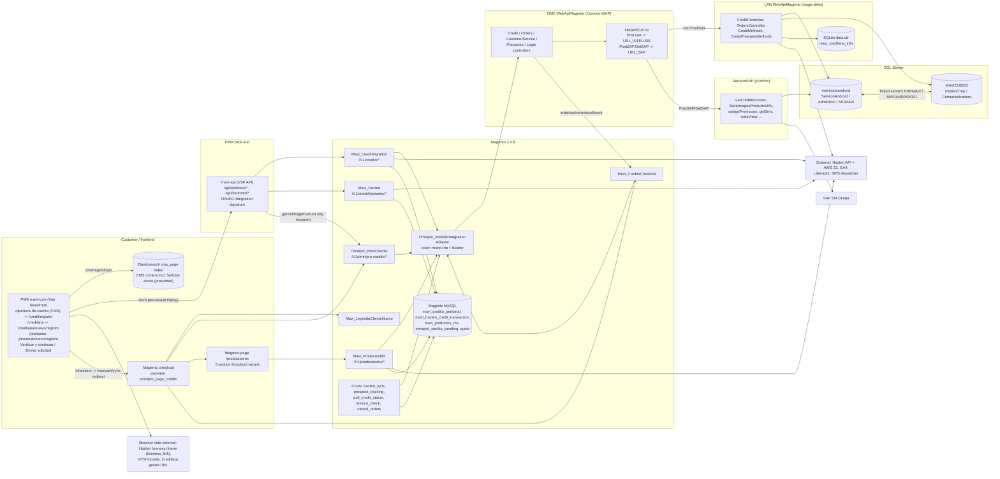

# Credit opening process ("Apertura de cuenta" / "Abre tu credito" / "Credito Muebles America")

> Process template. Built from 7 code tracers (T1-T7) and their skeptic reviews, all read-only, on 2026-10-07. Wherever two sources disagreed, the code was re-checked and the code wins. One re-check was done while writing this: `Mavi/Hazten/Helper/HaztenRequestHelper.php:27-31,65-72`.
> **Front-end layer added 2026-10-07 from mavi-pwa** (local copy `C:\Users\claude\Documents\mavi-pwa`): one PWA tracer plus a skeptic verification. The verification's corrections are applied. It changes §1.2-§1.3, §2, §3, §4.1-§4.3, §5.1, §5.3, §5.5, §5.6, §8, §9 and §10. In this template, back-end content stays as traced, except the step labels that the front end proved wrong (rows 0a, 1 and 3 in §3.1).
> **Scope and SP layer added 2026-10-07 (third pass).** The user exported 8 more sources into `SPs/` (SP_CREDITO_WEB_VALORES_FORM, SpCREDICredilana, SPCREDICredilanaSeguroDeVida, SpVTASMovimientosNIPCteSEV, SpAAEA00030_ArmadoSMS, FnVTASListaCredilanas, FnVTASValidarEmpleado, FnVTASMuestraCuatro; also spMoneda and spArtUnidadFactor). Six SP analyses plus skeptic reviews, and one process classification plus its skeptic review, are applied. Per the user's scope rule (2026-10-07) every object now carries a **Process** label: `STORE` (Magento online store: APERTURA, ProductosMX, checkout credit, and the store's Credilana web flow), `CREDILANA APP` (the separate Credilana/App Mercancias mobile app), `BOTH`, `UNUSED` or `UNKNOWN`. Changes: §1.4 (new), §3.1, §4, §5.1-§5.4, §5.6-§5.8 (new §5.8), §6, §9, §10.
> **Fourth pass, revision r3 (2026-10-07).** The user answered four open points and added more SP sources to `SPsOrden`. Applied here: (1) `SpCREDIDatosSolicitudCreditoArt` exists **only in IntelisisTmp**. LAN opens it on ServicioAndroid in three methods, and one of those (`checkSaldo`) is live (D45). Every earlier request for a ServicioAndroid copy is withdrawn (Q30). (2) `SpVentasCupones` (SIGMAVI) is **deprecated** per the user and leaves the report inventory. ServicioSAP still calls it (D52). (3) The user cannot find `FN_DM0138ValidaCorreo` (Q29, D51). (4) The missing-source list was recomputed and prioritized (Q5). New analyses with skeptic corrections: `FnAAEA00030_SplitString` (SMS splitter), `SpCREDIValidarTelefono`, the cost chain (`spVerCosto`, `xpVerCosto`, `spMoneda`, `spArtUnidadFactor`, `xpArtUnidadFactor`, `spUnidadFactor`) and `fnSplitV2`. Changes: header, §5.1.c/§5.1.d (stale markers), §5.2, §5.3, §5.6, §5.8, §6.2, §7 (coupon row), §9.1, §9.2 (D42 corrected; D45-D53 new), §10.
> **Line-number caveat (r3).** The user re-exported `SP_CREDITO_WEB_VALORES_FORM.sql` on 2026-10-07 at 17:00 (now 6,134 lines, not 6,126). The new file starts with session `SET` statements instead of `USE [IntelisisTmp]` (`:1-9`). It has a new change-log line "07/Octubre/2026 ... Se agrega la opcion del articulo 'DINE'" (`:254`), and SaveDatosVenta now sets `Venta.Referencia = 'DINE Preautorizado Web'` for DINE articles (current `:4013-4021`). Every `SP_CREDITO_WEB_VALORES_FORM.sql` line cited in this document uses the **earlier export**. To find the line in the current file, add **+4** for earlier lines up to about `:4008` and **+8** for earlier lines from about `:4013` on. For example, CheckMail `:963-966` is now `:967-970`, GetAtencionClientes `:5335` is now `:5343`, and the fnSplitV2 call `:5821` is now `:5825`. No other SP file cited here changed after it was analysed.
> Read-only rules followed: no SQL, no HTTP calls, no edits. Secrets are named by config key only and their values are never printed.

**Path abbreviations used in the citations**

| Abbrev. | Full path | Branch / HEAD |
|---|---|---|
| `M/` | `\\172.16.214.58\sap\Magento248\app\code\` | Magento 2.4.8 |
| `DMZ/` | `\\172.16.214.58\sap\DMZ\WebApiMagento\` | ConexionSAP, 09cb341 (one uncommitted change in OrdersController.cs that only comments out logging) |
| `LAN/` | `\\172.16.214.58\sap\LAN\WebApiMagento\` | stage-delta, 68b2290 (2026-08-24) |
| `SS/` | `\\172.16.214.58\sap\ServicioSAP\ServicioSap\ServicioSap\` | SpExportaEcommerce, c1cfcbc |
| `SPs/` | `\\172.16.214.58\sap\.agents\skills\lan-sap-migration\SPsOrden\` | vault SP sources. `SPs/` is only a citation abbreviation; no folder with that name exists (r3) |
| `V/` | `\\172.16.214.58\sap\.agents\skills\lan-sap-migration\` | vault |
| `CMgmt` | `M/Mavi/CreditMigration/Model/CredilanaManagement.php` | |
| `CMHelper` | `M/Mavi/CreditMigration/Helper/Data.php` | |
| `PMX` | `M/Mavi/ProductosMX/Model/CreditMxManagement.php` | |
| `LCM` | `LAN/Metodos/CreditMethods.cs` | |
| `CPM` | `LAN/Metodos/Credit/CredYPrestamo/CredyPrestamoMethods.cs` | |
| `core/` | `mavi-pwa\mavi-core\` (Vue Storefront storefront: app, themes, Vuex modules) | 11767-double_categories_v1, 3c79b0c7b (2026-09-18). This is a feature branch; which branch is deployed is unknown (Q20) |
| `api/` | `mavi-pwa\mavi-api\` (Vue Storefront API, extensions `mavi` and `omni`) | develop, b2073b9 (2026-09-03) |
| `MT/` | `core/src/themes/mavi-theme/` (VIU theme, parent of the other themes) | |
| `MAT/` | `core/src/themes/muebles-america-theme/` (theme.json parent = mavi-theme) | |
| `CO/` | `MT/components/theme/blocks/CreditOpening/` (APERTURA wizard components) | |
| `CRED/` | `core/src/modules/mavi-credilana/` (Vuex module `credilana`; actions in `CRED/store/actions/`, mixins `RegisterAccount.ts` and `RegisterCredit.ts` in `CRED/components/`) | |
| `MAPI` | `api/src/api/extensions/mavi/credilana/index.js` (mavi-api credit routes, 751 lines) | |

`omnipro-vsf-silent-login-backup` (also in mavi-pwa, not a git repo) holds only the silent-login redirect to Magento `/onestepcheckout/` (`helpers/LogUserIn.ts:11`). It has no credit logic.

---

## 1. Summary

### 1.1 What the process is
"Credit opening" means a person who is not yet a Muebles America / VIU client asks for a credit line from the web. The request ends up as:

1. A **pre-request** (first save) in `ServicioAndroid.dbo.CREDIDSolicitudWebDatosPrimerGuardado`, which tracks phone, NIP, names, address and reference while the wizard runs.
2. A **prospect number** `P` + 8 digits, generated by `SP_GeneraConsecutivoCteMavi` in `IntelisisTmp.dbo.TempCteDOS`.
3. A **formal web credit request** in `ServicioAndroid.dbo.CRED_SOLICITUD_WEB_DATOS_TEMP` (estatus 7, then 8), plus references in `TrWACW00041_RefSolCredWeb`, ID images (file share + `AdminDoc.dbo.MAVI_DOC_CTE`) and Hazten biometrics (`SIGMAVI`).

No code in Magento, DMZ, LAN or ServicioSAP performs the credit analysis, and no repo writes the prospect-to-client conversion (`IntelisisTmp.dbo.CREDIHProspectoACliente`). Intelisis does both outside these repos. Magento only polls for the result.

**Update 2026-10-07 (SP sources):** the back-office step is now visible in SQL, but its caller is not. `IntelisisTmp.dbo.SP_CREDITO_WEB_VALORES_FORM` op `SaveData` (`SPs/SP_CREDITO_WEB_VALORES_FORM.sql:1127-3409`) turns a confirmed request (estatus 0/7/8) into a **prospect `Cte`** (TipoCredito 16 for estatus 7, 20/21/22 for the apps, else 9; `:1347-1358`). Op `SaveDatosVenta` (`:3855-5164`) then INSERTs the Intelisis **Venta 'Solicitud Credito'** and runs `spAfectar` (`:4979`). Ops `getClientes` (`:993-1042`), `ResultadoBuro` (`:5496-5512`) and `Estatus` (`:3649-3854`) feed and record the bureau check. No repo calls any of them (the only wrapper, `LCM:683`, hard-codes the request-id parameters to `''`), so **who runs them is still unknown** (Q4). The writer of `CREDIHProspectoACliente` is still not visible.

**Layer chain (front-end layer added 2026-10-07):** browser → PWA `mavi-core` (Vue Storefront, Vuex module `credilana`) → `mavi-api` `/api/ext/mavi/<route>?storeCode=<store>` → Magento REST `/V1/...` signed with OAuth 1.0a integration credentials → Magento modules → DMZ → LAN / ServicioSAP → SQL Server. The customer's screen is the result page "Crédito Pre-autorizado" with "Tu número de orden es: P########" (`CO/PreAuthorized.vue:1-112`).

### 1.2 Variants

| Id | Variant | Label | Entry point | Where it diverges |
|---|---|---|---|---|
| V1 | **APERTURA** (new customer, no merchandise) | Main path. Inside the Credilana exclusion per DEC-22. Process: **STORE** | PWA CMS page `/apertura-de-cuenta`, then wizard `/credit/register` (`MT/router/index.js:106,127`), then mavi-api `/api/ext/mavi/*`, then `Mavi_CreditMigration` `/V1/credito/guest/*` with `tipo=APERTURA`, `articulo=''` | `CMgmt:84-86` forces articulo `AMER00100`. `CMHelper:195-201` sets origen `'APERTURA CUENTA'`. `CMgmt:431-435` fixes condicion `12 M MA P INM` / `12 M VIU P INM` and suc 504/505 |
| V2 | **CREDITO** = Credilana for a new client | Credilana (out of migration scope; documented). Process: **STORE** (Credilana web flow inside the store); the same Magento routes are also called headless by the app (§1.4) | PWA `/credilana` → `/credilana/nuevo/registro` (Muebles America, `MAT/router/index.js:19-20`) or `/prestamo-personal/nuevo/registro` (VIU, `MT/pages/LoanGuestRegister.vue`). Same API, `tipo=CREDITO` | origen `'CREDILANA MX'`. articulo and condicion come from the front end (the loan picked in the "Monto deseado" step, `CRED/components/RegisterCredit.ts:674-681,747-769`) |
| V3 | **ProductosMX** = opening *with merchandise* | ProductosMX (deferred Feb-Mar 2027 per DEC-22). Process: **STORE**; app use is per branch (Magento `develop` takes the caller's origen, `9310f46d0`; `integration` reverted it, `1de611c3e`), so BOTH only PLAUSIBLE | **Not implemented in the PWA.** The PWA `/checkout` route redirects to Magento (`core/src/modules/external-checkout/router/beforeEach.ts:22-27`). There the customer picks payment `omnipro_pago_credito` "Aun no tengo linea de credito", then the `/productosmx` wizard calls `/V1/productosmx/guest/:cartId/*`. PWA hint: the product-page tooltip "Crédito Muebles America" / "Crédito Viu" (`MT/components/core/blocks/Product/ViuCreditInfo.vue:34-62`) | Own module and API. Hazten mandatory. Article lines through `CreditoWeb_SaveData_Articulos`. No `sales_order` |
| V4 | Credilana for an existing client (`client/*`) | Credilana, **not opening**. Process: **STORE** (Credilana web flow for an existing client, MA + VIU; ticket 1333 "MIGRAR LA LANDING DE CREDILANA A MAGENTO"; no app caller found) | `/V1/credito/client/*` (logged in). PWA buttons "Solicitar ahora" for existing clients (`MAT/pages/Credilana.vue:68-71,245-248`; VIU `MT/pages/PersonalLoan.vue:103-109` → `prestamo-cliente-casa`) | `SPCREDICredilana`, `CreditoWeb_Seguro`. Liberador `/api/credilana` |
| V5 | Checkout credit purchase for an existing `C` client | CREDITO checkout, **not opening**. Process: **BOTH** (web checkout + headless App Mercancias "Cliente Casa": Magento `634b0bd3b`, `d5b799464` HeadlessSessionAdapter, `51ed6c1e8`; LAN `00900f0`) | Checkout, then `Mavi_CreditoCheckout` `requestCreditOrder` (Magento native checkout after the PWA redirect) | `order/setOrder` -> SS `order/new`. Liberador `/api/venta`. `PollCreditStatus` cron |
| adj. | Legacy external registration form | Legacy | `Omnipro_MaviCredito` `getUrlRegistro` / ProductosMX `place-order.js` mixin | Redirects to `registro_url` with serialized personal data in the query string |
| adj. | `credit/SolicitudMercancia` (App Mercancias) | Not Magento. Process: **CREDILANA APP** | DMZ -> LAN | Direct INSERT into `CRED_SOLICITUD_WEB_DATOS_TEMP` with origen `'APP MERCANCIAS'` (`LCM:605-674`). **Defect (new):** SP_CREDITO_WEB_VALORES_FORM only recognises `'APP MERCANCIA'` (singular, `:1354,:4341,:4358,:4447,:4476,:5010,:5105`), so these rows miss TipoCredito 22, Referencia/TransferenciaSTP, liberador, delivery data and tracking SMS. The route also copies Cliente/RFC of an existing Cte (`LCM:616-656`), so SaveData creates no prospect but still sets estatus 2 |
| adj. | SEV channel (`SpVTASMovimientosNIPCteSEV`, Origen `'SEV'`) | Third channel, **UNKNOWN** | none in the repos (hint: OutSystems host in the vault Hoppscotch folder "SEV Connect Sombra") | Own NIP table `STDMensajeNip` (4 digits); INSERTs estatus-0 requests into the shared TEMP table that SaveData/getClientes also process (Q24) |

### 1.3 Where it is born
- **The screen texts are not in Magento, and they are not literal in the PWA templates either.** A grep over `Magento248/app` (html, phtml, js, xml, csv, php, json), and over `dev/`, `m2-hotfixes/` and `.docker/`, finds no "Solicitar ahora", "Verificar y continuar", "Abre tu cr" or "Apertura de cuenta". In the PWA the labels come from i18n CSVs:
  - "Verificar y continuar" = `$t('Check and continue')` (`MT/resource/i18n/es-MX.csv:1124`; `MAT/resource/i18n/es-MX.csv:908`). It is the button of the contact step in APERTURA (`CO/ContactInfoForm.vue:44`) and in Credilana (`MAT/components/theme/blocks/Credilana/ContactInfoForm.vue:42`).
  - "Solicitar ahora" = `$t('Apply now')` (`MT/.../es-MX.csv:997`; `MAT/.../es-MX.csv:1086`). In code it labels only the **existing-client** buttons: Credilana (`MAT/pages/Credilana.vue:70,247`), VIU `PersonalLoan.vue:109` (shown when `isLogged`, links to `prestamo-cliente-casa`) and `MT/components/theme/blocks/PersonalLoan/UserCreditDetails.vue:438`.
  - "Abre tu Crédito" is the Google Tag Manager funnel name ("Abre tu Crédito Funnel", `MT/analytics/GTMAccountDispatcherMixin.ts:10-11`).
- **V1 APERTURA, landing.** CMS page `/apertura-de-cuenta`: route at `MT/router/index.js:31,106`. The Muebles America theme inherits the route via `MAT/router/index.js:1,16-18`, and the MAVI B2B theme inherits it too (`core/src/themes/mavi-b2b-theme/router/index.js:1,14-15`).
  - The page `MT/pages/static/AperturaDeCuenta.vue:33-48` (identifier `'apertura-de-cuenta'` at `:38`; Muebles America copy `MAT/pages/static/AperturaDeCuenta.vue:32-47`, styles-only diff) dispatches `cmsPage/single`. That action runs `quickSearchByQuery` on entity `cms_page` (`core/core/modules/cms/store/page/actions.ts:18-24`). The content therefore comes from the Magento CMS page through the Elasticsearch index, and it is rendered as v-html with PageBuilder button styles (`AperturaDeCuenta.vue:113-125`).
  - **No Vue/TS/JS/JSON file links to `credit-register` or `/credit/register`**, so the "Solicitar ahora" button that opens the wizard is presumably inside the CMS HTML, which is not in any repo (Q15).
- **V1 APERTURA, wizard.** `{ name: 'credit-register', path: '/credit/register', component: CreditRegister }` (`MT/router/index.js:40,127`) → `MT/pages/CreditRegister.vue:41-70` with mixin `CRED/components/RegisterAccount.ts`.
  - Muebles America has no `CreditOpening/` folder. `MAT/webpack.replacement.js` falls back to mavi-theme, so the VIU and Muebles America deployments render the same components.
  - The pre-request is **born when the customer presses "Verificar y continuar"** on the contact step. That calls `credilana/setUserContact` → mavi-api `set-guest-contact` → `POST /V1/credito/guest/getRequestInfo` with `tipo:'APERTURA'` (`CO/ContactInfoForm.vue:106-121`; `RegisterAccount.ts:388-395`; `MAPI:220-240`; `CMgmt:82-159`).
- **V2 Credilana new client.**
  - Muebles America: landing `/credilana` (`MAT/pages/Credilana.vue`). The buttons "Solicitar" (`:52-53`) and "Solicitar crédito" (`:220-222`) call `applyForCredit('otro')` (`:379-397`), which goes to `/credilana/nuevo/registro` (`MAT/pages/CredilanaGuestRegister.vue`). The MA footer also links to `/credilana` (`MAT/components/core/blocks/Footer/content/HelpLinks.vue:31`).
  - VIU: `MT/pages/PersonalLoan.vue:81-86`. Here "Solicitar Crédito" (`$t('Request Credit')`, `MT/.../es-MX.csv:1093`) leads to `prestamo-cliente-nuevo` = `/prestamo-personal/nuevo/registro`.
  - Both send `tipo:'CREDITO'`.
- **V3** is born in the native Magento checkout, which the PWA does not implement. The PWA `/checkout` route (`MT/router/index.js:47`) is caught by `core/src/modules/external-checkout/router/beforeEach.ts:22-27` (registered at `core/src/modules/client.ts:96`). That module runs `cart/sync` and then `window.location.assign(<cmsUrl>/vue/cart/sync/token/<userToken>/cart/<cartToken>)`, the Divante CartSync controller in `M/VueStorefront/CartSync`.
  - The only PWA text that points to this path is the product-page tooltip `ViuCreditInfo.vue:34-62`, rendered by `ProductContent.vue:87-95` when `credit_price_pago_puntual && credit_fee`. It tells the customer to pick "Aún no tengo línea de Crédito" in the payment method "Crédito Muebles America" (or "Crédito Viu") and "¡apertúrala!" (`MT/.../es-MX.csv:107,704-708`; `MAT/.../es-MX.csv:92,596-602`). **So "Credito Muebles America" is the checkout payment-method label (V3), not the CMS page title.**
  - Inside Magento, the payment template that actually renders is the override `M/Mavi/LeyendaClienteNuevo/view/frontend/web/template/payment/omnipro_pago_credito-form.html`, loaded through `requirejs-config.js:4-5`. Omnipro's own `omnipro_pago_credito_form.html` (underscore) is never loaded, because the renderer asks for `-form` with a dash (`omnipro_pago_credito-method.js:258-259`). From that template, the JS posts a hidden form with `payload` to `/productosmx` (`omnipro_pago_credito-method.js:714-739`).
- Magento also redirects back to the storefront through config `omnipro_checkout/general/url_return_vuestore` (`M/Omnipro/MaviCredito/Controller/Webhook/Result.php:27`; `M/Mavi/ProductosMX/Block/Index.php:183`). Magento CMS pages and blocks live in the database and were not checked.

### 1.4 Scope: two processes (user rule, 2026-10-07)

> **Two processes share objects.**
> 1. **ONLINE STORE (Magento: Muebles America / VIU / MAVI web store).** Covers: V1 APERTURA "Abre tu credito" (`Mavi_CreditMigration` tipo APERTURA, PWA `/apertura-de-cuenta` -> `/credit/register`); V3 ProductosMX (opening together with a purchase, born in the Magento checkout); V5 checkout credit purchase; and the **store's Credilana web flow** (V2 new client `/credilana/nuevo/registro`, `/prestamo-personal/nuevo/registro`; V4 existing client `/V1/credito/client/*`, `seguros/*`). Label: `STORE`.
> 2. **CREDILANA APP (separate product and channel).** Label: `CREDILANA APP`.
>
> Stored procedures, tables and LAN routes may serve both: label `BOTH`. Objects with no caller: `UNUSED`. Objects whose caller cannot be identified: `UNKNOWN`. Every label in §5 cites its evidence.

**What is known about the Credilana app**
- It has **its own backend outside every repo**. No LAN, DMZ, ServicioSAP, Magento or PWA code writes origen `'APP CREDILANA'` or `'APP PRESTAMOS'`, yet `SP_CREDITO_WEB_VALORES_FORM` handles them (TipoCredito 20/21/22 for APP CREDILANA / APP PRESTAMOS / APP MERCANCIA, `:1347-1358`; `/*APP CREDILANA*/` block `:4332-4371`; header `:225-247`). The vault catalog names TipoCredito 20 "Credito App credilana" and 21 "Credito APP Viu" / "APP VIU PRESTAMOS" (`V/MappingMetods/CAPTURAS_REALES_APIS.md:143-144`); 22 is only in the SP.
- `SP_CREDITO_WEB_DATOS` was changed for the app: header "04-MAR-2025 ... Insercion de CURP de la App Credilana" (`SPs/SP_CREDITO_WEB_DATOS.sql:84`, `@Curp :157`, insert `:341`), one month before the store sent CURP (LAN `d817a4f`, 2025-04-04). So the app backend most likely writes its TEMP rows by calling `SP_CREDITO_WEB_DATOS @Op='Insert'` directly (PLAUSIBLE, strong).
- It receives **Firebase push notifications** built by `SpAAEA00030_ArmadoSMS` (IdNotificacion 30-48, 74, 75; token `ServicioAndroid.dbo.CREDICClienteCredilana.Token`, `SPs/SpAAEA00030_ArmadoSMS.sql:138-145,227-252`).
- **App Mercancias** belongs to the same family: LAN `5e37ba7` / DMZ `f0c9855` "Servicios de AppCredilana para AppMercancias" created `mercancias/*`; Magento commits titled "... para App Mercancias" (`bd3cef275..8bf2ecf1c`, `9310f46d0`, `634b0bd3b`, `d5b799464`, `51ed6c1e8`, `432d117be`). The vault Hoppscotch collection (`V/MappingMetods/collectionhoppscotch 15092026.json`, folder "App Mercancias" with sub-folders Credilana, SendSMSVerification, omnipro-credito, Delivery, UnionCuentas, OTPService, Flujo Pago MiCredito) shows the Magento routes the mobile app calls. The vault (`GUIA_MIGRACION_FABLE.md:197-199`) treats "APP mercancias y Credilana" as one out-of-scope block. Whether App Mercancias is part of the Credilana app is to be confirmed (Q23).
- Its backend for App Mercancias is a Node.js service "app-webservice" that injects origen `'APP MERCANCIA'` (singular) into the Magento payment data (`origin/develop:M/Mavi/WebCheckoutOrigin/README.md`).

**Routes the app calls (evidence)**
| Kind | Routes | Evidence |
|---|---|---|
| App-only, direct DMZ -> LAN (no Magento caller) | `mercancias/getAbonos, getProximosPagos, getSaldoVencido, getLimiteMercancia, ValidarTelefono`; `credit/SolicitudMercancia`; probably `credit/guardardocumento` | LAN `Controllers/MercanciaController.cs:17-53`, DMZ `MercanciaController.cs:16-95`; `LCM:605-674`; DMZ `877ac3f` / LAN `29becbd` "Servicio GuardarDocumento (imagenes hazten)" (2026-07-13, App Mercancias developer) |
| App-only Magento routes (no PWA caller) | `/V1/prospecto/rfc`, `/V1/prospecto/recuperarcuenta` (ticket 10226 "SERVICIO DE BUSCAR CUENTA EN APP CREDILANA", D-23); `/V1/credito/guest/sendRequestNoBiometric` (`47d3e6ec0`); `/V1/credit/setWalletBalance` (`51ed6c1e8`) | git log LAN `2efaf85/b6cb672`, Magento `4db90a68a/1363953ed`; Hoppscotch |
| Store routes the app also calls headless (BOTH) | `/V1/credito/guest/getRequestInfo` (tipo CREDITO, article DINU05000) and `sendNip`; `/V1/omnipro-credito/validateUser, getSms, validateSms, validateUserNewNumber, requestCreditOrder`; `carts/*/set-payment-information`; `/V1/mavi-leyendaclientenuevo/validacionescobertura`; `/V1/mavi-unircuenta/*`; `/V1/otp/*`; `/V1/credilana/gestorBoton` | Hoppscotch folder "App Mercancias"; Magento `432d117be` (develop/integration) adds origen `'APP MERCANCIA'` to CreditMigration |

**Consequence for labels:** origen `'CREDILANA MX'` does **not** separate store from app for guest requests. The app calls getRequestInfo with tipo CREDITO, so its rows get `'CREDILANA MX'`; only `saveRequestNoBiometric` on `develop`/`integration` with utm_source `'APP'` rewrites it to `'APP MERCANCIA'`. V4 (`/V1/credito/client/*`) stays STORE: no app caller found.

**Branch caveat:** the checked-out Magento branch `magento248` (tip `43136e2a7`, 2026-07-13) is stale. Current branches are `origin/develop` (`cfed4665e`, 2026-10-06) and `origin/integration` (`c688db0d9`, 2026-10-06). App-related Magento labels must be read per branch.

**Not known:** the app backend that INSERTs `APP CREDILANA` / `APP PRESTAMOS` TEMP rows; the writer of push rows (Tipo 1); the external caller of SP_CREDITO_WEB_VALORES_FORM SaveData / SaveDatosVenta / getClientes / ResultadoBuro / Estatus; whether App Mercancias and SEV belong to the Credilana app (Q23, Q24); whether "CreditoApp" in `SpCREDICodigoRecomendador` (`@Aplicacion`) is the Credilana app (Q25).

---

## 2. Systems map



**Front-end chain (added 2026-10-07).**
- **URL building.** Every `credilana` Vuex action calls `processedUrl(key)` (`core/src/modules/helpers/index.ts:16-31`). It builds `${config.api.url}/api/ext/mavi/<config.mavi[key]>`, and `adjustMultistoreApiUrl` appends `?storeCode=` (`core/core/lib/multistore.ts:124-131`).
- **Store and body values.** The body `storeCode` and the NIP `uen` come from `config.defaultStoreCode` (`CRED/store/actions/userActions.ts:7`; `nipActions.ts:4-8,224-227`), which is one per deployment, not from the current store view.
- **Routing inside mavi-api.**
  - The `mavi` extension is mounted by `registeredExtensions` (`api/src/api/index.ts:51-62`). It reads the store from header `x-vs-store-code` or query `storeCode` (`api/src/lib/util.js:9-17`). `multiStoreConfig` then picks `magento2.api_<storeCode>` (`api/src/platform/magento2/util.js:8-22`).
  - mavi-api forwards one-to-one to `<url>/V1/<route>` through `magento2-rest-client`, signed with OAuth 1.0a HMAC-SHA1 from the integration keys. When a token is passed it sends Bearer instead (`api/node_modules/magento2-rest-client/lib/rest_client.js:13-37,107-109`).
- **No customer token on the opening calls.** The front sends no customer token on credit-opening calls, so the guest routes work because Magento declares them `anonymous`.
- **Deployments that can run the wizard.** Only the VIU deployment (`config/production.json`, `staging.json`; theme mavi-theme; defaultStoreCode `viu`) and the Muebles America deployment (`config/ma_*.json`; defaultStoreCode `muebles_america`) have the `mavi.*_endpoint` keys.
  - The MAVI B2B deployment inherits the routes but has none of these keys (`config/b2b_production.json`, `b2b_staging.json`, `development_b2b.json`, `integration.json`). Every credilana action there resolves to `<api>/api/ext/omni/undefined`.

**Routing caveat (DMZ working copy):** the active `URL_INTELISIS` and `URL_SAP` in `DMZ/Web.config:17,19` hold the same loopback URL. The real hosts are commented out at `:16,:18`, and Web.config has been untracked since commit 2caa18c. The `Curl` constructor logs in only to ServicioSAP (`DMZ/Helper/Curl.cs:73-90`). The LAN login is commented out (`:61-71`), and `Token = TokenSAP` (`:84`). As committed, every "LAN" route therefore lands on the ServicioSAP host, where most of these routes do not exist. Production config was not visible. The vault records this as a deliberate test setup (`V/MappingMetods/AUDITORIA_INTEGRAL_LAN_DMZ_SAP.md:183`). LAN accepts the SS token only because the JWT_* appSettings are identical in both Web.config files (compared without printing values).

**Authentication chain:** before every call, the Magento Adapter POSTs `{Username,Password}` (config `omnipro_intelisisintegration/general/user|pass|endpoint_token`) to DMZ `login/authenticate`. It strips the quotes from the token and sends it as Bearer (`M/Omnipro/IntelisisIntegration/Model/Adapter.php:32-44,64-87`; `Helper/Data.php:35-49`). The token is not cached. DMZ `LoginController.cs:16-37` checks hashes (USER_HASH/USER_SALT/PASS_HASH/PASS_SALT) and issues a JWT (JWT_SECRET_KEY, JWT_AUDIENCE_TOKEN, JWT_ISSUER_TOKEN, JWT_EXPIRE_MINUTES). Each DMZ `new Curl()` then logs in to SS `login/auth`. The cost is at least 2 Magento-to-DMZ HTTP calls plus 1 SS login per wizard call. The browser-to-Magento leg adds one more hop (PWA → mavi-api → Magento, OAuth1 per call).

---

## 3. Step-by-step flow (main path: V1 APERTURA, guest, biometric)

The diagram follows the **real PWA order** (front-end layer, 2026-10-07): CMS landing, then SSR prefetch, then contact + NIP, then Hazten, then personal data and address (in parallel), then reference + second NIP, then NIP validation, then submit.

```mermaid
sequenceDiagram
  autonumber
  actor C as Customer (browser)
  participant P as PWA mavi-core
  participant A as mavi-api /api/ext/mavi
  participant M as Magento CreditMigration / Hazten
  participant H as Hazten API / AWS S3
  participant D as DMZ WebApiMagento
  participant L as LAN WebApiMagento
  participant SA as ServicioAndroid (mavicbosandroid)
  participant IT as IntelisisTmp (MAVICUBOS)
  participant S as ServicioSAP
  C->>P: /apertura-de-cuenta (CMS page from Elasticsearch cms_page)
  C->>P: "Solicitar ahora" (presumed link in CMS HTML) -> /credit/register
  P->>A: SSR asyncData: data-location, antiquity-address, dimas-legend
  A->>M: POST /V1/credito/getGeoInfo, GET getAntiguedadDomicilio, POST getLeyendaDimas
  M->>D: credit/CreditoWeb_FormDatos, credit/CreditoWeb_Informacion
  D->>L: FormDatos -> SQLite / Informacion -> SPCREDICredilana
  C->>P: Step 1 phone, state, city + "Verificar y continuar"
  P->>A: set-guest-contact {uuid:'', articulo:'', telefono, tipo:APERTURA, storeCode}
  A->>M: POST guest/getRequestInfo
  M->>D: credit/CreditoWeb_SaveFirstData op SaveFirstData
  D->>L: curl.Post
  L->>SA: SpCREDISolicitudWebPrimerGuardado SaveFirstData (INSERT pre-request)
  M->>H: create transaction (if Hazten enabled) -> liveness_link
  M-->>P: uuid, transaction_id, liveness_link
  P->>A: send-guest-sms-nip {uuid, uen, hash}
  A->>M: POST guest/sendNip
  M->>D: SaveFirstData op SaveNip
  L->>SA: random NIP + INSERT TcAAea00030_EnvioMensajes (IdMensaje 14)
  C->>P: Step 2 liveness iframe (liveness_link), close button
  P->>A: live-test-customer {transaction_id}
  A->>M: POST /V1/credit/biometric/getLivenessStatus
  C->>P: INE front/back + selfie, "Guardar y continuar"
  P->>A: upload-images-hazten
  A->>M: POST /V1/credit/biometric/uploadImages
  M->>H: uploadUrl, PUT S3, extract (OCR)
  M-->>P: OCR prefill (names, dob, gender, curp, zip_code, image ids)
  P->>A: colonies-by-postal-code
  A->>M: POST /V1/credito/getColonias
  M->>D: FormDatos GET_CP
  C->>P: Step 3 personal data + address, "Guardar y continuar"
  par Promise.all
    P->>A: set-guest-details
    A->>M: guest/setData
    M->>D: ExistRFCAndPhoneCte (always Error=false), SaveFirstData UpdateFirstData
    M->>H: PUT transaction
  and
    P->>A: set-guest-address
    A->>M: guest/setAddress
    M->>D: FormDatos GET_CP, SaveFirstData UpdateFirstDom
  end
  C->>P: Step 3b personal reference, "Guardar y continuar"
  P->>A: set-guest-references + send-guest-sms-nip (2nd NIP, APERTURA only)
  A->>M: guest/setReference (SaveRef) + guest/sendNip (SaveNip)
  C->>P: Step 4 two "Codigo SMS" inputs, each "Confirm"
  P->>A: validate-guest-sms-nip (once per input)
  A->>M: guest/validateNip
  L->>SA: ValNip (compare only, no UPDATE)
  C->>P: bureau consent + questions, "Enviar solicitud"
  P->>A: save-credit-guest
  A->>M: guest/sendRequest (INE, selfie, flags, codes)
  M->>D: codigoRecomendado(WithUen), ExistRFCAndPhoneCte
  M->>D: credit/CreditoWeb_SaveData op Insert_2
  L->>IT: SP_GeneraConsecutivoCteMavi 'MAVI' -> P########
  L->>SA: SP_CREDITO_WEB_DATOS Insert (estatus 7) + TrWACW00041_RefSolCredWeb
  L-->>M: "idSolicitud/P########"
  M->>D: SaveFirstData SaveIdDatosTemp; codigoPromocion Elimina 'PW'+id
  M->>D: CreditoWeb_SaveData op Update (estatus 8)
  L-->>M: "" immediately; Task.Run after 10 s (burns another P number)
  M->>D: images -> credit/SaveImagesProductosMx (inferred) -> PostSAP
  D->>S: DocumentMethods (files + AdminDoc.MAVI_DOC_CTE)
  M->>M: INSERT mavi_hazten_credit_transaction
  M->>H: PUT + POST /{tx}/process (if enabled and charged)
  M-->>A: [{prospecto}]
  A-->>P: data[0].prospecto
  P-->>C: Step 5 "Credito Pre-autorizado", "Tu numero de orden es: P########"
  Note over M,L: Later: cron mavi_hazten_sync_cron -> credit/SaveHaztenTransaction -> SIGMAVI<br/>cron mavi_prospect_tracking_cron (hourly) -> credit/getCreditAccount -> CREDIHProspectoACliente -> GA4
```

### 3.1 Step table (V1 APERTURA; V2 Credilana-new uses the same back-end steps, its front-end differences are in 4.1)

Unless a cell says otherwise, every Magento-to-DMZ hop goes through `Omnipro\IntelisisIntegration\Model\Adapter::post` to the URL in config `mavi_cliente/creditmigration/general/<key>`. The core_config_data values are **not in code**, so each "config key -> DMZ route" pair below is **inferred** from the key name and the body shape.

The **Front end** column (added 2026-10-07) gives three things: the PWA screen and component, the Vuex action, and the mavi-api route. Every mavi-api route is `POST /api/ext/mavi/<route>` in `MAPI` unless stated, and forwards one-to-one to the Magento route in the next column with the OAuth1 integration signature. Row numbers keep the back-end order. The PWA order is 00, 0b, 1, 2, 1b, 5 (colonias), 4 ‖ 5, 6 (+ a second 2), 3, 8.

**Process label per row (added 2026-10-07, §1.4).** The rows describe V1 APERTURA, which is **STORE**. The shared objects behind each row:

| Row | Step process | Shared objects (label) |
|---|---|---|
| 00, 0a | STORE (0a is Credilana web landing; APERTURA never calls it) | SQLite `mavi_credilana_info` (STORE); FnVTASListaCredilanas (STORE) |
| 0b | STORE | SP_CREDITO_WEB_VALORES_FORM loader ops (STORE); SpCREDICredilana GeLeyendaCatDimas (STORE) |
| 1, 2, 3, 4, 5, 6 | STORE for APERTURA; the same Magento guest routes are BOTH because the app calls getRequestInfo/sendNip headless with tipo CREDITO (§1.4) | SpCREDISolicitudWebPrimerGuardado (BOTH); `CREDIDSolicitudWebDatosPrimerGuardado`, `TcAAEA00030_EnvioMensajes` (BOTH); GET_CP / CheckMail ops (STORE) |
| 1b | STORE (app use PLAUSIBLE through the same guest session) | Hazten tables (BOTH, PLAUSIBLE) |
| 7 | STORE (APERTURA has no input); codigoRecomendado is BOTH via the app's `sendRequestNoBiometric` | SpVTASVentaCupon, `CREDIDCodigoRecomendador` (BOTH) |
| 8, 8b | 8 STORE (+ app PLAUSIBLE: `prueba_de_vida`, `515ab5ac4`); 8b `sendRequestNoBiometric` CREDILANA APP (no PWA caller) | SP_GeneraConsecutivoCteMavi, SP_CREDITO_WEB_DATOS, `CRED_SOLICITUD_WEB_DATOS_TEMP`, `TrWACW00041_RefSolCredWeb`, `MAVI_DOC_CTE` (BOTH) |
| 9, 10 | STORE (app rows PLAUSIBLE) | `mavi_hazten_credit_transaction`, SIGMAVI biometrics, `CREDIHProspectoACliente` (BOTH) |
| after 8 (back office, no repo caller) | BOTH | SP_CREDITO_WEB_VALORES_FORM SaveData / SaveDatosVenta / getClientes / ResultadoBuro / Estatus (§6.1) |

| # | Screen / action | Front end (PWA screen / component; Vuex action -> mavi-api route) | Magento endpoint (module, class:line) | DMZ route (file:line -> destination) | Backend method (file:line) | SPs | Tables (db, R/W) | External APIs | Data sent / returned |
|---|---|---|---|---|---|---|---|---|---|
| 00 | Landing "Apertura de cuenta" (added 2026-10-07) | CMS page `/apertura-de-cuenta`. The component dispatches `cmsPage/single {value:'apertura-de-cuenta', setCurrent:true}` (`core/core/modules/cms/store/page/actions.ts:18-24`), a VSF catalog search on ES `cms_page`, not the mavi extension. "Solicitar ahora" → `/credit/register` is presumably a link in the CMS HTML (no code links to it) | none directly. The Magento CMS page is indexed into Elasticsearch (indexer outside the repos) | none | none | none | Magento CMS (DB), ES `cms_page` R | none | CMS HTML (PageBuilder) |
| 0a | Amount slider (Credilana landing only; **APERTURA never calls it**) | APERTURA: no call (`RegisterAccount.ts:102-109` has no fetchCredits). Credilana MA landing: asyncData `credilana/fetchCredits {type:'nuevo'}` and `{type:'casa'}` (`MAT/pages/Credilana.vue:409-418`; `CRED/store/actions/creditActions.ts:5-43`) → `all-credits` (`MAPI:11-31`). Result `data[0][0].hasta_un_maximo_de_prestamo`, `articulos[]` (monto, meses, abono, articulo, condicion, tasa, cat) | `POST /V1/credito/getCreditAmounts` (`M/Mavi/CreditMigration/etc/webapi.xml:12-17`) -> `CMgmt:67-70` -> `CMHelper:78-83` (key `url_get_credit_amounts`). Body is hardcoded `{uen, articulo:$type, tipo:'CREDITO'}` | `credit/GetCreditAmounts` `DMZ/Controllers/CreditController.cs:345-355` -> **curl.PostSAP -> URL_SAP** | SS `Controllers/CreditController.cs:114-146` -> `Methods/Credit/CredilanaMethods.cs:16-33`. LAN equivalent `LAN/Controllers/CreditController.cs:313-336` -> `CPM:833-850` | none at request time. The cache is built by the LAN loader: `montos_cte_nuevo` / `_apertura` from FnVTASListaCredilanas (`CPM:643-657,678-686`), `montos_cte_casa` from SpCREDICredilana ops Artc + Condicion (`CPM:659-673,690-694`), `hasta_una_bonificacion_de` from SP_CREDITO_WEB_VALORES_FORM op Bonificacion (`CPM:646`) | SQLite `mavi_credilana_info` R (SS: `SQLITE_DB_PATH`; LAN: `C:\inetpub\wwwroot\api\data.db`) | none | in: storeCode, type `nuevo`/`casa`. out: CteNuevoResponseModel. Because tipo is always `CREDITO`, the `montos_cte_nuevo_apertura` branch (LAN `:325-326`, SS `:129-130`) is **unreachable from Magento** |
| 0b | Static info: Dimas legend, customer-service phone, residence-time options (+ states/municipalities) | SSR asyncData of `/credit/register` (`RegisterAccount.ts:102-109`, mixin of `CreditRegister.vue:30,35`), awaited with Promise.all. Each action rethrows, so one failure rejects the whole page (Credilana loads them in the background instead, `RegisterCredit.ts:150-171`). `fetchDataLocation` (`addressActions.ts:20-42`) → `data-location` (`MAPI:132-152`) → getGeoInfo. `fetchAntiquityAddress` (`:5-18`) → `GET antiquity-address` (`MAPI:107-127`). `fetchDimasLegend` (`dataActions.ts:21-48`) → `dimas-legend` (`MAPI:728-748`). **getAtencionClientesInfo has no PWA caller**: `fetchCustomerService` uses GET while mavi-api exposes POST `customer-service` (`dataActions.ts:5-9`; `MAPI:706-726`), and it is never dispatched | `POST /V1/credito/getLeyendaDimas` -> `CredilanaInfoManagement.php:23-29` (op `GeLeyendaCatDimas`). `POST /V1/credito/getAtencionClientesInfo` -> `:106-109` (op `GetAtencionClientes`, search=`getOrigen(tipo)`). `GET /V1/credito/getAntiguedadDomicilio` -> `:43-54` (op `GetAnioMes`, uen 0) | `credit/CreditoWeb_Informacion` `DMZ CreditController.cs:333-343`; `credit/CreditoWeb_FormDatos` `:140-152`. Both curl.Post -> URL_INTELISIS | LAN `CreditController.cs:287-311`. The SQLite branch at `:303` is dead (`req.Equals("GeLeyendaCatDimas")` compares an object with a string), so the legend always goes to `LCM:1190-1206` SPCREDICredilana. FormDatos: `LAN CreditController.cs:151-174` serves GetAnioMes and GetAtencionClientes from SQLite | SPCREDICredilana op GeLeyendaCatDimas (`SPs/SpCREDICredilana.sql:64-69`: `IntelisisTmp.dbo.RM0847InfoCat` TOP 1 CalculoInteres, no ORDER BY, @Uen ignored, so MA and VIU get the same text) | SQLite `mavi_credilana_info` R; `IntelisisTmp.dbo.RM0847InfoCat` R | none | `getOrigen()` is case-sensitive (`CMHelper:195-201`). A lowercase `apertura` resolves to `DESCONOCIDO`, and then LAN GetAtencionClientes falls through to SP_CREDITO_WEB_VALORES_FORM (`LAN CreditController.cs:166-177`). The PWA sends uppercase `'APERTURA'` (`RegisterAccount.ts:388-395`). **Either way the APERTURA phone is empty:** the SP maps only `'CREDILANA MX'`/`'PRODUCTOS MX'` to a TablaStD Nombre; `'APERTURA CUENTA'` and `'DESCONOCIDO'` map to `''` (`SP_CREDITO_WEB_VALORES_FORM.sql:5335-5359`), and the SQLite value was loaded from the same SP (D12, D33) |
| 1 | **"Verificar y continuar"** (contact step): create the pre-request (phone + type). *Corrected 2026-10-07: the trigger is not "Solicitar ahora"* | Step 1 "Teléfono, estado / Y ciudad" `CO/ContactInfoForm.vue:1-142` (title `CreditRegister.vue:43-45`; button `:44`). `credilana/setUserContact` (`userActions.ts:5-32`) with `bodyBuilderContact(formData,'APERTURA')` (`RegisterAccount.ts:388-395`; `ContactInfoForm.vue:109-110`) → `set-guest-contact` (`MAPI:220-240`). Client-side checks only ("Fill in the cell phone number." / "The cell phone number provided is invalid.", `RegisterAccount.ts:255-260`). **State and City selects (`ContactInfoForm.vue:16-39`) are not sent.** Credilana/VIU send `tipo:'CREDITO'` + the chosen `articulo` (`RegisterCredit.ts:674-681`; `Credilana/ContactInfoForm.vue:93-94`; `PersonalLoan/GuestCreditDetails.vue:805-806`). "Editar teléfono" on step 4 resets to step 0 and re-runs this with the existing uuid (`CO/CreditHistory.vue:213-217`) | `POST /V1/credito/guest/getRequestInfo` (`webapi.xml:49-54`) -> `CMgmt:82-159`. Validates tipo with strtoupper (`:84-85`). APERTURA forces `AMER00100` (`:86`). A new uuid (HMAC with a hardcoded salt, `:31,:100`) triggers op `SaveFirstData` (`:88-97`), then INSERT into `mavi_credito_personal` step=1 (`:102-111`), then a Hazten transaction if enabled (`:114-126`). An existing uuid triggers op `UpdateFirstData` (`:134-152`). Key `url_save_first_data` (`CMHelper:102-107`). UEN = 1 if storeCode `muebles_america`, else 2 (`CMHelper:187-189`) | `credit/CreditoWeb_SaveFirstData` `DMZ CreditController.cs:155-167` -> curl.Post URL_INTELISIS | LAN `CreditController.cs:185-205` -> `LCM:506-603` (positional EXEC of 16 params on `sCadenaConexionAndriod`; `@ClaveMensaje` is NOT passed). Returns idSolicitud for SaveFirstData (`:570-576`) | `SpCREDISolicitudWebPrimerGuardado` @op SaveFirstData (`SPs/SpCREDISolicitudWebPrimerGuardado.sql:48-111`) / UpdateFirstData (`:113-127`) | Magento `mavi_credito_personal` RW (`CMgmt:102-111,134-138`). `ServicioAndroid.dbo.CREDIDSolicitudWebDatosPrimerGuardado` W (SP `:79-110`). `ERPMAVI.IntelisisTmp.dbo.art` R, APERTURA only when Importe=0 (SP `:50-61`; PropreListaDFinal/VTASCCondicionesCredVtaLinea are read only for PRODUCTOS MX, `:63-76`) | Hazten `POST {url_api}` (`M/Mavi/Hazten/Model/HaztenManagement.php:46-68`) with names `SOLICITUD`, first_lastname=tipo, phone `52`+tel, flow_id | PWA body `{uuid:'', articulo:'', telefono, tipo:'APERTURA', storeCode}`. PWA keeps `data[0]` `{uuid, transaction_id, liveness_link}` in formData. data[0..14] = `[0,'','','','',tel,uen,0,0,origen,0,articulo,0,'','']`. out: `[{uuid, articulo, telefono, ...transaction_id?, liveness_link?}]`. The phone is not validated server-side. **If the SP returns no row, LAN returns `'0'`**, Magento stores solicitud='0', and every later op targets id 0. Only a transport failure gives null and then a TypeError in `setSolicitud(string)` (`Model/Credit.php:81`). On an existing uuid, UpdateFirstData does not update Articulo/Importe in LAN (SP `:113-127`), so the pre-request keeps the first product |
| 1b | Biometric capture (liveness, INE, selfie). In the PWA it runs right after steps 1-2 and before personal data | Step 2 "Verificación de / Identidad" `CO/ValidationHaztenData.vue:1-326` + `CO/CreditHaztenImages.vue` + `MT/components/core/blocks/Product/modals/HaztenModal.vue` (camera via getUserMedia). Liveness iframe `src=formData.liveness_link` (`:17`). `getLivenessStatus` runs **only** from `closeModal` when the user presses the close button (`:15-17,:311-318`), through `credilana/valdateLiveCutomer` (`userActions.ts:165-186`) → `live-test-customer` (`MAPI:242-262`). The `popup()` path ("Prueba de vida" window, `:173-215`) is dead code, and the postMessage auto-close never matches because config key `mavi.hazten_url_liviness` is missing (`:80,:217-223`). "Guardar y continuar" renders only when liveness is true (`:31-36,:126-128`) → `credilana/uploadImagesHazten` (`userActions.ts:188-209`) → `upload-images-hazten` (`MAPI:264-284`, which passes Magento's error code through). 409 → "The photo on the official ID (front) is not legible..."; 418 → "The number of attempts was exceeded." and redirect home (`:270-286`). VIU runs the same Hazten calls inside its details step (`PersonalLoan/GuestCreditDetails.vue:121-133,811,827-875`) | `POST /V1/credit/biometric/uploadImages`, `/V1/credit/biometric/getLivenessStatus` (anonymous; `M/Mavi/Hazten/etc/webapi.xml:6-17`; `Model/BiometricManagement.php:55-119,182-185`) | none (Magento calls Hazten directly) | none | none | none | Hazten `GET /{tx}/uploadUrl`, PUT to AWS S3 presigned URLs, `POST /{tx}/extract` (OCR), PUT update (`HaztenManagement.php:96-162`) | `{transaction_id}`; `{biometric:{transaction_id, selfie, front_document, back_document}}` as base64 jpeg. OCR pre-fills first_name, second_name, first_lastname, second_lastname, dob, gender, curp, zip_code, selfie_id, front_document_id, back_document_id (`RegisterAccount.ts:508-544`). If Magento returned no transaction_id/liveness_link (Hazten disabled), the user is stuck here (D27) |
| 2 | Send SMS NIP | Fired right after `setUserContact` succeeds: `credilana/postSendGuestNip {uuid}` (`nipActions.ts:11-38`; `ContactInfoForm.vue:116-120`) → `send-guest-sms-nip` (`MAPI:486-506`). APERTURA fires it **again** with setReference (row 6). "Reenviar SMS" (`CreditHistory.vue:226-238`) and "Editar teléfono" fire more. Credilana MA sends it only at the contact step and on resend (`Credilana/CreditHistory.vue:243`) | `POST /V1/credito/guest/sendNip` (`webapi.xml:91-96`, **anonymous**) -> `CMgmt:794-810`, op `SaveNip`, data[8]=0 (`:805`) | `credit/CreditoWeb_SaveFirstData` -> URL_INTELISIS | `LCM:506-603`. There is no result branch for SaveNip, so the response is always `'0'` (`:568-602`) | PrimerGuardado @op SaveNip (SP `:189-266`) | `CREDIDSolicitudWebDatosPrimerGuardado` W (Celular, Validacion, Nip). `TcAAea00030_EnvioMensajes` W (IdMensaje 14, Cliente `CW00001`, Clave=@ClaveMensaje -> NULL from LAN). `CREDIHSolicitudWebHistoricoNip` W (**NIP in clear text**). All ServicioAndroid | SMS through the external dispatcher `SpAAea00030_ArmadoSMS` reading the queue (named only in `SPs/SPVTASCodigoSeguridadeCommerce.sql:83`) | PWA body `{uuid, uen (muebles_america=1, viu=2, mavi=3 from config.defaultStoreCode; nipActions.ts:4-8), hash:''}`; whether Magento uses the body uen was not re-checked. data `[solicitud,'','','','',telefono,uen,0,0,origen,0]`. Random 6-digit NIP generated in the SP. No throttle or CAPTCHA: each anonymous call queues a new SMS |
| 3 | Validate the NIP: bureau screen, two "Código SMS" inputs, each with "Confirm". *Corrected 2026-10-07: this is not "Verificar y continuar"* | Step 4 "Paso de / Autenticación Buró" `CO/CreditHistory.vue:1-263` ("Ha sido enviado un código SMS de 6 dígitos al teléfono celular: <phone>"). Each input calls `credilana/postValidateGuestNip` (`nipActions.ts:40-61`; `CreditHistory.vue:201-255`) → `validate-guest-sms-nip` (`MAPI:464-484`). Pass = `result.validacion === '1'` ("Código SMS correcto." / "Código SMS incorrecto."). The two-input design is the same in every guest flow (MA Credilana, VIU `GuestCreditHistory.vue`). The gate is client-side only | `POST /V1/credito/guest/validateNip` -> `CMgmt:818-836`, op `ValNip` with data[7]=nip | `credit/CreditoWeb_SaveFirstData` | `LCM:586-592` returns column `validacion` | PrimerGuardado @op ValNip (SP `:268-286`): **compare only, no UPDATE** | `CREDIDSolicitudWebDatosPrimerGuardado` R | none | in: uuid, nip. out: `{validacion}`. **No server-side enforcement anywhere** (see 9.2-D1). Which NIP is valid after APERTURA's second sendNip is open (Q16) |
| 4 | Personal data | Step 3 "Solicitud de / Datos" `CO/CustomerDataForm.vue:1-64` → `UserProfileForm.vue` (Name, Middle Name, surnames, Birthdate, CURP, Gender, E-mail). "Guardar y continuar" (`UserProfileForm.vue:229`) runs `credilana/setUserDetails` (`userActions.ts:62-83`) **in parallel** with setAddress via Promise.all (`UserProfileForm.vue:311-326`) → `set-guest-details` (`MAPI:309-330`). **checkMail has no PWA caller.** CURP remote check `fetchValidateCurp` (`creditActions.ts:240-269`) is broken (missing key, D24). A 409 from setData opens InformationModal "Hemos detectado que ya ha realizado una solicitud anteriormente con nosotros." (`Modals/InformationModal.vue:14-27`). A 409 from setAddress shows only the generic error, because `addressActions.ts:123,128` throws a bare Error | `POST /V1/credito/guest/checkMail` (`CredilanaInfoManagement.php:35-38`, FormDatos op CheckMail, uen 0). `POST /V1/credito/guest/setData` -> `CMgmt:180-260`: email regex, gender MASCULINO/FEMENINO, DOB YYYY-MM-DD. The RFC is computed **locally** by `M/Mavi/ProductosMX/Model/RFC.php:123` (10 chars, no homoclave). Then `rfcValidation` (`CMHelper:175-181`, key `url_rfc_validation`); Error=true gives HTTP 409 (`CMgmt:208-217`). Writes step=2, Hazten PUT (`:233-246`), UpdateFirstData (`:248-258`) | `credit/ExistRFCAndPhoneCte` `DMZ CreditController.cs:381-390` (inferred target). `CreditoWeb_SaveFirstData`. `CreditoWeb_FormDatos` | LAN `CreditController.cs:374-383` -> `LCM:1413-1420`. **Both** CURPValidation (`:1425`) and RFCValidation (`:1493-1495`) return `Error=false` on their first line, so the duplicate check is dead and the 409 can never fire through LAN | SP_CREDITO_WEB_VALORES_FORM (CheckMail); PrimerGuardado UpdateFirstData | `mavi_credito_personal` RW (`CMgmt:219-229`). Dead code would read IntelisisTmp Cte/CteTel/CteEnviarA/Venta/MOVBITACORA (`LCM:1447-1542`) | Hazten `PUT {url_api}/{tx}` (`HaztenManagement.php:73-89`) | PWA body `{client_data:{uuid, first_name, second_name, first_lastname, second_lastname, dob, gender, email, curp}, biometric:{transaction_id}}` (`RegisterAccount.ts:408-425`). `biometric` is a **required non-nullable** REST parameter even when Hazten is off (`CMgmt:180`). Fail-open: non-JSON DMZ error -> null -> check passes (`CMHelper:38-45`) |
| 5 | Address | Same screen. The notice "Please enter your current home address, it does not matter if it is different from your INE..." (`UserProfileForm.vue:119-124`). The CP validator calls `credilana/fetchColoniesByPostalCode` (`addressActions.ts:44-75`; `RegisterAccount.ts:184-198`; `UserProfileForm.vue:306-310`) → `colonies-by-postal-code` (`MAPI:154-174`). States/municipalities came from the 0b prefetch (`SET_STATES`). `credilana/setAddress` (`addressActions.ts:109-130`) → `set-guest-address` (`MAPI:198-218`), in parallel with setData (race, D22). `colony-coverage` (`MAPI:176-196`) is used only by dead or other-flow modals | `POST /V1/credito/getColonias` (`CredilanaInfoManagement.php:80-99`, GET_CP). `POST /V1/credito/getGeoInfo` (`:60-72,116-124`, EstadosMA/VIU + DelegacionMA/VIU). `POST /V1/credito/guest/setAddress` -> `CMgmt:268-328`: estado and delegacion/poblacion taken from GET_CP rows (`:275-276`). Writes step=3, Hazten PUT (`:300-316`), op `UpdateFirstDom` (`:318-326`) | `CreditoWeb_FormDatos` (`DMZ :140-152`); `CreditoWeb_SaveFirstData` | LAN `CreditController.cs:144-183`: Estados*/Delegacion* from SQLite (`:154-164`); GET_CP -> `LCM:676-722` runs `SP_CREDITO_WEB_VALORES_FORM @Op,@Val,@Uen,@File,'','',''` (7 args, `:683-692`) on `sCadenaConexion` | SP_CREDITO_WEB_VALORES_FORM GET_CP (`SPs/SP_CREDITO_WEB_VALORES_FORM.sql:761-772`, runs live on every call; @Uen ignored); PrimerGuardado UpdateFirstDom (SP `:129-138`) | `mavi_credito_personal` RW (`CMgmt:283-296`). SQLite R. `IntelisisTmp.dbo.CodigoPostal` R (via GET_CP: Colonia <> 'SIN COLONIA', MaviRutaSupervision not empty). `CREDIDSolicitudWebDatosPrimerGuardado` W | Hazten PUT address. **No SEPOMEX API**: GET_CP reads table `IntelisisTmp.dbo.CodigoPostal` (the 2017 header note that it reads ACW00041MunicipiosVIU is stale) | PWA body `{client_data:{uuid, street, number, suite, between_streets, zip_code, suburb, antiqueness_type, antiqueness}, biometric:{transaction_id}}` (`RegisterAccount.ts:426-443`); no state/municipality. Back end: `{street, number, suite, zip_code, suburb, between_streets, antiqueness_type ('A'=years), antiqueness}`. UpdateFirstDom reuses the name params positionally: `[solicitud, delegacion, '', poblacion, estado, '0',1,0,0,'',0]` |
| 6 | Personal reference | Sub-step "Referencia / Personal" `CO/ReferenceInfoForm.vue` (shown by `CustomerDataForm.vue:8-18`; note "The reference must not be from the same address as the applicant"). "Guardar y continuar" runs `credilana/setUserReferences` (`userActions.ts:85-106`) **plus a second `postSendGuestNip`** in parallel (`ReferenceInfoForm.vue:141-157`, NIP at `:144-150`) → `set-guest-references` (`MAPI:332-352`) + `send-guest-sms-nip`. Credilana MA sends no NIP here (`Credilana/ReferenceInfoForm.vue:142-143`) | `POST /V1/credito/guest/setReference` -> `CMgmt:341-379` (phone 10 digits, names upper-cased without accents). Writes step=4, op `SaveRef` (`:369-377`) | `CreditoWeb_SaveFirstData` | `LCM:506-603` | PrimerGuardado @op SaveRef (SP `:140-187`) | `ServicioAndroid.dbo.CREDIDRefPrimerGuardadoCredWeb` RW (UPDATE if exists, else INSERT). `mavi_credito_personal` RW | none | PWA body `{uuid, primer_nombre, segundo_nombre, apellido_paterno, apellido_materno, telefono, parentesco}` (`RegisterAccount.ts:444-454`). data[3]/[4] surnames, [13] full name (goes to @Correo), [14] phone. NumReferencia comes from @uen=data[6]=1 and TipoTel from @nip=data[7]=1 ('Celular'): positional reuse, not a UEN |
| 7 | Optional codes (promoter / referral) | **APERTURA has no input for either code**: `sellerCode`/`recommenderCode` stay `''` (`RegisterAccount.ts:19,21`; nothing in `CO/` binds them), so APERTURA sends empty codes in row 8. Credilana wizard: `postSellerCode` (`creditActions.ts:129-151`, body `{idMagento:'', opcion:'ValidarCupon', codigo}`) uses key `post_promotion_code_endpoint` → `validate-promotion-code` (`MAPI:574-594`) → codigoPromocion. `postRecommenderCode` (`creditActions.ts:154-177`) uses key `post_seller_code_endpoint` → `validate-seller-code` (`MAPI:552-572`) → codigoRecomendado. The key names are swapped against the routes | `POST /V1/credito/codigoPromocion` -> `CMgmt:865-883` -> `M/Omnipro/MaviCredito/Model/CreditoManagement.php:589-610` (config `omnipro_intelisisintegration/mavi_credito/cupon_promotion`, not declared in system.xml). It **writes `quote.bank` before checking the result** (`:600-603`) and swallows exceptions. `POST /V1/credito/codigoRecomendado` -> `CMgmt:890-905` (key `url_codigo_recomendador`, body `{uen, codRecom}`); `VACIO` means invalid | `credit/codigoPromocion` `DMZ :126-138` (curl.Post -> LAN, although SS also has the route). `credit/codigoRecomendadoWithUen` `:198-208` or `codigoRecomendado` `:184-196` (which one depends on config) | LAN `CreditController.cs:124-141` -> `LCM:392-463` SpVTASVentaCupon on `sCadenaConexion`. `CodigoRecomendadoWithUen` `LCM:1150-1188` (parameterized). `codigoRecomendado` `:1110-1142` (**string.Format, SQL-injectable**) | SpVTASVentaCupon (ValidarCupon; may INSERT a new coupon for an allowed employee, `SPs/SpVTASVentaCupon.sql:91-105`) | IntelisisTmp `CREDIDCodigoRecomendador` R, `Cte` R, `VTASCVentaCupon` RW, `TablaStD` R. `Comercializadora.dbo.Personal` R. Magento `quote.bank` W (likely an orphan quote in REST context; PLAUSIBLE) | none | codigo, opcion `ValidarCupon`, idMagento -> OK / Erroneo / Utilizado. The referral code is only validated here and stored in the request; redemption lives in `SpCREDICodigoRecomendador`, which the opening never calls |
| 8 | **Submit** (biometric endpoint) | Same step 4 screen. Consent text for MAVI DE OCCIDENTE plus the questions in `CO/CreditAuthentication.vue:6-55`: checkbox "Consulta de mi historial crediticio", "¿Tiene tarjeta de crédito?" + last 4 digits, mortgage/Infonavit, car loan. **"Enviar solicitud"** (`CO/CreditHistory.vue:127`; `MAT/.../es-MX.csv:923`) → `credilana/saveCreditGuest` (`creditActions.ts:179-204`; `CreditHistory.vue:184-200`) → `save-credit-guest` (`MAPI:376-396`). Then step 5 `CO/PreAuthorized.vue:1-112` ("Crédito Pre-autorizado", "¡Gracias!", "Tu número de orden es: <prospecto>", "Regresar a la tienda"; GTM only; clears sessionStorage `credit-state` on destroy). The bureau answers travel here: `setFileAuthorization` is dead (D20) | `POST /V1/credito/guest/sendRequest` -> `CMgmt:387-591`: (a) recompute RFC `:394-406`; (b) referral `:407-412`; (c) rfcValidation `:417-426`; (d) build 72-slot `datos` `:439-508`: condicion is the front-end value if origen=`CREDILANA MX`, else `12 M VIU P INM`/`12 M MA P INM` (`:431-433`), suc 504 (UEN 1) / 505 (UEN 2) (`:435`), estatus `'7'` (`:503`); (e) `CreditoWeb_SaveData` op **`Insert_2`** (`:510`, key `url_credit_save_data`, `CMHelper:139-144`) -> `"idSolicitud/prospect"` (`:511-518`); (f) op `SaveIdDatosTemp` (`:522-529`); (g) burn promoter `codigoPromocion(code,'Elimina','PW'+id)` (`:532-538`, response ignored); (h) step=5 (`:540-542`); (i) op **`Update`** estatus `'8'`, ext jpg, [64]=sha1 uid, [68]=id (`:562-572`); (j) images to `url_save_next_form` (`:547-560,573`); (k) `saveTempTransaction` -> `mavi_hazten_credit_transaction` (`:575-580`, store_id uen==1?5:1); (l) Hazten validation if enabled and charged (`:583-585`). Returns `[{prospecto}]` | `credit/CreditoWeb_SaveData` `DMZ :416-426` -> LAN. `CreditoWeb_SaveFirstData`. `codigoPromocion`. Images: `credit/SaveImagesProductosMx` `DMZ :210-223` -> **PostSAP -> SS** (inferred target). The DMZ logs the whole payload including base64 (`:214`) | LAN `CreditController.cs:403-421`: op `Update` runs as `Task.Run` + `Task.Delay(10000)` and returns `""` immediately (`:409-416`), with no try/catch. `CPM:29-210`: `cte_prospecto()` runs **unconditionally** at `:33` (`:212-226`, `exec SP_GeneraConsecutivoCteMavi 'MAVI'` on `sCadenaConexion`). SP_CREDITO_WEB_DATOS with 64 positional args (`:38-44`; Insert_2 mapped to Insert at `:47`). Reference 1 is inserted only for Insert_2 (`:131-154`); refs 2/3 are unguarded (`:156-204`). Returns `id/P...` (`:206-208`). Images: SS `CreditController.cs:178-192` -> `Methods/Credit/DocumentMethods.cs:188-275` (returns true before the work is done, fire-and-forget after 10 s) | `SP_GeneraConsecutivoCteMavi` (`SPs/...sql:54-77`); `SP_CREDITO_WEB_DATOS` Insert (`SPs/SP_CREDITO_WEB_DATOS.sql:172-349`) then Update (`:351-368`); PrimerGuardado SaveIdDatosTemp (`:308-315`); SpVTASVentaCupon Elimina (`:115-136`, then EXEC NUEVO `:146-159`) | `IntelisisTmp.dbo.TempCteDOS` RW (**2 numbers burned per opening**). `ServicioAndroid.dbo.CRED_SOLICITUD_WEB_DATOS_TEMP` W (INSERT, confirmado=1, SCOPE_IDENTITY; Update touches only estatus, codigo, extencionArchivo_1..3, tarjeta, tarjetaDigitos, creditoHipoteca, creditoAutomotriz). `TrWACW00041_RefSolCredWeb` W (inline INSERT; the SP's InsertReferencia branch is unused). Reads through linked server `ERPMAVI.IntelisisTmp.dbo.TablaStD` ('ORIGEN VALIDACION NUMERO CTE'), `CteTel`, `CREDICCondicionArt` (DIMAS MX only), plus local `TcAAEA00030_EnvioMensajes` (SP `:176-208`). `CREDIDSolicitudWebDatosPrimerGuardado` W. `VTASCVentaCupon` RW. `AdminDoc.dbo.MAVI_DOC_CTE` W (selfie TIPO_DOC 14, IDAPLICACION 7). Image files `{uid}_1..3.jpg` (selfie in both places). Magento `mavi_credito_personal` RW, `mavi_hazten_credit_transaction` W (`M/Mavi/Hazten/Model/BiometricManagement.php:130-142`) | Hazten PUT `/{id}` + POST `/{id}/process` (`HaztenManagement.php:189-213`). File share `IMAGES_CREDIT_PATH` (SS) or `C:\inetpub\wwwroot\api\images\credit` (LAN `LCM:1023-1028`) | PWA body `{solicitud:{uuid, codigo_promotor, codigo_recomendador, condition (undefined in APERTURA), utm_source (localStorage utmSource or 'WEBSITE'), front_document, back_document, have_card, card_digits, credit_hipoteca, credit_automotriz, selfie}, biometric:{transaction_id, selfie_id, front_document_id, back_document_id}}` (`RegisterAccount.ts:469-492`). Per that trace the PWA sends no `prueba_de_vida` (Q11). PWA reads `data[0].prospecto` into formData.requestId. Back end: `solicitud{uuid, codigo_promotor, codigo_recomendador, condition, utm_source, selfie, prueba_de_vida, front/back_document (base64), have_card, card_digits, credit_hipoteca, credit_automotriz}` + `biometric{transaction_id, faceImageId, ...}`. Images body `{account, ine[2], selfie, pruebaDeVida?}`: **pruebaDeVida is dropped at the DMZ hop** (`DMZ/Models/CreditRequest.cs:122-127`). For a `P` client, SP Insert forces `ValidacionTelefono=0` (`:216`) |
| 8b | Submit (no biometric) | **No PWA caller.** Every PWA guest flow goes through Hazten and `sendRequest` | `POST /V1/credito/guest/sendRequestNoBiometric` -> `CMgmt:593-787`. Same as step 8 without Hazten and **without `saveTempTransaction`**. Update and images are sent only if the prospect is non-empty (`:721,:751-780`). Returns `[{prospecto: account or ''}]` | as step 8 | as step 8 | as step 8 | as step 8, except that **no `mavi_hazten_credit_transaction` row is written** | none | These requests are never synced to SIGMAVI (step 9) and never tracked by ProspectTracking (step 10). With an empty prospect they stay at estatus 7 |
| 9 | Biometric sync (cron) | none | Cron `mavi_hazten_sync_cron` (`M/Mavi/Hazten/etc/crontab.xml:4-6`, group `mavi` defined in `M/Mavi/ThreeDSecure/etc/cron_groups.xml`, schedule from config `mavi_cliente/hazten/cron_settings/cron_frecuency`) -> `Cron/SyncTransaction.php:29-60`: rows with sync=0, Hazten GET, POST `{id: request_id, biometric}` to `mavi_cliente/hazten/general/api_sync` (`Helper/HaztenRequestHelper.php:80-98`). Sets sync=1 on HTTP 200 | `credit/SaveHaztenTransaction` `DMZ :263-270` -> LAN. Wrapped in `Json(...)` with **HTTP 200 even when the backend threw** (`Curl.cs:108-111`) | LAN `CreditController.cs:423-435` -> `LCM:2299-2541`: `SaveCoordsInNewTable` x2 (`:2304,:2306`; **lat/long swapped** against the signature at `:2433`; `ExecuteScalar().ToString()` NRE at `:2446`); INSERT `CREDIHBiometrico` (`:2313`); `CREDIDEtapaProcesamiento` (`:2478`); `CREDIDTransaccionMetaDato` (`:2508`). Hazten Apikey stored in plain text in `CREDIHBiometrico.ClaveApi` (`:2345`) | none | Magento `mavi_hazten_credit_transaction` RW. `ServicioAndroid.CRED_SOLICITUD_WEB_DATOS_TEMP` R (`:2441`). `IntelisisTmp.RM0855ACoordenadasProspecto` W (`:2458`). `SIGMAVI.CREDIHBiometrico`, `CREDIDEtapaProcesamiento`, `CREDIDTransaccionMetaDato` W | Hazten `GET /{tx}` (`HaztenManagement.php:286-293`) | Full transaction (OCR, CURP, RFC, liveness, geolocation). No try/catch per row: one failure aborts the run. A transaction with no SUCCEEDED liveness throws at `LCM:2392-2396` and is retried forever, inserting duplicate coordinates |
| 10 | Prospect-to-client tracking (cron) | none (browser GTM funnel "Abre tu Crédito" is separate, `MT/analytics/GTMAccountDispatcherMixin.ts:10-11`) | Cron `mavi_prospect_tracking_cron` `0 * * * *` (`M/Mavi/ProspectTracking/etc/crontab.xml:4-5`) -> `Cron/AccountTracking.php:29-59`: rows with is_c_account=0 **and updated_at within the last week**. `GET {url_prospect_tracking}/{p_account}` (`Model/AccountTrackingManagement.php:46-68`). If converted, sends a GA4 event; **only on HTTP 204** sets is_c_account=1, c_account (`:66-79,:87-137`) | `credit/getCreditAccount/{pAccount}` `DMZ :272-285` -> curl.Get LAN | LAN `CreditController.cs:437-450` -> `LCM:1552-1593` `SELECT * FROM CREDIHProspectoACliente WHERE Prospecto=@pAccount` | none | Magento `mavi_hazten_credit_transaction` RW. `IntelisisTmp.CREDIHProspectoACliente` R (writer outside the repos) | GA4 Measurement Protocol (event `Credilana Nuevo Funnel` / `Paso 9 - Confirmacion Exitosa`) | It does **not** update the Magento customer. `updated_at` is never refreshed, so tracking stops 7 days after creation. If the GA config is missing, the c_account is never written back |

---

## 4. Variants and branches

### 4.1 Divergence points

| Branch | Where it diverges | Effect |
|---|---|---|
| APERTURA vs CREDITO (Credilana-new) | `CMgmt:84-86` (tipo check, AMER00100), `:93,:108` (origen), `:431-435` (condicion, suc), `CMHelper:195-201` (getOrigen) | APERTURA: articulo AMER00100, origen `APERTURA CUENTA` (fits `origen varchar(15)` exactly, `db_schema.xml:28`), fixed condicion. CREDITO: origen `CREDILANA MX`, front-end article and condicion. A lowercase tipo passes validation but gets origen `DESCONOCIDO` and the fixed condicion |
| Front-end wizard (added 2026-10-07) | APERTURA `MT/pages/CreditRegister.vue` + `RegisterAccount.ts`; Credilana MA `MAT/pages/CredilanaGuestRegister.vue:86-120` + `RegisterCredit.ts`; VIU `MT/pages/LoanGuestRegister.vue` + `PersonalLoan/*` | APERTURA: no amount step, no code inputs, NIP sent twice, SSR prefetch all-or-nothing, state not persisted (`credit-state` is read at `CreditRegister.vue:80-83` but never written). Credilana MA: extra first step "Selecciona el / Monto deseado" (`Credilana/DesireQuantity.vue`), background prefetch incl. `all-insurances` (`RegisterCredit.ts:150-171`), seller/recommender codes, NIP once, writes sessionStorage `credilana-state` (`Credilana.vue:385`), leave-page warning (`CredilanaGuestRegister.vue:124-127`). VIU: Hazten folded into the details step (`GuestCreditDetails.vue:121-133,827-875`), same back-end routes |
| Store vs Credilana app (added 2026-10-07; §1.4) | Origen in `CRED_SOLICITUD_WEB_DATOS_TEMP`: `APERTURA CUENTA` (V1), `CREDILANA MX` (V2/V4 and app guest requests), `PRODUCTOS MX` (V3), `APP CREDILANA` / `APP PRESTAMOS` (app backend, off-repo), `APP MERCANCIA` (app via Magento develop/integration), `APP MERCANCIAS` (LAN SolicitudMercancia), NULL (SEV, estatus 0). Branches in `SP_CREDITO_WEB_VALORES_FORM.sql:1222-1268` (canal), `:1347-1358` (TipoCredito 14/20/21/22/16/9), `:1870-2510` (CREDILANA MX block), `:4332-4371` (APP block), `:4433-4470` (liberador), `:5102-5155` (tracking SMS) | Same tables and back-office SP for every origin (BOTH). App rows get Venta.Referencia = app origin and TransferenciaSTP 1/1/0. V1 APERTURA gets no tracking SMS; V2/V3 (and APP MERCANCIA) do |
| Deployment / store (added 2026-10-07) | `config.defaultStoreCode` (`CRED/store/actions/userActions.ts:7`; `nipActions.ts:224-227`); `processedUrl` (`core/src/modules/helpers/index.ts:19-20`); mavi-api `multiStoreConfig` (`api/src/platform/magento2/util.js:8-22`) | One storeCode/uen per PWA deployment, not per store view. VIU and Muebles America deployments work. The MAVI B2B deployment inherits `/credit/register` and `/apertura-de-cuenta` but has no `mavi.*_endpoint` keys, so its calls go to `.../api/ext/omni/undefined`. Each store calls its own Magento instance via `magento2.api_<store>` |
| UEN | `CMHelper:187-189` (storeCode `muebles_america`=1 else 2); ProductosMX `PMX:435` (storeId 5 -> 1, else 2) | ProductosMX sends **store_id** (5 or 2) as `@uen` to PrimerGuardado (`PMX:89,175,284`). A Muebles America request is priced from the VIU list in SP `:63-76` and stores Uen=5 (store 5 = MA is inferred from `PMX:397,435` and `IncrementManagement.php:13`). The PWA sends its own `uen` in sendNip (muebles_america=1, viu=2, mavi=3; `nipActions.ts:4-8`) |
| Guest vs logged-in | `webapi.xml` guest routes are `anonymous`; `client/*` are self | `client/*` = V4 Credilana existing client, not opening. mavi-api calls both with the integration OAuth1 signature, never with a customer token (Q18) |
| Biometric vs no biometric | `CMgmt:387-591` vs `:593-787`; Hazten `mavi_cliente/hazten/general/enabled` | No-biometric: no Hazten, no `mavi_hazten_credit_transaction` row, no sync and no tracking. In ProductosMX, Hazten is mandatory **regardless** of `enabled` (`PMX:182-197,226,273-274,387-388`). The PWA has no no-biometric path: it never calls `sendRequestNoBiometric`, and its Hazten step blocks without a liveness link (D27) |
| Hazten flow_id | `HaztenRequestHelper.php:65-72` (re-read 2026-10-07) | `getHaztenConfig('flow_id')` uses SCOPE_STORE with a null store, i.e. the store of the current REST request (`/rest/<code>/`), not the storeCode in the body. `trim($value, $store->getId())` strips characters equal to the store-id digits from both ends of the flow id. `system.xml:33` sets flow_id `showInDefault=0` |

### 4.2 V3 ProductosMX (opening with merchandise), step table

**Process (added 2026-10-07):** STORE. On Magento `develop`, `setClientData` / `saveRequest` take origen from the caller (`9310f46d0`, `CreditMxManagement.php:287,439`), so the headless app could use them; on `origin/integration` this was reverted (`1de611c3e`, lines 177/288/440 hardcode `'PRODUCTOS MX'`) and the Hoppscotch "App Mercancias" folder has no `/V1/productosmx` request. App use is therefore PLAUSIBLE only, per branch.

Config root: `mavi_checkout/productosmx/general/*` (`M/Mavi/ProductosMX/Helper/Data.php:20,49-112`). These are separate settings from the CreditMigration keys.

**Front end (added 2026-10-07):** the PWA implements none of V3. Nothing in mavi-core or mavi-api references `/V1/productosmx`, `omnipro_pago_credito`, `checkMail` or `sendRequestNoBiometric`.
- `/checkout` is redirected to Magento `<externalCheckout.stores.<store>.cmsUrl>/vue/cart/sync/token/<userToken>/cart/<cartToken>` (`core/src/modules/external-checkout/router/beforeEach.ts:6-42`). The silent-login helper redirects to `/onestepcheckout/` (`omnipro-vsf-silent-login-backup/helpers/LogUserIn.ts:11`).
- The PWA only shows these credit pieces:
  - the cart credit totals from extension attributes (`core/src/modules/omni-cart/store/index.ts:25-57`);
  - the product-page tooltip `ViuCreditInfo.vue:34-62`;
  - the CMS block `credit-payment-conditions` (`MT/components/core/blocks/Product/BottomSection/ProductBottomSection.vue:63`);
  - the generic `/order-success` page (`core/src/modules/external-checkout/router/routes.ts`).
- Steps P0-P9 below therefore run entirely in Magento pages.

| # | Screen / action | Magento | DMZ -> dest | Backend | SPs | Tables | External |
|---|---|---|---|---|---|---|---|
| P0 | Checkout payment "Mi Credito", choose "Aun no tengo linea de credito" | Template override `M/Mavi/LeyendaClienteNuevo/.../omnipro_pago_credito-form.html:132-178` (guest), `:188-200` (button `placeOrderCredito`), `:208-260` (coverage modal). Coverage: `POST /V1/mavi-leyendaclientenuevo/validacionescobertura` -> `LeyendaClienteNuevo.php:79-127` (key `mavi_checkout/leyenda_cliente_nuevo/general/url_new_client_validation`, uen = **quote store_id**). Promoter code: `/V1/omnipro-credito/codigoPromocion` (writes `quote.bank`). Config provider `AdditionalConfigProvider.php:36-57` | `customerService/validarCoberturaPorCP` `DMZ CustomerServiceController.cs:304-310` -> LAN; `credit/codigoPromocion` -> LAN | LAN `CustomerServiceController.cs:213-218` -> `CustomerServiceMethods.cs:1738-1797` (ops states/delegations/table/coverage) | SpVTASVentaCupon | `IntelisisTmp.dbo.CodigoPostal` R (filtered by MaviRutaSupervision); customer EAV R | none |
| P1 | Place order -> jump to `/productosmx` | `omnipro_pago_credito-method.js:636-740`: native `set-payment-information` (`Observer/DataAssignObserver.php:40-61` stores type_client/promoCode/origen), then a hidden POST to `/productosmx` with `payload`. Existing clients go to `/creditocheckout`, which redirects an **empty account** to `/productosmx` **without payload** (`CreditoCheckout/Controller/Index/Index.php:119-127`). Separately, the `place-order.js` mixin (`ProductosMX/view/frontend/requirejs-config.js:10-15`; `web/js/action/place-order.js:17-128`) still GETs `getRegistroUrl` and posts to `registro_url` when `#guest` is checked through the native action | none | none | none | `quote_payment` W | none |
| P2 | Page render | `Controller/Index/Index.php:39-48` (redirects to the cart unless the method is `omnipro_pago_credito`). `Block/Index.php:51-97,193-206` (prefill from payload, plazos from `CreditoCheckout PaymentManagement`, GetAnioMes, coverage states). Without payload, `Block/Index.php:53` reads an undefined key; this probably fails under Magento's ErrorHandler (PLAUSIBLE). Typo `billingAddresds` at `:85` | FormDatos, validarCoberturaPorCP -> LAN | LAN SQLite / CustomerServiceMethods | none | SQLite R | none |
| P3 | Section 1 "Validacion de telefono" | `POST /V1/productosmx/guest/:cartId/setRequest` (`webapi.xml:53`) -> `PMX:165-201`: op SaveFirstData/UpdateFirstData, data[9]=`PRODUCTOS MX`, [11]=first SKU, Hazten create (**always**), then `sendSms` `PMX:81-98` op SaveNip. `/sendSms` (`:81`), `/valiSms` (`:103-123`, ValNip; result kept in the session) | `credit/CreditoWeb_SaveFirstData` -> LAN | `LCM:506-603` | PrimerGuardado SaveFirstData/UpdateFirstData/SaveNip/ValNip | `CREDIDSolicitudWebDatosPrimerGuardado` W; PRODUCTOS MX branch reads `ERPMAVI.IntelisisTmp` PropreListaDFinal + VTASCCondicionesCredVtaLinea (SP `:63-76`); SMS queue W; NIP history W | Hazten POST |
| P4 | Section 2 "Verificacion de identidad" | `POST /V1/productosmx/biometric/guest/:cartId/uploadImages` (`webapi.xml:60-61`) -> `PMX:221-257` (`uploadHaztenImages`; requires a SUCCEEDED liveness, `:206-215`) | none | none | none | none | Hazten GET/uploadUrl/S3 PUT/extract/PUT |
| P5 | Section 3 "Datos Generales" | `getSuburbs` `FormInformation.php:56-83` (coverage + GET_CP, uen=store id `:61-64`); `getCoverageSuburbs` `:119-139`; `isEmailValid` `:29-32`; `recommendedCode` `PMX:149-158` (body `{codRecom}` only, which matches the string.Format route); `setClientData` `PMX:264-330` (rfcValidation via the CreditMigration helper, 409 if it exists, which is dead in LAN; Hazten PUT; UpdateFirstData + UpdateFirstDom) | FormDatos, validarCoberturaPorCP, codigoRecomendado, ExistRFCAndPhoneCte, SaveFirstData -> LAN | as V1 | SP_CREDITO_WEB_VALORES_FORM; PrimerGuardado | IntelisisTmp CREDIDCodigoRecomendador, Cte, CodigoPostal R | Hazten PUT |
| P6 | Section 4 "Referencia Personal" | `setReferenceData` `PMX:348-369` op SaveRef | SaveFirstData -> LAN | `LCM:506` | PrimerGuardado SaveRef | CREDIDRefPrimerGuardadoCredWeb RW | none |
| P7 | Section 5 "Autenticacion de Buro" | `productosmx.js:713-829` (5-minute timer). Resend/validate via sendSms/valiSms. The bureau answers (card + last 4, mortgage, car) are sent only in saveRequest data[22..25]. **No bureau API call from Magento** | SaveFirstData | `LCM:506` | PrimerGuardado | as above | none |
| P8 | Final submit | `POST /V1/productosmx/guest/:cartId/saveRequest` -> `PMX:375-547`: re-validates NIP, RFCExists, liveness. Products from the quote incl. warranty (`:552-627`). Increment id from `IncrementManagement.php:31-66` (`mavi_productos_mx` SELECT FOR UPDATE; 7000000001+ VIU / 8000000001+ MA). 76-slot array: **data[14]=zipcode (`:427`) overwritten by the promoter code (`:454`)**; [72]=promoter (`:459`); [66]=incrementId; [67]='7'. `SaveFirstDataArticulos` op Insert_2 with prospecto '' (`:465`, key `url_save_first_data_articulos`). SaveIdDatosTemp (`:474-482`). op Update with the prospect (fresh array, estatus 8, md5 uid; `:484-513`). SaveNextForm (`:514`). INSERT `mavi_productos_mx` (`:518-522`). `saveTempTransaction` (store 2->1 else 5, `:525-530`). Hazten process (`:532-541`). Event `mavi_new_credit_request` (`:543-546`). **No sales_order** | `credit/CreditoWeb_SaveData_Articulos` `DMZ :169-181` -> LAN; SaveFirstData -> LAN; `SaveImagesProductosMx` -> SS | LAN `CreditController.cs:207-234` (Update: Task.Run, 10 s). `LCM:466-504` (data[33] forced to ''). `LAN/Metodos/Credit/Methods.cs:12-256`: cte_prospecto only when prospecto is empty (`:35-38`); SP `:69-139` (@codigo_postal=data[14] `:94`); refs `:171-249` (Update skips them because slots 40/48/56=0). Then `CreditoWeb_InsertArticuloMX` `LCM:922-967` with `@Cp=data[14].Trim()` (`:478,:961`); `CodigoPromocion(data[72],'Elimina',data[66])` (`:480-483`) | SP_GeneraConsecutivoCteMavi; SP_CREDITO_WEB_DATOS; SpVTASInsertArtSolCreditoLinea (+spVerCosto); SpVTASVentaCupon; PrimerGuardado SaveIdDatosTemp | TempCteDOS RW; CRED_SOLICITUD_WEB_DATOS_TEMP W; TrWACW00041_RefSolCredWeb W; `MAVIANDROID01.ServicioAndroid.dbo.VTASdArtCreditoWeb` W (`SPs/SpVTASInsertArtSolCreditoLinea.sql:208,243`); IntelisisTmp Art/VTASCRegionSku/VTASCCodigoPostalRegionCelular/eCommerceExist/PropreListaDFinal R; Magento `mavi_productos_mx` RW, `mavi_hazten_credit_transaction` W, `mavi_invoice_new_orders` W (observer `InvoiceDataAnalysis/Observer/NewCreditRequestObserver.php:21-26`) | Hazten; image file share |
| P9 | Success page | `Controller/Onepage/Success.php:76-87` (quote is_active=0); `success.phtml:11-41` "CREDITO PRE-AUTORIZADO" + prospect; `/productosmx/ajax/checkoutstep` -> `Helper/Info.php:119-184` INSERT `mavi_datalayer` (**string-concatenated SQL** `:182`) | none | none | none | quote W; mavi_datalayer W | GTM dataLayer |

### 4.3 V4 Credilana existing client (label: CREDILANA, not opening)
- **Process (added 2026-10-07): STORE**, the Credilana web flow for an existing client inside the store (MA `/credilana/casa/registro`, VIU `/prestamo-personal/casa/registro`). The LAN routes come from ticket 1333 "MIGRAR LA LANDING DE CREDILANA A MAGENTO" (`614ac18`, `cabd436`, `334b5de`). No app caller of `/V1/credito/client/*` was found; the generic `CreditoWeb_Informacion` / `CreditoWeb_Seguro` routes pass any op, so app use cannot be fully excluded.
- **SP detail (sources now in `SPs/`):** `SpCREDICredilana` (20 ops, `:64-882`) and `SPCREDICredilanaSeguroDeVida` (4 ops: SeguroDeVida `:53-82`, Solicitud `:83-148`, SetClabe `:149-157` UNUSED since `cabd436`, CallSTP `:158-228` UNKNOWN). Op Solicitud INSERTs the TEMP row with origen `'CREDILANA MX'`, estatus 0, confirmado 1, `idMagento='PREAUTORIZADO WEB'`, Sucursal 504/505 (`:88-125`), updates PrimerGuardado (`:136-141`) and `Cte.IDMagento` (`:143-145`). The NIP in V4 is the 6-digit RAND() NIP of SpCREDICredilana SaveNip (`:154-162`); ValNip **does** UPDATE Validacion=1 (`:126-131`), but nothing reads it (Magento trusts the client-sent `validacion`, SeguroDeVida Solicitud never checks it).
- PWA entry (added 2026-10-07): the existing-client buttons "Ya soy cliente" / "Solicitar ahora" (`MAT/pages/Credilana.vue:17-19,68-71,245-248`) and VIU `PersonalLoan.vue:103-109` (`isLogged`, link `prestamo-cliente-casa`). On mobile, `UserService.credilanaGestorBoton` opens an external URL from `GET /V1/credilana/gestorBoton` with window.open, in parallel with the desktop navigation (`Credilana.vue:353-372`; `core/core/data-resolver/UserService.ts:107-110`; mavi-api `credilana-gestor-boton` `MAPI:33-55`). mavi-api routes: `user-account`, `post-credit-home`, `save-credit-home`, `validate-user-session`, `resend-client-sms-nip`, `validate-client-sms-nip`, `all-banks`, `all-insurances`, `insurance-calculation`, `insurance-limit` (OAuth1 integration against resource `self`), and `save-life-insurance` (Bearer = `config.magento2.api.accessToken`, the default store's key even for other stores, `MAPI:420-440`, line `:428`).
- Endpoints: `/V1/credito/client/validateSession` (`M/Mavi/CreditMigration/Model/ClientCreditManagement.php:164-203`: ValidaSesion, PrimerGuardado `-1` = phone not validated (**dead check**: SpCREDICredilana PrimerGuardado never returns -1, `SpCREDICredilana.sql:196-247`), SaveNip/SendNip), `reSendNip` (`:211-213`), `validateNip` (`:223-228`, search `nip|solicitudId`), `getClienteInfo` (`:60-96`, op CteInfo), `getBankList` (`:234-254`), `sendRequest` (`:98-153`: trusts the client-sent `validacion` `:100-101`; CLABE 16/18; `CreditoWeb_Seguro` op Solicitud retried once; burns `PW`+id), and `seguros/getSeguros|getCalculo|getLimite|saveSeguroDeVida` (`SegurosDeVidaManagement.php:37-135`; the loop guard at `:118` lets one extra beneficiary through).
- DMZ: `CreditoWeb_Informacion` (`:333-343`), `CreditoWeb_Solicitud` (`:357-367`), `CreditoWeb_SolicitudPrimerGuardado` (`:392-402`), `CreditoWeb_Seguro` (`:404-414`), all to LAN.
- LAN: `LCM:1190-1287` (SPCREDICredilana + CLABE query on `CREDIDCuentaCLABEDispersion`/`CREDICConfiguracionSTP`), `:1289-1341`, `:1342-1388`. `CPM:228-297` (SpCREDICredilanaSeguroDeVida). Op Solicitud then runs `Task.Run ProcesoAsynCredilanaCte` (`CPM:553-576`): phone checks, UPDATE `CRED_SOLICITUD_WEB_DATOS_TEMP.die` (`:578-595`), then `Liberador.LiberarCliente` POST `CREDILANA_URL_LIBERADOR` (`LAN/Metodos/Credit/CredYPrestamo/Liberador.cs:33-68`).
- `getClienteInfo` ignores `clienteId` (ownership check commented out at `:70`): an **IDOR** on phone and CLABE. The last-4 CLABE masking never applies: `if(!reader.Read())` consumes the TOP 1 row before the `while` (`LCM:1246-1281`), so the raw SP value is returned. Through the PWA, the `clienteId` comes from the browser body and mavi-api signs as the integration, which widens the exposure.
  - *Correction 2026-10-07 (SP source):* the SP value is not raw. SpCREDICredilana CteInfo (`:305-338`) already returns `FnVTASMuestraCuatro(Cte.ClabeCuenta)` and `Cte.Banco` (`:317-318`). The LAN reader bug loses the dispersion CLABE instead: the inline query returns a row only when the client's **latest** `CREDIDCuentaCLABEDispersion` row has ValidacionTD=4 (`LCM:1247-1259`); `if(!reader.Read())` consumes it, so the Cte values stay; with no row, `'****'` is forced and Magento blanks any value containing `*` (`ClientCreditManagement.php:82-83`). Magento masks the name (`:72-77`). What the IDOR exposes unmasked is the validated **mobile phone** (SP `:319`). The SP's employee branch (`:335-337`) is unreachable through LAN because `NombreCliente` (`LCM:1808-1823`) already filters employees with FNVTASValidarEmpleado. A second, orphan entry point to the same IDOR is mavi-api `user-account` (`MAPI:59-79`, no mavi-core caller).

### 4.4 V5 checkout credit for an existing `C` client (not opening; shares tables)
- **Process (added 2026-10-07): BOTH.** Web checkout plus the headless App Mercancias "Cliente Casa" flow: Magento `634b0bd3b` (origen in `Omnipro/PlaceOrder/Model/OrderManagement.php:459-461,708-710`), `d5b799464` `Mavi/CreditoCheckout/Plugin/HeadlessSessionAdapter.php`, `51ed6c1e8` `/V1/credit/setWalletBalance` (app only), `aec8fff79` (Agente param); LAN `00900f0` passes `infoCliente.origen` into SP_CREDITO_WEB_DATOS (`OrderMethods.cs:434-435,646`). The checkout SMS routes are also called by the app (Hoppscotch "SendSMSVerification" / "omnipro-credito").
- **Employee gate (added 2026-10-07):** before a credit checkout and on order save, Magento calls `credit/GetPhoneValidatedClientSecretName` (`Mavi/Monedero/Model/MonederoManagement.php:357-365`), which runs `FNVTASValidarEmpleado` through LAN `NombreCliente` (`LCM:1783-1817`). `is_client_valid=false` redirects to the cart (`CreditoCheckout/Controller/Index/Index.php:129-135`) or throws in `Plugin/SaveOrder.php:42-50`. The anonymous REST route `/V1/mavi-monedero/guest/:cartId/phoneValidateSecretName` returns the full unmasked name and validated phone for any account (D40).
- `POST /V1/omnipro-credito/requestCreditOrder` (`M/Mavi/CreditoCheckout/etc/webapi.xml:31-36`, **anonymous**) -> `Model/CreditoOrderManagement.php:29-82`: INSERT `omnipro_credito_pending` PENDIENTE `CRED<quoteId>`, then `Omnipro\PlaceOrder OrderManagement::registerCreditQuote` -> DMZ `order/setOrder` (`DMZ/Controllers/OrdersController.cs:107-228`; the LAN POST is commented out at `:132-183`) -> **PostSAP `order/new`** (`:196`) -> SS `OrderMethods.cs:1797-1820` -> `ProcessCreditPaymentAsync :634-716` -> `SolicitudCreditoWebMethods.InsertAsync` (INSERT `CRED_SOLICITUD_WEB_DATOS_TEMP`).
- SMS: `/V1/omnipro-credito/validateUser|getSms|validateSms|validateUserNewNumber` (`Omnipro/MaviCredito/Model/CreditoManagement.php:345-378,383-420,432-467,615-680`). These write `omnipro_credito_sms`, customer attr `customer_temp_cash_account` (`:422-427`) and session values. Default error branch builds a WebapiException but never throws it (`:330`). DMZ `credit/getSms` (`:67-96`) and `validateSms` (`:98-124`) go to LAN and map codes (0/1 -> 400, 3 -> 200; 5 -> 200, 6 -> 400). `SendSmsNewNumber` (`:301-311`) goes PostSAP to SS. LAN getSms (`LCM:21-48,2102-2189`) UPDATEs `Cte.IDMagento`, writes `VTASDCodigoVerificacioneCommerce` and the SMS queue (IdMensaje 23, `DM0363`), and **no longer checks Cte.NIPVenta**. validateSms runs `SPVTASCodigoSeguridadeCommerce @Op='CODIGO'`, which ignores expiry.
- Post-processing: section 6.1.

---

## 5. Inventories

### 5.1 Endpoints

**Process column (added 2026-10-07).** Every table below carries the process label of §1.4. Evidence for the app labels: §1.4 "Routes the app calls". "PLAUSIBLE" means the app could reach the route in the same session but no captured call proves it.

**5.1.0a PWA pages and routes (`core/`, added 2026-10-07)**

| Route (name) | Where | Component | Part of | Process |
|---|---|---|---|---|
| `/apertura-de-cuenta` (`apertura-de-cuenta`) | `MT/router/index.js:31,106`; inherited by MA (`MAT/router/index.js:1,16-18`) and B2B (`core/src/themes/mavi-b2b-theme/router/index.js:1,14-15`) | `MT/pages/static/AperturaDeCuenta.vue` (CMS `cmsPage/single`) | V1 landing | STORE |
| `/credit/register` (`credit-register`) | `MT/router/index.js:40,127` | `MT/pages/CreditRegister.vue` + `CO/*` + `RegisterAccount.ts` | V1 wizard | STORE |
| `/credilana` | `MAT/router/index.js:19` | `MAT/pages/Credilana.vue` | V2 landing (MA) / V4 entry | STORE |
| `/credilana/nuevo/registro` | `MAT/router/index.js:20` | `MAT/pages/CredilanaGuestRegister.vue` + `MAT/components/theme/blocks/Credilana/*` + `RegisterCredit.ts` | V2 wizard (MA) | STORE |
| `/prestamo-personal/*` (`prestamo`, `prestamo-cliente-nuevo`, `prestamo-cliente-casa`) | `MT/router/index.js:124-126` | `MT/pages/PersonalLoan.vue`, `LoanGuestRegister.vue`, `MT/components/theme/blocks/PersonalLoan/*` | V2 (VIU) / V4. Also routable on MA because the MA filter removes non-existent names (`MAT/router/index.js:12-18`) | STORE |
| `/checkout` | `MT/router/index.js:47` → `core/src/modules/external-checkout/router/beforeEach.ts:22-27` | redirect to Magento `/vue/cart/sync` | V3 / V5 entry | STORE |
| My Account `credit-request` | `MT/router/index.js:121` | My Account credit-request screen | status read | STORE |

**5.1.0b mavi-api routes (`api/`, added 2026-10-07).** All are `POST` unless stated. The front builds each URL as `/api/ext/mavi/<route>?storeCode=<store>`. mavi-api calls `<magento2.api[_<store>].url>/V1/<route>` with the OAuth1 integration signature. The Magento resource is `anonymous` unless stated.

| mavi-api route | Where | Front config key / Vuex action | Magento route | Part of | Process |
|---|---|---|---|---|---|
| set-guest-contact | `MAPI:220-240` | set_user_contact_endpoint / setUserContact | /V1/credito/guest/getRequestInfo | V1/V2 | STORE |
| send-guest-sms-nip | `MAPI:486-506` | send_guest_nip_endpoint / postSendGuestNip | /V1/credito/guest/sendNip | V1/V2 | STORE |
| validate-guest-sms-nip | `MAPI:464-484` | validate_guest_nip_endpoint / postValidateGuestNip | /V1/credito/guest/validateNip | V1/V2 | STORE |
| set-guest-details | `MAPI:309-330` | set_user_details_endpoint / setUserDetails | /V1/credito/guest/setData | V1/V2 | STORE |
| set-guest-validation (no screen uses it) | `MAPI:286-307` | set_user_validation_endpoint / setUserValidation (never dispatched) | /V1/credito/guest/setData | dead | UNUSED (dead) |
| set-guest-address | `MAPI:198-218` | set_address_endpoint / setAddress | /V1/credito/guest/setAddress | V1/V2 | STORE |
| set-guest-references | `MAPI:332-352` | set_user_references_endpoint / setUserReferences | /V1/credito/guest/setReference | V1/V2 | STORE |
| save-credit-guest | `MAPI:376-396` | save_credit_guest_endpoint / saveCreditGuest | /V1/credito/guest/sendRequest | V1/V2 | STORE |
| set-file-authorization (unreachable) | `MAPI:354-374` | set_file_authorization_endpoint / setFileAuthorization (`userActions.ts:142-163`) | /V1/credito/guest/saveAuthorization (**no such route** in `M/Mavi/CreditMigration/etc/webapi.xml`) | dead | UNUSED (dead) |
| live-test-customer | `MAPI:242-262` | live_test_customer / valdateLiveCutomer | /V1/credit/biometric/getLivenessStatus | V1/V2 | STORE |
| upload-images-hazten | `MAPI:264-284` | upload_images_hazten / uploadImagesHazten | /V1/credit/biometric/uploadImages | V1/V2 | STORE |
| all-credits | `MAPI:11-31` | all_items_credits_endpoint / fetchCredits | /V1/credito/getCreditAmounts | V2 / V4 landing | STORE |
| data-location | `MAPI:132-152` | data_location_endpoint / fetchDataLocation | /V1/credito/getGeoInfo | V1/V2 | STORE |
| colonies-by-postal-code | `MAPI:154-174` | colonies_by_postal_code_endpoint / fetchColoniesByPostalCode | /V1/credito/getColonias | V1/V2 | STORE |
| colony-coverage | `MAPI:176-196` | colony_coverage_endpoint (dead or other-flow modals only) | /V1/mavi-leyendaclientenuevo/validacionescobertura | other | STORE |
| GET antiquity-address | `MAPI:107-127` | antiquity_address_endpoint / fetchAntiquityAddress | GET /V1/credito/getAntiguedadDomicilio | V1/V2 | STORE |
| dimas-legend | `MAPI:728-748` | dimas_legend_endpoint / fetchDimasLegend | /V1/credito/getLeyendaDimas | V1/V2 | STORE |
| customer-service | `MAPI:706-726` | customer_service_endpoint / fetchCustomerService (uses GET, never dispatched) | /V1/credito/getAtencionClientesInfo | none in practice | UNUSED (never dispatched) |
| validate-promotion-code | `MAPI:574-594` | post_promotion_code_endpoint / postSellerCode | /V1/credito/codigoPromocion | V2 | STORE |
| validate-seller-code | `MAPI:552-572` | post_seller_code_endpoint / postRecommenderCode | /V1/credito/codigoRecomendado | V2 | STORE |
| GET credilana-gestor-boton | `MAPI:33-55` | users.credilana_gestor_boton / UserService.credilanaGestorBoton | GET /V1/credilana/gestorBoton | V4 mobile | STORE |
| all-insurances, insurance-calculation, insurance-limit, all-banks | `MAPI:618-682`, `:596-616` | all_items_insurances_endpoint, insurance_calculation_endpoint, insurance_limit_endpoint, all_items_banks_endpoint | /V1/credito/client/seguros/{getSeguros,getCalculo,getLimite}, /V1/credito/client/getBankList (resource `self`) | V4. The guest wizard still prefetches getSeguros (`RegisterCredit.ts:162-164`) and swallows errors | STORE |
| save-life-insurance | `MAPI:420-440` | save_life_insurance_endpoint | /V1/credito/client/seguros/saveSeguroDeVida, Bearer = `magento2.api.accessToken` (`:428`) | V4 | STORE |
| post-credit-home, save-credit-home, validate-user-session, resend-client-sms-nip, validate-client-sms-nip, user-account | `MAPI:442-462`, `:398-418`, `:684-704`, `:508-528`, `:530-550`, `:59-79` | post_credit_home_endpoint, save_credit_home_endpoint, post_validate_session_endpoint, resend_client_nip_endpoint, validate_client_nip_endpoint | /V1/credito/client/{getClienteInfo,sendRequest,validateSession,reSendNip,validateNip} (resource `self`) | V4 | STORE |
| unlink-user-account | `MAPI:81-104` | unlink_user_account_endpoint / unlinkUserAccount (`userActions.ts:34-60`, never dispatched; body adds `idCliente` from the browser) | /V1/mavi-cuenta/setCuenta | other (dead) | UNUSED (dead) |
| GET /api/ext/omni/credits/:costumerId, /credit-invoice/:costumerId/:incrementId | `api/src/api/extensions/omni/credits/index.ts:14-34,47-68` | omni credit_endpoint, credit_invoice_endpoint | GET /V1/omnipro-credito/getSaldo/:id (Bearer customer token), getFactura/:id/:inc (OAuth1) | existing client (My Account) | STORE |
| GET get-credit-requests/:userId | `api/src/api/extensions/mavi/customer/index.js:58-80` | get_credit_requests | POST /V1/mavi-solicitudcredito/creditrequest `{client_id, storeCode}` | status read (My Account) | STORE |

**5.1.a Magento (opening and adjacent)**

The "Part of" column notes which PWA caller each route has (added 2026-10-07).

| Route | Where | Calls | Part of | Process |
|---|---|---|---|---|
| POST /V1/credito/getLeyendaDimas | CM webapi.xml:5-10; CredilanaInfoManagement.php:23-29 | Informacion GeLeyendaCatDimas | V1/V2 (PWA dimas-legend) | STORE (app use PLAUSIBLE) |
| POST /V1/credito/getCreditAmounts | webapi.xml:12-17; CMgmt:67-70 | url_get_credit_amounts -> GetCreditAmounts (SS) | V2/V4 (PWA all-credits, Credilana landing only; not APERTURA) | STORE |
| POST /V1/credito/getGeoInfo | :19-24; CredilanaInfoManagement.php:60-72,116-124 | FormDatos Estados*/Delegacion* | V1/V2 (PWA data-location) | STORE (app use PLAUSIBLE) |
| POST /V1/credito/getColonias | :26-31; :80-99 | FormDatos GET_CP | V1/V2 (PWA colonies-by-postal-code) | STORE (app use PLAUSIBLE) |
| POST /V1/credito/getAtencionClientesInfo | :33-38; :106-109 | FormDatos GetAtencionClientes | V1/V2 (no effective PWA caller) | STORE (no effective caller) |
| GET /V1/credito/getAntiguedadDomicilio | :40-45; :43-54 | FormDatos GetAnioMes | V1/V2 (PWA antiquity-address) | STORE (app use PLAUSIBLE) |
| POST /V1/credito/guest/getRequestInfo | :49-54; CMgmt:82-159 | SaveFirstData/UpdateFirstData; Hazten create | V1/V2 (PWA set-guest-contact, "Verificar y continuar") | BOTH (app call in Hoppscotch "App Mercancias / Credilana") |
| POST /V1/credito/guest/setData | :56-61; CMgmt:180-260 | ExistRFCAndPhoneCte; Hazten PUT; UpdateFirstData | V1/V2 (PWA set-guest-details) | BOTH (app PLAUSIBLE, same guest session) |
| POST /V1/credito/guest/setAddress | :63-68; CMgmt:268-328 | GET_CP; Hazten PUT; UpdateFirstDom | V1/V2 (PWA set-guest-address) | BOTH (app PLAUSIBLE, same guest session) |
| POST /V1/credito/guest/setReference | :70-75; CMgmt:341-379 | SaveRef | V1/V2 (PWA set-guest-references) | BOTH (app PLAUSIBLE, same guest session) |
| POST /V1/credito/guest/sendRequest | :77-82; CMgmt:387-591 | Insert_2/Update, SaveIdDatosTemp, Elimina, images, Hazten | V1/V2 (PWA save-credit-guest, "Enviar solicitud") | BOTH (app PLAUSIBLE: `prueba_de_vida`, `515ab5ac4`) |
| POST /V1/credito/guest/sendRequestNoBiometric | :84-89; CMgmt:593-787 | same, without Hazten | V1/V2 (**no PWA caller**) | CREDILANA APP (PLAUSIBLE: `47d3e6ec0`, no PWA caller) |
| POST /V1/credito/guest/sendNip | :91-96; CMgmt:794-810 | SaveNip | V1/V2 (PWA send-guest-sms-nip) | BOTH (app call in Hoppscotch "App Mercancias / Credilana") |
| POST /V1/credito/guest/validateNip | :98-103; CMgmt:818-836 | ValNip | V1/V2 (PWA validate-guest-sms-nip) | BOTH (app PLAUSIBLE, same guest session) |
| POST /V1/credito/guest/checkMail | :105-110; CredilanaInfoManagement.php:35-38 | FormDatos CheckMail | V1/V2 (**no PWA caller**) | UNUSED (no caller found) |
| POST /V1/credito/codigoPromocion | :112-117; CMgmt:865-883 | Omnipro codigoPromocion | V2 (PWA validate-promotion-code; APERTURA has no input) | STORE |
| POST /V1/credito/codigoRecomendado | :119-124; CMgmt:890-905 | url_codigo_recomendador | V2 (PWA validate-seller-code; APERTURA has no input) | STORE |
| POST /V1/credito/client/{getClienteInfo,sendRequest,validateSession,reSendNip,validateNip,getBankList} | :129-169; ClientCreditManagement.php | Informacion, SolicitudPrimerGuardado, Seguro | V4 (PWA, see 5.1.0b) | STORE (Credilana web, existing client) |
| POST /V1/credito/client/seguros/{getSeguros,getCalculo,getLimite,saveSeguroDeVida} | :173-199; SegurosDeVidaManagement.php:37-135 | Informacion, Solicitud, Seguro | V4 (PWA; getSeguros also prefetched by the V2 guest wizard) | STORE (Credilana web, existing client) |
| POST /V1/credit/biometric/uploadImages, getLivenessStatus | M/Mavi/Hazten/etc/webapi.xml:6-17 | Hazten direct | V1/V2 (PWA upload-images-hazten, live-test-customer) | BOTH (app PLAUSIBLE) |
| POST /V1/productosmx/guest/:cartId/{isEmailValid,getSuburbs,getCoverageSuburbs,recommendedCode,sendSms,valiSms,setRequest,setClientData,setReferenceData,saveRequest} | ProductosMX webapi.xml:4-81 | see 4.2 | V3 (no PWA caller; Magento page only) | STORE (app PLAUSIBLE per branch, §4.2) |
| GET /V1/productosmx/guest/:cartId/getRegistroUrl | webapi.xml:32; PMX:72-75 | returns config registro_url (still used by the place-order.js mixin) | V3 legacy | STORE (app PLAUSIBLE per branch, §4.2) |
| POST /V1/productosmx/biometric/guest/:cartId/uploadImages | webapi.xml:60-61; PMX:221-257 | Hazten | V3 | STORE (app PLAUSIBLE per branch, §4.2) |
| GET/POST /productosmx, /productosmx/ajax/checkoutstep, /productosmx/onepage/success | ProductosMX Controller/* | page, datalayer, success | V3 | STORE (app PLAUSIBLE per branch, §4.2) |
| POST /V1/mavi-leyendaclientenuevo/validacionescobertura | LeyendaClienteNuevo webapi.xml:4; Model/LeyendaClienteNuevo.php:79 | url_new_client_validation | V3 pre-step (PWA colony-coverage only in dead/other modals) | BOTH (Hoppscotch "App Mercancias / Delivery") |
| POST /V1/omnipro-credito/{validateUser,getSms,validateSms,validateUserNewNumber,codigoPromocion} | Omnipro/MaviCredito webapi.xml:3-45 | sms_endpoint, validate_sms_endpoint, get_sms_number_novalidated_endpoint, cupon_promotion | V5 / checkout | BOTH (Hoppscotch "SendSMSVerification", "omnipro-credito") |
| POST /V1/omnipro-credito/getUrlRegistro | webapi.xml:21; CreditoManagement.php:469-552 | **no remote call**; builds `registro_url?...&art=serialize()&data=serialize(PII)` | legacy | STORE (legacy) |
| GET /V1/omnipro-credito/getSaldo/:id, getFactura/:id/:inc | webapi.xml:27,33 | DMZ getClienteSaldo (LAN), getClienteFactura (SS) | existing client (PWA My Account via /api/ext/omni) | STORE |
| POST /V1/omnipro-credito/requestCreditOrder, authorizationResult (anonymous) | CreditoCheckout webapi.xml:31-44 | omnipro_credito_pending, placeOrder | V5 | BOTH (headless app, `d5b799464`) |
| POST /V1/mavi-solicitudcredito/creditrequest (self) | CreditRequest webapi.xml:6; Model/CreditRequest.php:51-81 | url_credit_request (`{cliente_id, uen}`; probably customerService/obtenerCreditos) | status read (PWA get-credit-requests) | STORE |
| POST /V1/prospecto/rfc | GenerarRFC webapi.xml:3; GenerateRFC.php:80-125 | url_generar_rfc -> DMZ prospecto/rfc -> LAN spRegistroSugerir | other (no server-side caller in the opening; no PWA caller) | CREDILANA APP (ticket 10226) |
| POST /V1/prospecto/recuperarcuenta | RecuperarCuenta webapi.xml:3; RecuperarCuenta.php:70-115 | -> DMZ PostSAP -> SS | other | CREDILANA APP (ticket 10226) |
| POST /V1/mavi-cuenta/getCuenta, setCuenta | CuentaMavi webapi.xml:4-15; CuentaManagement.php:33-72 | customer attr customer_credit_account | reverse push (PWA unlink-user-account -> setCuenta, never dispatched) | STORE |
| POST /V1/mavi-unircuenta/*, /V1/otp/*, GET /V1/credilana/gestorBoton | JoinAccount, OtpService, CredilanaConfig | account linking / password OTP / button switch | other (gestorBoton: PWA Credilana mobile) | BOTH (Hoppscotch "UnionCuentas"; JoinAccount writes customer EAV) |
| /mavicredito/webhook/result | Omnipro/MaviCredito Controller/Webhook/Result.php:75-139 | sets credit_payment_review | legacy | STORE (legacy) |
| POST /V1/credit/setWalletBalance (added 2026-10-07) | Mavi/CreditoCheckout (`51ed6c1e8` "pago con credito sin cookies y sesiones") | wallet balance for the headless credit payment | V5 headless | CREDILANA APP (no PWA caller) |
| POST /V1/mavi-monedero/customer\|guest/:cartId/phoneValidateSecretName (added 2026-10-07) | Mavi/Monedero webapi.xml:52-59; MonederoManagement.php:357-365 | `credit/GetPhoneValidatedClientSecretName` (FNVTASValidarEmpleado) | V5 employee gate; guest route anonymous (D40) | BOTH |

**5.1.b DMZ (`DMZ/Controllers/...`)**

| Route | Where | Destination | Part of | Process |
|---|---|---|---|---|
| POST login/authenticate | LoginController.cs:16-37 | local JWT | auth | BOTH |
| POST credit/CreditoWeb_FormDatos | CreditController.cs:140-152 | Post -> LAN | V1/V2/V3 | STORE (open op dispatcher, D34) |
| POST credit/CreditoWeb_SaveFirstData | :155-167 | Post -> LAN | V1/V2/V3 | BOTH |
| POST credit/CreditoWeb_SaveData_Articulos | :169-181 | Post -> LAN | V3 | STORE (app PLAUSIBLE per branch) |
| POST credit/codigoRecomendado / codigoRecomendadoWithUen | :184-196 / :198-208 | Post -> LAN | V1/V3 | BOTH (app `sendRequestNoBiometric` calls it) |
| POST credit/SaveImagesProductosMx | :210-223 | **PostSAP -> SS** | V1/V2/V3 | BOTH |
| POST credit/SaveHaztenTransaction | :263-270 | Post -> LAN | cron | BOTH (app rows PLAUSIBLE) |
| GET credit/getCreditAccount/{p} | :272-285 | Get -> LAN | cron | BOTH (app rows PLAUSIBLE) |
| POST credit/codigoPromocion | :126-138 | Post -> LAN (SS also has it) | all | STORE |
| POST credit/CreditoWeb_Informacion | :333-343 | Post -> LAN | V1 legend / V4 | STORE |
| POST credit/GetCreditAmounts | :345-355 | **PostSAP -> SS** | V1/V2 | STORE |
| POST credit/CreditoWeb_Solicitud, CreditoWeb_SolicitudPrimerGuardado, CreditoWeb_Seguro | :357-367, :392-414 | Post -> LAN | V4 | STORE |
| POST credit/Validar_Lada | :369-379 | Post -> LAN | caller unknown (no Magento caller; no PWA caller) | UNUSED |
| POST credit/ExistRFCAndPhoneCte | :381-390 | Post -> LAN | V1/V3 | BOTH (app `sendRequestNoBiometric` calls it) |
| POST credit/CreditoWeb_SaveData | :416-426 | Post -> LAN | V1/V2 | BOTH |
| POST credit/getSms, validateSms, GetPhoneValidatedClientSecretName | :67-124, :289-299 | Post -> LAN | V5 | BOTH |
| POST credit/SendSmsNewNumber; GET credit/getPlazos; POST credit/guardardocumento [AllowAnonymous] | :301-311; :431-446; :448-512 | PostSAP/GetSAP -> SS | V5 / other | SendSmsNewNumber BOTH; getPlazos STORE; guardardocumento CREDILANA APP (PLAUSIBLE) |
| GET credit/getClienteSaldo; POST credit/getClienteFactura | :18-23; :43-51 | Get -> LAN; PostSAP -> SS | existing client | STORE |
| POST credit/SolicitudMercancia | :317-328 | Post -> LAN | App Mercancias | CREDILANA APP |
| POST mercancias/getAbonos, getProximosPagos, getSaldoVencido, getLimiteMercancia, ValidarTelefono (added 2026-10-07) | MercanciaController.cs:16-95 | Post -> LAN | App Mercancias (post-sale; not in the opening) | CREDILANA APP |
| POST prospecto/rfc; prospecto/recuperarcuenta | ProspectoController.cs:16-30; :32-50 | Post -> LAN; PostSAP -> SS | other | CREDILANA APP (ticket 10226) |
| POST customerService/validarCoberturaPorCP; obtenerCreditos | CustomerServiceController.cs:303-313; :111-121 | Post -> LAN | V3; status read | validarCoberturaPorCP BOTH; obtenerCreditos STORE |
| POST order/setOrder; GET order/creditStatus/{id}; POST order/updateCreditOrderId; POST order/GetIntelisisStatuses | OrdersController.cs:107-228; :460-482; :404-419; :69-86 | PostSAP order/new; Get/Post -> LAN | V5 | BOTH |
| POST order/authorizationResult | :421-458 | -> Magento URL_MAGENTO + TOKEN_MAGENTO | V5 callback | BOTH |
| POST magento/getCuenta, setCuenta; order/setCAccount | MagentoController.cs:111-127; OrdersController.cs:357-363 | -> Magento | reverse | STORE |

Error behaviour: routes that wrap the curl result in `Ok()`/`Json()` return HTTP 200 with exception text (`Curl.cs:108-111` Post; `:258-261` Get). getSms/validateSms map unknown text to 400. Routes that deserialize the body (GetPhoneValidatedClientSecretName, validarCoberturaPorCP) return 500. A failed SS login in the Curl constructor returns 500 on every route (`:86-90`). PostSAP/GetSAP return a `WebException: ... Body:` string (`:130-146,:225-240`).

**5.1.c LAN (`LAN/Controllers/...`)**

| Route | Where | Method | Process |
|---|---|---|---|
| credit/CreditoWeb_FormDatos | CreditController.cs:143-183 | SQLite or LCM:676-722 | STORE (open op dispatcher, D34) |
| credit/CreditoWeb_Informacion | :287-311 | LCM:1190-1287 | STORE |
| credit/GetCreditAmounts | :313-336 | SQLite (DMZ sends this to SS) | STORE |
| credit/CreditoWeb_SaveFirstData | :185-205 | LCM:506-603 | BOTH |
| credit/CreditoWeb_SaveData | :403-421 | CPM:29-210 | BOTH |
| credit/CreditoWeb_SaveData_Articulos | :207-234 | LCM:466-504 -> Credit/Methods.cs:12-256 | STORE (app PLAUSIBLE per branch) |
| credit/SaveImagesProductosMx | :270-284 | LCM:970-1037 (DMZ sends this to SS) | BOTH |
| credit/SaveHaztenTransaction | :423-435 | LCM:2299-2541 | BOTH (app rows PLAUSIBLE) |
| credit/getCreditAccount/{p} | :437-450 | LCM:1552-1593 | BOTH (app rows PLAUSIBLE) |
| credit/codigoRecomendado / WithUen | :236-253 / :255-267 | LCM:1110-1142 / :1150-1188 | BOTH |
| credit/codigoPromocion | :124-141 | LCM:392-463 | STORE |
| credit/ExistRFCAndPhoneCte | :374-383 | LCM:1413-1550 (dead checks) | BOTH |
| credit/Validar_Lada | :363-372 | LCM:1390-1411 | UNUSED |
| credit/SaveCredilanaInfo | :452-462 | CPM:675-910 (cache loader; no caller in DMZ or Magento) | STORE |
| credit/CreditoWeb_Solicitud / SolicitudPrimerGuardado / Seguro | :338-361, :385-400 | LCM:1289-1388; CPM:228-297 | STORE |
| credit/getSms, validateSms, GetPhoneValidatedClientSecretName, SendSmsNewNumber | :24-66, :540-547 | LCM:21-92, :1783-1806 | BOTH |
| credit/SolicitudMercancia | :558-567 | LCM:605-674 | CREDILANA APP |
| mercancias/* (added 2026-10-07) | MercanciaController.cs:17-53 | `Metodos/AppMercancias/MercanciaMethods.cs`, `MercanciaQueries.cs:5-416` (ValidarTelefono -> SpCREDIValidarTelefono `:416`, source analysed r3, §5.2; its CteTel writes are read by STORE checkout and V5, D47) | CREDILANA APP |
| recommender/setRecommenderList, getRecommender, setCodes (added 2026-10-07) | RecomenderController.cs:10-41 | RecommenderMethods.cs:25,72,141 (SpCREDICodigoRecomendador) | UNKNOWN ("CreditoApp" channel via `@Aplicacion`, Q25; no Magento caller) |
| prospecto/rfc | ProspectoController.cs:18-75 | spRegistroSugerir | CREDILANA APP |
| customerService/validarCoberturaPorCP | CustomerServiceController.cs:213-218 | CustomerServiceMethods.cs:1738-1797 | BOTH |
| order/creditStatus, updateCreditOrderId, getIntelisisStatuses, validateCredit (no live caller) | OrdersController.cs:484-504, :506-533, :93-101, :455-482 | OrderMethods.cs:1867-1996, :1998-2061, :287-333 | BOTH |
| Outbound: Liberador; DMZ callback | LiberadorCreditoMethods.cs:40-101; Liberador.cs:33-68; OrderMethods.cs:1751-1833 | external | BOTH (`/api/credilana` STORE V4; `/api/venta` BOTH V5) |

**5.1.d ServicioSAP (`SS/Controllers/...`)**

| Route | Where | Relevant to | Process |
|---|---|---|---|
| login/auth | LoginController.cs:19-42 | DMZ auth | BOTH |
| credit/GetCreditAmounts | CreditController.cs:114-146 | V1/V2 (its SQLite is never filled) | STORE |
| credit/SaveImagesProductosMx, credit/guardardocumento | :178-192, :153-170 | V1/V2/V3 images | SaveImages BOTH; guardardocumento CREDILANA APP (PLAUSIBLE) |
| credit/codigoPromocion | :25-40 (SpVentasCupones on SIGMavi, `Methods/Credit/CreditMethods.cs:30`) | not routed by the DMZ. **SpVentasCupones is deprecated per the user (r3)**; see D52 | UNUSED (not routed; deprecated SP) |
| credit/SendSmsNewNumber, getSms, validateSms, getPlazos, condicionespago | :14-22, :45-87, :89-102, :194 | V5 | SendSmsNewNumber, getSms, validateSms BOTH; getPlazos, condicionespago STORE |
| credit/getClienteFactura | AbonosController.cs:8,34-36 | existing client | STORE |
| customerService/obtenerCreditos | CustomerServiceController.cs:118 | status read | STORE |
| prospecto/recuperarcuenta | ProspectoController.cs:18-73 | other | CREDILANA APP |
| order/new (credit branch) | OrderController.cs:16-48; OrderMethods.cs:1797-1820 | V5 | BOTH |
| movbita/events/{vbeln} | MovBitaController.cs:12-27 | candidate creditStatus source (DEC-32 option E) | STORE |

**Not in ServicioSAP:** every `CreditoWeb_*` route, `codigoRecomendado(+WithUen)`, `ExistRFCAndPhoneCte`, `Validar_Lada`, `SaveHaztenTransaction`, `getCreditAccount`, `GetPhoneValidatedClientSecretName`, `prospecto/rfc`, `order/creditStatus`, `order/updateCreditOrderId`, `order/GetIntelisisStatuses`, `customerService/validarCoberturaPorCP`, `SolicitudMercancia`, `SaveCredilanaInfo`.

### 5.2 Stored procedures and functions

Updated 2026-10-07: the eight sources the user exported are analysed below and their "missing" markers are replaced. Objects nested inside them whose source is still missing are listed in §5.8 and Q5. Op line numbers refer to the file in `SPs/` named after the object.

*r3 (2026-10-07):* new rows for SpCREDIValidarTelefono, fnSplitV2, FnAAEA00030_SplitString and the six cost-chain objects (spVerCosto, xpVerCosto, spMoneda, spArtUnidadFactor, xpArtUnidadFactor, spUnidadFactor), plus the still-missing hook xpUnidadFactor. The SpCREDIDatosSolicitudCreditoArt row is rewritten from the user's answer, and SpVentasCupones is marked deprecated. `SP_CREDITO_WEB_VALORES_FORM` line numbers follow the earlier export (see the caveat at the top).

| SP | DB | Process | Called from | Ops | Reads | Writes | Nested | Source |
|---|---|---|---|---|---|---|---|---|
| SpCREDISolicitudWebPrimerGuardado | ServicioAndroid | BOTH (store V1/V2/V3; app guest via CreditMigration getRequestInfo/sendNip, §1.4) | LCM:506-526 (16 positional params; `@ClaveMensaje` added 2026-09-04 at SP `:27,45` is not passed) | SaveFirstData `:48-111`, UpdateFirstData `:113-127`, UpdateFirstDom `:129-138`, SaveRef `:140-187`, SaveNip `:189-266`, ValNip `:268-286`, ValidaNip `:288-306`, SaveIdDatosTemp `:308-315`, UpdateNumberCel `:317-370`, SaveCelNip `:372-458`, UpdateValNip `:460-483` (the last 3 have no Magento caller) | ERPMAVI.IntelisisTmp art, PropreListaDFinal, VTASCCondicionesCredVtaLinea | CREDIDSolicitudWebDatosPrimerGuardado, CREDIDRefPrimerGuardadoCredWeb, TcAAea00030_EnvioMensajes, CREDIHSolicitudWebHistoricoNip | none | SPs/ yes |
| SP_CREDITO_WEB_DATOS | ServicioAndroid | BOTH (store V1/V2/V3/V5; Credilana app backend PLAUSIBLE direct caller, header "CURP de la App Credilana" `:84`; App Mercancia via V5 `00900f0`) | CPM:38-44 (V1/V2); Credit/Methods.cs:69-76 (V3); LCM:121 (V5 LAN). SS replicates only Insert, inside order/new (SolicitudCreditoWebMethods.cs:35-157) | Insert `:172-349`, Update `:351-368`, InsertReferencia `:370-603` (no caller) | ERPMAVI CREDICCondicionArt, TablaStD, CteTel; TcAAEA00030_EnvioMensajes | CRED_SOLICITUD_WEB_DATOS_TEMP, TrWACW00041_RefSolCredWeb | fnSplit | SPs/ yes (66 params `:92-159`, 64 passed positionally) |
| SP_GeneraConsecutivoCteMavi | IntelisisTmp | BOTH (every request incl. app guest requests) | CPM:212-226 (every call, `:33`); Credit/Methods.cs:258-287 (only when prospecto is empty) | 'MAVI' -> P + 8 digits; check-then-act with no lock (`:74-76`) | TempCteDOS | TempCteDOS | none | SPs/ yes. Not orphaned, contrary to the vault ANALISIS:164-176 |
| SP_CREDITO_WEB_VALORES_FORM | IntelisisTmp (`USE` `:1`, ALTER `:251` in the earlier export; the 17:00 re-export has no `USE` line and ALTER is at `:256`); reaches ServicioAndroid, SID and AdminDoc via MAVIANDROID01; reads Comercializadora.dbo.personal | **BOTH** per op: CheckMail, GET_CP and the loader ops are STORE; SaveData, SaveDatosVenta, getClientes, ResultadoBuro, Estatus are BOTH (store origins APERTURA CUENTA / CREDILANA MX / PRODUCTOS MX, app origins APP CREDILANA / APP PRESTAMOS / APP MERCANCIA, plus SEV rows with estatus 0); legacy portal and DIMA ops UNKNOWN/UNUSED | Live: `LCM:676-722` (EXEC `:683`, `@Search_*=''`, 1-byte `@File`) <- LAN `CreditController.cs:143-183` <- DMZ `:140-152` <- Magento CredilanaInfoManagement / CredilanaManagement / ProductosMX FormInformation. Loader: `CPM:644-759` (credit/SaveCredilanaInfo, caller unknown Q7). Back-office ops: **no repo caller** (external, Q4). `getCond` only in a comment (`LCM:471`) | 62 `@Op` branches in 6,126 lines. Repo-reached: CheckMail `:963-966`, GET_CP `:761-772`; loader: GetAnioMes `:975-990`, EstadosMA/VIU, DelegacionMA/VIU `:870-913`, GetAtencionClientes `:5335-5359`, Bonificacion `:778-815`. Back office: SaveData `:1127-3409` (prospect Cte), SaveDatosVenta `:3855-5164` (Venta 'Solicitud Credito' + spAfectar + SMS), Estatus `:3649-3854`, getClientes `:993-1042`, ResultadoBuro `:5496-5512`, setMov/updateMov `:5513-5663`, SaveImagen/SaveImagenDima `:5176-5252`, UpdateData `:3436-3648`, Confirmar `:3412-3435`, DeleteRegistros `:967-974`, CambioStatusVenta `:5165-5175`; mailer (getArticulos, CorreoEnvio*, GetCorreosClientes), simulator (GetInfoPagoPuntual, PrecioVenta, DatosSimulador, GetBonificacion, Bonificacion_MA/VIU), price lookups (getCond, getPrices, GetArtNewCredito, GetDinu...), DIMA ops (AccAgenteLoginDIMA, ValidaSesion, CteDima, AgregaDtsExtras...), small catalogs | IntelisisTmp: CodigoPostal, TablaStD, Cte, CteTel, CteEnviarA, ClienteExpressMavi, CREDIDCuentaCLABEDispersion, CREDICConfiguracionSTP, CREDIDCODIGORECOMENDADOR, CREDICMenudeoParametros, Agente, VTASCVentaCupon, Sucursal, Condicion, Art, ArtLinea, PropreListaDFinal, eCommerceDetPedidos, ecomerceexportaart, Venta, VentaD, MovSituacion, MAVIClaveSeguimiento, MaviBonificacion*, RM0847InfoCat, DM0244_CLAVES, DM0312DatosEntrega, ZonaImp, EmpresaGral. ServicioAndroid: CRED_SOLICITUD_WEB_DATOS_TEMP, CREDIDSolicitudWebDatosAdicionalesTemp, CREDIDSolicitudWebDatosPrimerGuardado, CREDIDEmpresario, TrWACW00041_RefSolCredWeb, VTASDArtCreditoWeb, TcAAEA00030_Mensajes, PA_USUARIOS_ANDROID. SID.SHM_BURO_CTE. Comercializadora.personal | IntelisisTmp: Cte (INSERT prospect; UPDATE TipoCredito, names), ClienteExpressMavi, CteCto, CteCtoDireccion (EMPRESARIO only), MaviCteCtoEmpleo, CteTel, CteEnviarA, CREDIDCODIGORECOMENDADOR.FechaCanjeado, DM0264RedDimas, MAVIDM0138HistInsertCorreo, Venta + VentaD (INSERT 'Solicitud Credito'), VTASDCreditoLiberador, eCommerceDetPedidos (Precio/RefPedidoIntelisis), DM0312DatosEntrega, MovBitacora. ServicioAndroid: CRED_SOLICITUD_WEB_DATOS_TEMP (UPDATE estatus/confirmado/idVenta/bureau/MovBitacoraRID/EnvioCorreo; DELETE unconfirmed > 72 h), CREDIDSolicitudWebDatosAdicionalesTemp, CRED_SOLICITUD_WEB_VISTAS, VTASHSeguimientoDIMANuevo, TcAAEA00030_EnvioMensajes (tracking SMS). SID: SHM_BURO_CTE/CTED. AdminDoc: MAVI_DOC_CTE (INSERT; UPDATE ID_EXTERNO/ID_FOTO) | In `SPs/`: spAfectar, SpCREDICredilana (InsertSeguroVida), FnVTASCalcularSaldo, SP_MAVIDM0173RedimeOGeneraMONE, SP_DM0312TarjetaSerieMovMAVI, spGenerarMovMonederoMAVI. fnSplitV2 (ValidaSesion `:5821`, AgregaDtsExtras `:5928,:5957`; source analysed r3). **Missing:** FN_DM0138ValidaCorreo (CheckMail `:965`; Q29), FN_BonificacionPP, FN_RM0847TasaInternaRetorno, SP_DM0312InsertaEventos, fnClientesNuevosCasaMAVI, SP_MaviDM0312PuntoVentaInformacionArticulos, fnProprePrecio / fnProprePrecioID, SP_InsertaTarjetaMonVirtual, spRedimirMovMonederoMAVI, spModificarAlmacenPedidos, SP_DM0257ListaNegra; one level down (r3 scan): FnDiasVencidosMavi, fnMovFinalSegunFamilia_MAVI, spInvReCalcEncabezadoSimple (in SP_MAVIDM0173RedimeOGeneraMONE `:384-385,153,140`), Fn_MaviDM0173CalcPorcMonedero (in spGenerarMovMonederoMAVI `:28-39`). Dynamic SQL: AgregaDtsExtras `EXEC(@Instruccion)` | `SPs/` yes (2026-10-07; re-exported 17:00, see the line caveat). Defects D33-D39, D49 |
| SPCREDICredilana | IntelisisTmp (`:1`); writes ServicioAndroid via MAVIANDROID01; reads Comercializadora.personal via FnVTASValidarEmpleado | **STORE** (Credilana web, V4 existing client; GeLeyendaCatDimas also APERTURA and V2). No evidence of an app caller (generic route passes any op). ActTelSolicitud, Cuenta, GetSeguroVidaInfo UNUSED | `LCM:1206,1294,1347` (three inconsistent bindings); `CPM:604` (ActTelCredilana, QuitarTelValidado); loader `CPM:660-673,756-772` (Artc, Condicion, GeLeyendaCatDimas, banco); SQL caller `SP_CREDITO_WEB_VALORES_FORM.sql:5078-5090` (InsertSeguroVida, only `@Val LIKE 'C%' AND origen 'CREDILANA MX'`) | 20 ops: GeLeyendaCatDimas `:64-69`, ActTelCredilana `:73-106`, ValNip `:110-140` (UPDATEs Validacion), SendNip `:144-150`, SaveNip `:154-162` (6 digits, RAND), ActTelSolicitud `:164-178`, PrimerGuardado `:181-249` (origen 'CREDILANA MX', never returns -1), SeguroVida `:253-266`, NumBene `:270-276`, QuitarTelValidado `:279-291`, Cuenta `:295-302`, CteInfo `:305-338`, Banco `:341-349`, CalSeguro `:353-366`, Artc `:370-402`, ValidaSesion `:406-414`, limiteSeguroVida `:418-610`, Condicion `:614-693`, GetSeguroVidaInfo `:696-726`, InsertSeguroVida `:729-882` | IntelisisTmp: RM0847InfoCat, Cte, CteTel, CteEnviarA, TablaStD, CREDICConfiguracionSTP, CREDICMenudeoParametros (id 3), Art, PropreListaDFinal, Condicion, Sucursal, Venta, VentaD, CxC, MaviBonificacion*, CREDIDSeguroDeVida, CREDIDSeguroDeVidaBeneficiario. ServicioAndroid: CRED_SOLICITUD_WEB_DATOS_TEMP, CREDIDSolicitudWebDatosPrimerGuardado. Comercializadora.personal | ServicioAndroid: CREDIDSolicitudWebDatosPrimerGuardado (INSERT, Nip, Validacion, Celular), CRED_SOLICITUD_WEB_DATOS_TEMP (phones, ValidacionTelefono=1), TcAAea00030_EnvioMensajes (IdMensaje 14, 'CW00001'). IntelisisTmp: CteTel.ValidacionTel=0, and in InsertSeguroVida Venta, VentaD, CREDIDSeguroDeVida.IdVenta, VTASDCreditoLiberador + spAfectar. tempdb #Temp1 | FnVTASValidarEmpleado, FnVTASMuestraCuatro (CLR, body missing), fnProprePrecio / fnProprePrecioID (missing), spAfectar | `SPs/` yes (882 lines) |
| SpCREDICredilanaSeguroDeVida | IntelisisTmp (`:1`); writes ServicioAndroid via MAVIANDROID01 | **STORE** (Solicitud, SeguroDeVida: V4 existing client MA + VIU, ticket 1333); SetClabe **UNUSED** (caller removed in LAN `cabd436`); CallSTP **UNKNOWN** (no repo caller; PLAUSIBLE app, linked to the app's "dispersion de centavo" pushes) | `CPM:228-297` (EXEC `:234`, positional; `@Procentaje`/`@IdMagento` are SqlDbType.Int) <- LAN credit/CreditoWeb_Seguro <- DMZ `:404-414` <- Magento ClientCreditManagement.php:132 (Solicitud), SegurosDeVidaManagement.php:132 (SeguroDeVida) | SeguroDeVida `:53-82`, Solicitud `:83-148`, SetClabe `:149-157`, CallSTP `:158-228` | IntelisisTmp: Cte, CREDIDSeguroDeVida, CREDICConfiguracionSTP, CREDIDCuentaClabeDispersion, Venta. ServicioAndroid: CRED_SOLICITUD_WEB_DATOS_TEMP (read-back by natural key) | IntelisisTmp: CREDIDSeguroDeVida, CREDIDSeguroDeVidaBeneficiario, Cte (IDMagento, ClabeCuenta encrypted, banco, IdCuentaCLABEDispersion), Venta.TransferenciaStp, CREDIDCuentaClabeDispersion. ServicioAndroid: CRED_SOLICITUD_WEB_DATOS_TEMP (INSERT origen 'CREDILANA MX', estatus 0, confirmado 1), CREDIDSolicitudWebDatosPrimerGuardado (UPDATE) | FnVTASValidarCuentaCliente, SpVTASAgregarEventoBitacora (both **missing**) | `SPs/` yes |
| SpVTASVentaCupon | IntelisisTmp (`sCadenaConexion`, LCM:401) | BOTH (store codes; promoter match for every origin downstream) | LCM:392-463; :205, :480-483 | ValidarCupon `:60-114`, Elimina `:115-136`, NUEVO `:137-165` ('Eliminado' is never returned: NUEVO always SELECTs) | VTASCVentaCupon, Comercializadora.dbo.Personal, TablaStD, Agente, Sucursal | VTASCVentaCupon | fnSplit, itself (recursive) | SPs/ yes |
| SpVentasCupones | SIGMavi | **DEPRECATED** (user, 2026-10-07); UNUSED by the store (the DMZ does not route SS `credit/codigoPromocion`) | SS `Methods/Credit/CreditMethods.cs:30` (`CodigoPromocionAsync`, ops ValidarCupon/Elimina, connection `obtenerConexionSigMaviAsync`). Related: SS `GET order/validatecupon/{codigo}` (`Controllers/OrderController.cs:102-113`) -> `HandlePromoCodeAsync` (`Methods/Order/OrderMethods.cs:1009-1157`) does not call the SP but reads/writes the SIGMAVI table `VentasCupones` directly (`:1025,1079,1130`), and `:1159` is only a comment naming the SP's code generator | ValidarCupon, Elimina | SIGMAVI VentasCupones (inferred) | unknown | unknown | not exported; **not needed** (deprecated). Out of the report inventory. Migration note: D52 |
| SpVTASInsertArtSolCreditoLinea | IntelisisTmp | BOTH (V5 incl. headless app; V3 app PLAUSIBLE) | LCM:922-967 (V3), :869-919 (V5); SS port OrderMethods.cs:807-969 (costo NULL, no TELEFONIA swap) | SEGU00001 branch, product branch, TELEFONIA region SKU swap by @Cp | Art, VTASCRegionSku, VTASCCodigoPostalRegionCelular, eCommerceExist, VTASDEcommerceExportaArtExistencia, PropreListaDFinal, VTASCCondicionesCredVtaLinea | MAVIANDROID01.ServicioAndroid.dbo.VTASdArtCreditoWeb | spVerCosto `:194` (SEGU00001), `:229` (products), captured with INSERT #Resultado EXEC and read with `TOP 1 costo` without ORDER BY (`:204-206,239-241`). Chain analysed r3 (rows below): xpVerCosto, spMoneda, spArtUnidadFactor -> xpArtUnidadFactor, spUnidadFactor -> **xpUnidadFactor (missing)** | SPs/ yes (export dated 18/05/2026, `:3`; re-export recommended, Q32) |
| spRegistroSugerir (+ spQuitaPreposicionesArticulos, spExtraerDato, spRFCClaveHomonima, spRFCDigitoVerificador, spCURPDigitoVerificador) | IntelisisTmp | CREDILANA APP (ticket 10226) | LAN ProspectoController.cs:46-63, reachable only through `/V1/prospecto/rfc`; **not** part of the opening (the RFC is computed in PHP) | @Cual='RFC' | RFCAnexoI-IV, PaisEstado, CURPLetraValor | none | listed | SPs/ yes |
| SPVTASCodigoSeguridadeCommerce | ServicioAndroid | BOTH (op CODIGO: app calls getSms/validateSms); op NIP UNUSED | LCM:57-80 (CODIGO only) | NIP (legacy), CODIGO | VTASDCodigoVerificacioneCommerce, ERPMAVI Cte/CteTel | VTASDCodigoVerificacioneCommerce, SMS queue, ERPMAVI Cte.IDMagento | none | SPs/ yes (V5) |
| SpCREDIDatosSolicitudCreditoArt | **IntelisisTmp only** (user, 2026-10-07: no object with this name in ServicioAndroid; `SPs/SpCREDIDatosSolicitudCreditoArt.sql:1` `USE [IntelisisTmp]`, export 07/10/2026 02:36 p.m.). LAN still opens it on ServicioAndroid (`sCadenaConexionAndriod`, `LAN/Conn/Connection.cs:28`, server mavicbosandroid, database ServicioAndroid) in 3 of its 5 methods (D45) | **BOTH** for the live ops (CheckCliente, GetInfo: V5 web checkout + headless app); GetSaldo live but always fails (wrong DB); UpdateInfo, getClienteMagento **UNUSED** (no caller, wrong DB); GetCuenta, GetInfoCredito UNUSED (no LAN caller) | Correct DB (`sCadenaConexion` = IntelisisTmp): `checkCliente` `LCM:725-764` (connection `:730`, op CheckCliente via ReturnValue) and `getClientInfo` `LCM:804-814+` (connection `:812`, op GetInfo), both called by `ProductosCreditoWeb_SaveData` (`LCM:124,137`; V5, caller `LAN OrderMethods.cs:624`). **Wrong DB (ServicioAndroid):** `checkSaldo` `LCM:766-802` (connection `:772`, op GetSaldo; called at `LCM:126` in ProductosCreditoWeb_SaveData and at `LCM:1687` in `InsertUnificationWallet` <- LAN `credit/SetUnificationWalletData` `CreditController.cs:524-529` <- DMZ `CreditController.cs:256-260`); `ProductosCredito_UpdateInfo` `LCM:264-298` (connection `:271`, op UpdateInfo, no caller); `getClienteMagento` `LCM:302-327` (connection `:309`, op getClienteMagento, no caller) | CheckCliente `:37-49`, GetInfo `:53-77`, GetSaldo `:80-121` (computes @CreditoDisponible and RETURNs with **no SELECT**), GetCuenta `:125-223`, UpdateInfo `:226-295`, getClienteMagento `:299-308`, GetInfoCredito `:312-323` (constant row) | Cte, Venta, VentaD, CXC, CteEnviarA, TcEACD00001_Lada (UpdateInfo only) | UpdateInfo only (dead): Cte.eMail1, MAVIDM0138HistInsertCorreo.Correo (`:244`), CteTel INSERT Movil + `ValidacionTel=0` on all client Movil rows | none | SPs/ yes (IntelisisTmp; the only copy). `checkSaldo` returns 0 for two independent reasons: the SP is not in ServicioAndroid (SqlException swallowed, `LCM:796-801`) and GetSaldo never SELECTs (ExecuteScalar null, `.ToString()` throws) |
| SpCREDICodigoRecomendador | IntelisisTmp | UNKNOWN ("WEB" vs "CreditoApp" via `@Aplicacion`, `:33-38,266-330`; Q25) | LAN RecommenderMethods.cs:25,72,141 (recommender/*), not the opening | opciones 1-17 | CREDIDCodigoRecomendador, CREDICMenudeoParametros, Cte, ... | CREDIDCodigoRecomendador, MAVIANDROID01 SMS queue, Cte.IDMagento | fnSplitV2 (opcion 5 'Insertar Codigos' `:170-177`, the only branch that refills the code pool; no repo caller sends opcion 5, LAN sends only 1/2/9; source analysed r3) | SPs/ yes (adjacent). LAN `setCodes` swaps `@Uen`/`@Cantidad` (D50) |
| SP_eCommerceCtenuevo | IntelisisTmp | UNUSED (DMZ forward commented out) | LAN CustomerMethods.cs:52 (DMZ forward commented out) | creates CONTADO C accounts | Cte, VentasCanalMAVI | Cte, CteEnviarA | none | SPs/ yes (adjacent) |
| SpVTASMovimientosNIPCteSEV | ServicioAndroid (`:1`); one dead linked-server read of `ERPMAVI.IntelisisTmp.dbo.Condicion` | **UNKNOWN** (SEV channel, Origen 'SEV', header "DESARROLLO: SEV"); data effect **BOTH** (writes the shared TEMP table and SMS queue) | **No caller** in LAN, DMZ, SS, Magento, PWA, BackEndEcommerce (plain `grep -rI`). Not a bureau process | 6 ops: Enviar NIP `:70-113` (4-digit RAND NIP, returned in clear), Validar NIP `:115-138` (no expiry/attempts), Credito Solicitud `:140-181` (INSERT estatus 0, confirmado 1; @Articulo lands in `condicion`), IDs Seguros de vida `:183-195`, ObtenerClienteCredi `:197-248` (per-client bureau data fetch that **UPDATEs idVenta/articulo/condicion on every TEMP row of the client** `:209-213`), RegistrarReferencia `:250-274` | STDMensajeNip, TcAAEA00030_Mensajes, CRED_SOLICITUD_WEB_DATOS_TEMP; ERPMAVI.IntelisisTmp.dbo.Condicion (no column used) | ServicioAndroid: STDMensajeNip (NIP in clear text), TcAAea00030_EnvioMensajes ("Nip Confirmacion Atencion a Clientes"), CRED_SOLICITUD_WEB_DATOS_TEMP (INSERT; UPDATEs) | none | `SPs/` yes (276 lines) |
| SpAAEA00030_ArmadoSMS | ServicioAndroid (`:1`); reads IntelisisTmp via ERPMAVI | **BOTH**: store SMS 14/23/60 and tracking SMS; Credilana app push (Tipo 1, 30-48/74/75); also DIMA, BF, Dineralia, SEV, recommender (header "APP DIMA ELITE" `:16`). Shared multi-app component | **No repo caller.** External sender, one instance per `@IdUsuarioSMS`; it must also mark EstatusEnvio (LAN getSms reads it, `LCM:2133-2172,2264-2276`) | Read-only batch builder (not a sender): queue scan `:196-480`, phone resolution by IdOpcion `:255-293`, 10-digit filter `:532-534`, template expansion with dynamic SQL `:536-685`, output `:687-727` (appends `ClaveSms`, NULL accepted) | TcAAEA00030_EnvioMensajes, TcAAea00030_Mensajes, TcAAea00030_Notificaciones, TcAAea00030_VariablesArmadoSMS, TcAAea00030_DIMACredenciales, CREDICClienteCredilana, TrAAea00030_RegistroPeticiones, VTASRAtencionCteDIMA, CREDIDSolicitudWebDatosPrimerGuardado, CREDIDSolicitudPrimerGuardadoDineralia, VTASDCodigoVerificacioneCommerce, MAVI_PERSONAL, CREDICCredencialesBF, CREDICProveedorMensaje, CREDICMarcaMensaje; ERPMAVI IntelisisTmp CteTel, Cte_Final, VTASDMensajeDisminucionPretencion, VTASDAutorizacionDireccion; plus whatever the stored variable queries read | none persistent (temp tables only); returns provider/brand credentials per row (values not read) | FnAAEA00030_SplitString (CROSS APPLY `:559`; source analysed r3, row below); dynamic SQL from TcAAea00030_VariablesArmadoSMS.Query (data, `EXEC(@SQL)` `:653`) | `SPs/` yes. Defects D42 (corrected r3), D46 |
| FnVTASListaCredilanas | IntelisisTmp | **STORE** (Credilana web landing/new-client amounts); `montos_cte_nuevo_apertura` variant UNUSED | `CPM:303` <- `:645` GetAmountCreditNuevo <- `:678-686` LoadCredilanaInfo <- LAN credit/SaveCredilanaInfo (caller unknown, Q7). Read path is the SQLite cache only | TVF `(@uen CHAR(1))` `:40-212`: Credilana DINU/DINE catalogue with bonus, rate, iterative CAT | TablaStD ('ACW00041 LIMITE CREDILANAS'), Art, PropreListaDFinal, Condicion, MaviBonificacionConf/Sucursal/MoV/Condicion/Art | table variable only (LAN then writes SQLite `montos_cte_nuevo`) | FN_RM0847TasaInternaRetorno (**missing**) | `SPs/` yes |
| FNVTASValidarEmpleado | IntelisisTmp; reads Comercializadora.dbo.Personal (same instance) | **BOTH**: V4 CteInfo (STORE) and the V5 employee gate, which also runs for headless app orders | `LCM:1817` (NombreCliente <- `:1194` CteInfo, `:1787` GetPhoneValidatedClientSecretName); `SpCREDICredilana.sql:310` | scalar `:19-39`: TOP 1 Personal where Registro2 LIKE '%'+LEFT(RFC,10)+'%' and estatus 'alta' | Cte (Rfc), Comercializadora.dbo.Personal | none | none | `SPs/` yes |
| FnVTASMuestraCuatro | IntelisisTmp | **STORE** (V4 CteInfo) | `SpCREDICredilana.sql:317`; `LCM:1250` (result discarded by the reader bug) | SQLCLR wrapper `EXTERNAL NAME [SPAsm].[StoredProcedures].[maviCuatro]` `:8-11` | none (string function presumed) | none | CLR assembly SPAsm (**body missing**) | `SPs/` stub only |
| SpCREDIValidarTelefono (r3) | IntelisisTmp (`:1`; created 2026-03-03, header `:9-13`) | **CREDILANA APP** as writer (only path: DMZ -> LAN `mercancias/ValidarTelefono`, AppMercancias namespace, LAN `eed73b1` / DMZ `5f00c8f` 2026-07-02, also on LAN origin/Production `47b43bf`). Its writes are **read by STORE and BOTH** flows (checkout credit, V5, V4 CteInfo/PrimerGuardado, SaveDatosVenta tracking SMS) | LAN `Metodos/AppMercancias/MercanciaQueries.cs:416` <- `MercanciaMethods.ValidarTelefono` `:191-227` (ExecuteScalar on `sCadenaConexion`) <- LAN `Controllers/MercanciaController.cs:52-58` <- DMZ `MercanciaController.cs:87-97` <- app backend (off-repo). No Magento or PWA caller (the Magento JS `validarTelefono` at `omnipro_pago_credito-method.js:594` is an unrelated regex) | single op, params @Cliente, @Telefono, @AppOrigen (`:14-16`): split lada 2/3 digits via TablaStD '1138ValAutLadaTel' when LEN=10 (`:24-40`); if a Movil row with that number exists UPDATE ValidacionTel=1, AppOrigen, Fecha=GETDATE() (`:56-70`), else INSERT a Movil row (`:72-96`, @Resultado = SCOPE_IDENTITY, an id); if @Resultado>0 reset ValidacionTel=0 on every other number of the client, any Tipo (`:98-111`); no transaction | IntelisisTmp TablaStD ('1138ValAutLadaTel'), CteTel | IntelisisTmp CteTel (UPDATE / INSERT / reset) | none | `SPs/SpCREDIValidarTelefono.sql` (112 lines, export 07/10/2026 04:47 p.m.). Defects D47 |
| spVerCosto (r3) | IntelisisTmp (`SET ANSI_NULLS OFF` `:4`) | BOTH (V5 incl. headless app; V3) | SpVTASInsertArtSolCreditoLinea `:194` (SEGU00001), `:229` (products) <- `LCM:878` CreditoWeb_InsertArticulo (<- ProductosCreditoWeb_SaveData `LCM:201`) and `LCM:930` CreditoWeb_InsertArticuloMX (<- CreditoWeb_SaveData_Articulos `LCM:478`). SS replacement `InsertCreditArticlesAsync` (`SS Methods/Order/OrderMethods.cs:807`, called `:662`) does not compute cost: `pCosto.Value = DBNull.Value` (`:963`) for every line incl. SEGU00001 | Standard Intelisis cost lookup, returns one row `SELECT Costo=@MovCosto` (`:192`). Caller passes Sucursal 96, Empresa 'MAVI', Proveedor '', SubCuenta '', MovUnidad=Art.Unidad, Cual=Art.TipoCosteo, 'PESOS', 1. Effective path: xpVerCosto hook (`:69`); `IF @MovCosto = @UltCosto` is NULL=NULL, true only under ANSI_NULLS OFF (`:70`); config from EmpresaCfg2/EmpresaCfg (`:73-82`); SERVICIO/JUEGO may override @Cual (`:83-88`); provider branch dead (`:89-117`); `@Cual NOT IN (NULL,'NO')` (`:120`); Art LEFT JOIN ArtCosto (Sucursal 96) (`:150-163`); cost by @Cual (`:172-179`); spMoneda if MonedaCosto <> 'PESOS' or NULL (`:180-181`); `ISNULL(@Costo*@ArtFactor,0.0)` (`:182`); unit factor via spArtUnidadFactor ('ARTICULO') or spUnidadFactor (`:183-187`); ROUND (`:191`). Result: NULL (TipoCosteo NULL/blank/'NO', no Art row, EmpresaCfg missing for SERVICIO/JUEGO, ArtUnidad.Factor NULL), 0 (no ArtCosto value) or a real cost | IntelisisTmp Version, EmpresaCfg2, EmpresaCfg, Art, ArtCosto; ArtSubCosto/ArtSub/ArtProv/ArtProvUnidad (dead for this caller) | none (result set only) | xpVerCosto `:69`; spMoneda `:113,:181`; spArtUnidadFactor `:184`; spUnidadFactor `:186` | `SPs/spVerCosto.sql` (export dated 11/06/2026, **corrupted**: every `* / : < >` stripped, 0 matches in the file; operators restored from the standard Intelisis procedure). Re-export required (Q32). Defects D48 |
| xpVerCosto (r3) | IntelisisTmp | BOTH (nested) | spVerCosto `:69` | empty hook: body is only `RETURN` (`:17-19`); never assigns @Costo | none | none | none | `SPs/xpVerCosto.sql` (export 07/10/2026 04:03 p.m.). No MAVI customization; no migration equivalent needed |
| spMoneda (r3) | IntelisisTmp (`SET ANSI_NULLS OFF` `:4`) | BOTH (nested); also spCx `:732`, spDinero `:246` (other Intelisis flows) | spVerCosto `:113` (dead provider branch), `:181` | currency factor: starts at 1 (`:27`); validates TipoCambio/monedas (Ok 30140/30040/30050, `:28-30`); Dinero.TipoCambioDestino by @ModuloID (`:39-40`, dead because Dinero.ID is a non-null key, not because the parameter is NULL); Mon.TipoCambio (`:42-46`); tolerance check also for @Accion NULL under ANSI_NULLS OFF (`:50-59`, Ok 35080/35090). Reached also when Art.MonedaCosto is NULL (returns Ok 30050 with factor 1). spVerCosto discards @Ok | IntelisisTmp Dinero, Mon | none | none | `SPs/spMoneda.sql` (export 07/10/2026 02:39 p.m.) |
| spArtUnidadFactor (r3) | IntelisisTmp (`SET ANSI_NULLS OFF` `:4`) | BOTH (nested; live only if EmpresaCfg2.NivelFactorMultiUnidad = 'ARTICULO' for MAVI, Q32) | spVerCosto `:184` | @Factor = ArtUnidad.Factor for (Articulo, MovUnidad) (`:17-19`), no NULL/0 guard; keeps the caller's 1.0 when no row; @Decimales from Unidad (`:20-23`, unused by spVerCosto); calls xpArtUnidadFactor (`:24`) | IntelisisTmp ArtUnidad, Unidad | none | xpArtUnidadFactor `:24` | `SPs/spArtUnidadFactor.sql` (export 07/10/2026 02:38 p.m.) |
| xpArtUnidadFactor (r3) | IntelisisTmp | BOTH (nested) | spArtUnidadFactor `:24` | empty hook: body is only `RETURN` (`:15-17`) | none | none | none | `SPs/xpArtUnidadFactor.sql` (export 07/10/2026 04:48 p.m.). No migration equivalent needed |
| spUnidadFactor (r3) | IntelisisTmp (`SET ANSI_NULLS OFF` `:4`) | BOTH (nested; live when NivelFactorMultiUnidad <> 'ARTICULO', the default 'UNIDAD', or no EmpresaCfg2 row) | spVerCosto `:186` | @Factor = 1.0 (`:16`), then `ISNULL(NULLIF(Unidad.Factor,0),1)` and Unidad.Decimales for MovUnidad (`:17-19`); calls xpUnidadFactor, which may override both outputs (`:20`) | IntelisisTmp Unidad | none | **xpUnidadFactor `:20` (source missing)** | `SPs/spUnidadFactor.sql` (export 07/10/2026 04:47 p.m.) |
| xpUnidadFactor (r3) | IntelisisTmp | BOTH (content pending), conditional on NivelFactorMultiUnidad <> 'ARTICULO'; UNUSED for this chain if the Q32 check returns 'ARTICULO' | spUnidadFactor `:20` (only reference in SPsOrden) | Intelisis customization hook; signature Articulo, SubCuenta (NULL here), MovUnidad, @Factor OUTPUT, @Decimales OUTPUT. The sibling hooks are empty, so it is probably empty too (not proven). If it emitted a result set, the caller's INSERT-EXEC would capture extra rows; if it ran its own INSERT...EXEC, the caller would fail (INSERT EXEC cannot nest) | unknown | unknown | unknown | **missing** (Q5, priority a) |
| fnSplitV2 (r3) | IntelisisTmp (`:1`; ANSI_NULLS OFF / QUOTED_IDENTIFIER OFF `:4-6`) | **UNUSED** for STORE and CREDILANA APP code (no caller in LAN, DMZ, SS, Magento, PWA); **UNKNOWN** for the database as a whole (opcion 5 must be run by something to refill the code pool; Q33). Do not drop | SpCREDICodigoRecomendador `:176` (opcion 5); SP_CREDITO_WEB_VALORES_FORM `:5821` (ValidaSesion), `:5928,:5957` (AgregaDtsExtras). Both callers resolve to IntelisisTmp.dbo.fnSplitV2. Those ops are reachable only through the generic `credit/CreditoWeb_FormDatos` pass-through (D34); Magento `ClientCreditManagement.php:168` sends 'ValidaSesion' to CreditoWeb_Informacion -> SpCREDICredilana, a different SP | multi-statement TVF `(@Lista_Entrada varchar(max), @Delimitador varchar(1)=',')` returning `item varchar(100)` (`:21-25`): numbers table filled one INSERT per character (`:27-40`), set-based split (`:41-52`), LTRIM/RTRIM, drops empty tokens; returns the literal `'-1'` when no token survives (`:53-58`). No ordinal column. Differs from fnSplit (ServicioAndroid: varchar(8000), multi-char delimiter, ID identity, empty set instead of '-1'); not interchangeable | parameter only | table variables only | none | `SPs/fnSplitV2.sql` (60 lines, export 07/10/2026 04:05 p.m.). Defects D49 |
| FnAAEA00030_SplitString (r3) | ServicioAndroid (`:1`; ALTER `:23`; header 2018 "APP DIMA ELITE", changes 2020/2021 `:9-20`) | **BOTH** (tokenizes every queued SMS and push template, incl. the store NIP SMS IdMensaje 14) | SpAAEA00030_ArmadoSMS `:559` (CROSS APPLY into `#Estructura`, INSERT `:536-559`) <- external SMS/push sender (not in any repo). SPVTASCodigoSeguridadeCommerce mentions ArmadoSMS only in comments (`:83,:122`). No reference in LAN, DMZ, SS, Magento or the PWA | multi-statement TVF `(@Mensaje varchar(300), @Cuenta, @CuentaF, @Articulo varchar(10))` returning (ID, Llave varchar(150), Valor, Cuenta, CuentaF, Articulo) (`:23-32`). Does not build the text: it returns the placeholder tokens (words containing '@') for ArmadoSMS to resolve. Looks for '@' only in the first 150 chars (`@MensajeAux varchar(150)`, `:45,:49`); spaces become commas and the text is cut on commas (`:57-87`); only '@' tokens are kept, with Valor='' (`:89-97`); with no '@' in the first 150 chars it returns one row with the whole message as Llave (`:100-111`). Only space and comma split tokens. ArmadoSMS then exact-joins Llave to `TcAAea00030_VariablesArmadoSMS.Variable` (`:608`), runs the stored query (`:642-653`) and REPLACEs per token (`:671-679`); the OTP Clave is appended after expansion (`:688`) | none (parameters only) | none persistent | none | `SPs/FnAAEA00030_SplitString.sql` (114 lines, export 07/10/2026). Defects D46 |

### 5.3 Tables

| Table (database.schema.table) | R/W | By | Purpose | Process |
|---|---|---|---|---|
| Magento.mavi_credito_personal | RW | CreditMigration CreditRepository/CMgmt (`db_schema.xml:6-54`) | Wizard working copy per uuid. `step` 1-5 is written and never read (`getStep` has no callers). PK misspelled `entitiy_id`. telefono varchar(10) and tipo_antiguedad varchar(1) are not validated | BOTH (app guest requests through the same routes) |
| Magento.mavi_hazten_credit_transaction | RW | Hazten BiometricManagement.php:130-142; Cron SyncTransaction; ProspectTracking | request_id, transaction_id, p_account, c_account, store_id, sync, is_c_account (`Hazten/etc/db_schema.xml:3-17`) | BOTH (app rows PLAUSIBLE) |
| Magento.mavi_productos_mx | RW | ProductosMX IncrementManagement.php:31-66; PMX:518-522 | Local increment id per request | STORE (app PLAUSIBLE per branch) |
| Magento.mavi_invoice_new_orders | RW | InvoiceDataAnalysis plugin/observer/cron; PollCreditStatus | Queue for the Intelisis status check. Cleanup at `CheckForInvoices.php:87-98` is never called | BOTH |
| Magento.mavi_datalayer | W | ProductosMX Helper/Info.php:179-184 | GTM log | STORE |
| Magento.quote / quote_payment (bank column) | RW | Omnipro CreditoManagement.php:601; DataAssignObserver; Success.php:83 | Promoter code; payment info | BOTH (app origen in payment data; Mavi_WebCheckoutOrigin on develop) |
| Magento.omnipro_credito_sms | RW | Omnipro CreditoManagement.php:363-465 | SMS attempts (V5) | BOTH (app calls getSms/validateSms) |
| Magento.omnipro_credito_pending | RW | CreditoCheckout | V5 state machine | BOTH |
| Magento.sales_order / sales_order_status_history / mavi_monedero_data / mavi_sendinvoicedata_webhook_log | RW | V5 and post-processing | Orders after authorization | BOTH |
| Magento.customer_entity EAV (customer_credit_account, customer_temp_cash_account, is_customer_cash_account) | RW | CuentaMavi, Omnipro, PlaceOrder setCAccount | Link to the Intelisis account | BOTH (app calls Mavi_JoinAccount, `JoinAccountManagement.php:102,144-153`) |
| Magento CMS page `apertura-de-cuenta` → Elasticsearch `cms_page` index (added 2026-10-07) | R (PWA) | `core/core/modules/cms/store/page/actions.ts:18-24` | Landing content incl. the presumed "Solicitar ahora" link (content not in any repo) | STORE |
| Browser sessionStorage `credit-state`, `credilana-state`; localStorage `utmSource` (added 2026-10-07) | R/W in the browser | `CreditRegister.vue:76,80-83` (read and remove only, never written); `PreAuthorized.vue:106`; `Credilana.vue:385`; `RegisterAccount.ts:469-492` (utm_source) | Wizard state (APERTURA does not persist it) and campaign source sent in sendRequest | STORE |
| ServicioAndroid.dbo.CREDIDSolicitudWebDatosPrimerGuardado | RW | PrimerGuardado; SpCREDICredilana via MAVIANDROID01 (PrimerGuardado INSERT origen 'CREDILANA MX' `:210-217,230-237`, SaveNip `:156-159`, ValNip `:128-131`, ActTelSolicitud `:171-173`); SpCREDICredilanaSeguroDeVida Solicitud UPDATE (`:136-141`); read by SpAAEA00030_ArmadoSMS (msgs 14, 31) | Pre-request + NIP + link to TEMP id | BOTH (store V1/V2/V3/V4; app guest requests; ArmadoSMS IdMensaje 31 "volver a cargar la INE" has no repo writer) |
| ServicioAndroid.dbo.CREDIDRefPrimerGuardadoCredWeb | RW | PrimerGuardado SaveRef | Pre-request reference | BOTH |
| ServicioAndroid.dbo.CREDIHSolicitudWebHistoricoNip | W | PrimerGuardado | NIP history (clear text) | BOTH |
| ServicioAndroid.dbo.TcAAEA00030_EnvioMensajes | RW | W: PrimerGuardado (IdMensaje 14); SpCREDICredilana SendNip (14, 'CW00001', `:146-147`); LAN getSms (23, DM0363) and LAN/SS SendSmsNewNumber (60 DM0312 / 23; `LCM:2008-2013`, SS `CreditMethods.cs:191-198`); SS InsertSendingSmsAsync (`:415-425`); SP_CREDITO_WEB_VALORES_FORM SaveDatosVenta (tracking SMS, `:5102-5155`); SpVTASMovimientosNIPCteSEV Enviar NIP (`:105-106`); SpCREDICodigoRecomendador (`:119-120,149-150`); off-repo writers of Credilana app push rows (Tipo 1). R: SP_CREDITO_WEB_DATOS; SpAAEA00030_ArmadoSMS; LAN GetSmsStatus (`LCM:2264-2276`), `OrderMethods.cs:827`; SS `CreditMethods.cs:433-445`, `SolicitudCreditoWebMethods.cs:342`, `OrderMethods.cs:594` | Outbound SMS / push queue (EstatusEnvio set by the external sender). *r3:* ArmadoSMS never updates the queue; rows it skips without error (NULL phone, phone not 10 digits, no `CREDICProveedorMensaje` row) or that a batch-wide splitter error blocks stay EstatusEnvio=1 and are retried on every run (D46) | BOTH |
| ServicioAndroid.dbo.CRED_SOLICITUD_WEB_DATOS_TEMP | RW | SP_CREDITO_WEB_DATOS; SS InsertAsync; LCM:2441 (R); CPM:579 (W); SpCREDICredilanaSeguroDeVida Solicitud (INSERT origen 'CREDILANA MX', estatus 0, `:88-125`); SpCREDICredilana ActTelCredilana (UPDATE phones, ValidacionTelefono=1, `:92-103`) and InsertSeguroVida (R); LAN SolicitudMercancia (INSERT 'APP MERCANCIAS', `LCM:605-674`); SpVTASMovimientosNIPCteSEV (INSERT estatus 0; UPDATE idVenta/articulo/condicion of all rows of a client; UPDATE *Ref columns); SP_CREDITO_WEB_VALORES_FORM via MAVIANDROID01 (UPDATE estatus/confirmado/idVenta/resultado_buro/num_control_buro/MovBitacoraRID/EnvioCorreo/EnvioEncuesta; DELETE unconfirmed > 72 h); app backend off-repo (origen APP CREDILANA / APP PRESTAMOS) | Formal request. Lifecycle: 7 -> 8 (store), then 0/7/8 -> 2 (SaveData `:3396`) -> 3 (SaveDatosVenta `:5161`), or 8 -> 3/1 (ResultadoBuro `:5499-5510`); 4 -> 3 (UpdateData) | BOTH (+ SEV) |
| ServicioAndroid.dbo.TrWACW00041_RefSolCredWeb | W | CPM:133-204; Credit/Methods.cs:171-249 | References | BOTH |
| ServicioAndroid.dbo.VTASdArtCreditoWeb | W (via MAVIANDROID01) | SpVTASInsertArtSolCreditoLinea | Article lines (V3/V5). *r3:* `costo` FLOAT comes from spVerCosto (NULL, 0 or a real cost, for the TELEFONIA region SKU when swapped); SS writes NULL for every line (`OrderMethods.cs:963`), D48 | BOTH |
| ServicioAndroid.dbo.VTASDCodigoVerificacioneCommerce | RW | V5 SMS | Checkout codes | BOTH (app calls getSms/validateSms) |
| IntelisisTmp.dbo.TempCteDOS | RW | SP_GeneraConsecutivoCteMavi | Prospect sequence | BOTH |
| IntelisisTmp.dbo.CREDIDCodigoRecomendador | RW | R: LCM:1117-1154. W: SP_CREDITO_WEB_VALORES_FORM SaveData (FechaCanjeado, `:1865-1869`); SpCREDICodigoRecomendador | Referral codes (column Aplicacion: 'WEB' / 'CreditoApp'). *r3:* new codes enter the pool only through SpCREDICodigoRecomendador opcion 5 (fnSplitV2, no repo caller, Q33); LAN `setCodes` stamps `UEN` with the requested count (D50) | BOTH |
| IntelisisTmp.dbo.VTASCVentaCupon | RW | SpVTASVentaCupon | Promoter coupons | BOTH |
| IntelisisTmp.dbo.TablaStD, CteTel, Cte, CteEnviarA, CREDICCondicionArt, art, PropreListaDFinal, VTASCCondicionesCredVtaLinea, Agente, Sucursal | R; Cte, CteTel, CteEnviarA also W | SPs (via ERPMAVI from ServicioAndroid) and LAN. W: V5 UPDATE Cte.IDMagento; SP_CREDITO_WEB_VALORES_FORM SaveData (INSERT prospect Cte, CteTel, CteEnviarA), UpdateData, SaveImagen (TipoCredito 16 -> 9); SpCREDICredilanaSeguroDeVida (IDMagento, ClabeCuenta, banco, IdCuentaCLABEDispersion); SpCREDICredilana QuitarTelValidado (CteTel.ValidacionTel=0); SpCREDIValidarTelefono (CteTel, r3, next row) | Config, phones, prices, coupons, client master | BOTH |
| IntelisisTmp.dbo.CteTel, phone-validation columns `ValidacionTel`, `AppOrigen`, `Fecha`, `Tipo='Movil'` (r3) | RW | **W:** SpCREDIValidarTelefono (UPDATE ValidacionTel=1 + AppOrigen + Fecha on the matched Movil row, or INSERT a Movil row; then ValidacionTel=0 on every other number of the client, any Tipo; `SpCREDIValidarTelefono.sql:56-111`; CREDILANA APP); SpCREDICredilana QuitarTelValidado (`:279-290`, V4 STORE, fire-and-forget from `CPM:553-575`); LAN `OrderMethods.UpdateSetNoValidated` (ValidacionTel=0; called on **origin/Production** `OrderMethods.cs:607` when the validated number differs from the latest e-commerce SMS number, its second UPDATE has no Cliente filter; no caller on stage-delta `:854-885`); SP_CREDITO_WEB_VALORES_FORM SaveData (INSERT prospect phones) and the `'Celular'` update (`:3600-3606`); SpCREDIDatosSolicitudCreditoArt UpdateInfo (INSERT Movil + ValidacionTel=0, dead). **R:** SP_CREDITO_WEB_DATOS Insert (`:186-202`: AppOrigen in TablaStD 'ORIGEN VALIDACION NUMERO CTE', TOP 1 Movil ValidacionTel=1 ORDER BY Fecha DESC); LAN V5 `OrderMethods.IsValidated` (`:786-795`), `CreditMethods.IsInTableStd` (`LCM:1967-1976`), `IsPhoneValidatedSecretPhone` (`LCM:1880-1891`, ORDER BY id_tel), `GetValidatedPhoneNumber` (`LCM:2224-2235`, needs LEN(Lada)+LEN(Telefono)=10); SpCREDICredilana CteInfo (`:305-331`) and PrimerGuardado (`:181-195`, Tipo 'Movil'/'Celular'); SP_CREDITO_WEB_VALORES_FORM SaveDatosVenta tracking-SMS phone (`:5116-5160`); SpAAEA00030_ArmadoSMS phone for IdOpcion 4/7/17 (latest Movil by Fecha, no ValidacionTel filter, `:259-272`); SS reads the S/4 equivalents `A_GET_TelefonoValidado` and `ZQBP_EDITARCLIENTE_SRV/CteTelSet` Zvaltel/ZappOrig (`SolicitudCreditoWebMethods.cs:383-399,404-470,478-516`) | Which mobile number counts as validated, and from which app. The app writes it; the store checkout (`phoneValidateSecretName`, SendSmsNewNumber) and V5 `ValidacionTelefono` read it. The readers disagree (D47) | BOTH (writer CREDILANA APP; readers STORE/BOTH) |
| IntelisisTmp.dbo.Art, VTASCRegionSku, VTASCCodigoPostalRegionCelular, eCommerceExist, VTASDEcommerceExportaArtExistencia (+ spVerCosto tables) | R | SpVTASInsertArtSolCreditoLinea | V3 article pricing and TELEFONIA swap | BOTH |
| IntelisisTmp.dbo.CodigoPostal | R | CustomerServiceMethods.cs:1738-1797; SP_CREDITO_WEB_VALORES_FORM GET_CP (`:761-772`) on every V1/V2/V3 address step | V3 coverage catalog and the CP -> colonia lookup | STORE (app PLAUSIBLE) |
| IntelisisTmp.dbo.TcEACD00001_Lada | R | LCM:1392; SpCREDIDatosSolicitudCreditoArt UpdateInfo (`:258-275`) | Area codes (Validar_Lada; caller unknown) | **UNUSED** (r3: both readers are dead; UpdateInfo has no caller and LAN opens it on the wrong DB, D45). Was "BOTH (V5)" |
| IntelisisTmp.dbo.RFCAnexoI-IV, PaisEstado, CURPLetraValor | R | spRegistroSugerir | RFC/CURP (not in the opening) | CREDILANA APP |
| IntelisisTmp.dbo.CREDIDCuentaCLABEDispersion, CREDICConfiguracionSTP | RW | R: LCM:1248-1259; SpCREDICredilana Banco (`:341-349`); SP_CREDITO_WEB_VALORES_FORM SaveData. W: SpCREDICredilanaSeguroDeVida CallSTP (INSERT dispersion, `:217-218`; caller unknown) | V4 CLABE; STP disbursement | BOTH |
| IntelisisTmp.dbo.RM0855ACoordenadasProspecto | W | LCM:2458 | Prospect coordinates (stored reversed) | BOTH (app rows PLAUSIBLE) |
| IntelisisTmp.dbo.CREDIHProspectoACliente | R (writer outside the repos) | LCM:1564 | Prospect -> client | BOTH |
| IntelisisTmp.dbo.Venta, VentaD, CXC, eCommerceDetPedidos, TarjetaSerieMovMAVI | RW | V5 OrderMethods (UPDATE Venta.IdEcommerce, eCommerceDetPedidos IdPedido/IdOrden `:1998-2045`; SpVTASeCommerceDetPedidos `:1036`); CustomerServiceMethods.cs:499-564. **INSERT writer of the 'Solicitud Credito' Venta/VentaD and of eCommerceDetPedidos Precio/RefPedidoIntelisis:** SP_CREDITO_WEB_VALORES_FORM SaveDatosVenta (`:4176-4256,4555-4848,4651-4679`, external caller). SpCREDICredilana InsertSeguroVida (second 'SEGURO DE VIDA' Venta). SpCREDICredilanaSeguroDeVida CallSTP (Venta.TransferenciaStp) | Analysis chain and status | BOTH |
| Comercializadora.dbo.Personal | R | SpVTASVentaCupon:82; FnVTASValidarEmpleado.sql:33 (V4 CteInfo, V5 employee gate); SP_CREDITO_WEB_VALORES_FORM SaveData / DIMA ops (`:2695,:5855`) | Promoter = employee; employee block | BOTH |
| SIGMAVI.dbo.CREDIHBiometrico, CREDIDEtapaProcesamiento, CREDIDTransaccionMetaDato | W | LCM:2313,2478,2508 | Hazten results (whether these exist in SIGMAVI is disputed in the vault, see 9.1) | BOTH (app rows PLAUSIBLE) |
| AdminDoc.dbo.MAVI_DOC_CTE | RW | SS DocumentMethods.cs:110-130,237; LCM:998; SP_CREDITO_WEB_VALORES_FORM SaveImagen/SaveImagenDima (INSERT TIPO_DOC 19/117, IDAPLICACION 7) and Estatus (UPDATE ID_EXTERNO/ID_FOTO, `:3825-3831`) | Selfie / documents | BOTH |
| SQLite mavi_credilana_info (LAN `C:\inetpub\wwwroot\api\data.db`; SS `SQLITE_DB_PATH`) | RW LAN / R SS | CPM:777-910 / SS CredilanaMethods.cs:17 | Catalog and amount cache. The SS copy has no writer (`SS/Scripts/SQLite/01_CrearTablas_Ola3.sql:8-14,39-59`) | STORE |
| SAP ZSDT_MOVBITA / ZSDT_VBAK.ZIdEcommerce / ZSDT_CTE.ZtipoCliente | R / W pending / R planned | SS MovBitaMethods.cs:23 / none / none | SAP-era equivalents | BOTH |
| ServicioAndroid.dbo.STDMensajeNip (added 2026-10-07) | RW | SpVTASMovimientosNIPCteSEV Enviar/Validar NIP, IDs Seguros de vida | SEV NIP (4 digits, clear text, Origen 'SEV') | UNKNOWN (SEV) |
| ServicioAndroid.dbo.TcAAea00030_Mensajes, TcAAea00030_Notificaciones, TcAAea00030_VariablesArmadoSMS, CREDICProveedorMensaje, CREDICMarcaMensaje (added) | R | SpAAEA00030_ArmadoSMS (`:422-464,608`); SpVTASMovimientosNIPCteSEV, SP_CREDITO_WEB_VALORES_FORM (template lookup by description) | SMS/push catalog, stored variable queries, provider credentials (values not read). *r3:* the template text decides whether FnAAEA00030_SplitString works: a template over 150 chars with no '@' in its first 150 chars, or over 300 chars, blocks the whole batch; a placeholder glued to punctuation or a line break is never replaced. Placeholder names in `TcAAea00030_Mensajes.Mensaje` / `TcAAea00030_Notificaciones.Contenido` must exact-match `TcAAea00030_VariablesArmadoSMS.Variable` (D46; queries in Q6) | BOTH |
| ServicioAndroid.dbo.CREDICClienteCredilana (added) | R | SpAAEA00030_ArmadoSMS (`:227-252,433,462`) | Firebase token of the Credilana app | CREDILANA APP |
| ServicioAndroid.dbo.CREDIDSolicitudWebDatosAdicionalesTemp, CREDIDEmpresario (added) | RW | W: SP_CREDITO_WEB_VALORES_FORM AgregaDtsExtras (no caller). R: SaveData (CREDILANA MX / EMPRESARIO MX branches), SaveDatosVenta agent override, setMov | Extra employment/spouse/aval data | UNKNOWN |
| ServicioAndroid.dbo.CRED_SOLICITUD_WEB_VISTAS, VTASHSeguimientoDIMANuevo, PA_USUARIOS_ANDROID, CREDIDSolicitudPrimerGuardadoDineralia, VTASRAtencionCteDIMA, TcAAea00030_DIMACredenciales, CREDICCredencialesBF, MAVI_PERSONAL, TrAAea00030_RegistroPeticiones (added) | RW / R | SP_CREDITO_WEB_VALORES_FORM legacy and DIMA ops; SpAAEA00030_ArmadoSMS | Legacy portal, DIMA, Dineralia, BF | UNKNOWN |
| MAVIANDROID01.SID.dbo.SHM_BURO_CTE, SHM_BURO_CTED (added) | RW | SP_CREDITO_WEB_VALORES_FORM Estatus (`:3649-3854`, no repo caller) | Bureau registry for P prospects | BOTH |
| IntelisisTmp.dbo.ClienteExpressMavi, CteCto, CteCtoDireccion, MaviCteCtoEmpleo, MAVIDM0138HistInsertCorreo (added) | W (MAVIDM0138 also R) | SP_CREDITO_WEB_VALORES_FORM SaveData, UpdateData, SaveDatosVenta (ClienteExpressMavi.Observaciones); SpCREDIDatosSolicitudCreditoArt (MAVIDM0138) | Prospect creation. *r3:* `MAVIDM0138HistInsertCorreo` belongs to development **DM0138**, the same as the missing `FN_DM0138ValidaCorreo` (Q29). Writers: VALORES_FORM SaveData INSERT (current file `:3381`) and SpCREDIDatosSolicitudCreditoArt UpdateInfo UPDATE (`:244`, dead: no caller, wrong DB). Readers: VALORES_FORM mailer op getArticulos (current `:423,445,459`), UpdateData (current `:3632`), GetMail (current `:5331`) | BOTH |
| IntelisisTmp.dbo.VTASDCreditoLiberador (added) | W | SP_CREDITO_WEB_VALORES_FORM SaveDatosVenta (C clients, PRODUCTOS MX / CREDILANA MX / APP MERCANCIA, Casa, canal 3/7, `:4433-4470`; skipped for V5 multiplazo `:4423-4437`); SpCREDICredilana InsertSeguroVida | Liberador queue | BOTH |
| IntelisisTmp.dbo.DM0312DatosEntrega (added) | RW | SP_CREDITO_WEB_VALORES_FORM SaveDatosVenta (`:4988-5067`) | Delivery data (PRODUCTOS MX / APP MERCANCIA / CREDILANA MX) | BOTH |
| IntelisisTmp.dbo.MovBitacora, MAVIClaveSeguimiento (added) | RW / R | SaveDatosVenta events via SP_DM0312InsertaEventos ('VALIDACIÓN TELÉFONO CREDILANA', 'AGRUPADO MULTIPLAZO', 'CITA APP'); setMov/updateMov (no caller) | Sale event log | BOTH |
| IntelisisTmp.dbo.CREDIDSeguroDeVida, CREDIDSeguroDeVidaBeneficiario (added) | RW | W: SpCREDICredilanaSeguroDeVida SeguroDeVida. R/U: SpCREDICredilana InsertSeguroVida, GetSeguroVidaInfo (dead) | Life insurance header and beneficiaries (keyed on the ServicioAndroid PrimerGuardado id) | STORE |
| IntelisisTmp.dbo.MaviBonificacionConf/Sucursal/MoV/Condicion/Linea/Art, RM0847InfoCat (added) | R | FnVTASListaCredilanas; SpCREDICredilana Condicion, GeLeyendaCatDimas; SP_CREDITO_WEB_VALORES_FORM Bonificacion (loader) | Credilana pricing, bonus, CAT legend | STORE |
| IntelisisTmp.dbo.CREDICMenudeoParametros (added) | R | SpCREDICredilana NumBene (id 3); SP_CREDITO_WEB_VALORES_FORM SaveDatosVenta / GetArtNewCredito (id 4 = APERTURA article); SpCREDICodigoRecomendador | Parameters | BOTH |
| IntelisisTmp.dbo.Condicion, ArtLinea, MovSituacion, DM0244_CLAVES, DM0264RedDimas, ZonaImp, EmpresaGral (added) | R (DM0264RedDimas W) | SP_CREDITO_WEB_VALORES_FORM, FnVTASListaCredilanas, SpCREDICredilana | Conditions, mailer, DIMA | BOTH (DIMA objects UNKNOWN) |
| IntelisisTmp.dbo.Mon, Dinero, ArtUnidad, Unidad (added) | R | spMoneda, spArtUnidadFactor, spUnidadFactor (r3: Unidad.Factor/Decimales `spUnidadFactor.sql:17-19`) (inside spVerCosto <- SpVTASInsertArtSolCreditoLinea) | Currency and unit factors for cost | BOTH |
| IntelisisTmp.dbo.Version, EmpresaCfg, EmpresaCfg2, ArtCosto (+ ArtSubCosto, ArtSub, ArtProv, ArtProvUnidad, dead for this caller) (r3) | R | spVerCosto (`:62,:73-82,:150-163`; dead branches `:94-103,:124-147`) | Cost configuration (RedondeoMonetarios, NivelFactorMultiUnidad, SugerirCostoArtServicio, CosteoNivelSubCuenta) and per-branch cost (Sucursal 96, Empresa 'MAVI') for `VTASdArtCreditoWeb.costo` | BOTH |
| SIGMAVI.dbo.VentasCupones (r3) | RW | SS `HandlePromoCodeAsync` (`Methods/Order/OrderMethods.cs:1025` SELECT, `:1079` UPDATE FechaUtilizacion/IdEcommerce, `:1130` INSERT; code generator `:1159-1169`) <- SS `GET order/validatecupon/{codigo}`; SpVentasCupones (deprecated) | SAP-era coupon table, separate from the store's `IntelisisTmp.dbo.VTASCVentaCupon` | UNUSED by the store (SS only); tied to the deprecated SpVentasCupones (D52). Not in the report inventory |
| ERPMAVI.IntelisisTmp.dbo.Cte_Final, VTASDMensajeDisminucionPretencion, VTASDAutorizacionDireccion (added) | R | SpAAEA00030_ArmadoSMS | Phone source and other-app messages | UNKNOWN |
| IntelisisTmp.dbo.Cxc, MovTipo, MaviBonificacionConVencimiento (+ Fn_MaviCalculaMoratorios, FNCXCPagoLiquidaBBVA, FN_MAVIRM0906CobxPol) (added) | R | LAN `Metodos/AppMercancias/MercanciaQueries.cs:5-414` (mercancias/*) | App Mercancias post-sale (not opening) | CREDILANA APP |

### 5.4 Databases, servers and connection names (no credentials)

| Name | Kind | Where | Target |
|---|---|---|---|
| sCadenaConexion | LAN hardcoded field (**credentials in source**) | LAN/Conn/Connection.cs:26 | MAVICUBOS / IntelisisTmp |
| sCadenaConexionMaster | hardcoded | :27 | 172.16.202.25 / IntelisisTmp (not used in this flow) |
| sCadenaConexionAndriod | hardcoded | :28 | mavicbosandroid / ServicioAndroid |
| sCadenaConexionAdminDoc | hardcoded | :29 | mavicbosandroid / AdminDoc |
| sCadenaConexionSigMavi | hardcoded | :30 | mavicbosandroid / SIGMAVI |
| sCadenaComercializadora | hardcoded | :31 (only in dead CURPValidation, LCM:1429) | MAVICUBOS / Comercializadora |
| sCadenaConexionMysql; image share user | hardcoded | :32-35 | MySQL aplicaciones_web; GRUPOMAVI share (not in this flow) |
| ERPMAVI | linked server | SP_CREDITO_WEB_DATOS.sql:178-202; PrimerGuardado.sql:60-67; LCM:655 | ServicioAndroid -> IntelisisTmp |
| MAVIANDROID01 | linked server | SpVTASInsertArtSolCreditoLinea.sql:208,243; SpCREDICodigoRecomendador.sql; SpCREDICredilana.sql:81-82,92,101,123,128,146,156,171,210,221,230,241,740,743,802,805; SPCREDICredilanaSeguroDeVida.sql:88,129,136; SP_CREDITO_WEB_VALORES_FORM.sql (SaveData, SaveDatosVenta, Estatus, SaveImagen, ResultadoBuro and others) | IntelisisTmp -> ServicioAndroid, and also **SID** (`SHM_BURO_CTE/CTED`, bureau registry) and **AdminDoc** (`MAVI_DOC_CTE`) from SP_CREDITO_WEB_VALORES_FORM (added 2026-10-07) |
| ERPMAVI (from ServicioAndroid, added 2026-10-07) | linked server | SpAAEA00030_ArmadoSMS.sql:259-281,456-461; SpVTASMovimientosNIPCteSEV.sql:241-242 | ServicioAndroid -> IntelisisTmp (CteTel, Cte_Final, VTASDMensajeDisminucionPretencion, VTASDAutorizacionDireccion, Condicion) |
| Comercializadora (three-part name, added 2026-10-07) | same instance as IntelisisTmp | FnVTASValidarEmpleado.sql:33; SP_CREDITO_WEB_VALORES_FORM.sql:2695,5855 | `Comercializadora.dbo.Personal` |
| SQLite data.db | file | CPM:779,834 | LAN host |
| MAVICBOSANDROID, ADMINDOC | SS Web.config connectionStrings | SS Helpers/ConexionDB/ConexionSQL.cs:47,106,140,171 | ServicioAndroid, AdminDoc |
| Conexion.Data.getconexion(settings.Server,"SIGMavi") | SS external factory | ConexionSQL.cs:19,72-79 | SIGMavi |
| Magento MySQL | Magento env.php (not read) | n/a | Magento tables |

### 5.5 Config keys

**DMZ Web.config appSettings:** URL_INTELISIS, URL_SAP, USER_INTELISIS (unused), USER_SAP, DOMINIO_LAN, DOMINIO_SAP, URL_MAGENTO, TOKEN_MAGENTO, HOST_MAGENTO, USER_MAGENTO, PASS_MAGENTO, JWT_SECRET_KEY, JWT_AUDIENCE_TOKEN, JWT_ISSUER_TOKEN, JWT_EXPIRE_MINUTES, USER_HASH, USER_SALT, PASS_HASH, PASS_SALT (`DMZ/Web.config:12-35`; `Helper/Curl.cs:22-55`).

**LAN Web.config:** AUTENTICACION_URL_LIBERADOR, VETA_URL_LIBERADOR, CREDILANA_URL_LIBERADOR, PASSWORD_AUTENTICACION_LIBERADOR (`:37-40`); URL_DMZ, USER_DMZ (`:19-21`).

**SS Web.config:** SQLITE_DB_PATH, IMAGES_CREDIT_PATH, URL_BP_API, URL_SALES_DISTRIBUTION_API, URL_DMZ, USER_DMZ, the liberador keys (`:40-42`).

**Magento core_config_data (values not in code):**
- `mavi_cliente/creditmigration/general/{url_get_credit_amounts, url_save_first_data, url_get_credit_informacion, url_get_credit_solicitud, url_credit_save_data, url_credit_primer_guardado, url_credit_web_seguro, url_credit_web_form_datos, url_codigo_recomendador, url_rfc_validation, url_save_next_form}` (`CreditMigration/etc/adminhtml/system.xml:11-55`; `CMHelper:13,78-181`). `url_get_credit_plazos` is read (`CMHelper:90-95`) but not declared and has no caller.
- `mavi_cliente/creditmigration/apertura/{need_days=0, minium_days=30}` (`CreditMigration/etc/config.xml:5-8`): **dead**, nothing reads them (`CreditRepository::getDayAfterUpdated` has no callers).
- `mavi_checkout/productosmx/general/{url_save_first_data, url_save_first_data_articulos, url_save_next_form, url_credit_web_form_datos, url_cobertura_por_cp, url_codigo_recomendador}` (`ProductosMX/etc/adminhtml/system.xml:15-48`).
- `mavi_checkout/leyenda_cliente_nuevo/general/url_new_client_validation`.
- `omnipro_intelisisintegration/general/{user, pass (encrypted), endpoint_token}`; `omnipro_intelisisintegration/mavi_credito/{sms_endpoint, validate_sms_endpoint, registro_url, cliente_saldo, cliente_factura, get_sms_number_novalidated_endpoint, cupon_promotion}`; `omnipro_intelisisintegration/order/{setorder_endpoint, setorder_cron}`.
- `mavi_cliente/hazten/general/{enabled, url_api, api_key (secret), flow_id, api_sync, transaction_charged}`; `mavi_cliente/hazten/cron_settings/cron_frecuency`. In `system.xml:60-65` the cron group label reads "Cron de Unificacion de monedero" and uses a WalletUnification source model (copy-paste).
- `mavi_checkout/prospectTracking/googleAnalytics/{url_prospect_tracking, url_google_analytics, measurement_id, api_secret}`. These are store-scope fields read at website scope with a null id (`AccountTrackingManagement.php:49,76-79`), so they are probably empty unless set at default scope.
- `mavi_sistema/intelisisstatus/cron_settings/{url_statuses, cron_frecuency}`; `mavi_sistema/send_invoice_data_webhook/general/send_invoice_data_url`.
- `mavi_cliente/credit_request/general/url_credit_request`; `mavi_cliente/generarrfc/general/url_generar_rfc`; `mavi_cliente/recuperarcuenta/general/url_recuperar_cuenta`; `omnipro_checkout/general/url_return_vuestore`; `mavi_sistema/credilana/{active, button_url}`.

**PWA mavi-core `config/<env>.json` (added 2026-10-07; names only):**
- `api.url` (`ma_production.json:128-129`): base URL of mavi-api as seen from the browser. `defaultStoreCode` (one per deployment; it feeds the body storeCode and the NIP uen).
- `mavi.endpoint` = `api/ext/mavi` (`ma_production.json:1016`); `omni.endpoint` = `api/ext/omni` (`:1103`).
- `mavi.<key>` path map (`ma_production.json:1060-1090`). Keys: `set_user_contact_endpoint`, `set_user_validation_endpoint`, `unlink_user_account_endpoint`, `set_user_details_endpoint`, `set_user_references_endpoint`, `set_file_authorization_endpoint`, `all_items_credits_endpoint`, `all_items_banks_endpoint`, `post_validate_session_endpoint`, `post_credit_home_endpoint`, `post_seller_code_endpoint`, `post_promotion_code_endpoint`, `save_credit_guest_endpoint`, `save_credit_home_endpoint`, `all_items_insurances_endpoint`, `insurance_calculation_endpoint`, `insurance_limit_endpoint`, `save_life_insurance_endpoint`, `antiquity_address_endpoint`, `data_location_endpoint`, `colonies_by_postal_code_endpoint`, `colony_coverage_endpoint`, `set_address_endpoint`, `send_guest_nip_endpoint`, `validate_guest_nip_endpoint`, `resend_client_nip_endpoint`, `validate_client_nip_endpoint`, `customer_service_endpoint`, `dimas_legend_endpoint`, `live_test_customer`, `upload_images_hazten`; plus `mavi.credilana` = `/credilana`.
  - Present in production, ma_production, staging, ma_staging, development and development_viu.
  - **Absent** from default.json, integration.json and every b2b config.
- **Referenced but missing in every config:** `mavi.validate_account_pending` (`creditActions.ts:241`, CURP check) and `mavi.hazten_url_liviness` (`ValidationHaztenData.vue:80`, liveness postMessage origin).
- `users.credilana_gestor_boton` (`ma_production.json:799`; `core/core/data-resolver/UserService.ts:107-110`).
- `externalCheckout.cmsUrl` and `externalCheckout.stores.<storeCode>.cmsUrl` (`ma_production.json:1148`): the Magento host for the checkout redirect. `omni.magentoURL` (Magento media host).
- Resolver: `processedUrl` (`core/src/modules/helpers/index.ts:16-31`) + `adjustMultistoreApiUrl` (`core/core/lib/multistore.ts:124-131`).
- Secrets committed in tracked config (names only): `redis.password`, `nginx.bypassKey` and `server.invalidateCacheKey` hold non-empty values in `config/ma_production.json` and `config/production.json` (count only, values not printed). The generated `core/build/config.json` (not tracked) carries the same kind of values.

**mavi-api `config/<env>.json` (added 2026-10-07; names only):**
- `registeredExtensions` includes `mavi` and `omni` (mounted by `api/src/api/index.ts:51-62`).
- `magento2.api.{url, consumerKey, consumerSecret, accessToken, accessTokenSecret}` plus per-store overrides `magento2.api_muebles_america` and `magento2.api_mavi` (`config/production.json`, `staging.json`, `development.json`); `availableStores` `['viu','muebles_america','mavi']`. The tracked `config/production.json` and `config/staging.json` hold non-empty values for these OAuth keys (count only, values not printed).
- Store selection: header `x-vs-store-code` or query `storeCode` (`api/src/lib/util.js:9-17`) → `multiStoreConfig` → `magento2['api_'+storeCode]` (`api/src/platform/magento2/util.js:8-22`).
- `magento2-rest-client`: URL = `magento2.api.url` + `/V1` + route. It signs with OAuth 1.0a HMAC-SHA1 from the 4 keys, or with `Authorization: Bearer <token>` when a token is passed (`api/node_modules/magento2-rest-client/lib/rest_client.js:13-37,107-109`).

### 5.6 External services

| Service | Called by | Where | Notes |
|---|---|---|---|
| Hazten biometrics API | Magento directly (not through the DMZ) | HaztenManagement.php:46-325 | create, PUT update, uploadUrl, extract, process, GET |
| Hazten liveness page (added 2026-10-07) | Browser, as an iframe in the PWA | `CO/ValidationHaztenData.vue:15-17` (src = `liveness_link` from getRequestInfo) | postMessage origin compared with the missing key `mavi.hazten_url_liviness` (`:217-223`), so it never auto-closes. Popup variant is dead code (`:173-215`) |
| AWS S3 presigned URLs | Magento | HaztenManagement.php:122-144 | image upload |
| SMS gateway / Firebase push | external sender program (not in any repo) that runs `SpAAEA00030_ArmadoSMS @IdUsuarioSMS` and then marks EstatusEnvio | outside the repos | **Corrected 2026-10-07:** ArmadoSMS sends nothing; it is a read-only batch builder that returns each message with the provider/brand credentials taken from `CREDICProveedorMensaje` / `CREDICMarcaMensaje` (`:424-427,706-709`). The batch also carries Firebase push for the Credilana app (Tipo 1). Process: BOTH. *r3:* placeholders are tokenized by `FnAAEA00030_SplitString` (ServicioAndroid). One bad template (over 150 chars with no '@' in the first 150, or over 300 chars) makes the `#Estructura` INSERT fail for the whole batch, so the sender gets an empty result plus Msg 8152/2628, and no SMS or push goes out for that `@IdUsuarioSMS`. How the external sender reacts to that error is unknown (not in any repo). D46 |
| Credit bureau (buro) | outside the repos. Candidate feed: `SP_CREDITO_WEB_VALORES_FORM` op getClientes (`:993-1042`, table scan of estatus 0/4/7/8 with resultado_buro NULL, last 7 days); write-back op ResultadoBuro (`:5496-5512`); SID registry op Estatus. `SpVTASMovimientosNIPCteSEV` ObtenerClienteCredi is a per-client SEV fetch, not the batch | none in code | Magento only collects consent and answers (P7). The PWA collects them in `CO/CreditAuthentication.vue` and sends them in sendRequest. Process: BOTH |
| Liberador (Valentin's team) | LAN only, V4/V5 and only `C` accounts | LiberadorCreditoMethods.cs:40-101; Liberador.cs:33-68 | Not called for prospects. In SS it is commented out (DU11) |
| GA4 Measurement Protocol | ProspectTracking cron | AccountTracking.php:87-137 | Analytics only |
| GTM dataLayer | browser | ProductosMX; PWA funnels "Abre tu Crédito" (`MT/analytics/GTMAccountDispatcherMixin.ts:10-11`) and Credilana/Viucash (`GTMCredilanaDispatcherMixin.ts:13-16`) | |
| Elasticsearch `cms_page` index (added 2026-10-07) | PWA via VSF catalog API | `core/core/modules/cms/store/page/actions.ts:18-24` | Serves the `/apertura-de-cuenta` content; Magento-to-ES indexer outside the repos |
| Credilana "gestor" URL (added 2026-10-07) | Browser window.open on mobile | `MAT/pages/Credilana.vue:353-372` | URL returned by `/V1/credilana/gestorBoton` (Q21) |
| Magento native checkout (added 2026-10-07) | Browser redirect from the PWA | `external-checkout/router/beforeEach.ts:21-37`; `omnipro-vsf-silent-login-backup/helpers/LogUserIn.ts:11` | `/vue/cart/sync` and `/onestepcheckout/`; V3/V5 continue there |
| SEPOMEX | **none** | | The CP catalog is the table IntelisisTmp.CodigoPostal, read by SP_CREDITO_WEB_VALORES_FORM GET_CP (`:761-772`) |
| Credilana app backend (added 2026-10-07) | not in any repo | §1.4 | Writes TEMP rows with origen APP CREDILANA / APP PRESTAMOS (PLAUSIBLE: through SP_CREDITO_WEB_DATOS) and push rows; the App Mercancias "app-webservice" (Node.js) calls Magento headless. Process: CREDILANA APP |
| AWS catalogs | **none found** | | |
| External registration form (`registro_url`) | browser redirect | CreditoManagement.php:469-552 | Personal data travels in the URL |
| SAP OData (AI_GET_ZSDT_MOVBITA, ZB_DATOS_CLIENTE, ZQBP_EDITARCLIENTE_SRV/CteTelSet, A_GET_TelefonoValidado) | SS | MovBitaMethods.cs; SolicitudCreditoWebMethods.cs:413-492 | SAP era |

### 5.7 Crons and jobs

| Job | Schedule | Where | Does |
|---|---|---|---|
| mavi_hazten_sync_cron | config cron_frecuency, group `mavi` | Hazten/etc/crontab.xml:4-6; Cron/SyncTransaction.php:29-60 | Biometrics -> SaveHaztenTransaction |
| mavi_prospect_tracking_cron | `0 * * * *` | ProspectTracking/etc/crontab.xml:4-5 | getCreditAccount -> GA4 |
| mavi_invoice_data_analysis_check_for_invoices | config | InvoiceDataAnalysis/etc/crontab.xml:5-9; Cron/CheckForInvoices.php:28-210 | GetIntelisisStatuses -> event mavi_invoice_order_completed (V3/V5) |
| mavi_credito_poll_credit_status | `*/5`, group default | CreditoCheckout/etc/crontab.xml:4-9 | creditStatus / updateCreditOrderId (V5) |
| omnipro_cancel_credit_orders | `0 */8 * * *` | Omnipro/MaviCredito/etc/crontab.xml:4-6; CancelOrders.php:42-79 | Cancels payment_review orders older than 15 days. Probably legacy only: current statuses are credit_payment_review/processing |
| omnipro_placeorder_order_registry | config setorder_cron | Omnipro/PlaceOrder/etc/crontab.xml | Re-sends unsynced orders. Possible duplicate credit requests (see 9.2) |
| LAN fire-and-forget | Task.Run + 10 s delay | LAN CreditController.cs:217-224, 409-416; LCM:972-983; LCM:215-240 (liberador thread); CreditController.cs:392-395 | Update op, images, liberador, Credilana |
| SS fire-and-forget | 10 s delay | SS DocumentMethods.cs:192-216 | images |
| LAN credit/SaveCredilanaInfo | **unknown scheduler** | LAN CreditController.cs:452-462 | Fills the SQLite cache |
| SMS dispatcher SpAAea00030_ArmadoSMS | external | n/a | The external sender runs it per `@IdUsuarioSMS` (SMS rows filtered by user, push rows not, so several instances may duplicate push), sends, and marks EstatusEnvio. The SP itself only builds the batch |
| Intelisis analysis / prospect -> client | external | n/a | Fills Venta chain and CREDIHProspectoACliente. In SQL this is SP_CREDITO_WEB_VALORES_FORM SaveData -> SaveDatosVenta (+ spAfectar), getClientes -> bureau -> ResultadoBuro / Estatus; the scheduler that calls them is unknown (Q4) |

### 5.8 Inventory for the report (added 2026-10-07)

Compact lists to hand in. Process labels per §1.4. Steps refer to §3.1 rows (V1/V2), P-rows of §4.2 (V3), §4.3 (V4), §4.4 (V5) and §6.1 (back office). "Missing" = source not yet in `SPs/`. *r3:* table A has a **Status** column: source analyzed / source present / source missing / deprecated.

**A. Stored procedures and functions**

| Object | Database | Process | Used in steps | Status (r3) | Source file |
|---|---|---|---|---|---|
| SpCREDISolicitudWebPrimerGuardado | ServicioAndroid | BOTH | 1, 2, 3, 4, 5, 6, 8; P3-P8 | source analyzed | `SPs/SpCREDISolicitudWebPrimerGuardado.sql` |
| SP_CREDITO_WEB_DATOS | ServicioAndroid | BOTH | 8; P8; V5 | source analyzed | `SPs/SP_CREDITO_WEB_DATOS.sql` |
| SP_GeneraConsecutivoCteMavi | IntelisisTmp | BOTH | 8; P8 | source analyzed | `SPs/SP_GeneraConsecutivoCteMavi.sql` |
| SP_CREDITO_WEB_VALORES_FORM | IntelisisTmp | BOTH (per op: STORE for CheckMail, GET_CP, loader ops; BOTH back office; UNKNOWN legacy/DIMA) | 0b, 4, 5; P2, P5; loader; §6.1 back office | source analyzed (re-exported 17:00; line shift, see the caveat at the top; new 'DINE' Referencia in SaveDatosVenta) | `SPs/SP_CREDITO_WEB_VALORES_FORM.sql` |
| SpCREDICredilana | IntelisisTmp | STORE | 0b (legend); V4; loader (0a); nested in SaveDatosVenta | source analyzed | `SPs/SpCREDICredilana.sql` |
| SpCREDICredilanaSeguroDeVida | IntelisisTmp | STORE (CallSTP UNKNOWN, SetClabe UNUSED) | V4 | source analyzed | `SPs/SPCREDICredilanaSeguroDeVida.sql` |
| SpVTASVentaCupon | IntelisisTmp | BOTH | 7, 8; P0, P8; V5 | source analyzed | `SPs/SpVTASVentaCupon.sql` |
| SpVentasCupones | SIGMavi | UNUSED by the store; SS only (`credit/codigoPromocion`, not routed) | none | **deprecated** (user, 2026-10-07; out of the report; D52) | not exported (not needed) |
| SpVTASInsertArtSolCreditoLinea | IntelisisTmp | BOTH | P8; V5 | source analyzed (export dated 18/05/2026; re-export recommended, Q32) | `SPs/SpVTASInsertArtSolCreditoLinea.sql` |
| spVerCosto | IntelisisTmp | BOTH | P8; V5 (nested) | source analyzed (**export corrupted**, operators stripped; re-export required, Q32) | `SPs/spVerCosto.sql` |
| xpVerCosto, xpArtUnidadFactor | IntelisisTmp | BOTH | nested in spVerCosto (empty `RETURN` hooks) | source analyzed | `SPs/xpVerCosto.sql`, `SPs/xpArtUnidadFactor.sql` |
| spMoneda, spArtUnidadFactor, spUnidadFactor | IntelisisTmp | BOTH | nested in spVerCosto | source analyzed | `SPs/spMoneda.sql`, `SPs/spArtUnidadFactor.sql`, `SPs/spUnidadFactor.sql` |
| xpUnidadFactor | IntelisisTmp | BOTH (content pending; UNUSED for this chain if NivelFactorMultiUnidad = 'ARTICULO') | nested in spUnidadFactor <- spVerCosto | **source missing** | none |
| SPVTASCodigoSeguridadeCommerce | ServicioAndroid | BOTH (op NIP UNUSED) | V5 | source analyzed | `SPs/SPVTASCodigoSeguridadeCommerce.sql` |
| SpCREDIDatosSolicitudCreditoArt | IntelisisTmp (only copy; LAN wrongly opens 3 methods on ServicioAndroid, D45) | BOTH (CheckCliente, GetInfo); GetSaldo live but always 0; UpdateInfo, getClienteMagento, GetCuenta, GetInfoCredito UNUSED | V5; wallet unification (GetSaldo) | source analyzed | `SPs/SpCREDIDatosSolicitudCreditoArt.sql` |
| SpCREDICodigoRecomendador | IntelisisTmp | UNKNOWN ("CreditoApp") | none in the opening (recommender/*) | source analyzed | `SPs/SpCREDICodigoRecomendador.sql` |
| spRegistroSugerir (+5 helpers) | IntelisisTmp | CREDILANA APP | none in the store (prospecto/rfc) | source analyzed | `SPs/spRegistroSugerir.sql` and helpers |
| SP_eCommerceCtenuevo | IntelisisTmp | UNUSED | none | source analyzed | `SPs/SP_eCommerceCtenuevo.sql` |
| SpVTASMovimientosNIPCteSEV | ServicioAndroid | UNKNOWN (SEV); data BOTH | none in the repos | source analyzed | `SPs/SpVTASMovimientosNIPCteSEV.sql` |
| SpAAEA00030_ArmadoSMS | ServicioAndroid | BOTH (shared multi-app) | 2 (SMS), V4, V5, tracking SMS, app push | source analyzed | `SPs/SpAAEA00030_ArmadoSMS.sql` |
| FnAAEA00030_SplitString | ServicioAndroid | BOTH | inside ArmadoSMS: 2 (NIP SMS) and every SMS/push | source analyzed | `SPs/FnAAEA00030_SplitString.sql` |
| SpCREDIValidarTelefono | IntelisisTmp | CREDILANA APP (writer); its CteTel writes are read by STORE/BOTH | mercancias/ValidarTelefono (`MercanciaQueries.cs:416`); effect on V5 `ValidacionTelefono` and on checkout `phoneValidateSecretName` | source analyzed | `SPs/SpCREDIValidarTelefono.sql` |
| FnVTASListaCredilanas | IntelisisTmp | STORE | 0a (cache) | source analyzed | `SPs/FnVTASListaCredilanas.sql` |
| FNVTASValidarEmpleado | IntelisisTmp | BOTH | V4 CteInfo; V5 employee gate | source analyzed | `SPs/FnVTASValidarEmpleado.sql` |
| FnVTASMuestraCuatro | IntelisisTmp | STORE | V4 CteInfo | stub analyzed; CLR body (`SPAsm.maviCuatro`) **source missing** | `SPs/FnVTASMuestraCuatro.sql` |
| spAfectar | IntelisisTmp | BOTH | §6.1 SaveDatosVenta; InsertSeguroVida | source analyzed (Intelisis engine; its module hooks are not exported and are not needed unless SaveDatosVenta is re-implemented) | `SPs/spAfectar.sql` |
| FnVTASCalcularSaldo, SP_MAVIDM0173RedimeOGeneraMONE, SP_DM0312TarjetaSerieMovMAVI, spGenerarMovMonederoMAVI | IntelisisTmp | BOTH | §6.1 SaveDatosVenta (nested) | source present | `SPs/` |
| fnSplit | ServicioAndroid / IntelisisTmp | BOTH | 8 (SP_CREDITO_WEB_DATOS), SpVTASVentaCupon | source analyzed (ServicioAndroid copy) | `SPs/fnSplit.sql` |
| fnSplitV2 | IntelisisTmp | UNUSED in the repos; UNKNOWN for the DB (Q33) | SpCREDICodigoRecomendador opcion 5; VALORES_FORM ValidaSesion / AgregaDtsExtras (no repo caller) | source analyzed | `SPs/fnSplitV2.sql` |
| FN_DM0138ValidaCorreo | IntelisisTmp (presumed: called as `dbo.` from VALORES_FORM; the user cannot find it, Q29) | STORE | 4 / P5 CheckMail (live caller: ProductosMX `isEmailValid`) | **source missing; existence unconfirmed** | none |
| FN_RM0847TasaInternaRetorno | IntelisisTmp | STORE | 0a cache (FnVTASListaCredilanas); DatosSimulador (no caller) | **source missing** | none |
| fnProprePrecio, fnProprePrecioID | IntelisisTmp | BOTH | §6.1 SaveDatosVenta; InsertSeguroVida | **source missing** | none |
| SP_DM0312InsertaEventos, fnClientesNuevosCasaMAVI, SP_MaviDM0312PuntoVentaInformacionArticulos, SP_InsertaTarjetaMonVirtual, spRedimirMovMonederoMAVI, spModificarAlmacenPedidos, SP_DM0257ListaNegra | IntelisisTmp | BOTH | §6.1 SaveDatosVenta (nested) | **source missing** | none |
| FnDiasVencidosMavi, fnMovFinalSegunFamilia_MAVI, spInvReCalcEncabezadoSimple, Fn_MaviDM0173CalcPorcMonedero (r3 scan) | IntelisisTmp | BOTH | §6.1 SaveDatosVenta monedero chain (inside SP_MAVIDM0173RedimeOGeneraMONE and spGenerarMovMonederoMAVI) | **source missing** | none |
| FN_BonificacionPP | IntelisisTmp | UNKNOWN | VALORES_FORM getArticulos (no caller) | **source missing** | none |
| FnVTASValidarCuentaCliente, SpVTASAgregarEventoBitacora | IntelisisTmp | UNKNOWN | SeguroDeVida CallSTP (no caller) | **source missing** | none |

**B. Tables**

| Table | Database | R/W | Process |
|---|---|---|---|
| mavi_credito_personal | Magento | RW | BOTH |
| mavi_hazten_credit_transaction | Magento | RW | BOTH (app PLAUSIBLE) |
| mavi_productos_mx | Magento | RW | STORE |
| mavi_invoice_new_orders | Magento | RW | BOTH |
| mavi_datalayer | Magento | W | STORE |
| quote / quote_payment | Magento | RW | BOTH |
| omnipro_credito_sms, omnipro_credito_pending | Magento | RW | BOTH |
| sales_order, sales_order_status_history, mavi_monedero_data, mavi_sendinvoicedata_webhook_log | Magento | RW | BOTH |
| customer_entity EAV (customer_credit_account, customer_temp_cash_account, is_customer_cash_account) | Magento | RW | BOTH |
| cms_page `apertura-de-cuenta` (+ ES index) | Magento / Elasticsearch | R | STORE |
| sessionStorage / localStorage | Browser | RW | STORE |
| CREDIDSolicitudWebDatosPrimerGuardado | ServicioAndroid | RW | BOTH |
| CREDIDRefPrimerGuardadoCredWeb | ServicioAndroid | RW | BOTH |
| CREDIHSolicitudWebHistoricoNip | ServicioAndroid | W | BOTH |
| TcAAEA00030_EnvioMensajes | ServicioAndroid | RW | BOTH |
| CRED_SOLICITUD_WEB_DATOS_TEMP | ServicioAndroid | RW (incl. DELETE) | BOTH (+ SEV) |
| TrWACW00041_RefSolCredWeb | ServicioAndroid | RW | BOTH |
| VTASdArtCreditoWeb | ServicioAndroid | RW | BOTH |
| VTASDCodigoVerificacioneCommerce | ServicioAndroid | RW | BOTH |
| STDMensajeNip | ServicioAndroid | RW | UNKNOWN (SEV) |
| TcAAea00030_Mensajes, TcAAea00030_Notificaciones, TcAAea00030_VariablesArmadoSMS, CREDICProveedorMensaje, CREDICMarcaMensaje | ServicioAndroid | R | BOTH |
| CREDICClienteCredilana | ServicioAndroid | R | CREDILANA APP |
| CREDIDSolicitudWebDatosAdicionalesTemp, CREDIDEmpresario | ServicioAndroid | RW | UNKNOWN |
| CRED_SOLICITUD_WEB_VISTAS, VTASHSeguimientoDIMANuevo, PA_USUARIOS_ANDROID, CREDIDSolicitudPrimerGuardadoDineralia, VTASRAtencionCteDIMA, TcAAea00030_DIMACredenciales, CREDICCredencialesBF, MAVI_PERSONAL, TrAAea00030_RegistroPeticiones | ServicioAndroid | RW / R | UNKNOWN |
| SHM_BURO_CTE, SHM_BURO_CTED | SID (via MAVIANDROID01) | RW | BOTH |
| MAVI_DOC_CTE | AdminDoc | RW | BOTH |
| CREDIHBiometrico, CREDIDEtapaProcesamiento, CREDIDTransaccionMetaDato | SIGMAVI | W | BOTH (app PLAUSIBLE) |
| VentasCupones (r3) | SIGMAVI | RW (SS only) | not in the report: tied to the deprecated SpVentasCupones (D52) |
| TempCteDOS | IntelisisTmp | RW | BOTH |
| CREDIDCodigoRecomendador | IntelisisTmp | RW | BOTH |
| VTASCVentaCupon | IntelisisTmp | RW | BOTH |
| TablaStD, Agente, Sucursal, CREDICCondicionArt, art, PropreListaDFinal, VTASCCondicionesCredVtaLinea | IntelisisTmp | R | BOTH |
| Cte, CteTel, CteEnviarA | IntelisisTmp | RW | BOTH (r3: CteTel validation columns written by the app through SpCREDIValidarTelefono, read by STORE/BOTH) |
| ClienteExpressMavi, CteCto, CteCtoDireccion, MaviCteCtoEmpleo, MAVIDM0138HistInsertCorreo | IntelisisTmp | RW | BOTH |
| Art, VTASCRegionSku, VTASCCodigoPostalRegionCelular, eCommerceExist, VTASDEcommerceExportaArtExistencia | IntelisisTmp | R | BOTH |
| Mon, Dinero, ArtUnidad, Unidad | IntelisisTmp | R | BOTH |
| Version, EmpresaCfg, EmpresaCfg2, ArtCosto (r3; spVerCosto) | IntelisisTmp | R | BOTH |
| CodigoPostal | IntelisisTmp | R | STORE |
| TcEACD00001_Lada | IntelisisTmp | R | UNUSED (r3: both readers dead) |
| RFCAnexoI-IV, PaisEstado, CURPLetraValor | IntelisisTmp | R | CREDILANA APP |
| CREDIDCuentaCLABEDispersion, CREDICConfiguracionSTP | IntelisisTmp | RW | BOTH |
| RM0855ACoordenadasProspecto | IntelisisTmp | W | BOTH (app PLAUSIBLE) |
| CREDIHProspectoACliente | IntelisisTmp | R (writer outside the repos) | BOTH |
| Venta, VentaD, CXC, eCommerceDetPedidos, TarjetaSerieMovMAVI | IntelisisTmp | RW | BOTH |
| VTASDCreditoLiberador | IntelisisTmp | W | BOTH |
| DM0312DatosEntrega | IntelisisTmp | RW | BOTH |
| MovBitacora, MAVIClaveSeguimiento | IntelisisTmp | RW / R | BOTH |
| CREDIDSeguroDeVida, CREDIDSeguroDeVidaBeneficiario | IntelisisTmp | RW | STORE |
| MaviBonificacionConf/Sucursal/MoV/Condicion/Linea/Art, RM0847InfoCat | IntelisisTmp | R | STORE |
| CREDICMenudeoParametros | IntelisisTmp | R | BOTH |
| Condicion, ArtLinea, MovSituacion, DM0244_CLAVES, ZonaImp, EmpresaGral | IntelisisTmp | R | BOTH |
| DM0264RedDimas | IntelisisTmp | RW | UNKNOWN |
| Cte_Final, VTASDMensajeDisminucionPretencion, VTASDAutorizacionDireccion | IntelisisTmp (via ERPMAVI) | R | UNKNOWN |
| Cxc, MovTipo, MaviBonificacionConVencimiento | IntelisisTmp | R | CREDILANA APP (mercancias/*) |
| Personal | Comercializadora | R | BOTH |
| mavi_credilana_info | SQLite (LAN data.db; SS SQLITE_DB_PATH) | RW LAN / R SS | STORE |
| ZSDT_MOVBITA, ZSDT_VBAK.ZIdEcommerce, ZSDT_CTE.ZtipoCliente | SAP | R / W pending | BOTH |

### 5.9 Store account opening only (the "Apertura de cuenta" screen): SPs per button (added 2026-10-07)

Scope: only V1 APERTURA, the online store (`/apertura-de-cuenta` -> `/credit/register`, `tipo='APERTURA'`, origen 'APERTURA CUENTA', article AMER00100). It is **not** Credilana. Note: in Magento the store's APERTURA and the store's Credilana web wizard share one back end (`Mavi_CreditMigration`, the same DMZ/LAN routes and the same SPs); they differ in the data (`tipo`, origen, article, condition). The Credilana APP has its own backend (§1.4).

| Moment on screen | SP / function (database, operation) | Main tables (R/W) |
|---|---|---|
| Landing "Apertura de cuenta" (CMS) | none | Magento CMS page / ES `cms_page` |
| Wizard opens (legend, phone, residence time, states) | `SpCREDICredilana` op **GeLeyendaCatDimas** (IntelisisTmp), live. The rest comes from LAN's SQLite cache, built earlier by `SP_CREDITO_WEB_VALORES_FORM` ops GetAnioMes, EstadosMA/VIU, DelegacionMA/VIU, GetAtencionClientes (loader `credit/SaveCredilanaInfo`) | `IntelisisTmp.dbo.RM0847InfoCat` R; SQLite `mavi_credilana_info` R |
| **"Verificar y continuar"** (phone, state, city) | `SpCREDISolicitudWebPrimerGuardado` (ServicioAndroid) op **SaveFirstData** (UpdateFirstData if the uuid exists) | `ServicioAndroid.dbo.CREDIDSolicitudWebDatosPrimerGuardado` W; `ERPMAVI.IntelisisTmp.dbo.art` R |
| SMS NIP sent (right after, and again with the reference) | same SP op **SaveNip**; delivered later by `SpAAEA00030_ArmadoSMS` + `FnAAEA00030_SplitString` (ServicioAndroid, external sender) | `CREDIDSolicitudWebDatosPrimerGuardado` W; `TcAAea00030_EnvioMensajes` W (IdMensaje 14); `CREDIHSolicitudWebHistoricoNip` W |
| Identity check (Hazten) | none (Magento calls Hazten directly) | Magento `mavi_hazten_credit_transaction` |
| Personal data "Guardar y continuar" | same SP op **UpdateFirstData** (RFC computed in Magento; `ExistRFCAndPhoneCte` runs no query; `CheckMail` is not called by APERTURA) | `CREDIDSolicitudWebDatosPrimerGuardado` W; Magento `mavi_credito_personal` RW |
| Address | `SP_CREDITO_WEB_VALORES_FORM` (IntelisisTmp) op **GET_CP**; PrimerGuardado op **UpdateFirstDom** | `IntelisisTmp.dbo.CodigoPostal` R; `CREDIDSolicitudWebDatosPrimerGuardado` W |
| Personal reference | PrimerGuardado op **SaveRef** (+ **SaveNip** again) | `CREDIDSolicitudWebDatosPrimerGuardado` W |
| NIP check (bureau screen) | PrimerGuardado op **ValNip** (compare only) | `CREDIDSolicitudWebDatosPrimerGuardado` R |
| **"Enviar solicitud"** | `SP_GeneraConsecutivoCteMavi` (IntelisisTmp) -> `SP_CREDITO_WEB_DATOS` (ServicioAndroid) **Insert** (+ `fnSplit`), then **Update** 10 s later -> PrimerGuardado op **SaveIdDatosTemp**. `SpVTASVentaCupon` only if a promoter code exists (`CMgmt:531-537`); the APERTURA screen has no field for it | `IntelisisTmp.dbo.TempCteDOS` RW; `ServicioAndroid.dbo.CRED_SOLICITUD_WEB_DATOS_TEMP` W; `TrWACW00041_RefSolCredWeb` W; `ERPMAVI.IntelisisTmp.dbo.TablaStD`, `CteTel` R; `AdminDoc.dbo.MAVI_DOC_CTE` W (images, inserted by LAN) |
| After submit: biometrics (Magento cron) | none (LAN `SaveHaztenTransaction` inserts directly) | `SIGMAVI.dbo.CREDIHBiometrico`, `CREDIDEtapaProcesamiento`, `CREDIDTransaccionMetaDato` W; `IntelisisTmp.dbo.RM0855ACoordenadasProspecto` W |
| After submit: back office (caller outside the repos, §6.1) | `SP_CREDITO_WEB_VALORES_FORM` ops **SaveData** (prospect `Cte`), **getClientes** / **ResultadoBuro** (bureau), **SaveDatosVenta** (Venta + `spAfectar`) | `IntelisisTmp.dbo.Cte`, `Venta`, ...; `CRED_SOLICITUD_WEB_DATOS_TEMP` RW |

**Not used by the store's APERTURA screen** (other variants): `SpCREDICredilanaSeguroDeVida` and the other `SpCREDICredilana` operations (Credilana existing client), `FnVTASListaCredilanas` (amount slider, Credilana only; cache), `SpCREDIValidarTelefono` (Credilana app), `SpVTASMovimientosNIPCteSEV` (SEV, unknown channel), `SpVTASInsertArtSolCreditoLinea` and the cost chain (ProductosMX / checkout credit), `SpCREDIDatosSolicitudCreditoArt` and `SPVTASCodigoSeguridadeCommerce` (checkout credit purchase), `SpVentasCupones` (deprecated).

---

## 6. After the request

### 6.1 Two chains, kept separate in code

**Chain B: opening (V1/V2/V3)**
1. The request is left in `CRED_SOLICITUD_WEB_DATOS_TEMP` with estatus 7, then 8. **LAN does not call the Liberador, does not create a Venta and notifies no one** for prospects. The liberador runs only when `cliente` starts with `C` (`LCM:208`), or for Credilana (`CPM:574-575`).
2. Biometrics reach SIGMAVI through the Hazten cron (step 9). This happens only for biometric submissions.
   - *Added 2026-10-07 (process BOTH, caller unknown):* the back-office SQL that continues the chain is `SP_CREDITO_WEB_VALORES_FORM` (IntelisisTmp). **SaveData** (`:1127-3409`) takes a confirmed row (estatus 0/7/8) with no existing Cte for the same Cliente+RFC and INSERTs the prospect (`Cte` Tipo 'Prospecto', TipoCredito 16 for estatus 7 / 20-22 for app origins / else 9; canal 3/7 for DINU or 'APERTURA CUENTA', 78 DIEM, 79 PREM, else 76; `ClienteExpressMavi`, `CteCto`, `MaviCteCtoEmpleo`, references, `CteTel`, `CteEnviarA`), redeems the referral code, then sets estatus 2 (even when no prospect was inserted). **SaveDatosVenta** (`:3855-5164`) INSERTs the Venta 'Solicitud Credito' SINAFECTAR + VentaD, events, monedero, `VTASDCreditoLiberador` (C clients of PRODUCTOS MX / CREDILANA MX / APP MERCANCIA; skipped for the V5 multiplazo, `:4423-4437`), `DM0312DatosEntrega`, runs `spAfectar` (`:4979`), calls `SpCREDICredilana 'InsertSeguroVida'` for C + 'CREDILANA MX' (`:5078-5090`, but the call passes 6 of 7 required args, D37), `SP_DM0257ListaNegra`, queues the tracking SMS, and sets estatus 3. This is the Venta that V5 `OrderMethods.cs:1867-1996` later polls. The same SaveDatosVenta runs for app origins (Referencia = app origin, TransferenciaSTP).
3. Analysis and the bureau check happen in Intelisis, outside the repos. *Corrected 2026-10-07:* the batch bureau feed is `SP_CREDITO_WEB_VALORES_FORM` op **getClientes** (`:993-1042`, a table scan: confirmado=1, estatus 0/4/7/8, resultado_buro NULL, last 7 days). The result is written by op **ResultadoBuro** (`:5496-5512`: estatus 8 -> 3/1 only when idVenta is not null) and the SID registry by op **Estatus** (`:3649-3854`). `SpVTASMovimientosNIPCteSEV` op ObtenerClienteCredi is a per-client bureau-data fetch for the SEV channel (`:246`, header `:25-27`), not the store's batch; it also UPDATEs idVenta/articulo/condicion of every TEMP row of the client (D41). The vault claim that a single object consumes estatus 7 (`ESTADO_PRUEBAS_Y_AVANCE.md:1631-1645`) is wrong: getClientes and SaveData consume it too.
4. Intelisis fills `CREDIHProspectoACliente` (no repo writes it). Magento's ProspectTracking reads it hourly for 7 days and only sends a GA4 event. **No code links that result back to the Magento customer** (`customer_credit_account`). Who pushes the new C account (`/V1/mavi-cuenta/setCuenta`, `CuentaManagement.php:58-72`; LAN `CustomersController.cs:98-105` caller unknown) is not visible.
5. V3 only: event `mavi_new_credit_request` -> `mavi_invoice_new_orders` -> invoice cron. On CONCLUIDO it fires `mavi_invoice_order_completed`. Observers: `Mavi/SendInvoiceData/Observer/InvoicedObserver.php:16-120` (FACTURADO webhook, `cliente_fuente='NUEVO'` for increment ids starting with 7/8, suc 41/90/504/505; log table `mavi_sendinvoicedata_webhook_log`) and `Mavi/StorePickUpInvoicedOrder` (applies only to sales_orders with `store_pickup`, so not to V3).
6. Customer-visible status: `/V1/mavi-solicitudcredito/creditrequest` (`CreditRequest.php:51-81`) sends `{cliente_id, uen}`, which probably maps to `customerService/obtenerCreditos` -> LAN `CustomerServiceMethods.cs:499-564` (Venta chain, last 2 years). It needs an existing account, so a pure prospect sees nothing. SS has `obtenerCreditos` (SD36 only; pending and rejected requests are invisible, DEC-26).

**Chain A: checkout credit (V5)**
1. LAN background thread (`LCM:199-241`), `C` accounts only: `LiberadorCreditoMethods.LiberarCliente` (token, then POST `VETA_URL_LIBERADOR {Cliente, Id, UEN}`). It returns only EN_ANALISIS or RECHAZADO, **never AUTORIZADO** (`:76-99`).
2. Callback `OrderMethods.CallMagentoAuthorizationCallback` (`:1751-1833`) -> DMZ `order/authorizationResult` -> Magento `CreditoOrderManagement::authorizationResult` (`:84-207`). This route is **anonymous**: anyone can POST AUTORIZADO for a PENDIENTE quote (`webapi.xml:39-44`; `di.xml:37-40` disables `accessChangeQuoteControl`).
3. `PollCreditStatus` (`:47-129`) reads only rows with `EN_ANALISIS AND id_solicitud NOT NULL`, then calls `order/creditStatus` (`LAN OrderMethods.cs:1867-1996`: Venta `Solicitud Credito` -> `Analisis Credito` -> `Pedido`). On AUTORIZADO it places the order and calls `updateCreditOrderId` (`:1998-2061`). Key-space mismatch: when idVenta=0 the callback stores the Android id, but creditStatus looks up Venta.ID.
4. Rows for non-`C` accounts, or for "sin cuenta", never get a callback, so they **stay PENDIENTE forever, already in LAN** (`LCM:124,208-241,255-258`). In SS the liberador block is commented out (`SS OrderMethods.cs:673-707`, DU11), and the dead callback sends snake_case keys (`:1257-1263`) that the DMZ camelCase model does not bind. Today **every** credit order stays PENDIENTE.
5. Invoice tracking: `GetIntelisisStatuses` (`LAN OrderMethods.cs:287-333`; IN list built by string concatenation).

### 6.2 Notifications
- NIP SMS only, through the queue (steps 2 and P3), from the repos.
- *Added 2026-10-07 (SQL, callers outside the repos):* (a) a **request-tracking SMS** "Id de seguimiento de solicitud", queued by SP_CREDITO_WEB_VALORES_FORM SaveDatosVenta (`:5102-5155`) for origen 'PRODUCTOS MX' and 'CREDILANA MX' (STORE V2/V3; also 'APP MERCANCIA') when the client has a 10-digit MOVIL phone; V1 'APERTURA CUENTA' never gets it. It is a tracking message, not a decision notice, and the row is inserted without `Tipo`, so ArmadoSMS may never pick it up unless the column has a default (PLAUSIBLE). (b) **Firebase push notifications to the Credilana app** (Tipo 1, 30-48/74/75, ArmadoSMS `:138-145`): CREDILANA APP. The 2026-05-20 header note "Notificaciones de seguimiento al rechazo" (`:147-148`) names no channel. (c) The SEV "Nip Confirmacion Atencion a Clientes" SMS (UNKNOWN).
- *Added r3 (SMS splitter, `FnAAEA00030_SplitString`, BOTH):* every message above, including the store NIP SMS (IdMensaje 14), passes through the splitter inside `SpAAEA00030_ArmadoSMS`. The NIP SMS can fail in four ways, none of which LAN or Magento can see. (a) **Blocked:** a batch-wide splitter error (template over 150 chars with no '@' in its first 150, or over 300 chars) stops every SMS and push of that `@IdUsuarioSMS` run, and the rows stay EstatusEnvio=1. (b) **Sent without the NIP:** a placeholder glued to punctuation or a line break (`@Nip.`, `NIP:@Nip`) is not replaced, so the literal placeholder goes out. Or the variable query returns no row or more than one row, and the placeholder is replaced with an empty string (`ArmadoSMS.sql:655-679`). (c) **Dropped silently before the splitter:** SaveNip inserts no Telefono, so the phone comes from the IdOpcion CASE (IdOpcion 15 = PrimerGuardado.Celular, otherwise `'0'`, `:255-291`). The row is skipped when the phone is NULL (`:475-479`) or not 10 digits (`:532-534`), and the INNER JOIN on `CREDICProveedorMensaje` (`:463`) skips it when template 14 has no provider. (d) The length of the final text is not checked: expanded text up to 300 chars plus `ClaveSms` up to 20 (`:688`). The store path sends Clave NULL. Which of (a)-(c) applies depends on DB data: template 14 text, its IdOpcion and its provider (Q6). See D46.
- **No custom SMS or email about the credit decision exists** in LAN, DMZ, SS or the Magento modules. Order-history comments are hidden from the storefront (`addCommentToStatusHistory(..., visibleOnFront=false)`; this argument is not a notify flag).
- PLAUSIBLE (Magento core is not on the share): `placeOrder` after AUTORIZADO fires the standard order-confirmation email unless `sales_email/order` is disabled. CancelOrders uses `addComment` with `is_customer_notified=true` (`CancelOrders.php:70-79`), which in core sends the comment email. `Mavi/FixEmailSender/Plugin/OrderSenderPlugin.php:17-24` does not suppress either.
- GA4 "Paso 9" (ProspectTracking) and GTM steps (ProductosMX) are analytics, not customer notifications.

---

## 7. Migration status per step (LAN today vs ServicioSAP)

Scope rules: Credilana is out of scope. DEC-22 (`V/MappingMetods/PARIDAD_LAN_VS_SERVICIOSAP_2026-10-06.md:507-515`) puts APERTURA inside the Credilana exclusion and defers ProductosMX to Feb-Mar 2027. This is still a recommendation awaiting user confirmation (CONFIRMACIONES:775-776). `SP_CREDITO_WEB_DATOS` migration scope is `@Op='Insert'` inside `order/new` only (memory, 2026-09-24 §17). The vault states the apertura flow "sigue en LAN" (`FLUJO_CREDITO_LAN_VS_SAP.md:69-70`).

| Step | DMZ route | Today (DMZ target) | ServicioSAP | Vault reference |
|---|---|---|---|---|
| 0a amounts | GetCreditAmounts | PostSAP -> SS | EXISTS, but SQLite cache never filled -> 500 | DEC-21 (PARIDAD:500-505), recommends pointing back to LAN |
| 0b / 4 / 5 catalogs | CreditoWeb_FormDatos, CreditoWeb_Informacion | LAN | MISSING | G12 (PARIDAD:240-242) |
| 1-6 pre-request, NIP | CreditoWeb_SaveFirstData | LAN | MISSING | G12, G12-06/G12-08 (PARIDAD:972-974) |
| 4 duplicate check | ExistRFCAndPhoneCte | LAN (no-op) | MISSING | n/a |
| 7 referral | codigoRecomendado(+WithUen) | LAN | MISSING | n/a |
| 7/8 coupon | codigoPromocion | LAN (curl.Post) | EXISTS (SpVentasCupones on SIGMavi), not routed. *r3:* the user says SpVentasCupones is deprecated, so the SS route has no valid target; the store opening uses LAN SpVTASVentaCupon (IntelisisTmp, not deprecated). See D52 | DU9, ACT-35 |
| 8 save | CreditoWeb_SaveData / _Articulos | LAN | MISSING (`SolicitudCreditoWebMethods.InsertAsync` is only called from order/new, `SS OrderMethods.cs:792`) | G12-16/17 (PARIDAD:981-982), DEC-22, CX-27 tag |
| 8 images | SaveImagesProductosMx | PostSAP -> SS | EXISTS (E-08, 100%; answers true before saving) | AUDITORIA:935 |
| 9 biometrics | SaveHaztenTransaction | LAN | MISSING | G12 (PARIDAD:243), G12-18..21, P-13. **Conflict**: R9-15 (`REVISION_PLAN_FABLE_2026-10-02.md:1143-1149`) says port now; DEC-22 says defer |
| 10 prospect tracking | getCreditAccount | LAN | MISSING | G10 (PARIDAD:228), R9-13, D-51, DEC-30 (retire candidate); ODS decision: ZSDT_CTE.ZtipoCliente via BP05 |
| status read | customerService/obtenerCreditos | curl.Post, which lands on SS with the committed config | PARTIAL 9/20 | G09 (PARIDAD:219), DEC-26 |
| V5 liberador + callback | (in back end) | LAN | BLOCKED (commented out) | G14 (PARIDAD:259), DU11, CX-17 |
| V5 creditStatus | order/creditStatus | LAN | MISSING (MovBita building block only) | G05 (PARIDAD:187), DEC-32 |
| V5 updateCreditOrderId | order/updateCreditOrderId | LAN | MISSING | G05 (PARIDAD:188), DU20, G05-23 |
| V5 invoice status | order/GetIntelisisStatuses | LAN | MISSING | G06 (PARIDAD:196), C-16 |

**Cross-cutting risk:** with the committed DMZ Web.config (`URL_INTELISIS == URL_SAP`), every LAN-bound route above reaches the SS host. They answer 404, and Magento still receives HTTP 200 with the exception text for the Ok()/Json() routes. Effect: wizard steps fail silently, and the Hazten cron marks rows `sync=1` without saving anything.

---

## 8. Gemini summary: right, wrong, skipped

| Gemini claim | Verdict | Evidence |
|---|---|---|
| The screen texts are not in Magento code (Vue Storefront or CMS) | **Right, with nuance (front end now located, 2026-10-07)** | No hits in app/code or app/design. The front end is the Vue Storefront PWA in `mavi-pwa`. The labels come from i18n CSVs ("Verificar y continuar" = `Check and continue`, "Solicitar ahora" = `Apply now`). The APERTURA landing is the Magento CMS page `apertura-de-cuenta`, served through Elasticsearch, so part of the text **is** Magento CMS content (DB, not code). "Credito Muebles America" is the checkout payment-method label (`ViuCreditInfo.vue:34-62`). The Magento VueStorefront folder holds only CartSync |
| Omnipro_MaviCredito getUrlRegistro/validateUser/getSms/validateSms are a pure REST proxy through the Adapter to the DMZ, with no SQL | **Wrong** | getUrlRegistro makes **no DMZ call**: it reads sales_order and builds a URL with serialized PII (`CreditoManagement.php:469-552`). The others write `omnipro_credito_sms`, `customer_temp_cash_account`, `quote.bank` (`:363-371,:422-427,:601`). Behind the DMZ, LAN getSms writes `Cte.IDMagento`, `VTASDCodigoVerificacioneCommerce` and the SMS queue. The DMZ maps result codes. validateUserNewNumber goes to SS, not LAN. These endpoints serve **existing** clients, not openings |
| Mavi_CreditRequest getCreditRequest() sets UEN=1 and sends the payload to the ERP | **Wrong** | uen = 1 only for `muebles_america`, else 2 (`CreditRequest.php:62`). It is a **read** of `{cliente_id, uen}` for a logged-in customer (resource self), not a submission. The PWA calls it from My Account (`api/src/api/extensions/mavi/customer/index.js:58-80`) |
| (skipped) Where the opening actually happens | **Skipped** | PWA `/apertura-de-cuenta` → `/credit/register` → mavi-api → `Mavi_CreditMigration` `/V1/credito/guest/*` with tipo APERTURA (AMER00100, origen `APERTURA CUENTA`), plus the whole ProductosMX module and checkout entry |
| (skipped) The front-end chain | **Skipped** | Vue Storefront PWA (`mavi-core`, Vuex `credilana`) → `mavi-api` `/api/ext/mavi/*` (OAuth1 integration signature, no customer token) → Magento. The 5-screen wizard and its button-to-endpoint mapping are in §3.1 |
| (skipped) Two-phase persistence and prospect creation | **Skipped** | PrimerGuardado pre-request, then `Insert_2` -> `SP_GeneraConsecutivoCteMavi` + `SP_CREDITO_WEB_DATOS` + references, then `Update`, images, Hazten |
| (skipped) Magento-side state | **Skipped** | `mavi_credito_personal`, `mavi_hazten_credit_transaction`, `mavi_productos_mx`, `quote.bank`. Local RFC computation. Hazten and AWS called directly |
| (skipped) The Adapter is not a plain proxy | **Skipped** | A token round-trip on every call; URLs per module in core_config_data |
| (skipped) Post-request chain | **Skipped** | Hazten sync, ProspectTracking + GA4, PollCreditStatus, authorizationResult, InvoiceDataAnalysis, CancelOrders |
| (skipped) The opening has no Liberador and no decision notification | **Skipped** | see 6.1 and 6.2 |

---

## 9. Open questions, unknowns and defects

### 9.1 Open questions (who could answer)

| # | Question | Who |
|---|---|---|
| Q1 | **Closed 2026-10-07.** The front end is the Vue Storefront PWA in `mavi-pwa` (see 1.3 and 3.1). It sends `tipo` in uppercase (`'APERTURA'` / `'CREDITO'`). It calls neither `/V1/prospecto/rfc` nor `Validar_Lada` (no hits in mavi-core or mavi-api) | n/a |
| Q2 | The real core_config_data values per environment for `mavi_cliente/creditmigration/general/%`, `mavi_checkout/productosmx/general/%`, `omnipro_intelisisintegration/%`, `mavi_cliente/hazten/general/api_sync` and `url_api`, `mavi_checkout/prospectTracking/%`, `mavi_sistema/intelisisstatus/%`, `url_credit_request`. User to run a read-only `SELECT path, scope_id, value FROM core_config_data WHERE path LIKE ...` (do not export `api_key`, `pass`, `api_secret`) | Magento team / user |
| Q3 | The production DMZ Web.config: does `URL_INTELISIS` point to LAN or to SS in QA and prod? | DMZ owner (not named in the vault) |
| Q4 | Which Intelisis process consumes `CRED_SOLICITUD_WEB_DATOS_TEMP` (estatus 7/8, cliente `P...`), runs the bureau check, creates the Venta chain and writes `CREDIHProspectoACliente`? Who pushes the new C account into the Magento customer? (The PWA has an `unlink-user-account` → `setCuenta` route, but no screen dispatches it). *Narrowed 2026-10-07:* the SQL is now known (§6.1): which process or job executes `SP_CREDITO_WEB_VALORES_FORM` ops SaveData, SaveDatosVenta, getClientes, ResultadoBuro and Estatus (they take the request id in `@Search_estado` / `@Search_colonia`, which the LAN wrapper never fills), and who writes `CREDIHProspectoACliente`? Example: Intelisis job/agent list on MAVICUBOS, or the ServicioAndroid bureau service config | Credit area / Intelisis back office |
| Q5 | *Rewritten r3 (2026-10-07).* **Received and analysed so far:** SP_CREDITO_WEB_VALORES_FORM (re-exported 17:00), SpCREDICredilana, SPCREDICredilanaSeguroDeVida, SpVTASMovimientosNIPCteSEV, SpAAEA00030_ArmadoSMS, FnVTASListaCredilanas, FnVTASValidarEmpleado, FnVTASMuestraCuatro (CLR stub), spMoneda, spArtUnidadFactor and, in r3, **FnAAEA00030_SplitString, SpCREDIValidarTelefono, fnSplitV2, xpVerCosto, spUnidadFactor, xpArtUnidadFactor**. **Closed without a source:** SpVentasCupones (deprecated per the user, D52); the "ServicioAndroid copy" of SpCREDIDatosSolicitudCreditoArt (it does not exist, Q30). **Still missing, by priority.** The list comes from scanning the in-scope SPs for EXEC targets, function calls, CLR and dynamic SQL, checked by hand. **(a) Needed for the STORE opening / ProductosMX path:** (1) `FN_DM0138ValidaCorreo`, presumed IntelisisTmp (CheckMail, live in ProductosMX P5; first confirm it exists, Q29). (2) `xpUnidadFactor`, IntelisisTmp (cost of every V3/V5 credit line, unless Q32 shows NivelFactorMultiUnidad='ARTICULO'). (3) **Re-exports** of `spVerCosto` (corrupted file) and `SpVTASInsertArtSolCreditoLinea` (export dated 18/05/2026), IntelisisTmp. (4) `FN_RM0847TasaInternaRetorno`, IntelisisTmp (store Credilana amount cache, 0a). (5) The .NET source of SQLCLR assembly `SPAsm`, method `maviCuatro`, IntelisisTmp (V4 CteInfo masking). The DB holds only the binary, so this source must come from its developer. **(b) Back office (SaveData / SaveDatosVenta, external caller Q4):** IntelisisTmp `fnProprePrecio`, `fnProprePrecioID`, `SP_DM0312InsertaEventos`, `fnClientesNuevosCasaMAVI`, `SP_MaviDM0312PuntoVentaInformacionArticulos`, `SP_InsertaTarjetaMonVirtual`, `spRedimirMovMonederoMAVI`, `spModificarAlmacenPedidos`, `SP_DM0257ListaNegra`. Second level, new in r3: `FnDiasVencidosMavi`, `fnMovFinalSegunFamilia_MAVI`, `spInvReCalcEncabezadoSimple` (inside SP_MAVIDM0173RedimeOGeneraMONE `:384-385,153,140`), and `Fn_MaviDM0173CalcPorcMonedero` (inside spGenerarMovMonederoMAVI `:28-39`). Also the **deployed signature** of SpCREDICredilana (D37). spAfectar's module hooks (xpAntesAfectar, xpDespuesAfectar, spAfectarMonedero, vic*, about 60 Intelisis engine procedures) are left out on purpose: they are needed only if SaveDatosVenta is re-implemented. **(c) Credilana app / no caller / low priority:** IntelisisTmp `FnVTASValidarCuentaCliente` and `SpVTASAgregarEventoBitacora` (SeguroDeVida CallSTP, no repo caller); `FN_BonificacionPP` (VALORES_FORM getArticulos, no caller). **Data, not code (ServicioAndroid):** the content of `TcAAea00030_VariablesArmadoSMS.Query` (stored dynamic SQL, Q6). **Read-only queries for the user** (run in IntelisisTmp by the user, not by Claude). Presence check: `SELECT SCHEMA_NAME(schema_id) AS esquema, name, type_desc, create_date, modify_date FROM IntelisisTmp.sys.objects WHERE name IN ('FN_DM0138ValidaCorreo','xpUnidadFactor','FN_RM0847TasaInternaRetorno','fnProprePrecio','fnProprePrecioID','SP_DM0312InsertaEventos','fnClientesNuevosCasaMAVI','SP_MaviDM0312PuntoVentaInformacionArticulos','SP_InsertaTarjetaMonVirtual','spRedimirMovMonederoMAVI','spModificarAlmacenPedidos','SP_DM0257ListaNegra','FnDiasVencidosMavi','fnMovFinalSegunFamilia_MAVI','spInvReCalcEncabezadoSimple','Fn_MaviDM0173CalcPorcMonedero','FnVTASValidarCuentaCliente','SpVTASAgregarEventoBitacora','FN_BonificacionPP');`. Then, for each object found: `EXEC IntelisisTmp.dbo.sp_helptext 'dbo.<name>';` (or `SELECT OBJECT_DEFINITION(OBJECT_ID('IntelisisTmp.dbo.<name>'));`). CLR: `SELECT name, permission_set_desc, create_date FROM IntelisisTmp.sys.assemblies WHERE name = 'SPAsm';` | User / DBA |
| Q6 | Does the SMS dispatcher accept `Clave` NULL (LAN never passes `@ClaveMensaje`)? **Answered 2026-10-07: yes** (`ISNULL(em.Clave,'')` at ArmadoSMS `:428`, `CONCAT(Mensaje, ISNULL(ClaveSms,''))` at `:688`). ArmadoSMS does not drop BP-keyed rows (all Cliente joins are LEFT; CteTel is used only when Telefono is NULL and IdOpcion is 4/7/17). Still open: the content of `TcAAea00030_VariablesArmadoSMS.Query` and the IdOpcion of IdMensaje 14 (expected 15 = PrimerGuardado.Celular), both DB data the user must read. *r3 (splitter, D46):* whether the NIP SMS goes out also depends on the template text of IdMensaje 14 and on its provider row. Read-only queries for the user in ServicioAndroid: `SELECT IdMensaje, IdOpcion, LEN(Mensaje) AS Len, CHARINDEX('@', Mensaje) AS FirstAt, Mensaje FROM dbo.TcAAea00030_Mensajes WHERE IdMensaje IN (14,23,60);` `SELECT Variable, Query FROM dbo.TcAAea00030_VariablesArmadoSMS;`. Risk scan: `SELECT IdMensaje, LEN(Mensaje) FROM dbo.TcAAea00030_Mensajes WHERE LEN(Mensaje) > 300 OR (LEN(Mensaje) > 150 AND CHARINDEX('@', LEFT(Mensaje,150)) = 0);`, and the same over `dbo.TcAAea00030_Notificaciones.Contenido` (IdNotificacion). Placeholders glued to punctuation or a line break: `... WHERE Mensaje LIKE '%@%[.:;)]%' OR Mensaje LIKE '%[^ ,]@%' OR Mensaje LIKE '%' + CHAR(10) + '%'`. Provider of template 14: the `CREDICProveedorMensaje` row that ArmadoSMS joins for IdMensaje 14 (`ArmadoSMS.sql:463`; do not export the credential columns) | ServicioAndroid DBA (X-16) |
| Q7 | Who runs LAN `credit/SaveCredilanaInfo`, and how should the SS SQLite be filled? (Note 2026-10-07: `_ANALISIS_PREVIO/APIMagento-conteo-rutas.md:66` claims a "Cron de recarga de catálogos a SQLite", but no caller exists in Magento, DMZ or BackEndEcommerce; and AUDITORIA:864 excludes the writer while the reader GetCreditAmounts is ported to SS) | Dev 3 / ops |
| Q8 | R9-15 (port SaveHaztenTransaction now) vs DEC-22 (defer): which one stands? Confirm DEC-22 / D-50 (APERTURA = Credilana exclusion) | User |
| Q9 | Do `SIGMAVI.CREDIHBiometrico` / `CREDIDTransaccionMetaDato` exist? (`LAN - Mapa.md:159` says no; PARIDAD P-13 says verify) | User (SQL run by the user) |
| Q10 | Is the ProspectTracking cron effectively disabled in production (scope mismatch, GA config)? | Magento team |
| Q11 | Is the liveness image (`pruebaDeVida`) meant to reach the back end? The PWA does not send `prueba_de_vida` in sendRequest (`RegisterAccount.ts:469-492`), and the DMZ drops it anyway | Product owner |
| Q12 | Ownership: the LAN apertura routes are Dev 3 in CHECKLIST_DEV3:397-438 but "Planed Dev 1" in `_NUESTROS_ENDPOINTS/README.md:96-108`. No business owner is named for APERTURA, ProductosMX or Credilana | User / PM |
| Q13 | Liberador contract (DU11): 10-digit BP, auth, idempotency, idVenta; keep prospects excluded? | Valentin's team |
| Q14 | Are customers meant to be told about the credit decision by SMS or email? | Business |
| Q15 | Content of the Magento CMS page `apertura-de-cuenta`: does its "Solicitar ahora" button link to `/credit/register`, and what is its title? It is in the Magento DB and the ES `cms_page` index, not in any repo. Example: Magento admin, Content > Pages, identifier `apertura-de-cuenta`, check the PageBuilder button URL | Magento content team / user |
| Q16 | APERTURA calls sendNip twice: at the contact step (`CO/ContactInfoForm.vue:116-120`) and with setReference (`CO/ReferenceInfoForm.vue:144-150`). After the second SaveNip, which NIP does ValNip accept (SP `:189-266,268-286`)? Does the customer receive two SMS with different codes? | Front-end owner + ServicioAndroid DBA (SP logic) |
| Q17 | Should the state and municipality chosen on the contact screen (`CO/ContactInfoForm.vue:16-39`) reach the back end (coverage, suc 504/505)? Today only `zip_code` and `suburb` are sent, and Magento derives estado/delegacion from GET_CP (`CMgmt:275-276`) | Product owner |
| Q18 | Does Magento accept the OAuth1 integration signature on resource `self` routes (`/V1/credito/client/*`, `seguros/*`)? If not, the existing-client Credilana flow fails and the guest `getSeguros` prefetch (`RegisterCredit.ts:162-164`) fails silently. Related: `save-life-insurance` uses the default store's `magento2.api.accessToken` for every store (`MAPI:428`) | Magento team / mavi-api owner |
| Q19 | Was `mavi.hazten_url_liviness` (liveness postMessage origin) dropped from the configs on purpose, or should the origin come from `liveness_link`? And `mavi.validate_account_pending` (CURP check)? Without them the liveness modal never auto-closes and the CURP check is a no-op | Front-end owner |
| Q20 | Which mavi-core and mavi-api branches/commits are deployed in production and staging? The local mavi-core is on feature branch `11767-double_categories_v1` (3c79b0c7b). Is the MAVI B2B deployment meant to expose `/credit/register` (it lacks every `mavi.*_endpoint` key)? | Front-end owner / ops |
| Q21 | What does the mobile Credilana `gestorBoton` URL point to (external app, WhatsApp manager)? It opens in parallel with the desktop navigation (`MAT/pages/Credilana.vue:353-359`) | Credilana product owner |
| Q22 | If Hazten is disabled in Magento (no `transaction_id`/`liveness_link`), should the PWA fall back to `sendRequestNoBiometric`? Today the wizard blocks at step 2 (`CO/ValidationHaztenData.vue:31-36,126-128`) | Product owner + Magento team |
| Q23 | (added 2026-10-07) Is **App Mercancias** part of the Credilana app? Evidence for "yes": LAN `5e37ba7` / DMZ `f0c9855` "Servicios de AppCredilana para AppMercancias"; the Hoppscotch "App Mercancias" folder contains Credilana requests and `generarRFC` (ticket 10226 "APP CREDILANA"). Evidence for "separate project": `GUIA_MIGRACION_FABLE.md:197-199`, PARIDAD `:29,244`. And is "APP PRESTAMOS" (TipoCredito 21 "Credito APP Viu") the VIU brand of the same app? | User / Credilana product owner |
| Q24 | (added) What is **SEV** (`SpVTASMovimientosNIPCteSEV`, Origen 'SEV', table `STDMensajeNip`)? Is it a branch/agent app (vault Hoppscotch "SEV Connect Sombra", OutSystems DEV host) and does it belong to the Credilana app family? Its estatus-0 rows enter the same back-office chain as store requests | User / credit area |
| Q25 | (added) In `SpCREDICodigoRecomendador` and `CREDIDCodigoRecomendador.Aplicacion`, is **"CreditoApp"** the Credilana app or an employee app (it is filtered by Nomina, `:266-330`)? `recommender/*` has no Magento caller | User |
| Q26 | (added) Which origen literal is canonical for the merchandise app: `'APP MERCANCIA'` (Magento develop/integration, Node.js app-webservice, and every test in SP_CREDITO_WEB_VALORES_FORM) or `'APP MERCANCIAS'` (LAN `SolicitudMercancia`, `LCM:647`; real row cited in vault E-44)? See D35 | App Mercancias developer / user |
| Q27 | (added) Which Magento branch is deployed (`magento248` tip 2026-07-13, `origin/develop`, `origin/integration`)? The app labels of ProductosMX and CreditMigration differ per branch (§1.4, §4.2) | Magento team |
| Q28 | (added) Is `SP_CREDITO_WEB_VALORES_FORM` meant to stay callable through DMZ/LAN `credit/CreditoWeb_FormDatos` with any op (D34)? Magento needs only CheckMail and GET_CP (plus the loader ops) | DMZ/LAN owner, security |
| Q29 | (added r3) **Where is `FN_DM0138ValidaCorreo`?** The user cannot find it. Its only reference is `SP_CREDITO_WEB_VALORES_FORM.sql:965` (earlier export; `:969` now), op CheckMail: `SELECT dbo.FN_DM0138ValidaCorreo(@Val) AS valor`. The call is schema-qualified but has no database prefix, so it resolves in the SP's own database, IntelisisTmp (MAVICUBOS), unless `dbo.FN_DM0138ValidaCorreo` is a synonym. Nothing else in SPsOrden, LAN, ServicioSAP or Magento references it. Table `MAVIDM0138HistInsertCorreo` belongs to the same development, DM0138. **Live caller:** Magento ProductosMX `isEmailValid` (`M/Mavi/ProductosMX/Model/FormInformation.php:29-32`, `webapi.xml:4-5`, `productosmx.js:935-950`) -> `Helper/Data.php:84-90` -> DMZ `credit/CreditoWeb_FormDatos` (`CreditController.cs:140-152`) -> LAN `CreditController.cs:143-183` -> `LCM:676-722`. The CreditMigration route `/V1/credito/guest/checkMail` has no PWA caller. **If the function does not exist,** this is the chain. (1) CheckMail raises Msg 4121 at run time. Other ops of the SP keep working: GET_CP is used live, which fits per-statement deferred name resolution. (2) LAN catches the SqlException and returns HTTP 500 (`CreditController.cs:178-181`). (3) DMZ `Curl.Post` turns the 500 into the exception text and returns it with HTTP 200 (`Curl.cs:108-111`). (4) Magento `json_decode` of that text gives null (`Helper/Data.php:121`), and `isEmailValid` reads `null[0][0]`. PHP then either returns false, or (PLAUSIBLE) Magento's error handler turns the warning into an exception and returns HTTP 500. (5) Either way the email field stays invalid: on false the customer sees "* Correo no disponible"; on 500 there is only a console error (`productosmx.js:941-949`). `email.isValid` starts false (`:666`), and section 3 completes only when it is true (`:1175`). **User-visible effect: no customer could complete ProductosMX section 3 "Datos Generales", so V3 would be blocked.** If ProductosMX works in production, the function exists somewhere. **Read-only queries for the user**, in IntelisisTmp, Intelisis and ServicioAndroid (replace `<db>`): `SELECT SCHEMA_NAME(schema_id) AS esquema, name, type_desc FROM <db>.sys.objects WHERE name LIKE '%ValidaCorreo%' OR name LIKE '%DM0138%';` and `SELECT name, base_object_name FROM <db>.sys.synonyms WHERE name LIKE '%DM0138%';`. Safe functional check (CheckMail only SELECTs): `EXEC IntelisisTmp.dbo.SP_CREDITO_WEB_VALORES_FORM @Op='CheckMail', @Val='prueba@example.com', @Uen=1;`. If the function exists, export it with `sp_helptext` | User / DBA |
| Q30 | (added r3) **Closed (user, 2026-10-07): there is no ServicioAndroid copy of `SpCREDIDatosSolicitudCreditoArt`.** The SP exists only in IntelisisTmp, and the vault file is that copy. Where LAN points it at ServicioAndroid, for the user to check: connection field `sCadenaConexionAndriod` (`LAN/Conn/Connection.cs:28`, server mavicbosandroid, database ServicioAndroid). Three methods use that connection. `ProductosCredito_UpdateInfo` (`LCM:264-298`, connection `:271`, op UpdateInfo) has **no caller**. `getClienteMagento` (`LCM:302-327`, connection `:309`, op getClienteMagento) has **no caller**. `checkSaldo` (`LCM:766-802`, connection `:772`, op GetSaldo) is **live**: it is called at `LCM:126` in V5 `ProductosCreditoWeb_SaveData` (itself called from `LAN OrderMethods.cs:624`) and at `LCM:1687` in `InsertUnificationWallet`. `checkCliente` (`LCM:725-763`, connection `:730`) and `getClientInfo` (`LCM:804+`, connection `:812`) correctly use `sCadenaConexion` (IntelisisTmp). LAN origin/Production opens `checkSaldo` on the same ServicioAndroid connection. **Open for the LAN owner:** should `checkSaldo` move to IntelisisTmp, and should GetSaldo `SELECT @CreditoDisponible`? Today V5 never stops a purchase for lack of available credit (D45) | LAN owner / credit area |
| Q31 | (added r3) Phone validation written by the app (`SpCREDIValidarTelefono`). (1) Which `AppOrigen` value does the app send, and is it listed in TablaStD 'ORIGEN VALIDACION NUMERO CTE'? If it is not listed, the store readers treat the number as not validated, while IsValidated / GetValidatedPhoneNumber treat it as validated (D47). (2) Which LAN branch is deployed: origin/Production, whose V5 checkout runs `UpdateSetNoValidated` (`OrderMethods.cs:607`), or stage-delta, which does not? (3) SAP: after cut-over, who will write the equivalent of `ValidacionTel` / `AppOrigen` (S/4 `A_GET_TelefonoValidado` and `CteTelSet` Zvaltel/ZappOrig)? Read-only queries for the user in IntelisisTmp: `SELECT Nombre FROM dbo.TablaStD WHERE TablaSt = 'ORIGEN VALIDACION NUMERO CTE';`, `SELECT AppOrigen, COUNT(*) FROM dbo.CteTel WHERE FechaCaptura >= '2026-07-02' AND ValidacionTel = 1 GROUP BY AppOrigen;` and `SELECT Nombre FROM dbo.TablaStD WHERE TablaSt = '1138ValAutLadaTel';` | App Mercancias developer / LAN owner / SAP team |
| Q32 | (added r3) Cost chain of the credit lines (`spVerCosto`). (1) Re-export `spVerCosto` (the vault file is corrupted and dated 11/06/2026) and `SpVTASInsertArtSolCreditoLinea` (18/05/2026) with `sp_helptext`. (2) Export `xpUnidadFactor`. (3) Run these read-only checks in IntelisisTmp: `SELECT NivelFactorMultiUnidad FROM dbo.EmpresaCfg2 WHERE Empresa = 'MAVI';`, `SELECT RedondeoMonetarios FROM dbo.Version;`, `SELECT SugerirCostoArtServicio FROM dbo.EmpresaCfg WHERE Empresa = 'MAVI';`, `SELECT ISNULL(MonedaCosto,'<NULL>') AS MonedaCosto, COUNT(*) FROM dbo.Art GROUP BY MonedaCosto;` and `SELECT ISNULL(TipoCosteo,'<NULL>') AS TipoCosteo, COUNT(*) FROM dbo.Art GROUP BY TipoCosteo;`. (4) For the migration: does anything read `VTASdArtCreditoWeb.costo`? If yes, which SAP OData source gives the cost, and does SS apply the TELEFONIA region SKU before the lookup (D48)? | User / DBA / SAP team |
| Q33 | (added r3) External callers of the `fnSplitV2` paths. (1) Who runs `SpCREDICodigoRecomendador` opcion 5 ('Insertar Codigos')? It is the only way new referral codes enter the pool. (2) Does any client call `credit/CreditoWeb_FormDatos` with op `ValidaSesion` or `AgregaDtsExtras`? DMZ logs every FormDatos body (`DMZ CreditController.cs:144`), so searching the logs for those op names answers this. Read-only query for the user in IntelisisTmp: `SELECT referencing_schema_name, referencing_entity_name FROM sys.dm_sql_referencing_entities('dbo.fnSplitV2', 'OBJECT');` | User / credit area |
| Q34 | (added r3) **SpVentasCupones is deprecated (user).** For the migration team, ServicioSAP still uses it in two paths. `credit/codigoPromocion` calls the SP (`SS Methods/Credit/CreditMethods.cs:30`, `CodigoPromocionAsync`, SIGMAVI). `GET order/validatecupon/{codigo}` (`SS Controllers/OrderController.cs:102-113`) works directly on the SIGMAVI table `VentasCupones` (`OrderMethods.cs:1009-1157`; `:1159` only names the SP in a comment). The store opening uses LAN `SpVTASVentaCupon` on IntelisisTmp `VTASCVentaCupon`, which this answer does not deprecate. Should both SS paths be retired or re-pointed, and which coupon store is canonical after the migration (D52)? | User / SS owner |

### 9.2 Defects and risks found (to confirm with owner; nothing was changed)

| # | Defect | Evidence |
|---|---|---|
| D1 | *(Note 2026-10-07: holds for SpCREDISolicitudWebPrimerGuardado. In V4, SpCREDICredilana ValNip does UPDATE Validacion=1 (`:126-131`) but nothing reads it, so V4 also lacks enforcement, for a different reason.)* No server-side NIP enforcement. ValNip does not UPDATE; Magento sends validacion=0 and never UpdateValNip; SP_CREDITO_WEB_DATOS never reads the pre-request. sendRequest succeeds without a validated phone. The PWA gate is client-side only (`result.validacion === '1'`) | SP `:189-205,268-286,460-467`; `CMgmt:387-414,805`; `CRED/store/actions/nipActions.ts:40-61` |
| D2 | SMS abuse: anonymous `sendNip`, no throttle. The PWA adds sends on "Reenviar SMS", "Editar teléfono" and the second APERTURA send | `webapi.xml:91-96`; SP `:205-264`; `CO/CreditHistory.vue:213-238`; `CO/ReferenceInfoForm.vue:144-150` |
| D3 | The duplicate RFC/CURP/phone check is dead in LAN (both early returns) | `LCM:1425,1495` |
| D4 | Two prospect numbers are burned per V1/V2 opening (`cte_prospecto` runs on Update too) | `CPM:33`; SP Update `:351-368` |
| D5 | A failed SP Insert is reported as success (`'0/<P>'`); later steps target id 0. Retry after a TypeError duplicates the request | `CPM:112-127,206-207`; `CMgmt:510-585` |
| D6 | In sendRequest, Hazten/saveTempTransaction run after the LAN request already exists. A missing transaction_id throws a TypeError (HTTP 500), not a WebApiException | `CMgmt:575-590`; `ValidationTransactionDto.php:20-23` |
| D7 | ProductosMX overwrites the postal code with the promoter code: data[14] reaches `@codigo_postal` and `@Cp` (TELEFONIA region swap) | `PMX:427,454`; `Credit/Methods.cs:94`; `LCM:478,961` |
| D8 | ProductosMX sends store_id as `@uen` (MA priced from the VIU list) | `PMX:89,175,284` vs `:435`; SP `:63-76` |
| D9 | Hazten flow_id trim mask; read at the request store | `HaztenRequestHelper.php:68` |
| D10 | Lat/long swapped in RM0855ACoordenadasProspecto; NRE before the null check; duplicate rows on retry; 200 marks sync even on failure | `LCM:2304-2306,2433,2446,2392-2396`; `Curl.cs:108-111` |
| D11 | Reference 3 LadaTel reads data[62] | `CPM:196`; `Credit/Methods.cs:241` |
| D12 | Credilana customer-service phone cached with uen=0 but read with 1/2 | `CPM:743-747`; `LAN CreditController.cs:169`; see D33 (2026-10-07: confirmed in the SP, and APERTURA gets an empty phone too) |
| D13 | `quote.bank` written before the coupon check (invalid codes stored; orphan quotes in REST context, PLAUSIBLE) | `CreditoManagement.php:600-603` |
| D14 | Security, owner decision: hardcoded credentials (`LAN/Conn/Connection.cs:26-35`); SQL by string.Format (`LCM:1117,1887,1974,2010,2043`; `OrderMethods.cs:303,794,827`; `ProductosMX Helper/Info.php:182`); NIP in clear text (also `STDMensajeNip` and the NIP returned by SEV "Enviar NIP", `SpVTASMovimientosNIPCteSEV.sql:109-111`; SpCREDICredilana SaveNip `:154-162`); LAN logs the full CreditoWeb_Seguro payload (`LAN CreditController.cs:388`); DMZ logs every FormDatos body, incl. e-mail addresses from CheckMail (`DMZ CreditController.cs:144`); ArmadoSMS returns SMS provider credentials per row; Hazten Apikey in a table (`LCM:2345`); hardcoded uuid HMAC salt (`CMgmt:31`); DMZ logs base64 IDs and NIP payloads (`DMZ CreditController.cs:71,102,214`); `guardardocumento` anonymous; `getClienteInfo` IDOR; anonymous `authorizationResult`; PII in the registro_url query string; OtpService returns the OTP in an anonymous response (`OtpManagement.php:47`) | as cited |
| D15 | V5: AUTORIZADO is unreachable through the LAN callback; PENDIENTE dead end for non-C accounts; possible duplicate re-submission through the Registry cron (PLAUSIBLE, depends on setorder_cron); `linkMonederoToOrder` is called in `CreditoOrderManagement.php:162` but exists only in `PollCreditStatus.php:326` | as cited |
| D16 | Vault documents to correct: `ANALISIS_SP_CREDITO_WEB_DATOS.md:164-176` (SP_GeneraConsecutivoCteMavi "orphaned"; it is live); `PLAN_EJECUCION_SP_CREDITO_A_CODIGO.md:455` (data[72] is read by `LCM:480-482`); `Resources/Flujo_Apertura_Cuenta_Mercancia.md:41,48,90,102` (op InsertarArticulos, table WEB_DATOS_TEMP); `Flujo_Apertura_Cuenta_Sin_Mercancia.md:43-58` (misses CreditoWeb_SaveData); `FLUJO_CREDITO_LAN_VS_SAP.md` §9 (the apertura SPs are in SPsOrden); `Flujo_Orden_Credito.md:116` (liberador "AUTORIZADO") | T7 |
| D17 | (PWA) State and City selected on the contact screen are only kept in Vuex and never sent; later steps send only zip_code and suburb | `CO/ContactInfoForm.vue:16-39`; `RegisterAccount.ts:388-395,426-443`; `RegisterCredit.ts:674-681` |
| D18 | (PWA) APERTURA sends the SMS NIP twice (contact step and reference step). The Credilana MA flow sends it once | `CO/ContactInfoForm.vue:116-120`; `CO/ReferenceInfoForm.vue:144-150`; `MAT/.../Credilana/ReferenceInfoForm.vue:142-143` |
| D19 | (PWA) `setData` and `setAddress` run in parallel (Promise.all) for the same uuid. Their order is not guaranteed, and a 409 from setAddress shows only the generic error. Same pattern in MA Credilana and VIU | `UserProfileForm.vue:311-326`; `userActions.ts:76,81` vs `addressActions.ts:123,128`; `MAT/.../Credilana/UserProfileForm.vue:313-319`; `PersonalLoan/GuestCreditDetails.vue:895-896` |
| D20 | (PWA) `setFileAuthorization` → `set-file-authorization` → `/V1/credito/guest/saveAuthorization` does not exist in Magento, and no button triggers it (`CreditAuthentication.handleStep` is not wired) | `userActions.ts:142-163`; `MAPI:354-374`; `CO/CreditAuthentication.vue:128-134`; `PersonalLoan/GuestCreditAuth.vue:123` |
| D21 | (PWA) CURP remote check calls `processedUrl('validate_account_pending')`, a key missing from every config. The URL becomes `.../api/ext/omni/undefined`, and the validator returns true on error, so the check does nothing | `creditActions.ts:240-269`; `RegisterAccount.ts:169-177` |
| D22 | (PWA) Liveness: `mavi.hazten_url_liviness` is missing, so the postMessage auto-close never matches. `popup()` is dead code. getLivenessStatus runs only when the user presses the modal close button | `CO/ValidationHaztenData.vue:80,173-215,217-231,311-318` |
| D23 | (PWA) APERTURA state is not persisted: `credit-state` is read but never written, so a reload restarts the wizard at step 0 with a new uuid (a new pre-request) | `CreditRegister.vue:76,80-83`; `PreAuthorized.vue:106` |
| D24 | (PWA) SSR prefetch of `/credit/register` is all-or-nothing: if getGeoInfo, getAntiguedadDomicilio or getLeyendaDimas fails, the page's asyncData rejects | `RegisterAccount.ts:102-109`; `addressActions.ts:14-17,38-41`; `dataActions.ts:44-47` |
| D25 | (PWA) MAVI B2B deployment inherits `/credit/register` and `/apertura-de-cuenta` but has no `mavi.*_endpoint` keys, so all calls go to `.../api/ext/omni/undefined`. Body storeCode and uen come from `config.defaultStoreCode`, not from the store view | `core/src/themes/mavi-b2b-theme/router/index.js:1,14-15`; `config/b2b_production.json`, `integration.json`; `core/src/modules/helpers/index.ts:19-20` |
| D26 | (PWA) Muebles America router includes the parent routes twice and filters non-existent names (`personal-loan`, `loan-register`), so VIU `/prestamo-personal/*` pages are routable on the MA deployment | `MAT/router/index.js:12-18`; `MT/router/index.js:124-126` |
| D27 | (PWA, PLAUSIBLE) Hazten is a hard requirement: "Guardar y continuar" renders only after a truthy getLivenessStatus. With Hazten disabled in Magento (no transaction_id/liveness_link, `CMgmt:114-126`) the user is stuck at step 2; `sendRequestNoBiometric` is never used | `CO/ValidationHaztenData.vue:17,31-36,126-128`; `ContactInfoForm.vue:113-114` |
| D28 | (mavi-api) `save-life-insurance` sends `magento2.api.accessToken` (default VIU store) as Bearer even when another store's config was selected. Credilana V4 only | `MAPI:428` |
| D29 | (PWA) Naming swap: front "seller code" uses `post_promotion_code_endpoint` → codigoPromocion; "recommender code" uses `post_seller_code_endpoint` → codigoRecomendado | `creditActions.ts:129-177`; `MAPI:552-594` |
| D30 | (PWA) Dead or unused code: `CO/CreditExtraDetails.vue`, `IdentificationImageUpload.vue`, `Modals/RequirementsModal.vue`, `Modals/SearchColonyModal.vue` are not imported. `setUserValidation`, `fetchCustomerService` (wrong verb) and `unlinkUserAccount` are never dispatched. PreAuthorized's "Congratulations / Continue" branch needs currentStep===3 but renders at steps 4-5 | `PreAuthorized.vue:78-80`; `CreditRegister.vue:62-69`; `dataActions.ts:5-9`; `userActions.ts:34-60` |
| D31 | (PWA) i18n duplicates with different translations in `MAT/resource/i18n/es-MX.csv`: "Your order number is" at `:971` ("pedido") and `:1114` ("orden"); "A 6-digit SMS code has been sent..." at `:924`, `:978` (typos) and `:1029`. The wording shown depends on which duplicate wins | as cited |
| D32 | (Security, owner decision) Tracked front-end configs hold non-empty secrets (names only): mavi-api `config/production.json` and `staging.json` → `magento2.api*.{consumerKey, consumerSecret, accessToken, accessTokenSecret}`; mavi-core `config/production.json` and `ma_production.json` → `redis.password`, `nginx.bypassKey`, `server.invalidateCacheKey`. The OAuth integration can call every anonymous and (if accepted, Q18) `self` credit route | counts checked without printing values |
| D33 | (SP, 2026-10-07) GetAtencionClientes maps only 'CREDILANA MX' / 'PRODUCTOS MX' to a TablaStD Nombre; 'APERTURA CUENTA' (loader `CPM:751`, Magento getOrigen('APERTURA')) and 'DESCONOCIDO' map to `''`, so the APERTURA phone is always empty. Extends D12: the loader writes `atencion_clientes_credilana` with uen 0 inside the 1..2 loop (VIU overwrites MA), the read uses uen 1/2, `ExecuteScalar()` returns null and `.ToString()` throws (HTTP 500) | `SP_CREDITO_WEB_VALORES_FORM.sql:5335-5359`; `CPM:741-747,833-847`; `LAN CreditController.cs:165-174` |
| D34 | (Security) DMZ/LAN `credit/CreditoWeb_FormDatos` forwards **any** op of SP_CREDITO_WEB_VALORES_FORM (no whitelist; both controllers `[Authorize]`). State-changing ops reachable by a token holder: CambioStatusVenta (spAfectar on any Venta.ID passed as uen), DeleteRegistros, Confirmar, UpdateData, CteDima, AgregaDtsExtras, Visita, CorreoEnvioUpdate*, SaveImagen/SaveImagenDima (insert a 1-byte document into MAVI_DOC_CTE and flip Cte.TipoCredito 16->9 for any client), setMov/updateMov (MovBitacora comments on any request). Ops with no result set commit and then throw IndexOutOfRange in LAN (`ds.Tables[0]`, `LCM:698-705`), so a 500 does not mean nothing happened. Same pattern on `CreditoWeb_Informacion` (SpCREDICredilana) and `CreditoWeb_Seguro` (SetClabe, CallSTP) | DMZ `CreditController.cs:140-152,333-343,404-414`; LAN `:143-183,287-311,385-399`; SP `:5165-5175,967-974,5176-5252,5513-5663` |
| D35 | Origin-literal mismatch: LAN `credit/SolicitudMercancia` writes origen `'APP MERCANCIAS'` (`LCM:647`) but SP_CREDITO_WEB_VALORES_FORM tests `'APP MERCANCIA'` (`:1354,4341,4358,4447,4476,5010,5105`), so those rows miss TipoCredito 22, Referencia/TransferenciaSTP, liberador, delivery data and tracking SMS. The route also copies Cliente/RFC of an existing Cte (`LCM:616-656`), so SaveData inserts no prospect but still sets estatus 2; IdMagento 'APP MERCANCIA' flows into Venta.idEcommerce and the promoter match (`:4130-4140,4267-4268`) | as cited |
| D36 | (Security) SP_CREDITO_WEB_VALORES_FORM AgregaDtsExtras builds UPDATE statements by concatenating field names and values from `@Val` and runs `EXEC(@Instruccion)` against the linked server, errors swallowed (SQL injection, reachable via D34). ValidaSesion compares an unsalted MD5 password hash and returns agente/sucursal (credential oracle); AccAgenteLoginDIMA compares a plaintext password | `:5883-6033` (`:6001-6030`); `:5828`; `:669-686` |
| D37 | SaveDatosVenta calls `SpCREDICredilana 'InsertSeguroVida'` with 6 positional args, but SpCREDICredilana declares 7 and `@Uen int` has no default: against the exported sources this raises error 201 and no life-insurance Venta is created; execution continues. Either the deployed signature differs or the path is dead (confirm with sp_helptext). Also CambioStatusVenta and SaveDatosVenta pass `@Usuario` in spAfectar's 5th slot (`@GenerarMov`), so spAfectar receives Usuario NULL (downstream effect not verified); SpCREDICredilana passes NULL there correctly | `SP_CREDITO_WEB_VALORES_FORM.sql:5078-5087,4979-4985,5168-5173`; `SpCREDICredilana.sql:52-58,872-878`; `spAfectar.sql:10-16,68-79` |
| D38 | SP_CREDITO_WEB_VALORES_FORM logic defects: Estatus counts PrimerGuardado.Validacion=1 over the whole table (`:3677-3684`, always true) and updates MAVI_DOC_CTE for every P prospect (`:3824-3831`); SaveData gates references on a whole-table COUNT (`:1639-1645`) and sets estatus 2 even when no prospect was inserted (`:3393-3398`); SaveDatosVenta writes `NumInt=@NumInt` (NULL for CREDILANA MX, `:5031`) and updates eCommerceDetPedidos Precio/RefPedidoIntelisis only when suc 504 (VIU 505 and agent-assigned sales never get it, `:4651-4679`); operator precedence `(@UEN=2 AND VIU OR MA)` in Bonificacion / PrecioVenta / GetInfoPagoPuntual lets VIU use MA conditions; Bonificacion_VIU lacks the FechaFin filter (`:797-803,942-948,846-869`); header examples pass `@Search_estado=''` (`:17-18`) | as cited |
| D39 | SpCREDICredilana defects: PrimerGuardado never returns -1 (Magento check `ClientCreditManagement.php:191-192` is dead), reads the new id back by name+date, and a non-'0' `@Val` overrides the validated phone (`:181-249`); SendNip queues an SMS for any IdRegistro with no ownership check or throttle (`:144-150`, reSendNip); QuitarTelValidado scalar subquery fails with two validated Movil phones and runs fire-and-forget (`:279-291`); CteInfo returns the phone unmasked and TOP 1 without ORDER BY (`:313-334`); limiteSeguroVida age from calendar years only and NULL limit means never offer (`:436-456,542`); Artc returns no result set for uen not 1/2 (`:370-402`); GeLeyendaCatDimas ignores uen (`:64-69`). SPCREDICredilanaSeguroDeVida: Solicitud returns 0 when the Cte is missing and Magento treats it as success (burns 'PW0', Liberador with id 0); SeguroDeVida not idempotent; CallSTP inserts a dispersion row without validation for a real alta/actualizacion and accepts a non-existent Venta (`:158-228`); LAN logs the full CreditoWeb_Seguro payload incl. CLABE/card and beneficiaries (`LAN CreditController.cs:388`) | as cited |
| D40 | (Security) Anonymous `/V1/mavi-monedero/guest/:cartId/phoneValidateSecretName` returns for any account the full unmasked name, the unmasked validated phone, first-purchase flag and is_client_valid (employee/valid-account oracle); `:cartId` is never validated | `Mavi/Monedero/etc/webapi.xml:52-59`; `Model/MonederoManagement.php:357-365,384-393`; `LCM:1783-1806` |
| D41 | SpVTASMovimientosNIPCteSEV: ObtenerClienteCredi UPDATEs idVenta/articulo/condicion on **every** TEMP row of the client (store and app rows), which can switch ResultadoBuro's 8->3/1 move on or off; Credito Solicitud stores @Articulo in `condicion`; Enviar NIP returns the clear NIP and its resend UPDATE has no Cliente/Origen filter; Validar NIP has no expiry or attempt limit; RegistrarReferencia binds a phone to an int | `:197-213,170 vs 177,98-111,115-138,250-274` |
| D42 | SpAAEA00030_ArmadoSMS: wrong alias `dp.TipoMensaje='ACEPTADO'` makes IdMensaje 38 always NULL (`:458-459`); dead Identificador WHEN for 30-48 (`:395-417`); SQL injection in the dynamic variable expansion (Cliente/ClienteF/Articulo quoted without escaping, `:591,653`); MIN..MAX id loop over `#LlaveValor` (`:611-685`). *Corrected r3:* a variable query that returns more than one row does **not** abort the batch. The `:662` UPDATE fails with Msg 512, which is a statement-level error; ArmadoSMS has no TRY/CATCH and no XACT_ABORT. Valor keeps the `''` set by the splitter, so the placeholder is blanked and that message goes out without the value. A query that returns no row blanks it the same way. The only batch-wide abort is the `#Estructura` INSERT (`:536-559`), see D46. The sender may still treat the severity-16 error as a failure; it is not in any repo; VARCHAR(10)/BIGINT phone mismatch aborts on a non-digit phone (`:495,518,572`); push rows are not filtered by `@IdUsuarioSMS` (`:470-473`) | as cited |
| D43 | FnVTASListaCredilanas: CATSPP/TasaSPP columns swapped (`:202-203`); FN_RM0847 always called with 12 periods, and 3-month rows fall back to the global 12-month max bonus (`:114-127,148-152,180,205`); empty result if the TablaStD limit article is not DINU/DINE, which aborts the LAN loader (`:82-85`; `CPM:645,653`); LAN labels uen-2 payments MENSUAL while computing weekly amounts (`CPM:336,345-363`). FNVTASValidarEmpleado matches only the 10-char RFC base with LIKE, so a customer sharing it with an active employee is blocked (`:26,34`) | as cited |
| D44 | Vault documents to correct (added 2026-10-07): `CHECKLIST_DEV3_NOSAP_NOINTELISIS.md:403` and `BRIEFING-migracion-18-endpoints.md:551` (only InsertSeguroVida, SaveDatosVenta and CambioStatusVenta reach spAfectar; none of the ops Magento sends does); `ESTADO_PRUEBAS_Y_AVANCE.md:1631-1645` (estatus 7 has several consumers); `AUDITORIA_INTEGRAL_LAN_DMZ_SAP.md:864-866` and `GUIA_MIGRACION_FABLE.md:216` (montos_cte_* are Credilana loan amounts, not checkout credit); `_ANALISIS_PREVIO/DMZ-Backlog-Migracion-SAP.md:158` (SetClabe dead, CallSTP missing); *r3:* `SPsOrden/_PENDIENTES_RONDA2.txt:202` still lists spVerCosto as "No diseccionados"; it is now analysed, and the only pending export of that chain is xpUnidadFactor | as cited |
| D45 | (r3) **`SpCREDIDatosSolicitudCreditoArt` is opened on the wrong database, and GetSaldo returns nothing.** The SP exists only in IntelisisTmp (user), but LAN runs three of its ops on `sCadenaConexionAndriod` = ServicioAndroid (`Conn/Connection.cs:28`): GetSaldo (`LCM:772`), UpdateInfo (`:271`) and getClienteMagento (`:309`). Each call fails with "Could not find stored procedure". `checkSaldo` swallows the exception and returns 0 (`LCM:796-801`). GetSaldo would return nothing even on IntelisisTmp, because it computes `@CreditoDisponible` and RETURNs with no SELECT (`SpCREDIDatosSolicitudCreditoArt.sql:80-121`): ExecuteScalar gives null and `.ToString()` throws. These are two independent reasons for 0. **Effects:** (1) V5 checkout credit (`ProductosCreditoWeb_SaveData`, `LCM:124-133`): when the order total is > 0, `res` is always `"insuficiente"`. This stops nothing: the SP_CREDITO_WEB_DATOS Insert, the article lines, the coupon burn and the liberador thread all still run (`LCM:135-243`), and the caller discards the return value (`LAN OrderMethods.cs:624-647` then returns the account). So **no available-credit check exists in V5** (web and headless app). (2) Wallet unification (`InsertUnificationWallet`, `LCM:1687-1691` <- LAN `credit/SetUnificationWalletData` `CreditController.cs:524-529` <- DMZ `:256-260`): `saldo` is always 0, so the rule "reject a cash account with balance outside channel 02/06" never fires. (3) UpdateInfo and getClienteMagento are dead code on the wrong DB; getClienteMagento also runs `ExecuteScalar` twice (`LCM:324,326`). LAN origin/Production has the same connection. Process BOTH (V5) | `LCM:124-137,264-327,725-814,1680-1691`; `LAN OrderMethods.cs:620-649`; SP `:37-121,226-308` |
| D46 | (r3) **SMS splitter `FnAAEA00030_SplitString` / ArmadoSMS can block or empty the NIP SMS without any error reaching the repos.** (1) **Batch-wide block:** a template longer than 150 chars with no '@' in its first 150 chars (including one whose first placeholder is after char 150) goes to the ELSE branch. Inserting it into `Llave varchar(150)` (`FnAAEA00030_SplitString.sql:27,103-109`) raises Msg 8152/2628 under ANSI_WARNINGS ON, which ArmadoSMS needs for its linked-server reads (`ArmadoSMS.sql:9-10`). The single `#Estructura` INSERT (`:536-559`) fails and the SP returns an empty result plus the error. Nothing is sent for that `@IdUsuarioSMS`, push rows included (they are not filtered by user, `:470-473`). The rows stay EstatusEnvio=1 and fail again on every run. A template over 300 chars fails the same way at `#Estructura.Mensaje VARCHAR(300)` (`:492`). The 2021 note "se amplía el tamaño de la llave ... sin variable" (`:20`; ArmadoSMS `:114-115`) shows this already happened once. (2) **Per-message, not batch-wide:** an expansion that pushes a text past 300 chars fails only its own UPDATE (`:672-679`). That message keeps the literal placeholder, and the final SELECT (`:687-727`) still returns every row. (3) **Placeholder not replaced:** only space and comma split tokens (`:57-61`), so `@Nip.`, `NIP:@Nip` or `@Nip` followed by a line break do not exact-match `TcAAea00030_VariablesArmadoSMS.Variable` (`:608`) and go out literally. (4) **Placeholder blanked:** a matched variable whose query returns no row, fails, or returns more than one row gives `Valor` NULL or `''`, and REPLACE removes the placeholder (`:642-679`). The NIP SMS then goes out with no NIP and no sign of failure. (5) **Dropped before the splitter:** SaveNip inserts no Telefono (`SpCREDISolicitudWebPrimerGuardado.sql:226-251`). The phone comes from the IdOpcion CASE (`:255-291`, IdOpcion 15 = Celular, otherwise `'0'`). The row is skipped when the phone is NULL (`:475-479`), not 10 digits (`:532-534`) or has no provider row (INNER JOIN `:463`), and it stays EstatusEnvio=1. (6) Silent truncation of `@Cuenta/@CuentaF/@Articulo` to varchar(10) (`:23`), for example IdMensaje 34 `Articulo = EM.Parametro` (ArmadoSMS `:327-328`); IdMensaje 14 is not affected. (7) The '@' test only looks at the first 150 chars (`:45,:49`; variable assignment truncates silently). (8) REPLACE order is arbitrary (`ROW_NUMBER() OVER (PARTITION BY ID ORDER BY ID)`, `:562-563`), so a variable name that is a prefix of another (`@Nombre` / `@NombreD`) can corrupt the longer one. (9) The final text (up to 300 chars + `ClaveSms` up to 20, `:688`) is not limited to one SMS; PLAUSIBLE truncation by the provider; the store sends Clave NULL. (10) Dead code: `@LlaveValor` (`:37-43`), `IF @Delimitador = ' '` always true (`:57`), ArmadoSMS `@Mensaje VARCHAR(150)` (`:483`) and `@Valor` (`:629`) unused, `@RowCount` overwritten before being read (`:481,:615`). Which of (1)-(5) hits IdMensaje 14 depends on DB data (Q6) | `FnAAEA00030_SplitString.sql:20-111`; `SpAAEA00030_ArmadoSMS.sql:9-10,114-115,255-293,463,470-479,492,515,532-559,562-563,591,608,642-688` |
| D47 | (r3) **Phone validation from the app (`SpCREDIValidarTelefono`) and its readers disagree.** (1) The INSERT branch returns `SCOPE_IDENTITY()` (an id_tel), not a row count. LAN reports it as `FilasAfectadas`, and an id above Int32 would make `int.TryParse` fail and report Success=false after a successful write (SP `:95`; `MercanciaMethods.cs:206-210`). (2) The reset `UPDATE ... ValidacionTel=0` has no Tipo filter, so it also clears non-Movil rows. It runs as a separate statement with no transaction (`:100-108`). (3) With `LEN(@Telefono)<>10`, Lada stays NULL (`:24-40`). `GetValidatedPhoneNumber` then ignores the row because it needs LEN(Lada)+LEN(Telefono)=10 (`LCM:2232`), while SP_CREDITO_WEB_DATOS (`:193-202`) still uses it. (4) `AppOrigen` is optional (`ValidarTelefonoRequest.cs:15-16`). A NULL or unlisted origin is treated as validated by `IsValidated` (`OrderMethods.cs:786-795`), `IsPhoneValidatedSecretPhone` and `GetValidatedPhoneNumber`, and as not validated by `IsInTableStd` (`LCM:1967-1976`), SP_CREDITO_WEB_DATOS `:186-191` and SpCREDICredilana CteInfo (`:322-331`). (5) There is no check that `@Cliente` exists in Cte (`:42-54`). (6) The existence check matches only Tipo 'Movil', so a client whose mobile is stored as 'Celular' gets a second Movil row (`:42-51`; VALORES_FORM `:3598-3606`). (7) The validation is undone elsewhere. LAN origin/Production V5 calls `UpdateSetNoValidated` when the validated number differs from the latest e-commerce SMS number (`OrderMethods.cs:607`, body `:794-822`); its second UPDATE has no Cliente filter, so it also clears that number for other clients. Stage-delta has no call (`:854-885`, dead). V4 `ProcesoAsynCredilanaCte` runs SpCREDICredilana `QuitarTelValidado` when the web phone differs (`CPM:553-575`; `SpCREDICredilana.sql:279-290`). With duplicate validated Movil rows, `QuitarTelValidado`'s scalar subquery raises Msg 512, and because `CreditoWeb_Informacion` has no try/catch (`LCM:1201-1225`) the fire-and-forget task dies before `LiberarCliente` (PLAUSIBLE, needs data). (8) **The LAN V5 parameter is thrown away.** LAN computes `@ValidacionTelefono` as `(!isValidated || !IsInTableStd) ? 1 : 0` (`LCM:185`), but the Insert branch of SP_CREDITO_WEB_DATOS overwrites it (`:153,:205-221`). The two rules also differ. LAN compares with the latest e-commerce security-code SMS (`OrderMethods.cs:819-850`), and the SP with the latest SMS of any type. With no SMS row, LAN gives 1 and the SP gives 0 (NULL comparison). The SP's non-validated value is 1 for every client not starting with 'P'. (9) Wrappers: LAN returns `ex.Message` with HTTP 200 and does not log (`MercanciaMethods.cs:221-225`); DMZ deserializes without the `System.` error check and does not log (`DMZ MercanciaController.cs:87-97`). (10) **SAP gap:** SS reads S/4 `A_GET_TelefonoValidado` and `CteTelSet` Zvaltel/ZappOrig (`SolicitudCreditoWebMethods.cs:383-399,404-470,478-516`), but no SS code sets Zvaltel=true or a non-empty ZappOrig (only `false` / `""` at `BusinessPartnerMethods.cs:634-636`, `OrderMethods.cs:2882-2884`), and SS has no `mercancias/ValidarTelefono`. If the app stays on LAN after cut-over, its validations land in IntelisisTmp only, and every store credit order of a non-P client gets ValidacionTelefono=1 | as cited (`SpCREDIValidarTelefono.sql`, LAN `Metodos/AppMercancias/*`, `CreditMethods.cs`, `OrderMethods.cs` on stage-delta and origin/Production, SS files) |
| D48 | (r3) **Credit-line cost (`spVerCosto` chain).** (1) The vault export is corrupted: every `* / : < >` is stripped (0 matches in the file; for example `:83,104,112,114,129,169-170,176-177,180,182,187`), and the header reads "Script Date 11062026" (June), about four months older than the rest of the batch. It is not compilable as is. (2) Correctness depends on `SET ANSI_NULLS OFF` (`:4`; also spMoneda, spUnidadFactor, spArtUnidadFactor `:4`): `IF @MovCosto = @UltCosto` (NULL=NULL, `:70`) and `@Cual NOT IN (NULL,'NO')` (`:120`). A port or an inlined version under ANSI_NULLS ON (the caller is ON, `SpVTASInsertArtSolCreditoLinea.sql:4`) silently returns NULL. (3) The legacy value is NULL, 0 or a real cost. It is NULL when TipoCosteo is NULL/blank/'NO', when there is no Art row, when EmpresaCfg is missing for a SERVICIO/JUEGO article, or when ArtUnidad.Factor is NULL (`:72,78,83-87,120,182,191`). It is 0 when there is no ArtCosto value. SS writes NULL for every line, SEGU00001 included (`SS OrderMethods.cs:963`), so the two match only in some cases. The SAP source for the cost is still to be defined from OData (not the RSG). (4) Sucursal 96 and Empresa 'MAVI' are hardcoded by the caller (`:194-195,229-230`). (5) `@Ok` from spMoneda and spArtUnidadFactor is discarded (`:113,181,184`). (6) `ROUND(@MovCosto, NULL)` gives NULL if `Version.RedondeoMonetarios` is NULL (`:191`, unverified). (7) The caller reads `TOP 1 costo` without ORDER BY (`:204-206,239-241`). The other nested procedures emit no result set, so the remaining risk is in the missing `xpUnidadFactor`; a nested INSERT...EXEC inside it would make the caller fail. (8) spArtUnidadFactor has no NULL/0 guard and does not reset `@Factor` (`spArtUnidadFactor.sql:17-19`). (9) The product cost is computed for the TELEFONIA region SKU (`@artRegion`, `:48-165,221-243`), and SS shows no region swap (Q32) | `spVerCosto.sql`, `spMoneda.sql`, `spArtUnidadFactor.sql`, `spUnidadFactor.sql`, `SpVTASInsertArtSolCreditoLinea.sql`, `SS OrderMethods.cs:662,807,963` |
| D49 | (r3) **`fnSplitV2` and its callers.** (1) Tokens are `varchar(100)` (`fnSplitV2.sql:24`), so a longer token raises Msg 8152/2628 or is cut. (2) An empty, NULL or delimiter-only input returns the sentinel `'-1'` (`:53-58`): SpCREDICodigoRecomendador opcion 5 would INSERT code '-1', and ValidaSesion would set `@Nomina='-1'`. (3) Empty tokens are dropped and there is no ordinal (`:41-52`). AgregaDtsExtras reads `#DatosCampoValor` by position (`Id = @Contador*3-2/-1/0`, VALORES_FORM `:5955-5976`) and never clears it. Any segment that does not split into exactly 3 tokens (an empty Campo/Tipo/Valor, a '~' inside Valor, a blank-only segment) shifts every later field. The dynamic UPDATE runs inside an empty `BEGIN CATCH END CATCH` (`:6017-6031`), so data is lost silently. If segment 1 shifts, `@IDSolicitud` is wrong (`:5998-6008`). (4) ValidaSesion trims the password before `HASHBYTES('MD5')`, and `@Nomina VARCHAR(10)` truncates silently (`:5819-5834`). A C# port must copy this or it will accept or reject different credentials. (5) One INSERT per input character (`:33-40`). (6) `ISNULL(ListValue,-1) AS ID` (`:43`) is dead code. Extends D36 (SQL injection in AgregaDtsExtras): the 100-char token is the only length limit on that path | `fnSplitV2.sql`; `SP_CREDITO_WEB_VALORES_FORM.sql:5804-5840,5887-6033` (earlier export); `SpCREDICodigoRecomendador.sql:170-177` |
| D50 | (r3) **LAN `recommender/setCodes` swaps two arguments.** The signature is `TraerCodigosRecomendadoscliente(op, search, uen, aplicacion, cantidad)` (`RecommenderMethods.cs:132`), but the call is `("1", customerAccount, requestedCodes, "WEB", uen)` (`RecomenderController.cs:45`). opcion 1 therefore runs `UPDATE TOP(@Cantidad)` with the UEN value and stamps `UEN` = the requested count on `CREDIDCodigoRecomendador` (`SpCREDICodigoRecomendador.sql:66-77`). Process UNKNOWN (Q25) | as cited |
| D51 | (r3) **ProductosMX e-mail check depends on a function no one can find.** If `FN_DM0138ValidaCorreo` does not exist, CheckMail fails, and the chain LAN 500 -> DMZ 200 with exception text -> Magento null leaves `email.isValid` false, so ProductosMX section 3 can never be completed (V3 blocked). Full chain in Q29. If the function exists under a synonym or in another database, the migration must still carry its rule | `SP_CREDITO_WEB_VALORES_FORM.sql:965`; `LAN CreditController.cs:177-181`; `DMZ Curl.cs:108-111`; `M/Mavi/ProductosMX/Model/FormInformation.php:29-32`, `Helper/Data.php:121`, `productosmx.js:666,935-950,1175` |
| D52 | (r3) **Deprecated SpVentasCupones is still wired in ServicioSAP, and there are two coupon stores.** SS `credit/codigoPromocion` calls `SpVentasCupones` on SIGMAVI (`Methods/Credit/CreditMethods.cs:16-30`). SS `GET order/validatecupon/{codigo}` reads, updates and inserts the SIGMAVI table `VentasCupones` directly (`Controllers/OrderController.cs:102-113`; `Methods/Order/OrderMethods.cs:1009-1169`). The store (LAN) validates and burns promoter coupons in IntelisisTmp `VTASCVentaCupon` through `SpVTASVentaCupon`. If the DMZ ever routes `codigoPromocion` to SS, coupons would be checked against a deprecated SP and a different table. Not routed today (§5.1.d) | as cited |
| D53 | (r3, note) Re-exported source changed today: `SP_CREDITO_WEB_VALORES_FORM` SaveDatosVenta now builds `Venta.Referencia` 'DINE Preautorizado Web' / 'DINU Preautorizado Web' from the article (current `:4013-4021`, change log `:254`, 07/Oct/2026). SaveData already treated DINU and DINE together (current `:1239`). Not a defect; it is recorded because any migration mapping of `Referencia` must include the DINE value, and because all VALORES_FORM line numbers in this document are now offset (see the caveat at the top) | as cited |

---

## 10. Sources (files read by the tracers)

**Magento (`M/`):**
- Mavi/CreditMigration: etc/webapi.xml, db_schema.xml, config.xml, adminhtml/system.xml; Model/CredilanaManagement.php, CredilanaInfoManagement.php, ClientCreditManagement.php, SegurosDeVidaManagement.php, ResourceModel/Credit.php, Model/Credit.php; Service/CreditRepository.php; Helper/Data.php.
- Mavi/ProductosMX: webapi.xml, routes.xml, system.xml, db_schema.xml, requirejs-config.js; Model/CreditMxManagement.php, FormInformation.php, IncrementManagement.php, RFC.php; Helper/Data.php, Info.php; Block/Index.php; Controller/Index/Index.php, Onepage/Success.php, Ajax/CheckoutStep.php; web/js/productosmx.js, action/place-order.js; templates/productosmx.html, success.phtml.
- Mavi/Hazten: webapi.xml, crontab.xml, db_schema.xml, system.xml; Model/HaztenManagement.php, BiometricManagement.php, Dto/ValidationTransactionDto.php; Helper/HaztenRequestHelper.php; Cron/SyncTransaction.php.
- Mavi/ProspectTracking: Cron/AccountTracking.php, Model/AccountTrackingManagement.php, crontab.xml, system.xml.
- Mavi/CreditoCheckout: webapi.xml, crontab.xml, di.xml; Model/CreditoOrderManagement.php; Cron/PollCreditStatus.php; Controller/Index/Index.php; Plugin/SaveOrder.php.
- Mavi/InvoiceDataAnalysis; Mavi/SendInvoiceData; Mavi/StorePickUpInvoicedOrder; Mavi/LeyendaClienteNuevo (Model + template + requirejs-config); Mavi/CreditRequest; Mavi/GenerarRFC; Mavi/RecuperarCuenta; Mavi/JoinAccount; Mavi/CuentaMavi; Mavi/OtpService; Mavi/CredilanaConfig; Mavi/WalletUnification/Helper/Data.php; Mavi/ThreeDSecure/etc/cron_groups.xml; Mavi/FixEmailSender.
- Omnipro/MaviCredito (Model/CreditoManagement.php, Helper/Data.php, Controller/Webhook/Result.php, Cron/CancelOrders.php, Observer/DataAssignObserver.php, method-renderer JS); Omnipro/IntelisisIntegration (Model/Adapter.php, Helper/Data.php); Omnipro/PlaceOrder (Model/OrderManagement.php, Helper/Data.php, crontab.xml, Observer/PlaceOrderObserver.php); VueStorefront/CartSync/Controller/Cart/Sync.php.

**DMZ (`DMZ/`):** Controllers/CreditController.cs, OrdersController.cs, CustomerServiceController.cs, ProspectoController.cs, LoginController.cs, MagentoController.cs, CustomersController.cs; Helper/Curl.cs; Models/CreditRequest.cs, CustomerServiceRequest.cs, RfcModels.cs; Conn/Magento.cs; Web.config (key names only).

**LAN (`LAN/`):** Controllers/CreditController.cs, OrdersController.cs, ProspectoController.cs, CustomerServiceController.cs, RecomenderController.cs; Metodos/CreditMethods.cs, Credit/Methods.cs, Credit/CredYPrestamo/CredyPrestamoMethods.cs, Credit/CredYPrestamo/Liberador.cs, LiberadorCreditoMethods.cs, OrderMethods.cs, CustomerServiceMethods.cs, RecommenderMethods.cs; Conn/Connection.cs (names only); Models/CreditRequest.cs; Web.config (key names only).

**ServicioSAP (`SS/`):** Controllers/CreditController.cs, AbonosController.cs, OrderController.cs, ProspectoController.cs, CustomerServiceController.cs, MovBitaController.cs, LoginController.cs; Methods/Credit/CredilanaMethods.cs, DocumentMethods.cs, CreditMethods.cs, SolicitudCreditoWebMethods.cs, LiberadorCreditoMethods.cs; Methods/Order/OrderMethods.cs; Methods/SalesDistribution/MovBitaMethods.cs; Helpers/ConexionDB/ConexionSQL.cs, SQLiteDb.cs; Scripts/SQLite/01_CrearTablas_Ola3.sql.

**SP sources (`SPs/`):** SpCREDISolicitudWebPrimerGuardado.sql, SP_CREDITO_WEB_DATOS.sql, SP_GeneraConsecutivoCteMavi.sql, SpVTASInsertArtSolCreditoLinea.sql, spVerCosto.sql, spRegistroSugerir.sql (+ helpers), SpVTASVentaCupon.sql, SpCREDIDatosSolicitudCreditoArt.sql, SPVTASCodigoSeguridadeCommerce.sql, SpCREDICodigoRecomendador.sql, SP_eCommerceCtenuevo.sql, fnSplit.sql, FnVTASCalcularSaldo.sql.

**SP sources added 2026-10-07 (`SPs/`, exported by the user today):** SP_CREDITO_WEB_VALORES_FORM.sql (6,126 lines, IntelisisTmp), SpCREDICredilana.sql (882 lines, IntelisisTmp), SPCREDICredilanaSeguroDeVida.sql (IntelisisTmp), SpVTASMovimientosNIPCteSEV.sql (276 lines, ServicioAndroid), SpAAEA00030_ArmadoSMS.sql (ServicioAndroid), FnVTASListaCredilanas.sql, FnVTASValidarEmpleado.sql, FnVTASMuestraCuatro.sql (CLR stub), spMoneda.sql, spArtUnidadFactor.sql (all IntelisisTmp); SpCREDIDatosSolicitudCreditoArt.sql re-exported (IntelisisTmp, which per the user is the only copy). Also read for nested calls: spAfectar.sql, spVerCosto.sql, SP_MAVIDM0173RedimeOGeneraMONE.sql, SP_DM0312TarjetaSerieMovMAVI.sql, spGenerarMovMonederoMAVI.sql, FnVTASCalcularSaldo.sql.

**SP sources added in r3 (2026-10-07, `SPs/` = `SPsOrden`):** FnAAEA00030_SplitString.sql (114 lines, ServicioAndroid, 16:46), SpCREDIValidarTelefono.sql (112 lines, IntelisisTmp, 16:47), fnSplitV2.sql (60 lines, IntelisisTmp, 16:05), xpVerCosto.sql (16:03), spUnidadFactor.sql (16:47), xpArtUnidadFactor.sql (16:48), all IntelisisTmp except the splitter. Re-read for the analyses: spVerCosto.sql (export dated 11/06/2026, corrupted), spMoneda.sql, spArtUnidadFactor.sql, SpVTASInsertArtSolCreditoLinea.sql, SpAAEA00030_ArmadoSMS.sql, SpCREDISolicitudWebPrimerGuardado.sql, SpCREDICredilana.sql, SpCREDICodigoRecomendador.sql, fnSplit.sql, SPVTASCodigoSeguridadeCommerce.sql, SP_MAVIDM0173RedimeOGeneraMONE.sql, spGenerarMovMonederoMAVI.sql, xpVerificarMovMonederoMAVI.sql, spAfectar.sql (EXEC scan only), SpCREDIDatosSolicitudCreditoArt.sql, `_PENDIENTES_RONDA2.txt`. **SP_CREDITO_WEB_VALORES_FORM.sql was re-exported at 17:00** (6,134 lines; line shift in the caveat at the top). Missing-source scan: regex over EXEC targets, `dbo.fn(` calls, FROM/JOIN/APPLY function sources, `EXTERNAL NAME` (CLR), `EXEC(` / `sp_executesql` (dynamic SQL) and linked-server object names in the in-scope SPs, compared against the `SPsOrden` file list.

**Code re-read in r3:** LAN `Metodos/CreditMethods.cs` (`:94-262` ProductosCreditoWeb_SaveData, `:264-330`, `:676-724` CreditoWeb_FormDatos, `:720-830` checkCliente/checkSaldo/getClientInfo, `:1670-1700` InsertUnificationWallet, IsInTableStd/IsPhoneValidatedSecretPhone/GetValidatedPhoneNumber), `Metodos/OrderMethods.cs:600-660,786,854` (stage-delta) and `:607,794-823` (`git show origin/Production`, tip 9310462), `Controllers/CreditController.cs:143-183,515-532`, `Controllers/RecomenderController.cs:45`, `Metodos/RecommenderMethods.cs:132`, `Controllers/MercanciaController.cs`, `Metodos/AppMercancias/MercanciaMethods.cs`, `MercanciaQueries.cs:416`, `Conn/Connection.cs:26-28` (server and database names only). DMZ `Controllers/CreditController.cs:138-153,240-260`, `Controllers/MercanciaController.cs:87-97`, `Helper/Curl.cs:95-112`. ServicioSAP `Methods/Credit/CreditMethods.cs:10-40`, `Methods/Order/OrderMethods.cs:662,807,963,1009-1169,2882-2884`, `Controllers/CreditController.cs:34`, `Controllers/OrderController.cs:100-113`, `Methods/Credit/SolicitudCreditoWebMethods.cs`, `Methods/BusinessPartner/BusinessPartnerMethods.cs:634-636`. Magento `Mavi/ProductosMX/Model/FormInformation.php:20-55`, `Helper/Data.php:60-160`, `etc/webapi.xml:4-5`, `view/frontend/web/js/productosmx.js:141-152,664-672,915-975,1175`.

**Process classification sources (added 2026-10-07):** git logs of LAN, DMZ and `Magento248` (branches `magento248`, `origin/develop`, `origin/integration`); LAN `Controllers/MercanciaController.cs`, `Metodos/AppMercancias/MercanciaMethods.cs`, `MercanciaQueries.cs`, `RecommenderMethods.cs`; DMZ `MercanciaController.cs`, `RecommenderController.cs`; Magento `Mavi/ProductosMX/Model/CreditMxManagement.php`, `Omnipro/PlaceOrder/Model/OrderManagement.php`, `Mavi/CreditoCheckout/Plugin/HeadlessSessionAdapter.php`, `Mavi/JoinAccount`, `Mavi/Monedero`, `Mavi/CredilanaConfig`, `origin/develop:Mavi/WebCheckoutOrigin`; vault `MappingMetods/collectionhoppscotch 15092026.json` (folders "App Mercancias", "SEV Connect Sombra"; tokens not printed), `CAPTURAS_REALES_APIS.md`, `GUIA_MIGRACION_FABLE.md`, `CHECKLIST_DEV3_NOSAP_NOINTELISIS.md`, `REVISION_PLAN_FABLE_Y_CONEXIONES_2026-10-05.md`.

**PWA (`mavi-pwa\`, added 2026-10-07; paths relative to mavi-pwa):**
- mavi-core routers, pages and config: `src/themes/mavi-theme/router/index.js`, `src/themes/muebles-america-theme/router/index.js`, `src/themes/mavi-b2b-theme/router/index.js`, `src/themes/muebles-america-theme/webpack.replacement.js`, `theme.json`.
  - Pages: `mavi-theme/pages/CreditRegister.vue`, `pages/static/AperturaDeCuenta.vue` (both themes), `pages/PersonalLoan.vue`, `pages/LoanGuestRegister.vue`; `muebles-america-theme/pages/Credilana.vue`, `CredilanaGuestRegister.vue`.
  - Config: `config/*.json` (key names only).
- mavi-core components:
  - `mavi-theme/components/theme/blocks/CreditOpening/` (ContactInfoForm, ValidationHaztenData, CreditHaztenImages, CustomerDataForm, UserProfileForm, ReferenceInfoForm, CreditHistory, CreditAuthentication, PreAuthorized, Modals/InformationModal, plus the unused CreditExtraDetails, IdentificationImageUpload, Modals/RequirementsModal, Modals/SearchColonyModal).
  - `mavi-theme/components/theme/blocks/PersonalLoan/` (GuestCreditDetails, GuestCreditHistory, GuestCreditAuth, UserCreditDetails).
  - `muebles-america-theme/components/theme/blocks/Credilana/` (DesireQuantity, ContactInfoForm, UserProfileForm, ReferenceInfoForm, CreditHistory).
  - `mavi-theme/components/core/blocks/Product/` (ViuCreditInfo, ProductContent, modals/HaztenModal, BottomSection/ProductBottomSection); `muebles-america-theme/components/core/blocks/Footer/content/HelpLinks.vue`.
  - Analytics: `mavi-theme/analytics/GTMAccountDispatcherMixin.ts`, `GTMCredilanaDispatcherMixin.ts`. i18n: `resource/i18n/es-MX.csv` (both themes).
- mavi-core modules and core:
  - `src/modules/mavi-credilana/` (components/RegisterAccount.ts, RegisterCredit.ts; store/actions/userActions.ts, nipActions.ts, addressActions.ts, creditActions.ts, dataActions.ts).
  - `src/modules/helpers/index.ts`; `src/modules/client.ts`; `src/modules/external-checkout/router/beforeEach.ts`, `routes.ts`; `src/modules/omni-cart/store/index.ts`.
  - `core/modules/cms/store/page/actions.ts`; `core/lib/multistore.ts`; `core/data-resolver/UserService.ts`.
- mavi-api: `src/api/extensions/mavi/credilana/index.js`, `src/api/extensions/mavi/customer/index.js`, `src/api/extensions/omni/credits/index.ts`; `src/api/index.ts`; `src/lib/util.js`; `src/platform/magento2/util.js`; `node_modules/magento2-rest-client/lib/rest_client.js`; `config/*.json` (key names only).
- omnipro-vsf-silent-login-backup: `helpers/LogUserIn.ts`.

**Vault (`V/`):** MappingMetods/CREDITO_WEB_ANALISIS_COMPLETO_Y_PLAN_FINAL.md, FLUJO_CREDITO_LAN_VS_SAP.md, ANALISIS_SP_CREDITO_WEB_DATOS.md, FLUJO_SP_CREDITO_WEB_DATOS_A_CODIGO.md, PLAN_EJECUCION_SP_CREDITO_A_CODIGO.md, MATRIZ_REGLAS_CREDITO_WEB_LAN_VS_SAP.md, PARIDAD_LAN_VS_SERVICIOSAP_2026-10-06.md (G05, G06, G09, G10, G12, G14; DEC-21, DEC-22, DEC-26, DEC-30, DEC-32), AUDITORIA_INTEGRAL_LAN_DMZ_SAP.md, REVISION_PLAN_FABLE_2026-10-02.md, REVISION_PLAN_FABLE_Y_CONEXIONES_2026-10-05.md, CONFIRMACIONES_PENDIENTES_2026-10-06.md, ACTIVIDADES_PENDIENTES_CREDITO_WEB_2026-10-01.md, ESTADO_PRUEBAS_Y_AVANCE.md, _DECISIONES_ODS.md, "LAN - Mapa.md", CHECKLIST_MIGRACION_LAN_A_SAP.md; Resources/Flujo_Apertura_Cuenta_Mercancia.md, Flujo_Apertura_Cuenta_Sin_Mercancia.md, Flujo_Credilana.md, Flujo_Orden_Credito.md, GUIA-ACCESO-MAVI-PWA.md.
