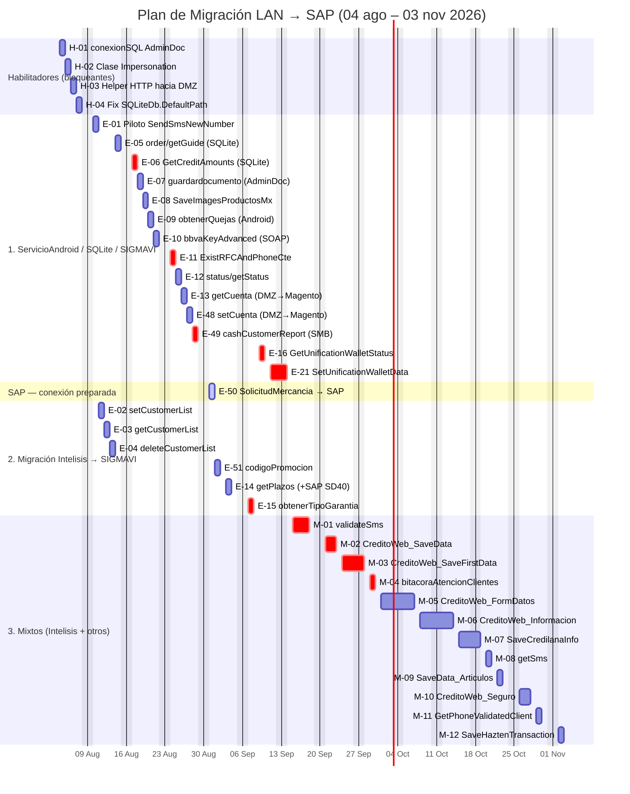

# Diagrama de Gantt — Migración LAN → SAP

Orden solicitado: primero lo que conecta directo a **ServicioAndroid / SQLite / SIGMAVI** (no-Intelisis), después lo que **migra de Intelisis a SIGMAVI**, y al final lo **mixto** (Intelisis + otros). Se agregan dos secciones adicionales para que el alcance quede explícito:

- **Habilitadores (Ola 0)**: van primero porque bloquean todo lo demás, sin ser parte de ninguno de los tres grupos.
- **SAP — conexión preparada**: aquí solo aislamos E-50 (el único endpoint que ya apunta a un servicio SAP). Nuestro alcance es dejar el puente listo; la conexión final a los servicios SAP la decide y ejecuta el equipo de SAP, no nosotros.

`crit` (rojo) = bloqueado o en riesgo · `active` = pieza de preparación para SAP.

## Notas de clasificación

- **E-06** depende de M-07 (su tabla SQLite la alimenta un proceso que lee Intelisis) — queda en el grupo 1 porque el endpoint en sí solo toca SQLite, pero el caché se congela si M-07 no se resuelve.
- **E-14** migra a SIGMAVI pero también toca SAP SD40 — se dejó en el grupo 2 porque su tabla de origen/destino es la misma lógica que el resto de la ola SIGMAVI.
- **E-16 / E-21 (Monedero)**: el SP `SpVTASUnificacionMonedero` sigue el patrón de nombres de Intelisis visto en los mixtos, pero el documento no confirma su origen. Los dejé en el grupo 1 de forma provisional — hay que validar con Valentin si en realidad son mixtos y moverlos al grupo 3.
- **Ola 7 (E-50)** es la única pieza que toca SAP directamente hoy. Por el alcance que definiste ("nosotros migramos todo lo no-Intelisis, pero dejamos la conexión lista para SAP"), la aislé como su propia sección — es el entregable que el equipo de SAP debería tomar para conectar sus servicios.
- Los bloqueos reales (🔒) son solo tres: estructura de garantías (E-15, Miguel Marín), definición de monedero (E-16/E-21, Valentin) y el riesgo de alcance de red SMB (E-49) — todos marcados `crit`.

## Pendiente

Faltan por incorporar al Gantt (no traían fecha en el documento fuente, o su fecha es un marcador de posición a definir): ninguno de los 33 endpoints quedó fuera; las fechas de las olas 10–12 están marcadas como "marcador de posición" en el documento origen, sujetas a la decisión de arquitectura sobre los mixtos del grupo A.
