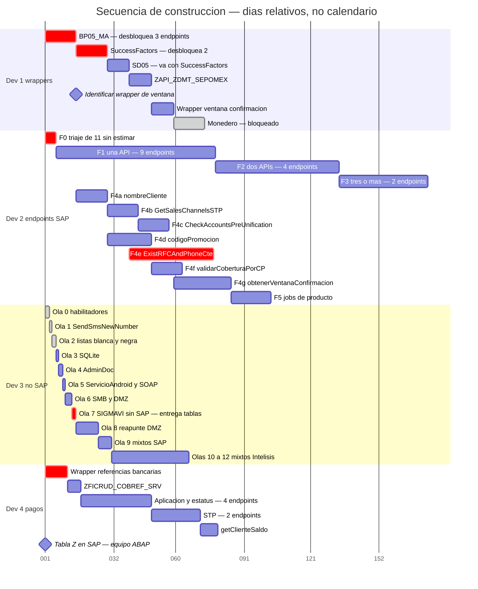

# Plan maestro — secuencia de construcción por desarrollador

Cómo debe programarse cada cosa, en qué orden y qué depende de qué. **Sin fechas**: el eje son días relativos desde el arranque de cada frente, no calendario. Las fechas se ponen cuando estén definidos arranque y capacidad.

> Detalle por rol: [[CHECKLIST_DEV1_WRAPPERS_SAP|Dev 1]] · [[CHECKLIST_DEV2_ENDPOINTS_SAP|Dev 2]] · [[CHECKLIST_DEV3_NOSAP_NOINTELISIS|Dev 3]] · [[CHECKLIST_DEV4_PAGOS|Dev 4]].

## Las reglas que ordenan el plan

1. **Dev 1 construye wrappers**, no endpoints. Su orden lo dicta la demanda de Dev 2: primero el wrapper que desbloquea más endpoints.
2. **Dev 2 sube por número de APIs consumidas** — una, dos, tres— y termina con los que esperan wrapper. Empieza por lo que ya tiene API construida para no bloquearse.
3. **Dev 3 migra lo que no va a SAP** y entrega a Dev 2 las tablas de SIGMAVI de las que éste depende.
4. **Dev 4 es autosuficiente**: construye sus propios wrappers de pago y no depende de Dev 1.
5. Los **mixtos** son de los dos: Dev 3 resuelve la rama no-SAP, Dev 2 cierra la de SAP.

## Diagrama

> Las barras marcadas en rojo son ruta crítica. Las grises son trabajo ya cerrado o bloqueado por definición externa.

# Calendario estimado por endpoint

Cada partida con sus días, su fecha de inicio y su fecha de fin, **contando solo días hábiles**. Se excluyen sábados, domingos y los festivos que ya contemplaba el plan: 16 de septiembre, 16 de noviembre, 25 de diciembre y 1 de enero.

**Arranque supuesto: lunes 17 de agosto de 2026** para los cuatro frentes, que corren en paralelo. Es un parámetro: si el arranque cambia, todo se recorre en bloque.

## Dev 1 — wrappers de SAP

> Seis dias por wrapper, derivados de la formula del propio archivo. El wrapper de monedero queda fuera del calendario por estar bloqueado.

**Wrappers — 6 dias cada uno**

| # | Endpoint o wrapper | Dias | Inicio | Fin |
|---:|---|---:|---|---|
| 1 | `BP05_MA → nombreCliente, GetSalesChannelsSTP, CheckAccountsPreUnification` | 6 | 17/08/2026 | 24/08/2026 |
| 2 | `SuccessFactors → codigoPromocion, ExistRFCAndPhoneCte` | 6 | 25/08/2026 | 01/09/2026 |
| 3 | `SD05 → ExistRFCAndPhoneCte` | 6 | 02/09/2026 | 09/09/2026 |
| 4 | `ZAPI_ZDMT_SEPOMEX → validarCoberturaPorCP` | 6 | 10/09/2026 | 18/09/2026 |
| 5 | `Wrapper de obtenerVentanaConfirmacion — por identificar` | 6 | 21/09/2026 | 28/09/2026 |
| | *Subtotal* | **30** | | *28/09/2026* |

> **Total Dev 1: 30 dias habiles** · del 17/08/2026 al **28/09/2026**

## Dev 3 — lo que no va a SAP

> Solo lo pendiente. Las olas 0 a 2 ya estan cerradas como desarrollo y no entran en el calendario. El monedero paso a Dev 2 el 12 ago y ya no figura aqui.

**Ola 3 — SQLite**

| # | Endpoint o wrapper | Dias | Inicio | Fin |
|---:|---|---:|---|---|
| 1 | `order/getGuide` | 2 | 17/08/2026 | 18/08/2026 |
| 2 | `credit/GetCreditAmounts` | 2 | 19/08/2026 | 20/08/2026 |
| | *Subtotal* | **4** | | *20/08/2026* |

**Ola 4 — AdminDoc**

| # | Endpoint o wrapper | Dias | Inicio | Fin |
|---:|---|---:|---|---|
| 1 | `credit/guardardocumento` | 2 | 21/08/2026 | 24/08/2026 |
| 2 | `credit/SaveImagesProductosMx` | 2 | 25/08/2026 | 26/08/2026 |
| | *Subtotal* | **4** | | *26/08/2026* |

**Ola 5 — ServicioAndroid y SOAP externo**

| # | Endpoint o wrapper | Dias | Inicio | Fin |
|---:|---|---:|---|---|
| 1 | `customerService/obtenerQuejas` | 2 | 27/08/2026 | 28/08/2026 |
| 2 | `customerService/bbvaKeyAdvanced` | 2 | 31/08/2026 | 01/09/2026 |
| | *Subtotal* | **4** | | *01/09/2026* |

**Ola 6 — SMB y DMZ**

| # | Endpoint o wrapper | Dias | Inicio | Fin |
|---:|---|---:|---|---|
| 1 | `customer/getCuenta` | 2 | 02/09/2026 | 03/09/2026 |
| 2 | `customer/setCuenta` | 2 | 04/09/2026 | 07/09/2026 |
| 3 | `customer/cashCustomerReport` | 2 | 08/09/2026 | 09/09/2026 |
| 4 | `product/obtenerImagen` | 2 | 10/09/2026 | 11/09/2026 |
| | *Subtotal* | **8** | | *11/09/2026* |

**Ola 7 — SIGMAVI sin SAP · entrega tablas a Dev 2**

| # | Endpoint o wrapper | Dias | Inicio | Fin |
|---:|---|---:|---|---|
| 1 | `order/GetPickUpCode` | 2 | 14/09/2026 | 15/09/2026 |
| 2 | `recommender/setRecommenderList` | 2 | 17/09/2026 | 18/09/2026 |
| | *Subtotal* | **4** | | *18/09/2026* |

**Ola 8 — reapunte de rutas de la DMZ**

| # | Endpoint o wrapper | Dias | Inicio | Fin |
|---:|---|---:|---|---|
| 1 | `magento/attributes` | 2 | 21/09/2026 | 22/09/2026 |
| 2 | `magento/general/attributes` | 2 | 23/09/2026 | 24/09/2026 |
| 3 | `magento/attributeSets` | 2 | 25/09/2026 | 28/09/2026 |
| 4 | `magento/attributeSetChildren/{id}` | 2 | 29/09/2026 | 30/09/2026 |
| 5 | `magento/categories` | 2 | 01/10/2026 | 02/10/2026 |
| 6 | `magento/children/{page}/{size}/{store}` | 2 | 05/10/2026 | 06/10/2026 |
| 7 | `magento/noImagenProduct/{store}` | 2 | 07/10/2026 | 08/10/2026 |
| 8 | `magento/productWithWebsites/{page}/{size}` | 2 | 09/10/2026 | 12/10/2026 |
| 9 | `magento/getOrderId/{incrementId}` | 2 | 13/10/2026 | 14/10/2026 |
| 10 | `magento/deletePromociones` | 2 | 15/10/2026 | 16/10/2026 |
| 11 | `magento/deleteReservations` | 2 | 19/10/2026 | 20/10/2026 |
| 12 | `magento/getCuenta` | 2 | 21/10/2026 | 22/10/2026 |
| 13 | `magento/setCuenta` | 2 | 23/10/2026 | 26/10/2026 |
| 14 | `order/authorizationResult` | 2 | 27/10/2026 | 28/10/2026 |
| 15 | `order/setOrderStatus` | 2 | 29/10/2026 | 30/10/2026 |
| 16 | `order/getOrderInfo/{incrementId}` | 2 | 02/11/2026 | 03/11/2026 |
| 17 | `order/jsonOrders/{incrementId}` | 2 | 04/11/2026 | 05/11/2026 |
| 18 | `order/setCAccount` | 2 | 06/11/2026 | 09/11/2026 |
| 19 | `order/sendStorePickupEmail` | 2 | 10/11/2026 | 11/11/2026 |
| 20 | `order/getprueba` | 2 | 12/11/2026 | 13/11/2026 |
| 21 | `product/updateProduct/{store}` | 2 | 17/11/2026 | 18/11/2026 |
| 22 | `product/updateConfigurableProduct/{store}` | 2 | 19/11/2026 | 20/11/2026 |
| 23 | `product/updateConfigurableProductLink/{sku}` | 2 | 23/11/2026 | 24/11/2026 |
| 24 | `product/updateStock` | 2 | 25/11/2026 | 26/11/2026 |
| 25 | `product/getStockByStore` | 2 | 27/11/2026 | 30/11/2026 |
| 26 | `product/updatePrice` | 2 | 01/12/2026 | 02/12/2026 |
| 27 | `product/uploadImage` | 2 | 03/12/2026 | 04/12/2026 |
| 28 | `product/uploadImagesToMagento` | 2 | 07/12/2026 | 08/12/2026 |
| 29 | `customerService/ActualizarCamposConfigurables` | 2 | 09/12/2026 | 10/12/2026 |
| 30 | `customerService/InsertarDesdeTablerateNativo` | 2 | 11/12/2026 | 14/12/2026 |
| 31 | `customerService/InsertarDesdeTablerateCustom` | 2 | 15/12/2026 | 16/12/2026 |
| | *Subtotal* | **62** | | *16/12/2026* |

**Ola 9 — mixtos SAP · leen de SAP y escriben en no-SAP**

| # | Endpoint o wrapper | Dias | Inicio | Fin |
|---:|---|---:|---|---|
| 1 | `credit/SolicitudMercancia` | 2 | 17/12/2026 | 18/12/2026 |
| 2 | `credit/codigoPromocion` | 20 | 21/12/2026 | 19/01/2027 |
| 3 | `credit/getPlazos` | 8 | 20/01/2027 | 29/01/2027 |
| 4 | `customerService/obtenerTipoGarantia` | 2 | 01/02/2027 | 02/02/2027 |
| | *Subtotal* | **32** | | *02/02/2027* |

**Olas 10 a 12 — mixtos Intelisis**

| # | Endpoint o wrapper | Dias | Inicio | Fin |
|---:|---|---:|---|---|
| 1 | `credit/validateSms` | 2 | 03/02/2027 | 04/02/2027 |
| 2 | `credit/CreditoWeb_SaveData` | 2 | 05/02/2027 | 08/02/2027 |
| 3 | `credit/CreditoWeb_SaveFirstData` | 2 | 09/02/2027 | 10/02/2027 |
| 4 | `customerService/bitacoraAtencionClientes` | 2 | 11/02/2027 | 12/02/2027 |
| 5 | `credit/CreditoWeb_FormDatos` | 2 | 15/02/2027 | 16/02/2027 |
| 6 | `credit/CreditoWeb_Informacion` | 2 | 17/02/2027 | 18/02/2027 |
| 7 | `credit/SaveCredilanaInfo` | 2 | 19/02/2027 | 22/02/2027 |
| 8 | `credit/getSms` | 2 | 23/02/2027 | 24/02/2027 |
| 9 | `credit/CreditoWeb_SaveData_Articulos` | 2 | 25/02/2027 | 26/02/2027 |
| 10 | `credit/CreditoWeb_Seguro` | 2 | 01/03/2027 | 02/03/2027 |
| 11 | `credit/GetPhoneValidatedClientSecretName` | 2 | 03/03/2027 | 04/03/2027 |
| 12 | `credit/SaveHaztenTransaction` | 2 | 05/03/2027 | 08/03/2027 |
| 13 | `credit/CreditoWeb_Solicitud` | 2 | 09/03/2027 | 10/03/2027 |
| 14 | `credit/CreditoWeb_SolicitudPrimerGuardado` | 2 | 11/03/2027 | 12/03/2027 |
| 15 | `order/ManagePaynetOrders` | 2 | 15/03/2027 | 16/03/2027 |
| 16 | `order/InsertPaymentData` | 2 | 17/03/2027 | 18/03/2027 |
| 17 | `order/updateCreditOrderId` | 2 | 19/03/2027 | 22/03/2027 |
| 18 | `credit/codigoRecomendadoWithUen` | 2 | 23/03/2027 | 24/03/2027 |
| | *Subtotal* | **36** | | *24/03/2027* |

> **Total Dev 3: 154 dias habiles** · del 17/08/2026 al **24/03/2027**

## Dev 2 — endpoints sobre SAP

> La fase 4 baja de 140 a 92 dias porque el coste del wrapper pasa a Dev 1. El archivo lo cobraba dentro de cada endpoint.

**Fase 0 — triaje, sin conteo de APIs en el archivo**

| # | Endpoint o wrapper | Dias | Inicio | Fin |
|---:|---|---:|---|---|
| 1 | `credit/MonederoSaldoCredito` | 2 | 17/08/2026 | 18/08/2026 |
| 2 | `customerService/LoginClienteCredito` | 2 | 19/08/2026 | 20/08/2026 |
| 3 | `customerService/LoginClienteCreditoFechaN` | 2 | 21/08/2026 | 24/08/2026 |
| 4 | `customerService/GetEmpleadoByNomina` | 2 | 25/08/2026 | 26/08/2026 |
| 5 | `order/cancelOrder` | 2 | 27/08/2026 | 28/08/2026 |
| 6 | `order/validateCredit` | 2 | 31/08/2026 | 01/09/2026 |
| 7 | `prospecto/rfc` | 2 | 02/09/2026 | 03/09/2026 |
| 8 | `customer/wallet/getCuentaC/{ordenCompra}` | 2 | 04/09/2026 | 07/09/2026 |
| 9 | `company/wholesale-customer/{wholesaleAccount}` | 2 | 08/09/2026 | 09/09/2026 |
| 10 | `order/generateNewStorepickupCode/{idEcommerce}` | 2 | 10/09/2026 | 11/09/2026 |
| 11 | `order/checkOpenpay` | 2 | 14/09/2026 | 15/09/2026 |
| | *Subtotal* | **22** | | *15/09/2026* |

**Fase 1 — una API**

| # | Endpoint o wrapper | Dias | Inicio | Fin |
|---:|---|---:|---|---|
| 1 | `credit/getPlazos` | 8 | 17/09/2026 | 28/09/2026 |
| 2 | `credit/getCreditAccount/{pAccount}` | 8 | 29/09/2026 | 08/10/2026 |
| 3 | `customerService/unirCuenta` | 8 | 09/10/2026 | 20/10/2026 |
| 4 | `customerService/validarCliente` | 8 | 21/10/2026 | 30/10/2026 |
| 5 | `order/getIntelisisStatuses` | 8 | 02/11/2026 | 11/11/2026 |
| 6 | `order/creditStatus/{idSolicitud}` | 8 | 12/11/2026 | 24/11/2026 |
| 7 | `prospecto/recuperarcuenta` | 8 | 25/11/2026 | 04/12/2026 |
| 8 | `recommender/getRecommender` | 8 | 07/12/2026 | 16/12/2026 |
| 9 | `customer/wallet/getMinimumCostToRedeem` | 8 | 17/12/2026 | 29/12/2026 |
| | *Subtotal* | **72** | | *29/12/2026* |

**Fase 2 — dos APIs**

| # | Endpoint o wrapper | Dias | Inicio | Fin |
|---:|---|---:|---|---|
| 1 | `customerService/obtenerCreditos` | 14 | 30/12/2026 | 19/01/2027 |
| 2 | `order/estimated-delivery/{ecommerceId}` | 14 | 20/01/2027 | 08/02/2027 |
| 3 | `order/createStorepickupCode/{idEcommerce}/{idOrder}` | 14 | 09/02/2027 | 26/02/2027 |
| 4 | `order/getOrderInfoAndSet/{incrementId}` | 14 | 01/03/2027 | 18/03/2027 |
| | *Subtotal* | **56** | | *18/03/2027* |

**Fase 3 — tres o mas APIs**

| # | Endpoint o wrapper | Dias | Inicio | Fin |
|---:|---|---:|---|---|
| 1 | `company/negotiable-quote/create` | 20 | 19/03/2027 | 15/04/2027 |
| 2 | `order/getOrderId/{idEcommerce}` | 20 | 16/04/2027 | 13/05/2027 |
| | *Subtotal* | **40** | | *13/05/2027* |

**Fase 4 — esperan wrapper de Dev 1 · dias recalculados sin el wrapper**

| # | Endpoint o wrapper | Dias | Inicio | Fin |
|---:|---|---:|---|---|
| 1 | `customerService/nombreCliente` | 8 | 14/05/2027 | 25/05/2027 |
| 2 | `customerService/GetSalesChannelsSTP` | 8 | 26/05/2027 | 04/06/2027 |
| 3 | `credit/CheckAccountsPreUnification` | 8 | 07/06/2027 | 16/06/2027 |
| 4 | `customerService/validarCoberturaPorCP` | 8 | 17/06/2027 | 28/06/2027 |
| 5 | `credit/codigoPromocion` | 14 | 29/06/2027 | 16/07/2027 |
| 6 | `customerService/obtenerVentanaConfirmacion` | 20 | 19/07/2027 | 13/08/2027 |
| 7 | `credit/ExistRFCAndPhoneCte` | 26 | 16/08/2027 | 20/09/2027 |
| | *Subtotal* | **92** | | *20/09/2027* |

**Fase 5 — jobs de producto**

| # | Endpoint o wrapper | Dias | Inicio | Fin |
|---:|---|---:|---|---|
| 1 | `product/updateProduct` | 2 | 21/09/2027 | 22/09/2027 |
| 2 | `product/updateProductJsonOnly` | 2 | 23/09/2027 | 24/09/2027 |
| 3 | `product/updatePrice` | 2 | 27/09/2027 | 28/09/2027 |
| 4 | `product/updateConfigurableProduct` | 2 | 29/09/2027 | 30/09/2027 |
| 5 | `product/updateStockMavi` | 2 | 01/10/2027 | 04/10/2027 |
| 6 | `product/updateStock` | 2 | 05/10/2027 | 06/10/2027 |
| 7 | `product/existenciasAlmacenArt` | 2 | 07/10/2027 | 08/10/2027 |
| | *Subtotal* | **14** | | *08/10/2027* |

> **Total Dev 2: 296 dias habiles** · del 17/08/2026 al **08/10/2027**

## Dev 4 — flujos de pago

> Dev 4 construye su propio wrapper; no depende de Dev 1.

**Wrapper propio**

| # | Endpoint o wrapper | Dias | Inicio | Fin |
|---:|---|---:|---|---|
| 1 | `Tabla Z en SAP + API para ValidateSTPAccount` | 6 | 17/08/2026 | 24/08/2026 |
| | *Subtotal* | **6** | | *24/08/2026* |

**Endpoints de pago**

| # | Endpoint o wrapper | Dias | Inicio | Fin |
|---:|---|---:|---|---|
| 1 | `credit/getClienteSaldo/{cliente}` | 8 | 25/08/2026 | 03/09/2026 |
| 2 | `customerService/ApplyPaymentNeko` | 8 | 04/09/2026 | 15/09/2026 |
| 3 | `customerService/UpdateStatusPaymentNeko` | 8 | 17/09/2026 | 28/09/2026 |
| 4 | `customerService/ApplyPaymentAdvanced` | 8 | 29/09/2026 | 08/10/2026 |
| 5 | `customerService/UpdateStatusPaymentAdvanced` | 8 | 09/10/2026 | 20/10/2026 |
| 6 | `customerService/GetSTPAccount` | 8 | 21/10/2026 | 30/10/2026 |
| 7 | `customerService/ValidateSTPAccount` | 8 | 02/11/2026 | 11/11/2026 |
| | *Subtotal* | **56** | | *11/11/2026* |

> **Total Dev 4: 62 dias habiles** · del 17/08/2026 al **11/11/2026**

---

## Totales por desarrollador

| Dev | Partidas | Días hábiles | Arranque | Cierre estimado |
|---|---:|---:|---|---|
| **Dev 1** — wrappers | 5 | **30** | 17/08/2026 | **28/09/2026** |
| **Dev 4** — pagos | 8 | **62** | 17/08/2026 | **11/11/2026** |
| **Dev 3** — no SAP | 71 | **154** | 17/08/2026 | **24/03/2027** |
| **Dev 2** — SAP | 42 | **296** | 17/08/2026 | **08/10/2027** |
| | **126** | **542** | | |

**Dev 2 marca el cierre del proyecto**, casi seis meses después que Dev 3 y más de un año después del arranque. Es el frente a reforzar si hay que comprimir el calendario: los otros tres terminan mucho antes y quedan libres.

### Por qué Dev 2 baja de 346 a 296 días

El archivo maestro estima con la fórmula `días = 2 + 6×APIs + 6×wrappers`, exacta en las 107 filas activas. Eso significa que **cobra 6 días de wrapper dentro de cada endpoint que lo necesita**, así que `BP05_MA` se paga tres veces. Al separar la construcción a Dev 1 se paga una sola:

| Concepto | Días |
|---|---:|
| Total original de Dev 2 en el archivo | 346 |
| − Wrappers que pasan a Dev 1 | −48 |
| − Dos filas duplicadas de producto | −4 |
| + `order/cancelOrder`, que venía en 0 | +2 |
| **Total Dev 2 repartido** | **296** |

Dev 1 absorbe **30** de esos 48 días. **El reparto ahorra 18 días netos** al proyecto, solo por no construir tres veces el mismo wrapper.

---

## Dónde se cruzan los frentes

Son los cuatro puntos donde un retraso de un desarrollador para a otro. Todo lo demás corre en paralelo.

| # | Quién entrega | Quién espera | Qué |
|---|---|---|---|
| 1 | **Dev 1** → | **Dev 2** | `BP05_MA` abre 42 días de trabajo de golpe. Es el cruce más rentable y el más urgente |
| 2 | **Dev 1** → | **Dev 2** | `SuccessFactors` + `SD05` habilitan `ExistRFCAndPhoneCte`, el endpoint más caro del plan |
| 3 | **Dev 3** → | **Dev 2** | Las tablas de SIGMAVI de la Ola 7: `CondicionesCredVtaLinea`, `TrWDM0285_CteRecoge`, `CodigosRecomendados` |
| 4 | **Dev 3** → | **Dev 2** | La rama no-SAP de los mixtos M-15…M-14 |

> 🔴 **El 40 % del esfuerzo de Dev 2 depende de Dev 1**: 140 de 346 días. Y toda la fase 4 cae al final de su calendario, que es el peor momento para descubrir que un wrapper no llegó. Por eso Dev 1 arranca el mismo día que Dev 2 aunque su primer entregable no se consuma hasta semanas después.

> ⚠️ **Dev 2 no debe crear las tablas de SIGMAVI por su cuenta ni programar contra Intelisis mientras espera.** Da un verde que no significa nada.

## Dos decisiones previas que cambian el plan

**`ExistRFCAndPhoneCte` son 38 días para reconstruir algo apagado.** Es la barra más larga de Dev 2 y arrastra dos wrappers de Dev 1. En el legado sus dos métodos de validación tienen un `return` incondicional en la primera línea: el endpoint no consulta nada y siempre responde lo mismo. Dev 3 lo descartó por eso. Si Producto confirma que no se necesita, **se caen 38 días de Dev 2 y 24 de Dev 1**.

**Los 11 endpoints de la fase 0 de Dev 2 no están estimados.** No traen número de APIs en el archivo maestro, así que ni se pueden ordenar ni sumar al total. Hasta que se triajen, los 346 días de Dev 2 son un piso, no una previsión.
