# Arquitectura Sistema POS / Crédito MAVI — Proyecto SAP S/4HANA

> [!info] Qué es este documento
> Presentación de 178 diapositivas del **Proyecto SAP 4HANA (POS/Crédito)** fechada en **febrero de 2025**. No es un documento de texto: es un **atlas de diagramas de arquitectura**. Cada diapositiva dibuja un escenario de negocio (una venta, un cobro, una reversa) como un carril horizontal de cinco capas —POS → BAS → CPI → CAR → S/4HANA— y coloca sobre las flechas el **código de la API** que se consume y, al final, el **documento SAP** o la **tabla Z** que se afecta.
> El valor de la presentación es ese mapa de integraciones: qué API se llama, en qué capa vive, qué documento produce y qué tabla `ZSPLIT` actualiza.

## Tabla de contenido

- [[#1. Cómo leer los diagramas: las cinco capas]]
- [[#2. Convención de tablas ZSPLIT (la regla maestra)]]
- [[#3. Familias de APIs y qué significa cada prefijo]]
- [[#4. Venta]]
  - [[#4.1 Venta Credilanas — efectivo, SPEI y ventanilla]]
  - [[#4.2 Venta Seguros]]
  - [[#4.3 Venta Mercaderías y Mercaderías con enganche]]
  - [[#4.4 Venta Mercaderías con despacho en CeDis]]
  - [[#4.5 Venta contado con anticipo]]
  - [[#4.6 Modificación de estatus y anulación de ventas]]
- [[#5. Procesos periódicos: los JOBs de interés y moratorios]]
- [[#6. Cobros]]
  - [[#6.1 Cobros Credilanas]]
  - [[#6.2 Cobros Seguros]]
  - [[#6.3 Cobros Mercaderías / Débito]]
- [[#7. Devoluciones]]
- [[#8. Temas varios]]
  - [[#8.1 Cobros referenciados y la tabla ZREFERENCIA]]
  - [[#8.2 Convenio RD]]
  - [[#8.3 Adjudicaciones]]
  - [[#8.4 Notas de Cargo / Crédito Espejo]]
  - [[#8.5 Notas de Cargo y Crédito creadas en S4]]
  - [[#8.6 Quebrantos (MAVICOB)]]
  - [[#8.7 Condiciones de pago y días de gracia]]
  - [[#8.8 Fondeo de caja]]
  - [[#8.9 Consulta de datos: las APIs de lectura]]
  - [[#8.10 Réplica por SLT]]
  - [[#8.11 Consideraciones formales (diap. 98)]]
- [[#9. Bloque Reversas]]
- [[#10. Escenarios To-Be de caja, tesorería y proveedores]]
- [[#11. Catálogo maestro de APIs]]
- [[#12. Catálogo de tablas Z y estándar]]
- [[#13. Riesgos, deltas y pendientes detectados]]

---

> [!warning] Límites de esta extracción — léelo antes de confiar en un detalle fino
> 1. **Las flechas no se pueden recuperar del texto.** El volcado entrega las *etiquetas* de cada diagrama con sus coordenadas, no los conectores. La reconstrucción de cada flujo que aparece abajo se apoya en la **posición de cada etiqueta en la diapositiva** (la columna X indica la capa: POS ≈ 1-20, BAS ≈ 20-30, CPI ≈ 42-55, CAR ≈ 48-77, S4 ≈ 66-92, tablas ≈ 100-122). Es una inferencia sólida y consistente en las 178 diapositivas, pero **el orden exacto entre dos pasos de la misma fila puede diferir del original**. Para cualquier decisión de diseño, valida contra el PPTX.
> 2. **Las "notas del ponente" están vacías.** El archivo `.pptx` sí contiene 104 objetos `notesSlide`, pero al abrirlos **sólo contienen el número de diapositiva**: no hay texto explicativo del ponente. Ninguna explicación adicional se perdió en la extracción; sencillamente no existe en el archivo.
> 3. **Hay dos tablas reales** en todo el mazo (diap. 98 y diap. 168); todo lo demás es gráfico.

---

## 1. Cómo leer los diagramas: las cinco capas

Todas las diapositivas de arquitectura usan el mismo lienzo. De izquierda a derecha:

| Capa | Etiqueta en el diagrama | Plataforma | Rol |
|---|---|---|---|
| Punto de venta | `MAVI POS`, `POS/Crédito` | AWS | Origina la transacción del cajero |
| Middleware propio | `BAS` — "Plataforma desarrollo" | AWS | Orquesta, agrupa y traduce las transacciones del POS |
| Middleware SAP | `CPI` | SAP BTP | Bus de integración hacia el core |
| Retail | `CAR` | SAP Customer Activity Repository | Recibe los `PV01_*` / `PV02_*` y genera los movimientos |
| Core | `S4` | SAP S/4HANA | Crea los documentos SD/FI y escribe las tablas Z |
| Persistencia lateral | `BD` | SAP HANA Cloud | Catálogos replicados (formas de pago, motivos de pedido) |
| Canal alterno | `APP` | Plataforma APP | Cobros referenciados vía aplicación móvil |

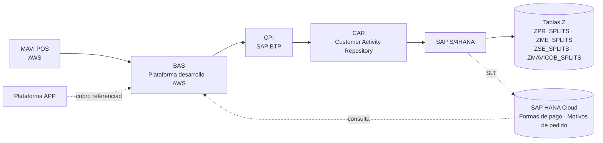

> [!tip] Regla de lectura de los códigos
> Un código a la altura de la columna CPI (`SD01`, `EX01`, `TZ01`, `DM01`, `BP05`) es una **API expuesta por S/4HANA y consumida vía CPI**. Un código en la columna CAR (`PV01_*`, `PV02_*`) es una **interfaz POS/BAS → CAR**. Un código a la derecha de CAR (`CO01_CP`, `CO06`, `CO07`, `EN01`, `EN03`, `CO03`) es la **transacción que CAR dispara en S/4HANA**. Los `D-*` y `ND-*` son **deltas de desarrollo**, no APIs de tránsito.

Una nota aparece repetida en prácticamente todas las diapositivas de arquitectura y hay que tomarla como principio de diseño global:

> [!tip] "Este escenario describe integraciones compatibles con la nube"
> Todos los escenarios están diseñados para ejecutarse contra S/4HANA en modalidad cloud; no se admiten integraciones que dependan de acceso directo al servidor de aplicación.

---

## 2. Convención de tablas ZSPLIT (la regla maestra)

La diapositiva 98 contiene la única tabla explicativa del mazo y resuelve una ambigüedad que atraviesa todo el documento: en los diagramas se dibuja genéricamente **"Tabla ZSPLIT"**, pero la tabla real depende del escenario de negocio.

| Escenario de negocio | Tabla Z real | API de escritura |
|---|---|---|
| Credilanas (préstamos) | [[ZPR_SPLITS]] (`ZPR_SPLIT`) | [[TZ01]] · [[N-TZ-16]] |
| Mercaderías | [[ZME_SPLITS]] (`ZME_SPLIT`) | [[N-TZ01-Mercaderias]] · [[N-TZ-18]] |
| Seguros | [[ZSE_SPLITS]] (`ZSE_SPLIT`) | [[N-TZ01-Seguros]] · [[N-TZ-17]] |
| Mavicob (incluye mercaderías y credilanas quebrantadas) | [[ZMAVICOB_SPLITS]] (`ZMAVICOB_SPLIT`) | [[N-TZ01-Mavicob]] · [[N-TZ-19]] |

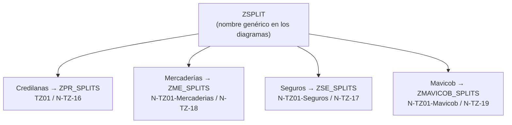

La segunda fila de esa tabla define el alcance de la API de impresión:

> [!example] Formatos que expone [[N-SD-CON-04]] (diap. 98)
> La API expone de S/4HANA a POS los datos para imprimir: **Anticipo MA, Anticipo VIU, Cobro DIMA, Cobro MA, Cobro VIU, Credilana, Enganche MA, Enganche VIU, Factura Contado MA, Factura Contado VIU, Factura DIMA, Factura Mayoreo Ciega, Préstamo Personal y Seguro de Vida**. El detalle de campos vive en la EF del desarrollo [[D-SD-CON-04]] ("Formatos de impresión que lean datos de CAR o S4H para imprimir los tickets en S4H").

Además, en todos los escenarios que envían parcialidades aparece la misma advertencia operativa:

> [!warning] Envío de parcialidades
> "Se debe enviar **n registros** con la información de cada parcialidad". Es decir, las APIs de creación de documentos a crédito no envían un total: envían la tabla de parcialidades desglosada, que es lo que puebla las `ZSPLITS`.

---

## 3. Familias de APIs y qué significa cada prefijo

| Prefijo | Capa | Naturaleza |
|---|---|---|
| `SD##` | S/4HANA vía CPI | APIs de Ventas y Distribución: pedidos, facturas, notas, entregas, anulaciones |
| `BP##` | S/4HANA vía CPI | Interlocutor comercial (cliente) |
| `DM01` | S/4HANA vía CPI | Datos maestros de artículos (no inventariables) |
| `EX01` | S/4HANA vía CPI | Exposición de partidas abiertas / documentos no compensados |
| `TZ##`, `N-TZ##`, `N-TZ01-*` | S/4HANA vía CPI | Lectura/escritura de tablas Z (splits, condonaciones, referencias, factores) |
| `PV01_*`, `PV02_*` | POS/BAS → CAR | Movimiento del punto de venta enviado a CAR. `PV01` suele generar documento contable; `PV02` documento comercial (nota de cargo/crédito, factura) |
| `CO0#`, `EN0#`, `CSCE`, `CI0#`, `RE0#` | CAR → S/4HANA | Transacción que CAR dispara para materializar el documento |
| `N-CXC-##` | S/4HANA | Cuentas por cobrar: actualización de folios y compensaciones |
| `D-*` | Desarrollo | Delta de desarrollo (no es interfaz de tránsito) |
| `ND-*` | Desarrollo | Desarrollo nuevo, típicamente un JOB o una transacción Z |
| `N-D-SLT##` | SLT | Replicación de tablas estándar a HANA Cloud |
| `MAVI0#` | S/4HANA | Transacciones Z de captura/evaluación manual dentro de S4 |
| `WPUFIB` | S/4HANA | IDoc de entrada de movimientos financieros de tienda |

---

## 4. Venta

El índice de la diapositiva 2 divide el mazo en cuatro bloques: **Venta, Procesos Periódicos, Cobros y Devolución/Reverso**. El bloque de venta ocupa las diapositivas 3 a 11.

### 4.1 Venta Credilanas — efectivo, SPEI y ventanilla

**(diap. 3-4)**

Credilanas es el préstamo personal. El flujo arranca con la pareja consulta/oferta y termina con el documento contable de la salida de dinero, además de la escritura de las parcialidades.

La secuencia de APIs, en el orden en que aparecen verticalmente en la diapositiva:

| API | Documento o efecto en S/4HANA |
|---|---|
| [[SD03]] | Consulta |
| [[SD04]] | Oferta |
| [[SD01]] | Pedido |
| [[SD17]] | Factura **No CFDI** |
| [[SD30]] | Nota de Crédito **No CFDI** |
| [[SD05]] | Registro en [[MOVBITACORA]] / [[MOVTIEMPO]] |
| [[SD32]] | ND Aumento de Monedero |
| [[N-SD-CON-04]] | Recolección de datos para impresión → [[D-SD-CON-04]] |
| [[PV01_EN01]] → [[EN01]] | Documento contable (salida de dinero) |
| [[TZ01]] | Escritura de parcialidades en [[ZPR_SPLITS]] → [[N-TZ-16]] |

El POS envía como carga: *Pedido POS, Clase Factura, Factura S4, Cliente, Condición, Área de Ventas y Precio de Venta*.

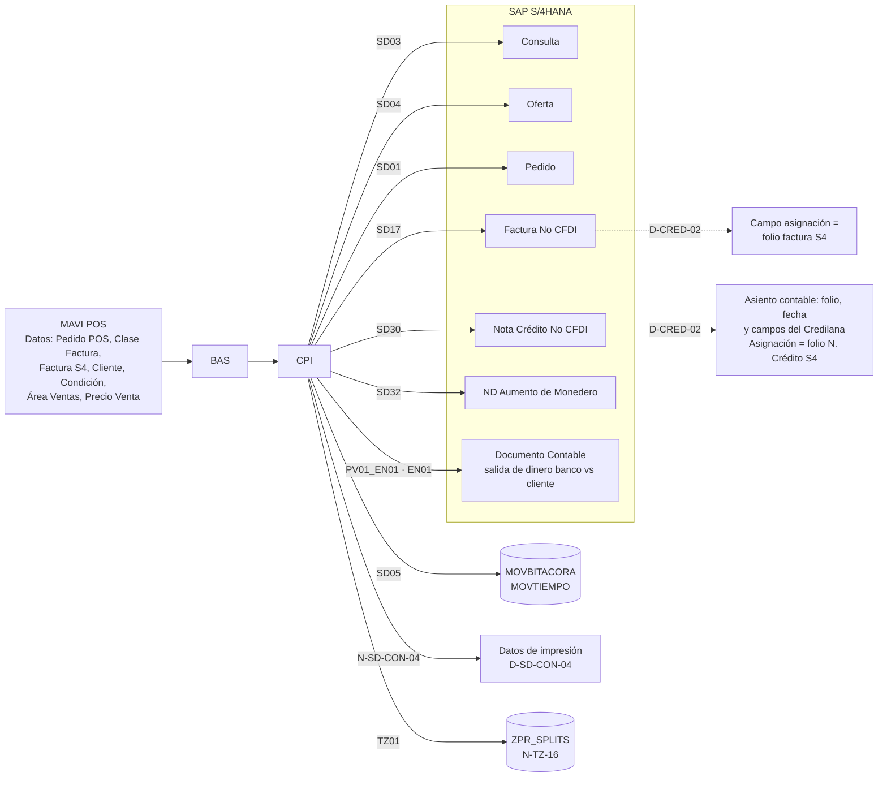

Los cuatro documentos comerciales (consulta, oferta, pedido, factura) escriben además en las **Tablas Z Venta Contado / Crédito**.

> [!tip] Reglas de negocio explícitas en estas diapositivas
> - La **ND Aumento de Monedero** ([[SD32]]) hay que *identificar* el documento y **no afecta el estado de cuenta del cliente**.
> - **No aplica el escenario "Disminución de monedero"** en la venta de Credilanas.
> - [[D-CRED-02]] es el desarrollo transversal que, tras crear el documento en S4, **actualiza el campo asignación con el folio** y actualiza en el asiento contable el folio, la fecha y otros campos del Credilana involucrado.

**Variante SPEI / Ventanilla (diap. 4).** Es idéntica salvo por un tramo adicional: [[N-D-TR-01]] escribe la **Tabla ZReferencias SPEI/ventanilla** y [[D-TR-01]] genera el documento contable de salida de dinero banco vs cliente. El resto (SD03/SD04/SD01/SD17/SD30/SD05/SD32, TZ01→ZPR_SPLITS, N-TZ-16) no cambia.

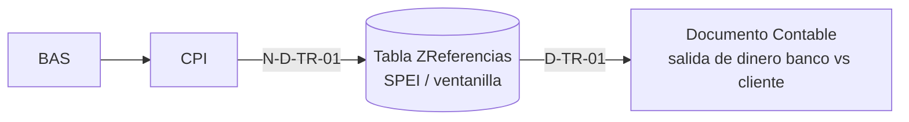

### 4.2 Venta Seguros

**(diap. 5)**

Flujo más corto: no hay nota de crédito ni monedero. Consulta ([[SD03]]) → Oferta ([[SD04]]) → Pedido ([[SD01]]) → Factura No CFDI ([[SD17]]) → bitácora ([[SD05]]) → impresión ([[N-SD-CON-04]] / [[D-SD-CON-04]]). Las parcialidades se escriben con **[[N-TZ01-Seguros]]** sobre **[[ZSE_SPLITS]]** (referencia [[N-TZ-17]]). También registra [[MOVBITACORA]] y [[MOVTIEMPO]]. [[D-CRED-02]] actualiza el campo asignación con el folio de la factura creada en S4.

### 4.3 Venta Mercaderías y Mercaderías con enganche

**(diap. 6-9)**

Aquí entra la logística: además del ciclo comercial hay **entrega, salida de mercancías y factura CFDI**.

| API | Efecto |
|---|---|
| [[SD03]] / [[SD04]] / [[SD01]] | Consulta / Oferta / Pedido |
| [[SD06]] | Entrega → Salida de Mercancías → Factura CFDI |
| [[SD17]] | Factura **CFDI** |
| [[SD34]] | Actualizar Reporte Dcto. ZZZ |
| [[SD05]] | [[MOVBITACORA]] / [[MOVTIEMPO]] |
| [[N-TZ01-Mercaderias]] | Escribe [[ZME_SPLITS]] → [[N-TZ-18]] |

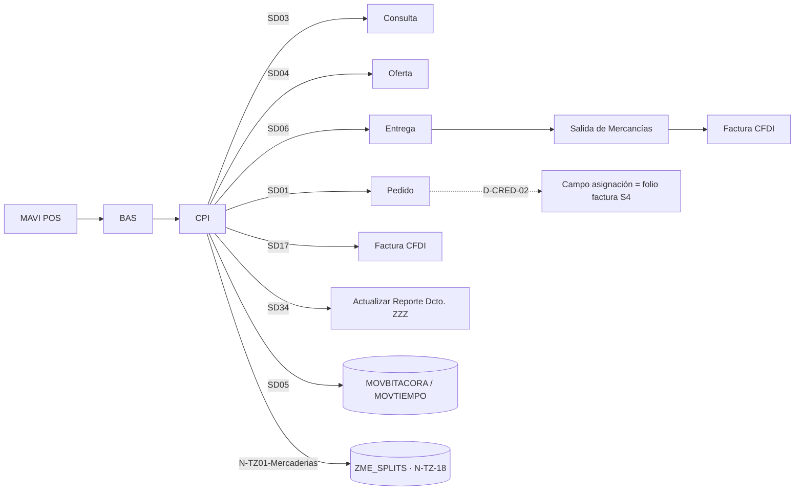

**Con enganche (diap. 8).** Se añade el tramo contable del enganche: [[PV01_CO03]] → [[CO03]] genera el **Documento Contable (Enganche)**, que **debe estar referenciado al pedido**, y [[SD43]] produce el documento contable del enganche del lado de S4.

> [!tip] Regla clave del enganche
> "Actualizar el número de la factura en el campo de asignación. **Se utilizará en la compensación**." Sin ese dato, el enganche no se puede casar después contra la factura.

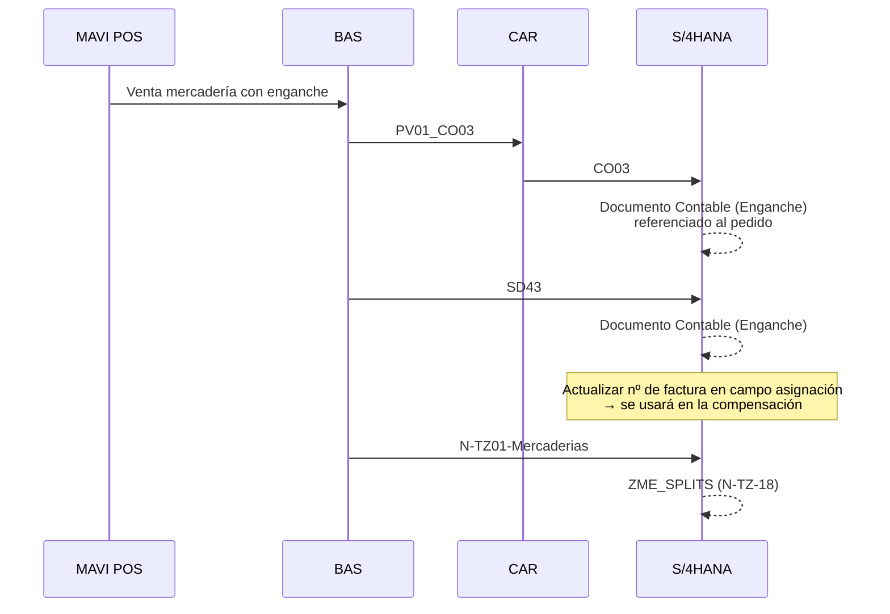

**Continuación de mercaderías (diap. 7 y 9): monedero y nota de crédito.**

| API | Documento |
|---|---|
| [[SD20]] | NC Disminución de Monedero |
| [[SD32]] | ND Aumento de Monedero |
| [[SD30]] | Nota de Crédito CFDI |
| [[N-SD-CON-04]] | Datos de impresión |

> [!warning] Comportamiento contable del monedero
> Tanto la **NC Disminución de Monedero** como la **ND Aumento de Monedero** **no contabilizan, no afectan las ZSplits y no se timbran**. Sólo la actualización por *disminución prorrateada de saldo de parcialidades (monedero)* toca las parcialidades vía [[N-TZ01-Mercaderias]].

### 4.4 Venta Mercaderías con despacho en CeDis

**(diap. 10-11)**

Variante logística en la que el despacho es un **proceso manual** y aparecen dos transacciones Z propias: `MAVI01` y `MAVI02`. La cadena logística se detalla: **Despacho (manual) → Entrega → Picking → Transporte → Salida de Mercancías → Factura CFDI**, con un punto de decisión "¿Se cancela? SI / NO".

APIs adicionales respecto a la venta de mercaderías estándar: [[SD02]], [[SD49]], [[SD50]], y el enganche por [[PV01_CO03]] / [[CO03]] y [[SD43]]. En la continuación (diap. 11) se repiten [[SD20]], [[SD32]], [[SD30]] y [[SD34]].

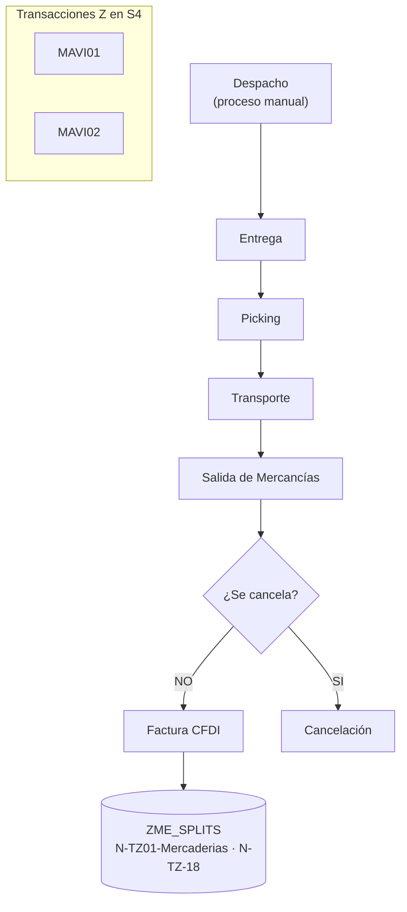

> [!warning] Nota específica de CeDis
> En estas dos diapositivas la advertencia dice literalmente "La **ND** Disminución de Monedero no contabiliza…", mientras el resto del mazo la llama **NC** Disminución de Monedero. Es probable una errata en el original; conviene confirmarla.

### 4.5 Venta contado con anticipo

**(diap. 90, dentro del bloque "Anticipos/Enganches")**

Titulada *Venta contado con Anticipo (Venta Contado con Despacho en Tienda 2)*. La particularidad está en la nota de cabecera:

> [!tip] Se envía la factura, no el pedido
> "Se envía desde el POS y **se recibe en CAR y S/4HANA la factura, no el pedido**".

| API | Efecto |
|---|---|
| [[SD01]] | Pedido → Tablas Z Venta Contado/Crédito |
| [[SD36]] | Consultar documentos |
| [[SD37]] | **Rechazar pedido** |
| [[PV01_CO03]] → [[CO03]] | Documento contable del anticipo, **referenciado al pedido** |
| [[PV02]] | Factura CFDI (ticket de venta) |
| [[SD43]] | Documento Contable (Anticipo) |

De nuevo la regla: *actualizar el número de la factura en el campo de asignación, se utilizará en la compensación*.

### 4.6 Modificación de estatus y anulación de ventas

**(diap. 37-38)**

Dos diapositivas gemelas. La primera cubre el caso *"Modifica estatus en documento (no se generó factura previamente)"*; la segunda es el **flujo general de APIs de anulación de ventas**.

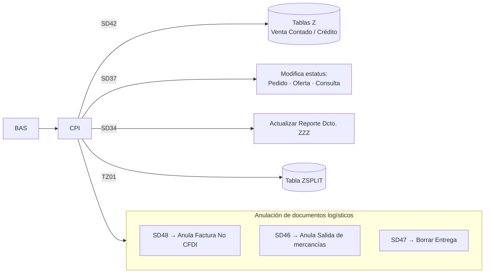

En la diapositiva 37 el flujo empieza con la pregunta **"¿Hay Enganche?"**: si la hay, [[PV01_EN01]] → [[EN01]] genera el documento contable de salida de dinero, y *"en la Salida de Dinero llenar el campo asignación con el folio del pedido"*. Después, [[SD37]] modifica el estatus del pedido, de la oferta y de la consulta, y [[SD42]] actualiza las Tablas Z de Venta Contado/Crédito.

> [!tip] Orden de anulación
> La anulación logística respeta el orden inverso al de creación: primero **anular factura** ([[SD48]]), luego **anular salida de mercancías** ([[SD46]]), después **borrar entrega** ([[SD47]]), y sólo entonces modificar el estatus de los documentos comerciales con [[SD37]].

---

## 5. Procesos periódicos: los JOBs de interés y moratorios

**(diap. 13-15, más diap. 78 para Mavicob)**

Tres desarrollos programados que corren sin intervención del POS. Viven íntegramente en BAS + S/4HANA (+ HANA Cloud para los catálogos), y su salida es siempre la **actualización de cada parcialidad** en la tabla `ZSPLIT` correspondiente.

### Facturación de intereses de mes vencido — [[ND-CRED-37]] (diap. 13)

JOB de fin de mes para Credilanas. Crea un **Pedido de Intereses Vencidos CFDI** y una **Factura de Intereses Vencidos CFDI-PPD**, y actualiza en cada parcialidad de [[ZPR_SPLITS]]:

- Importe Base Interés mes Vencido
- Importe Interés mes Vencido
- Fecha Interés mes Vencido
- Estado "Importe Interés vencido"

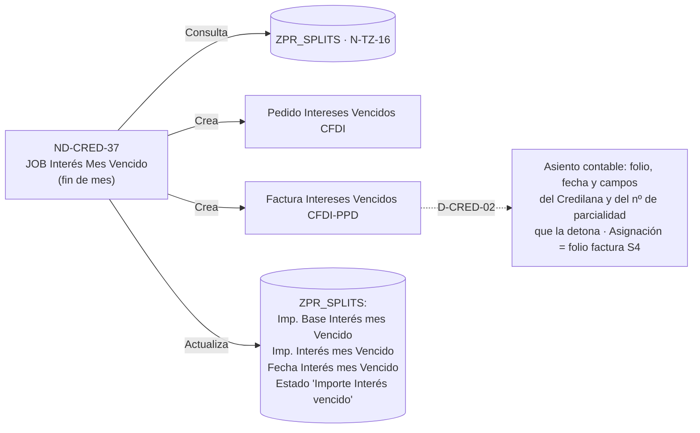

> [!warning] La factura de intereses **no afecta el estado de cuenta del cliente** y hay que *identificar el documento* para distinguirla.

### Moratorios diarios — [[ND-CRED-38]] (diap. 14-15)

JOB diario que cubre **Credilanas, Mercaderías y Débitos**. Consulta tres catálogos antes de calcular, cada uno con un propósito de exención distinto:

| Fuente consultada | Para qué |
|---|---|
| **Motivos de pedido** (HANA Cloud) | Identificar los **conceptos de Débitos exentos** de moratorio |
| Tabla estándar **[[KNA1]]**, campo **`KATR3` (CalculoMoratorio)** | Identificar los **BP exentos** de moratorio |
| Combinación **Canal de distribución / Organización de ventas** | Identificar cuáles son **exentas** de moratorio |

Y actualiza en cada parcialidad: *Importe Vencido, Importe Base Moratorio, Importe Moratorio, Fecha Moratorio* y el estado **"Parcialidad Vencida"**.

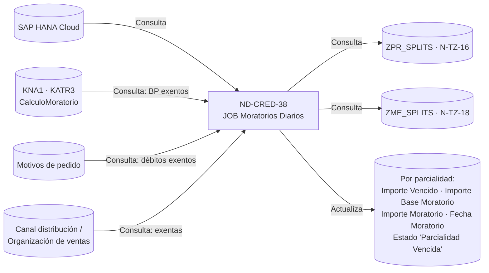

La diapositiva 14 aplica sobre [[ZPR_SPLITS]] (Credilanas, [[N-TZ-16]]) y la 15 sobre [[ZME_SPLITS]] (Mercaderías, [[N-TZ-18]]); son la misma lógica con distinta tabla destino.

### Moratorios diarios Mavicob — [[ND-CRED-39]] (diap. 78)

Idéntico al anterior pero opera sobre **[[ZMAVICOB_SPLITS]]** ([[N-TZ-19]]), es decir sobre la cartera ya quebrantada. Mismas tres consultas de exención y mismos campos actualizados.

---

## 6. Cobros

Cada línea de negocio tiene su propia arquitectura de cobro, pero todas comparten un patrón de dos diapositivas: una de **distribución del cobro** (qué partidas abiertas hay y contra qué se aplica) y otra u otras de **ejecución** (qué documentos se generan).

### 6.1 Cobros Credilanas

**(diap. 17-20)**

**Paso 1 — Distribución (diap. 17).** El POS consulta las **Formas de Pago** en HANA Cloud, pide las **partidas abiertas** con [[EX01]], lee las parcialidades con [[TZ01]] sobre [[ZPR_SPLITS]], consulta las bonificaciones con [[SD33]] sobre [[ZBonificaciones]], y opcionalmente ejecuta el **proceso de condonación de moratorios** con [[TZ05]] (actualiza la tabla Z de condonaciones) y [[TZ06]] (la muestra).

> [!tip] Requisito funcional de [[EX01]] — se repite en ~20 diapositivas
> "Exponga el **saldo real** de cada movimiento del cliente considerando los abonos que ya existen, **aunque no exista la compensación como tal**: lista explícita de los movimientos que tendrá la API (anticipos/enganches no aplicados, facturas con saldo, débitos con saldo, nota de crédito con saldo)". En la diapositiva 35 se añade: "**Además del valor del campo de asignación de cada uno de ellos**".

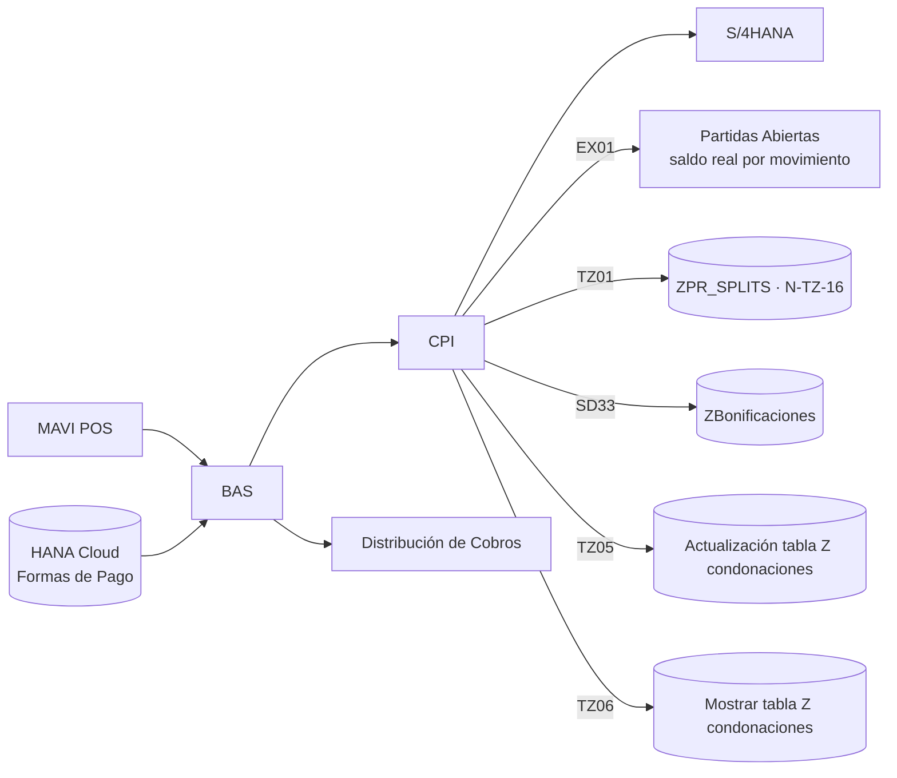

**Paso 2 — Cobro de moratorios y de parcialidad (diap. 18).**

| Interfaz POS→CAR | Transacción CAR→S4 | Documento |
|---|---|---|
| [[PV02_CM]] | [[PV02_CM-NC]] | (6A) **Nota de Cargo CFDI-PUE** |
| [[PV01_CM]] | [[CO07]] | Documento Contable |
| [[PV01_CP]] | [[CO01_CP]] | Documento Contable (cobro de parcialidad) |

[[TZ01]] actualiza después en [[ZPR_SPLITS]] el *importe de moratorios, remanente y fecha de pago*. [[D-CRED-02]] deja el **folio del Débito creado en S4 en el campo asignación**.

**Paso 3 — Intereses (diap. 19).** Se distinguen cuatro situaciones:

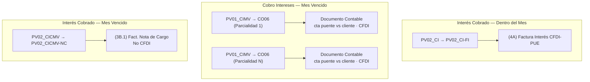

> [!tip] Tres reglas repetidas en los cobros de interés
> - Es el **cobro de la factura de intereses por parcialidad vencida**.
> - **Este cobro no mueve el monto de la caja** / *"No afecta control de caja"*.
> - **No afecta el estado de cuenta del cliente**; el documento debe poder identificarse.

**Paso 4 — Bonificaciones (diap. 20).** Un único mensaje desde BAS dispara tres transacciones:

> [!warning] "Se reciben de BAS **3 transacciones en 1 mensaje**"
> La API [[PV02_CB]] es un mensaje compuesto. Del lado de CAR/S4 se desdobla en tres documentos distintos.

| Sub-interfaz | Documento |
|---|---|
| [[PV02_CB-NCR-C]] | Nota de Crédito (**Bonificación Capital**) **CFDI** |
| [[PV02_CB-NCR-B]] | Nota de Crédito (**Bonificación Financiamiento**) **No CFDI** |
| [[PV02_CB-NC-B]] | Nota de Cargo (**Bonificación Financiamiento**) **No CFDI** |

Al cierre, [[TZ01]] actualiza [[ZPR_SPLITS]] y [[D-CRED-02]] actualiza el asiento contable con el folio, fecha y campos del Credilana y de la Nota de Cargo (Bonificación Financiamiento) No CFDI que la detona.

### 6.2 Cobros Seguros

**(diap. 22-23)**

El POS envía únicamente **Cobro POS, Cliente e Importe Pagado**. Además de [[EX01]] y de [[N-TZ01-Seguros]] sobre [[ZSE_SPLITS]], aparecen dos catálogos propios del ramo:

| API | Tabla | Nota |
|---|---|---|
| [[N-TZ-14]] | **[[ZTipoSeguros]]** | Delta: crear estructura y vista de mantenimiento ([[N-TZ-20]]) |
| [[N-TZ-15]] | **[[ZFactores]]** | Delta: crear estructura y vista de mantenimiento ([[N-TZ-21]]) |

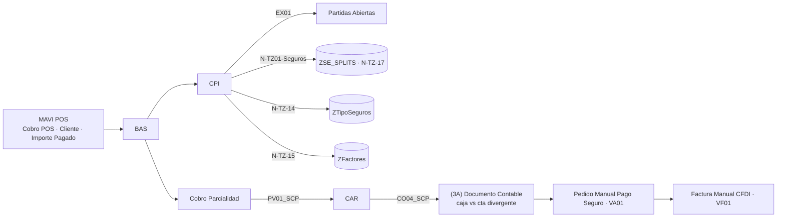

> [!warning] Dos pasos manuales en SAP
> El cobro de la parcialidad de seguros termina en **VA01** (pedido manual de pago de seguro) y **VF01** (factura manual CFDI). No están automatizados.

**Comisiones del seguro (diap. 23).** [[PV01_SCC]] → [[CO04_SCC]] genera el documento contable **(3B)**: *cuenta de orden vs ClubAsistencia, Ingresos, IVA, ChubSeguros*, **No CFDI**. Este cobro **no mueve el monto de la caja**, **no afecta el control de caja** y **no afecta el estado de cuenta del cliente**.

### 6.3 Cobros Mercaderías / Débito

**(diap. 25-26)**

Estructura calcada de Credilanas, cambiando tabla y códigos:

| Concepto | Credilanas | Mercaderías / Débito |
|---|---|---|
| Distribución | [[EX01]] + [[TZ01]] + [[SD33]] | [[EX01]] + [[N-TZ01-Mercaderias]] + [[SD33]] |
| Moratorios (comercial) | [[PV02_CM]] / [[PV02_CM-NC]] | [[PV02_MM]] / [[PV02_MM-NC]] |
| Moratorios (contable) | [[PV01_CM]] / [[CO07]] | [[PV01_MM]] / [[CO07]] |
| Cobro parcialidad | [[PV01_CP]] / [[CO01_CP]] | [[PV01_MCP]] / [[CO01_MCP]] |
| Bonificaciones | [[PV02_CB]] (3 en 1) | [[PV02_MB]] / [[PV02_MB-NCR-B]] |
| Tabla | [[ZPR_SPLITS]] | [[ZME_SPLITS]] |

En la diapositiva 26 aparece un elemento nuevo y sin numerar todavía:

> [!warning] API pendiente de código
> **API DetalleCobroMoratorios → Tabla [[Z_DetalleCobroMoratorios]]**, etiquetada sólo como `N-TZ-` (sin número). El índice del bloque de reversas la confirma como pendiente: *"Creación de nueva tabla Z para detalle de Cobro de Moratorios y poder generar las reversas de Cobros de Moratorios"*.

---

## 7. Devoluciones

### Devolución de Credilanas — cancelación de préstamo (diap. 28-29)

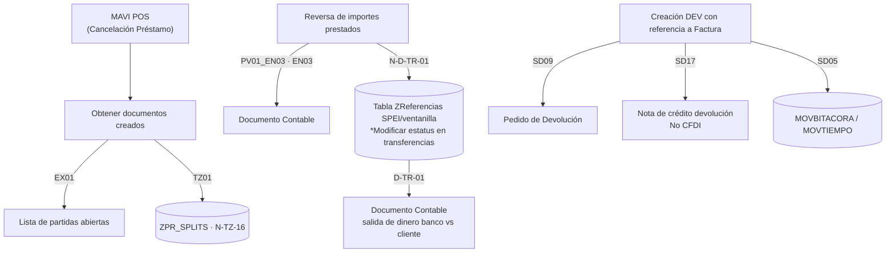

En la continuación (diap. 29):

| Paso | API | Documento |
|---|---|---|
| Creación de Nota de Cargo con referencia a la NC | [[SD11]] | Nota de Cargo **No CFDI** |
| Actualiza estatus de préstamo cancelado | [[TZ01]] | [[ZPR_SPLITS]] ([[N-TZ-16]]) |
| Cancelación de bonificación y monedero | [[SD20]] | NC Disminución de Monedero |

[[D-CRED-02]] deja en el campo asignación **el folio de la Nota de Crédito No CFDI a la que se le da reversa**.

### Devolución de mercaderías (diap. 35-36)

Primera diapositiva — la devolución propiamente dicha:

| API | Documento |
|---|---|
| [[SD08]] | Consulta de factura |
| [[SD09]] | Pedido de Devolución |
| [[SD10]] | **NC devolución CFDI** |
| [[SD05]] | [[MOVBITACORA]] / [[MOVTIEMPO]] |
| [[EX01]] | Partidas Abiertas (con campo de asignación) |
| [[SD34]] | Actualizar Reporte Dcto. ZZZ |
| [[SD20]] / [[SD32]] | NC Disminución / ND Aumento de Monedero |
| [[N-TZ01-Mercaderias]] | [[ZME_SPLITS]] ([[N-TZ-18]]) |

Segunda diapositiva (36) — **el remanente de saldo**, que es el escenario más elaborado de todo el mazo:

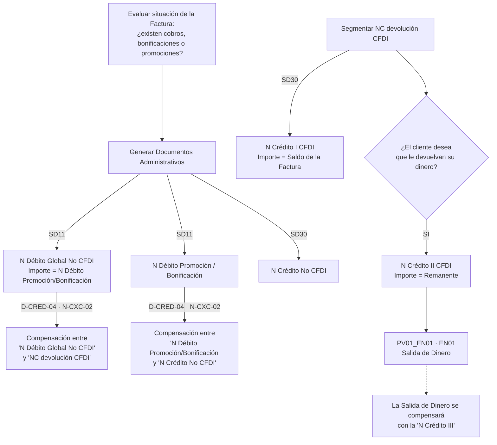

> [!warning] Trazabilidad obligatoria del origen
> "En los movimientos administrativos y en las segmentaciones de la Nota de Crédito **debe conocerse la NC devolución CFDI que les dio origen**."

> [!warning] Inconsistencia detectada en el original
> El diagrama nombra "N Crédito I" y "N Crédito II", pero la nota al pie de la salida de dinero habla de compensar contra **"N Crédito III"**, que no aparece dibujada. O falta un documento en el diagrama o la nota arrastra una numeración anterior.

---

## 8. Temas varios

A partir de la diapositiva 39 ("Temas Varios") el mazo abre un segundo índice (diap. 40) con once temas: *Cobros Referenciados, Convenio RD, Adjudicaciones, Notas Cargo/Crédito Espejo, Notas Cargo/Crédito S4, Quebrantos (MAVICOB), Condiciones de Pago, Fondeo de Caja, Anticipos/Enganches, Consulta de Datos y Réplica por SLT*.

### 8.1 Cobros referenciados y la tabla ZREFERENCIA

**(diap. 41-55)**

El cobro referenciado nace fuera de la tienda: el cliente paga en banco o por la **APP**, y el sistema tiene que casar ese depósito con su cartera. La diapositiva 41 define el esqueleto y siembra cinco marcadores de continuidad —**A, B, C, D, E**— que reaparecen en las diapositivas siguientes.

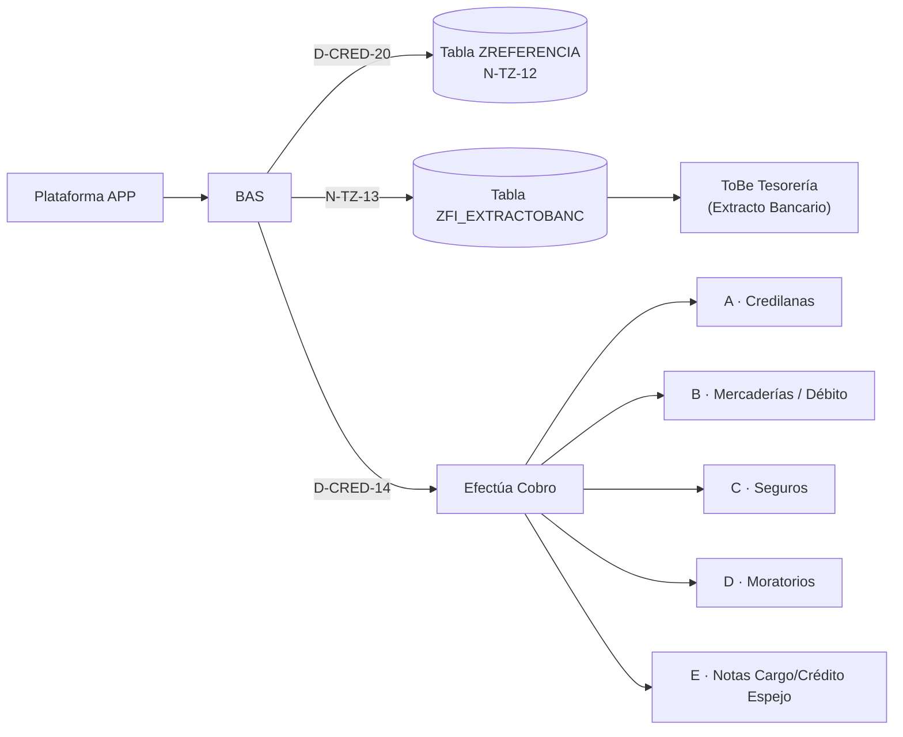

| Marcador | Diapositiva de continuación | Escenario |
|---|---|---|
| **A** | 45-47 | Cobros Referenciados Credilanas |
| **B** | 49 | Cobros Referenciados Mercaderías / Débito |
| **C** | 51-52 | Cobros Referenciados Seguros |
| **D** | 42-43 | Cobros Referenciados — Moratorios (Credilanas y Mercaderías) |
| **E** | 54-55 | Cobros Referenciados Notas Cargo/Crédito Espejo |

**La pieza que distingue al cobro referenciado es [[N-CXC-01]]**: escribe en la **[[ZREFERENCIA]]** el folio y la fecha del cobro emitido en S4H, de forma que el POS pueda reconciliar.

> [!tip] Qué hace [[N-CXC-01]] según el escenario
> - Moratorios (diap. 42-43): *"Actualizar el folio del cobro emitido en S4H"*.
> - Credilanas (diap. 46): *"Actualiza fecha y folio interno asignado a los diferentes Cobros emitidos en S4"*.
> - Mercaderías (diap. 49): *"Actualiza folio del cobro en POS, fecha"*.

Los documentos que se generan son los mismos que en el cobro presencial ([[PV02_CM]]/[[PV02_CM-NC]] → Nota de Cargo CFDI; [[PV01_CM]]/[[CO07]] → documento contable; [[PV01_CP]]/[[CO01_CP]] → cobro de parcialidad; [[PV02_CI]]/[[PV02_CI-FI]] → factura de interés CFDI-PUE; [[PV02_CB]] → bonificaciones 3-en-1). La diferencia es el paso extra de [[N-CXC-01]] y que *"afecta cuenta de banco, BP"*.

**Notas Cargo/Crédito Espejo referenciadas (diap. 54-55).** Introduce [[PV02_CP-ES]] / [[PV02_CP-ESNC]] que crean una **Nota de Cargo CFDI**, y exige registrar dos datos:

> [!warning] Campos a identificar (diap. 54)
> "Identificar campo para registrar: **Folio de la Nota Débito (monto global) No CFDI** y **Folio interno asignado a los diferentes cobros emitidos en S4**."

La compensación (diap. 55) se detalla en [[#8.4 Notas de Cargo / Crédito Espejo]], porque es idéntica a la del escenario no referenciado.

### 8.2 Convenio RD

**(diap. 57 Credilanas, diap. 59 Mercaderías)**

Convenio de reestructura: se emite una nota de crédito que hay que **distribuir** entre capital, financiamiento e intereses.

> [!warning] "Se reciben de BAS, **4 transacciones en 1 mensaje**"
> [[PV02_C-NCR]] es un mensaje compuesto de cuatro documentos.

| Sub-interfaz | Documento | Nota |
|---|---|---|
| [[PV02_C-NCR-C]] | Nota de Crédito (**Bonificación Capital**) CFDI | |
| [[PV02_C-NCR-F]] | Nota de Crédito (**Bonificación Financiamiento**) No CFDI | Cancelar factura PPD que tenga parcialidades |
| [[PV02_C-NCR-IC]] | Nota de Crédito (**Intereses por Cobrar**) CFDI | Identificar documento; no afecta estado de cuenta |
| [[PV02_C-NCR-CIC]] | Nota de Cargo (**Intereses por Cobrar**) No CFDI | Cancelar interés mes vencido; no afecta estado de cuenta |

Consulta **Motivos de pedido** en HANA Cloud y [[DM01]] para los **datos maestros de artículos (no inventariables)**. [[TZ01]] escribe [[ZPR_SPLITS]] antes y después.

> [!tip] Nota de diseño que aparece en las dos diapositivas
> "Este escenario **crea una nueva factura**, por tanto se utilizarán los escenarios de ventas definidos en la nueva arquitectura. **La factura de mercadería utilizará artículos no inventariables**."

La versión de Mercaderías (diap. 59) es mucho más simple: [[PV02_M-NCR]] → [[PV02_M-NCR-FI]] genera una única **Nota de Crédito CFDI**, con [[N-TZ01-Mercaderias]] sobre [[ZME_SPLITS]] antes y después.

### 8.3 Adjudicaciones

**(diap. 61-64)**

Adjudicación = recuperación de mercancía que se reingresa al inventario y se aplica como cobro.

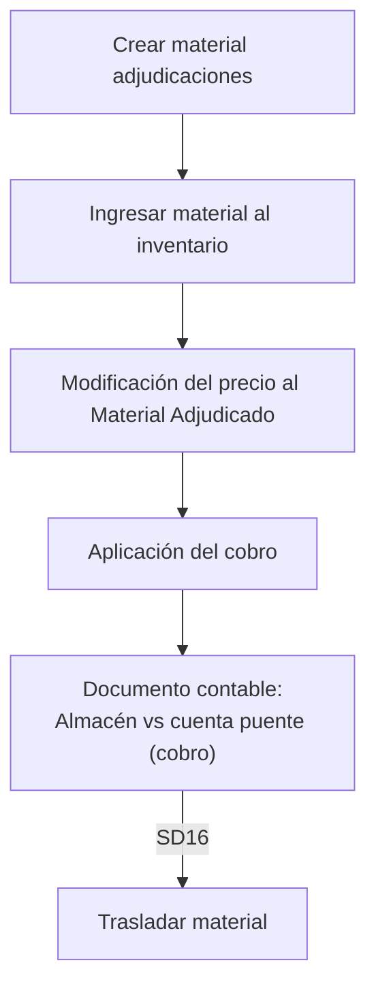

El cobro por adjudicación (diap. 62-64) reutiliza [[PV01_CP]]/[[CO01_CP]], [[PV02_CI]]/[[PV02_CI-FI]], [[PV01_CIMV]]/[[CO06]] y [[PV02_CICMV]]/[[PV02_CICMV-NC]], con **partidas segmentadas por parcialidades**, pero con una marca contable propia:

> [!tip] Clase de movimiento **AD01**
> Los cobros por adjudicación llevan `Clase movimiento: AD01` y **no afectan el control de caja**; "este cobro no mueve el monto de la caja".

Al cierre, [[TZ01]] actualiza en [[ZPR_SPLITS]]: **Cobro, Saldo y Estatus: "Adjudicado"**. Nota adicional: *"Se crea cobro por parcialidad vencida"*. La versión Mercaderías (diap. 64) usa [[N-TZ01-Mercaderias]] sobre [[ZME_SPLITS]].

### 8.4 Notas de Cargo / Crédito Espejo

**(diap. 66-70)**

El escenario "espejo" resuelve los documentos capturados **manualmente en S4** que necesitan una contraparte para no descuadrar la cartera.

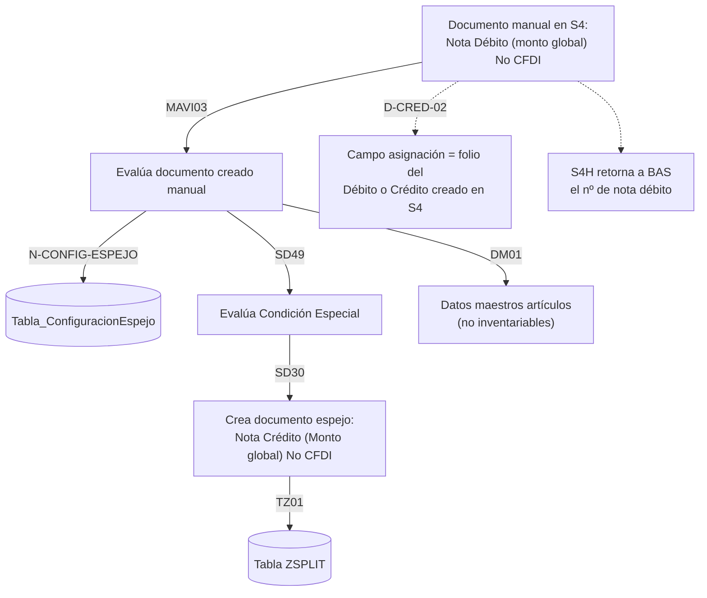

> [!warning] Campo a habilitar
> "Identificar campo para registrar el **folio de la Nota Débito (monto global) No CFDI**" en el documento espejo. Sin ese campo, la pareja no se puede reconstruir.

**La compensación (diap. 69, idéntica a la 55 y a la 123/126 en reversas)** es la parte más delicada. Se generan documentos administrativos y se ejecutan **dos compensaciones**:

| Paso | API | Documento / efecto |
|---|---|---|
| Documentos administrativos | [[SD11]] | **Nota Débito Admva. No CFDI** — *Importe = Nota Crédito (Monto global) No CFDI* |
| | [[SD30]] | **Nota Crédito Admva. No CFDI** — *Importe = Nota Débito CFDI (reconocer ingreso)* |
| | [[SD30]] | **Nota Crédito No CFDI** — el **remanente** de la "Nota Crédito (Monto global) No CFDI" |
| Compensar | [[N-CXC-02]] + [[D-CRED-04]] | **Compensación 1**: "N Débito Admva No CFDI" ↔ "Nota Crédito (Monto global) No CFDI" |
| | | **Compensación 2**: "Nota Débito CFDI (reconocer ingreso)" ↔ "N Crédito Admva. No CFDI" |

> [!tip] Regla del remanente — la más importante del escenario espejo
> "Remanente de la 'Nota Crédito (Monto global) No CFDI': **debe identificarse que esta transacción es ahora la nueva pareja o espejo de la 'Nota Débito (monto global) No CFDI'**." El espejo se re-apunta al remanente, no se cierra.

**Compensación manual desde S4 — [[ND-CRED-40]] (diap. 70).** Cuando el usuario compensa a mano en S4:

1. Se **evalúa si la Nota Débito existe en ZSplits** (transacción `MAVI05`, con [[TZ01]] leyendo la tabla ZSPLIT).
2. **Captura manual**: a la "Nota Crédito (Monto global) No CFDI" se le captura **en el campo de asignación el folio de la Nota Débito (monto global) No CFDI**.
3. Se **genera la compensación** entre ambas.
4. **S4H informa a BAS** la compensación entre los dos movimientos espejo.
5. Se **actualizan los saldos de las parcialidades** ([[TZ01]] → ZSPLIT).

### 8.5 Notas de Cargo y Crédito creadas en S4

**(diap. 72-75)**

Escenario en el que el documento se origina dentro de S/4HANA y hay que propagarlo hacia BAS/POS y hacia las parcialidades.

> [!warning] Requisito del sistema origen (diap. 73 y 74)
> "El sistema origen que mande a crear la nota de débito/crédito **deberá enviar la clase de documento** para que se identifique **cuándo será CFDI y cuándo No CFDI**."

**Notas de Cargo en S4 — Mercaderías/Débitos/Credilanas/Seguros Vida (diap. 73)**

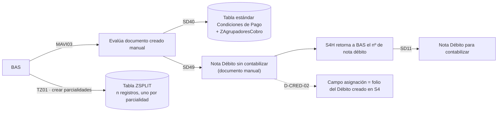

**Notas de Crédito en S4 — Mercaderías/Débitos/Seguros Vida (diap. 74).** Simétrico: `MAVI04` evalúa, [[SD49]] crea la **Nota Crédito sin contabilizar**, S4H retorna el número a BAS, [[SD30]] la convierte en **Nota Crédito para contabilizar**, y [[TZ01]] distribuye el importe actualizando parcialidades en la tabla ZSPLIT.

**Cancelación de Seguros de Vida (diap. 75).** Anulación del seguro → consulta de parcialidades con [[N-TZ01-Seguros]] sobre [[ZSE_SPLITS]] → [[SD30]] emite **Nota Crédito (No CFDI)** → se distribuye el importe y se actualizan parcialidades ([[N-TZ-17]]).

### 8.6 Quebrantos (MAVICOB)

**(diap. 77-84)**

MAVICOB es el proceso de cartera incobrable. Se subdivide en *Cuentas incobrables* y *Reactivación de cuenta incobrable*.

**Identificación y marcado (diap. 79).** Proceso íntegramente dentro de S/4HANA: consultar parcialidades sobre la tabla ZSPLIT → mostrar parcialidades → **autorización de parcialidades a quebrantar** → **marcar parcialidades quebrantadas** → asignar **motivos operativos**.

> [!tip] Criterio de copia a la tabla Mavicob
> "Los splits con **conceptos operativos como 'Mavicob'** son los que se copiarán de la tabla `zsplit` a la tabla `zsplit mavicob`."

**Generación de notas — Credilanas (diap. 80).** Un mensaje [[PV02_CMCOB-INC]] con **3 transacciones**:

| Sub-interfaz | Documento |
|---|---|
| [[PV02_CMCOB-INC-NC]] | **Nota de Crédito No CFDI** |
| [[PV02_CMCOB-INC-NDCFDI]] | **Nota de Cargo (intereses x cobrar) CFDI** |
| [[PV02_CMCOB-INC-NCCFDI]] | **Nota de Crédito (intereses x cobrar) CFDI** |

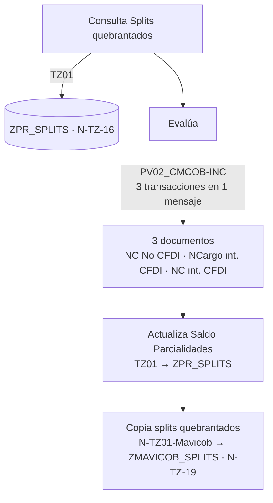

> [!warning] Campo de cabecera obligatorio
> "Identificar campo **en la cabecera del documento** para que se registre el **concepto operativo del quebranto**."

**Generación de notas — Mercaderías/Débitos (diap. 81).** Sólo una transacción: [[PV02_MMCOB-INC]] → [[PV02_MMCOB-INC-NC]] → **Nota de Crédito No CFDI o CFDI**, seguida de actualización de saldo y copia de splits a [[ZMAVICOB_SPLITS]].

**Reactivación de cuentas incobrables (diap. 83-84).** Cuando el cliente vuelve a pagar cartera quebrantada:

| Interfaz | Documento |
|---|---|
| [[PV02_CM]] / [[PV02_CM-NC]] | Nota de Cargo CFDI (moratorios) |
| [[PV01_CM]] / [[CO07]] | Documento Contable |
| [[PV02_CR-OI]] / [[PV02_CR-FI]] | Nota de Cargo (**Ctas Reserva**) No CFDI |
| [[PV02_COI-FI]] | Nota de Cargo (**Otros ingresos**) CFDI |
| [[PV01_CP]] / [[CO01_CP]] | Documento Contable (cobro de parcialidad) |

> [!tip] Regla de asociación del quebranto
> "Las **3 Notas de Cargo deben estar asociadas a la recuperación del quebranto**: colocar el **folio de la factura quebrantada**."

La distribución del cobro reutiliza el bloque de condonación de moratorios ([[TZ05]] / [[TZ06]]) y escribe en [[ZMAVICOB_SPLITS]] vía [[N-TZ01-Mavicob]] ([[N-TZ-19]]).

### 8.7 Condiciones de pago y días de gracia

**(diap. 86)**

Proceso **diario** que recalcula fechas de vencimiento.

```mermaid
flowchart LR
  POS["MAVI POS"] --> BAS
  BAS --> CPI --> S4
  CPI -->|SD40| TCP[("Tabla Estándar<br/>Condiciones de Pago")]
  BAS --> CAL["Cálculo de días de gracia,<br/>actualización de fechas de vencimiento<br/>(ejecutar diario)"]
  CAL -->|SD40.1 · D-CRED-30| ZAG[("Tabla ZAgrupadoresCobro")]
```

> [!warning] Delta de datos
> "En la tabla Z se agregarán **campos requeridos para este escenario**" — la [[ZAgrupadoresCobro]] no está completa todavía.

### 8.8 Fondeo de caja

**(diap. 88)**

Dos desarrollos nuevos conectan el POS con el libro de caja de S/4HANA vía CPI:

| Desarrollo | Función |
|---|---|
| [[ND-CAJA-01]] | Expone **Libro de caja/Centro, Saldo, Responsable/Caja** y genera **Partidas Contables (+/-) por Tienda** |
| [[ND-CAJA-02]] | Fondeo del **Libro de Caja 1 a N**, con **Responsable de A a N** |

> [!warning] Delta pendiente
> "Delta para **complementar datos en el documento contable**" en [[ND-CAJA-01]].

### 8.9 Consulta de datos: las APIs de lectura

**(diap. 92-93)**

Bloque puramente de exposición POS ← CPI ← CAR ← S/4HANA. Todas siguen el mismo patrón de tres columnas: *consulta desde POS → exposición en CPI → exposición desde S4*.

| API | Qué expone |
|---|---|
| [[BP05]] | Información de **BP** (interlocutor comercial) hacia el POS |
| [[BP02]] | **Modificación de Cliente** desde el POS |
| [[SD33]] | **Bonificaciones** |
| [[SD23]] | **Promociones** |
| [[SD29]] | **Lista de Precios** — tabla **[[ProperListaFinal]]** |
| [[SD40]] | **Tabla estándar de Condiciones de Pago** *con sus datos complementarios existentes en la tabla [[ZAgrupadoresCobro]]* |
| [[SD39]] | Catálogo de **Canales de Distribución** |
| [[SD38]] | Catálogo de **Organizaciones de Ventas** |
| [[D-SD-MON-02]] | **Campaña de monedero** |
| [[DM01]] | **Datos maestros de artículos no inventariables** |

> [!warning] Decisión abierta sobre el monedero
> Para [[D-SD-MON-02]] la diapositiva plantea la alternativa sin resolverla: *"**Ampliar módulo de contrato de condiciones de S4 o desarrollar pantalla de captura Z completamente**"*.

> [!warning] Diapositiva 93 con contenido superpuesto
> En el volcado, tres bloques de la diapositiva 93 comparten exactamente las mismas coordenadas `(17,31)`, `(81,31)` y `(43,31)`: catálogo de organizaciones de ventas, campaña de monedero y datos maestros de artículos. Son elementos apilados (probablemente animaciones o capas superpuestas). El orden real de lectura no se puede determinar del texto extraído.

### 8.10 Réplica por SLT

**(diap. 95-97)**

Tres tablas estándar se replican de S/4HANA a **SAP HANA Cloud** mediante la *replication tool* de **CAR-SLT**, para que BAS y el POS las consulten sin golpear el core.

| Desarrollo | Tabla estándar | Contenido | Se usa para crear |
|---|---|---|---|
| [[N-D-SLT05]] | **[[TVAUT]]** | Motivos de pedido | Notas de Débito, Notas de Crédito, Aumentos de Monedero, Disminuciones de Monedero |
| [[N-D-SLT06]] | **[[TVAGT]]** | Motivos de rechazo | Consulta, Oferta, Pedidos |
| (sin código) | `/POSDW/FITG`, `/POSDW/FITY`, `/POSDW/FITYT` | Formas de pago | Cobros |

```mermaid
flowchart LR
  S4["SAP S/4HANA"] -->|N-D-SLT05 · TVAUT| RT["Replication tool<br/>CAR-SLT"]
  S4 -->|N-D-SLT06 · TVAGT| RT
  S4 -->|/POSDW/FITG · /POSDW/FITY · /POSDW/FITYT| RT
  RT --> HC[("SAP HANA Cloud")]
  HC --> MP["Motivos de pedido"]
  HC --> MR["Motivos de rechazo"]
  HC --> FP["Formas de pago"]
```

> [!tip] Requisito sobre los motivos de pedido
> "Se requiere que en el catálogo **se identifiquen cuáles son los motivos de pedido exentos para el cálculo de moratorios**" — es el catálogo que consumen [[ND-CRED-38]] y [[ND-CRED-39]].

> [!info] Referencia cruzada
> "En la EF de la **PV08** se encuentra documentada las tablas que se replicaron a HANA Cloud."

### 8.11 Consideraciones formales (diap. 98)

Ya cubierta en [[#2. Convención de tablas ZSPLIT (la regla maestra)]]: la equivalencia ZSPLIT ↔ tabla real por escenario, y el alcance de [[N-SD-CON-04]] / [[D-SD-CON-04]] para los 14 formatos de impresión.

---

## 9. Bloque Reversas

**(diap. 99-151)**

A partir de la diapositiva 99 ("Reversas") el mazo **repite todo el catálogo anterior en versión inversa**. El índice de este bloque (diap. 100, repetido en 13 diapositivas separadoras) lista 27 escenarios.

> [!tip] Principio de simetría
> Las diapositivas de reversa son **espejo exacto** de las de cobro: **mismos códigos de API**, misma secuencia de capas, y el documento se invierte —donde el cobro genera una Nota de Cargo, la reversa genera una Nota de Crédito, y viceversa—. La mayoría añade la marca **`*Reversa Banco`** en el documento contable.

| Escenario | Cobro | Reversa | Inversión del documento |
|---|---|---|---|
| Moratorios Credilanas | diap. 18 | diap. 31 | Nota de Cargo CFDI → **Nota de Crédito CFDI** |
| Intereses dentro del mes | diap. 19 | diap. 31 | Fact. Interés CFDI-PUE → **Nota Crédito Interés CFDI-PUE** ([[PV02_CI-R]] / [[PV02_CI-FI-R]]) |
| Intereses mes vencido | diap. 19 | diap. 32 | Fact. Nota de Cargo No CFDI → **Fact. Nota Crédito No CFDI** ([[PV02_CICMV-R]] / [[PV02_CICMV-NCR-R]]) |
| Bonificaciones Credilanas | diap. 20 | diap. 33 | NC Bonif. Capital CFDI → **Nota de Cargo (Bonif. Capital) CFDI**; y las dos de financiamiento se cruzan ([[PV02_CB-R]], [[PV02_CB-NCR-C-R]], [[PV02_CB-NC-B-R]], [[PV02_CB-NCR-B-R]]) |
| Cobros Seguros | diap. 22-23 | diap. 101-102 | Documento contable **cta divergente vs caja** (invertido) |
| Cobros Mercaderías/Débito | diap. 25-26 | diap. 104-105 | Nota de Cargo CFDI → **Nota de Crédito CFDI** |
| Cobros referenciados (ZREFERENCIA) | diap. 41 | diap. 107 | "**Reversar** Importe pagado en Banco" / "**Reversar** Cobro" |
| Referenciados moratorios | diap. 42-43 | diap. 109-110 | [[N-CXC-01]] "Actualizar el **folio de Reversa** del cobro emitido en S4H" |
| Referenciados Credilanas | diap. 45-47 | diap. 112-114 | **No se requiere [[N-CXC-01]]** (así lo dice el propio título) |
| Referenciados Mercaderías | diap. 49 | diap. 116 | [[N-CXC-01]] "Actualiza folio de la **reversa** del cobro en POS, fecha" |
| Referenciados Seguros | diap. 51-52 | diap. 118-119 | Documento 3B invertido: *ClubAsistencia, Ingresos, IVA, ChubSeguros **vs** cta orden* |
| Notas Cargo/Crédito Espejo | diap. 67-69 | diap. 121-123 | [[SD30]] ↔ [[SD11]] intercambian papeles: se **reversan documentos administrativos** |
| Referenciados Espejo | diap. 54-55 | diap. 125-126 | Nota de Cargo CFDI → **Nota de Crédito CFDI** |
| Convenio RD Credilanas | diap. 57 | diap. 128 | Las 4 notas se invierten (Crédito↔Cargo) |
| Convenio RD Mercaderías | diap. 59 | diap. 130 | Nota de Crédito CFDI → **Nota de Cargo CFDI** |
| Adjudicaciones Credilanas | diap. 62-63 | diap. 132-133 | |
| Adjudicaciones Mercaderías | diap. 64 | diap. 135 | |
| Notas Crédito en S4 Credilanas | diap. 72 | diap. 137 | |
| Notas Cargo en S4 | diap. 73 | diap. 139 | [[SD49]] crea **Nota Crédito (R) sin contabilizar** → [[SD30]] **para contabilizar** |
| Notas Crédito en S4 | diap. 74 | diap. 141 | [[SD49]] crea **Nota Cargo sin contabilizar** → [[SD11]] **para contabilizar** |
| Cancelación Seguros de Vida | diap. 75 | diap. 143 | [[SD30]] Nota Crédito No CFDI → [[SD11]] **Nota Débito No CFDI** |
| Mavicob incobrables Credilanas | diap. 80 | diap. 145 | "**Reversa del Quebranto**"; **Elimina** splits quebrantados; "Actualiza **y Activa** Saldo Parcialidades" |
| Mavicob incobrables Mercaderías | diap. 81 | diap. 147 | "**Reverso del Quebranto**"; **Elimina** splits quebrantados |
| Mavicob reactivación | diap. 83-84 | diap. 149-150 | "Proceso **reversa** de condonación moratorios"; las Notas de Cargo pasan a **Notas de Crédito** |

```mermaid
flowchart LR
  subgraph COBRO["Cobro (p. ej. moratorios Credilanas · diap. 18)"]
    A1["PV02_CM → PV02_CM-NC"] --> A2["Nota de Cargo CFDI"]
    A3["PV01_CM → CO07"] --> A4["Documento Contable"]
  end
  subgraph REVERSA["Reversa (diap. 31)"]
    B1["PV02_CM-R → PV02_CM-NCR-R"] --> B2["Nota de Crédito CFDI"]
    B3["PV01_CM → CO07"] --> B4["Documento Contable<br/>*Reversa Banco"]
  end
  COBRO -.espejo.-> REVERSA
  B2 --> Z[("TZ01 → ZPR_SPLITS<br/>Actualiza importe por reversa moratorios")]
```

> [!warning] Anotación de trabajo pendiente encontrada en la diapositiva 33
> Aparece la etiqueta suelta **"Cambiar orden"** dentro del diagrama de reversa de bonificaciones. Es una nota del autor: el orden de las tres transacciones del mensaje compuesto [[PV02_CB-R]] estaba en revisión cuando se generó la versión v060325.

> [!warning] Reversa de moratorios: depende de una tabla que no existe todavía
> Las diapositivas 104-105 muestran la **API DetalleCobroMoratorios** → tabla **[[Z_DetalleCobroMoratorios]]** como la pieza que hace posible reversar cobros de moratorios, pero el código de API sigue en blanco y el índice de reversas la lista como pendiente de creación.

---

## 10. Escenarios To-Be de caja, tesorería y proveedores

**(diap. 152-176)**

El último tramo cambia de estilo: son diagramas "To Be" de procesos de tienda que no pasan por el modelo POS→BAS→CPI→CAR→S4, sino que entran a S/4HANA por **IDocs `WPUFIB` (Movimiento Financiero)** y se resuelven con **CXP / Tesorería**. Cada escenario viene acompañado de su reversa.

### Remesas — Envío de Dinero (diap. 153) y su reversa (diap. 155)

```mermaid
flowchart LR
  POS["POS · Tipo Servicio: Remesas"] --> SR["Solicitud de registro<br/>para Proveedor<br/>(actividad del cajero)"]
  SR --> URL["URL PROVEEDOR"]
  POS -->|RE01 vía CPI| TZ[("Tabla Z Registros<br/>Información de referencias e importes")]
  POS -->|RE02 vía CPI| ED["Envío Dinero<br/>*Ingreso a Caja"]
  ED --> CAR
  CAR --> ID1["IDocs de Entrada<br/>WPUFIB Movimiento Financiero"]
  ID1 --> NC["Nota Cargo Proveedor"]
  NC --> FI["Documento FI"]
  CAR --> ID2["IDocs de Entrada<br/>WPUFIB MF 1"]
  ID2 --> IC["Ingreso dinero a Caja"]
  IC --> FI2["Documento FI"]
  NC --> CMP["Compensación"]
```

> [!tip] Compensación automática de proveedor
> "Se podrá realizar compensación de **Notas de Cargo y Crédito para el proveedor** llamando las partidas abiertas automáticamente, que originan movimientos ya sea de cargo o crédito."

En la reversa (diap. 155) la interfaz se llama **[[PV01-RE02_RE03]]** ("Reversa Envío y Pago de Dinero"), el documento pasa a **Nota Crédito Proveedor** y el movimiento de caja se invierte a **Egreso de Caja**.

### Remesas — Pago de Dinero (diap. 158) y su reversa (diap. 160)

Simétrico al anterior, con **[[RE03]]** en lugar de [[RE02]]: genera **Nota Crédito Proveedor**, **Egreso de Caja** y **Salida de Dinero**. La reversa (diap. 160) produce **Nota Cargo Proveedor** y **Entrada de Dinero**.

### Pago de Servicios (diap. 163) y su reversa (diap. 165)

```mermaid
flowchart LR
  POS["POS · Pago de Servicios Referenciados<br/>Efectivo / T. Débito"] -->|CO05 vía CPI| CAR
  CAR --> ID["IDocs de Entrada<br/>WPUFIB Movimiento Financiero"]
  ID --> CXP["CXP Proveedor Datalogic"]
  CXP --> PP["Propuestas de Pago<br/>*Ejecución Manual"]
  CXP --> FI["Documento FI"]
  CAR --> ID2["WPUFIB MF 1"] --> IC["Ingreso dinero a Caja"] --> FI2["Documento FI"]
  POS -->|TZ04 vía CPI| DL[("Tabla Z<br/>Información Datalogic")]
  POS --> TK["TICKET AL CLIENTE"]
```

Notas propias del escenario: *"Pago de servicios **con referencia a Ticket**"*, *"**El BP lo enviaría el POS**"* y *"Propuestas de Pago: **Ejecución Manual**"*. La reversa (diap. 165) usa [[PV01_CO05]], genera **Nota de Crédito Proveedor Datalogic** y **Salida de dinero de Caja**.

### Anticipo a Empleado / Factura de Gastos de Empleado (diap. 168) y su reversa (diap. 170)

Único escenario del mazo íntegramente manual dentro de S/4HANA.

```mermaid
flowchart TD
  A["Solicitud Anticipo Financiero Empleado<br/>(Ejecución Manual)"] --> B["Registro Estadístico"]
  B --> PP["Propuesta de Pago<br/>*Una por cada solicitud de anticipo"]
  PP --> RC1["Reporte Cartera Empleados<br/>(Registro de Anticipos)"]
  C["Factura Financiera Gastos Empleado<br/>(Ejecución Manual)"] --> FI["Documento FI"]
  FI --> RC2["Reporte Cartera Empleados<br/>(Facturas No Compensadas)"]
  C --> COL["Colocación:<br/>RFC Proveedor<br/>Campo UUID por cada línea de gasto"]
  C --> Q{"¿Entrada Material?"}
  Q -->|Si| EM["Entrada material sin referencia a OC<br/>(MM Logístico)"]
  Q -->|No| FIN["Fin"]
```

> [!warning] Cuatro validaciones obligatorias del UUID
> 1. Validación de que el **UUID exista en el Portal de Proveedores**.
> 2. **Existirán conceptos de registros que no lleven UUID**.
> 3. Validación para que **se registre el UUID una sola vez** en la factura.
> 4. Validación de **importe menor o igual al CFDI**.

La reversa (diap. 170) es *Devolución de dinero a empresa* + **Nota de Crédito Financiera Gastos Empleado**, con *Anulación de entrada de material sin referencia a OC* si la hubo.

### Corrección de sobrante de caja por error de captura (diap. 172) y su reverso (diap. 173)

Flujo corto: POS → BAS → CAR → S4 mediante **[[PV01_CSCE]]** → **[[CSCE]]**, que genera **Documentos FI Banco Virtual / Caja** (y en el reverso, **Caja / Banco Virtual**).

> [!info] Desarrollo de apoyo
> "[[D-CXCCAR-08]]: transacción que ayuda al usuario a generar **depósitos y/o reversos correcciones de sobrantes**."

### Seguimiento de faltante de caja — CI04 (diap. 175) y su reverso (diap. 176)

```mermaid
flowchart TD
  T["Tienda X / Caja Y<br/>Corte de Caja y Cierre de Turno"] --> TZ[("*Tabla Z Diferencias Corte")]
  TZ -->|CI02| EXP["Expo movimientos diferencias caja<br/>→ Exposición hacia el POS"]
  TZ -->|CI03| REP["Expo Reporte CORTE DE CAJA"]
  T --> AUD["Se audita el corte de caja<br/>con un faltante"]
  AUD --> Q{"¿Se cobra el faltante?"}
  Q -->|SI| CD["Generar Cobro Dif Caja<br/>CI04 · Mov. Financiero Faltante Caja"]
  Q -->|NO| CC["Generar Canc Dif Caja<br/>CI04 · Mov. Financiero Faltante Caja"]
  CD --> W1["IDocs de Entrada · WPUFIB"] --> F1["Documento FI<br/>Bancos / Diferencia Depósito"]
  CC --> W2["IDocs de Entrada · WPUFIB"] --> F2["Documento FI<br/>Gastos / Diferencia Depósito"]
```

> [!warning] Dos decisiones abiertas en este escenario
> - "Las interfaces **CI02 y CI03** pueden realizarse por medio del consumo de una **Z API o una conexión directa a la base de datos ODBC**." — la opción no está cerrada.
> - "**El desarrollo, lógica y mantenimiento es responsabilidad del POS**." El desarrollo de los movimientos financieros, en cambio, es **desarrollo en CAR**.

El reverso (diap. 176) usa **[[PV01_CI04]]** para *reverso Cobro Dif Caja* y *reverso Canc Dif Caja*.

---

## 11. Catálogo maestro de APIs

### APIs SD — Ventas y Distribución (S/4HANA vía CPI)

| Código | Función | Diapositivas |
|---|---|---|
| [[SD01]] | Crear **Pedido** | 3-6, 8, 10, 90 |
| [[SD02]] | Despacho CeDis (paso logístico) | 10 |
| [[SD03]] | **Consulta** | 3-6, 8, 10 |
| [[SD04]] | **Oferta** | 3-6, 8, 10 |
| [[SD05]] | Registro en [[MOVBITACORA]] / [[MOVTIEMPO]] | 3-6, 28, 35 |
| [[SD06]] | **Entrega → Salida de Mercancías → Factura CFDI** | 6, 8 |
| [[SD08]] | **Consulta de factura** | 35 |
| [[SD09]] | **Pedido de Devolución** | 28, 35 |
| [[SD10]] | **NC devolución CFDI** | 35 |
| [[SD11]] | **Nota de Débito / Nota de Cargo** (No CFDI, Admva., Global) | 29, 36, 55, 69, 73, 123, 126, 141, 143 |
| [[SD16]] | **Trasladar material** (adjudicaciones) | 61 |
| [[SD17]] | **Factura** (CFDI o No CFDI) | 3-6, 8, 28 |
| [[SD20]] | **NC Disminución de Monedero** | 7, 9, 11, 29, 35 |
| [[SD23]] | Consulta de **Promociones** | 92 |
| [[SD29]] | Consulta de **Lista de Precios** ([[ProperListaFinal]]) | 92 |
| [[SD30]] | **Nota de Crédito** (CFDI o No CFDI) | 3-4, 7, 9, 11, 36, 55, 66, 69, 74, 75, 123, 126, 139 |
| [[SD32]] | **ND Aumento de Monedero** | 3-5, 7, 9, 11, 35 |
| [[SD33]] | Consultar **Bonificaciones** ([[ZBonificaciones]]) | 17, 25, 45, 49, 92, 104, 112, 116 |
| [[SD34]] | **Actualizar Reporte Dcto. ZZZ** | 6, 8, 11, 35, 38 |
| [[SD36]] | Consultar documentos | 90 |
| [[SD37]] | **Modifica estatus** de Pedido / Oferta / Consulta; rechazar pedido | 37, 38, 90 |
| [[SD38]] | Catálogo **Organizaciones de Ventas** | 93 |
| [[SD39]] | Catálogo **Canales de Distribución** | 93 |
| [[SD40]] | Tabla estándar **Condiciones de Pago** + [[ZAgrupadoresCobro]] | 73, 86, 92, 139 |
| `SD40.1` | Actualización de fechas de vencimiento / días de gracia | 86 |
| [[SD42]] | Tablas Z **Venta Contado / Crédito** | 37, 38 |
| [[SD43]] | **Documento Contable** (Enganche / Anticipo) | 8, 11, 90 |
| [[SD46]] | **Anula Salida de mercancías** | 38 |
| [[SD47]] | **Borrar Entrega** | 38 |
| [[SD48]] | **Anula Factura** | 38 |
| [[SD49]] | Nota Débito / Crédito **sin contabilizar** (documento manual) | 10, 66, 73, 74, 139, 141 |
| [[SD50]] | Tablas Z Venta Contado/Crédito (CeDis) | 11 |
| [[N-SD-CON-04]] / [[D-SD-CON-04]] | **Datos para impresión** de 14 formatos | 3-5, 7, 9, 10, 98 |
| [[D-SD-MON-02]] | Campaña de monedero | 93 |

### APIs de datos maestros y partidas

| Código | Función |
|---|---|
| [[BP02]] | Modificación de Cliente desde POS |
| [[BP05]] | Exposición de información de **BP** al POS |
| [[DM01]] | **Datos maestros de artículos no inventariables** |
| [[EX01]] | **Partidas abiertas** con saldo real por movimiento |

### APIs TZ — tablas Z

| Código | Tabla / función |
|---|---|
| [[TZ01]] | [[ZPR_SPLITS]] (Credilanas) — y genéricamente "Tabla ZSPLIT" en los diagramas |
| [[N-TZ01-Seguros]] | [[ZSE_SPLITS]] |
| [[N-TZ01-Mercaderias]] | [[ZME_SPLITS]] |
| [[N-TZ01-Mavicob]] | [[ZMAVICOB_SPLITS]] |
| [[TZ04]] | Datalogic (pago de servicios) |
| [[TZ05]] | **Actualización** de la tabla Z de condonaciones |
| [[TZ06]] | **Mostrar** la tabla Z de condonaciones |
| [[N-TZ-12]] | [[ZREFERENCIA]] |
| [[N-TZ-13]] | [[ZFI_EXTRACTOBANC]] |
| [[N-TZ-14]] | [[ZTipoSeguros]] |
| [[N-TZ-15]] | [[ZFactores]] |
| [[N-TZ-16]] | Referencia de [[ZPR_SPLITS]] |
| [[N-TZ-17]] | Referencia de [[ZSE_SPLITS]] |
| [[N-TZ-18]] | Referencia de [[ZME_SPLITS]] |
| [[N-TZ-19]] | Referencia de [[ZMAVICOB_SPLITS]] |
| [[N-TZ-20]] | Delta: estructura y vista de mantenimiento de [[ZTipoSeguros]] |
| [[N-TZ-21]] | Delta: estructura y vista de mantenimiento de [[ZFactores]] |
| `N-TZ-` (sin número) | **API DetalleCobroMoratorios** → [[Z_DetalleCobroMoratorios]] |
| [[N-CONFIG-ESPEJO]] | [[Tabla_ConfiguracionEspejo]] |

### Interfaces POS/BAS → CAR (`PV01_*` contable, `PV02_*` comercial)

| Código | Documento que produce |
|---|---|
| [[PV01_EN01]] → [[EN01]] | Documento contable / **Salida de dinero** |
| [[PV01_EN03]] → [[EN03]] | Documento contable — reversa de importes prestados |
| [[PV01_CO03]] → [[CO03]] | Documento contable **Enganche / Anticipo** |
| [[PV02]] | Factura CFDI (ticket de venta) |
| [[PV01_CM]] → [[CO07]] | Documento contable de **cobro de moratorios** |
| [[PV02_CM]] → [[PV02_CM-NC]] | **Nota de Cargo CFDI** (moratorios) |
| [[PV02_CM-R]] → [[PV02_CM-NCR-R]] | Nota de Crédito CFDI (reversa de moratorios) |
| [[PV01_CP]] → [[CO01_CP]] | Documento contable **cobro de parcialidad** |
| [[PV02_CI]] → [[PV02_CI-FI]] | **Factura de Interés CFDI-PUE** (dentro del mes) |
| [[PV02_CI-R]] → [[PV02_CI-FI-R]] | Nota Crédito Interés CFDI-PUE |
| [[PV01_CIMV]] → [[CO06]] | Documento contable **intereses mes vencido** (cta puente vs cliente, CFDI) |
| [[PV02_CICMV]] → [[PV02_CICMV-NC]] | **Fact. Nota de Cargo No CFDI** (interés cobrado mes vencido) |
| [[PV02_CICMV-R]] → [[PV02_CICMV-NCR-R]] | Fact. Nota de Crédito No CFDI |
| [[PV02_CB]] | **Bonificaciones Credilanas — 3 transacciones en 1 mensaje** |
| [[PV02_CB-NCR-C]] / [[PV02_CB-NCR-B]] / [[PV02_CB-NC-B]] | NC Bonif. Capital CFDI / NC Bonif. Financiamiento No CFDI / NCargo Bonif. Financiamiento No CFDI |
| [[PV01_SCP]] → [[CO04_SCP]] | Documento contable **(3A)** caja vs cta divergente (Seguros) |
| [[PV01_SCC]] → [[CO04_SCC]] | Documento contable **(3B)** cta orden vs ClubAsistencia/Ingresos/IVA/ChubSeguros, No CFDI |
| [[PV01_MM]] → [[CO07]] | Documento contable moratorios Mercaderías |
| [[PV02_MM]] → [[PV02_MM-NC]] | Nota de Cargo CFDI (moratorios Mercaderías) |
| [[PV01_MCP]] → [[CO01_MCP]] | Documento contable cobro parcialidad Mercaderías |
| [[PV02_MB]] → [[PV02_MB-NCR-B]] | Nota de Crédito (Bonificación) CFDI Mercaderías |
| [[PV02_CP-ES]] → [[PV02_CP-ESNC]] | **Nota de Cargo/Débito CFDI** (espejo, reconocer ingreso) |
| [[PV02_C-NCR]] | **Convenio RD Credilanas — 4 transacciones en 1 mensaje** |
| [[PV02_C-NCR-C]] / `-F` / `-IC` / `-CIC` | Bonif. Capital CFDI / Bonif. Financiamiento No CFDI / Intereses x Cobrar CFDI / NCargo Intereses x Cobrar No CFDI |
| [[PV02_M-NCR]] → [[PV02_M-NCR-FI]] | Nota de Crédito CFDI (Convenio RD Mercaderías) |
| [[PV02_CMCOB-INC]] | **Mavicob Credilanas — 3 transacciones en 1 mensaje** |
| [[PV02_CMCOB-INC-NC]] / `-NDCFDI` / `-NCCFDI` | NC No CFDI / NCargo intereses CFDI / NC intereses CFDI |
| [[PV02_MMCOB-INC]] → [[PV02_MMCOB-INC-NC]] | Nota de Crédito No CFDI o CFDI (Mavicob Mercaderías) |
| [[PV02_CR-OI]] / [[PV02_CR-FI]] | Nota de Cargo (**Ctas Reserva**) No CFDI |
| [[PV02_COI-FI]] | Nota de Cargo (**Otros ingresos**) CFDI |
| [[PV01_CSCE]] → [[CSCE]] | Documentos FI Banco Virtual / Caja |
| [[PV01_CI04]] | Reverso Cobro / Canc. Dif. Caja |
| [[PV01_CO05]] → [[CO05]] | Pago de Servicios (Datalogic) |
| [[PV01-RE02_RE03]] | Reversa Envío / Pago de Dinero (remesas) |
| [[RE01]] / [[RE02]] / [[RE03]] | Registros de remesa / Envío de Dinero / Pago de Dinero |
| [[CI01]] / [[CI02]] / [[CI03]] / [[CI04]] | Cierre de caja / Expo movimientos dif. caja / Expo reporte corte / Mov. financiero faltante |

### Desarrollos (`D-*`, `ND-*`, `N-CXC-*`, `MAVI0#`)

| Código | Función |
|---|---|
| [[D-CRED-02]] | **Actualiza el campo asignación** con el folio del documento creado en S4 y actualiza el asiento contable (folio, fecha y campos del Credilana / cobro operativo que lo detona) |
| [[D-CRED-04]] | **Compensación** entre documentos |
| [[D-CRED-14]] | Efectuar / reversar cobro referenciado |
| [[D-CRED-20]] | Cobro vía APP → [[ZREFERENCIA]] |
| [[D-CRED-30]] | Días de gracia → [[ZAgrupadoresCobro]] |
| [[ND-CRED-37]] | **JOB Interés Mes Vencido** (fin de mes) |
| [[ND-CRED-38]] | **JOB Moratorios Diarios** (Credilanas, Mercaderías, Débitos) |
| [[ND-CRED-39]] | **JOB Moratorios Diarios Mavicob** |
| [[ND-CRED-40]] | **Compensación manual** de documentos espejo desde S4 |
| [[ND-CAJA-01]] / [[ND-CAJA-02]] | Libro de caja, saldo, responsable / **Fondeo de caja** |
| [[N-CXC-01]] | Actualiza folio y fecha del cobro emitido en S4H en [[ZREFERENCIA]] |
| [[N-CXC-02]] | **Crea la compensación** entre documentos |
| [[N-D-TR-01]] / [[D-TR-01]] | Tabla **ZReferencias SPEI/ventanilla** y su documento contable |
| [[D-CXCCAR-08]] | Depósitos y reversos de correcciones de sobrantes |
| [[D-CXP-03]] | Para cada factura con **retenciones**, crear póliza automática para cumplir el pago con la autoridad |
| [[N-D-SLT05]] / [[N-D-SLT06]] | Réplica SLT de [[TVAUT]] y [[TVAGT]] |
| `MAVI01` / `MAVI02` | Transacciones Z del despacho CeDis |
| `MAVI03` | Evalúa documento (Nota Débito) creado manualmente |
| `MAVI04` | Evalúa documento (Nota Crédito) creado manualmente |
| `MAVI05` | Evalúa si la Nota Débito existe en ZSplits |
| `WPUFIB` | IDoc de entrada de **Movimiento Financiero** de tienda |

---

## 12. Catálogo de tablas Z y estándar

| Tabla | Contenido | API asociada |
|---|---|---|
| [[ZPR_SPLITS]] | Parcialidades de **Credilanas** | [[TZ01]] · [[N-TZ-16]] |
| [[ZME_SPLITS]] | Parcialidades de **Mercaderías** | [[N-TZ01-Mercaderias]] · [[N-TZ-18]] |
| [[ZSE_SPLITS]] | Parcialidades de **Seguros** | [[N-TZ01-Seguros]] · [[N-TZ-17]] |
| [[ZMAVICOB_SPLITS]] | Parcialidades **quebrantadas** (mercaderías + credilanas) | [[N-TZ01-Mavicob]] · [[N-TZ-19]] |
| [[MOVBITACORA]] | Bitácora de movimientos del POS | [[SD05]] |
| [[MOVTIEMPO]] | Tiempos de los movimientos del POS | [[SD05]] |
| [[ZREFERENCIA]] | Cobros referenciados: folio y fecha del cobro emitido en S4H | [[N-TZ-12]] · [[N-CXC-01]] · [[D-CRED-20]] |
| [[ZFI_EXTRACTOBANC]] | Extracto bancario (ToBe Tesorería) | [[N-TZ-13]] |
| [[ZBonificaciones]] | Bonificaciones consultables desde POS | [[SD33]] |
| [[ZTipoSeguros]] | Catálogo de tipos de seguro | [[N-TZ-14]] (delta [[N-TZ-20]]) |
| [[ZFactores]] | Factores de cálculo de seguros | [[N-TZ-15]] (delta [[N-TZ-21]]) |
| [[ZAgrupadoresCobro]] | Complemento de las condiciones de pago estándar | [[SD40]] · `SD40.1` · [[D-CRED-30]] |
| [[Tabla_ConfiguracionEspejo]] | Configuración de documentos espejo | [[N-CONFIG-ESPEJO]] |
| [[Z_DetalleCobroMoratorios]] | Detalle de cobro de moratorios para permitir su reversa | *API sin código asignado* |
| `ZReferencias SPEI/ventanilla` | Referencias de pagos SPEI y ventanilla | [[N-D-TR-01]] / [[D-TR-01]] |
| `Tabla Z condonaciones` | Condonaciones de moratorios | [[TZ05]] (actualiza) · [[TZ06]] (muestra) |
| `Tabla Z Diferencias Corte` | Diferencias del corte de caja | [[CI02]] / [[CI03]] |
| `Tabla Z Registros` | Referencias e importes de remesas | [[RE01]] |
| `Tabla Z Información Datalogic` | Transacciones de pago de servicios | [[TZ04]] |
| **[[KNA1]]** (estándar) | Campo **`KATR3` (CalculoMoratorio)** — BP exentos de moratorio | consulta de [[ND-CRED-38]] / [[ND-CRED-39]] |
| **[[TVAUT]]** (estándar) | Motivos de pedido | [[N-D-SLT05]] |
| **[[TVAGT]]** (estándar) | Motivos de rechazo | [[N-D-SLT06]] |
| `/POSDW/FITG`, `/POSDW/FITY`, `/POSDW/FITYT` | Formas de pago | réplica SLT |
| [[ProperListaFinal]] | Lista de precios | [[SD29]] |

---

## 13. Riesgos, deltas y pendientes detectados

> [!warning] Elementos explícitamente marcados como incompletos en el propio documento
> 1. **API DetalleCobroMoratorios sin código** (diap. 26, 104-105). La tabla [[Z_DetalleCobroMoratorios]] y su API aparecen etiquetadas sólo como `N-TZ-`. El índice de reversas lo confirma como trabajo pendiente. **Sin esta pieza no se pueden reversar los cobros de moratorios.**
> 2. **Deltas de estructura en Seguros**: [[N-TZ-20]] y [[N-TZ-21]] piden "crear estructura y vista de mantenimiento" para [[ZTipoSeguros]] y [[ZFactores]] (diap. 22).
> 3. **[[ZAgrupadoresCobro]] incompleta**: "en la tabla Z se agregarán campos requeridos para este escenario" (diap. 86).
> 4. **[[ND-CAJA-01]]**: "delta para complementar datos en el documento contable" (diap. 88).
> 5. **Campaña de monedero sin decidir** (diap. 93): ampliar el módulo de contrato de condiciones de S4 **o** desarrollar una pantalla de captura Z completa.
> 6. **CI02 / CI03 sin decidir** (diap. 175-176): Z API **o** conexión ODBC directa a la base de datos.
> 7. **"Cambiar orden"** anotado sobre el diagrama de reversa de bonificaciones (diap. 33).
> 8. **[[D-CXP-03]]** aparece sólo en el índice de reversas, sin diagrama propio: "para cada factura que contenga retenciones deberá crear póliza en automático para cumplir pago con autoridad".

> [!warning] Campos que hay que habilitar en S/4HANA (el documento pide "identificar campo")
> - Cabecera del documento de quebranto → **concepto operativo del quebranto** (diap. 80, 81).
> - Documento espejo → **folio de la Nota Débito (monto global) No CFDI** (diap. 54, 66, 68).
> - Cobros referenciados espejo → **folio interno asignado a los diferentes cobros emitidos en S4** (diap. 54, 68).
> - Cobros espejo → **folio del cobro POS** (diap. 68).
> - Todos los documentos "no CFDI" de intereses, monedero y bonificación → marca que permita **identificar el documento** y garantizar que **no afecta el estado de cuenta del cliente**.

> [!warning] Pasos manuales que sobreviven en el To-Be
> - Cobro de parcialidad de **Seguros**: **VA01** (pedido manual) y **VF01** (factura manual CFDI) — diap. 22, 51.
> - **Despacho CeDis**: proceso manual — diap. 10.
> - **Notas de Cargo/Crédito en S4**: captura de documentos manuales evaluada por `MAVI03` / `MAVI04` — diap. 66, 73, 74.
> - **Compensación espejo**: captura manual del campo de asignación en S4 — diap. 70.
> - **Anticipo/gastos de empleado**: solicitud, factura y propuesta de pago, todas de ejecución manual — diap. 168.
> - **Propuestas de pago Datalogic**: ejecución manual — diap. 163.

> [!warning] Diapositivas de transición sin contenido propio
> Las diapositivas **2, 12, 16, 21, 24, 27, 34, 39, 40, 44, 48, 50, 53, 56, 58, 60, 65, 71, 76, 77, 82, 85, 87, 89, 91, 94, 99, 100, 103, 106, 108, 111, 115, 117, 120, 124, 127, 129, 131, 134, 136, 138, 140, 142, 144, 146, 148, 151, 152, 154, 157, 159, 162, 164, 166, 167, 169, 171, 174, 177 y 178** son portadas de sección o repeticiones del índice. No aportan contenido técnico y por eso no tienen sección propia en este resumen.

---

#migracion #SAP
