# Procesos To-Be — Gestión de Almacenes (WM)

> [!info] Qué es este documento
> Taller de procesos **To-Be** del módulo [[WM]] (*Warehouse Management*) dentro del **Proyecto SAP S/4HANA de MAVI** (diap. 1). Cubre los flujos de almacén del [[CEDI]], sus prerrequisitos, los requerimientos de configuración, el backlog de desarrollos (deltas) y el listado de integraciones. Elaborado por **Red Sinergia** ([[RSG]]) para MAVI, agosto 2023.
> El foco operativo es el **CEDI MAVI (centro 096 / número de almacén 0096)** y el centro **2000 – E-Commerce**.

## Tabla de contenido

- [[#1. Objetivos y agenda del taller|1. Objetivos y agenda del taller]]
- [[#2. Escenarios cubiertos|2. Escenarios cubiertos]]
- [[#3. Prerrequisitos y conexión con otros procesos To-Be|3. Prerrequisitos y conexión con otros procesos To-Be]]
- [[#4. Entradas de mercancía|4. Entradas de mercancía]]
- [[#5. Retorno y devolución de mercancía de cliente|5. Retorno y devolución de mercancía de cliente]]
- [[#6. Movimientos internos y traspasos|6. Movimientos internos y traspasos]]
- [[#7. Ensamblado y desensamblado de artículos|7. Ensamblado y desensamblado de artículos]]
- [[#8. Reabastecimiento|8. Reabastecimiento]]
- [[#9. Inventario físico y ajustes|9. Inventario físico y ajustes]]
- [[#10. Salidas de mercancía|10. Salidas de mercancía]]
- [[#11. Proceso Puente|11. Proceso Puente]]
- [[#12. Consumos varios y autoconsumo|12. Consumos varios y autoconsumo]]
- [[#13. Estructura organizativa y tipos de almacén|13. Estructura organizativa y tipos de almacén]]
- [[#14. Requerimientos de configuración|14. Requerimientos de configuración]]
- [[#15. Backlog de deltas (desarrollos)|15. Backlog de deltas (desarrollos)]]
- [[#16. Integraciones|16. Integraciones]]
- [[#17. Casos de uso, reportes y firma de aceptación|17. Casos de uso, reportes y firma de aceptación]]
- [[#Anexo A. Catálogo de clases de movimiento|Anexo A. Catálogo de clases de movimiento]]
- [[#Anexo B. Formularios, formatos y reportes citados|Anexo B. Formularios, formatos y reportes citados]]
- [[#Anexo C. Qué NO se pudo extraer del PDF|Anexo C. Qué NO se pudo extraer del PDF]]

---

## 1. Objetivos y agenda del taller

La diapositiva 2 es la agenda del documento y define ocho bloques que se siguen en el mismo orden a lo largo de la presentación: **(1)** Objetivos, **(2)** Escenarios cubiertos, **(3)** Prerrequisitos y conexión con otros procesos To-Be, **(4)** Flujos, **(5)** Deltas de configuración, **(6)** Deltas de desarrollo, **(7)** Listado de integraciones y **(8)** Consideraciones de casos de uso y reportes.

> [!warning] Diapositiva 2 sin texto de objetivos
> El apartado "Objetivos" aparece únicamente como título en la agenda; el PDF no contiene una diapositiva desarrollada con la redacción de los objetivos. No se inventa contenido: el documento pasa directamente de la agenda a los escenarios cubiertos.

---

## 2. Escenarios cubiertos

La diapositiva 3 enumera los **15 escenarios** de almacén que el proyecto se compromete a diseñar en To-Be. Toda la parte de flujos (diap. 6-21) es el desarrollo de esta lista.

| # | Escenario | Diap. del flujo | Bloque |
|---|-----------|-----------------|--------|
| 1 | Entrada de mercancías vs orden de compra | 6 | Entradas |
| 2 | Entrada de mercancías en CEDI por traslados desde tienda | 7 | Entradas |
| 3 | Retorno de mercancía de cliente | 8 | Devoluciones |
| 4 | Traslado de CEDI a almacén servicios | 9 | Movimientos internos |
| 5 | Traspaso entre tipos de stock | 10 | Movimientos internos |
| 6 | Traspaso de material (unificación) | 11 | Movimientos internos |
| 7 | Alta / Baja código ensamblado | 12 | Movimientos internos |
| 8 | Reabastecimiento a posiciones de picking | 13 | Reabastecimiento |
| 9 | Reabastecimiento a E-Commerce | 14 | Reabastecimiento |
| 10 | Inventario físico | 15 | Inventario |
| 11 | Salida mercancía vs Entrega de Salida | 16 | Salidas |
| 12 | Salida mercancía e-commerce despacho a domicilio desde CEDI | 17 | Salidas |
| 13 | Proceso Puente (pedido traslado entre tiendas pasando por CEDI) | 18 | Salidas |
| 14 | Salida consumos varios | 19 | Salidas |
| 15 | Autoconsumo | 20 | Salidas |

A estos 15 se suma un flujo adicional no listado en la diapositiva 3 pero sí diagramado: **Movimientos de ajuste de inventario** (diap. 21).

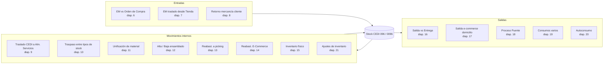

---

## 3. Prerrequisitos y conexión con otros procesos To-Be

La diapositiva 4 fija dos prerrequisitos duros para que WM opere: el **maestro de artículos** y las **ubicaciones**. Sin material dado de alta con sus datos de almacén y sin la maestra de ubicaciones cargada (racks, bloques, picking, e-commerce), ninguno de los flujos siguientes puede ejecutarse.

> [!warning] Diapositiva 4 — sólo enunciado
> El PDF sólo contiene los dos bullets ("Maestro de artículos", "Ubicaciones"). No hay detalle extraíble sobre qué campos del maestro de artículos (vistas WM, unidad de almacén, indicador de tipo de almacén, punto de reorden) ni sobre la nomenclatura de ubicaciones. Ese detalle debe buscarse en el documento To-Be de datos maestros.

La diapositiva 5 cruza cada escenario WM con la presentación To-Be donde vive el resto del proceso. Es el mapa de dependencias documentales:

| Proceso WM | Presentación To-Be donde se documenta el resto |
|---|---|
| Entrada de mercancías | Procesos To-Be **Compras** |
| Traslado desde tienda | **Reaprovisionamiento** |
| Reaprovisionamiento e-commerce | **Reaprovisionamiento** |
| Salida de mercancías e-commerce | **Pedido Venta e-commerce** |
| Salida de mercancías vs Entrega, Factura, Carta Porte, Salida traspaso | **Transporte** |

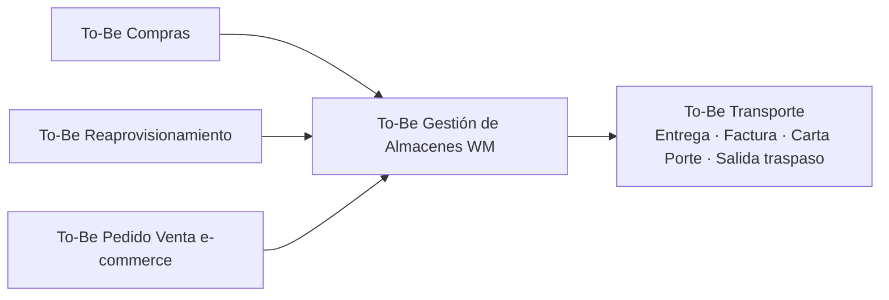

---

## 4. Entradas de mercancía

### 4.1 Entrada de mercancías vs orden de compra (diap. 6)

El flujo arranca con la **cita de proveedor** y la **entrega entrante**, y se apoya en un doble conteo en recibo antes de dar valor al stock. La clave del diseño es que la mercancía entra primero a **stock sin valor con el movimiento 103** y sólo se valoriza con el **movimiento 105** después de revisar los conteos y validar que existe factura.

Elementos que el diagrama menciona explícitamente: cita proveedor, entrega entrante, entrada de mercancías, Conteo 1 EM, Conteo 2 EM, revisión de conteos, monitor de conteos, posibilidad de **eliminar conteos** si es necesario, impresión de **etiqueta CB por UA** (unidad de almacén), impresión de **etiqueta ID por SKU** para identificación física, **Vale EM**, **formato de conteo ciego** y almacenamiento con y sin UA.

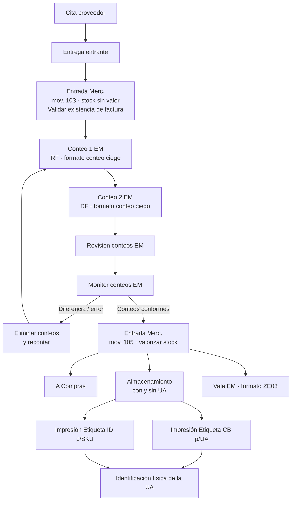

> [!tip] Regla de negocio — recepción en dos tiempos
> `103` = entrada a **stock bloqueado sin valor** (mercancía físicamente recibida pero aún no reconocida contablemente). `105` = **liberación y valorización** del stock, condicionada a que exista factura y a que los dos conteos ciegos cuadren. El "conteo ciego" implica que el contador no ve en RF la cantidad esperada.

> [!warning] Diagrama de la diap. 6 reconstruido, no literal
> La página 6 era una imagen de flujo de PowerPoint; el PDF entregó las cajas de texto sueltas y sin conectores. El orden mostrado arriba es la reconstrucción lógica más razonable a partir de los rótulos ("Conteo 1 EM", "Conteo 2 EM", "Revisión Conteos EM", "Monitor Conteos EM", "Ent. Merc. Valor Stock (mov.105)"). **No están extraídos los conectores ni las condiciones de decisión reales**; para el detalle exacto de ramas hay que abrir la diapositiva original.

### 4.2 Entrada de mercancías en CEDI por traslados desde tienda (diap. 7)

Es la recepción en CEDI de lo que devuelven o envían las tiendas. El origen puede ser de tres tipos —**traslado por devolución**, **traslado por envío a CEDI** y **traslado por material no recibido**— y a cada propósito le corresponde una clase de movimiento distinta:

| Situación de recepción | Clase de movimiento |
|---|---|
| Recepción para almacenamiento | **101** |
| Recepción con propósito específico | **901** |
| Descarga de tránsito de material no recibido | **Zxx** (movimiento Z, por definir) |

El proceso incluye un **conteo de EM con reporte de conteo** y una **consulta de tránsito** apoyada en el resumen de stock y en la transacción **MB5T** (stock en tránsito / traslados entre centros).

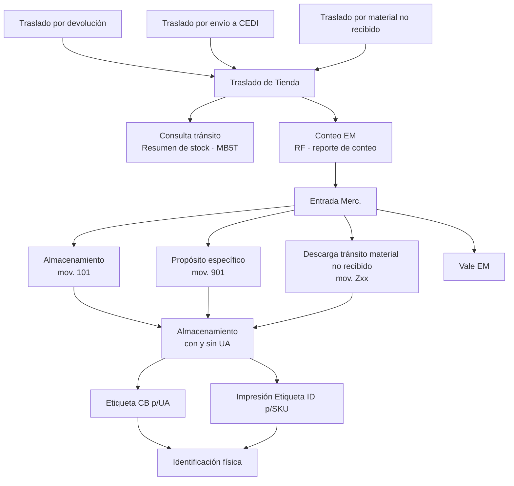

> [!warning] Diap. 7 — flujo parcialmente inferido
> Igual que la diap. 6, los conectores del diagrama no se extrajeron. Lo que sí es dato duro y textual son las tres clases de movimiento (101 / 901 / Zxx), los tres motivos de traslado, la transacción **MB5T** y los tres documentos impresos (Vale EM, Etiqueta CB p/UA, Etiqueta CB ID/SKU).

---

## 5. Retorno y devolución de mercancía de cliente

### 5.1 Retorno de mercancía de cliente (diap. 8)

Este es el flujo más ramificado del documento y tiene dos responsables funcionales distintos: **Retorno Mercancía (Logística)** y **Retorno Mercancía (Facturación)**.

- **Logística** ejecuta el retorno físico: imprime el reporte de facturas por transporte y actualiza una **tabla Z de Retorno de Mercancía** ([[Tablas Z]]).
- **Facturación** hace la **calificación de la factura** (entregada / no entregada), lleva el **control de intentos de envío** y **consume una API de MAVI para el cambio de estatus, únicamente en ventas e-commerce**.

La lógica de decisión que se lee en la diapositiva: si la mercancía retorna físicamente, se decide si hay **solicitud de devolución**; si la hay, se crea el **documento de devolución** y la **entrega** correspondiente. Si no la hay, se evalúa si se supera el **máximo número de envíos autorizados**; si no se supera, se elimina la entrega del transporte y se reprograma un **nuevo transporte** hacia el embarque a clientes. Las **facturas con pago en efectivo** derivan a **CxC** ([[FI]] / Cuentas por Cobrar).

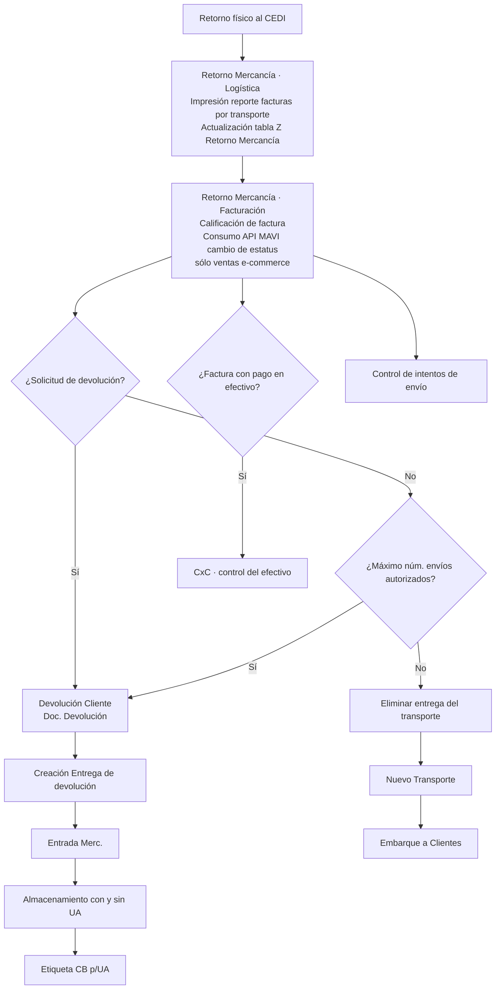

> [!warning] Diap. 8 — ramas Sí/No sin conector extraído
> El texto trae cuatro etiquetas sueltas ("Sí", "Sí", "No", "No") sin indicación de a qué rombo pertenece cada una. La asignación de ramas del diagrama anterior es **interpretación**, no lectura literal. Los nodos, los actores y las notas al pie sí son textuales.

> [!tip] Punto de integración con MAVI
> El único consumo de API externo citado en todo el documento aparece aquí: *"Consumo de API MAVI para cambio de estatus (sólo ventas e-commerce)"*. Contrasta con la diap. 28, que declara **cero integraciones** para WM — ver [[#16. Integraciones]].

---

## 6. Movimientos internos y traspasos

### 6.1 Traslado de CEDI a almacén de servicios (diap. 9)

Traslado **entre almacenes en dos pasos**, apoyado en la funcionalidad *kanban*:

| Paso | Movimiento | Resultado |
|---|---|---|
| Primer paso — salida del CEDI | **313** (funcionalidad kanban) | **Vale SM** |
| Segundo paso — entrada en Almacén Servicios | **315** | **Vale EM** |

Antes del movimiento IM hay trabajo WM: se consulta el stock, se determinan los artículos a trasladar y se hace un **Bin to Bin** para mover el stock de la ubicación de origen a la **ubicación de traslado**.

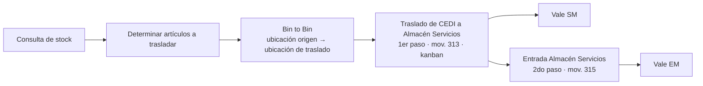

### 6.2 Traspaso entre tipos de stock (diap. 10)

Cambio de estado del stock (libre utilización, calidad, bloqueado) sin mover el material de dueño ni de código. El flujo WM es: selección manual del stock a traspasar por ubicaciones → traspaso entre tipos de stock → en caso de cantidades parciales, **Bin to Bin manual**.

**Clases de movimiento IM que involucran cambio de estado** (dato textual de la diapositiva):

| Movimiento | De → A |
|---|---|
| **321** | Calidad → Libre Utilización |
| **322** | Libre Utilización → Calidad |
| **344** | Libre Utilización → Bloqueado |
| **343** | Bloqueado → Libre Utilización |
| **349** | Bloqueado → Calidad |
| **350** | Calidad → Bloqueado |

> [!tip] Regla de negocio — sin almacenamiento mixto
> *"Las Unidades de Almacén no deben contener más de un tipo de stock (no se permite almacenamiento mixto)."* Esto obliga al subproceso de partición de pallet descrito abajo.

**Traspaso de cantidades parciales de un pallet (UA):** se crea una **OT manual con movimiento 888** por la cantidad parcial, se genera una **nueva UA con la misma TUA (tipo de unidad de almacén) que la UA origen** y se dispara la **impresión automática de la etiqueta CB del nuevo UA parcial** para su identificación física.

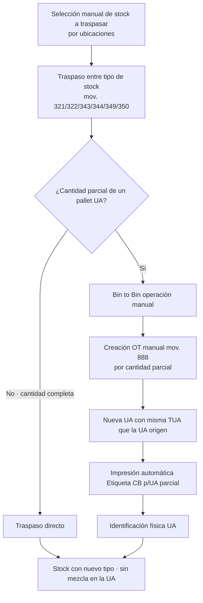

### 6.3 Traspaso de material — unificación (diap. 11)

Traspaso de stock **de un material a otro**. La diapositiva es explícita en dos restricciones: *"El proceso de Unificación se realiza esporádicamente y es por la cantidad completa"* — es decir, no admite parciales.

Genera **documento de material** y **documento contable**, y obliga a reimprimir la **etiqueta de identificación por SKU** porque el código del artículo cambia.

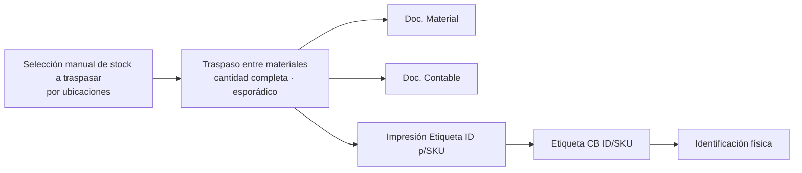

---

## 7. Ensamblado y desensamblado de artículos

La diapositiva 12 contiene **dos flujos simétricos**: alta de artículo ensamblado (agrupar) y descomposición de artículo ensamblado (desagrupar). Ambos parten de verificar la asignación de componentes para el **SET** y ambos producen documento de material y documento contable.

### 7.1 Alta de artículo ensamblado

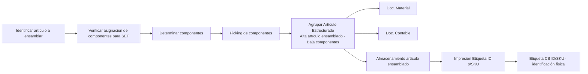

### 7.2 Descomposición de artículo ensamblado

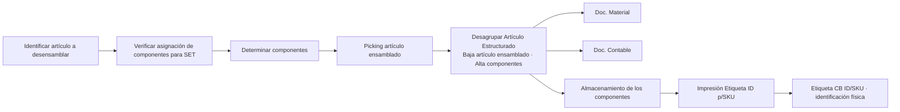

> [!example] Caso típico
> Un juego de sala ("SET") se recibe como componentes sueltos (sofá, love seat, sillón). Al agrupar, SAP da de baja los tres componentes y da de alta el código ensamblado, imprime su etiqueta ID/SKU y lo almacena como una sola unidad. La descomposición hace exactamente lo inverso cuando se necesita vender piezas por separado.

---

## 8. Reabastecimiento

### 8.1 Reabastecimiento a posiciones de picking (diap. 13)

Proceso **automático, ejecutado en fondo mediante Job**. Cuando un material queda por debajo de su **punto de reorden en la ubicación de picking**, el job borra las NT (necesidades de transporte) obsoletas, crea las nuevas NT y a partir de ellas crea las OT (órdenes de transporte). La **asignación de OT es orientada por el sistema de acuerdo con las colas de RF**, y la confirmación es guiada por sistema con lectura de datos de procedencia y de ubicación destino.

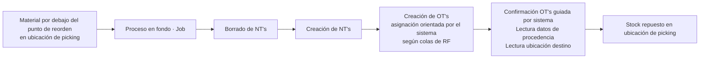

### 8.2 Reabastecimiento a E-Commerce (diap. 14)

El reaprovisionamiento del centro **E-Commerce (2000)** parte de la creación de un **pedido de traslado (PT)**. Los materiales y cantidades del PT son la **referencia para el movimiento de traspaso**, que se resuelve en tres piezas según el tipo de material:

| Caso | Movimiento / acción |
|---|---|
| Material **sin número de serie** | Traspaso IM **mov. 301** |
| Material **con número de serie** | Traspaso IM **mov. 901** |
| Ubicaciones WM | Traspaso de stock en ubicaciones **sin movimiento físico** |

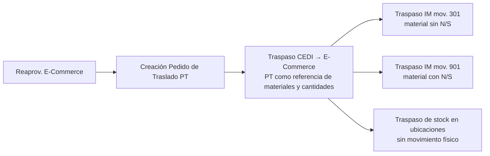

> [!tip] Sin movimiento físico
> El traspaso al centro E-Commerce es **contable/organizativo**: la mercancía no se mueve del piso del CEDI, sólo cambia de centro y de ubicación lógica. Por eso el delta de desarrollo pide una transacción Z ejecutada en fondo (ver [[#15. Backlog de deltas (desarrollos)]]).

---

## 9. Inventario físico y ajustes

### 9.1 Inventario físico (diap. 15)

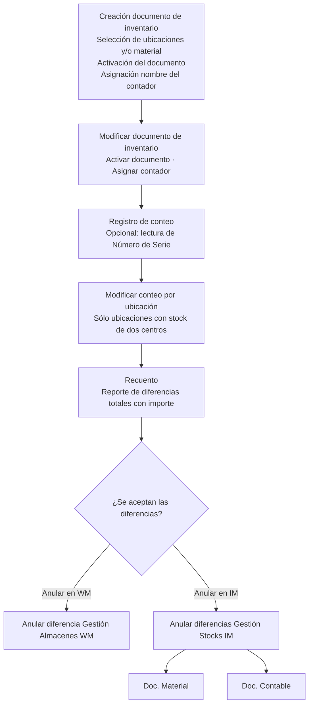

Puntos duros de la diapositiva: el documento de inventario se crea **seleccionando ubicaciones y/o material**, requiere **activación** y **asignación del nombre del contador**; el registro de conteo admite de forma **opcional la lectura del número de serie**; la modificación de conteo por ubicación aplica **sólo a ubicaciones con stock de dos centros** (el caso CEDI 096 / E-Commerce 2000 compartiendo piso); y la anulación de diferencias ocurre en dos niveles distintos, **WM** y **IM**, siendo la de IM la que genera documento de material y documento contable.

> [!warning] Diap. 15 — orden de las anulaciones
> El texto extraído no permite determinar si "Anular diferencia WM" precede obligatoriamente a "Anular diferencias IM" ni bajo qué condición se elige una u otra. Se representan como dos ramas alternativas; verificar contra la diapositiva original.

### 9.2 Movimientos de ajuste de inventario (diap. 21)

Flujo corto y no listado en la diapositiva 3: ante la **necesidad de un movimiento de ajuste**, se ejecuta un **alta de inventario** o una **baja de inventario**. La baja va precedida de **picking**; el alta desemboca en **almacenamiento**. Ambos generan documento de material y documento contable.

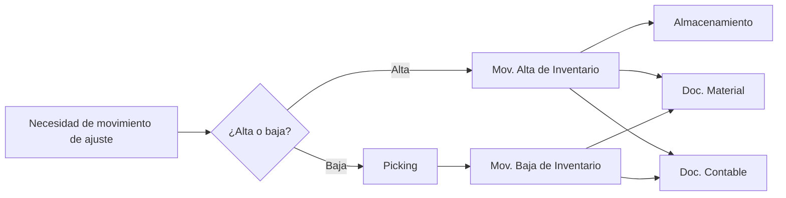

---

## 10. Salidas de mercancía

### 10.1 Salida mercancía vs Entrega de Salida (diap. 16)

Es el flujo troncal de expedición del CEDI y sirve tanto para **pedido de venta** como para **reaprovisionamiento a tienda**. La secuencia es: creación de la entrega → transporte → picking → **armado** (verificación de picking) → aprobación → salida de mercancías.

Detalles textuales relevantes:

- En la **creación de la entrega** se hace **verificación de disponibilidad (stock reservado)** y **validación de NS** (número de serie).
- En **transporte** se asignan entregas al transporte y se imprime el formato **RM0029 – Ruta de Reparto (armado de ruta)**.
- En el **picking** se hace **validación del número de envío** —la mercancía se toma físicamente de la **jaula 20**— y se **valida la Entrega del Proceso Puente**.
- El **armado** es una verificación de picking con ciclo de reproceso: si el armado no es correcto, se ejecuta el **desarmado de picking** y se vuelve a armar; existe una **consulta de armado** para revisión.
- Al final, la **salida de mercancías** dispara según el caso: para pedido de venta la **factura (ticket de venta)** y la **impresión del documento de embarque (cantidades e importes)**; para traslado a tienda la **impresión de Salida Traspaso**.

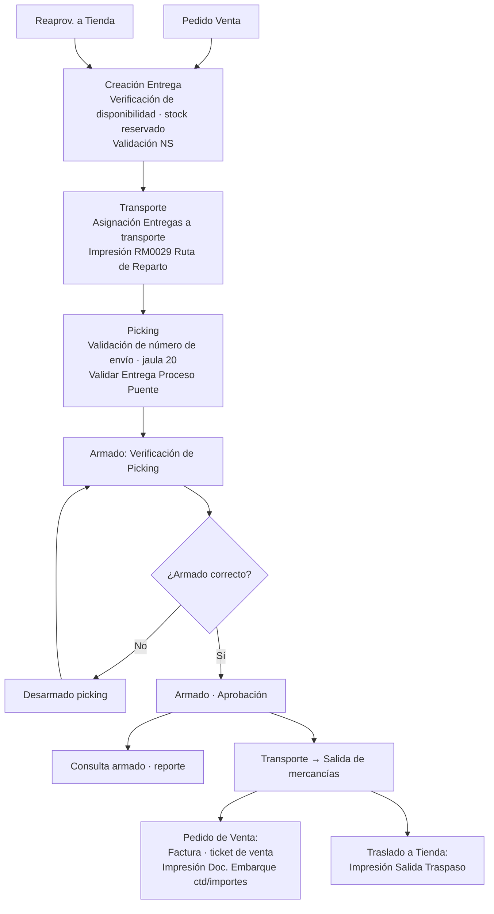

### 10.2 Salida mercancía e-commerce, despacho a domicilio desde CEDI (diap. 17)

Es el mismo esqueleto que 10.1 pero disparado por un **pedido de venta e-commerce**, con tres diferencias explícitas: el **centro suministrador es 2000 / 0096**, la salida genera además **Carta Porte**, y no aparece la rama de traslado a tienda.

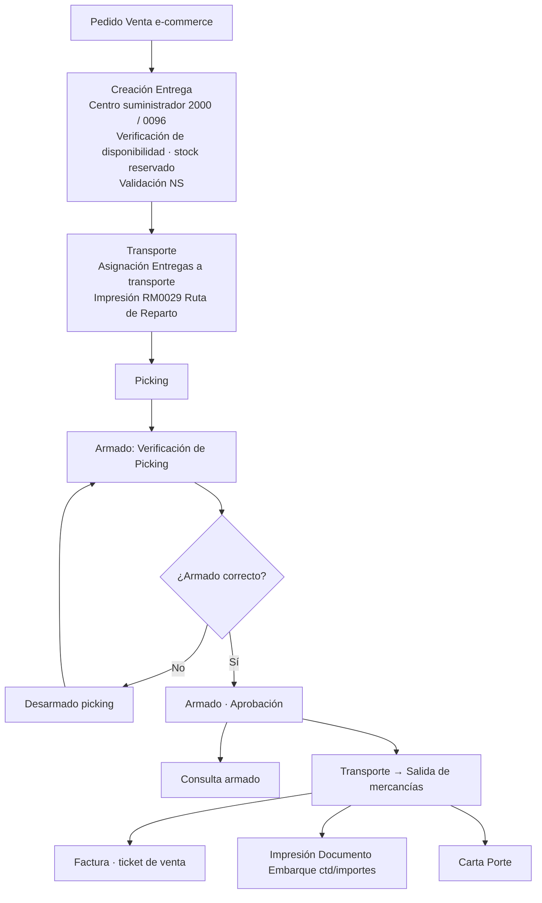

> [!warning] Diaps. 16 y 17 — conectores A/A y B/B
> Ambos diagramas usan conectores fuera de página rotulados **A** y **B** para cerrar el ciclo armado / desarmado. El PDF entregó las etiquetas sueltas y las palabras "Sí" y "No" sin origen. El ciclo de reproceso dibujado arriba es la lectura más coherente, pero la posición exacta de los saltos A y B debe confirmarse en el original.

---

## 11. Proceso Puente

La diapositiva 18 documenta el **pedido de traslado entre tiendas pasando por el CEDI**: la Tienda 1 no envía directo a la Tienda 2, sino que despacha al CEDI, éste recibe, cuenta y vuelve a despachar. Es el único flujo del documento que viene **numerado en el texto**, por lo que la secuencia sí es literal.

**Ramal 1 → CEDI (numeración arábiga):**

1. Pedido de traslado a Tienda 1
2. Despacho de mercancía: Entrega 1 → Picking → Salida de Mercancías
3. Embarque (Transporte) — con Entrega 1
4. Descarga física de artículos de la Entrega 1 en **jaulas 18 y 19**
5. Conteo vía **hand held** (reporte de conteo)
6. Entrada de mercancías en CEDI

**Ramal CEDI → Tienda 2 (numeración alfabética):**

- a. Pedido de traslado a CEDI
- b. Despacho de mercancía: Entrega 2 → Picking → Armado → Salida de Mercancías
- c. Embarque (Transporte) — con Entrega 1 y Entrega 2
- d. Entrada de mercancías en Tienda 2

Consultas de apoyo del proceso: **Resumen de stock** (para verificar tránsitos) y **Traslados entre centros (MB5T)**.

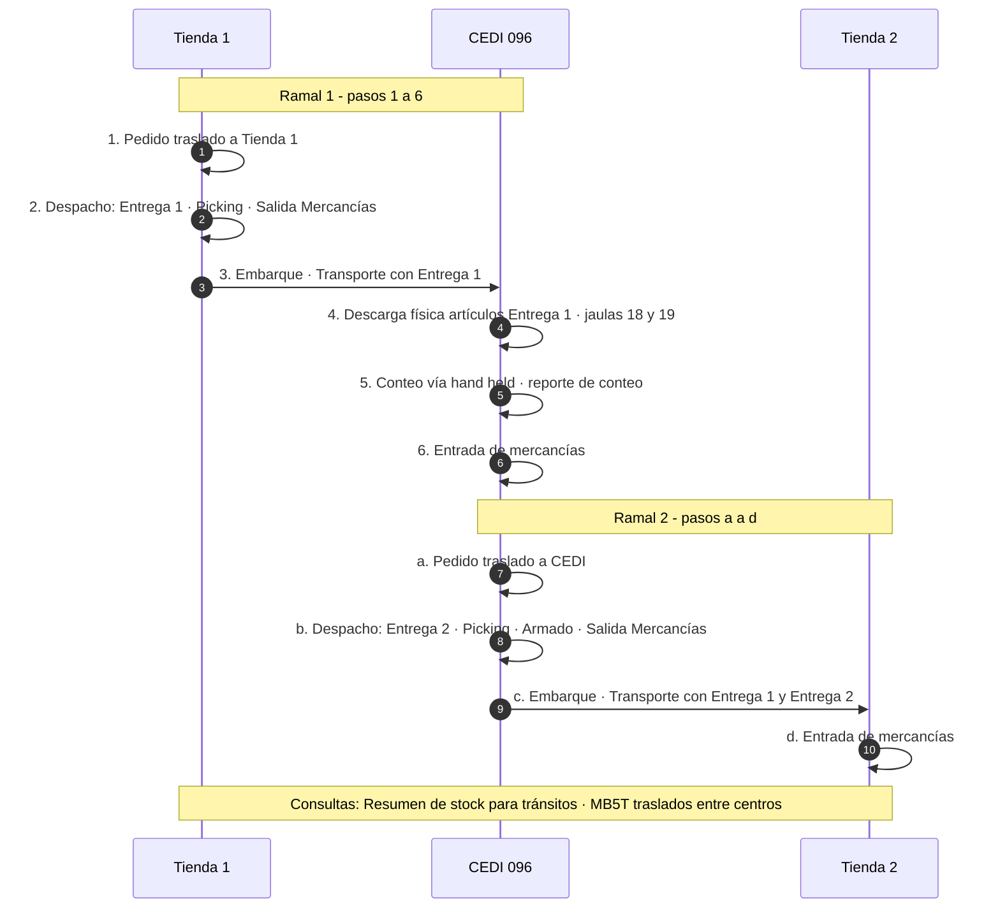

> [!tip] Enlace con la salida estándar
> El picking de la diapositiva 16 incluye explícitamente *"Validar Entrega Proceso Puente"*: la expedición del CEDI debe reconocer que una entrega proviene de un puente entre tiendas y no de un pedido de venta normal.

---

## 12. Consumos varios y autoconsumo

### 12.1 Salida consumos varios (diap. 19)

Tres destinos de consumo, todos precedidos de consulta de stock y picking, y todos con documento de material y documento contable:

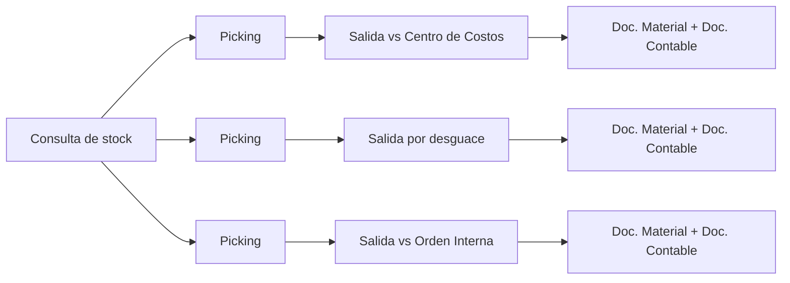

### 12.2 Autoconsumo (diap. 20)

El autoconsumo parte de una **necesidad de autoconsumo**, se hace **picking en WM** y se resuelve por dos vías: **salida contra centro de costos** (con documento de material y contable) o, cuando lo consumido se convierte en **activo**, la **creación del material activo** y su **entrada de material activo**. La diapositiva marca de forma expresa: **sólo en CEDI**.

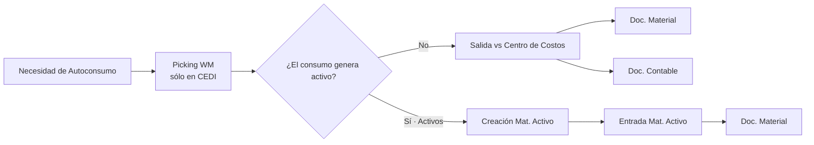

> [!warning] Diap. 20 — relación activos/centro de costos inferida
> El texto trae las cajas "Activos", "Creación Mat. Activo", "Entrada Mat. Activo" y "Salida vs Centro Costos" sin conectores. La bifurcación mostrada es una interpretación razonable; el original puede plantearlas como pasos consecutivos en lugar de alternativas.

---

## 13. Estructura organizativa y tipos de almacén

La diapositiva 22 define la estructura organizativa MAVI para WM. Hay **dos centros** (096 CEDI MAVI y 2000 E-Commerce) que comparten el **número de almacén 0096 – CEDI MAVI**, con un almacén **CEDI** colgando de cada centro.

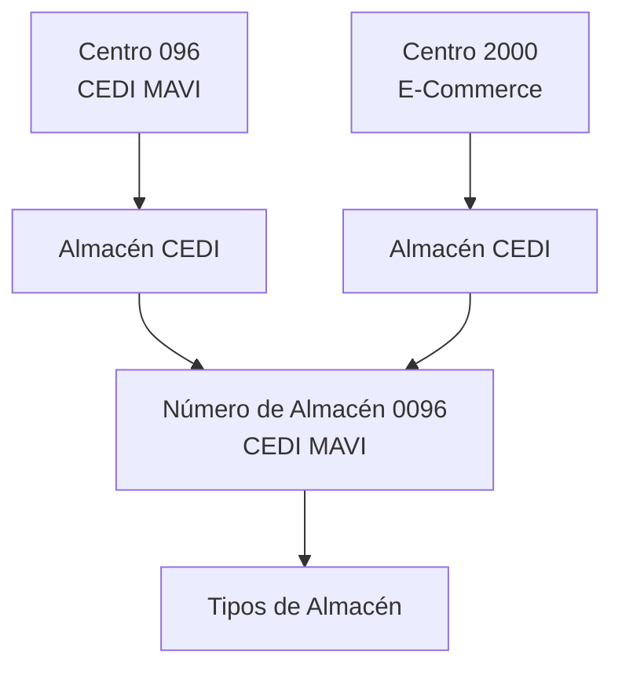

### Catálogo de tipos de almacén (diap. 22)

| Tipo | Descripción | Grupo |
|---|---|---|
| **800** | Recibo c/UA | Recepción |
| **801** | Recibo s/UA | Recepción |
| **810** | Rec. Tiendas c/UA | Recepción de tiendas |
| **811** | Rec. Tiendas s/UA | Recepción de tiendas |
| **820** | Pasillo c/UA | Pasillo |
| **821** | Pasillo s/UA | Pasillo |
| **890** | Z. Abierta Emergencia c/UA | Zona abierta |
| **891** | Z. Abierta Emergencia s/UA | Zona abierta |
| **100** | Rack Selectivo | Rack |
| **110** | Rack Mueblero | Rack |
| **120** | Rack Artículos Pequeños | Rack |
| **130** | Rack Alto Valor | Rack |
| **190** | Rack Pulmón | Rack |
| **300** | Bloque Motocicletas | Bloque |
| **310** | Bloque Línea Blanca | Bloque |
| **320** | Bloque Salas | Bloque |
| **330** | Bloque Juguetes | Bloque |
| **380** | Z. Abierta Línea Blanca | Zona abierta |
| **390** | Z. Abierta Pulmón | Zona abierta |
| **400** | Picking | Picking |
| **500** | E-Commerce Unidades Pequeñas | E-Commerce |

> [!tip] Patrón de nomenclatura
> Los tipos de almacén se emparejan **c/UA y s/UA** (con y sin unidad de almacén) en la misma familia: 800/801 recibo, 810/811 recepción de tiendas, 820/821 pasillo, 890/891 zona abierta de emergencia. Esto explica por qué todos los flujos de almacenamiento del documento dicen "Almacenamiento (con y sin UA)".

---

## 14. Requerimientos de configuración

Las diapositivas 23 a 25 listan los **deltas de configuración** por área. Se reproducen íntegros porque son el insumo directo del equipo de configuración.

### 14.1 Entrada de mercancías (diap. 23-24)

| Punto de configuración | Configuración propuesta |
|---|---|
| Formato de recepción de mercancías para conteo en recibo (conteo ciego) | **ZEMC – Conteo ciego** |
| Formato vale de entrada de mercancías | **ZE03 – Vale de entrada de mercancías** |
| Conteo 1 en EM | Transacción RF |
| Conteo 2 en EM | Transacción RF |
| Comparación de conteos | Transacción RF |
| Reporte de conteos en EM | Reporte |
| Etiqueta CB para Unidad de Almacén | Formulario |
| Bin to bin **con** UA | Transacción RF |
| Bin to bin **sin** UA | Transacción RF |
| Pedidos de traslado de tienda a CEDI | Clases de documento: **ZDT – Devolución Tienda**, **ZET – Envío Tienda a CEDI** |
| Diferenciar EM por traslado de tienda a CEDI cuando tiene un propósito | Clase de movimiento **901 – Entrada mercancías traslado tienda a CEDI** |
| Impresión de etiqueta de identificación por SKU cuando el proveedor no identifica correctamente el material | Transacción para imprimir etiqueta CB de identificación de SKU |
| Conteo de mercancía enviada al CEDI desde tienda | Transacción RF |
| Reporte del conteo de mercancía enviada al CEDI desde tienda | Reporte |

### 14.2 Devolución de cliente (diap. 24)

| Punto de configuración | Configuración propuesta |
|---|---|
| Control **logístico** de retorno de transporte a CEDI con facturas entregadas y no entregadas | Transacción y reporte para el control logístico de retorno de mercancía facturada (cliente no recibe mercancía) |
| Control **financiero** de retorno de transporte a CEDI con facturas entregadas y no entregadas | Transacción y reporte para el control financiero: **calificación de factura (Entregada / No entregada)** y **control del número de intentos de envío** |
| Formato Solicitud de Devolución | Formato de devolución asociado al pedido de devolución |

### 14.3 Gestión de ubicaciones (diap. 24)

| Punto de configuración | Configuración propuesta |
|---|---|
| Etiqueta CB ubicación **rack** | Formulario |
| Etiqueta CB ubicación **bloque** | Formulario |

### 14.4 Movimientos internos (diap. 25)

| Punto de configuración | Configuración propuesta |
|---|---|
| Traslado de stock entre ubicaciones **c/UA** | Transacción RF |
| Traslado de stock entre ubicaciones **s/UA** | Transacción RF |

### 14.5 Salida de mercancías y armado (diap. 25)

| Punto de configuración | Configuración propuesta |
|---|---|
| Impresión de formulario de salida de mercancías por traspaso a tiendas | Mensaje de salida de mercancías por traspaso asociado a la Entrega. **En segundas impresiones debe llevar la leyenda "Reimpresión"** |
| Impresión de formulario ticket de venta (el que firma el cliente) | Mensaje "Ticket de venta" asociado a la factura |
| Impresión de documento de embarque | Mensaje asociado al transporte, con relación de Entregas, artículos e importes |
| Verificación de picking (**armado**) | Transacción RF: verificar picking contra la cantidad en la Entrega y aprobar el armado (actualiza cantidades en la Entrega) |
| Consulta de verificación de picking | Reporte de consulta de armado |
| Eliminar verificación de picking (**desarmado**) | Transacción RF: eliminar la verificación de armado y actualizar cantidades en la Entrega |

> [!tip] El armado modifica la Entrega
> Tanto el armado como el desarmado **actualizan las cantidades de la Entrega**. Es el punto donde la realidad física del pallet armado se impone al documento comercial, y es también el que exige las validaciones de embarque del backlog de deltas.

> [!warning] Columnas vacías en las tablas de configuración
> Las tablas de las diapositivas 23-25 tienen una columna "Comentarios" que aparece **sin contenido** en el texto extraído. Puede estar vacía en el original o haberse perdido en la conversión.

---

## 15. Backlog de deltas (desarrollos)

Las diapositivas 26 y 27 recogen los desarrollos a medida. La tabla original tiene columnas *Escenario, Scope Item, Responsable, Historia de Usuario, Descripción*, pero **sólo Escenario, Scope Item y Descripción traen datos**; Responsable e Historia de Usuario están en blanco.

| Escenario | Necesidad (Scope Item) | Desarrollo propuesto |
|---|---|---|
| **Inventario físico** | En inventario físico a nivel WM existe el reporte estándar **LI20** con diferencias en cantidad e importe **por ubicación**; se requiere un reporte con diferencias **totales** en cantidad e importe | Agregar el importe correspondiente en el reporte/transacción de diferencias totales (**LI21**) |
| **Inventario físico** | Reporte de centros y almacenes con sus descripciones | Crear transacción que despliegue centros y almacenes con sus descripciones |
| **Inventario físico** | Actualizar conteo en documento de inventario | Crear transacción para actualizar el conteo en el documento de inventario |
| **Inventario físico** | Reporte de almacenes **RM1172A** | Reporte de centros y almacenes con sus respectivas descripciones |
| **Inventario físico** | Artículos más cancelados **RM1183** | Reporte con los artículos con mayor número de facturas canceladas y devoluciones de cliente |
| **Embarque** | Una factura entregada físicamente no puede sacarse de un transporte y agregarse a otro (no se puede volver a enrutar) | Validación en la funcionalidad de **modificación de transporte** |
| **Embarque** | Una factura contenida en un transporte ya en ruta y aún no entregada físicamente no puede anularse ni considerarse en pedido de devolución | Validación en la funcionalidad de **creación de pedido de devolución con referencia a factura** |
| **Embarque** | Una factura (Entrega) con devolución no puede asociarse a un nuevo transporte (validación asociada al proceso de reenvío) | Validación en la funcionalidad de **creación de transporte** |
| **Embarque** | Validaciones para que un vehículo pueda salir en ruta nuevamente | Validación en la funcionalidad de creación de transporte, con las reglas de negocio listadas abajo |
| **Reaprov. E-Commerce** | Traspaso de stock del CEDI al centro E-Commerce **sin movimiento físico** de mercancía a nivel piso | Desarrollar **transacción Z** (programa ejecutado en fondo – **Job**) que tome como referencia los materiales y cantidades del pedido de traslado de reaprovisionamiento a E-Commerce para realizar el traspaso CEDI → E-Commerce |

> [!tip] Reglas de negocio para que un vehículo vuelva a salir en ruta (diap. 27)
> 1. Facturas con calificación de **Entregado** con el cliente.
> 2. Traslados a Tienda con **Entrada de Mercancías contabilizada**.
> 3. **Proceso de retorno concluido** (muelle 20).
> 4. **Facturas pagadas en efectivo con pago registrado en sistema**.
>
> Nota del documento: para el número de placas del transporte físico se puede utilizar, como opción, el campo **Identif. ext. 1**.

```mermaid
flowchart TD
    V["Vehículo solicita salir en ruta nuevamente"] --> R1{"¿Todas las facturas<br/>calificadas como Entregado?"}
    R1 -->|"No"| BLOQ["Bloquear salida"]
    R1 -->|"Sí"| R2{"¿Traslados a Tienda con<br/>Entrada de Mercancías contabilizada?"}
    R2 -->|"No"| BLOQ
    R2 -->|"Sí"| R3{"¿Proceso de retorno concluido<br/>muelle 20?"}
    R3 -->|"No"| BLOQ
    R3 -->|"Sí"| R4{"¿Facturas en efectivo con<br/>pago registrado en sistema?"}
    R4 -->|"No"| BLOQ
    R4 -->|"Sí"| OK["Autorizar creación de transporte<br/>Placas en campo Identif. ext. 1"]
```

---

## 16. Integraciones

La diapositiva 28 es categórica: la tabla de integraciones trae una sola fila con **"NA / NA / No se identificaron integraciones / NA / NA"** en las columnas ID, Tipo, Nombre, Fuente y Destino.

> [!warning] Contradicción aparente con la diapositiva 8
> El listado de integraciones declara **cero integraciones** para WM, pero el flujo de retorno de mercancía (diap. 8) menciona explícitamente el *"Consumo de API MAVI para cambio de estatus (sólo ventas e-commerce)"*. Ese consumo debería estar registrado como integración o bien documentado en la presentación To-Be de e-commerce. **Punto a aclarar con el equipo funcional antes de cerrar el inventario de interfaces.**

---

## 17. Casos de uso, reportes y firma de aceptación

La diapositiva 29 fija el tratamiento de casos de uso y reportería:

- Los **casos de uso se retomarán en la etapa de Realización** y son la base de las **pruebas integrales y de aceptación de usuario**, que sirven para dar el VoBo de liberación del sistema para salida a Productivo.
- Los casos de uso contemplados son los de los archivos **CP SAP MAVI VF-3** y **SEGUIMIENTO AL PLAN DE PRUEBAS 14_JUL_23**.
- Para reportes existe un **listado de Reportería por área** que también se analizará en Realización, para validar qué cubre el estándar de SAP y qué reportes deberán hacerse a la medida por importancia para el negocio.

La diapositiva 30 es la **firma de aceptación del proceso To-Be** (nombre, correo, firma). La diapositiva 31 es la de cierre ("GRACIAS") y no aporta contenido.

| Nombre | Correo | Organización |
|---|---|---|
| David Lopez Orozco | dv.lopez@mavi.mx | MAVI |
| Omar Montserrat Castro Regalado | om.castro@mavi.mx | MAVI |
| Jose Francisco Coss Nuñez | jf.coss@mavi.mx | MAVI |
| Eduardo De Anda Garciarce | ed.deanda@mavi.mx | MAVI |
| Jorge De Anda Garciarce | jo.deanda@mavi.mx | MAVI |
| Diego De Anda Garciarce | di.deanda@mavi.mx | MAVI |
| Elizabeth A. García | ea.garcia@mavi.mx | MAVI |
| Israel García | is.garcia@mavi.mx | MAVI |
| Emmanuel Guerra | et.guerra@mavi.mx | MAVI |
| Leonid Rosas | lb.rosas@mavi.mx | MAVI |
| Rafael Nasta Hermoso | rafael.nasta@redsinergia.com | Red Sinergia |
| Adrian Morales Torres | adrian.morales@redsinergia.com | Red Sinergia |

> [!warning] Columna Firma vacía
> La columna "Firma" de la diapositiva 30 no tiene contenido en el texto extraído: el PDF es la versión sin firmar (archivo original marcado como *Solo lectura*, V1.1).

---

## Anexo A. Catálogo de clases de movimiento

Consolidado de todos los movimientos IM/WM citados en el documento, con la diapositiva de origen.

| Mov. | Uso en el proceso | Diap. |
|---|---|---|
| **101** | Entrada de mercancías de traslado de tienda para almacenamiento | 7 |
| **103** | Entrada de mercancías a stock **sin valor** (recepción contra OC, antes de conteos) | 6 |
| **105** | Entrada de mercancías con **valor de stock** (liberación tras conteos y validación de factura) | 6 |
| **301** | Traspaso IM CEDI → E-Commerce, material **sin número de serie** | 14 |
| **313** | Traslado entre almacenes, **primer paso** (funcionalidad kanban), CEDI → Almacén Servicios | 9 |
| **315** | Traslado entre almacenes, **segundo paso**, entrada en Almacén Servicios | 9 |
| **321** | Calidad → Libre Utilización | 10 |
| **322** | Libre Utilización → Calidad | 10 |
| **343** | Bloqueado → Libre Utilización | 10 |
| **344** | Libre Utilización → Bloqueado | 10 |
| **349** | Bloqueado → Calidad | 10 |
| **350** | Calidad → Bloqueado | 10 |
| **888** | OT manual para traspaso de **cantidad parcial de un pallet (UA)** | 10 |
| **901** | Doble uso: (a) EM traslado tienda → CEDI **con propósito específico**; (b) traspaso IM CEDI → E-Commerce de material **con número de serie** | 7, 14, 23 |
| **Zxx** | Descarga de tránsito de material **no recibido** (movimiento Z por definir) | 7 |

> [!warning] Movimiento Zxx sin definir
> La diapositiva 7 usa literalmente "Mov. Zxx" como marcador de posición. **El código real del movimiento Z para descarga de tránsito de material no recibido está pendiente de definición** y no aparece en el backlog de deltas de configuración de las diapositivas 23-25.

---

## Anexo B. Formularios, formatos y reportes citados

| Código / Nombre | Tipo | Uso | Diap. |
|---|---|---|---|
| **ZEMC** | Formato | Conteo ciego en recepción de mercancías | 23 |
| **ZE03** | Formato | Vale de entrada de mercancías | 23 |
| **ZDT** | Clase de documento | Pedido de traslado — Devolución Tienda | 23 |
| **ZET** | Clase de documento | Pedido de traslado — Envío Tienda a CEDI | 23 |
| **RM0029** | Formato | Ruta de Reparto (armado de ruta) | 16, 17 |
| **RM1172A** | Reporte | Reporte de almacenes: centros y almacenes con descripciones | 27 |
| **RM1183** | Reporte | Artículos más cancelados: mayor número de facturas canceladas y devoluciones de cliente | 27 |
| **MB5T** | Transacción SAP estándar | Stock en tránsito / traslados entre centros | 7, 18 |
| **LI20** | Transacción SAP estándar | Diferencias de inventario WM **por ubicación** (cantidad e importe) | 26 |
| **LI21** | Transacción SAP estándar | Diferencias **totales** de inventario — se le debe agregar el importe (delta) | 26 |
| Etiqueta CB p/UA | Formulario | Identificación física de la Unidad de Almacén | 6, 7, 8, 10 |
| Etiqueta CB ID/SKU | Formulario | Identificación física por SKU cuando el proveedor no identifica bien el material | 6, 7, 11, 12, 24 |
| Etiqueta CB ubicación rack / bloque | Formulario | Identificación de ubicaciones | 24 |
| Vale EM / Vale SM | Formulario | Comprobante de entrada / salida de mercancías | 6, 7, 9 |
| Documento de Embarque | Mensaje asociado a transporte | Relación de Entregas, artículos e importes | 16, 17 |
| Ticket de venta | Mensaje asociado a factura | Formulario que firma el cliente | 16, 17, 25 |
| Salida Traspaso | Mensaje asociado a la Entrega | Traslado a tienda; reimpresiones llevan leyenda "Reimpresión" | 16, 25 |
| Carta Porte | Documento fiscal | Salida e-commerce a domicilio | 17 |
| Formato Solicitud de Devolución | Formato | Asociado al pedido de devolución | 24 |

### Ubicaciones físicas con significado de proceso

| Ubicación | Significado | Diap. |
|---|---|---|
| **Jaula 20 / muelle 20** | Mercancía de retorno; el picking valida el número de envío tomando la mercancía de aquí, y el "proceso de retorno concluido (muelle 20)" es requisito para que el vehículo vuelva a salir en ruta | 16, 27 |
| **Jaulas 18 y 19** | Descarga física de los artículos de la Entrega 1 en el Proceso Puente | 18 |

---

## Anexo C. Qué NO se pudo extraer del PDF

> [!warning] Limitaciones de la conversión PowerPoint → PDF → texto
> Todas las diapositivas de flujo (**6 a 21**) eran diagramas de PowerPoint. La extracción entregó **las cajas de texto sueltas, sin conectores, sin flechas y con el orden visual perdido**. En consecuencia:
> - Los diagramas mermaid de las secciones 4, 5, 6, 7, 9.1, 10 y 12.2 son **reconstrucciones lógicas**, no transcripciones. Los nodos, las notas y los códigos son textuales; la topología de las flechas es inferida.
> - En las diapositivas **6, 8, 16 y 17** las etiquetas "Sí"/"No" y los conectores "A"/"B" aparecen huérfanos: no se sabe con certeza a qué rombo pertenece cada rama.
> - La diapositiva **2** (Objetivos) sólo tiene la agenda; no hay redacción de objetivos.
> - La diapositiva **4** (Prerrequisitos) sólo tiene dos bullets, sin detalle de campos ni de nomenclatura de ubicaciones.
> - La columna **Comentarios** de las tablas de configuración (diap. 23-25) y las columnas **Responsable** e **Historia de Usuario** del backlog (diap. 26-27) vienen vacías.
> - La columna **Firma** de la diapositiva 30 viene vacía.
> - La diapositiva **31** es de cierre y no aporta contenido.
>
> Para el trazado exacto de las flechas hay que abrir el archivo original: `Procesos_To-Be_Gestión_de_Almacenes-WM_V1.1.pptx`.

---

## Puntos abiertos para seguimiento

> [!warning] Pendientes detectados en la lectura
> 1. **Movimiento Zxx** sin código definido (diap. 7) y sin entrada en el backlog de configuración.
> 2. **Cero integraciones declaradas** (diap. 28) frente al consumo de **API MAVI de cambio de estatus** para e-commerce (diap. 8). Ver [[#16. Integraciones]].
> 3. **Tabla Z de Retorno de Mercancía** (diap. 8): no está especificada su estructura ni aparece en los requerimientos de configuración. Ver [[Tablas Z]].
> 4. Varios deltas de inventario físico **sin responsable ni historia de usuario asignados** (diap. 26-27).
> 5. La **modificación de conteo por ubicación** sólo aplica a ubicaciones con stock de dos centros (096 y 2000): hay que confirmar cómo se resuelve la convivencia de ambos centros sobre el mismo número de almacén 0096.

---

## Referencias cruzadas del proyecto

- [[WM]] · [[IM]] · [[MM]] · [[SD]] · [[FI]]
- [[Procesos To-Be Compras]] · [[Procesos To-Be Reaprovisionamiento]] · [[Procesos To-Be Pedido Venta e-commerce]] · [[Procesos To-Be Transporte]]
- [[CEDI]] · [[Centro 096]] · [[Centro 2000 E-Commerce]] · [[Número de Almacén 0096]]
- [[Tablas Z]] · [[Transacciones RF]] · [[Unidad de Almacén UA]] · [[Proceso Puente]]
- [[RSG]] · [[Red Sinergia]]

#migracion #SAP #WM #almacenes #ToBe
