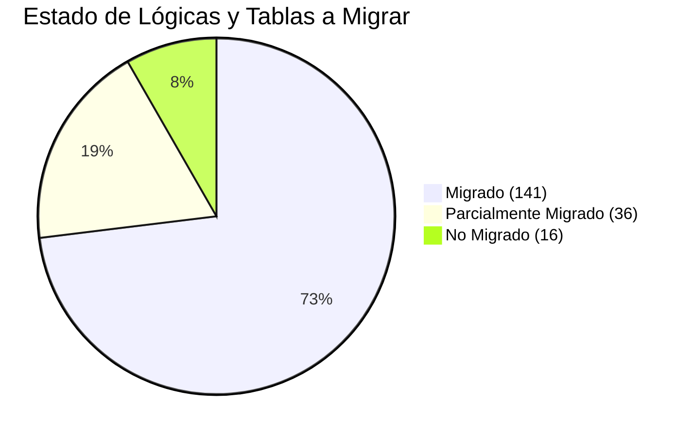

# Reporte de Estado de Migración a C# (Exportación de Artículos)

Este documento resume el progreso de la migración del proceso de Exportación de Artículos (MA, MAVI, VIU) desde sus Stored Procedures heredados hacia la arquitectura en C# (`EcommerceMethods.cs`).

## Resumen Global

El análisis exhaustivo de las tablas temporales y lógicas implementadas en el script original arroja los siguientes resultados para el flujo total:

- **Migrado:** 141 lógicas / tablas
- **Parcialmente Migrado:** 36 lógicas / tablas
- **No Migrado:** 16 lógicas / tablas

## Gráfico de Progreso

## Detalles por Clasificación

### Migrado (~73%)
La mayoría del flujo base para **Muebles América (MA)** se encuentra implementado correctamente. Esto incluye:
- Carga de productos base y evaluación inicial de exclusiones (códigos, marcas, sublineas).
- Cruces de inventario con reglas de almacenes primarios y secundarios (Reglas 1 a 6).
- Cálculo y asignación de precios consolidados para sucursales 0 y 90 (crédito y contado).
- Identificación de propiedades especiales de marketing (IE, Mayorista, Outlet).
- Construcción de árboles de jerarquía y propiedades de Magento base.
- Generación de lógicas para Upsells y Cross-sells estáticos.

### Parcialmente Migrado (~19%)
La mayor parte de esta clasificación pertenece a las plataformas **MAVI y VIU**, así como a la tabla final de volcado de MA:
- La arquitectura C# base está implementada, pero **los parámetros primarios (como la UEN 1, condición ACEF y sucursales) se encuentran declarados como constantes fuertemente acopladas (hardcoded) para Muebles América**. 
- Hasta que no se dinamicen estos valores en el constructor/orquestador, MAVI y VIU no podrán aprovechar de forma funcional el motor ya construido.
- El objeto y volcado final del contexto asume por ahora que solo se manejan artículos simples, limitando el alcance.

### No Migrado (~8%)
Esta clasificación enlista la deuda técnica funcional para que el desarrollo en C# sea un sustituto 1 a 1 de los SP originales:
- **Artículos Configurables:** Falta toda la lógica de consolidación de artículos Padres e Hijos para agrupar variables como tallas, colores o atributos (tablas `#configurables`, `#SKUprops`, `#configvariat`, `#ArticuloPadre`). Esto es vital para categorías como Calzado y Ropa.
- **Reglas Específicas de Region 6:** Filtros y exclusiones especiales para líneas como celulares.
- **Listados Prioritarios y Top 10:** Clasificaciones matemáticas para forzar el posicionamiento dentro del layout de eCommerce.
- **Relaciones exclusivas:** Casos particulares como la relación manual de VIU (`#padreshijos`).
