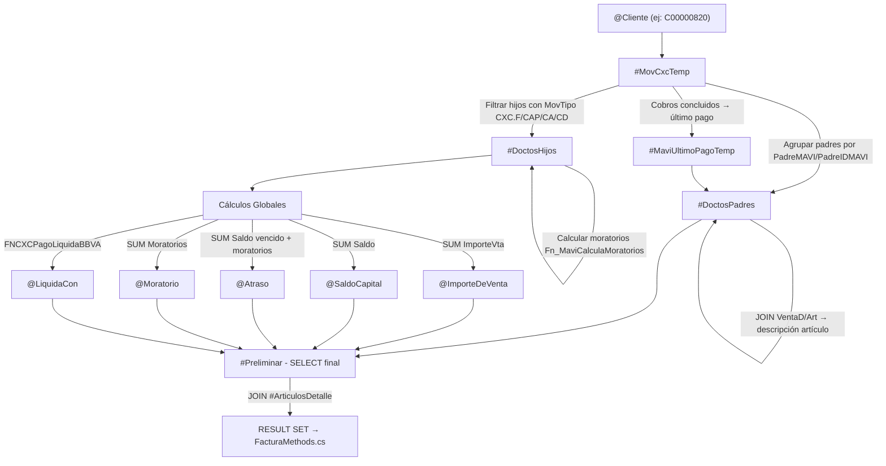

# Análisis SP: `SPCXCSaldosClientesPendiente`

> **Fuente:** [SPCXCSaldosClientesPendiente.sql](file:///C:/Users/magalindo/Documents/Migracion SAP/.agents/skills/lan-sap-migration/SPsOrden/SPCXCSaldosClientesPendiente.sql)
> **Consumido por:** [FacturaMethods.cs:L23](file:///c:/Users/magalindo/Documents/Migracion SAP/LAN/WebApiMagento/Metodos/FacturaMethods.cs#L23)
> **Endpoint DMZ:** `credit/getClienteSaldo/{cliente}` (GET)
> **Base de datos:** `IntelisisTmp`

---

## 1. Entrada (Parámetros)

| Parámetro | Tipo | Descripción |
|---|---|---|
| `@Cliente` | `varchar(10)` | Código del cliente Intelisis (ej: `C00000820`) |

---

## 2. Salida Final (SELECT principal — líneas 605-626)

El SP retorna **un result set** con las siguientes columnas por cada factura/documento padre:

| Columna SQL | Tipo | Mapeo en C# (`FacturaMethods.cs`) | Descripción |
|---|---|---|---|
| `ID` | `int` | — (no mapeado) | ID interno del documento padre en CXC |
| `Mov` | `varchar(20)` | — | Tipo de movimiento (ej: "Factura Menudeo") |
| `MovId` | `varchar(20)` | `factura.facturaId` | Número de factura (identificador visible) |
| `Estatus` | `varchar(15)` | `factura.estatus` | PENDIENTE / CONCLUIDO |
| `idCanalVenta` | `int` | — (no mapeado) | ID del canal de venta (ClienteEnviarA) |
| `Moratorios` | `money` | — (no mapeado por factura) | Intereses moratorios de esa factura |
| `FechaEmision` | `varchar` | `factura.fechaCompra` | Fecha de emisión formateada |
| `ImporteTotal` | `money` | `factura.totalFactura` | Importe de venta (0 si es Seguro Vida) |
| `PagoPuntual` | `int` | — (no mapeado) | Primer vencimiento pendiente +1 |
| `Abono` | `money` | — (no mapeado) | Saldo de docs vencidos |
| `NombreCliente` | `varchar` | `factura.nombreCliente` | Nombre del cliente desde tabla `Cte` |
| `importeVenta` | `money` | `Saldo.importeVenta` | **GLOBAL** — Suma de todos los importes de venta |
| `SaldoCapital` | `money` | `Saldo.saldoCapital` | **GLOBAL** — Suma de saldos pendientes (sin Seguro Vida) |
| `Atraso` | `money` | `Saldo.atraso` | **GLOBAL** — Saldo vencido + moratorios |
| `Moratorio` | `money` | `Saldo.moratorios` | **GLOBAL** — Total de intereses moratorios |
| `AdeudoVencido` | `money` | — (no mapeado) | **GLOBAL** — Atraso + Moratorio |
| `AdeudoTotal` | `money` | `Saldo.adeudoTotal` | **GLOBAL** — SaldoCapital + Moratorio |
| `LiquidaCon` | `money` | `Saldo.liquidaConSolo` | **GLOBAL** — Monto para liquidar con descuento BBVA |
| `CantArticulos` | `int` | `factura.articulos` | Cantidad de artículos en esa venta |
| `EnviarA` | `varchar` | — (vacío siempre `''`) | Campo fijo vacío |
| `ClienteIntelisis` | `varchar(10)` | `Saldo.clienteIntelisis` | El mismo `@Cliente` de entrada |

### Estructura JSON de respuesta (modelo C#):

```json
{
  "clienteIntelisis": "C00000820",
  "importeVenta": "45000.00",
  "saldoCapital": "32000.00",
  "atraso": "5200.00",
  "moratorios": "1200.00",
  "adeudoTotal": "33200.00",
  "liquidaConSolo": "30500.00",
  "facturas": [
    {
      "facturaId": "12345",
      "estatus": "PENDIENTE",
      "totalFactura": "15000.00",
      "fechaCompra": "01/15/24",
      "nombreCliente": "JUAN PEREZ LOPEZ",
      "articulos": "3"
    }
  ]
}
```

---

## 3. Tablas Utilizadas

### Tablas Principales (Intelisis)

| Tabla | Alias | Uso | Equivalencia SAP Potencial |
|---|---|---|---|
| **`Cxc`** | — | Cuentas por cobrar — movimientos del cliente | **EX01** (`ZAPI_EX01_NOCOMP_SRV`) — Partidas abiertas FI |
| **`CxcD`** | `CobD` | Detalle de CxC — aplicaciones de cobros | **EX01** — Detalle de partidas |
| **`CxcMavi`** | `CM` | Datos MAVI de CxC (días vencidos, días inactivos) | No existe directo en SAP |
| **`MovTipo`** | `MT` | Catálogo de tipos de movimiento por módulo | Config interna Intelisis |
| **`MovCampoExtra`** | `MCE` | Campos extra de movimientos (NC_COBRO, NC_FACTURA) | No existe directo en SAP |
| **`Cte`** | — | Maestro de clientes (nombre) | **BP05** (`ZAPI_BP05MA_SRV`) |
| **`Cte_Final`** | — | Cliente final (apellidos, RFC) | **BP05** |
| **`Venta`** | `V` | Documentos de venta (FormaPagoTipo) | **SD36** (`ZAPI_SD36_SRV`) |
| **`VentaD`** | `VD` | Detalle de venta (artículos) | **SD36** detalle |
| **`Art`** | — | Maestro de artículos (Descripcion1) | **DM01** (`ZAPI_DM01_SRV`) |
| **`Condicion`** | `CON` | Condiciones de pago (periodo, num documentos) | Config SAP (condiciones de pago) |
| **`VentasCanalMAVI`** | `CV` | Canal de venta (categoría) | Tabla Z SAP o config |
| **`AuxiliarP`** | `Mon` | Auxiliar para monedero (abonos módulo VTAS) | No existe directo en SAP |
| **`BonifSIMavi`** | `BM` | Bonificaciones SI — último pago | No existe directo en SAP |
| **`MaviBonificacionMoV`** | `MB` | Movimientos de bonificación | No existe directo en SAP |
| **`TcIRM0906_ConfigDivisionYParam`** | `Conf` | Config de división — parámetros DV/DI | Config interna |

### Funciones Utilizadas

| Función | Línea | Propósito |
|---|---|---|
| `dbo.Fn_MaviCalculaMoratorios(ID)` | 265 | Calcula intereses moratorios por documento |
| `dbo.FN_MAVIRM0906CobxPol(ID)` | 310 | Determina si el cobro es "por política" |
| `dbo.FNCXCPagoLiquidaBBVA(Mov, MovID)` | 514 | Calcula monto para liquidar con descuento BBVA |
| `dbo.FnMavi1erVencimPendPagoPP(Mov, MovID)` | 550 | Primer vencimiento pendiente (pago puntual) |

---

## 4. Flujo de Datos (Resumen)



---

## 5. Complejidad y Dependencias Críticas

> [!WARNING]
> Este SP tiene **alta complejidad** por las siguientes razones:

1. **4 funciones escalares propias** (`Fn_MaviCalculaMoratorios`, `FN_MAVIRM0906CobxPol`, `FNCXCPagoLiquidaBBVA`, `FnMavi1erVencimPendPagoPP`) — cada una tiene su propia lógica interna que habría que analizar por separado.
2. **16 tablas** involucradas entre JOINs directos y dentro de las funciones.
3. **Lógica de negocio compleja**: cálculo de moratorios, días inactivos, cobro por política, liquidación BBVA, enganche, monedero, bonificaciones.
4. **Tablas temporales encadenadas**: `#MovCxcTemp` → `#DoctosHijos` → `#DoctosPadres` → `#MaviUltimoPagoTemp` → `#Preliminar` → `#ArticulosDetalle`.

---

## 6. Equivalencia SAP Potencial

| Dato del SP | API SAP Candidata | Campo SAP | Disponible |
|---|---|---|---|
| Lista de facturas pendientes | **EX01** (`ZAPI_EX01_NOCOMP_SRV`) | Partidas abiertas por cliente | ✅ Ya migrado |
| Nombre del cliente | **BP05** (`ZAPI_BP05MA_SRV`) | `NameFirst`, `NameLast` | ✅ Ya migrado |
| Importe de venta original | **SD36** (`ZAPI_SD36_SRV`) | Documento de venta | ✅ Existe |
| Artículos de la venta | **SD36** + **DM01** | Detalle + maestro artículos | ✅ Existe |
| Moratorios / intereses | **No existe OData** | Lógica interna Intelisis | ❌ Requiere desarrollo ABAP o cálculo en C# |
| LiquidaCon (descuento BBVA) | **No existe OData** | Lógica interna Intelisis | ❌ Requiere desarrollo ABAP |
| Monedero / Bonificaciones | **No existe OData** | Lógica interna MAVI | ❌ Requiere desarrollo |
| Cobro por política | **No existe OData** | Regla interna MAVI | ❌ Requiere desarrollo |

> [!IMPORTANT]
> **Conclusión:** Los datos básicos (facturas pendientes, nombre, importes) se pueden obtener combinando **EX01 + BP05 + SD36**. Sin embargo, los cálculos derivados (moratorios, liquidaCon BBVA, monedero, cobro por política) son **lógica 100% propietaria de Intelisis/MAVI** que no tiene equivalencia directa en SAP estándar. Esas funciones tendrían que ser reimplementadas como:
> - Funciones ABAP en el backend SAP (ideal), o
> - Lógica de cálculo en C# dentro de ServicioSAP (alternativa), o
> - Tablas Z en SAP que almacenen los resultados precalculados
