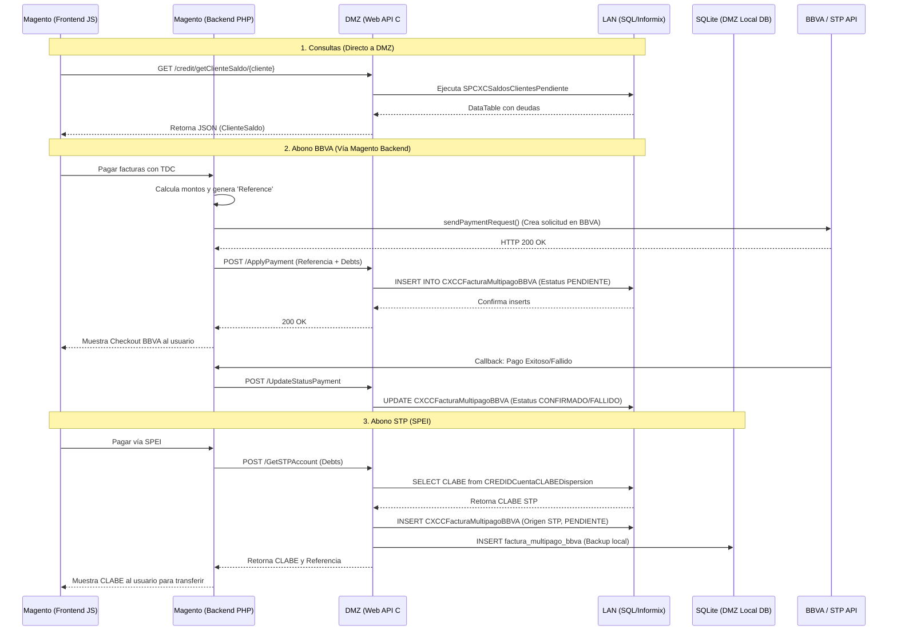

# 💸 Flujo de Abonos de Crédito: Magento -> DMZ -> LAN

Este documento detalla exhaustivamente el funcionamiento interno del flujo de consulta y pago de deudas de crédito (abonos). Analizaremos cada capa arquitectónica: **Magento (Frontend/PHP)**, **DMZ (WebAPI en C#)** y **LAN (Base de Datos Central SQL/Informix)**.

---

## 🔍 1. Consulta de Deudas y Facturas

Antes de realizar un abono, el cliente consulta su estado de cuenta. En la arquitectura actual, los métodos de consulta **no pasan por el backend de Magento (PHP)**, sino que el Frontend (Javascript/PWA) suele consumir la API de la DMZ directamente para aligerar la carga del e-commerce.

### 1.1 Consulta de Saldo Global
**1. Magento (Frontend):** 
Dispara una petición AJAX/Fetch tipo `GET /credit/getClienteSaldo/{cliente}` hacia la DMZ.

**2. DMZ (WebApi C#):**
*   **Controlador:** `CreditController.cs` (`GetClienteSaldo`)
*   **Lógica:** `FacturaMethods.cs` (`getClienteSaldo`)
*   Recibe el ID de cliente, valida mediante expresión regular (`^[C]{1}[0-9]{8}$`) y lo pasa a LAN.
*   Transforma el `DataTable` resultante en un objeto JSON (`ClienteSaldo`).

**3. LAN (SQL/Informix):**
*   **Procedimiento Almacenado:** `SPCXCSaldosClientesPendiente`
*   Calcula y devuelve el resumen financiero global: `ClienteIntelisis`, `importeVenta`, `SaldoCapital`, `Atraso`, `Moratorio`, `AdeudoTotal`, `LiquidaCon`.
*   Devuelve un listado de todas las facturas vigentes con saldo pendiente.

### 1.2 Consulta de Detalle por Factura
**1. Magento (Frontend):** 
Dispara una petición tipo `GET /credit/getClienteFactura/{cliente}/{factura}` hacia la DMZ.

**2. DMZ (WebApi C#):**
*   **Controlador:** `CreditController.cs` (`GetClienteFacturas`)
*   **Lógica:** `FacturaMethods.cs` (`getClienteFacturas`)
*   Recibe cliente y `movid` (ID de Factura). Separa los artículos en un arreglo. 
*   Identifica cargos extra (ej. Costo de Envío si el SKU es `SEGU00001`).
*   Calcula en tiempo real los totales aplicando Descuentos y Promociones al Subtotal.
*   Retorna un objeto `SaldoFactura` al frontend de Magento.

**3. LAN (SQL/Informix):**
*   **Procedimiento Almacenado:** `SPCXCSaldosClientesPDetalle`
*   Retorna el detalle exacto de movimientos por artículo de esa factura en particular.

---

## 💳 2. Flujo de Abonos (Pagos con BBVA)

El proceso de cobro sí interactúa profundamente con el backend de Magento (PHP) a través de los módulos `MultipagosNeko` o `MultipagosAvanzado`.

**Paso A: Creación de Intención de Pago (ApplyPayment)**

**1. Magento (Backend PHP):**
*   **Módulo:** `Mavi\MultipagosNeko\Model\MultipagosManagement.php` (Método: `applyPayment`)
*   **Proceso:** 
    1. Recibe el listado de facturas (`debts`) desde el Frontend y suma el monto total a pagar.
    2. Consulta información del cliente llamando a `loginClienteCredito`.
    3. Genera referencias únicas: `ReferenceToPayment` (para BBVA) y `ReferenceToDB` (para la base de datos).
    4. Ejecuta `sendPaymentRequest()` directo hacia la API de BBVA para generar la solicitud de cobro.
    5. **SI BBVA RESPONDE 200 (OK):** Magento hace un HTTP POST (`sendPostRequest`) hacia la DMZ (`url = getApplyPaymentUrl()`) enviando el `ClientNumber`, la `Reference` y los `Debts`.

**2. DMZ (WebApi C#):**
*   **Lógica:** `CustomerServiceMethods.cs` (`ApplyPaymentNeko` / `ApplyPaymentAdvanced`)
*   Recibe el listado de facturas y la referencia enviada por Magento.
*   Por cada factura (`debt`), prepara una instrucción `INSERT` SQL y la envía a LAN.

**3. LAN (SQL/Informix):**
*   Inserta en la tabla `CXCCFacturaMultipagoBBVA` los registros con los campos:
    *   `Monto`: Cantidad a abonar.
    *   `Referencia`: La generada por Magento.
    *   `EstatusPago`: **`PENDIENTE`**.
    *   `Origen`: `"BBVA"`.

**Paso B: Confirmación del Cobro (UpdateStatusPayment)**

**1. Magento (Backend PHP):**
*   Una vez que el cliente ingresa su tarjeta y BBVA aprueba o rechaza, Magento es notificado (vía callback o redirección) al método `updateStatusPayment` (en `MultipagosManagement.php`).
*   Magento se voltea hacia la DMZ y le dice "El pago de esta Referencia fue Exitoso/Fallido".

**2. DMZ (WebApi C#):**
*   Recibe el payload. Si el estado es exitoso (`Success == true` o código `00`), ejecuta un `UPDATE` masivo a LAN.

**3. LAN (SQL/Informix):**
*   Se actualiza la tabla `CXCCFacturaMultipagoBBVA` donde `Referencia` coincide. 
*   El `EstatusPago` cambia de `PENDIENTE` a **`CONFIRMADO`** o **`FALLIDO`**. (Para versión Advanced, se actualiza `FechaRastreoSTP = GETDATE()`).

---

## 🏦 3. Flujo de Abonos (Pagos con STP / SPEI)

Este flujo permite pagar las deudas mediante transferencia interbancaria (CLABE).

**1. Magento (Backend PHP):**
*   **Módulo:** `MultipagosNeko` o `MultipagosAvanzado`.
*   El usuario selecciona transferencia STP. Magento llama a su método interno `getSTPAccount()` el cual, a su vez, hace un POST hacia la DMZ (`/credit/GetSTPAccount`).

**2. DMZ (WebApi C#):**
*   **Lógica:** `CustomerServiceMethods.cs` (`GetSTPAccount`) y `CreditMethods.cs` (`SPCREDICredilana` / Extracción de CLABE).
*   Se comunica con LAN para verificar si el cliente ya tiene una CLABE asignada válida (`ValidacionTD = 4` en `CREDIDCuentaCLABEDispersion`).
*   Al igual que en BBVA, la DMZ inserta el desglose de facturas (`Debts`) en la base de datos de LAN.
*   **Operación adicional (SQLite):** Además de guardar en LAN, DMZ instancia `DB sqlite = new DB()` y replica la intención de pago en una base de datos local SQLite (tabla `factura_multipago_bbva`).
*   La DMZ responde a Magento devolviéndole la `cuenta` (CLABE) y la `referencia`.

**3. LAN (SQL/Informix):**
*   Almacena los registros en `CXCCFacturaMultipagoBBVA` con:
    *   `Monto`: Monto del abono.
    *   `EstatusPago`: **`PENDIENTE`**.
    *   `Origen`: **`STP`**.

---

## 📊 Diagrama de Secuencia Detallado (Full Stack)

---
### 📝 Notas Adicionales y Archivos Clave:
*   **`WebApiMagento\Metodos\FacturaMethods.cs`:** Contiene la lógica de extracción de saldos (`getClienteSaldo`, `getClienteFacturas`).
*   **`WebApiMagento\Metodos\CustomerServiceMethods.cs`:** Contiene toda la lógica de los abonos (registro de la intención de pago BBVA/STP y confirmaciones).
*   **`WebApiMagento\Metodos\CreditMethods.cs`:** Se encarga de la extracción de cuentas CLABE interbancarias (`SPCREDICredilana`).
