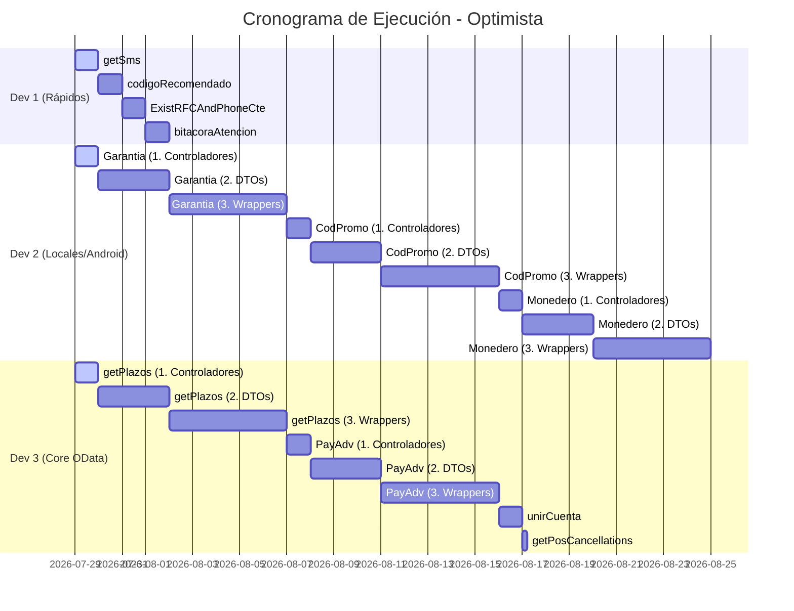
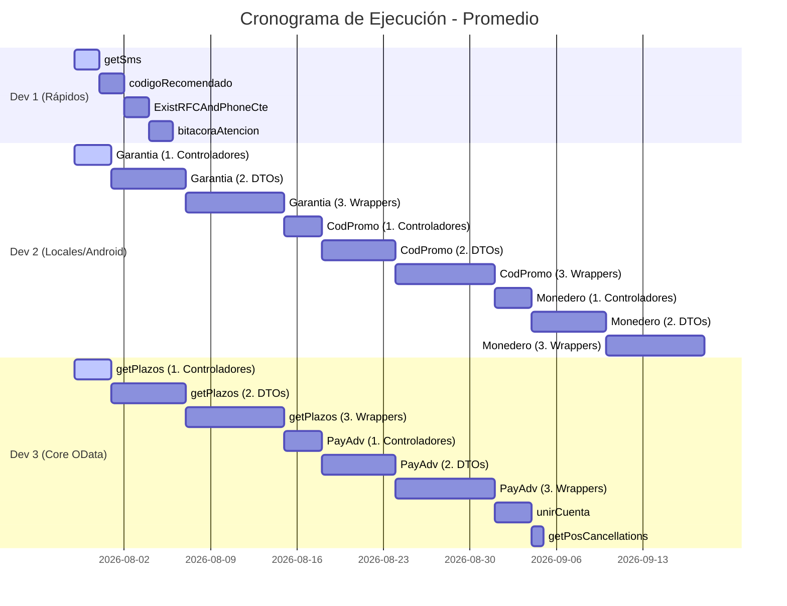
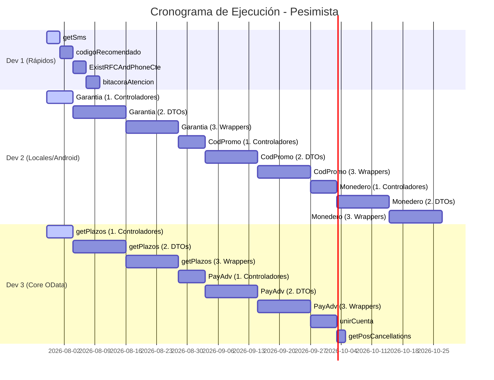

# Informe de Estimación de Tiempos y Asignación (GAP Crítico - Fase 1)

Este informe detalla el esfuerzo y cronograma proyectado para el desarrollo completo de los endpoints faltantes de la DMZ, contemplando un equipo de **3 Desarrolladores** trabajando en paralelo.

> [!NOTE]
> **Parámetros del Cálculo:**
> *   **Fecha de Inicio:** 29 de Julio de 2026
> *   **Esfuerzo base:** Ajustado con incrementos específicos por revisión del equipo.
> *   **Reglas de Asignación:**
>     *   **Dev 1 (Rápidos):** Asignado a tareas puntuales (originalmente estimadas en 1 día).
>     *   **Dev 2 (Integraciones Locales):** Tareas pesadas (> 1 día) que incluyan bases locales (Android/Sigmavi/SQLite) + balanceo de otras tareas largas.
>     *   **Dev 3 (Core OData):** Resto de tareas pesadas orientadas a SAP.
> *   *Nota: Las proyecciones asumen 1 día laboral = 8 horas. El tiempo total del proyecto está dictado por la **Ruta Crítica** (el desarrollador con mayor carga).*

---

## 📊 1. Desglose y Asignación de Tareas

| Módulo | Endpoint / Desarrollo | Base de Datos (OData/Local) | Asignado a | Optimista | Promedio | Pesimista |
| :--- | :--- | :--- | :--- | :---: | :---: | :---: |
| **Crédito** | `credit/getSms` | BD Local (Android/Sigmavi) | **Dev 1** | 1 día | 2 días | 3 días |
| **Crédito** | `credit/codigoRecomendado` | BD Local (Sigmavi) | **Dev 1** | 1 día | 2 días | 3 días |
| **Crédito** | `credit/ExistRFCAndPhoneCte` | SAP (BP05) | **Dev 1** | 1 día | 2 días | 3 días |
| **Customer Service** | `bitacoraAtencionClientes` | BD Local (Android/Sigmavi) | **Dev 1** | 1 día | 2 días | 3 días |
| **Customer Service** | `obtenerTipoGarantia` | SAP (SD08) + Android | **Dev 2** | 9 días | 17 días | 30 días |
| **Crédito** | `credit/codigoPromocion` | API Externa (SuccessFactors) | **Dev 2** | 9 días | 17 días | 30 días |
| **Crédito** | `credit/MonederoSaldoCredito` | SAP (SD18) | **Dev 2** | 9 días | 17 días | 30 días |
| **Crédito** | `credit/getPlazos` | SAP (SD40 - Nuevo) | **Dev 3** | 9 días | 17 días | 30 días |
| **Customer Service** | `ApplyPaymentAdvanced` (y Neko) | SAP (ZFICRUD_COBREF_SRV) | **Dev 3** | 9 días | 17 días | 30 días |
| **Customer Service** | `unirCuenta` | SAP (BP05 / ZSDT_CTE) | **Dev 3** | 1 día | 3 días | 6 días |
| **Órdenes** | `order/getPosCancellations` | SAP (SD48) | **Dev 3** | 5 horas | 8 horas | 2 días |
| **Órdenes** | `order/GetPickUpCode` | BD Local (Sigmavi) | **N/A** | Sin Estimar | Sin Estimar | Sin Estimar |

---

## 📈 2. Resumen Total y Ruta Crítica

Al paralelizar el trabajo entre 3 desarrolladores, el tiempo de entrega del proyecto se define por el tiempo del desarrollador con la carga más pesada (**Ruta Crítica**).

### Carga por Desarrollador
*   **Dev 1:** 12 días pesimista *(Finalizará sus tareas durante la tercera semana)*.
*   **Dev 2:** 90 días pesimista *(Determina la Ruta Crítica del proyecto)*.
*   **Dev 3:** ~68 días pesimista.

> [!IMPORTANT]
> **Duración del Proyecto (Basada en la Ruta Crítica del Dev 2):**
> *   **Tiempo Optimista Paralelizado:** 27 días laborales.
> *   **Tiempo Promedio Paralelizado:** 51 días laborales.
> *   **Tiempo Pesimista Paralelizado:** 90 días laborales.
>
> *(Si no hubiera paralelización, la suma secuencial de todas las tareas sería de 170 días pesimista).*

### Proyección de Fechas (A partir del 29 de Julio de 2026)

*Calculado considerando semanas de 5 días laborales.*

| Escenario | Días Laborales | Fecha Estimada de Finalización |
| :--- | :---: | :--- |
| 🟢 **Escenario Optimista** | 27 días | ~ 04 de Septiembre de 2026 |
| 🟡 **Escenario Promedio** | 51 días | ~ 09 de Octubre de 2026 |
| 🔴 **Escenario Pesimista** | 90 días | ~ 02 de Diciembre de 2026 |

---

## 🗺️ 3. Diagramas de Esfuerzo Paralelizado (Gantt)

*Los siguientes diagramas ilustran la ejecución simultánea de los 3 desarrolladores bajo cada escenario. Las tareas de gran magnitud (asignadas al Dev 2 y Dev 3) han sido seccionadas en sus fases constructivas (1. Controladores, 2. DTOs y Mapeos, 3. Wrappers OData).*

### 🟢 Escenario Optimista (27 Días Laborables)

### 🟡 Escenario Promedio (51 Días Laborables)

### 🔴 Escenario Pesimista (90 Días Laborables)

---

## 📝 4. Notas y Bloqueos (Zonas Grises)

*   **`order/GetPickUpCode` (Recoger en Tienda):** Esta tarea se mantiene marcada como **Sin Estimar** y no ha sido asignada a ningún desarrollador. Actualmente, el área de procesos no nos ha proporcionado la definición del proceso, API o flujo final para la generación de la **clave venta** (el código o PIN de seguridad utilizado por el cliente para recoger mercancía en tienda). Hasta no contar con la definición funcional o la interfaz a consumir, esta tarea se mantendrá en pausa.
